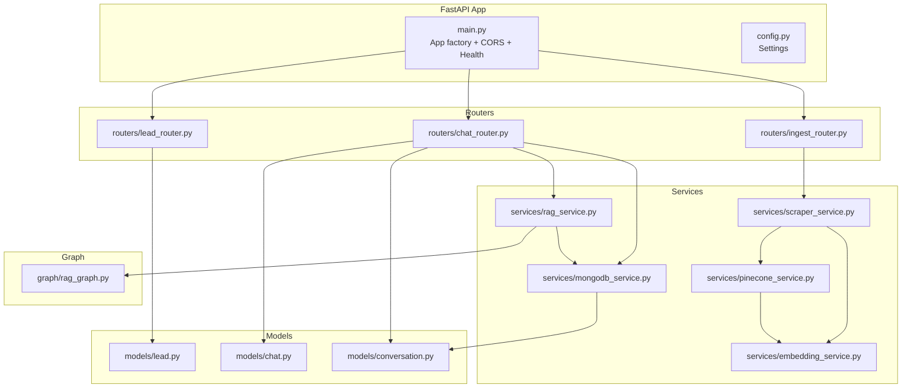
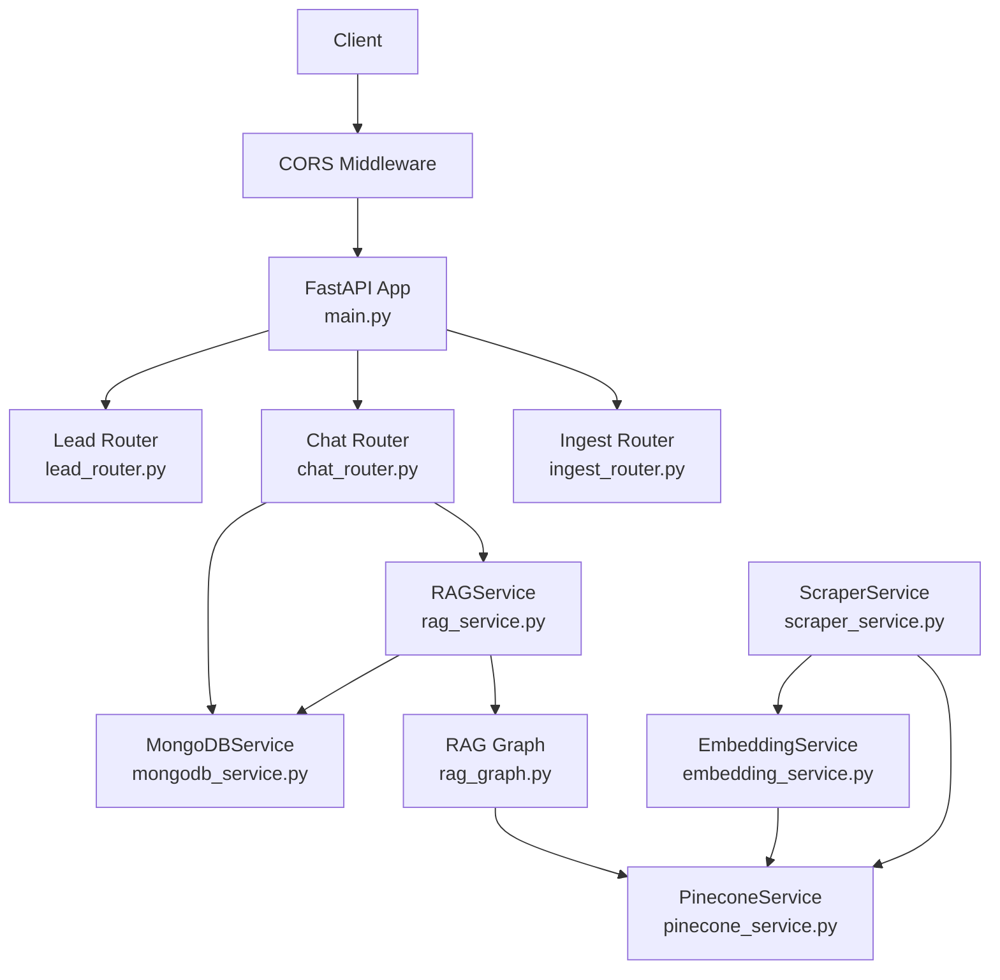
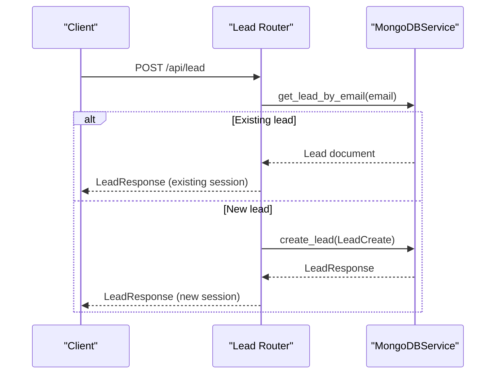
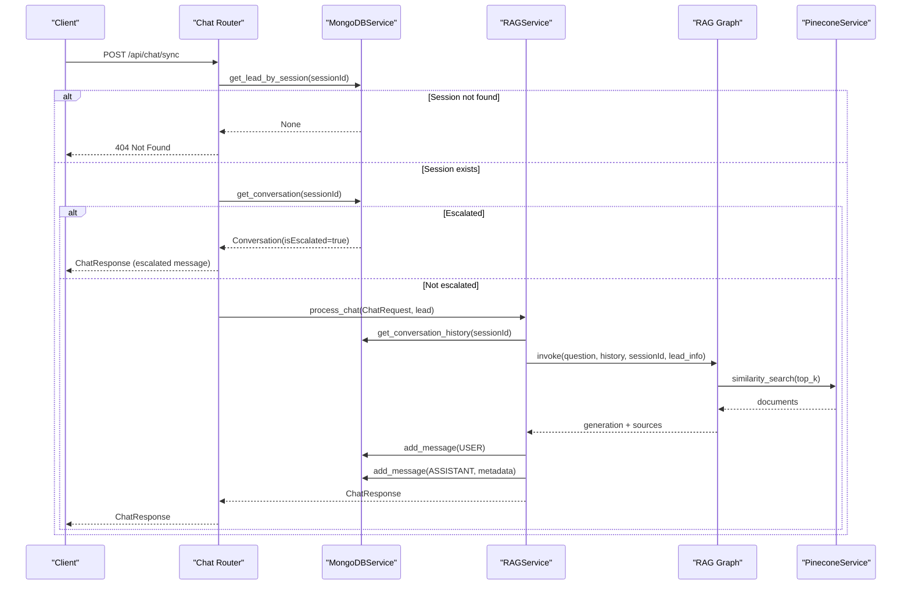
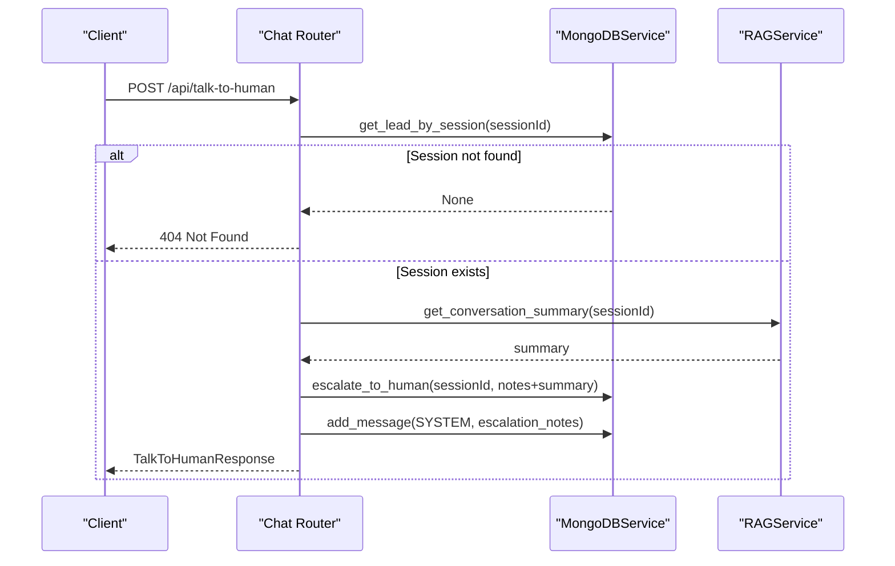
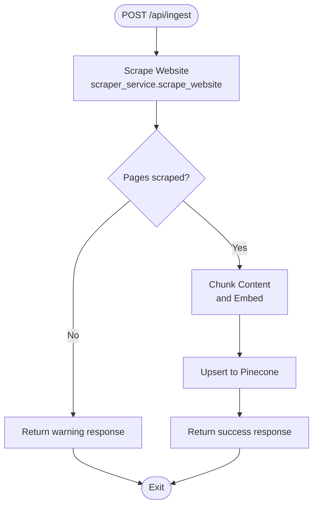
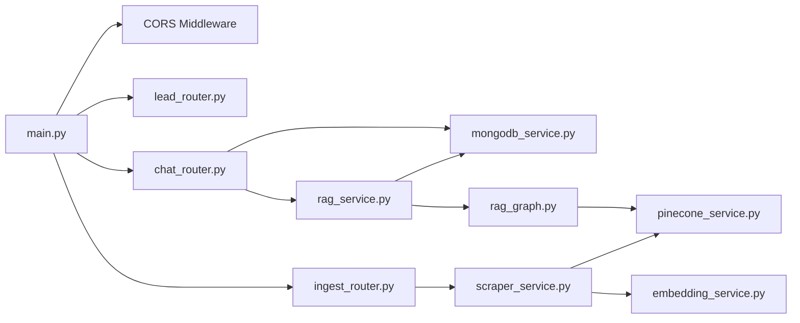

# Backend API Reference

<cite>
**Referenced Files in This Document**
- [main.py](file://backend/app/main.py)
- [config.py](file://backend/app/config.py)
- [lead_router.py](file://backend/app/routers/lead_router.py)
- [chat_router.py](file://backend/app/routers/chat_router.py)
- [ingest_router.py](file://backend/app/routers/ingest_router.py)
- [lead.py](file://backend/app/models/lead.py)
- [chat.py](file://backend/app/models/chat.py)
- [conversation.py](file://backend/app/models/conversation.py)
- [rag_service.py](file://backend/app/services/rag_service.py)
- [mongodb_service.py](file://backend/app/services/mongodb_service.py)
- [pinecone_service.py](file://backend/app/services/pinecone_service.py)
- [embedding_service.py](file://backend/app/services/embedding_service.py)
- [scraper_service.py](file://backend/app/services/scraper_service.py)
- [rag_graph.py](file://backend/app/graph/rag_graph.py)
- [requirements.txt](file://backend/requirements.txt)
</cite>

## Table of Contents
1. [Introduction](#introduction)
2. [Project Structure](#project-structure)
3. [Core Components](#core-components)
4. [Architecture Overview](#architecture-overview)
5. [Detailed Component Analysis](#detailed-component-analysis)
6. [Dependency Analysis](#dependency-analysis)
7. [Performance Considerations](#performance-considerations)
8. [Troubleshooting Guide](#troubleshooting-guide)
9. [Conclusion](#conclusion)
10. [Appendices](#appendices)

## Introduction
This document provides a comprehensive API reference for the FastAPI backend REST endpoints powering the Hitech RAG Chatbot. It covers HTTP methods, URL patterns, request/response schemas, authentication methods, error handling, and operational characteristics for the following endpoints:
- POST /api/lead
- POST /api/chat/sync
- POST /api/talk-to-human
- POST /api/ingest
- GET /api/conversation/{session_id}
- GET /api/health

It also documents CORS configuration, security considerations, rate limiting posture, and client integration guidelines.

## Project Structure
The backend is organized around routers, models, services, and a graph-based RAG pipeline:
- Routers define endpoints and orchestrate request handling.
- Models define request/response schemas.
- Services encapsulate data persistence, embeddings, vector storage, and scraping.
- The RAG graph orchestrates retrieval-augmented generation with LangGraph.

**Diagram sources**
- [main.py:39-89](file://backend/app/main.py#L39-L89)
- [lead_router.py:1-57](file://backend/app/routers/lead_router.py#L1-L57)
- [chat_router.py:1-130](file://backend/app/routers/chat_router.py#L1-L130)
- [ingest_router.py:1-112](file://backend/app/routers/ingest_router.py#L1-L112)
- [lead.py:1-64](file://backend/app/models/lead.py#L1-L64)
- [chat.py:1-45](file://backend/app/models/chat.py#L1-L45)
- [conversation.py:1-53](file://backend/app/models/conversation.py#L1-L53)
- [rag_service.py:1-116](file://backend/app/services/rag_service.py#L1-L116)
- [mongodb_service.py:1-202](file://backend/app/services/mongodb_service.py#L1-L202)
- [pinecone_service.py:1-186](file://backend/app/services/pinecone_service.py#L1-L186)
- [embedding_service.py:1-158](file://backend/app/services/embedding_service.py#L1-L158)
- [scraper_service.py:1-329](file://backend/app/services/scraper_service.py#L1-L329)
- [rag_graph.py:1-264](file://backend/app/graph/rag_graph.py#L1-L264)

**Section sources**
- [main.py:39-89](file://backend/app/main.py#L39-L89)
- [config.py:1-65](file://backend/app/config.py#L1-L65)

## Core Components
- FastAPI application with lifespan initialization connecting MongoDB and Pinecone, and exposing health checks.
- CORS middleware configured from environment settings.
- Routers:
  - Lead router: lead submission and retrieval by session.
  - Chat router: synchronous chat with RAG, human escalation, and conversation retrieval.
  - Ingest router: knowledgebase ingestion from a URL, status, and clearing operations.
- Services:
  - MongoDB service for leads and conversations.
  - RAG service orchestrating LangGraph pipeline and MongoDB persistence.
  - Pinecone service for vector operations.
  - Embedding service for BGE-M3 embeddings.
  - Scraper service for website ingestion.

**Section sources**
- [main.py:14-37](file://backend/app/main.py#L14-L37)
- [main.py:39-89](file://backend/app/main.py#L39-L89)
- [config.py:46-58](file://backend/app/config.py#L46-L58)
- [lead_router.py:1-57](file://backend/app/routers/lead_router.py#L1-L57)
- [chat_router.py:1-130](file://backend/app/routers/chat_router.py#L1-L130)
- [ingest_router.py:1-112](file://backend/app/routers/ingest_router.py#L1-L112)
- [mongodb_service.py:13-202](file://backend/app/services/mongodb_service.py#L13-L202)
- [rag_service.py:11-116](file://backend/app/services/rag_service.py#L11-L116)
- [pinecone_service.py:10-186](file://backend/app/services/pinecone_service.py#L10-L186)
- [embedding_service.py:10-158](file://backend/app/services/embedding_service.py#L10-L158)
- [scraper_service.py:26-329](file://backend/app/services/scraper_service.py#L26-L329)

## Architecture Overview
The system integrates FastAPI with MongoDB for persistence, Pinecone for vector storage, and LangGraph with Google Gemini for RAG. The ingestion pipeline scrapes content, chunks it, generates embeddings, and upserts vectors.

**Diagram sources**
- [main.py:39-89](file://backend/app/main.py#L39-L89)
- [lead_router.py:1-57](file://backend/app/routers/lead_router.py#L1-L57)
- [chat_router.py:1-130](file://backend/app/routers/chat_router.py#L1-L130)
- [ingest_router.py:1-112](file://backend/app/routers/ingest_router.py#L1-L112)
- [mongodb_service.py:13-202](file://backend/app/services/mongodb_service.py#L13-L202)
- [rag_service.py:11-116](file://backend/app/services/rag_service.py#L11-L116)
- [rag_graph.py:26-264](file://backend/app/graph/rag_graph.py#L26-L264)
- [embedding_service.py:10-158](file://backend/app/services/embedding_service.py#L10-L158)
- [pinecone_service.py:10-186](file://backend/app/services/pinecone_service.py#L10-L186)
- [scraper_service.py:26-329](file://backend/app/services/scraper_service.py#L26-L329)

## Detailed Component Analysis

### Endpoint: POST /api/lead
- Purpose: Submit a new lead and create a chat session. On existing email, returns the prior session.
- Authentication: Not required by the endpoint definition.
- Request body schema:
  - fullName: string (required)
  - email: string (required, email format)
  - phone: string (required, Saudi phone number format validator)
  - company: string (optional)
  - inquiryType: enum (optional)
- Response schema:
  - success: boolean
  - sessionId: string
  - message: string
  - lead: LeadInDB (optional)
- Error codes:
  - 500: Internal server error during lead creation.
- Usage pattern:
  - Client submits lead form; server responds with a sessionId to be used in subsequent chat requests.
- Notes:
  - Phone validation enforces Saudi phone formats.

**Diagram sources**
- [lead_router.py:11-44](file://backend/app/routers/lead_router.py#L11-L44)
- [mongodb_service.py:51-77](file://backend/app/services/mongodb_service.py#L51-L77)

**Section sources**
- [lead_router.py:11-44](file://backend/app/routers/lead_router.py#L11-L44)
- [lead.py:18-64](file://backend/app/models/lead.py#L18-L64)
- [mongodb_service.py:51-77](file://backend/app/services/mongodb_service.py#L51-L77)

### Endpoint: POST /api/chat/sync
- Purpose: Synchronous chat with RAG. Returns an AI response augmented by retrieved knowledge and conversation history.
- Authentication: Not required by the endpoint definition.
- Request body schema:
  - sessionId: string (required)
  - message: string (required, length 1–2000)
  - context: string (optional)
- Response schema:
  - response: string
  - sessionId: string
  - timestamp: datetime
  - sources: array of SourceDocument (optional)
  - model: string
- Behavior:
  - Validates session existence.
  - Checks escalation flag; if escalated, returns a predefined system message.
  - Invokes RAG pipeline with conversation history and lead info.
  - Persists user and assistant messages.
- Error codes:
  - 404: Session not found.
  - 500: Chat processing error.
- Usage pattern:
  - After obtaining sessionId from /api/lead, send messages with context if needed.

**Diagram sources**
- [chat_router.py:12-55](file://backend/app/routers/chat_router.py#L12-L55)
- [rag_service.py:19-87](file://backend/app/services/rag_service.py#L19-L87)
- [rag_graph.py:71-251](file://backend/app/graph/rag_graph.py#L71-L251)
- [mongodb_service.py:79-133](file://backend/app/services/mongodb_service.py#L79-L133)
- [pinecone_service.py:108-154](file://backend/app/services/pinecone_service.py#L108-L154)

**Section sources**
- [chat_router.py:12-55](file://backend/app/routers/chat_router.py#L12-L55)
- [chat.py:7-29](file://backend/app/models/chat.py#L7-L29)
- [rag_service.py:19-87](file://backend/app/services/rag_service.py#L19-L87)
- [rag_graph.py:71-251](file://backend/app/graph/rag_graph.py#L71-L251)
- [mongodb_service.py:79-133](file://backend/app/services/mongodb_service.py#L79-L133)

### Endpoint: POST /api/talk-to-human
- Purpose: Escalate a conversation to a human agent.
- Authentication: Not required by the endpoint definition.
- Request body schema:
  - sessionId: string (required)
  - notes: string (optional, max length 500)
  - urgency: string (default "normal")
- Response schema:
  - success: boolean
  - sessionId: string
  - message: string
  - estimatedResponseTime: string (default "Within 24 hours")
  - ticketId: string (optional)
- Behavior:
  - Validates session.
  - Generates a conversation summary.
  - Marks conversation as escalated and stores escalation notes.
  - Adds a system message to the conversation.
- Error codes:
  - 404: Session not found.
  - 500: Escalation error.
- Usage pattern:
  - Call after chat sync to transfer to human support.

**Diagram sources**
- [chat_router.py:58-117](file://backend/app/routers/chat_router.py#L58-L117)
- [rag_service.py:89-106](file://backend/app/services/rag_service.py#L89-L106)
- [mongodb_service.py:161-180](file://backend/app/services/mongodb_service.py#L161-L180)

**Section sources**
- [chat_router.py:58-117](file://backend/app/routers/chat_router.py#L58-L117)
- [chat.py:31-45](file://backend/app/models/chat.py#L31-L45)
- [rag_service.py:89-106](file://backend/app/services/rag_service.py#L89-L106)
- [mongodb_service.py:161-180](file://backend/app/services/mongodb_service.py#L161-L180)

### Endpoint: POST /api/ingest
- Purpose: Ingest knowledgebase content from a website URL into the vector store.
- Authentication: Not required by the endpoint definition.
- Request body schema:
  - url: string (optional)
  - max_pages: integer (optional, default 50)
- Response schema:
  - status: string
  - message: string
  - pages_scraped: integer (optional)
  - chunks_created: integer (optional)
- Behavior:
  - Scrapes website recursively up to max_pages.
  - Chunks content, generates embeddings, and upserts to Pinecone.
- Error codes:
  - 500: Ingestion failed or no pages scraped.
- Usage pattern:
  - Trigger after content updates on the source website.

**Diagram sources**
- [ingest_router.py:26-73](file://backend/app/routers/ingest_router.py#L26-L73)
- [scraper_service.py:195-248](file://backend/app/services/scraper_service.py#L195-L248)
- [scraper_service.py:250-306](file://backend/app/services/scraper_service.py#L250-L306)
- [pinecone_service.py:62-106](file://backend/app/services/pinecone_service.py#L62-L106)
- [embedding_service.py:106-126](file://backend/app/services/embedding_service.py#L106-L126)

**Section sources**
- [ingest_router.py:26-73](file://backend/app/routers/ingest_router.py#L26-L73)
- [scraper_service.py:195-306](file://backend/app/services/scraper_service.py#L195-L306)
- [pinecone_service.py:62-106](file://backend/app/services/pinecone_service.py#L62-L106)
- [embedding_service.py:106-126](file://backend/app/services/embedding_service.py#L106-L126)

### Endpoint: GET /api/conversation/{session_id}
- Purpose: Retrieve conversation history by session ID.
- Authentication: Not required by the endpoint definition.
- Path parameter:
  - session_id: string (required)
- Response schema:
  - Full conversation document including messages, timestamps, escalation flags, and metadata.
- Error codes:
  - 404: Conversation not found.
- Usage pattern:
  - Use to render chat history or for diagnostics.

**Section sources**
- [chat_router.py:120-129](file://backend/app/routers/chat_router.py#L120-L129)
- [conversation.py:23-53](file://backend/app/models/conversation.py#L23-L53)
- [mongodb_service.py:113-145](file://backend/app/services/mongodb_service.py#L113-L145)

### Endpoint: GET /api/health
- Purpose: System health check.
- Authentication: Not required by the endpoint definition.
- Response schema:
  - status: string
  - services: object with MongoDB and Pinecone connection status
- Usage pattern:
  - Use for monitoring and readiness probes.

**Section sources**
- [main.py:74-83](file://backend/app/main.py#L74-L83)

## Dependency Analysis
- CORS configuration is controlled by environment variables and applied globally.
- MongoDB and Pinecone are initialized at startup and remain connected during the app lifespan.
- Chat endpoint depends on MongoDB for session validation and conversation persistence, and on RAG service for generation.
- RAG service depends on LangGraph pipeline and Pinecone for retrieval.
- Ingest endpoint depends on ScraperService, EmbeddingService, and PineconeService.

**Diagram sources**
- [main.py:39-89](file://backend/app/main.py#L39-L89)
- [lead_router.py:1-57](file://backend/app/routers/lead_router.py#L1-L57)
- [chat_router.py:1-130](file://backend/app/routers/chat_router.py#L1-L130)
- [ingest_router.py:1-112](file://backend/app/routers/ingest_router.py#L1-L112)
- [rag_service.py:11-116](file://backend/app/services/rag_service.py#L11-L116)
- [rag_graph.py:26-264](file://backend/app/graph/rag_graph.py#L26-L264)
- [mongodb_service.py:13-202](file://backend/app/services/mongodb_service.py#L13-L202)
- [pinecone_service.py:10-186](file://backend/app/services/pinecone_service.py#L10-L186)
- [scraper_service.py:26-329](file://backend/app/services/scraper_service.py#L26-L329)
- [embedding_service.py:10-158](file://backend/app/services/embedding_service.py#L10-L158)

**Section sources**
- [main.py:39-89](file://backend/app/main.py#L39-L89)
- [config.py:46-58](file://backend/app/config.py#L46-L58)

## Performance Considerations
- Retrieval-augmented generation involves vector similarity search and LLM calls; latency depends on network and model response times.
- Pinecone upserts are batched; ingestion throughput scales with batch size and chunk count.
- MongoDB indexes are created for efficient lookups by sessionId, email, and timestamps.
- Conversation history is capped by configuration to limit context size and improve performance.

[No sources needed since this section provides general guidance]

## Troubleshooting Guide
- 404 Not Found:
  - Session not found on chat sync or talk-to-human.
  - Conversation not found on retrieval.
- 500 Internal Server Error:
  - Lead creation failure.
  - Chat processing error.
  - Escalation error.
  - Ingestion failure.
- Health check:
  - Verify MongoDB and Pinecone connectivity via /api/health.

**Section sources**
- [lead_router.py:40-44](file://backend/app/routers/lead_router.py#L40-L44)
- [chat_router.py:28-34](file://backend/app/routers/chat_router.py#L28-L34)
- [chat_router.py:72-78](file://backend/app/routers/chat_router.py#L72-L78)
- [chat_router.py:111-117](file://backend/app/routers/chat_router.py#L111-L117)
- [ingest_router.py:69-73](file://backend/app/routers/ingest_router.py#L69-L73)
- [main.py:74-83](file://backend/app/main.py#L74-L83)

## Conclusion
This API reference outlines the FastAPI backend’s endpoints, schemas, and operational behavior. Clients should:
- Obtain a sessionId via /api/lead before sending chat messages.
- Use /api/chat/sync for synchronous RAG responses.
- Escalate to human via /api/talk-to-human when needed.
- Trigger knowledgebase ingestion via /api/ingest after content updates.
- Retrieve conversation history via /api/conversation/{session_id}.
- Monitor system health via /api/health.

[No sources needed since this section summarizes without analyzing specific files]

## Appendices

### Security Considerations
- Authentication: No authentication is enforced by the endpoint definitions. Consider adding JWT, API keys, or OAuth at the application layer if required.
- CORS: Controlled by environment variable CORS_ORIGINS; defaults are permissive. Configure to specific origins in production.
- Secrets: API keys for Pinecone and Google Gemini are loaded from environment variables.

**Section sources**
- [config.py:15-30](file://backend/app/config.py#L15-L30)
- [config.py:46-58](file://backend/app/config.py#L46-L58)
- [main.py:50-57](file://backend/app/main.py#L50-L57)

### Rate Limiting
- No built-in rate limiting is present in the codebase. Consider integrating a rate limiting library (e.g., Starlette or custom middleware) to protect endpoints under load.

[No sources needed since this section provides general guidance]

### Client Implementation Guidelines
- Session lifecycle:
  - Submit lead to receive sessionId.
  - Use sessionId for all chat and escalation requests.
- Chat flow:
  - Send POST /api/chat/sync with message and optional context.
  - Render response and optionally display sources.
- Escalation:
  - Send POST /api/talk-to-human with notes and urgency.
  - Display ticketId and estimated response time.
- Ingestion:
  - Trigger POST /api/ingest after content changes.
  - Optionally poll status via GET /api/ingest/status.
- Health monitoring:
  - Poll GET /api/health for readiness.

[No sources needed since this section provides general guidance]

### Configuration Options
- Application and services:
  - APP_NAME, DEBUG, BACKEND_URL
  - MONGODB_URI, MONGODB_DB_NAME
  - PINECONE_API_KEY, PINECONE_ENVIRONMENT, PINECONE_INDEX_NAME, PINECONE_DIMENSION
  - GEMINI_API_KEY, GEMINI_MODEL, GEMINI_TEMPERATURE, GEMINI_MAX_TOKENS
  - RAG_TOP_K, RAG_SIMILARITY_THRESHOLD, CHUNK_SIZE, CHUNK_OVERLAP
  - SESSION_TTL_HOURS, MAX_CONVERSATION_HISTORY
  - SCRAPE_BASE_URL, SCRAPE_MAX_PAGES, SCRAPE_DELAY
  - CORS_ORIGINS

**Section sources**
- [config.py:7-64](file://backend/app/config.py#L7-L64)

### Dependencies
- Core stack includes FastAPI, uvicorn, MongoDB driver (motor), Pinecone client, LangChain/LangGraph, BGE-M3 embeddings, BeautifulSoup/requests, and Google Gemini.

**Section sources**
- [requirements.txt:1-48](file://backend/requirements.txt#L1-L48)