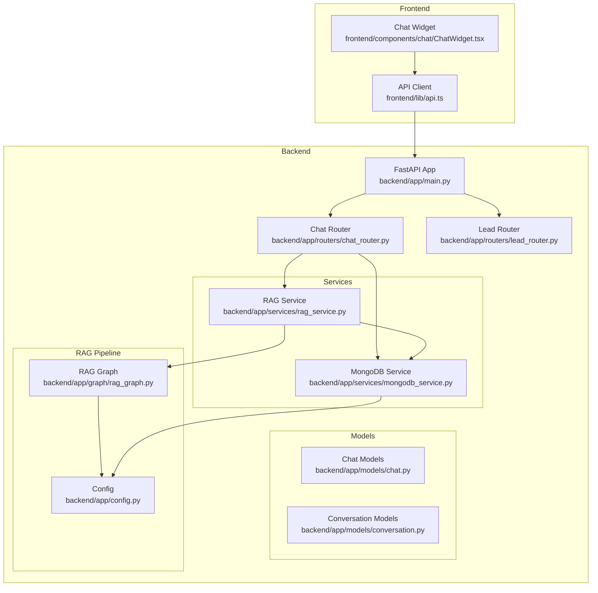
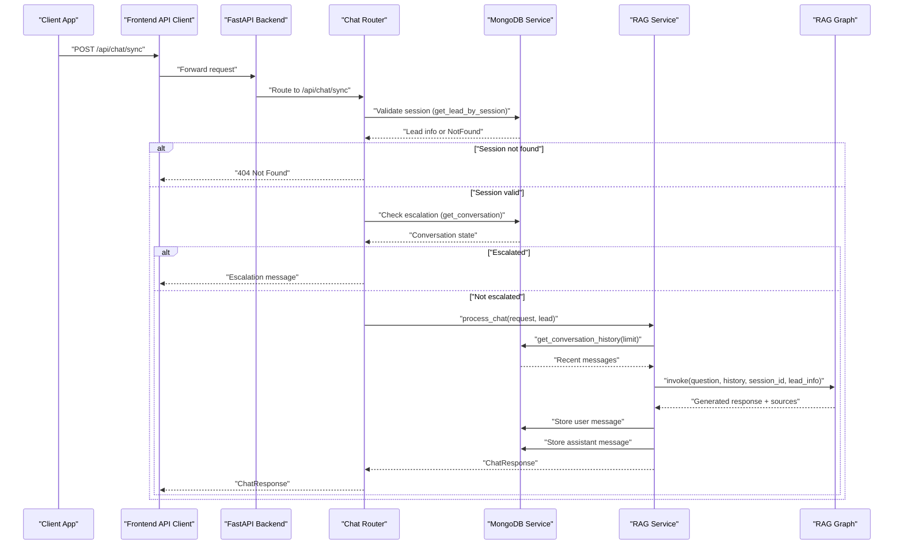
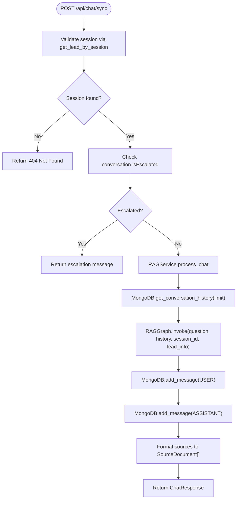
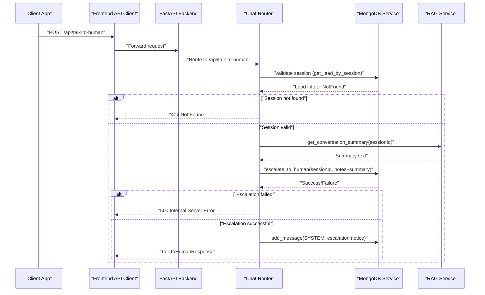
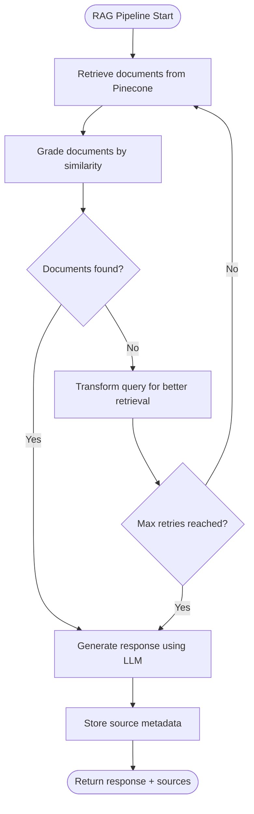
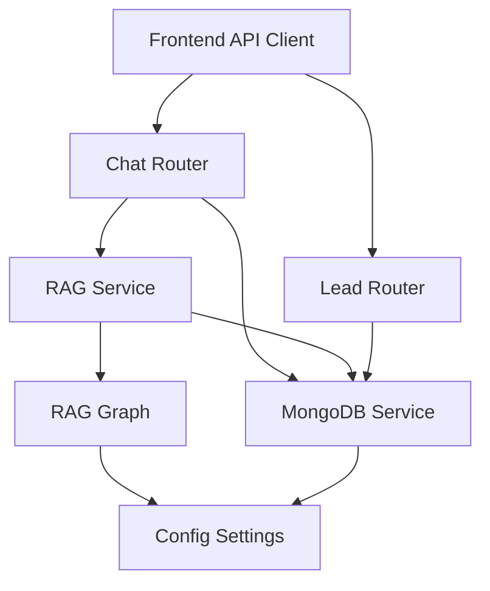

# Chat Communication API

<cite>
**Referenced Files in This Document**
- [main.py](file://backend/app/main.py)
- [chat_router.py](file://backend/app/routers/chat_router.py)
- [lead_router.py](file://backend/app/routers/lead_router.py)
- [chat.py](file://backend/app/models/chat.py)
- [conversation.py](file://backend/app/models/conversation.py)
- [rag_service.py](file://backend/app/services/rag_service.py)
- [rag_graph.py](file://backend/app/graph/rag_graph.py)
- [mongodb_service.py](file://backend/app/services/mongodb_service.py)
- [config.py](file://backend/app/config.py)
- [api.ts](file://frontend/lib/api.ts)
- [ChatWidget.tsx](file://frontend/components/chat/ChatWidget.tsx)
</cite>

## Table of Contents
1. [Introduction](#introduction)
2. [Project Structure](#project-structure)
3. [Core Components](#core-components)
4. [Architecture Overview](#architecture-overview)
5. [Detailed Component Analysis](#detailed-component-analysis)
6. [Dependency Analysis](#dependency-analysis)
7. [Performance Considerations](#performance-considerations)
8. [Troubleshooting Guide](#troubleshooting-guide)
9. [Conclusion](#conclusion)

## Introduction
This document provides comprehensive API documentation for the chat communication endpoints designed for synchronous chat with Retrieval-Augmented Generation (RAG) processing, human escalation workflows, and conversation history retrieval. It covers request/response schemas, session validation, conversation memory handling, and RAG pipeline integration, along with practical examples and error handling strategies.

## Project Structure
The chat communication API is implemented in a FastAPI backend with integrated RAG capabilities powered by LangGraph and vector search. The frontend integrates with these endpoints to provide a seamless chat experience.

**Diagram sources**
- [main.py:1-90](file://backend/app/main.py#L1-L90)
- [chat_router.py:1-130](file://backend/app/routers/chat_router.py#L1-L130)
- [lead_router.py:1-57](file://backend/app/routers/lead_router.py#L1-L57)
- [rag_service.py:1-116](file://backend/app/services/rag_service.py#L1-L116)
- [rag_graph.py:1-264](file://backend/app/graph/rag_graph.py#L1-L264)
- [mongodb_service.py:1-202](file://backend/app/services/mongodb_service.py#L1-L202)
- [config.py:1-65](file://backend/app/config.py#L1-L65)

**Section sources**
- [main.py:1-90](file://backend/app/main.py#L1-L90)
- [chat_router.py:1-130](file://backend/app/routers/chat_router.py#L1-L130)
- [lead_router.py:1-57](file://backend/app/routers/lead_router.py#L1-L57)

## Core Components
This section outlines the primary components involved in chat communication, including request/response models, conversation handling, and RAG processing.

- **Chat Request/Response Models**: Define the structure for chat messages, responses, and human escalation requests.
- **Conversation Models**: Manage message roles, conversation state, and escalation tracking.
- **MongoDB Service**: Handles lead creation, conversation persistence, message storage, and escalation marking.
- **RAG Service**: Orchestrates conversation history retrieval, LangGraph pipeline execution, and response formatting.
- **RAG Graph**: Implements the LangGraph workflow with document retrieval, grading, query transformation, and response generation.

**Section sources**
- [chat.py:1-45](file://backend/app/models/chat.py#L1-L45)
- [conversation.py:1-53](file://backend/app/models/conversation.py#L1-L53)
- [mongodb_service.py:1-202](file://backend/app/services/mongodb_service.py#L1-L202)
- [rag_service.py:1-116](file://backend/app/services/rag_service.py#L1-L116)
- [rag_graph.py:1-264](file://backend/app/graph/rag_graph.py#L1-L264)

## Architecture Overview
The chat communication architecture integrates frontend widgets with backend APIs, leveraging MongoDB for session and conversation persistence and LangGraph for RAG processing.

**Diagram sources**
- [chat_router.py:12-56](file://backend/app/routers/chat_router.py#L12-L56)
- [rag_service.py:19-87](file://backend/app/services/rag_service.py#L19-L87)
- [rag_graph.py:221-251](file://backend/app/graph/rag_graph.py#L221-L251)
- [mongodb_service.py:79-145](file://backend/app/services/mongodb_service.py#L79-L145)

## Detailed Component Analysis

### POST /api/chat/sync - Synchronous Chat with RAG
This endpoint processes user messages synchronously with RAG augmentation, returning AI-generated responses with source attribution.

- **Purpose**: Handle synchronous chat requests with RAG processing.
- **Session Validation**: Validates session existence via lead lookup.
- **Escalation Check**: Prevents chat processing if conversation is escalated.
- **RAG Pipeline**: Executes LangGraph workflow with document retrieval and generation.
- **Memory Management**: Persists user and assistant messages with metadata.

Request Schema
- sessionId: string (required) - Session identifier from lead submission
- message: string (required, length 1-2000) - User message content
- context: string (optional) - Additional context for processing

Response Schema
- response: string (required) - AI-generated response
- sessionId: string (required) - Session identifier
- timestamp: datetime (default: current UTC) - Response timestamp
- sources: array of SourceDocument (optional) - Documents used for generation
- model: string (default: gemini-2.5-flash) - Model used for generation

SourceDocument Schema
- content: string (required) - Document content
- source: string (required) - Document source URL or identifier
- title: string (optional) - Document title
- score: number (optional) - Similarity score

Processing Flow

**Diagram sources**
- [chat_router.py:12-56](file://backend/app/routers/chat_router.py#L12-L56)
- [rag_service.py:19-87](file://backend/app/services/rag_service.py#L19-L87)
- [rag_graph.py:221-251](file://backend/app/graph/rag_graph.py#L221-L251)
- [mongodb_service.py:117-145](file://backend/app/services/mongodb_service.py#L117-L145)

**Section sources**
- [chat_router.py:12-56](file://backend/app/routers/chat_router.py#L12-L56)
- [chat.py:7-29](file://backend/app/models/chat.py#L7-L29)
- [rag_service.py:19-87](file://backend/app/services/rag_service.py#L19-L87)
- [rag_graph.py:221-251](file://backend/app/graph/rag_graph.py#L221-L251)

### POST /api/talk-to-human - Human Escalation
This endpoint escalates a conversation to a human agent, marking the conversation as escalated and generating a ticket-like identifier.

- **Purpose**: Escalate conversations requiring human intervention.
- **Validation**: Ensures session validity before escalation.
- **Summarization**: Generates conversation summary for agent context.
- **Persistence**: Updates conversation state and lead status.
- **Notification**: Adds system message indicating escalation.

Request Schema
- sessionId: string (required) - Session identifier
- notes: string (optional, max length 500) - Additional notes for human agent
- urgency: string (default: normal) - Urgency level: low, normal, high

Response Schema
- success: boolean (required) - Operation result
- sessionId: string (required) - Session identifier
- message: string (required) - Confirmation message
- estimatedResponseTime: string (default: Within 24 hours) - Expected response timeframe
- ticketId: string (optional) - Escalation ticket identifier (first 8 characters uppercase)

Escalation Workflow

**Diagram sources**
- [chat_router.py:58-117](file://backend/app/routers/chat_router.py#L58-L117)
- [rag_service.py:89-106](file://backend/app/services/rag_service.py#L89-L106)
- [mongodb_service.py:161-180](file://backend/app/services/mongodb_service.py#L161-L180)

**Section sources**
- [chat_router.py:58-117](file://backend/app/routers/chat_router.py#L58-L117)
- [chat.py:31-45](file://backend/app/models/chat.py#L31-L45)
- [rag_service.py:89-106](file://backend/app/services/rag_service.py#L89-L106)
- [mongodb_service.py:161-180](file://backend/app/services/mongodb_service.py#L161-L180)

### GET /api/conversation/{session_id} - Retrieve Conversation History
This endpoint retrieves the complete conversation history for a given session, enabling frontend display and analytics.

- **Purpose**: Fetch conversation history by session ID.
- **Validation**: Returns 404 if conversation does not exist.
- **Response**: Full conversation document including messages, timestamps, and escalation status.

Response Schema
- sessionId: string (required) - Associated lead session ID
- messages: array of Message (required) - Conversation messages
- createdAt: datetime (required) - Conversation creation timestamp
- updatedAt: datetime (required) - Last update timestamp
- isEscalated: boolean (default: false) - Whether conversation was escalated
- escalationNotes: string (optional) - Notes from escalation
- leadInfo: object (optional) - Snapshot of lead information

Message Schema
- role: string (enum: user, assistant, system) (required)
- content: string (required, min length 1) (required)
- timestamp: datetime (default: current UTC) (required)
- metadata: object (optional) - Additional message metadata

**Section sources**
- [chat_router.py:120-129](file://backend/app/routers/chat_router.py#L120-L129)
- [conversation.py:23-53](file://backend/app/models/conversation.py#L23-L53)
- [mongodb_service.py:113-145](file://backend/app/services/mongodb_service.py#L113-L145)

### RAG Pipeline Integration
The RAG pipeline orchestrates document retrieval, relevance grading, query transformation, and response generation using LangGraph.

Key Components
- **Document Retrieval**: Uses Pinecone similarity search with configurable top-k and similarity threshold.
- **Relevance Grading**: Filters documents based on similarity scores.
- **Query Transformation**: Reformulates queries when no relevant documents are found.
- **Response Generation**: Builds system prompts with company context, lead information, and conversation history.

**Diagram sources**
- [rag_graph.py:71-220](file://backend/app/graph/rag_graph.py#L71-L220)
- [rag_service.py:19-87](file://backend/app/services/rag_service.py#L19-L87)

**Section sources**
- [rag_graph.py:15-264](file://backend/app/graph/rag_graph.py#L15-L264)
- [rag_service.py:11-87](file://backend/app/services/rag_service.py#L11-L87)

## Dependency Analysis
The chat communication system exhibits clear separation of concerns with well-defined dependencies between components.

**Diagram sources**
- [chat_router.py:1-130](file://backend/app/routers/chat_router.py#L1-L130)
- [lead_router.py:1-57](file://backend/app/routers/lead_router.py#L1-L57)
- [rag_service.py:1-116](file://backend/app/services/rag_service.py#L1-L116)
- [rag_graph.py:1-264](file://backend/app/graph/rag_graph.py#L1-L264)
- [mongodb_service.py:1-202](file://backend/app/services/mongodb_service.py#L1-L202)
- [config.py:1-65](file://backend/app/config.py#L1-L65)

**Section sources**
- [chat_router.py:1-130](file://backend/app/routers/chat_router.py#L1-L130)
- [lead_router.py:1-57](file://backend/app/routers/lead_router.py#L1-L57)
- [rag_service.py:1-116](file://backend/app/services/rag_service.py#L1-L116)
- [rag_graph.py:1-264](file://backend/app/graph/rag_graph.py#L1-L264)
- [mongodb_service.py:1-202](file://backend/app/services/mongodb_service.py#L1-L202)
- [config.py:1-65](file://backend/app/config.py#L1-L65)

## Performance Considerations
- **Conversation History Limits**: Configurable maximum conversation history (default: 10 messages) reduces processing overhead.
- **Vector Search Thresholds**: Similarity thresholds prevent irrelevant document processing.
- **Session TTL**: 24-hour session timeout enables cleanup of inactive conversations.
- **Asynchronous Operations**: MongoDB operations are asynchronous to minimize latency.
- **Caching**: Settings are cached via LRU cache for efficient access.

## Troubleshooting Guide
Common Issues and Resolutions

- **Session Not Found (404)**: Ensure the lead form was submitted first to create a valid session ID.
- **Escalated Conversation**: When a conversation is escalated, chat responses return a predefined message indicating human assistance.
- **RAG Processing Errors**: Check Pinecone connectivity and API keys; verify document similarity thresholds.
- **MongoDB Connection Issues**: Verify connection string and database availability.
- **Frontend Integration**: Confirm API URL environment variable and proper session handling in local storage.

Error Handling Patterns
- HTTPException with appropriate status codes for validation failures.
- Generic 500 errors for unexpected processing failures.
- Graceful degradation with fallback messages in frontend error handling.

**Section sources**
- [chat_router.py:27-55](file://backend/app/routers/chat_router.py#L27-L55)
- [chat_router.py:72-94](file://backend/app/routers/chat_router.py#L72-L94)
- [chat_router.py:126-128](file://backend/app/routers/chat_router.py#L126-L128)
- [ChatWidget.tsx:131-141](file://frontend/components/chat/ChatWidget.tsx#L131-L141)

## Conclusion
The chat communication API provides a robust foundation for synchronous chat with RAG processing, human escalation workflows, and conversation history management. Its modular architecture ensures scalability, maintainability, and clear separation of concerns between frontend integration, backend routing, service orchestration, and RAG pipeline execution.