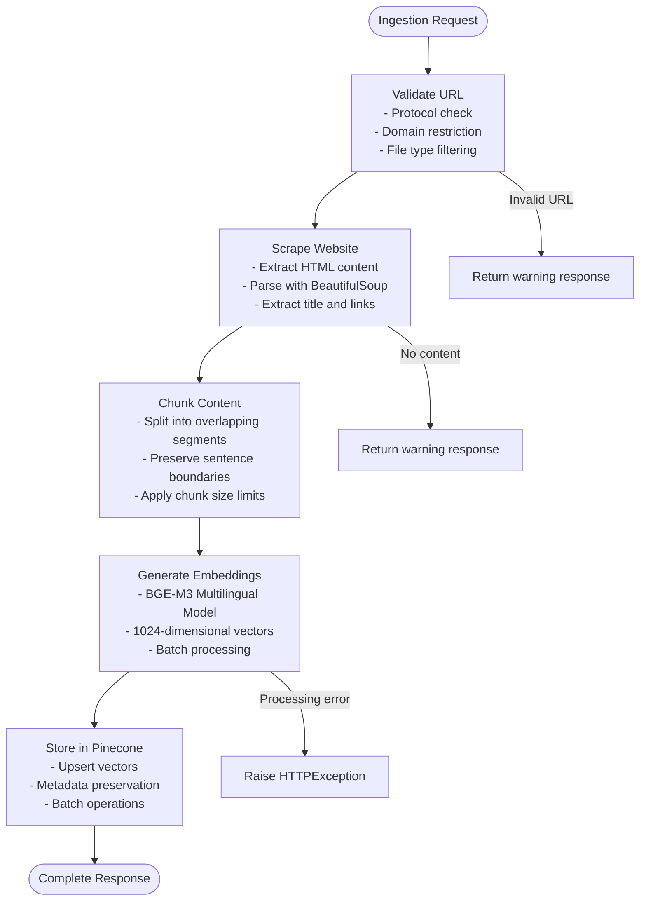

# Knowledgebase Ingestion API

<cite>
**Referenced Files in This Document**
- [ingest_router.py](file://backend/app/routers/ingest_router.py)
- [scraper_service.py](file://backend/app/services/scraper_service.py)
- [embedding_service.py](file://backend/app/services/embedding_service.py)
- [pinecone_service.py](file://backend/app/services/pinecone_service.py)
- [config.py](file://backend/app/config.py)
- [main.py](file://backend/app/main.py)
- [README.md](file://README.md)
- [requirements.txt](file://backend/requirements.txt)
</cite>

## Table of Contents
1. [Introduction](#introduction)
2. [API Overview](#api-overview)
3. [Endpoint Definition](#endpoint-definition)
4. [Request Schema](#request-schema)
5. [Response Schema](#response-schema)
6. [Processing Workflow](#processing-workflow)
7. [Supported Content Types](#supported-content-types)
8. [Error Handling](#error-handling)
9. [Vector Store Operations](#vector-store-operations)
10. [Configuration](#configuration)
11. [Examples](#examples)
12. [Performance Considerations](#performance-considerations)
13. [Troubleshooting Guide](#troubleshooting-guide)
14. [Conclusion](#conclusion)

## Introduction

The Knowledgebase Ingestion API provides a comprehensive solution for automatically extracting content from websites, processing it into searchable chunks, generating embeddings, and storing vectors in Pinecone for retrieval-augmented generation (RAG) applications. This endpoint enables organizations to quickly populate their knowledgebases with website content for intelligent chatbot interactions.

The ingestion pipeline follows a multi-stage process: web scraping, content extraction, text chunking, embedding generation, and vector storage. This document provides complete API documentation, including request/response schemas, processing workflows, error handling, and operational guidelines.

## API Overview

The ingestion API is designed as a single endpoint that orchestrates the entire knowledgebase population process. It accepts a URL-based content source and optional configuration parameters, then executes a comprehensive ingestion pipeline that transforms raw web content into searchable vector embeddings.

**Section sources**
- [ingest_router.py:26-74](file://backend/app/routers/ingest_router.py#L26-L74)
- [README.md:180-189](file://README.md#L180-L189)

## Endpoint Definition

### POST /api/ingest

Triggers knowledgebase ingestion from a website URL. This endpoint performs synchronous processing and can take several minutes for large websites.

**Method**: POST  
**Content-Type**: application/json  
**Response Type**: JSON  

**Section sources**
- [ingest_router.py:26-74](file://backend/app/routers/ingest_router.py#L26-L74)

## Request Schema

The ingestion request accepts the following parameters:

| Parameter | Type | Required | Default | Description |
|-----------|------|----------|---------|-------------|
| url | string | Yes | None | The base URL of the website to scrape (must be HTTP/HTTPS) |
| max_pages | integer | No | 50 | Maximum number of pages to scrape (1-1000) |

### URL Validation Rules

The system enforces strict URL validation to ensure successful scraping:

- **Protocol**: Must be http or https
- **Domain Restriction**: Only scrapes pages from the same base domain
- **File Type Filtering**: Excludes binary files (PDF, images, videos, archives)
- **Navigation Filtering**: Skips administrative and non-content URLs

**Section sources**
- [ingest_router.py:12-24](file://backend/app/routers/ingest_router.py#L12-L24)
- [scraper_service.py:37-69](file://backend/app/services/scraper_service.py#L37-L69)

## Response Schema

The ingestion response provides comprehensive status information:

| Field | Type | Description |
|-------|------|-------------|
| status | string | Operation status ("success", "warning", "error") |
| message | string | Human-readable status message |
| pages_scraped | integer | Number of pages successfully scraped |
| chunks_created | integer | Total number of text chunks generated |

### Response Status Codes

- **200 OK**: Successful ingestion with statistics
- **400 Bad Request**: Invalid request parameters
- **500 Internal Server Error**: Processing failures or service errors

**Section sources**
- [ingest_router.py:18-24](file://backend/app/routers/ingest_router.py#L18-L24)
- [ingest_router.py:50-73](file://backend/app/routers/ingest_router.py#L50-L73)

## Processing Workflow

The ingestion process follows a structured pipeline with four distinct stages:



**Diagram sources**
- [scraper_service.py:195-248](file://backend/app/services/scraper_service.py#L195-L248)
- [scraper_service.py:250-306](file://backend/app/services/scraper_service.py#L250-L306)
- [embedding_service.py:79-126](file://backend/app/services/embedding_service.py#L79-L126)
- [pinecone_service.py:62-106](file://backend/app/services/pinecone_service.py#L62-L106)

### Stage 1: Web Scraping and Content Extraction

The scraper service performs comprehensive web content extraction:

- **HTML Parsing**: Uses BeautifulSoup for robust HTML parsing
- **Content Extraction**: Identifies main content areas using semantic selectors
- **Link Discovery**: Extracts all internal links for recursive crawling
- **Text Cleaning**: Removes navigation elements and normalizes whitespace
- **Rate Limiting**: Implements configurable delays between requests

### Stage 2: Text Chunking and Preprocessing

Content is processed through intelligent chunking:

- **Chunk Size**: Configurable default of 500 characters
- **Overlap Strategy**: 50-character overlap to preserve context
- **Boundary Detection**: Respects sentence and word boundaries
- **Quality Filtering**: Skips content shorter than 50 characters

### Stage 3: Embedding Generation

BGE-M3 multilingual embedding model creates semantic vectors:

- **Model**: BAAI/bge-m3 (1024 dimensions)
- **Batch Processing**: Optimized batch sizes for GPU/CPU efficiency
- **Query Enhancement**: Adds retrieval instructions for better search performance
- **Memory Management**: Singleton pattern prevents redundant model loading

### Stage 4: Vector Storage and Indexing

Pinecone vector store operations:

- **Upsert Operations**: Batch upsert with configurable batch sizes
- **Metadata Preservation**: Stores original content, source URLs, and timestamps
- **Index Management**: Automatic index creation and connection
- **Cosine Similarity**: Uses cosine distance for optimal semantic search

**Section sources**
- [scraper_service.py:136-163](file://backend/app/services/scraper_service.py#L136-L163)
- [scraper_service.py:164-194](file://backend/app/services/scraper_service.py#L164-L194)
- [embedding_service.py:106-126](file://backend/app/services/embedding_service.py#L106-L126)
- [pinecone_service.py:62-106](file://backend/app/services/pinecone_service.py#L62-L106)

## Supported Content Types

The ingestion system supports various content types through intelligent filtering:

### HTML Content
- **Primary Support**: Standard web pages with semantic markup
- **Content Areas**: Articles, main content divs, entry content sections
- **Text Extraction**: Preserves readable content while removing navigation

### File Type Filtering
The system automatically excludes non-content files:

- **Binary Files**: PDF, images (JPG, PNG, GIF), videos (MP4, AVI)
- **Archives**: ZIP, TAR, GZ compressed files
- **Audio**: MP3, WAV audio files
- **Executable**: JS, CSS, and other non-content assets

### Administrative URLs
Skips common non-content URLs:

- **WordPress**: wp-content/uploads/, wp-includes/, wp-json/
- **E-commerce**: cart/, checkout/, my-account/
- **Authentication**: wp-login, wp-admin, admin panels
- **Feed URLs**: RSS feeds, sitemaps, social media links

**Section sources**
- [scraper_service.py:49-63](file://backend/app/services/scraper_service.py#L49-L63)
- [scraper_service.py:136-163](file://backend/app/services/scraper_service.py#L136-L163)

## Error Handling

The ingestion API implements comprehensive error handling across all processing stages:

### URL Validation Errors
- **Invalid Protocol**: Non-http/https URLs rejected
- **Domain Mismatch**: External URLs filtered out
- **File Extensions**: Binary files excluded from processing

### Processing Errors
- **Network Failures**: HTTP errors and timeouts handled gracefully
- **Content Extraction**: Malformed HTML handled with fallback strategies
- **Embedding Generation**: Model loading and processing errors caught
- **Vector Storage**: Pinecone connectivity and upsert failures managed

### Response Status Categories

| Status | Purpose | Example Scenarios |
|--------|---------|-------------------|
| success | Normal operation completed | Pages scraped and indexed successfully |
| warning | Partial failure or no content | No pages scraped, invalid URL format |
| error | Critical failure | Model loading failed, vector store unavailable |

**Section sources**
- [ingest_router.py:43-73](file://backend/app/routers/ingest_router.py#L43-L73)
- [scraper_service.py:136-163](file://backend/app/services/scraper_service.py#L136-L163)
- [scraper_service.py:288-289](file://backend/app/services/scraper_service.py#L288-L289)

## Vector Store Operations

### Pinecone Integration

The system provides comprehensive vector store operations:

#### Index Management
- **Automatic Creation**: Creates index if it doesn't exist
- **Dimension Configuration**: 1024 dimensions for BGE-M3 embeddings
- **Distance Metric**: Cosine similarity for optimal semantic search
- **Cloud Specification**: Serverless deployment on AWS US East region

#### Upsert Operations
- **Batch Processing**: Configurable batch sizes for efficiency
- **Metadata Storage**: Preserves original content and source information
- **Vector IDs**: UUID generation for unique identification
- **Upsert Statistics**: Tracks processed vector counts

#### Query Operations
- **Similarity Search**: Retrieves semantically similar content
- **Filtering**: Supports metadata-based filtering
- **Top-K Results**: Configurable result limits
- **Score Thresholds**: Configurable similarity thresholds

**Section sources**
- [pinecone_service.py:27-55](file://backend/app/services/pinecone_service.py#L27-L55)
- [pinecone_service.py:62-106](file://backend/app/services/pinecone_service.py#L62-L106)
- [pinecone_service.py:108-154](file://backend/app/services/pinecone_service.py#L108-L154)

## Configuration

### Environment Variables

The ingestion system requires the following environment configuration:

| Variable | Type | Required | Default | Description |
|----------|------|----------|---------|-------------|
| PINECONE_API_KEY | string | Yes | "" | Pinecone API authentication key |
| PINECONE_INDEX_NAME | string | No | "hitech-kb-index" | Vector store index name |
| PINECONE_DIMENSION | integer | No | 1024 | Embedding dimension count |
| SCRAPE_BASE_URL | string | No | "https://www.hitech.sa" | Default base URL for scraping |
| SCRAPE_MAX_PAGES | integer | No | 100 | Maximum pages to scrape |
| SCRAPE_DELAY | float | No | 1.0 | Delay between requests in seconds |
| CHUNK_SIZE | integer | No | 500 | Text chunk size in characters |
| CHUNK_OVERLAP | integer | No | 50 | Overlap between chunks |

### Runtime Configuration

The system initializes essential services during startup:

- **MongoDB Connection**: Establishes lead and conversation storage
- **Pinecone Initialization**: Creates and connects to vector store
- **Model Loading**: Loads BGE-M3 embedding model (CPU-optimized)
- **CORS Configuration**: Enables cross-origin resource sharing

**Section sources**
- [config.py:19-44](file://backend/app/config.py#L19-L44)
- [main.py:14-37](file://backend/app/main.py#L14-L37)

## Examples

### Basic Ingestion Request

```bash
curl -X POST https://your-backend.vercel.app/api/ingest \
  -H "Content-Type: application/json" \
  -d '{"url": "https://www.hitech.sa", "max_pages": 50}'
```

### Response Example

```json
{
  "status": "success",
  "message": "Successfully ingested 25 pages with 147 chunks",
  "pages_scraped": 25,
  "chunks_created": 147
}
```

### Error Response Example

```json
{
  "status": "warning",
  "message": "No pages were scraped. Check the URL and try again.",
  "pages_scraped": 0,
  "chunks_created": 0
}
```

### Batch Processing Considerations

For large websites:
- **Max Pages**: Configure appropriate limits (1-1000)
- **Delay Settings**: Adjust crawl delays to respect server resources
- **Chunk Size**: Modify based on content complexity and retrieval needs
- **Batch Sizes**: Optimize for available memory and processing power

**Section sources**
- [README.md:184-189](file://README.md#L184-L189)
- [ingest_router.py:14-15](file://backend/app/routers/ingest_router.py#L14-L15)

## Performance Considerations

### Processing Time Factors

Ingestion duration depends on several factors:

- **Website Size**: Number of pages and content length
- **Chunk Size**: Larger chunks reduce processing overhead
- **Batch Processing**: Optimizes embedding generation throughput
- **Network Latency**: External site response times impact scraping speed

### Memory Management

- **Model Loading**: Singleton pattern prevents redundant memory usage
- **Batch Processing**: Configurable batch sizes balance memory and speed
- **Content Caching**: Prevents duplicate processing of visited pages
- **Garbage Collection**: Automatic cleanup of temporary processing data

### Scalability Guidelines

- **Horizontal Scaling**: Deploy multiple instances for high-volume processing
- **Queue Systems**: Consider background task queues for large-scale operations
- **Resource Allocation**: Monitor CPU and memory usage during processing
- **Rate Limiting**: Respect external site rate limits to avoid blocking

## Troubleshooting Guide

### Common Issues and Solutions

#### URL Validation Failures
**Symptoms**: Warning responses indicating no pages scraped
**Causes**: Invalid protocol, external domains, or non-HTML content
**Solutions**: Verify URL format, ensure same-domain scraping, check content type

#### Embedding Model Loading Errors
**Symptoms**: HTTP 500 errors during processing
**Causes**: Missing dependencies or model loading failures
**Solutions**: Install required packages, verify CUDA availability, check memory allocation

#### Pinecone Connection Issues
**Symptoms**: Vector storage failures or connection timeouts
**Solutions**: Verify API key configuration, check network connectivity, validate index permissions

#### Memory Exhaustion
**Symptoms**: Processing failures with memory errors
**Solutions**: Reduce batch sizes, increase system memory, optimize chunk sizes

### Monitoring and Debugging

- **Log Output**: System prints detailed progress information
- **Health Checks**: Use `/api/health` endpoint for service status
- **Statistics**: Monitor vector store statistics via dedicated endpoints
- **Error Tracking**: Comprehensive exception handling with detailed messages

**Section sources**
- [ingest_router.py:69-73](file://backend/app/routers/ingest_router.py#L69-L73)
- [embedding_service.py:45-48](file://backend/app/services/embedding_service.py#L45-L48)
- [pinecone_service.py:33-55](file://backend/app/services/pinecone_service.py#L33-L55)

## Conclusion

The Knowledgebase Ingestion API provides a robust, production-ready solution for automated content processing and vector indexing. By combining intelligent web scraping, sophisticated text chunking, advanced embedding generation, and efficient vector storage, it enables organizations to quickly build comprehensive knowledgebases for RAG applications.

The API's comprehensive error handling, flexible configuration options, and scalable architecture make it suitable for various deployment scenarios, from small websites to enterprise-scale content repositories. Proper configuration of environment variables and system resources ensures optimal performance and reliability for content ingestion operations.