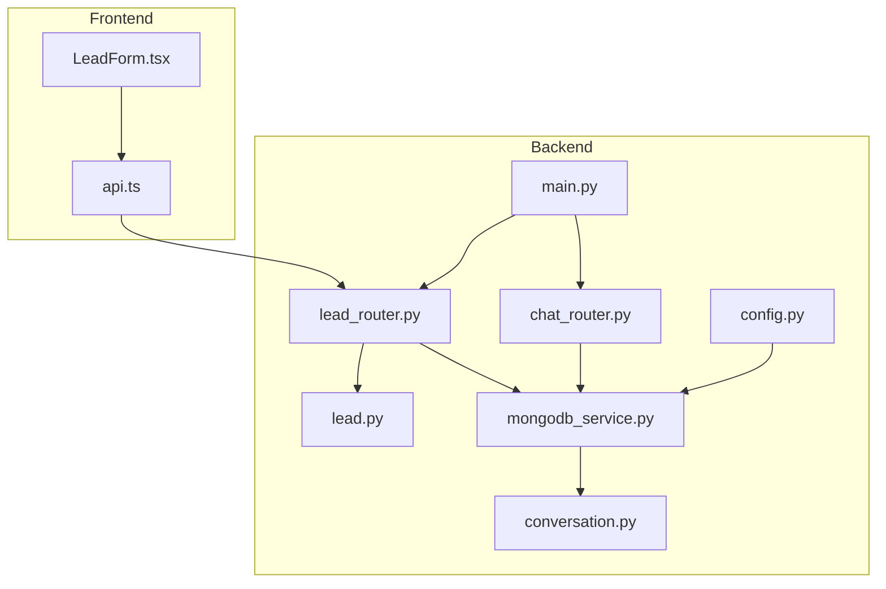
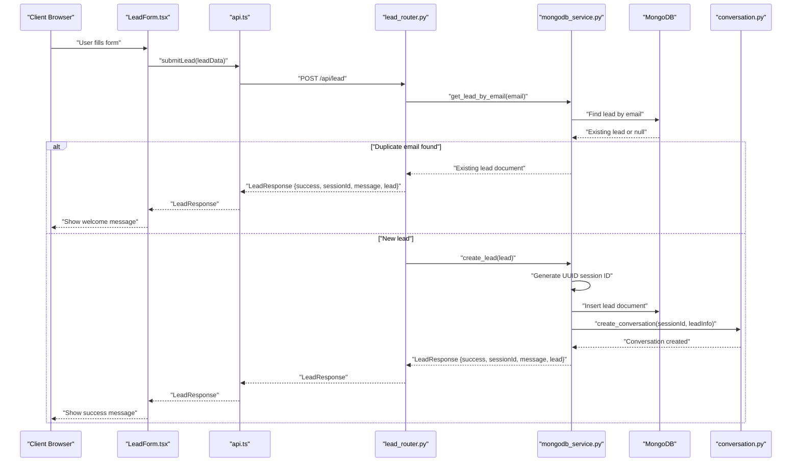
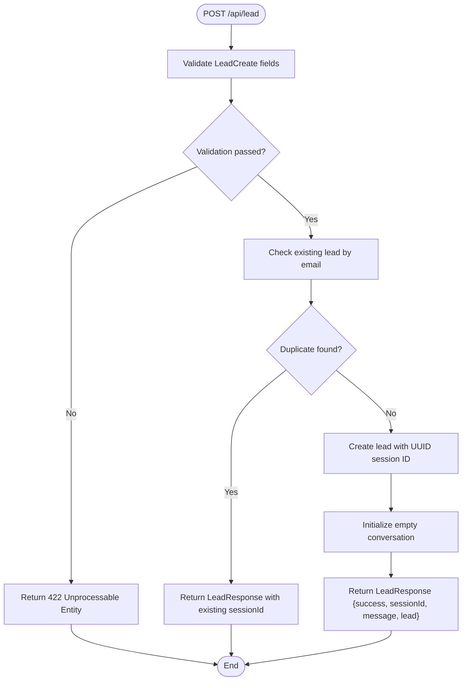
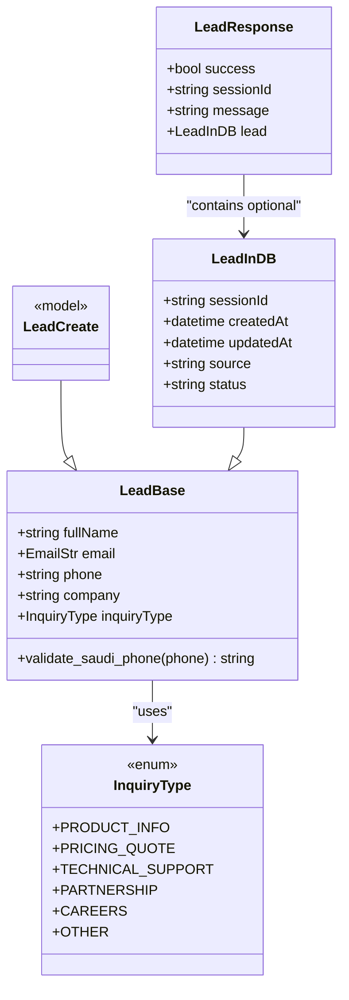
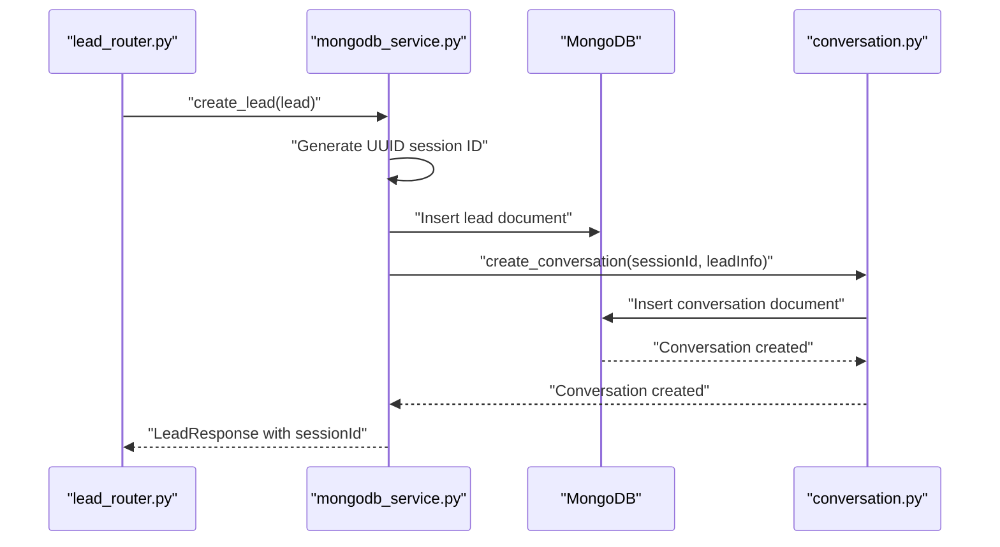
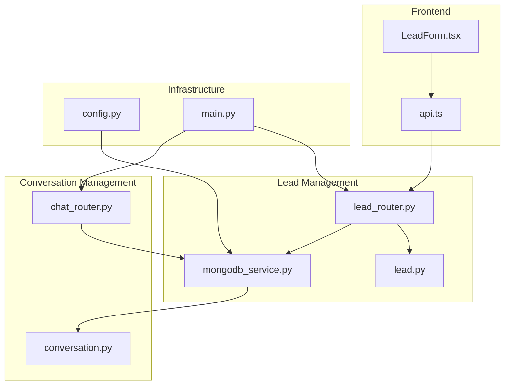

# Lead Management API

<cite>
**Referenced Files in This Document**
- [lead_router.py](file://backend/app/routers/lead_router.py)
- [lead.py](file://backend/app/models/lead.py)
- [mongodb_service.py](file://backend/app/services/mongodb_service.py)
- [conversation.py](file://backend/app/models/conversation.py)
- [chat_router.py](file://backend/app/routers/chat_router.py)
- [api.ts](file://frontend/lib/api.ts)
- [LeadForm.tsx](file://frontend/components/chat/LeadForm.tsx)
- [main.py](file://backend/app/main.py)
- [config.py](file://backend/app/config.py)
</cite>

## Table of Contents
1. [Introduction](#introduction)
2. [Project Structure](#project-structure)
3. [Core Components](#core-components)
4. [Architecture Overview](#architecture-overview)
5. [Detailed Component Analysis](#detailed-component-analysis)
6. [Dependency Analysis](#dependency-analysis)
7. [Performance Considerations](#performance-considerations)
8. [Troubleshooting Guide](#troubleshooting-guide)
9. [Conclusion](#conclusion)

## Introduction
This document provides comprehensive API documentation for the lead management endpoints, focusing on the POST `/api/lead` endpoint used for lead submission and session creation. It covers request/response schemas, validation rules, session ID generation, error handling, and the relationship between leads and conversations. The documentation includes practical examples for successful lead creation, error scenarios (invalid data, duplicate emails), and session management patterns.

## Project Structure
The lead management functionality spans the backend FastAPI application and the frontend React components. The backend defines data models, routes, and MongoDB service operations, while the frontend handles form validation and API communication.

**Diagram sources**
- [lead_router.py:1-57](file://backend/app/routers/lead_router.py#L1-L57)
- [lead.py:18-64](file://backend/app/models/lead.py#L18-L64)
- [mongodb_service.py:13-202](file://backend/app/services/mongodb_service.py#L13-L202)
- [conversation.py:23-53](file://backend/app/models/conversation.py#L23-L53)
- [chat_router.py:1-130](file://backend/app/routers/chat_router.py#L1-L130)
- [api.ts:14-93](file://frontend/lib/api.ts#L14-L93)
- [LeadForm.tsx:13-168](file://frontend/components/chat/LeadForm.tsx#L13-L168)
- [main.py:39-90](file://backend/app/main.py#L39-L90)
- [config.py:7-65](file://backend/app/config.py#L7-L65)

**Section sources**
- [lead_router.py:1-57](file://backend/app/routers/lead_router.py#L1-L57)
- [lead.py:18-64](file://backend/app/models/lead.py#L18-L64)
- [mongodb_service.py:13-202](file://backend/app/services/mongodb_service.py#L13-L202)
- [conversation.py:23-53](file://backend/app/models/conversation.py#L23-L53)
- [chat_router.py:1-130](file://backend/app/routers/chat_router.py#L1-L130)
- [api.ts:14-93](file://frontend/lib/api.ts#L14-L93)
- [LeadForm.tsx:13-168](file://frontend/components/chat/LeadForm.tsx#L13-L168)
- [main.py:39-90](file://backend/app/main.py#L39-L90)
- [config.py:7-65](file://backend/app/config.py#L7-L65)

## Core Components
This section outlines the key components involved in lead management and session creation.

- Lead Data Models: Define the structure and validation rules for lead submissions, including phone number validation for Saudi Arabia and optional inquiry types.
- Lead Router: Implements the POST `/api/lead` endpoint, handling duplicate detection, session creation, and conversation initialization.
- MongoDB Service: Manages lead storage, session ID generation, and conversation creation upon lead registration.
- Conversation Models: Provide the foundation for conversation storage linked to lead sessions.
- Frontend Integration: Handles form validation and API calls for lead submission.

**Section sources**
- [lead.py:18-64](file://backend/app/models/lead.py#L18-L64)
- [lead_router.py:11-45](file://backend/app/routers/lead_router.py#L11-L45)
- [mongodb_service.py:51-77](file://backend/app/services/mongodb_service.py#L51-L77)
- [conversation.py:23-53](file://backend/app/models/conversation.py#L23-L53)
- [api.ts:61-64](file://frontend/lib/api.ts#L61-L64)

## Architecture Overview
The lead management architecture integrates frontend form submission with backend validation, session creation, and conversation initialization. The system ensures session persistence and maintains a clean separation between lead data and conversation history.

**Diagram sources**
- [lead_router.py:11-45](file://backend/app/routers/lead_router.py#L11-L45)
- [mongodb_service.py:51-77](file://backend/app/services/mongodb_service.py#L51-L77)
- [conversation.py:98-111](file://backend/app/models/conversation.py#L98-L111)
- [api.ts:61-64](file://frontend/lib/api.ts#L61-L64)
- [LeadForm.tsx:39-42](file://frontend/components/chat/LeadForm.tsx#L39-L42)

## Detailed Component Analysis

### POST /api/lead Endpoint
The POST `/api/lead` endpoint validates incoming lead data, checks for duplicates, creates a session ID, stores the lead in MongoDB, initializes an empty conversation, and returns a standardized response.

- Request Schema: LeadCreate model fields
  - fullName: string (required, min length 2, max length 100)
  - email: string (required, validated as email)
  - phone: string (required, validated for Saudi phone number formats)
  - company: string (optional, max length 100)
  - inquiryType: enum (optional) with values: Product Information, Pricing Quote, Technical Support, Partnership, Careers, Other

- Validation Rules:
  - Phone number validation enforces Saudi Arabia formats: +966 5xxxxxxxx, 966 5xxxxxxxx, or 05xxxxxxxx.
  - Additional constraints: min/max lengths for name and company, required fields for name, email, and phone.

- Session ID Generation:
  - A unique session ID is generated using UUID and stored with the lead document.
  - A corresponding conversation document is created with the same session ID and lead snapshot.

- Response Schema: LeadResponse model
  - success: boolean indicating operation outcome
  - sessionId: string containing the unique session identifier
  - message: string describing the result
  - lead: optional LeadInDB object containing the stored lead details

- Error Scenarios:
  - Duplicate email: Returns success with existing session ID and a welcome message.
  - Internal server error: Returns HTTP 500 with error details.

**Diagram sources**
- [lead_router.py:11-45](file://backend/app/routers/lead_router.py#L11-L45)
- [lead.py:18-38](file://backend/app/models/lead.py#L18-L38)
- [mongodb_service.py:51-77](file://backend/app/services/mongodb_service.py#L51-L77)

**Section sources**
- [lead_router.py:11-45](file://backend/app/routers/lead_router.py#L11-L45)
- [lead.py:18-38](file://backend/app/models/lead.py#L18-L38)
- [lead.py:58-64](file://backend/app/models/lead.py#L58-L64)
- [mongodb_service.py:51-77](file://backend/app/services/mongodb_service.py#L51-L77)

### Lead Data Models
The lead models define the structure and validation rules for lead submissions and storage.

**Diagram sources**
- [lead.py:18-64](file://backend/app/models/lead.py#L18-L64)

**Section sources**
- [lead.py:18-64](file://backend/app/models/lead.py#L18-L64)

### Session Management and Conversation Initialization
Upon successful lead creation, the system generates a session ID and initializes an empty conversation document linked to the lead.

- Session Persistence:
  - Unique session ID stored in both lead and conversation collections.
  - Indexes created on session IDs for efficient lookups.

- Conversation Initialization:
  - Empty conversation created with lead snapshot and default metadata.
  - Timestamps and escalation flags initialized appropriately.

**Diagram sources**
- [mongodb_service.py:51-77](file://backend/app/services/mongodb_service.py#L51-L77)
- [conversation.py:98-111](file://backend/app/models/conversation.py#L98-L111)

**Section sources**
- [mongodb_service.py:51-77](file://backend/app/services/mongodb_service.py#L51-L77)
- [conversation.py:98-111](file://backend/app/models/conversation.py#L98-L111)

### Frontend Integration
The frontend provides form validation and API integration for lead submission.

- Form Validation:
  - Client-side validation mirrors backend rules for name, email, and Saudi phone number formats.
  - Optional fields for company and inquiry type.

- API Integration:
  - Uses axios to submit lead data to `/api/lead`.
  - Handles success states and displays confirmation messages.

**Section sources**
- [LeadForm.tsx:13-19](file://frontend/components/chat/LeadForm.tsx#L13-L19)
- [LeadForm.tsx:39-42](file://frontend/components/chat/LeadForm.tsx#L39-L42)
- [api.ts:61-64](file://frontend/lib/api.ts#L61-L64)

## Dependency Analysis
The lead management system exhibits clear separation of concerns with well-defined dependencies.

**Diagram sources**
- [lead_router.py:1-57](file://backend/app/routers/lead_router.py#L1-L57)
- [lead.py:18-64](file://backend/app/models/lead.py#L18-L64)
- [mongodb_service.py:13-202](file://backend/app/services/mongodb_service.py#L13-L202)
- [conversation.py:23-53](file://backend/app/models/conversation.py#L23-L53)
- [chat_router.py:1-130](file://backend/app/routers/chat_router.py#L1-L130)
- [api.ts:14-93](file://frontend/lib/api.ts#L14-L93)
- [LeadForm.tsx:13-168](file://frontend/components/chat/LeadForm.tsx#L13-L168)
- [main.py:39-90](file://backend/app/main.py#L39-L90)
- [config.py:7-65](file://backend/app/config.py#L7-L65)

**Section sources**
- [lead_router.py:1-57](file://backend/app/routers/lead_router.py#L1-L57)
- [mongodb_service.py:13-202](file://backend/app/services/mongodb_service.py#L13-L202)
- [main.py:39-90](file://backend/app/main.py#L39-L90)

## Performance Considerations
- Indexing Strategy: MongoDB indexes on session ID, email, and phone enable fast lookups during duplicate detection and session retrieval.
- Asynchronous Operations: Motor is used for non-blocking database operations, suitable for concurrent requests.
- Session Cleanup: The MongoDB service includes a cleanup mechanism for expired sessions, helping manage storage growth.
- Caching: Pydantic models provide efficient serialization/deserialization with minimal overhead.

## Troubleshooting Guide
Common issues and their resolutions:

- Invalid Phone Number Format:
  - Ensure the phone number matches Saudi Arabia formats: +966 5xxxxxxxx, 966 5xxxxxxxx, or 05xxxxxxxx.
  - Backend validation enforces length and prefix requirements.

- Duplicate Email Handling:
  - The system returns the existing session ID for duplicate emails, preventing multiple sessions.
  - Verify email uniqueness in the leads collection.

- Session Not Found Errors:
  - Ensure the session ID is valid and corresponds to an existing lead.
  - Use the GET `/api/lead/{session_id}` endpoint to verify session existence.

- Health Check:
  - Use the `/api/health` endpoint to verify backend service availability and database connectivity.

**Section sources**
- [lead_router.py:25-34](file://backend/app/routers/lead_router.py#L25-L34)
- [chat_router.py:28-34](file://backend/app/routers/chat_router.py#L28-L34)
- [main.py:74-83](file://backend/app/main.py#L74-L83)

## Conclusion
The lead management API provides a robust foundation for capturing customer information, establishing persistent sessions, and initializing conversation contexts. The system enforces strict validation rules, manages session lifecycle effectively, and integrates seamlessly with the broader chatbot infrastructure. The documented endpoints and schemas enable reliable client-server communication and support scalable lead acquisition workflows.