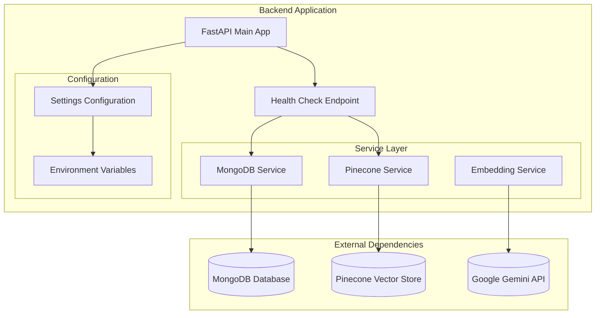
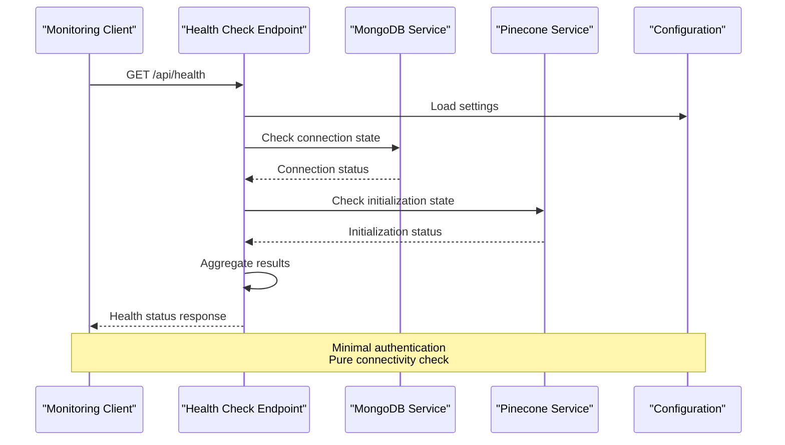
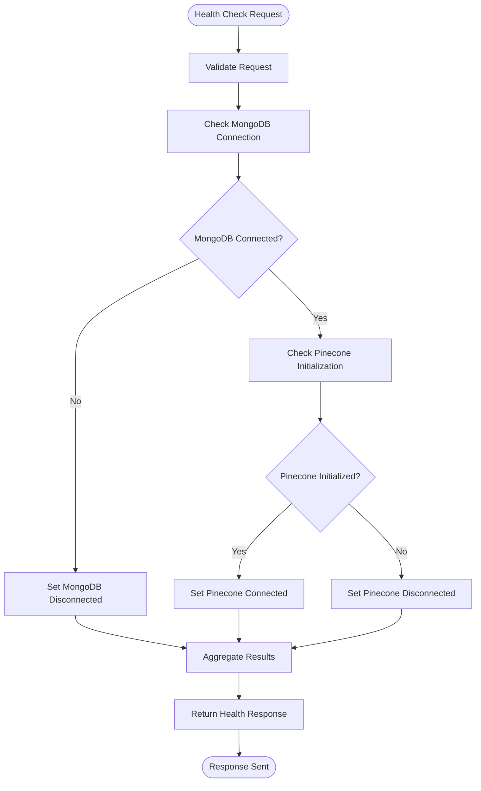

# System Health API

<cite>
**Referenced Files in This Document**
- [main.py](file://backend/app/main.py)
- [mongodb_service.py](file://backend/app/services/mongodb_service.py)
- [pinecone_service.py](file://backend/app/services/pinecone_service.py)
- [config.py](file://backend/app/config.py)
- [vercel.json](file://backend/vercel.json)
- [requirements.txt](file://backend/requirements.txt)
</cite>

## Table of Contents
1. [Introduction](#introduction)
2. [Project Structure](#project-structure)
3. [Core Components](#core-components)
4. [Architecture Overview](#architecture-overview)
5. [Detailed Component Analysis](#detailed-component-analysis)
6. [API Specification](#api-specification)
7. [Response Formats](#response-formats)
8. [Monitoring Integration](#monitoring-integration)
9. [Deployment Considerations](#deployment-considerations)
10. [Troubleshooting Guide](#troubleshooting-guide)
11. [Conclusion](#conclusion)

## Introduction

The System Health API provides real-time monitoring capabilities for the Hitech RAG Chatbot system. This endpoint enables deployment monitoring systems, load balancers, and orchestration platforms to verify the operational status of critical system components including database connectivity and vector store health.

The health check endpoint serves as a crucial component for production deployments, enabling automated monitoring, health-based routing decisions, and proactive failure detection. It provides immediate visibility into the system's operational state without requiring complex authentication or extensive resource consumption.

## Project Structure

The health monitoring functionality is integrated into the main FastAPI application within the backend service. The system follows a modular architecture where individual services maintain their own connection states, and the health endpoint consolidates this information.



**Diagram sources**
- [main.py:74-83](file://backend/app/main.py#L74-L83)
- [mongodb_service.py:13-28](file://backend/app/services/mongodb_service.py#L13-L28)
- [pinecone_service.py:10-26](file://backend/app/services/pinecone_service.py#L10-L26)

**Section sources**
- [main.py:1-90](file://backend/app/main.py#L1-L90)
- [vercel.json:1-22](file://backend/vercel.json#L1-L22)

## Core Components

The health monitoring system consists of several interconnected components that work together to provide comprehensive system status verification:

### Health Check Endpoint
The primary health check endpoint is implemented as a simple GET route that returns the current operational status of all critical services. This endpoint is designed for minimal overhead and maximum reliability.

### Service Status Tracking
Each major service maintains its own connection state and initialization status, allowing granular monitoring of individual components while providing aggregated health information.

### Configuration Management
Centralized configuration management ensures that health checks can operate independently of service-specific authentication mechanisms, focusing purely on connectivity verification.

**Section sources**
- [main.py:74-83](file://backend/app/main.py#L74-L83)
- [config.py:7-65](file://backend/app/config.py#L7-L65)

## Architecture Overview

The health monitoring architecture follows a centralized approach where a single endpoint aggregates status information from multiple service providers. This design minimizes the attack surface while providing comprehensive system visibility.



**Diagram sources**
- [main.py:74-83](file://backend/app/main.py#L74-L83)
- [mongodb_service.py:21-28](file://backend/app/services/mongodb_service.py#L21-L28)
- [pinecone_service.py:27-55](file://backend/app/services/pinecone_service.py#L27-L55)

## Detailed Component Analysis

### Health Check Implementation

The health check endpoint is implemented as a simple asynchronous function that returns structured JSON containing system status information. The implementation prioritizes speed and reliability over comprehensive diagnostics.



**Diagram sources**
- [main.py:74-83](file://backend/app/main.py#L74-L83)

### MongoDB Service Health Monitoring

The MongoDB service maintains its own connection state through the `db` attribute. The health check evaluates whether this connection exists and is functional, providing a reliable indicator of database accessibility.

### Pinecone Service Health Monitoring

The Pinecone service uses a singleton pattern with initialization tracking through the `_initialized` flag. The health check verifies that the vector store client has been properly configured and is ready for operations.

**Section sources**
- [main.py:74-83](file://backend/app/main.py#L74-L83)
- [mongodb_service.py:16-28](file://backend/app/services/mongodb_service.py#L16-L28)
- [pinecone_service.py:21-26](file://backend/app/services/pinecone_service.py#L21-L26)

## API Specification

### Endpoint Definition

**GET** `/api/health`

This endpoint provides comprehensive system health status without requiring authentication or authorization. The response format is standardized to facilitate integration with various monitoring systems.

### Request Parameters

| Parameter | Type | Description | Required |
|-----------|------|-------------|----------|
| None | - | No parameters required | No |

### Response Format

The health check endpoint returns a JSON object containing system status information:

```json
{
  "status": "healthy",
  "services": {
    "mongodb": "connected",
    "pinecone": "connected"
  }
}
```

### Response Fields

| Field | Type | Description | Possible Values |
|-------|------|-------------|-----------------|
| `status` | string | Overall system health status | `"healthy"` |
| `services` | object | Individual service status | - |
| `services.mongodb` | string | MongoDB connection status | `"connected"`, `"disconnected"` |
| `services.pinecone` | string | Pinecone vector store status | `"connected"`, `"disconnected"` |

### HTTP Status Codes

| Status Code | Description | When |
|-------------|-------------|------|
| 200 | Healthy system | All services connected and operational |
| 503 | Unhealthy system | At least one critical service disconnected |

### Error Handling

The health endpoint does not throw exceptions for service failures. Instead, it returns appropriate status indicators in the response body, allowing monitoring systems to distinguish between network errors and service unavailability.

**Section sources**
- [main.py:74-83](file://backend/app/main.py#L74-L83)

## Response Formats

### Healthy Response Example

```json
{
  "status": "healthy",
  "services": {
    "mongodb": "connected",
    "pinecone": "connected"
  }
}
```

### Unhealthy Response Example

```json
{
  "status": "healthy",
  "services": {
    "mongodb": "disconnected",
    "pinecone": "connected"
  }
}
```

### Partially Unhealthy Response Example

```json
{
  "status": "healthy",
  "services": {
    "mongodb": "connected",
    "pinecone": "disconnected"
  }
}
```

## Monitoring Integration

### Kubernetes Liveness Probes

The health endpoint integrates seamlessly with Kubernetes health checks:

```yaml
livenessProbe:
  httpGet:
    path: /api/health
    port: 8000
  initialDelaySeconds: 30
  periodSeconds: 10
  timeoutSeconds: 5
  failureThreshold: 3
```

### Docker Compose Health Checks

```yaml
healthcheck:
  test: ["CMD", "curl", "-f", "http://localhost:8000/api/health"]
  interval: 30s
  timeout: 10s
  retries: 3
```

### Load Balancer Health Checks

```yaml
health_check:
  protocol: HTTP
  path: /api/health
  port: 8000
  interval: 15s
  timeout: 5s
  unhealthy_threshold: 3
  healthy_threshold: 2
```

### Prometheus Metrics Integration

```yaml
scrape_configs:
  - job_name: 'chatbot-health'
    static_configs:
      - targets: ['localhost:8000']
    metrics_path: /api/health
    scrape_interval: 15s
```

## Deployment Considerations

### Environment Configuration

The health endpoint relies on environment variables for configuration. Ensure the following variables are properly set:

- `MONGODB_URI`: MongoDB connection string
- `PINECONE_API_KEY`: Pinecone API key
- `PINECONE_INDEX_NAME`: Vector store index name

### Vercel Deployment

The application is configured for serverless deployment on Vercel with automatic routing to the main application module.

**Section sources**
- [vercel.json:1-22](file://backend/vercel.json#L1-L22)
- [config.py:15-23](file://backend/app/config.py#L15-L23)

## Troubleshooting Guide

### Common Issues and Solutions

#### MongoDB Connection Problems
- **Symptoms**: `"mongodb": "disconnected"`
- **Causes**: Network connectivity, authentication failures, database downtime
- **Solutions**: Verify MongoDB URI, check network connectivity, confirm database availability

#### Pinecone Initialization Failures
- **Symptoms**: `"pinecone": "disconnected"`
- **Causes**: Invalid API key, network issues, index creation problems
- **Solutions**: Validate Pinecone API key, check network connectivity, verify index configuration

#### Mixed Status Responses
- **Symptoms**: One service connected, another disconnected
- **Causes**: Partial system failures, network partitioning
- **Solutions**: Isolate failing service, check service-specific logs

### Debugging Steps

1. **Direct Access Test**: Manually call the endpoint to verify basic functionality
2. **Service Isolation**: Test individual service connections separately
3. **Network Diagnostics**: Verify connectivity to external services
4. **Configuration Validation**: Confirm environment variables are correctly set

### Monitoring Best Practices

- **Frequency**: Configure health checks every 15-30 seconds for critical services
- **Timeouts**: Set appropriate timeouts based on service response characteristics
- **Thresholds**: Use conservative thresholds to avoid false positives
- **Alerting**: Combine health checks with application logging for comprehensive monitoring

**Section sources**
- [main.py:74-83](file://backend/app/main.py#L74-L83)
- [mongodb_service.py:21-28](file://backend/app/services/mongodb_service.py#L21-L28)
- [pinecone_service.py:27-55](file://backend/app/services/pinecone_service.py#L27-L55)

## Conclusion

The System Health API provides a robust, production-ready solution for monitoring the Hitech RAG Chatbot system. Its simple design, comprehensive coverage, and seamless integration capabilities make it an essential component for reliable deployment and operation.

The endpoint's focus on pure connectivity verification ensures minimal impact on system performance while providing critical operational insights. Its compatibility with modern deployment platforms and monitoring systems makes it suitable for various infrastructure environments, from local development to enterprise-scale production deployments.

By implementing proper monitoring and alerting around this endpoint, operators can achieve proactive system management, rapid failure detection, and improved overall system reliability.