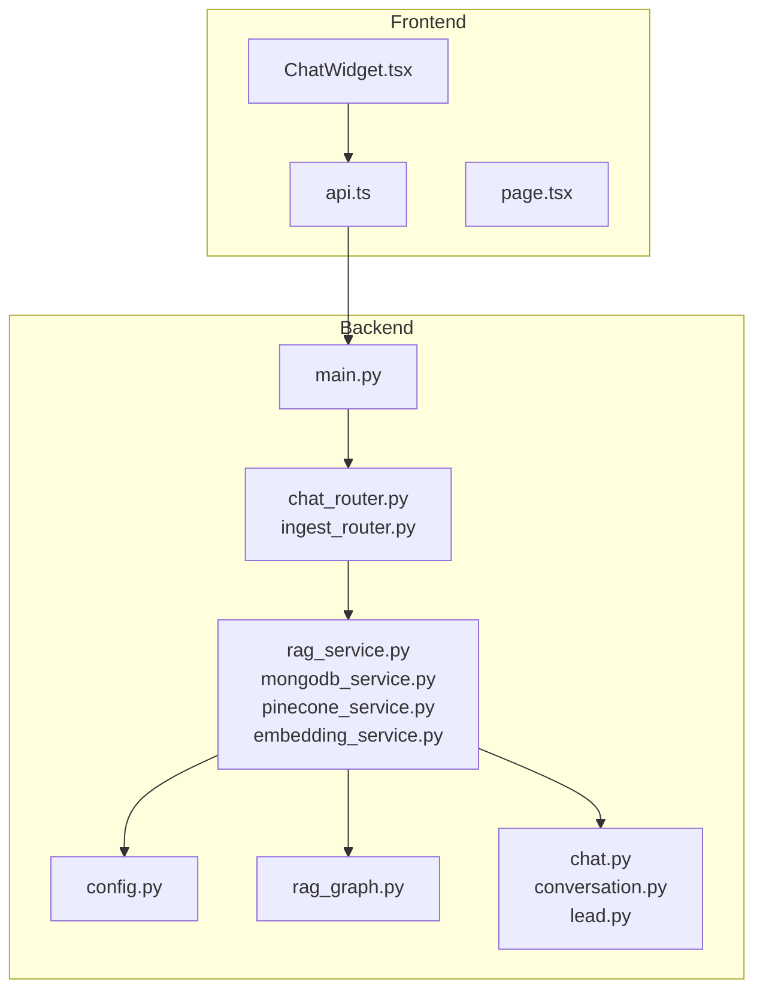
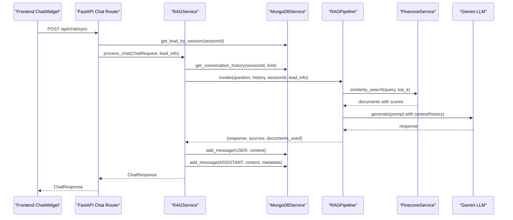
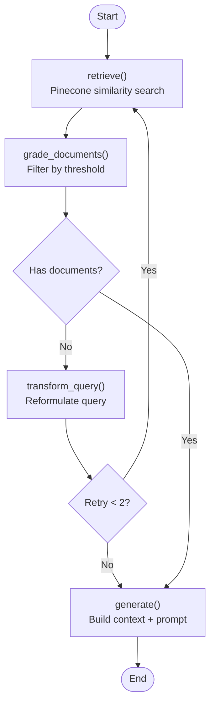
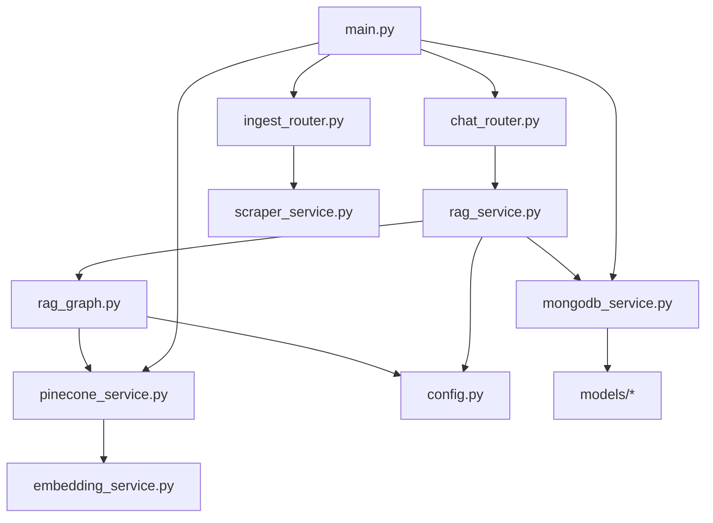

# Chat System Implementation

<cite>
**Referenced Files in This Document**
- [rag_graph.py](file://backend/app/graph/rag_graph.py)
- [rag_service.py](file://backend/app/services/rag_service.py)
- [mongodb_service.py](file://backend/app/services/mongodb_service.py)
- [pinecone_service.py](file://backend/app/services/pinecone_service.py)
- [embedding_service.py](file://backend/app/services/embedding_service.py)
- [chat_router.py](file://backend/app/routers/chat_router.py)
- [ingest_router.py](file://backend/app/routers/ingest_router.py)
- [config.py](file://backend/app/config.py)
- [main.py](file://backend/app/main.py)
- [chat.py](file://backend/app/models/chat.py)
- [conversation.py](file://backend/app/models/conversation.py)
- [lead.py](file://backend/app/models/lead.py)
- [ChatWidget.tsx](file://frontend/components/chat/ChatWidget.tsx)
- [api.ts](file://frontend/lib/api.ts)
- [page.tsx](file://frontend/app/chat/page.tsx)
</cite>

## Table of Contents
1. [Introduction](#introduction)
2. [Project Structure](#project-structure)
3. [Core Components](#core-components)
4. [Architecture Overview](#architecture-overview)
5. [Detailed Component Analysis](#detailed-component-analysis)
6. [Dependency Analysis](#dependency-analysis)
7. [Performance Considerations](#performance-considerations)
8. [Troubleshooting Guide](#troubleshooting-guide)
9. [Conclusion](#conclusion)
10. [Appendices](#appendices)

## Introduction
This document explains the chat system implementation for the Hitech RAG-powered chatbot. It covers the LangGraph-based Retrieval-Augmented Generation (RAG) pipeline, including document retrieval, relevance grading, query transformation, and response generation. It also documents conversation memory management, message processing workflows, context handling, and MongoDB integration for conversation storage and retrieval. Configuration options for embedding models, vector stores, and LLM providers are included, along with performance optimization, memory management, scalability considerations, and troubleshooting guidance.

## Project Structure
The system is organized into a Python FastAPI backend and a Next.js frontend. The backend implements:
- RAG pipeline using LangGraph
- MongoDB-backed conversation storage
- Pinecone vector store integration
- Embedding generation using BGE-M3
- FastAPI routers for chat, ingestion, and lead management
- Configuration via environment variables

The frontend provides a React-based chat widget with lead capture, message exchange, and escalation to human agents.

**Diagram sources**
- [main.py:39-85](file://backend/app/main.py#L39-L85)
- [chat_router.py:12-129](file://backend/app/routers/chat_router.py#L12-L129)
- [ingest_router.py:26-111](file://backend/app/routers/ingest_router.py#L26-L111)
- [rag_service.py:19-87](file://backend/app/services/rag_service.py#L19-L87)
- [mongodb_service.py:13-201](file://backend/app/services/mongodb_service.py#L13-L201)
- [pinecone_service.py:10-185](file://backend/app/services/pinecone_service.py#L10-L185)
- [embedding_service.py:10-157](file://backend/app/services/embedding_service.py#L10-L157)
- [rag_graph.py:26-263](file://backend/app/graph/rag_graph.py#L26-L263)
- [config.py:7-64](file://backend/app/config.py#L7-L64)
- [chat.py:7-45](file://backend/app/models/chat.py#L7-L45)
- [conversation.py:15-53](file://backend/app/models/conversation.py#L15-L53)
- [lead.py:18-64](file://backend/app/models/lead.py#L18-L64)

**Section sources**
- [main.py:14-37](file://backend/app/main.py#L14-L37)
- [config.py:7-64](file://backend/app/config.py#L7-L64)

## Core Components
- RAG Pipeline (LangGraph): Orchestrates retrieval, document grading, optional query transformation, and response generation.
- RAG Service: Coordinates conversation history retrieval, pipeline invocation, and MongoDB persistence.
- MongoDB Service: Manages leads, conversations, message storage, escalation, and cleanup.
- Pinecone Service: Handles vector index initialization, upsert, similarity search, and statistics.
- Embedding Service: Singleton BGE-M3 model for dense vector generation.
- FastAPI Routers: Expose chat, escalation, ingestion, and conversation endpoints.
- Frontend Chat Widget: Captures lead, manages session, sends messages, escalates to human.

**Section sources**
- [rag_graph.py:26-263](file://backend/app/graph/rag_graph.py#L26-L263)
- [rag_service.py:11-116](file://backend/app/services/rag_service.py#L11-L116)
- [mongodb_service.py:13-201](file://backend/app/services/mongodb_service.py#L13-L201)
- [pinecone_service.py:10-185](file://backend/app/services/pinecone_service.py#L10-L185)
- [embedding_service.py:10-157](file://backend/app/services/embedding_service.py#L10-L157)
- [chat_router.py:12-129](file://backend/app/routers/chat_router.py#L12-L129)
- [ingest_router.py:26-111](file://backend/app/routers/ingest_router.py#L26-L111)
- [ChatWidget.tsx:27-307](file://frontend/components/chat/ChatWidget.tsx#L27-L307)

## Architecture Overview
The chat system follows a modular architecture:
- Frontend captures lead and exchanges messages via REST APIs.
- Backend validates sessions, retrieves conversation history, runs the RAG pipeline, persists messages, and returns responses.
- Vector search retrieves relevant documents, which are filtered by similarity thresholds and used to construct prompts with conversation history and lead personalization.
- MongoDB stores leads and conversations; Pinecone stores embeddings; BGE-M3 generates embeddings.

**Diagram sources**
- [chat_router.py:12-47](file://backend/app/routers/chat_router.py#L12-L47)
- [rag_service.py:19-87](file://backend/app/services/rag_service.py#L19-L87)
- [rag_graph.py:71-251](file://backend/app/graph/rag_graph.py#L71-L251)
- [pinecone_service.py:108-154](file://backend/app/services/pinecone_service.py#L108-L154)
- [mongodb_service.py:117-145](file://backend/app/services/mongodb_service.py#L117-L145)

## Detailed Component Analysis

### RAG Pipeline (LangGraph)
The pipeline defines a typed state and a workflow with four nodes:
- retrieve: Performs similarity search against Pinecone and filters by threshold.
- grade_documents: Filters documents by relevance.
- transform_query: Reformulates the query using the LLM to improve retrieval.
- generate: Builds context from documents, conversation history, and lead info, then generates a response.

Key state fields include question, generation, documents, conversation_history, session_id, lead_info, and retries. The conditional edge decides between transform_query and generate based on document availability and retry count.

**Diagram sources**
- [rag_graph.py:40-120](file://backend/app/graph/rag_graph.py#L40-L120)
- [rag_graph.py:150-219](file://backend/app/graph/rag_graph.py#L150-L219)

**Section sources**
- [rag_graph.py:15-24](file://backend/app/graph/rag_graph.py#L15-L24)
- [rag_graph.py:40-69](file://backend/app/graph/rag_graph.py#L40-L69)
- [rag_graph.py:71-120](file://backend/app/graph/rag_graph.py#L71-L120)
- [rag_graph.py:150-219](file://backend/app/graph/rag_graph.py#L150-L219)

### RAG Service
The service coordinates:
- Loading conversation history from MongoDB for context.
- Invoking the RAG pipeline with formatted history and lead info.
- Persisting user and assistant messages with metadata (sources, documents_used, model).
- Returning a structured ChatResponse.

It depends on MongoDB and the RAG pipeline singleton.

**Section sources**
- [rag_service.py:19-87](file://backend/app/services/rag_service.py#L19-L87)

### MongoDB Service
Responsibilities include:
- Managing leads (create, get by session/email, update).
- Creating and managing conversations with messages.
- Adding messages with timestamps and metadata.
- Retrieving conversation history and formatted context.
- Escalating conversations to human with notes and status updates.
- Cleanup of expired sessions.

Indexes are created for efficient lookups on leads and conversations.

**Section sources**
- [mongodb_service.py:13-201](file://backend/app/services/mongodb_service.py#L13-L201)

### Pinecone Service
Handles:
- Singleton initialization and index creation if missing.
- Upserting document vectors with metadata.
- Similarity search with configurable top_k and filters.
- Statistics and deletion utilities.

Embeddings are generated via the embedding service before upsert.

**Section sources**
- [pinecone_service.py:10-185](file://backend/app/services/pinecone_service.py#L10-L185)

### Embedding Service
Implements a singleton BGE-M3 model for dense embeddings:
- Loads model on first use with CPU optimization.
- Provides query and document embedding methods.
- Computes cosine similarity between vectors.
- Adds query instruction for improved retrieval.

**Section sources**
- [embedding_service.py:10-157](file://backend/app/services/embedding_service.py#L10-L157)

### Chat Router
Endpoints:
- POST /api/chat/sync: Validates session, checks escalation, processes chat via RAGService, returns ChatResponse.
- POST /api/talk-to-human: Escalates conversation, adds system message, returns confirmation.
- GET /api/conversation/{session_id}: Retrieves conversation history.

Includes error handling with HTTP exceptions.

**Section sources**
- [chat_router.py:12-129](file://backend/app/routers/chat_router.py#L12-L129)

### Ingestion Router
Endpoints:
- POST /api/ingest: Scrapes website, chunks, embeds, and upserts to Pinecone.
- GET /api/ingest/status: Returns vector store statistics.
- DELETE /api/ingest/clear: Clears all vectors.

**Section sources**
- [ingest_router.py:26-111](file://backend/app/routers/ingest_router.py#L26-L111)

### Frontend Chat Widget
Features:
- Lead capture with validation and session creation.
- Persistent session in localStorage with TTL.
- Message exchange with typing indicators.
- Escalation to human with confirmation dialog.
- Embedded mode for full-page integration.

Communication with backend via API client.

**Section sources**
- [ChatWidget.tsx:27-307](file://frontend/components/chat/ChatWidget.tsx#L27-L307)
- [api.ts:61-90](file://frontend/lib/api.ts#L61-L90)
- [page.tsx:3-11](file://frontend/app/chat/page.tsx#L3-L11)

## Dependency Analysis
The backend composes services and models with clear boundaries:
- Routers depend on services for orchestration.
- Services depend on configuration, models, and external integrations.
- Graph depends on Pinecone and LLM provider via configuration.
- Frontend depends on API client for backend communication.

**Diagram sources**
- [chat_router.py:12-47](file://backend/app/routers/chat_router.py#L12-L47)
- [ingest_router.py:26-111](file://backend/app/routers/ingest_router.py#L26-L111)
- [rag_service.py:14-17](file://backend/app/services/rag_service.py#L14-L17)
- [rag_graph.py:29-38](file://backend/app/graph/rag_graph.py#L29-L38)
- [pinecone_service.py:21-55](file://backend/app/services/pinecone_service.py#L21-L55)
- [main.py:39-63](file://backend/app/main.py#L39-L63)

**Section sources**
- [main.py:39-63](file://backend/app/main.py#L39-L63)
- [chat_router.py:12-47](file://backend/app/routers/chat_router.py#L12-L47)
- [ingest_router.py:26-111](file://backend/app/routers/ingest_router.py#L26-L111)
- [rag_service.py:14-17](file://backend/app/services/rag_service.py#L14-L17)
- [rag_graph.py:29-38](file://backend/app/graph/rag_graph.py#L29-L38)
- [pinecone_service.py:21-55](file://backend/app/services/pinecone_service.py#L21-L55)

## Performance Considerations
- Vector search tuning: Adjust RAG_TOP_K and RAG_SIMILARITY_THRESHOLD to balance recall and latency.
- Batch upsert: Pinecone upsert uses configurable batch size to optimize throughput.
- Model caching: EmbeddingService and Pinecone are singletons to avoid repeated initialization overhead.
- History truncation: Limit conversation history to MAX_CONVERSATION_HISTORY to control prompt length and cost.
- Index statistics: Monitor vector counts and index fullness via ingestion status endpoint.
- Memory management: Embedding model runs on CPU for serverless compatibility; consider GPU if resources allow.
- Scalability: Use background tasks for ingestion; consider rate limiting and circuit breakers for LLM calls.

[No sources needed since this section provides general guidance]

## Troubleshooting Guide
Common issues and resolutions:
- Session not found: Ensure lead submission precedes chat requests; verify session ID validity.
- Escalated conversation: System response indicates escalation; confirm conversation status in MongoDB.
- Empty or irrelevant results: Increase RAG_TOP_K or adjust RAG_SIMILARITY_THRESHOLD; verify vector index population.
- Health check failures: Confirm MongoDB connectivity and Pinecone initialization during startup.
- Embedding errors: Validate BGE-M3 model load; check environment for required packages.
- API timeouts: Review LLM provider limits and network connectivity; consider retry logic.

**Section sources**
- [chat_router.py:27-55](file://backend/app/routers/chat_router.py#L27-L55)
- [chat_router.py:71-117](file://backend/app/routers/chat_router.py#L71-L117)
- [main.py:74-83](file://backend/app/main.py#L74-L83)
- [embedding_service.py:31-48](file://backend/app/services/embedding_service.py#L31-L48)

## Conclusion
The chat system integrates a LangGraph RAG pipeline with MongoDB-backed conversation management and Pinecone vector storage. The design emphasizes modularity, configuration-driven behavior, and clear separation of concerns. By tuning retrieval parameters, leveraging batch operations, and monitoring system health, the system achieves reliable, scalable conversational AI for Hitech Steel Industries.

[No sources needed since this section summarizes without analyzing specific files]

## Appendices

### Configuration Options
Key settings and defaults:
- MongoDB: URI, database name
- Pinecone: API key, environment, index name, dimension
- Google Gemini: API key, model, temperature, max tokens
- RAG: top_k, similarity threshold, chunk size, overlap
- Session: TTL hours, max conversation history
- Scraping: base URL, max pages, delay
- CORS: origins list

**Section sources**
- [config.py:15-47](file://backend/app/config.py#L15-L47)

### Data Models Overview
- ChatRequest/ChatResponse: Request/response for chat messages, including optional sources.
- Conversation: Stores messages, lead info, escalation flags, timestamps.
- Lead: Customer information with phone validation and inquiry type.

**Section sources**
- [chat.py:7-45](file://backend/app/models/chat.py#L7-L45)
- [conversation.py:15-53](file://backend/app/models/conversation.py#L15-L53)
- [lead.py:18-64](file://backend/app/models/lead.py#L18-L64)