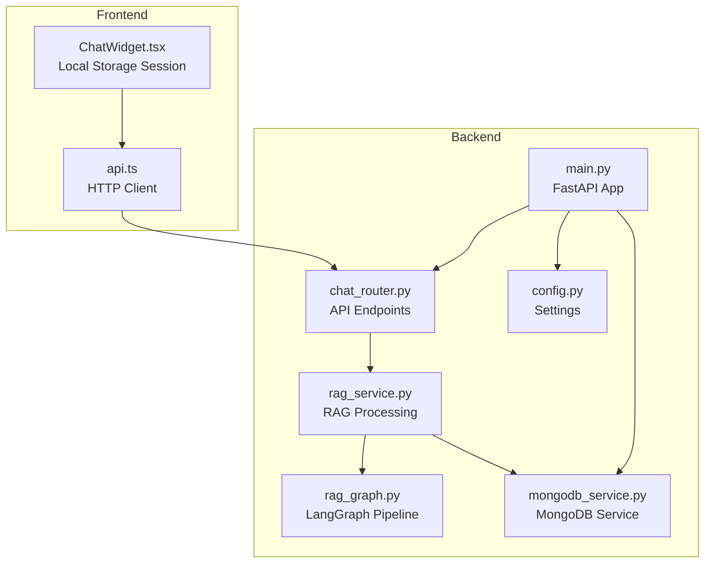
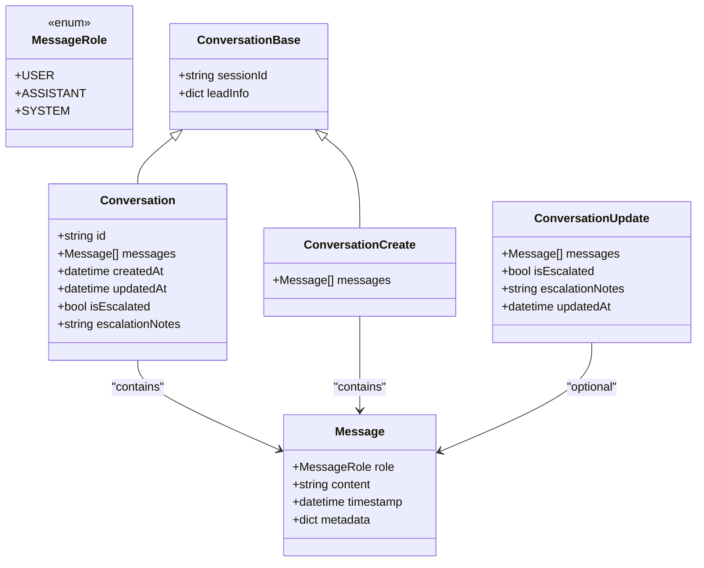
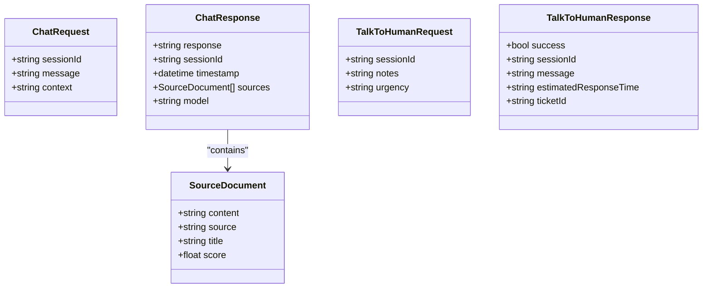
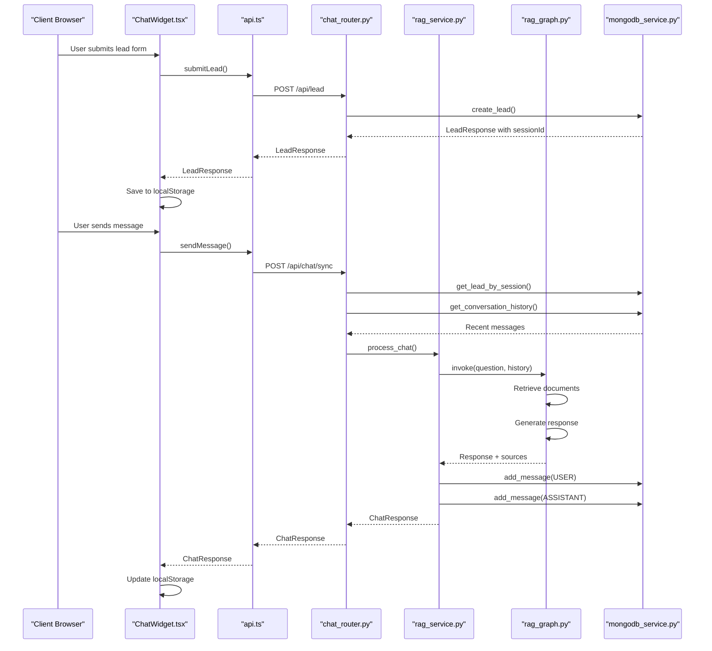
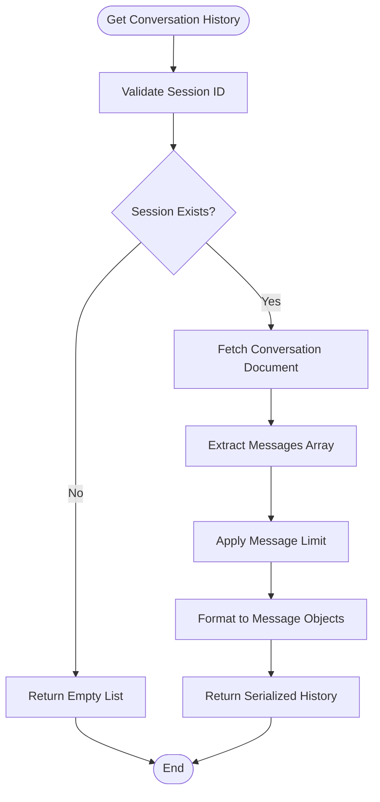
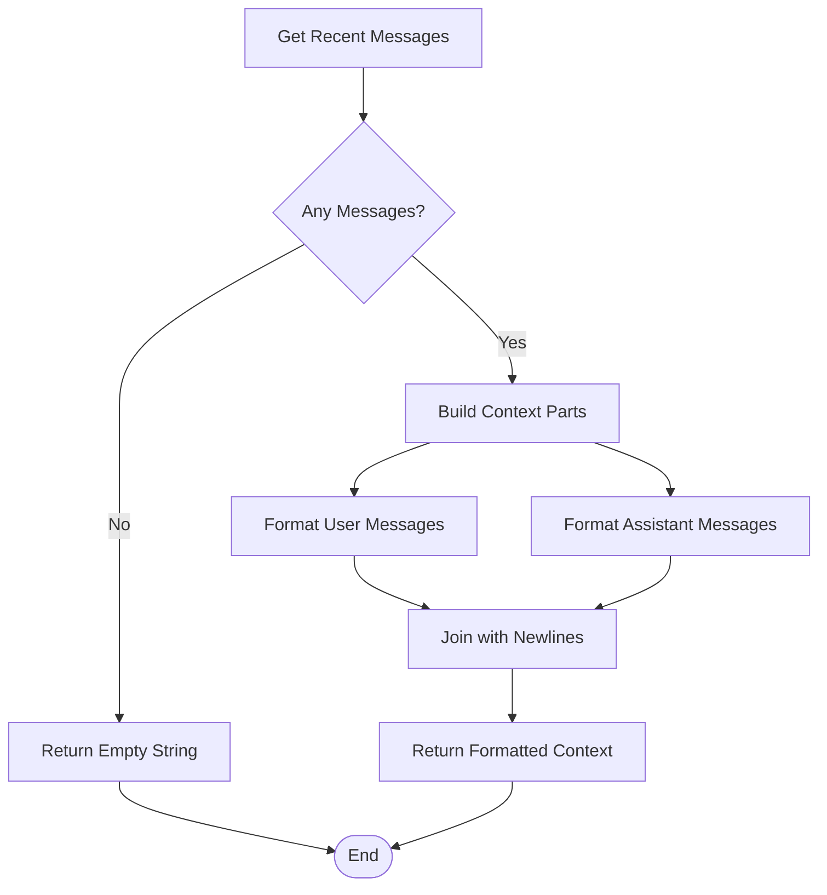
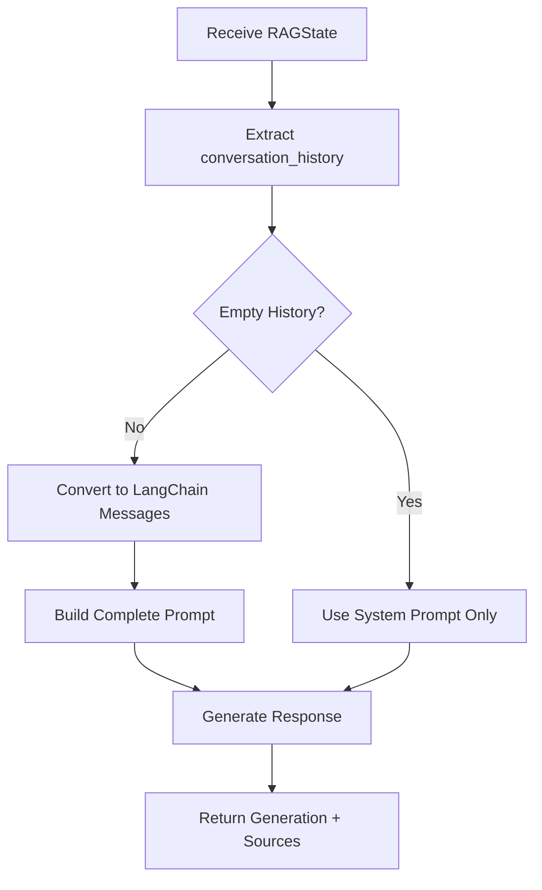
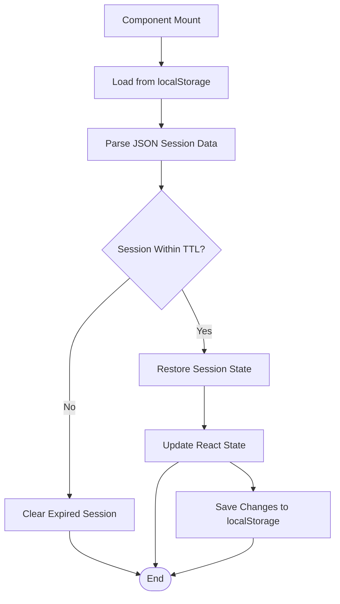
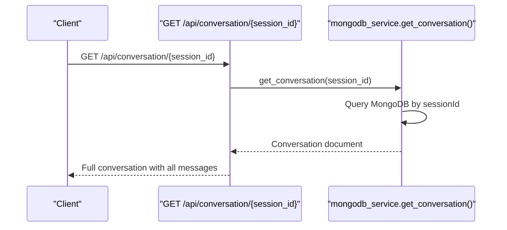
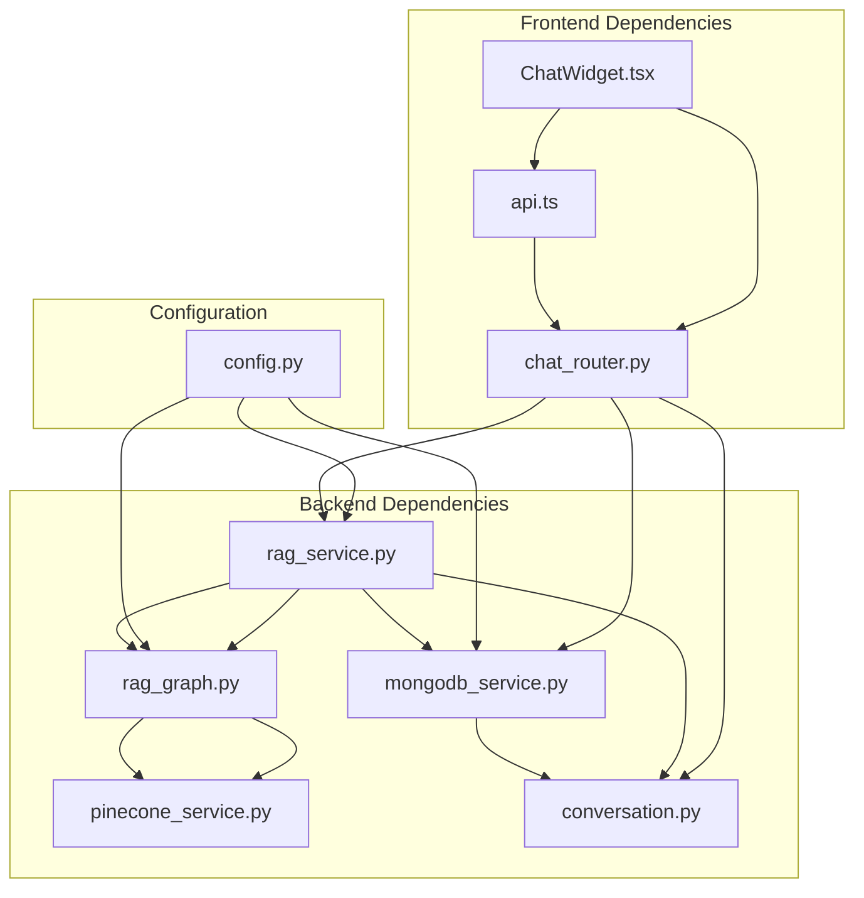

# Conversation Memory Management

<cite>
**Referenced Files in This Document**
- [conversation.py](file://backend/app/models/conversation.py)
- [chat.py](file://backend/app/models/chat.py)
- [mongodb_service.py](file://backend/app/services/mongodb_service.py)
- [rag_graph.py](file://backend/app/graph/rag_graph.py)
- [rag_service.py](file://backend/app/services/rag_service.py)
- [chat_router.py](file://backend/app/routers/chat_router.py)
- [config.py](file://backend/app/config.py)
- [main.py](file://backend/app/main.py)
- [api.ts](file://frontend/lib/api.ts)
- [ChatWidget.tsx](file://frontend/components/chat/ChatWidget.tsx)
</cite>

## Table of Contents
1. [Introduction](#introduction)
2. [Project Structure](#project-structure)
3. [Core Components](#core-components)
4. [Architecture Overview](#architecture-overview)
5. [Detailed Component Analysis](#detailed-component-analysis)
6. [Dependency Analysis](#dependency-analysis)
7. [Performance Considerations](#performance-considerations)
8. [Troubleshooting Guide](#troubleshooting-guide)
9. [Conclusion](#conclusion)

## Introduction

This document provides comprehensive coverage of conversation memory management in the Hitech RAG Chatbot system. It explains how conversation history is maintained and passed through the RAG pipeline, documents the integration with MongoDB for persistent storage, and details conversation state management. The documentation includes examples of conversation retrieval, message serialization/deserialization, and session-based conversation handling, along with memory optimization strategies, conversation length limits, and historical context preservation techniques.

## Project Structure

The conversation memory management spans both backend and frontend components:

- Backend: FastAPI application with MongoDB persistence, RAG pipeline, and API endpoints
- Frontend: Next.js chat widget with local session storage and real-time conversation updates

**Diagram sources**
- [main.py:14-37](file://backend/app/main.py#L14-L37)
- [chat_router.py:12-56](file://backend/app/routers/chat_router.py#L12-L56)
- [rag_service.py:19-87](file://backend/app/services/rag_service.py#L19-L87)
- [rag_graph.py:26-251](file://backend/app/graph/rag_graph.py#L26-L251)
- [mongodb_service.py:13-202](file://backend/app/services/mongodb_service.py#L13-L202)
- [config.py:7-65](file://backend/app/config.py#L7-L65)

**Section sources**
- [main.py:39-85](file://backend/app/main.py#L39-L85)
- [README.md:64-99](file://README.md#L64-L99)

## Core Components

### Conversation Data Models

The conversation system uses structured Pydantic models for type-safe data handling:

**Diagram sources**
- [conversation.py:8-53](file://backend/app/models/conversation.py#L8-L53)

### Chat Request/Response Models

The chat system defines standardized request and response structures:

**Diagram sources**
- [chat.py:7-45](file://backend/app/models/chat.py#L7-L45)

**Section sources**
- [conversation.py:15-53](file://backend/app/models/conversation.py#L15-L53)
- [chat.py:7-45](file://backend/app/models/chat.py#L7-L45)

## Architecture Overview

The conversation memory management follows a multi-layered approach:

1. **Frontend Session Management**: Local storage maintains session state and conversation history
2. **Backend MongoDB Persistence**: Structured document storage with indexes for efficient retrieval
3. **RAG Pipeline Integration**: Conversation history passed as context to the language model
4. **Real-time Updates**: Bidirectional message synchronization between frontend and backend

**Diagram sources**
- [ChatWidget.tsx:84-142](file://frontend/components/chat/ChatWidget.tsx#L84-L142)
- [api.ts:61-85](file://frontend/lib/api.ts#L61-L85)
- [chat_router.py:12-56](file://backend/app/routers/chat_router.py#L12-L56)
- [rag_service.py:19-87](file://backend/app/services/rag_service.py#L19-L87)
- [rag_graph.py:221-251](file://backend/app/graph/rag_graph.py#L221-L251)
- [mongodb_service.py:113-160](file://backend/app/services/mongodb_service.py#L113-L160)

## Detailed Component Analysis

### MongoDB Conversation Storage

The MongoDB service provides comprehensive conversation management:

#### Conversation Retrieval and Serialization

**Diagram sources**
- [mongodb_service.py:135-145](file://backend/app/services/mongodb_service.py#L135-L145)

#### Message Serialization/Deserialization

The system handles bidirectional message conversion:

- **Backend to Frontend**: MongoDB documents serialized to Pydantic Message models
- **Frontend to Backend**: Client messages deserialized from JSON to MongoDB format

#### Conversation Context Formatting

**Diagram sources**
- [mongodb_service.py:147-159](file://backend/app/services/mongodb_service.py#L147-L159)

**Section sources**
- [mongodb_service.py:96-192](file://backend/app/services/mongodb_service.py#L96-L192)

### RAG Pipeline Integration

The LangGraph pipeline integrates conversation history as contextual memory:

#### Conversation History Processing

**Diagram sources**
- [rag_graph.py:166-219](file://backend/app/graph/rag_graph.py#L166-L219)

#### Memory Optimization Strategies

The RAG pipeline implements several memory optimization techniques:

1. **Fixed History Limit**: Configurable maximum conversation history (default: 10 messages)
2. **Selective Context**: Only recent messages included in prompt construction
3. **Document Filtering**: Similarity threshold filtering reduces irrelevant context
4. **Query Transformation**: Fallback mechanism when no relevant documents found

**Section sources**
- [rag_graph.py:15-24](file://backend/app/graph/rag_graph.py#L15-L24)
- [rag_graph.py:166-219](file://backend/app/graph/rag_graph.py#L166-L219)

### Frontend Session Management

The frontend implements robust session persistence:

#### Local Storage Session Handling

**Diagram sources**
- [ChatWidget.tsx:38-77](file://frontend/components/chat/ChatWidget.tsx#L38-L77)

#### Real-time Conversation Updates

The frontend maintains synchronized conversation state:

- **Local State**: React state for immediate UI updates
- **Persistent Storage**: localStorage for session continuity
- **Backend Sync**: Real-time updates via API calls

**Section sources**
- [ChatWidget.tsx:24-77](file://frontend/components/chat/ChatWidget.tsx#L24-L77)
- [api.ts:66-85](file://frontend/lib/api.ts#L66-L85)

### API Integration Points

The conversation memory system exposes multiple integration points:

#### Conversation Retrieval Endpoint

**Diagram sources**
- [chat_router.py:120-129](file://backend/app/routers/chat_router.py#L120-L129)
- [mongodb_service.py:113-115](file://backend/app/services/mongodb_service.py#L113-L115)

**Section sources**
- [chat_router.py:120-129](file://backend/app/routers/chat_router.py#L120-L129)
- [mongodb_service.py:113-115](file://backend/app/services/mongodb_service.py#L113-L115)

## Dependency Analysis

The conversation memory system exhibits clean separation of concerns:

**Diagram sources**
- [main.py:14-37](file://backend/app/main.py#L14-L37)
- [chat_router.py:12-56](file://backend/app/routers/chat_router.py#L12-L56)
- [rag_service.py:14-17](file://backend/app/services/rag_service.py#L14-L17)
- [rag_graph.py:11-38](file://backend/app/graph/rag_graph.py#L11-L38)
- [mongodb_service.py:8-10](file://backend/app/services/mongodb_service.py#L8-L10)

### Coupling and Cohesion Analysis

**High Cohesion Areas:**
- MongoDB service encapsulates all conversation persistence logic
- RAG service manages the complete conversation processing pipeline
- Frontend widget handles all session state management

**Low Coupling Benefits:**
- Independent scaling of frontend and backend components
- Modular testing capabilities
- Easy replacement of individual components

**Potential Circular Dependencies:**
- None detected between services and models
- Clear dependency direction from models to services

**Section sources**
- [main.py:14-37](file://backend/app/main.py#L14-L37)
- [config.py:7-65](file://backend/app/config.py#L7-L65)

## Performance Considerations

### Memory Optimization Strategies

1. **Conversation Length Limits**: Configurable maximum history (default: 10 messages)
2. **Selective Context Loading**: Only recent messages retrieved from database
3. **Efficient Indexing**: MongoDB indexes on sessionId and timestamps
4. **Batch Operations**: MongoDB bulk operations for message updates

### Scalability Considerations

- **Database Indexes**: Proper indexing on frequently queried fields
- **Connection Pooling**: Async MongoDB connections for concurrent requests
- **Caching Layer**: Potential Redis cache for frequently accessed conversations
- **Pagination**: Future enhancement for very long conversation histories

### Memory Management Best Practices

- **Session TTL**: 24-hour session expiration prevents memory bloat
- **Escalation Cleanup**: Automatic cleanup of escalated conversations
- **Background Jobs**: Scheduled cleanup of expired sessions

## Troubleshooting Guide

### Common Issues and Solutions

#### Conversation Not Found Errors

**Symptoms**: 404 errors when accessing conversation history
**Causes**: 
- Invalid session ID
- Expired session (older than 24 hours)
- MongoDB connection issues

**Solutions**:
- Verify session ID validity
- Check MongoDB connectivity
- Implement session regeneration

#### Memory Limit Exceeded

**Symptoms**: RAG responses becoming truncated or incomplete
**Causes**: 
- Excessive conversation history
- Large message content
- Insufficient LLM context window

**Solutions**:
- Reduce MAX_CONVERSATION_HISTORY setting
- Implement message summarization
- Use document-based context instead of full history

#### Escalation Issues

**Symptoms**: Human escalation not working properly
**Causes**:
- MongoDB update failures
- Session validation errors
- Missing escalation notes

**Solutions**:
- Check MongoDB write permissions
- Validate session existence
- Implement fallback escalation handling

**Section sources**
- [chat_router.py:27-55](file://backend/app/routers/chat_router.py#L27-L55)
- [rag_service.py:89-106](file://backend/app/services/rag_service.py#L89-L106)
- [mongodb_service.py:161-180](file://backend/app/services/mongodb_service.py#L161-L180)

## Conclusion

The Hitech RAG Chatbot implements a robust conversation memory management system that effectively balances persistence, performance, and user experience. The architecture demonstrates strong separation of concerns with clear boundaries between frontend session management and backend MongoDB persistence.

Key strengths of the system include:

- **Structured Data Models**: Pydantic models ensure type safety and validation
- **Flexible Storage**: MongoDB provides scalable document storage with efficient indexing
- **Optimized RAG Integration**: Conversation history seamlessly integrated into the pipeline
- **Session Persistence**: Dual-layer approach combining frontend localStorage and backend MongoDB
- **Scalable Design**: Modular architecture supports future enhancements

The system successfully addresses conversation memory challenges through configurable limits, efficient serialization/deserialization, and intelligent context preservation. The combination of frontend session management and backend persistence creates a resilient system that maintains conversation state across browser sessions while providing reliable server-side storage for analytics and escalation scenarios.

Future enhancements could include advanced memory compression, conversation summarization, and more sophisticated context selection algorithms to further optimize performance while maintaining conversational coherence.