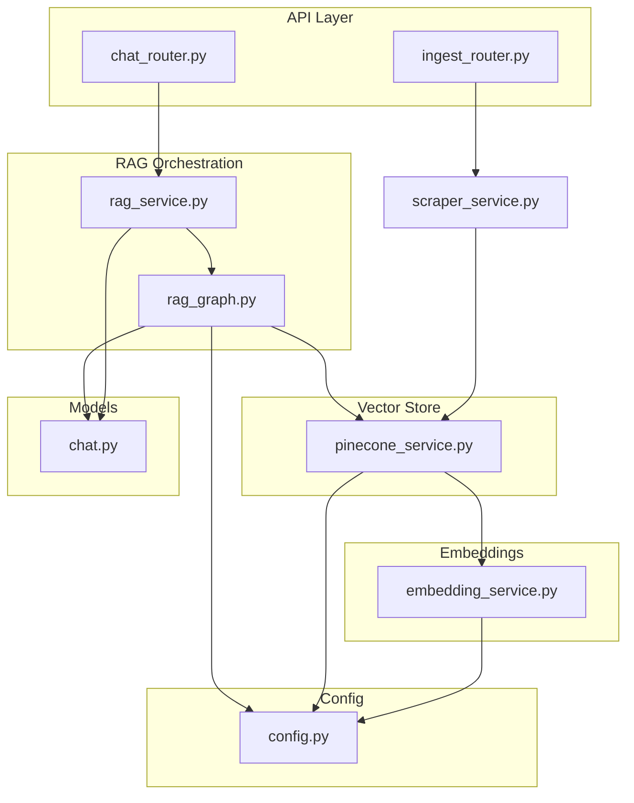
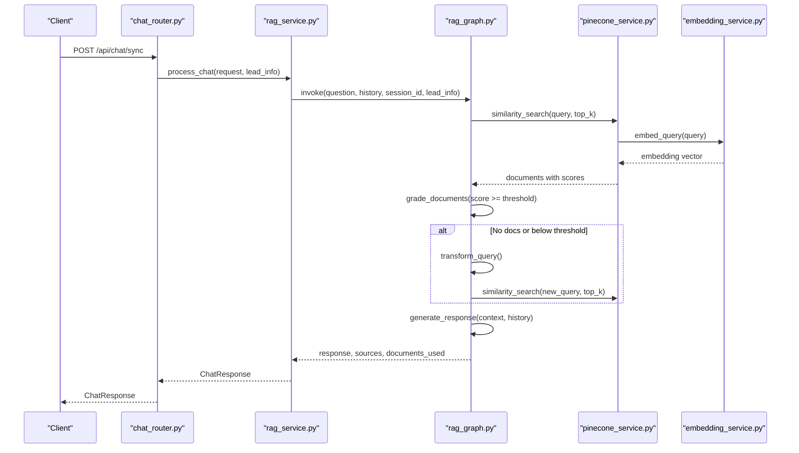
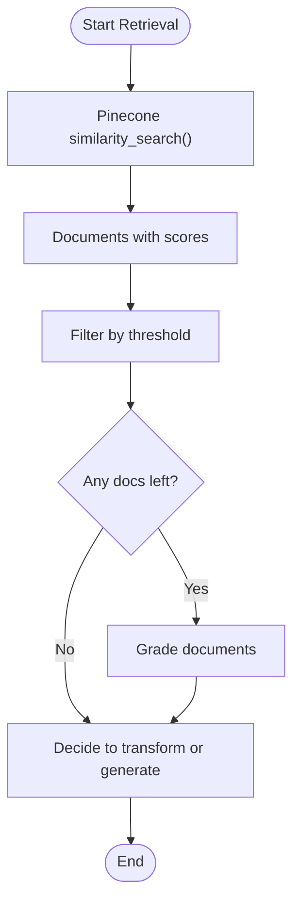
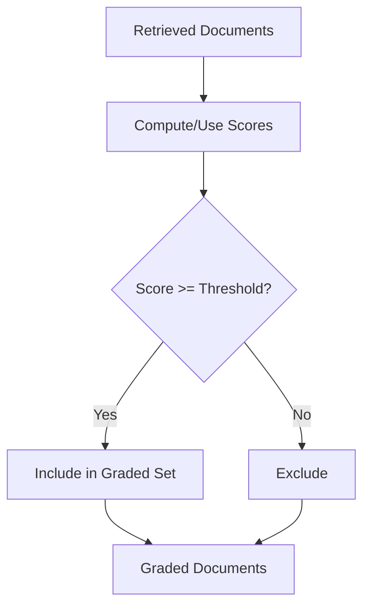
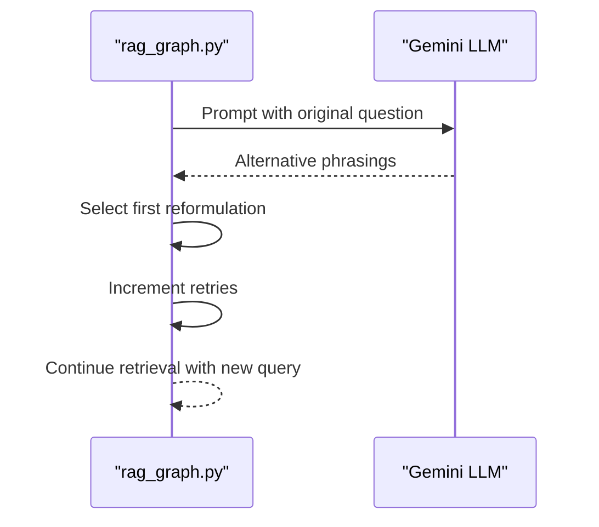
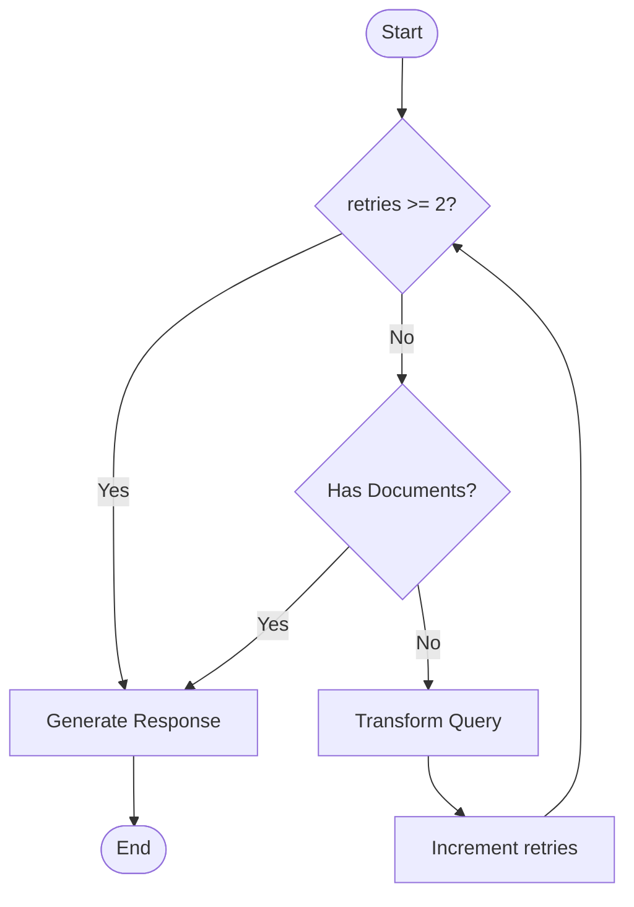
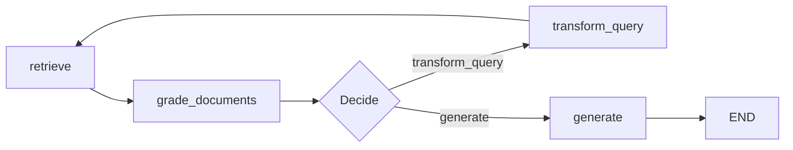
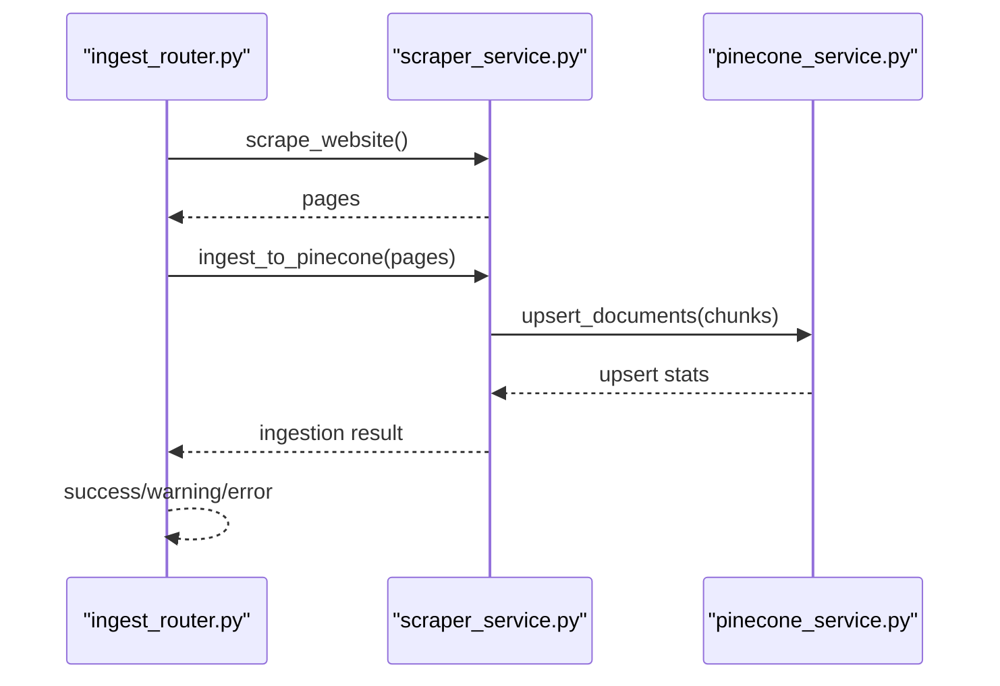
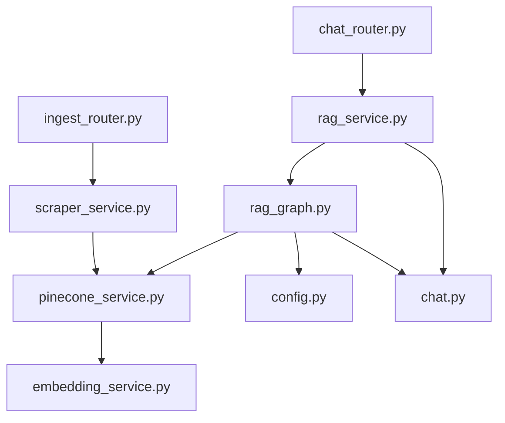

# Document Retrieval and Grading

<cite>
**Referenced Files in This Document**
- [rag_graph.py](file://backend/app/graph/rag_graph.py)
- [pinecone_service.py](file://backend/app/services/pinecone_service.py)
- [embedding_service.py](file://backend/app/services/embedding_service.py)
- [rag_service.py](file://backend/app/services/rag_service.py)
- [chat_router.py](file://backend/app/routers/chat_router.py)
- [config.py](file://backend/app/config.py)
- [ingest_router.py](file://backend/app/routers/ingest_router.py)
- [scraper_service.py](file://backend/app/services/scraper_service.py)
- [chat.py](file://backend/app/models/chat.py)
</cite>

## Table of Contents
1. [Introduction](#introduction)
2. [Project Structure](#project-structure)
3. [Core Components](#core-components)
4. [Architecture Overview](#architecture-overview)
5. [Detailed Component Analysis](#detailed-component-analysis)
6. [Dependency Analysis](#dependency-analysis)
7. [Performance Considerations](#performance-considerations)
8. [Troubleshooting Guide](#troubleshooting-guide)
9. [Conclusion](#conclusion)

## Introduction
This document explains the document retrieval and grading system used by the Hitech RAG Chatbot. It covers how similarity search is implemented using Pinecone, how documents are filtered based on similarity thresholds, and how the document grading mechanism works. It also documents query transformation for improved retrieval, the retry logic with maximum attempts, and the integration between retrieval and grading nodes. Finally, it provides performance considerations, vector search optimization tips, and error handling strategies for failed retrievals.

## Project Structure
The retrieval and grading pipeline spans several backend modules:
- Graph-based workflow orchestrating retrieval, grading, query transformation, and generation
- Pinecone vector store service for similarity search
- Embedding service for query and document embeddings
- RAG service coordinating chat requests and persistence
- API routers exposing chat and ingestion endpoints
- Configuration settings controlling thresholds, top-k, and model parameters

**Diagram sources**
- [chat_router.py:12-56](file://backend/app/routers/chat_router.py#L12-L56)
- [rag_graph.py:40-69](file://backend/app/graph/rag_graph.py#L40-L69)
- [rag_service.py:19-87](file://backend/app/services/rag_service.py#L19-L87)
- [pinecone_service.py:108-154](file://backend/app/services/pinecone_service.py#L108-L154)
- [embedding_service.py:55-77](file://backend/app/services/embedding_service.py#L55-L77)
- [ingest_router.py:26-67](file://backend/app/routers/ingest_router.py#L26-L67)
- [scraper_service.py:250-306](file://backend/app/services/scraper_service.py#L250-L306)
- [chat.py:7-29](file://backend/app/models/chat.py#L7-L29)
- [config.py:31-36](file://backend/app/config.py#L31-L36)

**Section sources**
- [rag_graph.py:15-24](file://backend/app/graph/rag_graph.py#L15-L24)
- [pinecone_service.py:10-26](file://backend/app/services/pinecone_service.py#L10-L26)
- [embedding_service.py:10-28](file://backend/app/services/embedding_service.py#L10-L28)
- [rag_service.py:11-18](file://backend/app/services/rag_service.py#L11-L18)
- [chat_router.py:12-56](file://backend/app/routers/chat_router.py#L12-L56)
- [config.py:31-36](file://backend/app/config.py#L31-L36)

## Core Components
- RAG Pipeline: Orchestrates retrieval, document grading, query transformation, and generation using LangGraph.
- Pinecone Service: Manages index lifecycle, upserts, and similarity search with embeddings.
- Embedding Service: Generates dense embeddings for queries and documents using BGE-M3.
- RAG Service: Coordinates chat requests, conversation history retrieval, and persistence.
- API Routers: Expose endpoints for synchronous chat and ingestion management.
- Configuration: Defines similarity thresholds, top-k, chunk sizes, and model parameters.

**Section sources**
- [rag_graph.py:26-69](file://backend/app/graph/rag_graph.py#L26-L69)
- [pinecone_service.py:108-154](file://backend/app/services/pinecone_service.py#L108-L154)
- [embedding_service.py:55-77](file://backend/app/services/embedding_service.py#L55-L77)
- [rag_service.py:19-87](file://backend/app/services/rag_service.py#L19-L87)
- [chat_router.py:12-56](file://backend/app/routers/chat_router.py#L12-L56)
- [config.py:31-36](file://backend/app/config.py#L31-L36)

## Architecture Overview
The retrieval and grading system follows a LangGraph workflow:
- Retrieve: Queries Pinecone with an embedding of the user’s question.
- Grade Documents: Filters results by a configurable similarity threshold.
- Decide to Generate or Transform Query: If no documents or threshold not met, transform the query; otherwise, generate.
- Transform Query: Uses LLM to produce alternative phrasings and retries.
- Generate: Builds a contextual prompt from top documents and generates a response.

**Diagram sources**
- [chat_router.py:12-56](file://backend/app/routers/chat_router.py#L12-L56)
- [rag_service.py:19-87](file://backend/app/services/rag_service.py#L19-L87)
- [rag_graph.py:71-219](file://backend/app/graph/rag_graph.py#L71-L219)
- [pinecone_service.py:108-154](file://backend/app/services/pinecone_service.py#L108-L154)
- [embedding_service.py:55-77](file://backend/app/services/embedding_service.py#L55-L77)

## Detailed Component Analysis

### Similarity Search Implementation Using Pinecone
- Embedding Generation: Queries are embedded using BGE-M3 with a dedicated instruction to improve retrieval quality.
- Index Initialization: Ensures the Pinecone index exists with the correct dimension and metric.
- Similarity Search: Performs vector search with top-k results and includes metadata for downstream processing.
- Filtering: Documents are filtered by a configurable similarity threshold.

Key behaviors:
- Query embedding is generated before querying the index.
- Results include content and metadata fields for downstream use.
- Threshold-based filtering occurs both during retrieval and grading.

**Section sources**
- [embedding_service.py:55-77](file://backend/app/services/embedding_service.py#L55-L77)
- [pinecone_service.py:27-55](file://backend/app/services/pinecone_service.py#L27-L55)
- [pinecone_service.py:108-154](file://backend/app/services/pinecone_service.py#L108-L154)
- [rag_graph.py:71-91](file://backend/app/graph/rag_graph.py#L71-L91)
- [rag_graph.py:93-108](file://backend/app/graph/rag_graph.py#L93-L108)
- [config.py:31-36](file://backend/app/config.py#L31-L36)

### Filtering Logic Based on Similarity Thresholds
- Retrieval-level filtering: Documents whose similarity score meets or exceeds the configured threshold are retained.
- Grading-level filtering: Re-validates and prunes documents using the same threshold.
- Threshold configuration: Controlled via settings for consistent behavior across the pipeline.

**Diagram sources**
- [rag_graph.py:71-108](file://backend/app/graph/rag_graph.py#L71-L108)
- [config.py:31-36](file://backend/app/config.py#L31-L36)

**Section sources**
- [rag_graph.py:80-84](file://backend/app/graph/rag_graph.py#L80-L84)
- [rag_graph.py:100-104](file://backend/app/graph/rag_graph.py#L100-L104)
- [config.py:31-36](file://backend/app/config.py#L31-L36)

### Document Grading Mechanism
- Purpose: Ensure only semantically relevant documents are used for generation.
- Process: Applies the same threshold filter to the retrieved set.
- Outcome: Produces a refined document list passed to the generation stage.

**Diagram sources**
- [rag_graph.py:93-108](file://backend/app/graph/rag_graph.py#L93-L108)
- [config.py:31-36](file://backend/app/config.py#L31-L36)

**Section sources**
- [rag_graph.py:93-108](file://backend/app/graph/rag_graph.py#L93-L108)
- [config.py:31-36](file://backend/app/config.py#L31-L36)

### Query Transformation for Better Retrieval
- When no documents are found or the threshold is not met, the system transforms the query.
- The transformation prompts an LLM to produce alternative phrasings focused on keywords and intent.
- The first reformulation becomes the new query; the retry counter increments.

**Diagram sources**
- [rag_graph.py:122-148](file://backend/app/graph/rag_graph.py#L122-L148)

**Section sources**
- [rag_graph.py:122-148](file://backend/app/graph/rag_graph.py#L122-L148)

### Retry Logic with Maximum Attempts
- The pipeline tracks retries in the state.
- After two retries, the system proceeds to generation regardless of document availability.
- This prevents infinite loops and ensures a response is produced.

**Diagram sources**
- [rag_graph.py:110-120](file://backend/app/graph/rag_graph.py#L110-L120)
- [rag_graph.py:144-148](file://backend/app/graph/rag_graph.py#L144-L148)

**Section sources**
- [rag_graph.py:110-120](file://backend/app/graph/rag_graph.py#L110-L120)
- [rag_graph.py:144-148](file://backend/app/graph/rag_graph.py#L144-L148)

### Integration Between Retrieval and Grading Nodes
- The LangGraph workflow connects retrieval to grading via explicit edges.
- After retrieval, the pipeline evaluates whether to transform the query or proceed to generation.
- The grading node refines the document set before generation.

**Diagram sources**
- [rag_graph.py:44-69](file://backend/app/graph/rag_graph.py#L44-L69)

**Section sources**
- [rag_graph.py:44-69](file://backend/app/graph/rag_graph.py#L44-L69)

### Ingestion Pipeline and Vector Store Population
- Web scraping extracts pages, cleans content, and chunks into overlapping segments.
- Embeddings are generated for each chunk and upserted into Pinecone.
- Statistics and status endpoints expose ingestion progress and index health.

**Diagram sources**
- [ingest_router.py:26-67](file://backend/app/routers/ingest_router.py#L26-L67)
- [scraper_service.py:195-248](file://backend/app/services/scraper_service.py#L195-L248)
- [scraper_service.py:250-306](file://backend/app/services/scraper_service.py#L250-L306)
- [pinecone_service.py:62-106](file://backend/app/services/pinecone_service.py#L62-L106)

**Section sources**
- [ingest_router.py:26-67](file://backend/app/routers/ingest_router.py#L26-L67)
- [scraper_service.py:195-248](file://backend/app/services/scraper_service.py#L195-L248)
- [scraper_service.py:250-306](file://backend/app/services/scraper_service.py#L250-L306)
- [pinecone_service.py:62-106](file://backend/app/services/pinecone_service.py#L62-L106)

## Dependency Analysis
- Retrieval depends on Pinecone for vector similarity and Embedding Service for query embeddings.
- Grading depends on the threshold configuration and the retrieved document set.
- Generation depends on the graded document set and conversation history.
- API routers depend on RAG service and MongoDB for session and conversation management.

**Diagram sources**
- [rag_graph.py:37-38](file://backend/app/graph/rag_graph.py#L37-L38)
- [pinecone_service.py:108-154](file://backend/app/services/pinecone_service.py#L108-L154)
- [embedding_service.py:55-77](file://backend/app/services/embedding_service.py#L55-L77)
- [rag_service.py:17-18](file://backend/app/services/rag_service.py#L17-L18)
- [chat_router.py:16-17](file://backend/app/routers/chat_router.py#L16-L17)
- [ingest_router.py:31-32](file://backend/app/routers/ingest_router.py#L31-L32)
- [scraper_service.py:260-261](file://backend/app/services/scraper_service.py#L260-L261)
- [chat.py:7-29](file://backend/app/models/chat.py#L7-L29)

**Section sources**
- [rag_graph.py:37-38](file://backend/app/graph/rag_graph.py#L37-L38)
- [rag_service.py:17-18](file://backend/app/services/rag_service.py#L17-L18)
- [chat_router.py:16-17](file://backend/app/routers/chat_router.py#L16-L17)
- [ingest_router.py:31-32](file://backend/app/routers/ingest_router.py#L31-L32)
- [scraper_service.py:260-261](file://backend/app/services/scraper_service.py#L260-L261)

## Performance Considerations
- Embedding Model: BGE-M3 is used with CPU optimization for serverless deployments; consider GPU acceleration for higher throughput.
- Chunking Strategy: Overlapping chunks improve recall; tune chunk size and overlap for balance between precision and cost.
- Top-K Selection: Adjust top_k to trade off recall and latency; larger k increases computation and memory.
- Index Dimensionality: Ensure embedding dimension matches Pinecone index dimension.
- Batch Upsert: Pinecone upsert batches reduce network overhead; tune batch size for throughput.
- Query Instruction: Adding a query instruction improves retrieval quality without changing index structure.
- Caching: LRU cache for settings reduces repeated reads; consider caching embeddings for repeated queries.

[No sources needed since this section provides general guidance]

## Troubleshooting Guide
Common issues and resolutions:
- Pinecone Index Not Found: The service creates the index automatically if missing; verify API key and index name.
- Empty or Low-Quality Results: Increase top_k or adjust similarity threshold; ensure embeddings are generated correctly.
- Slow Retrieval: Reduce top_k, enable batching, or optimize chunk size; monitor embedding model performance.
- Conversation Escalation: If a conversation is escalated, the chat endpoint returns a predefined message; verify MongoDB escalation flag.
- API Errors: The chat endpoint wraps exceptions and returns structured error messages; inspect logs for underlying causes.

**Section sources**
- [pinecone_service.py:27-55](file://backend/app/services/pinecone_service.py#L27-L55)
- [chat_router.py:27-55](file://backend/app/routers/chat_router.py#L27-L55)
- [rag_service.py:42-48](file://backend/app/services/rag_service.py#L42-L48)

## Conclusion
The document retrieval and grading system integrates LangGraph orchestration, Pinecone vector search, and BGE-M3 embeddings to deliver high-quality, context-aware responses. The pipeline applies threshold-based filtering, iterative query transformation, and controlled retries to maximize relevance and reliability. The ingestion pipeline prepares the knowledgebase with efficient chunking and embedding, while the API layer ensures robust error handling and session management.