# RAG Pipeline Architecture

<cite>
**Referenced Files in This Document**
- [rag_graph.py](file://backend/app/graph/rag_graph.py)
- [rag_service.py](file://backend/app/services/rag_service.py)
- [pinecone_service.py](file://backend/app/services/pinecone_service.py)
- [embedding_service.py](file://backend/app/services/embedding_service.py)
- [config.py](file://backend/app/config.py)
- [chat_router.py](file://backend/app/routers/chat_router.py)
- [main.py](file://backend/app/main.py)
- [chat.py](file://backend/app/models/chat.py)
- [ingest_router.py](file://backend/app/routers/ingest_router.py)
</cite>

## Table of Contents
1. [Introduction](#introduction)
2. [Project Structure](#project-structure)
3. [Core Components](#core-components)
4. [Architecture Overview](#architecture-overview)
5. [Detailed Component Analysis](#detailed-component-analysis)
6. [Dependency Analysis](#dependency-analysis)
7. [Performance Considerations](#performance-considerations)
8. [Troubleshooting Guide](#troubleshooting-guide)
9. [Conclusion](#conclusion)
10. [Appendices](#appendices)

## Introduction
This document explains the RAG pipeline architecture built with LangGraph for the Hitech RAG Chatbot. It covers the state machine design using the RAGState class, the four-node workflow (retrieve, grade_documents, transform_query, generate), conditional logic for decision-making, and the integration with Google Gemini LLM and Pinecone vector store. It also provides examples of pipeline initialization, state management, execution flow, error handling, and retry logic.

## Project Structure
The RAG pipeline is implemented in the backend application under the app directory. Key components include:
- Graph definition and state management in the graph module
- Service orchestration in the services module
- Configuration management in config.py
- API endpoints in routers for chat and ingestion
- Application lifecycle management in main.py

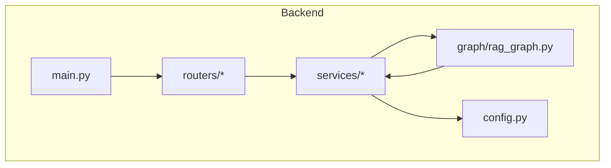

**Diagram sources**
- [main.py:1-90](file://backend/app/main.py#L1-L90)
- [config.py:1-65](file://backend/app/config.py#L1-L65)
- [chat_router.py:1-130](file://backend/app/routers/chat_router.py#L1-L130)
- [rag_graph.py:1-264](file://backend/app/graph/rag_graph.py#L1-L264)

**Section sources**
- [main.py:1-90](file://backend/app/main.py#L1-L90)
- [config.py:1-65](file://backend/app/config.py#L1-L65)

## Core Components
- RAGState: Defines the state schema for the pipeline, including question, generation, documents, conversation_history, session_id, lead_info, and retries.
- RAGPipeline: Implements the LangGraph workflow with four nodes and conditional routing.
- RAGService: Orchestrates chat requests, manages conversation history, and persists results.
- PineconeService: Provides vector store operations for similarity search and upsert.
- EmbeddingService: Generates embeddings using BGE-M3 for vector indexing.
- Configuration: Centralized settings for model parameters, thresholds, and service endpoints.

**Section sources**
- [rag_graph.py:15-24](file://backend/app/graph/rag_graph.py#L15-L24)
- [rag_graph.py:26-69](file://backend/app/graph/rag_graph.py#L26-L69)
- [rag_service.py:11-87](file://backend/app/services/rag_service.py#L11-L87)
- [pinecone_service.py:10-154](file://backend/app/services/pinecone_service.py#L10-L154)
- [embedding_service.py:10-126](file://backend/app/services/embedding_service.py#L10-L126)
- [config.py:7-58](file://backend/app/config.py#L7-L58)

## Architecture Overview
The RAG pipeline follows a LangGraph StateGraph with explicit nodes and edges. The workflow begins with retrieving relevant documents from Pinecone, grades them for relevance, decides whether to generate a response or transform the query, and repeats until a response is produced or a maximum retry threshold is reached.

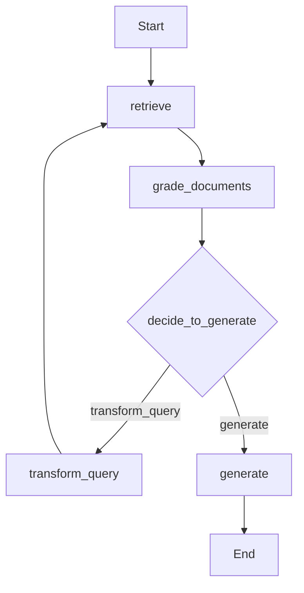

**Diagram sources**
- [rag_graph.py:40-69](file://backend/app/graph/rag_graph.py#L40-L69)
- [rag_graph.py:110-120](file://backend/app/graph/rag_graph.py#L110-L120)

## Detailed Component Analysis

### State Machine Design with RAGState
RAGState defines the shared state across all nodes:
- question: The current user query
- generation: The AI-generated response
- documents: Retrieved and graded documents
- conversation_history: Previous messages formatted for LLM context
- session_id: Conversation session identifier
- lead_info: Personalization data (e.g., fullName, inquiryType)
- retries: Counter for query transformations

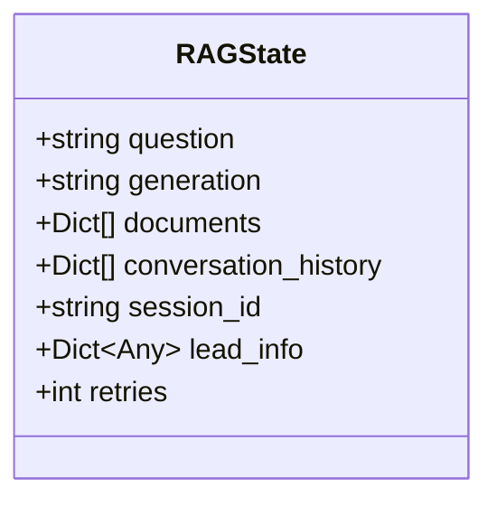

**Diagram sources**
- [rag_graph.py:15-24](file://backend/app/graph/rag_graph.py#L15-L24)

**Section sources**
- [rag_graph.py:15-24](file://backend/app/graph/rag_graph.py#L15-L24)

### LangGraph StateGraph Implementation
The RAGPipeline builds a StateGraph with:
- Nodes: retrieve, grade_documents, transform_query, generate
- Edges: sequential flow from retrieve to grade_documents, conditional edge from grade_documents to either transform_query or generate, and a loop from transform_query back to retrieve
- Entry point: retrieve

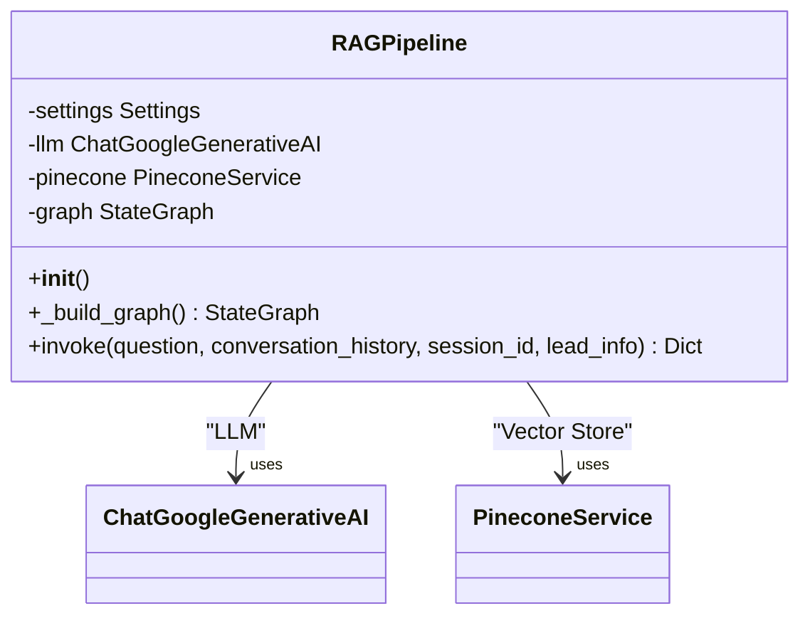

**Diagram sources**
- [rag_graph.py:26-39](file://backend/app/graph/rag_graph.py#L26-L39)
- [rag_graph.py:40-69](file://backend/app/graph/rag_graph.py#L40-L69)

**Section sources**
- [rag_graph.py:26-69](file://backend/app/graph/rag_graph.py#L26-L69)

### Node Functions and Edge Routing
- retrieve: Queries Pinecone for relevant documents and filters by similarity threshold.
- grade_documents: Filters documents based on similarity threshold.
- decide_to_generate: Conditional decision based on retries and presence of documents.
- transform_query: Reformulates the query using Gemini and increments retries.
- generate: Builds context from top documents, personalizes with lead_info, and generates a response using Gemini.

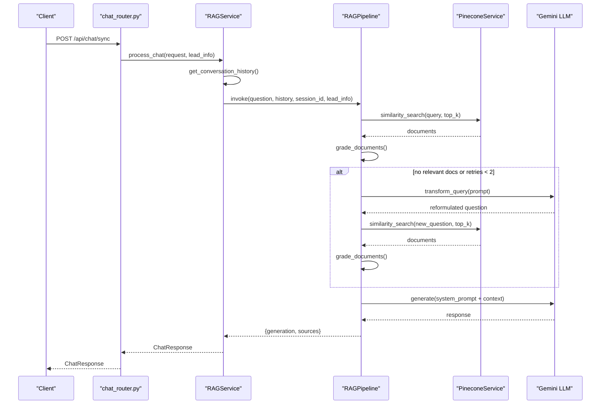

**Diagram sources**
- [chat_router.py:12-47](file://backend/app/routers/chat_router.py#L12-L47)
- [rag_service.py:19-87](file://backend/app/services/rag_service.py#L19-L87)
- [rag_graph.py:71-219](file://backend/app/graph/rag_graph.py#L71-L219)
- [pinecone_service.py:108-154](file://backend/app/services/pinecone_service.py#L108-L154)

**Section sources**
- [rag_graph.py:71-219](file://backend/app/graph/rag_graph.py#L71-L219)
- [pinecone_service.py:108-154](file://backend/app/services/pinecone_service.py#L108-L154)

### Conditional Logic for Decision-Making
The decision function evaluates:
- If retries reach a maximum threshold, generate regardless of document relevance
- If no documents are found, transform the query
- Otherwise, generate the response

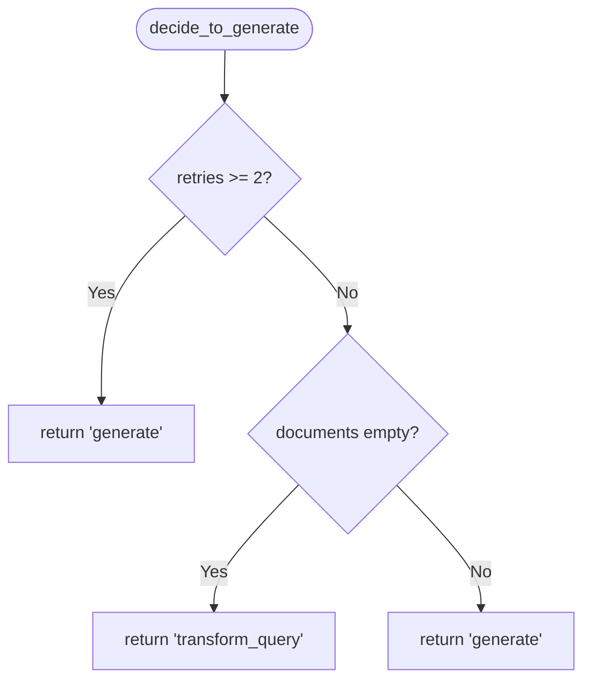

**Diagram sources**
- [rag_graph.py:110-120](file://backend/app/graph/rag_graph.py#L110-L120)

**Section sources**
- [rag_graph.py:110-120](file://backend/app/graph/rag_graph.py#L110-L120)

### Integration with Google Gemini LLM
- LLM initialization uses ChatGoogleGenerativeAI with model, temperature, max_output_tokens, and API key from configuration.
- Prompt templates combine company context, lead personalization, conversation history, and retrieved documents.
- Response generation uses LangChain chain composition with ChatPromptTemplate and LLM.

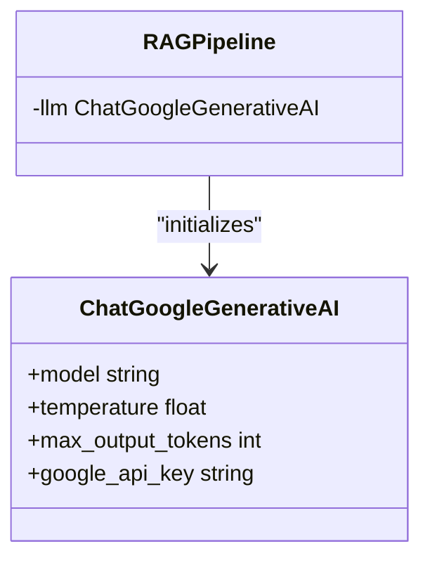

**Diagram sources**
- [rag_graph.py:29-36](file://backend/app/graph/rag_graph.py#L29-L36)
- [rag_graph.py:150-219](file://backend/app/graph/rag_graph.py#L150-L219)

**Section sources**
- [rag_graph.py:29-36](file://backend/app/graph/rag_graph.py#L29-L36)
- [rag_graph.py:150-219](file://backend/app/graph/rag_graph.py#L150-L219)

### Integration with Pinecone Vector Store
- PineconeService initializes the client, ensures the index exists, and performs similarity search.
- EmbeddingService generates embeddings using BGE-M3 for query and document processing.
- The pipeline filters documents by similarity threshold configured in settings.

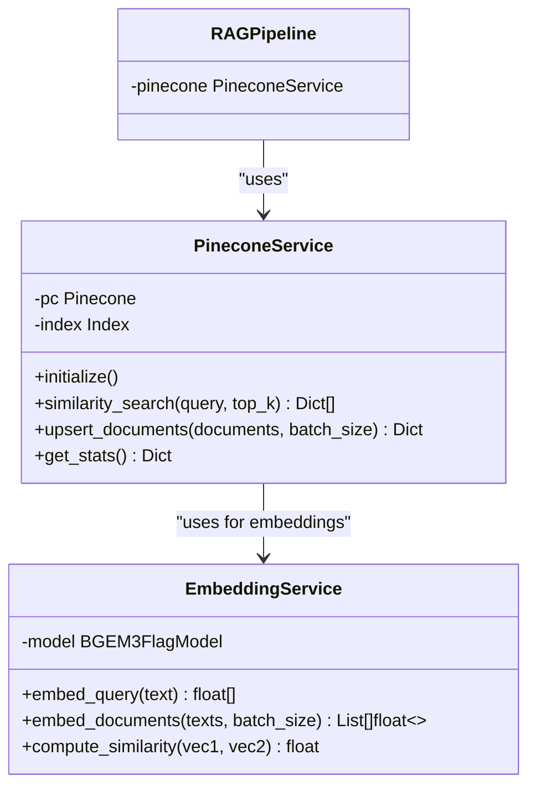

**Diagram sources**
- [pinecone_service.py:10-154](file://backend/app/services/pinecone_service.py#L10-L154)
- [embedding_service.py:10-126](file://backend/app/services/embedding_service.py#L10-L126)
- [rag_graph.py:37-37](file://backend/app/graph/rag_graph.py#L37-L37)

**Section sources**
- [pinecone_service.py:10-154](file://backend/app/services/pinecone_service.py#L10-L154)
- [embedding_service.py:10-126](file://backend/app/services/embedding_service.py#L10-L126)

### State Transitions and Execution Flow
- Initial state is constructed with question, conversation_history, session_id, and lead_info.
- The graph executes retrieve, grade_documents, decide_to_generate, and continues looping until a response is generated.
- The final state includes generation, sources, and documents_used count.

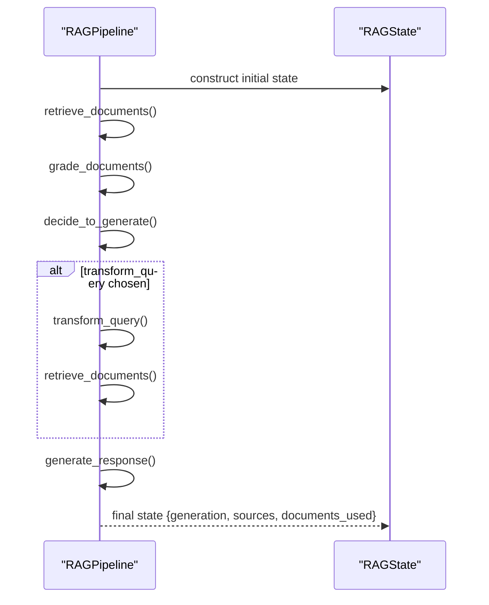

**Diagram sources**
- [rag_graph.py:221-251](file://backend/app/graph/rag_graph.py#L221-L251)
- [rag_graph.py:71-219](file://backend/app/graph/rag_graph.py#L71-L219)

**Section sources**
- [rag_graph.py:221-251](file://backend/app/graph/rag_graph.py#L221-L251)

### Error Handling and Retry Logic
- Retry mechanism: The pipeline increments retries after each query transformation and stops transforming after reaching the maximum threshold.
- HTTP-level error handling: Chat router wraps exceptions and returns structured HTTP errors.
- Persistence: Responses and sources are stored in MongoDB with metadata for auditability.

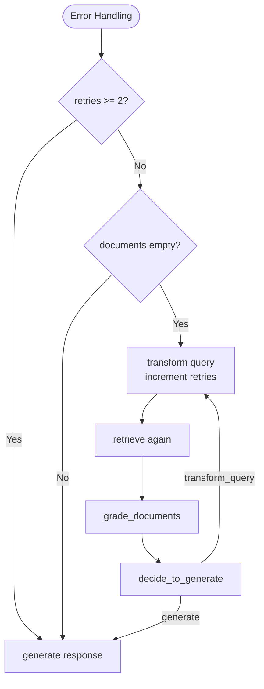

**Diagram sources**
- [rag_graph.py:110-148](file://backend/app/graph/rag_graph.py#L110-L148)
- [chat_router.py:27-55](file://backend/app/routers/chat_router.py#L27-L55)

**Section sources**
- [rag_graph.py:110-148](file://backend/app/graph/rag_graph.py#L110-L148)
- [chat_router.py:27-55](file://backend/app/routers/chat_router.py#L27-L55)

### Pipeline Initialization and Usage
- Application startup initializes MongoDB, Pinecone, and loads the embedding model.
- The RAG pipeline is created as a singleton via create_rag_graph().
- Chat requests trigger the pipeline through RAGService.process_chat(), which formats conversation history and persists results.

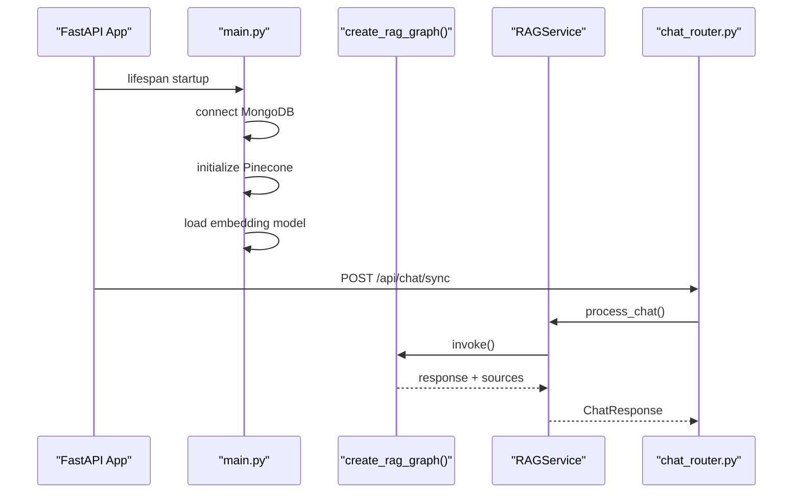

**Diagram sources**
- [main.py:14-36](file://backend/app/main.py#L14-L36)
- [rag_graph.py:258-264](file://backend/app/graph/rag_graph.py#L258-L264)
- [rag_service.py:19-87](file://backend/app/services/rag_service.py#L19-L87)
- [chat_router.py:12-47](file://backend/app/routers/chat_router.py#L12-L47)

**Section sources**
- [main.py:14-36](file://backend/app/main.py#L14-L36)
- [rag_graph.py:258-264](file://backend/app/graph/rag_graph.py#L258-L264)
- [rag_service.py:19-87](file://backend/app/services/rag_service.py#L19-L87)

## Dependency Analysis
The RAG pipeline depends on configuration, vector store, and LLM services. The graph module orchestrates these dependencies and exposes a simple invoke interface.

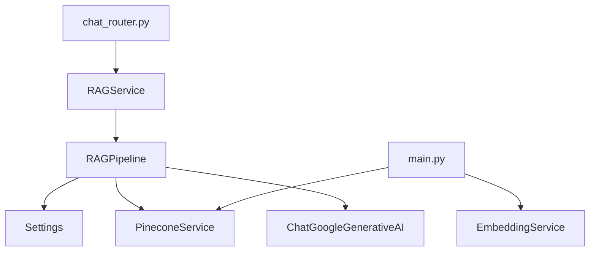

**Diagram sources**
- [rag_graph.py:29-39](file://backend/app/graph/rag_graph.py#L29-L39)
- [rag_service.py:14-17](file://backend/app/services/rag_service.py#L14-L17)
- [chat_router.py:12-47](file://backend/app/routers/chat_router.py#L12-L47)
- [main.py:21-28](file://backend/app/main.py#L21-L28)

**Section sources**
- [rag_graph.py:29-39](file://backend/app/graph/rag_graph.py#L29-L39)
- [rag_service.py:14-17](file://backend/app/services/rag_service.py#L14-L17)
- [chat_router.py:12-47](file://backend/app/routers/chat_router.py#L12-L47)
- [main.py:21-28](file://backend/app/main.py#L21-L28)

## Performance Considerations
- Retrieval efficiency: Adjust RAG_TOP_K and similarity threshold to balance recall and latency.
- Embedding computation: BGE-M3 runs on CPU for serverless compatibility; consider GPU acceleration for production throughput.
- Vector store scaling: Monitor Pinecone index statistics and optimize batch sizes for upsert and query operations.
- LLM token limits: Configure GEMINI_MAX_TOKENS to manage response length and cost.

## Troubleshooting Guide
Common issues and resolutions:
- Missing API keys or invalid credentials: Verify GEMINI_API_KEY and PINECONE_API_KEY in environment variables.
- Index creation failures: Ensure PINECONE_ENVIRONMENT and PINECONE_INDEX_NAME are valid; check network connectivity.
- Empty or irrelevant results: Increase RAG_TOP_K or adjust RAG_SIMILARITY_THRESHOLD; review query transformation prompts.
- Model loading errors: Confirm FlagEmbedding and torch installation; check Python version compatibility.
- HTTP errors: Review chat_router error handling and logs for detailed failure reasons.

**Section sources**
- [config.py:25-33](file://backend/app/config.py#L25-L33)
- [pinecone_service.py:27-55](file://backend/app/services/pinecone_service.py#L27-L55)
- [embedding_service.py:31-48](file://backend/app/services/embedding_service.py#L31-L48)
- [chat_router.py:27-55](file://backend/app/routers/chat_router.py#L27-L55)

## Conclusion
The RAG pipeline leverages LangGraph’s state machine to implement a robust, configurable retrieval-augmented generation workflow. It integrates seamlessly with Pinecone for vector retrieval and Google Gemini for generation, while providing clear conditional logic, retry mechanisms, and persistence. The modular design enables easy extension and maintenance.

## Appendices

### Configuration Options
Key settings controlling pipeline behavior:
- RAG_TOP_K: Number of top results to retrieve
- RAG_SIMILARITY_THRESHOLD: Minimum similarity score for relevance
- GEMINI_MODEL, GEMINI_TEMPERATURE, GEMINI_MAX_TOKENS: LLM generation parameters
- PINECONE_INDEX_NAME, PINECONE_DIMENSION: Vector store configuration

**Section sources**
- [config.py:31-39](file://backend/app/config.py#L31-L39)
- [config.py:25-29](file://backend/app/config.py#L25-L29)
- [config.py:19-23](file://backend/app/config.py#L19-L23)

### API Endpoints
- POST /api/chat/sync: Processes chat messages with RAG pipeline
- POST /api/talk-to-human: Escalates conversation to a human agent
- GET /api/conversation/{session_id}: Retrieves conversation history
- POST /api/ingest: Triggers knowledgebase ingestion from a website
- GET /api/ingest/status: Returns vector store statistics
- DELETE /api/ingest/clear: Clears all vectors from the knowledgebase

**Section sources**
- [chat_router.py:12-130](file://backend/app/routers/chat_router.py#L12-L130)
- [ingest_router.py:26-112](file://backend/app/routers/ingest_router.py#L26-L112)