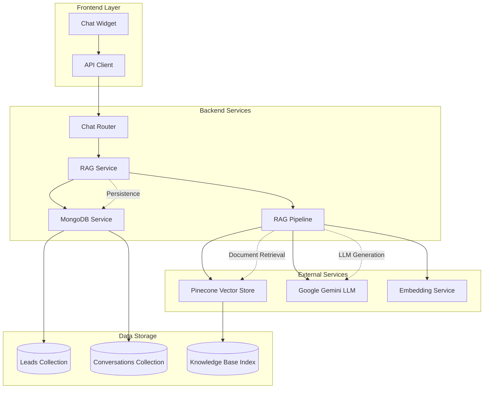
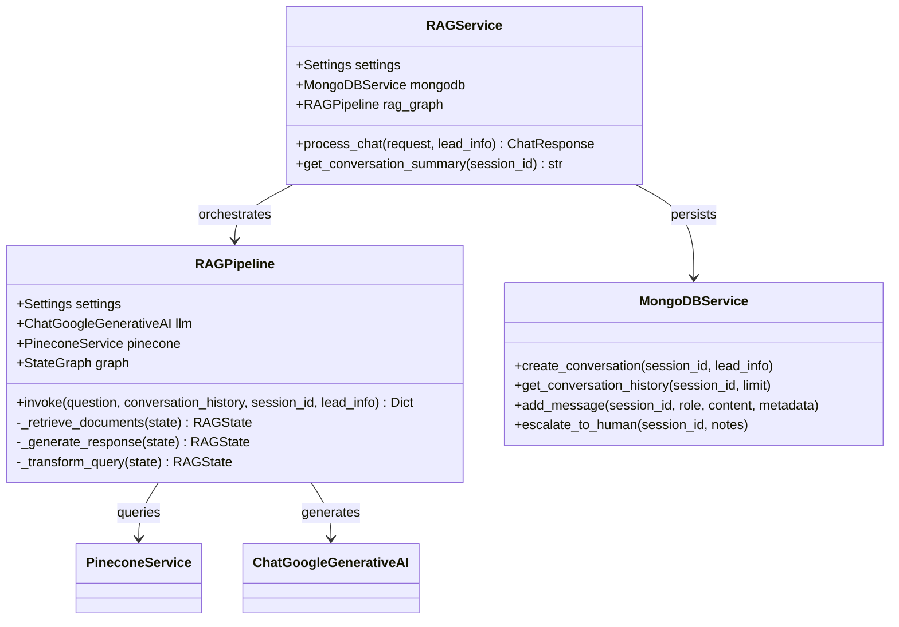
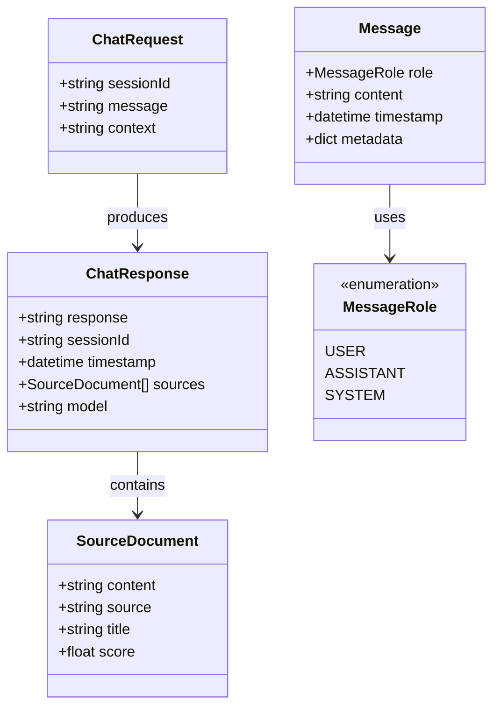
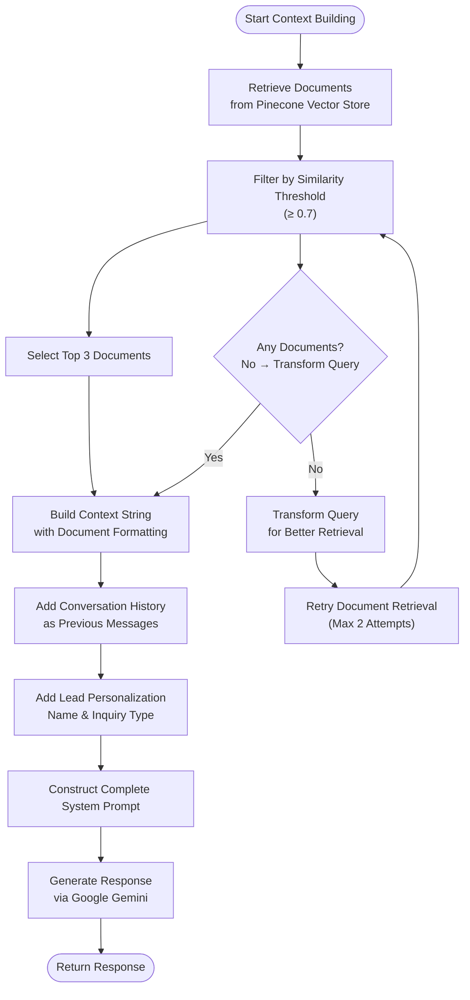
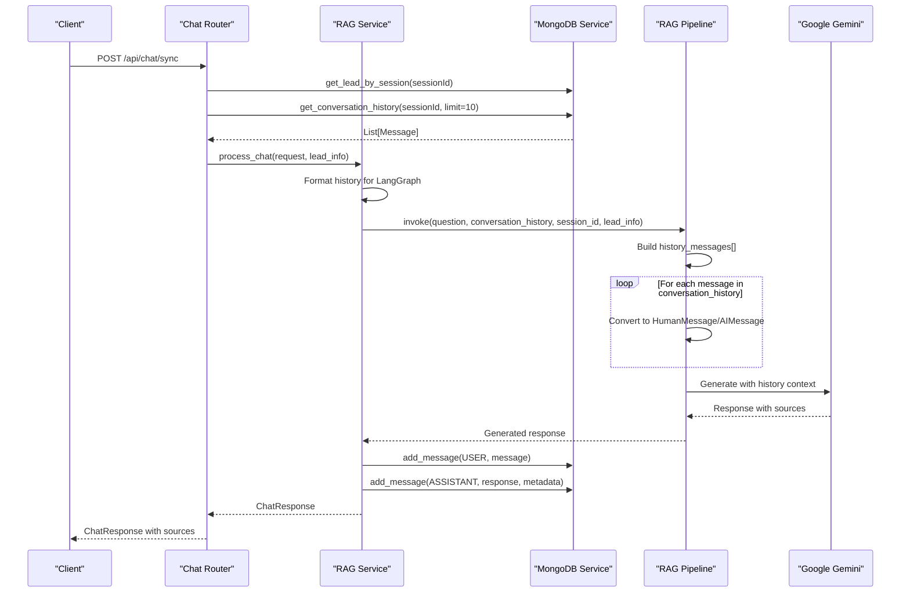
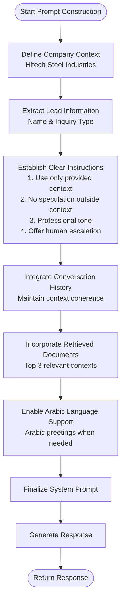
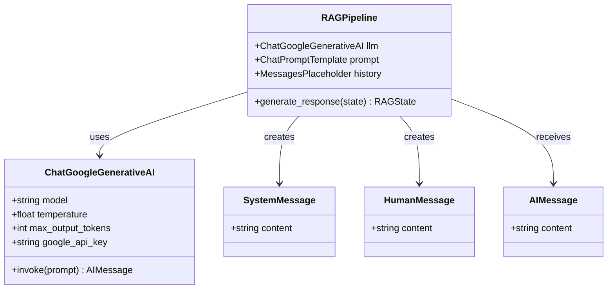
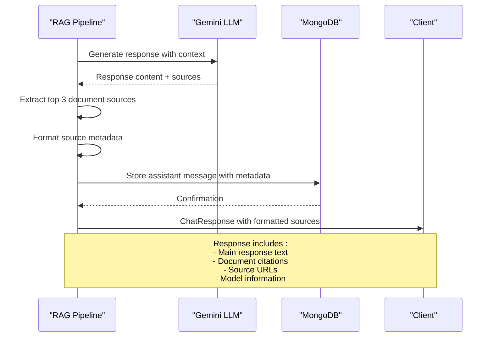
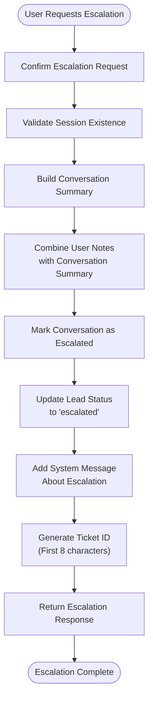

# Response Generation and Context Building

<cite>
**Referenced Files in This Document**
- [rag_service.py](file://backend/app/services/rag_service.py)
- [rag_graph.py](file://backend/app/graph/rag_graph.py)
- [chat_router.py](file://backend/app/routers/chat_router.py)
- [mongodb_service.py](file://backend/app/services/mongodb_service.py)
- [chat.py](file://backend/app/models/chat.py)
- [conversation.py](file://backend/app/models/conversation.py)
- [config.py](file://backend/app/config.py)
- [pinecone_service.py](file://backend/app/services/pinecone_service.py)
- [main.py](file://backend/app/main.py)
- [api.ts](file://frontend/lib/api.ts)
- [ChatWidget.tsx](file://frontend/components/chat/ChatWidget.tsx)
</cite>

## Table of Contents
1. [Introduction](#introduction)
2. [System Architecture](#system-architecture)
3. [Core Components](#core-components)
4. [Context Building Process](#context-building-process)
5. [Conversation History Integration](#conversation-history-integration)
6. [System Prompt Construction](#system-prompt-construction)
7. [LLM Integration with Google Gemini](#llm-integration-with-google-gemini)
8. [Response Formatting and Source Attribution](#response-formatting-and-source-attribution)
9. [Multilingual Support](#multilingual-support)
10. [Escalation Handling](#escalation-handling)
11. [Performance Considerations](#performance-considerations)
12. [Troubleshooting Guide](#troubleshooting-guide)
13. [Conclusion](#conclusion)

## Introduction

The Hitech RAG Chatbot implements a sophisticated response generation system that combines Retrieval-Augmented Generation (RAG) with conversational AI to provide intelligent customer support for Hitech Steel Industries. This system integrates multiple technologies including LangGraph for workflow orchestration, Google Gemini for language model capabilities, Pinecone for vector storage, and MongoDB for persistent storage.

The response generation system follows a multi-stage process: it retrieves relevant documents from the knowledge base, builds comprehensive context from conversation history and lead information, constructs personalized system prompts, generates responses through the LLM, and formats results with proper source attribution. The system supports human escalation, maintains conversation continuity, and handles multilingual interactions effectively.

## System Architecture

The response generation system operates within a microservices architecture with clear separation of concerns:

**Diagram sources**
- [main.py:39-85](file://backend/app/main.py#L39-L85)
- [chat_router.py:12-56](file://backend/app/routers/chat_router.py#L12-L56)
- [rag_service.py:19-87](file://backend/app/services/rag_service.py#L19-L87)
- [rag_graph.py:26-69](file://backend/app/graph/rag_graph.py#L26-L69)

The architecture demonstrates a clean separation between presentation (frontend widget), business logic (RAG service), data persistence (MongoDB), and external integrations (Pinecone, Gemini). The LangGraph pipeline orchestrates the complex workflow of document retrieval, evaluation, and response generation.

**Section sources**
- [main.py:14-37](file://backend/app/main.py#L14-L37)
- [chat_router.py:9-130](file://backend/app/routers/chat_router.py#L9-L130)
- [rag_service.py:11-18](file://backend/app/services/rag_service.py#L11-L18)

## Core Components

### RAG Service Layer

The RAG Service acts as the primary coordinator for response generation, managing the complete workflow from request processing to response formatting:

**Diagram sources**
- [rag_service.py:11-87](file://backend/app/services/rag_service.py#L11-L87)
- [rag_graph.py:26-251](file://backend/app/graph/rag_graph.py#L26-L251)
- [mongodb_service.py:13-180](file://backend/app/services/mongodb_service.py#L13-L180)

The service layer provides robust error handling, conversation persistence, and integration with external services. It manages the complete lifecycle of chat interactions while maintaining system reliability and performance.

**Section sources**
- [rag_service.py:11-116](file://backend/app/services/rag_service.py#L11-L116)
- [rag_graph.py:26-264](file://backend/app/graph/rag_graph.py#L26-L264)

### Data Models and Interfaces

The system employs strongly-typed data models to ensure data integrity and clear interfaces:

**Diagram sources**
- [chat.py:7-45](file://backend/app/models/chat.py#L7-L45)
- [conversation.py:8-53](file://backend/app/models/conversation.py#L8-L53)

These models define the contract between frontend and backend, ensuring consistent data exchange and validation throughout the system.

**Section sources**
- [chat.py:1-45](file://backend/app/models/chat.py#L1-L45)
- [conversation.py:1-53](file://backend/app/models/conversation.py#L1-L53)

## Context Building Process

The context building process is a sophisticated multi-layered approach that combines document retrieval, conversation history, and lead personalization:

**Diagram sources**
- [rag_graph.py:71-148](file://backend/app/graph/rag_graph.py#L71-L148)
- [rag_graph.py:150-219](file://backend/app/graph/rag_graph.py#L150-L219)

The context building process implements several intelligent mechanisms:

1. **Document Retrieval**: Uses Pinecone similarity search with configurable top-k results and similarity thresholds
2. **Document Grading**: Filters documents based on relevance scores to ensure quality context
3. **Selective Context**: Limits to top 3 most relevant documents to prevent context overload
4. **Structured Formatting**: Formats documents with clear labeling for LLM processing
5. **Multi-layer Integration**: Combines document context with conversation history and lead information

**Section sources**
- [rag_graph.py:71-121](file://backend/app/graph/rag_graph.py#L71-L121)
- [pinecone_service.py:108-154](file://backend/app/services/pinecone_service.py#L108-L154)

## Conversation History Integration

The system maintains comprehensive conversation history to ensure coherent responses and context preservation:

**Diagram sources**
- [chat_router.py:27-47](file://backend/app/routers/chat_router.py#L27-L47)
- [rag_service.py:30-67](file://backend/app/services/rag_service.py#L30-L67)
- [rag_graph.py:166-173](file://backend/app/graph/rag_graph.py#L166-L173)

The conversation history integration works through several key mechanisms:

1. **History Retrieval**: Fetches up to 10 recent messages from MongoDB
2. **Format Conversion**: Converts stored messages to LangChain message objects
3. **Role Preservation**: Maintains proper message roles (user vs assistant)
4. **Context Injection**: Passes conversation history as structured context to the LLM
5. **Temporal Ordering**: Preserves chronological order for coherent responses

**Section sources**
- [rag_service.py:30-40](file://backend/app/services/rag_service.py#L30-L40)
- [mongodb_service.py:135-145](file://backend/app/services/mongodb_service.py#L135-L145)
- [rag_graph.py:166-173](file://backend/app/graph/rag_graph.py#L166-L173)

## System Prompt Construction

The system prompt construction represents a sophisticated approach to AI instruction design, incorporating company context, personalization, and operational guidelines:

**Diagram sources**
- [rag_graph.py:179-202](file://backend/app/graph/rag_graph.py#L179-L202)

The system prompt includes several critical components:

### Company Context
- **Industry Position**: Leading steel manufacturer in Saudi Arabia
- **Service Scope**: Construction, infrastructure, and industrial projects
- **Brand Identity**: Professional, reliable, customer-focused

### Personalization Elements
- **Customer Name**: Dynamic insertion based on lead information
- **Inquiry Type**: Context-aware response customization
- **Cultural Sensitivity**: Arabic language support and greetings

### Response Guidelines
- **Context-Only Responses**: Strict adherence to provided documents
- **Escalation Protocol**: Clear pathways to human assistance
- **Professional Standards**: Friendly, concise, and informative responses

### Technical Specifications
- **Document Limitation**: Top 3 documents for quality focus
- **Source Attribution**: Automatic source tracking and citation
- **Response Formatting**: Structured, readable responses

**Section sources**
- [rag_graph.py:179-202](file://backend/app/graph/rag_graph.py#L179-L202)

## LLM Integration with Google Gemini

The Google Gemini integration leverages advanced multimodal capabilities while maintaining focus on text-based chat responses:

**Diagram sources**
- [rag_graph.py:31-36](file://backend/app/graph/rag_graph.py#L31-L36)
- [rag_graph.py:205-209](file://backend/app/graph/rag_graph.py#L205-L209)

The Gemini integration implements several key configurations:

### Model Configuration
- **Model Selection**: gemini-2.5-flash-preview with advanced reasoning capabilities
- **Temperature Control**: 0.3 for balanced creativity and accuracy
- **Token Limits**: 2048 maximum output tokens for optimal response length
- **API Key Management**: Secure credential handling through environment variables

### Message Role Handling
The system properly manages different message types for optimal LLM interaction:

1. **System Messages**: Contain instructions and context for the AI
2. **Human Messages**: Represent user queries and requests
3. **Assistant Messages**: Provide conversational context and previous responses

### Prompt Engineering
The integration uses LangChain's ChatPromptTemplate for structured prompt construction, enabling:
- Variable substitution for dynamic content
- Proper message ordering for context preservation
- Efficient token usage through selective context inclusion

**Section sources**
- [rag_graph.py:31-36](file://backend/app/graph/rag_graph.py#L31-L36)
- [rag_graph.py:205-209](file://backend/app/graph/rag_graph.py#L205-L209)
- [config.py:25-29](file://backend/app/config.py#L25-L29)

## Response Formatting and Source Attribution

The response generation system implements comprehensive formatting and attribution mechanisms:

**Diagram sources**
- [rag_service.py:69-87](file://backend/app/services/rag_service.py#L69-L87)
- [rag_graph.py:155-162](file://backend/app/graph/rag_graph.py#L155-L162)

### Source Attribution Structure

The system provides structured source attribution through the SourceDocument model:

| Field | Purpose | Example |
|-------|---------|---------|
| `content` | Extracted document text | "Steel specifications..." |
| `source` | Document identifier | "product_catalog.pdf" |
| `title` | Document title | "Construction Steel Products" |
| `score` | Similarity score | 0.85 |

### Response Formatting Features

1. **Structured Output**: Consistent response format with clear sections
2. **Source Integration**: Inline citations with document references
3. **Metadata Preservation**: Complete provenance tracking
4. **Model Transparency**: Clear indication of generation technology

**Section sources**
- [rag_service.py:69-87](file://backend/app/services/rag_service.py#L69-L87)
- [chat.py:14-20](file://backend/app/models/chat.py#L14-L20)

## Multilingual Support

The system implements comprehensive multilingual capabilities to serve diverse customer needs:

### Language Detection and Response
The system includes automatic Arabic language detection and appropriate response formatting. When Arabic text is detected, the AI responds using Arabic greetings and maintains cultural appropriateness in communication style.

### Cultural Adaptation
Beyond language support, the system adapts to Saudi Arabian business culture:
- Formal yet friendly communication style
- Appropriate greeting protocols
- Localized business terminology
- Respectful escalation procedures

### Technical Implementation
The multilingual support leverages Google Gemini's native language capabilities combined with custom detection logic in the response generation pipeline.

## Escalation Handling

The escalation system provides seamless human-agent handoff with comprehensive context preservation:

**Diagram sources**
- [chat_router.py:58-117](file://backend/app/routers/chat_router.py#L58-L117)
- [mongodb_service.py:161-180](file://backend/app/services/mongodb_service.py#L161-L180)

### Escalation Workflow

The escalation process ensures complete context transfer to human agents:

1. **Session Validation**: Confirms active session before escalation
2. **Context Summarization**: Creates concise conversation summary
3. **Note Integration**: Combines user-provided notes with system summary
4. **Status Updates**: Marks both conversation and lead as escalated
5. **System Notification**: Adds automated escalation message to conversation
6. **Ticket Generation**: Creates unique ticket identifier for tracking

### Human Handoff Features

- **Complete Context**: Last 10 messages summarized for agent review
- **Personalization**: Lead information preserved for personalized service
- **Source Tracking**: Document citations maintained for technical accuracy
- **Response Time承诺**: Clear communication about expected response timing

**Section sources**
- [chat_router.py:58-117](file://backend/app/routers/chat_router.py#L58-L117)
- [rag_service.py:89-106](file://backend/app/services/rag_service.py#L89-L106)

## Performance Considerations

The response generation system implements several optimization strategies:

### Vector Search Efficiency
- **Top-K Selection**: Limits document retrieval to 5 results with 0.7 similarity threshold
- **Batch Processing**: Efficient vector upsert operations with configurable batch sizes
- **Index Optimization**: Cosine similarity metric for optimal semantic search

### Memory Management
- **Conversation Limits**: Maximum 10 messages in context to prevent token overflow
- **Session TTL**: 24-hour session persistence with automatic cleanup
- **Resource Cleanup**: Proper disposal of database connections and API clients

### Caching Strategies
- **Settings Caching**: Environment-based configuration caching
- **Service Singleton Pattern**: Shared instances for Pinecone and embedding services
- **Connection Pooling**: Efficient database connection management

### Error Handling and Resilience
- **Graceful Degradation**: Falls back to generic responses when retrieval fails
- **Retry Logic**: Up to 2 query transformations for improved results
- **Timeout Management**: Configurable timeouts for external service calls

## Troubleshooting Guide

### Common Issues and Solutions

**Document Retrieval Failures**
- Verify Pinecone API key and index configuration
- Check embedding service availability and model loading
- Monitor similarity threshold settings for appropriate recall

**Response Quality Issues**
- Adjust temperature settings for desired creativity balance
- Modify RAG_TOP_K value based on knowledge base size
- Review system prompt instructions for clarity

**Performance Problems**
- Monitor vector index statistics and optimize batch sizes
- Check MongoDB connection limits and indexing
- Review LLM token usage and adjust response limits

**Integration Issues**
- Verify Google Gemini API key validity and quota limits
- Check CORS configuration for frontend-backend communication
- Monitor external service health and retry policies

### Monitoring and Debugging

The system provides comprehensive logging and monitoring capabilities:
- Detailed pipeline execution traces
- Performance metrics for each processing stage
- Error reporting with stack traces
- Health checks for all integrated services

**Section sources**
- [config.py:15-44](file://backend/app/config.py#L15-L44)
- [main.py:74-83](file://backend/app/main.py#L74-L83)

## Conclusion

The Hitech RAG Chatbot response generation system represents a comprehensive solution for enterprise-grade conversational AI. Through its sophisticated context building, conversation history integration, and personalized system prompts, it delivers accurate, contextually relevant responses while maintaining operational efficiency.

The integration with Google Gemini provides advanced language understanding capabilities, while the LangGraph pipeline ensures robust workflow orchestration. The system's multilingual support and cultural adaptation demonstrate thoughtful consideration for diverse customer needs.

Key strengths of the system include:
- **Robust Context Management**: Multi-layered context building with document, history, and personalization
- **Seamless Escalation**: Complete handoff process preserving all conversation context
- **Performance Optimization**: Efficient vector search and memory management
- **Reliability**: Comprehensive error handling and fallback mechanisms
- **Extensibility**: Modular architecture supporting future enhancements

The system successfully balances technical sophistication with practical usability, providing a foundation for scalable customer support automation while maintaining the flexibility to adapt to evolving business requirements.