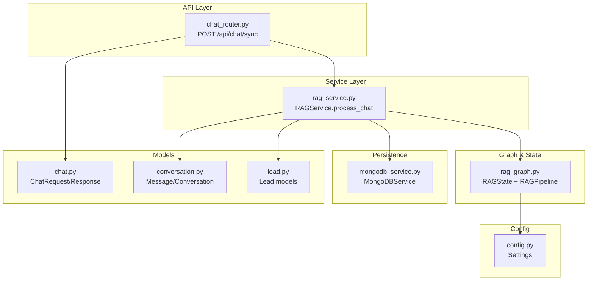
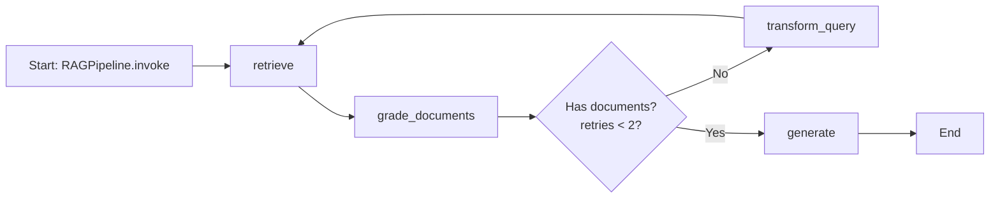
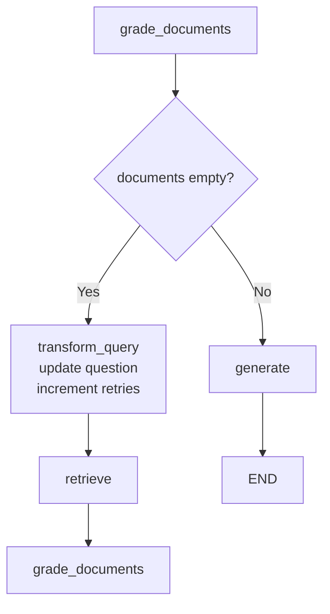
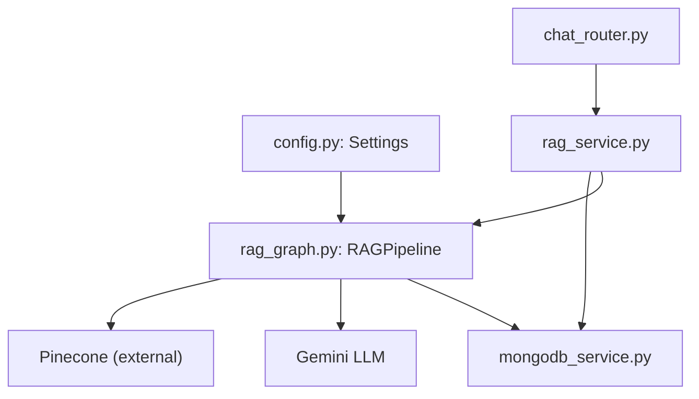

# State Management and Data Flow

<cite>
**Referenced Files in This Document**
- [rag_graph.py](file://backend/app/graph/rag_graph.py)
- [rag_service.py](file://backend/app/services/rag_service.py)
- [chat_router.py](file://backend/app/routers/chat_router.py)
- [mongodb_service.py](file://backend/app/services/mongodb_service.py)
- [chat.py](file://backend/app/models/chat.py)
- [conversation.py](file://backend/app/models/conversation.py)
- [lead.py](file://backend/app/models/lead.py)
- [config.py](file://backend/app/config.py)
- [main.py](file://backend/app/main.py)
</cite>

## Table of Contents
1. [Introduction](#introduction)
2. [Project Structure](#project-structure)
3. [Core Components](#core-components)
4. [Architecture Overview](#architecture-overview)
5. [Detailed Component Analysis](#detailed-component-analysis)
6. [Dependency Analysis](#dependency-analysis)
7. [Performance Considerations](#performance-considerations)
8. [Troubleshooting Guide](#troubleshooting-guide)
9. [Conclusion](#conclusion)

## Introduction
This document explains state management and data flow across the RAG pipeline in the Hitech chatbot. It focuses on the RAGState TypedDict structure, all state variables, mutations during pipeline execution, conditional transitions, error propagation, validation, cleanup, and memory considerations for long-running conversations.

## Project Structure
The RAG pipeline spans several modules:
- Graph definition and pipeline logic
- Service orchestration
- API endpoints
- Data models
- Persistence layer
- Configuration

**Diagram sources**
- [chat_router.py:12-56](file://backend/app/routers/chat_router.py#L12-L56)
- [rag_service.py:19-87](file://backend/app/services/rag_service.py#L19-L87)
- [rag_graph.py:15-264](file://backend/app/graph/rag_graph.py#L15-L264)
- [mongodb_service.py:13-202](file://backend/app/services/mongodb_service.py#L13-L202)
- [chat.py:7-45](file://backend/app/models/chat.py#L7-L45)
- [conversation.py:8-53](file://backend/app/models/conversation.py#L8-L53)
- [lead.py:18-64](file://backend/app/models/lead.py#L18-L64)
- [config.py:7-65](file://backend/app/config.py#L7-L65)

**Section sources**
- [main.py:39-85](file://backend/app/main.py#L39-L85)
- [chat_router.py:12-56](file://backend/app/routers/chat_router.py#L12-L56)
- [rag_service.py:19-87](file://backend/app/services/rag_service.py#L19-L87)
- [rag_graph.py:15-264](file://backend/app/graph/rag_graph.py#L15-L264)
- [mongodb_service.py:13-202](file://backend/app/services/mongodb_service.py#L13-L202)
- [chat.py:7-45](file://backend/app/models/chat.py#L7-L45)
- [conversation.py:8-53](file://backend/app/models/conversation.py#L8-L53)
- [lead.py:18-64](file://backend/app/models/lead.py#L18-L64)
- [config.py:7-65](file://backend/app/config.py#L7-L65)

## Core Components
- RAGState TypedDict defines the pipeline’s mutable state across nodes.
- RAGPipeline encapsulates the LangGraph workflow, nodes, and conditional edges.
- RAGService orchestrates retrieval of conversation history, invokes the pipeline, persists messages, and formats responses.
- MongoDBService manages lead and conversation persistence, including message storage and escalation.
- API endpoints validate sessions, enforce escalation checks, and return structured responses.

Key state variables:
- question: The current user query (mutated by query transformation).
- generation: Final LLM-generated response.
- documents: Retrieved and filtered vector store results.
- conversation_history: Previous messages for contextual grounding.
- session_id: Unique session identifier linking lead and conversation.
- lead_info: Personalized customer context (name, inquiry type).
- retries: Count of query transformations to prevent infinite loops.

**Section sources**
- [rag_graph.py:15-24](file://backend/app/graph/rag_graph.py#L15-L24)
- [rag_graph.py:26-69](file://backend/app/graph/rag_graph.py#L26-L69)
- [rag_service.py:19-87](file://backend/app/services/rag_service.py#L19-L87)
- [mongodb_service.py:117-145](file://backend/app/services/mongodb_service.py#L117-L145)
- [chat.py:7-29](file://backend/app/models/chat.py#L7-L29)

## Architecture Overview
The RAG pipeline follows a LangGraph StateGraph with four nodes and conditional edges:
- retrieve: Fetches documents from vector store and filters by similarity threshold.
- grade_documents: Reassesses relevance; returns empty documents if none meet threshold.
- transform_query: Reformulates the question using LLM to improve retrieval.
- generate: Builds system prompt with context, conversation history, and lead info; generates response.

**Diagram sources**
- [rag_graph.py:40-69](file://backend/app/graph/rag_graph.py#L40-L69)
- [rag_graph.py:110-120](file://backend/app/graph/rag_graph.py#L110-L120)
- [rag_graph.py:221-251](file://backend/app/graph/rag_graph.py#L221-L251)

## Detailed Component Analysis

### RAGState TypedDict and Variables
RAGState is a TypedDict that defines the shared state across nodes. It is passed into the graph and mutated by each node. The state is immutable in Python but replaced by returning a new dictionary with updated keys.

Variables and roles:
- question: Input query; may be transformed by transform_query.
- generation: Output response; set by generate.
- documents: Retrieved and filtered documents; used to build context.
- conversation_history: List of prior messages; converted to LangChain message types for generation.
- session_id: Links lead and conversation; used for persistence.
- lead_info: Customer profile for personalization; influences system prompt.
- retries: Tracks transformation attempts; caps at 2 to prevent cycles.

State initialization occurs in RAGPipeline.invoke, which constructs RAGState with defaults and passes it to the compiled graph.

**Section sources**
- [rag_graph.py:15-24](file://backend/app/graph/rag_graph.py#L15-L24)
- [rag_graph.py:235-243](file://backend/app/graph/rag_graph.py#L235-L243)

### Data Flow Between Nodes
The graph executes in a deterministic order with conditional branching:
1. retrieve: Calls vector similarity search and filters by threshold; updates documents.
2. grade_documents: Filters documents again based on threshold; may produce empty documents.
3. decide_to_generate: Conditional edge:
   - If retries >= 2: generate
   - Else if no documents: transform_query
   - Else: generate
4. transform_query: Reformulates question and increments retries.
5. generate: Builds system prompt with context, conversation history, and lead info; sets generation and sources.

```mermaid
sequenceDiagram
participant API as "chat_router.py"
participant SVC as "rag_service.py"
participant PIPE as "rag_graph.py"
participant VEC as "Pinecone"
participant LLM as "Gemini LLM"
API->>SVC : POST /api/chat/sync
SVC->>PIPE : invoke(question, conversation_history, session_id, lead_info)
PIPE->>VEC : similarity_search(query, top_k)
VEC-->>PIPE : documents[]
PIPE->>PIPE : filter by similarity threshold
PIPE->>PIPE : grade_documents()
alt documents empty or retries < 2
PIPE->>LLM : transform_query(prompt)
LLM-->>PIPE : new_question
PIPE->>PIPE : increment retries
PIPE->>PIPE : set question
PIPE->>PIPE : goto retrieve
else generate
PIPE->>PIPE : build context from top documents
PIPE->>PIPE : convert conversation_history to messages
PIPE->>LLM : generate(prompt + history)
LLM-->>PIPE : generation
PIPE-->>SVC : result
SVC->>SVC : persist user and assistant messages
SVC-->>API : ChatResponse
end
```

**Diagram sources**
- [chat_router.py:12-56](file://backend/app/routers/chat_router.py#L12-L56)
- [rag_service.py:19-87](file://backend/app/services/rag_service.py#L19-L87)
- [rag_graph.py:71-219](file://backend/app/graph/rag_graph.py#L71-L219)

### State Mutations and Conditional Transitions
- retrieve: Adds filtered documents to state.
- grade_documents: Updates documents to only those meeting threshold.
- transform_query: Replaces question with transformed version and increments retries.
- generate: Sets generation and sources; does not mutate conversation_history or lead_info.

Conditional transitions:
- From grade_documents to transform_query when documents are empty or below threshold and retries < 2.
- From grade_documents to generate when documents are sufficient or retries >= 2.
- Loop back to retrieve after transform_query.

**Diagram sources**
- [rag_graph.py:110-120](file://backend/app/graph/rag_graph.py#L110-L120)
- [rag_graph.py:122-148](file://backend/app/graph/rag_graph.py#L122-L148)
- [rag_graph.py:71-91](file://backend/app/graph/rag_graph.py#L71-L91)
- [rag_graph.py:93-108](file://backend/app/graph/rag_graph.py#L93-L108)

### Error Propagation and Validation
- API-level validation:
  - Session existence checked before processing chat.
  - Escalation flag prevents further automated chat responses.
  - Exceptions are caught and mapped to HTTP 4xx/5xx responses.
- Service-level validation:
  - Conversation history fetched and converted to graph-ready format.
  - Sources are validated and mapped to SourceDocument model.
- Graph-level validation:
  - Empty documents handled gracefully; fallback to query transformation.
  - Retries capped at 2 to avoid infinite loops.

**Section sources**
- [chat_router.py:27-55](file://backend/app/routers/chat_router.py#L27-L55)
- [rag_service.py:30-87](file://backend/app/services/rag_service.py#L30-L87)
- [rag_graph.py:110-120](file://backend/app/graph/rag_graph.py#L110-L120)

### Memory Management and Cleanup
- Conversation history length is bounded by configuration (MAX_CONVERSATION_HISTORY).
- MongoDB stores messages with timestamps and updates updatedAt on each addition.
- Periodic cleanup of expired sessions can be performed via MongoDBService.cleanup_expired_sessions.
- Vector store cleanup is available via ingestion router delete endpoint.

Recommendations:
- Limit conversation history window to reduce prompt size and cost.
- Implement periodic cleanup jobs to remove old non-escalated conversations.
- Monitor vector store size and prune unused entries.

**Section sources**
- [config.py:38-39](file://backend/app/config.py#L38-L39)
- [rag_service.py:30-34](file://backend/app/services/rag_service.py#L30-L34)
- [mongodb_service.py:182-192](file://backend/app/services/mongodb_service.py#L182-L192)
- [ingest_router.py:95-112](file://backend/app/routers/ingest_router.py#L95-L112)

## Dependency Analysis
The RAG pipeline depends on:
- Configuration for model parameters and thresholds.
- Vector store for document retrieval.
- LLM for query transformation and generation.
- MongoDB for lead and conversation persistence.

**Diagram sources**
- [config.py:7-65](file://backend/app/config.py#L7-L65)
- [rag_graph.py:29-38](file://backend/app/graph/rag_graph.py#L29-L38)
- [rag_service.py:14-17](file://backend/app/services/rag_service.py#L14-L17)
- [chat_router.py:12-56](file://backend/app/routers/chat_router.py#L12-L56)

**Section sources**
- [config.py:7-65](file://backend/app/config.py#L7-L65)
- [rag_graph.py:29-38](file://backend/app/graph/rag_graph.py#L29-L38)
- [rag_service.py:14-17](file://backend/app/services/rag_service.py#L14-L17)
- [chat_router.py:12-56](file://backend/app/routers/chat_router.py#L12-L56)

## Performance Considerations
- Retrieval window: RAG_TOP_K controls how many candidates are retrieved; tune based on latency and recall trade-offs.
- Similarity threshold: RAG_SIMILARITY_THRESHOLD balances precision vs. recall; adjust to reduce irrelevant documents.
- History truncation: MAX_CONVERSATION_HISTORY limits context length; keep it small for cost and latency.
- Token budget: GEMINI_MAX_TOKENS constrains generation; ensure prompt fits within limits.
- Retry cap: retries <= 2 prevents excessive loops and resource waste.

[No sources needed since this section provides general guidance]

## Troubleshooting Guide
Common issues and resolutions:
- Session not found: Ensure lead submission occurred before chat; chat endpoint validates session existence.
- Conversation escalated: Escalation flag blocks automated responses; inform user and provide ticket ID.
- No relevant documents: Pipeline falls back to query transformation; verify vector store ingestion and thresholds.
- Excessive retries: Confirm similarity threshold and transformation quality; consider adjusting RAG_SIMILARITY_THRESHOLD.
- Memory growth: Reduce MAX_CONVERSATION_HISTORY and schedule cleanup of expired sessions.

**Section sources**
- [chat_router.py:27-43](file://backend/app/routers/chat_router.py#L27-L43)
- [rag_service.py:30-34](file://backend/app/services/rag_service.py#L30-L34)
- [rag_graph.py:110-120](file://backend/app/graph/rag_graph.py#L110-L120)
- [mongodb_service.py:182-192](file://backend/app/services/mongodb_service.py#L182-L192)

## Conclusion
The RAG pipeline uses a well-defined state model and controlled conditional flow to balance retrieval quality and user experience. State mutations are explicit and localized to specific nodes, with clear guards against infinite loops and excessive memory usage. Proper configuration and periodic cleanup ensure sustainable operation for long-running conversations.