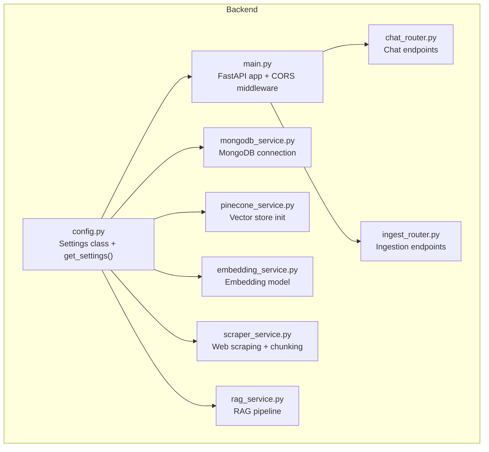
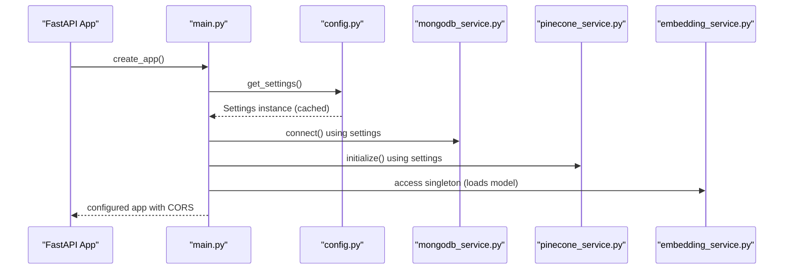
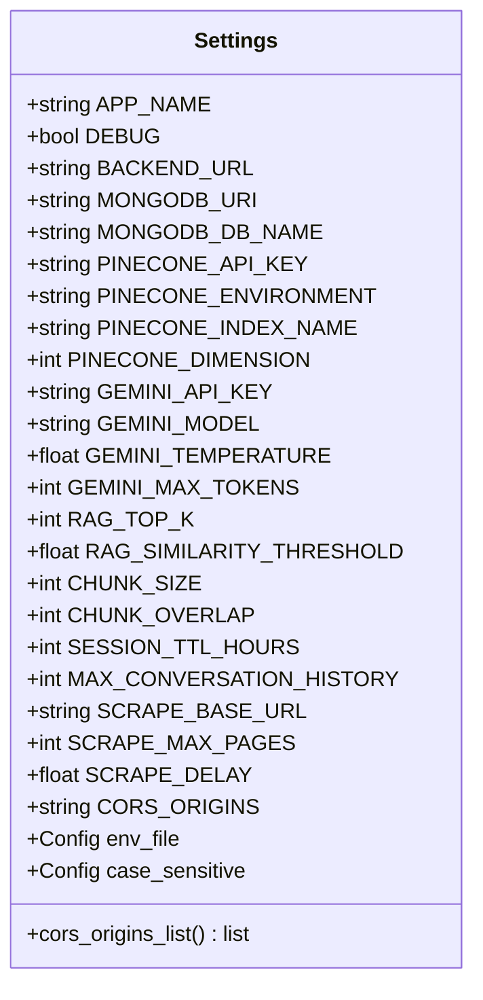
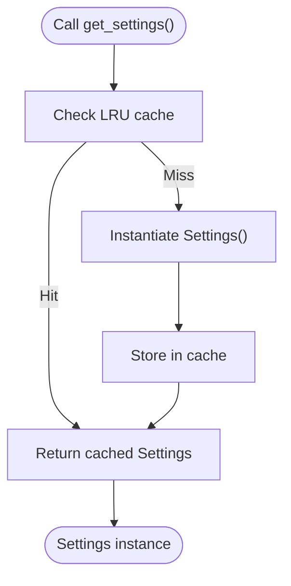
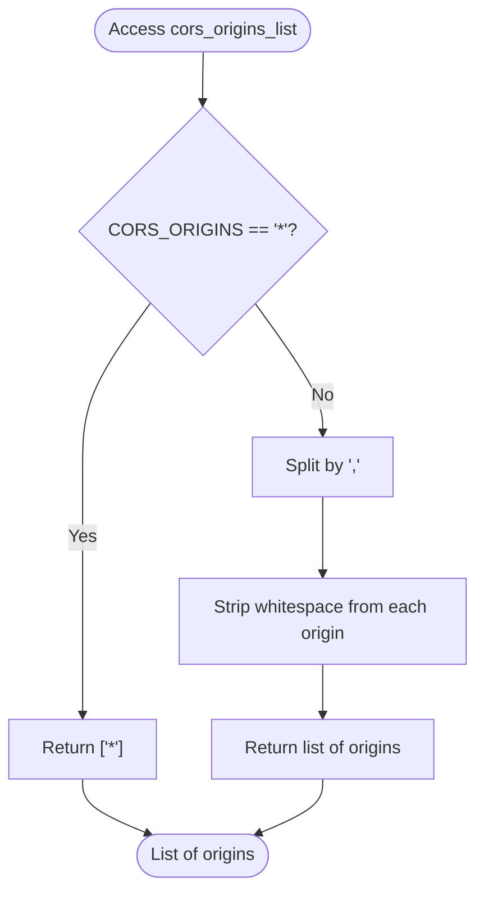
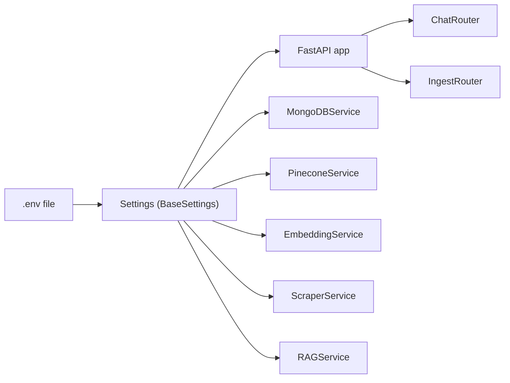

# Backend Configuration

<cite>
**Referenced Files in This Document**
- [config.py](file://backend/app/config.py)
- [main.py](file://backend/app/main.py)
- [vercel.json](file://backend/vercel.json)
- [requirements.txt](file://backend/requirements.txt)
- [mongodb_service.py](file://backend/app/services/mongodb_service.py)
- [pinecone_service.py](file://backend/app/services/pinecone_service.py)
- [rag_service.py](file://backend/app/services/rag_service.py)
- [embedding_service.py](file://backend/app/services/embedding_service.py)
- [scraper_service.py](file://backend/app/services/scraper_service.py)
- [chat_router.py](file://backend/app/routers/chat_router.py)
- [ingest_router.py](file://backend/app/routers/ingest_router.py)
</cite>

## Table of Contents
1. [Introduction](#introduction)
2. [Project Structure](#project-structure)
3. [Core Components](#core-components)
4. [Architecture Overview](#architecture-overview)
5. [Detailed Component Analysis](#detailed-component-analysis)
6. [Dependency Analysis](#dependency-analysis)
7. [Performance Considerations](#performance-considerations)
8. [Troubleshooting Guide](#troubleshooting-guide)
9. [Conclusion](#conclusion)
10. [Appendices](#appendices)

## Introduction
This document provides comprehensive documentation for the backend configuration management system. It focuses on the centralized Settings class that consolidates all environment-driven configuration for the RAG chatbot backend. The configuration covers MongoDB Atlas connectivity, Pinecone vector database setup, Google Gemini AI model parameters, RAG behavior controls, session management, web scraping parameters, and CORS policy. It also explains the BaseSettings implementation with Pydantic validation, default value management, environment variable loading from .env files, LRU caching for settings retrieval, and dynamic CORS origin parsing.

## Project Structure
The configuration system is implemented in a single module and consumed across the backend services and routers. The main application creates the FastAPI app and applies CORS middleware using settings. Services consume settings for database connections, vector store initialization, embedding dimensions, and scraping behavior.

**Diagram sources**
- [config.py:1-65](file://backend/app/config.py#L1-L65)
- [main.py:1-90](file://backend/app/main.py#L1-L90)
- [mongodb_service.py:1-202](file://backend/app/services/mongodb_service.py#L1-L202)
- [pinecone_service.py:1-186](file://backend/app/services/pinecone_service.py#L1-L186)
- [embedding_service.py:1-158](file://backend/app/services/embedding_service.py#L1-L158)
- [scraper_service.py:1-329](file://backend/app/services/scraper_service.py#L1-L329)
- [rag_service.py:1-116](file://backend/app/services/rag_service.py#L1-L116)
- [chat_router.py:1-130](file://backend/app/routers/chat_router.py#L1-L130)
- [ingest_router.py:1-112](file://backend/app/routers/ingest_router.py#L1-L112)

**Section sources**
- [config.py:1-65](file://backend/app/config.py#L1-L65)
- [main.py:1-90](file://backend/app/main.py#L1-L90)

## Core Components
- Centralized Settings class with typed attributes for all configuration categories.
- Pydantic BaseSettings with environment file loading and case-sensitive parsing.
- LRU cache for efficient settings retrieval.
- Dynamic CORS origins parsing property for flexible origin lists.

Key configuration categories and defaults:
- Application: app name, debug mode, backend URL.
- MongoDB: URI and database name.
- Pinecone: API key, environment, index name, dimension.
- Google Gemini: API key, model, temperature, max tokens.
- RAG: top-k, similarity threshold, chunk size, overlap.
- Session: TTL hours, max conversation history.
- Scraping: base URL, max pages, delay.
- CORS: origins string.

Validation and defaults are enforced by Pydantic BaseSettings. Environment variables are loaded from a .env file.

**Section sources**
- [config.py:7-65](file://backend/app/config.py#L7-L65)

## Architecture Overview
The configuration architecture centers around a single Settings instance accessed via a cached factory function. All services and routers depend on this shared configuration, ensuring consistent behavior across the application lifecycle.

**Diagram sources**
- [main.py:39-85](file://backend/app/main.py#L39-L85)
- [config.py:61-65](file://backend/app/config.py#L61-L65)
- [mongodb_service.py:21-28](file://backend/app/services/mongodb_service.py#L21-L28)
- [pinecone_service.py:27-55](file://backend/app/services/pinecone_service.py#L27-L55)
- [embedding_service.py:22-28](file://backend/app/services/embedding_service.py#L22-L28)

## Detailed Component Analysis

### Settings Class and Pydantic BaseSettings
- Defines strongly-typed configuration fields grouped by functional areas.
- Uses BaseSettings with env_file pointing to ".env".
- Case sensitivity enabled for environment variables.
- Provides a property to parse CORS origins from a comma-separated string, returning "*" when wildcard is used.

Implementation highlights:
- Environment variable loading occurs automatically when constructing Settings.
- Defaults are defined for all fields, enabling local development without external configuration.
- The class is designed to be instantiated once and reused via caching.

**Diagram sources**
- [config.py:7-65](file://backend/app/config.py#L7-L65)

**Section sources**
- [config.py:7-65](file://backend/app/config.py#L7-L65)

### Settings Retrieval and Caching
- A global factory function returns a cached Settings instance using LRU cache.
- This ensures a single configuration object is reused across the application, reducing overhead and maintaining consistency.

**Diagram sources**
- [config.py:61-65](file://backend/app/config.py#L61-L65)

**Section sources**
- [config.py:61-65](file://backend/app/config.py#L61-L65)

### CORS Origins Parsing Property
- The cors_origins_list property converts the CORS_ORIGINS string into a list.
- If the string equals "*", the property returns ["*"] to enable wildcard origins.
- Otherwise, it splits the string by commas and strips whitespace from each origin.

**Diagram sources**
- [config.py:53-58](file://backend/app/config.py#L53-L58)

**Section sources**
- [config.py:53-58](file://backend/app/config.py#L53-L58)

### MongoDB Service Configuration
- Uses settings for MongoDB URI and database name.
- Establishes connections during application startup and creates indexes for leads and conversations collections.

**Section sources**
- [mongodb_service.py:16-28](file://backend/app/services/mongodb_service.py#L16-L28)

### Pinecone Service Configuration
- Initializes Pinecone client using API key from settings.
- Ensures the target index exists with dimension and metric from settings.
- Uses index name and dimension from settings for vector operations.

**Section sources**
- [pinecone_service.py:21-55](file://backend/app/services/pinecone_service.py#L21-L55)

### Embedding Service Configuration
- Uses settings for embedding dimension (BGE-M3).
- Loads the embedding model once and reuses it across requests.

**Section sources**
- [embedding_service.py:22-28](file://backend/app/services/embedding_service.py#L22-L28)

### Scraper Service Configuration
- Uses settings for base URL, max pages, and delay.
- Applies chunk size and overlap from settings during content processing.

**Section sources**
- [scraper_service.py:29-36](file://backend/app/services/scraper_service.py#L29-L36)
- [scraper_service.py:212-214](file://backend/app/services/scraper_service.py#L212-L214)
- [scraper_service.py:270-274](file://backend/app/services/scraper_service.py#L270-L274)

### RAG Service Configuration
- Uses settings for conversation history limit and model name.
- Integrates with MongoDB and embedding services to process chat requests.

**Section sources**
- [rag_service.py:14-17](file://backend/app/services/rag_service.py#L14-L17)
- [rag_service.py:31-34](file://backend/app/services/rag_service.py#L31-L34)
- [rag_service.py:65-66](file://backend/app/services/rag_service.py#L65-L66)

### FastAPI App and CORS Middleware
- Creates the FastAPI app with title and description from settings.
- Adds CORS middleware using the parsed origins list from settings.

**Section sources**
- [main.py:39-57](file://backend/app/main.py#L39-L57)

### Router-Level Usage
- Chat router validates sessions and escalates conversations using MongoDB service.
- Ingest router orchestrates scraping, chunking, embedding, and vector upsert using Scraper and Pinecone services.

**Section sources**
- [chat_router.py:12-56](file://backend/app/routers/chat_router.py#L12-L56)
- [ingest_router.py:26-73](file://backend/app/routers/ingest_router.py#L26-L73)

## Dependency Analysis
The configuration system depends on Pydantic settings and environment files. The application depends on the configuration for service initialization and runtime behavior.

**Diagram sources**
- [config.py:49-51](file://backend/app/config.py#L49-L51)
- [main.py:39-57](file://backend/app/main.py#L39-L57)
- [mongodb_service.py:16-19](file://backend/app/services/mongodb_service.py#L16-L19)
- [pinecone_service.py:21-26](file://backend/app/services/pinecone_service.py#L21-L26)
- [embedding_service.py:22-25](file://backend/app/services/embedding_service.py#L22-L25)
- [scraper_service.py:29-31](file://backend/app/services/scraper_service.py#L29-L31)
- [rag_service.py:14-18](file://backend/app/services/rag_service.py#L14-L18)

**Section sources**
- [requirements.txt:5-6](file://backend/requirements.txt#L5-L6)
- [config.py:49-51](file://backend/app/config.py#L49-L51)

## Performance Considerations
- Settings caching: The LRU cache ensures a single Settings instance is reused, minimizing repeated environment parsing overhead.
- Lazy initialization: Services like MongoDB, Pinecone, and the embedding model are initialized on demand or during app startup, avoiding unnecessary resource usage.
- Chunking and batching: Scraper and embedding services use configurable chunk sizes and batch sizes to balance memory usage and throughput.

[No sources needed since this section provides general guidance]

## Troubleshooting Guide
Common configuration issues and resolutions:
- Missing .env file: Ensure the .env file exists alongside the settings module and contains required keys. The BaseSettings class loads from env_file.
- Incorrect environment variable names: Verify case sensitivity and spelling. Case sensitivity is enabled in settings.
- CORS misconfiguration: If cross-origin requests fail, confirm CORS_ORIGINS contains the correct origins or "*" for wildcard. The cors_origins_list property handles parsing.
- MongoDB connection errors: Validate MONGODB_URI and MONGODB_DB_NAME. Confirm the database is reachable and credentials are correct.
- Pinecone initialization errors: Verify PINECONE_API_KEY, PINECONE_ENVIRONMENT, and PINECONE_INDEX_NAME. Ensure the index exists or can be created.
- Embedding model loading failures: Confirm the embedding model library is installed and compatible with the runtime environment.

**Section sources**
- [config.py:49-51](file://backend/app/config.py#L49-L51)
- [config.py:53-58](file://backend/app/config.py#L53-L58)
- [mongodb_service.py:21-28](file://backend/app/services/mongodb_service.py#L21-L28)
- [pinecone_service.py:27-55](file://backend/app/services/pinecone_service.py#L27-L55)
- [embedding_service.py:31-48](file://backend/app/services/embedding_service.py#L31-L48)

## Conclusion
The backend configuration system provides a robust, centralized mechanism for managing environment-driven settings. By leveraging Pydantic BaseSettings, default values, and LRU caching, it ensures predictable behavior across environments while remaining flexible for development, staging, and production deployments. The CORS origins parsing simplifies cross-origin configuration, and the modular usage across services maintains consistency and reduces duplication.

[No sources needed since this section summarizes without analyzing specific files]

## Appendices

### Environment Variable Template
Below is a template for the .env file containing all configuration keys used by the application. Replace placeholder values with your actual configuration.

- APP_NAME
- DEBUG
- BACKEND_URL
- MONGODB_URI
- MONGODB_DB_NAME
- PINECONE_API_KEY
- PINECONE_ENVIRONMENT
- PINECONE_INDEX_NAME
- PINECONE_DIMENSION
- GEMINI_API_KEY
- GEMINI_MODEL
- GEMINI_TEMPERATURE
- GEMINI_MAX_TOKENS
- RAG_TOP_K
- RAG_SIMILARITY_THRESHOLD
- CHUNK_SIZE
- CHUNK_OVERLAP
- SESSION_TTL_HOURS
- MAX_CONVERSATION_HISTORY
- SCRAPE_BASE_URL
- SCRAPE_MAX_PAGES
- SCRAPE_DELAY
- CORS_ORIGINS

**Section sources**
- [config.py:10-48](file://backend/app/config.py#L10-L48)

### Validation Rules and Error Handling
- Pydantic BaseSettings enforces type conversion and validation for each field. If an environment variable is missing, the default value is used.
- CORS_ORIGINS parsing handles wildcard "*" and splits comma-separated origins into a list.
- Service initialization raises explicit errors on failure (e.g., embedding model load failure), preventing silent failures.

**Section sources**
- [config.py:49-51](file://backend/app/config.py#L49-L51)
- [config.py:53-58](file://backend/app/config.py#L53-L58)
- [embedding_service.py:45-48](file://backend/app/services/embedding_service.py#L45-L48)

### Deployment-Specific Settings
- Vercel configuration defines the Python build and routing for serverless deployment. The PYTHONPATH is set to "." to ensure imports resolve correctly.
- Production considerations:
  - Set DEBUG to False in production.
  - Configure secure CORS_ORIGINS for your frontend domains.
  - Ensure environment variables are set in the platform’s secret management.
  - Monitor service health endpoints for MongoDB and Pinecone connectivity.

**Section sources**
- [vercel.json:1-22](file://backend/vercel.json#L1-L22)
- [main.py:74-83](file://backend/app/main.py#L74-L83)