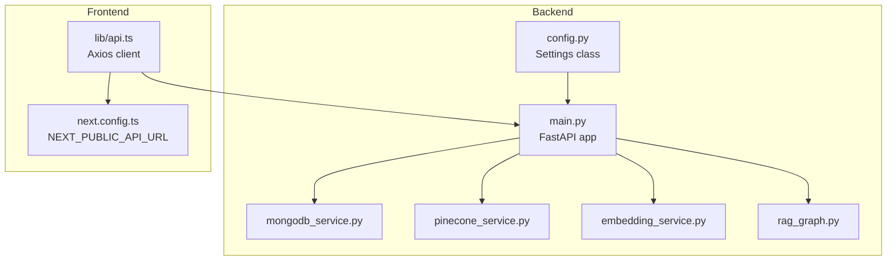
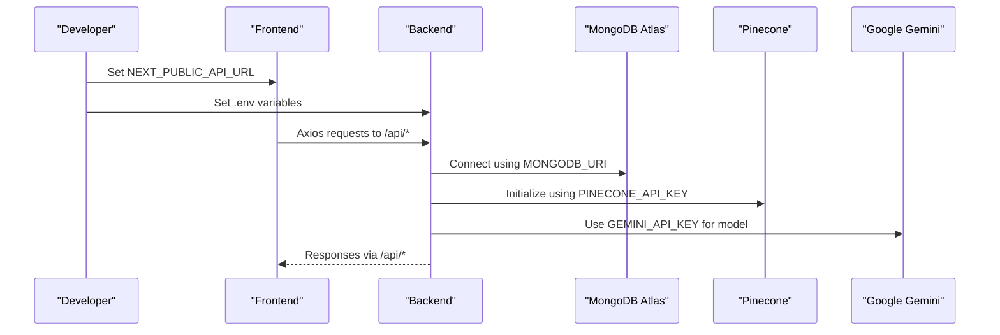
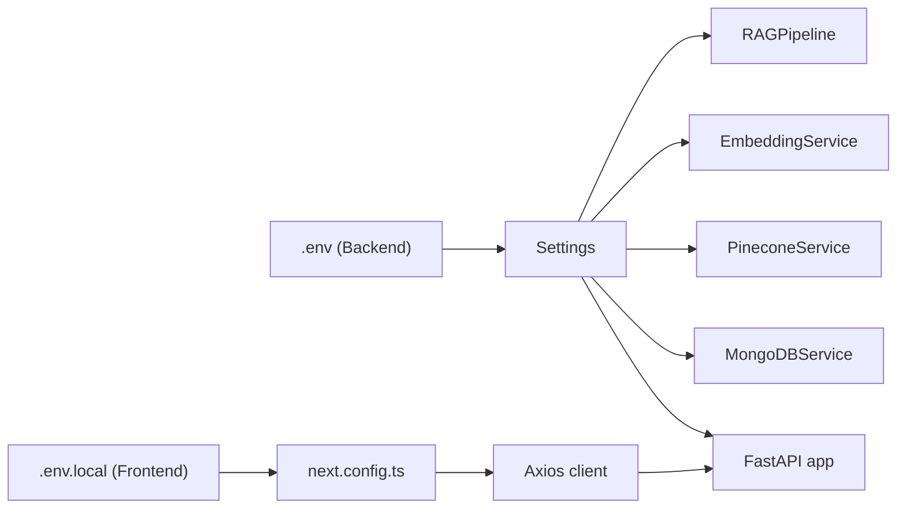

# Environment Setup and Templates

<cite>
**Referenced Files in This Document**
- [README.md](file://README.md)
- [backend/app/config.py](file://backend/app/config.py)
- [backend/app/main.py](file://backend/app/main.py)
- [backend/app/services/mongodb_service.py](file://backend/app/services/mongodb_service.py)
- [backend/app/services/pinecone_service.py](file://backend/app/services/pinecone_service.py)
- [backend/app/services/embedding_service.py](file://backend/app/services/embedding_service.py)
- [backend/app/graph/rag_graph.py](file://backend/app/graph/rag_graph.py)
- [backend/requirements.txt](file://backend/requirements.txt)
- [frontend/lib/api.ts](file://frontend/lib/api.ts)
- [frontend/next.config.ts](file://frontend/next.config.ts)
- [frontend/package.json](file://frontend/package.json)
</cite>

## Table of Contents
1. [Introduction](#introduction)
2. [Project Structure](#project-structure)
3. [Core Components](#core-components)
4. [Architecture Overview](#architecture-overview)
5. [Detailed Component Analysis](#detailed-component-analysis)
6. [Dependency Analysis](#dependency-analysis)
7. [Performance Considerations](#performance-considerations)
8. [Troubleshooting Guide](#troubleshooting-guide)
9. [Conclusion](#conclusion)
10. [Appendices](#appendices)

## Introduction
This document provides a complete guide to environment setup and configuration templates for the Hitech RAG Chatbot project. It covers:
- Backend and frontend environment variable templates
- Step-by-step setup for MongoDB Atlas, Pinecone, and Google Gemini
- Configuration validation procedures
- Environment-specific overrides for development, staging, and production
- Troubleshooting common configuration issues
- Security best practices for sensitive data
- Migration procedures between environments

## Project Structure
The project consists of:
- Backend (FastAPI): configuration, services, routers, and RAG pipeline
- Frontend (Next.js): API client and runtime configuration
- Shared environment variables for backend (.env) and frontend (.env.local)

**Diagram sources**
- [backend/app/config.py:7-64](file://backend/app/config.py#L7-L64)
- [backend/app/main.py:14-85](file://backend/app/main.py#L14-L85)
- [backend/app/services/mongodb_service.py:13-28](file://backend/app/services/mongodb_service.py#L13-L28)
- [backend/app/services/pinecone_service.py:10-61](file://backend/app/services/pinecone_service.py#L10-L61)
- [backend/app/services/embedding_service.py:10-54](file://backend/app/services/embedding_service.py#L10-L54)
- [backend/app/graph/rag_graph.py:26-41](file://backend/app/graph/rag_graph.py#L26-L41)
- [frontend/lib/api.ts:4-11](file://frontend/lib/api.ts#L4-L11)
- [frontend/next.config.ts:9-11](file://frontend/next.config.ts#L9-L11)

**Section sources**
- [README.md:66-99](file://README.md#L66-L99)

## Core Components
This section outlines the environment variables and configuration files used by the backend and frontend.

- Backend configuration source
  - Settings class loads from .env and exposes typed configuration for:
    - Application (name, debug, backend URL)
    - MongoDB (URI, database name)
    - Pinecone (API key, environment, index name, dimension)
    - Google Gemini (API key, model, temperature, max tokens)
    - RAG (top-k, similarity threshold, chunk size, overlap)
    - Session (TTL hours, max conversation history)
    - Scraping (base URL, max pages, delay)
    - CORS (origins list parsing)
  - The .env file location is configured in the Settings.Config.env_file.

- Frontend configuration source
  - Runtime API base URL is taken from NEXT_PUBLIC_API_URL with a fallback to http://localhost:8000.
  - The value is set in next.config.ts under the env block.

- Environment variable templates
  - Backend (.env)
    - MongoDB Atlas: MONGODB_URI
    - Pinecone: PINECONE_API_KEY
    - Google Gemini: GEMINI_API_KEY
    - CORS: CORS_ORIGINS
  - Frontend (.env.local)
    - NEXT_PUBLIC_API_URL
    - NEXT_PUBLIC_WIDGET_API_URL

**Section sources**
- [backend/app/config.py:7-64](file://backend/app/config.py#L7-L64)
- [backend/app/main.py:40-57](file://backend/app/main.py#L40-L57)
- [frontend/next.config.ts:9-11](file://frontend/next.config.ts#L9-L11)
- [README.md:101-122](file://README.md#L101-L122)

## Architecture Overview
The environment configuration affects:
- Backend startup and service initialization
- Frontend API client base URL resolution
- RAG pipeline and vector store connectivity

**Diagram sources**
- [frontend/lib/api.ts:4-11](file://frontend/lib/api.ts#L4-L11)
- [backend/app/config.py:15-30](file://backend/app/config.py#L15-L30)
- [backend/app/main.py:21-28](file://backend/app/main.py#L21-L28)

## Detailed Component Analysis

### Backend Configuration Template and Validation
- Required backend variables
  - MONGODB_URI: MongoDB connection string
  - PINECONE_API_KEY: Pinecone API key
  - GEMINI_API_KEY: Google Gemini API key
  - CORS_ORIGINS: Comma-separated origins or "*" for wildcard
- Defaults and behavior
  - BACKEND_URL defaults to http://localhost:8000
  - PINECONE_ENVIRONMENT defaults to gcp-starter
  - PINECONE_DIMENSION defaults to 1024 (BGE-M3)
  - GEMINI_MODEL defaults to gemini-2.5-flash-preview-05-20
  - CORS_ORIGINS defaults to "*" and is parsed into a list
- Validation steps
  - Confirm .env file exists and is readable
  - Verify variables are present and not empty (except optional CORS)
  - Test connectivity via /api/health endpoint
  - Ensure Pinecone index exists or can be created during initialization
  - Confirm MongoDB collections and indexes are created on first connect

**Section sources**
- [backend/app/config.py:10-58](file://backend/app/config.py#L10-L58)
- [backend/app/main.py:74-83](file://backend/app/main.py#L74-L83)
- [backend/app/services/pinecone_service.py:27-55](file://backend/app/services/pinecone_service.py#L27-L55)
- [backend/app/services/mongodb_service.py:21-48](file://backend/app/services/mongodb_service.py#L21-L48)

### Frontend Configuration Template and Validation
- Required frontend variables
  - NEXT_PUBLIC_API_URL: Base URL for backend API
  - NEXT_PUBLIC_WIDGET_API_URL: Base URL for frontend widget endpoint
- Behavior
  - NEXT_PUBLIC_API_URL falls back to http://localhost:8000 if unset
  - The frontend builds with output export and unoptimized images
- Validation steps
  - Confirm .env.local exists in the frontend directory
  - Verify NEXT_PUBLIC_API_URL points to a reachable backend instance
  - Test frontend build and static export
  - Validate widget endpoint availability

**Section sources**
- [frontend/next.config.ts:9-11](file://frontend/next.config.ts#L9-L11)
- [frontend/lib/api.ts:4-11](file://frontend/lib/api.ts#L4-L11)
- [frontend/package.json:5-10](file://frontend/package.json#L5-L10)

### Environment-Specific Overrides and Profiles
- Development
  - Backend: MONGODB_URI to a local or Atlas dev cluster; CORS_ORIGINS set to frontend origin
  - Frontend: NEXT_PUBLIC_API_URL=http://localhost:8000
- Staging
  - Backend: Point to staging MongoDB Atlas cluster; PINECONE environment aligned with staging tier; GEMINI_API_KEY for sandbox testing
  - Frontend: NEXT_PUBLIC_API_URL to staging backend domain
- Production
  - Backend: Secure, private network MongoDB URI; dedicated Pinecone environment; strict CORS origins list
  - Frontend: NEXT_PUBLIC_API_URL to production backend domain; widget endpoint served securely

[No sources needed since this section provides general guidance]

### Step-by-Step Setup Procedures

#### MongoDB Atlas Setup
- Create a free cluster or use an existing one
- Configure network access (allow from anywhere or specific IPs)
- Create a database user and note the credentials
- Obtain the connection string (MONGODB_URI) and replace placeholders
- Verify connectivity using the backend’s health endpoint

**Section sources**
- [backend/app/config.py:15-17](file://backend/app/config.py#L15-L17)
- [backend/app/services/mongodb_service.py:21-28](file://backend/app/services/mongodb_service.py#L21-L28)

#### Pinecone Setup
- Create an account and note the API key (PINECONE_API_KEY)
- Choose environment (default gcp-starter is acceptable for development)
- Ensure the index name matches the configured PINECONE_INDEX_NAME
- On first run, the backend creates the index if missing

**Section sources**
- [backend/app/config.py:19-23](file://backend/app/config.py#L19-L23)
- [backend/app/services/pinecone_service.py:27-55](file://backend/app/services/pinecone_service.py#L27-L55)

#### Google Gemini Setup
- Create a Google AI account and obtain an API key (GEMINI_API_KEY)
- Select the appropriate model and tune temperature and max tokens as needed
- Ensure quota and billing are configured appropriately

**Section sources**
- [backend/app/config.py:25-30](file://backend/app/config.py#L25-L30)
- [backend/app/graph/rag_graph.py:31-36](file://backend/app/graph/rag_graph.py#L31-L36)

### Configuration Validation Procedures
- Backend
  - Start the backend and check logs for successful MongoDB and Pinecone initialization
  - Call /api/health to confirm service statuses
- Frontend
  - Build and export the frontend
  - Verify widget endpoint is accessible
  - Test chat and lead endpoints via the frontend

**Section sources**
- [backend/app/main.py:18-36](file://backend/app/main.py#L18-L36)
- [backend/app/main.py:74-83](file://backend/app/main.py#L74-L83)
- [frontend/next.config.ts:4-11](file://frontend/next.config.ts#L4-L11)

### Migration Between Environments
- Export current environment variables from the source environment
- Apply the same keys to the target environment with appropriate values
- Rebuild and redeploy the frontend and backend
- Validate endpoints and widget functionality after migration

[No sources needed since this section provides general guidance]

## Dependency Analysis
Runtime dependencies related to environment configuration:
- Backend depends on environment variables for:
  - MongoDB connection string
  - Pinecone API key and index configuration
  - Google Gemini API key and model settings
- Frontend depends on NEXT_PUBLIC_API_URL for API routing

**Diagram sources**
- [backend/app/config.py:49-51](file://backend/app/config.py#L49-L51)
- [backend/app/main.py:18-28](file://backend/app/main.py#L18-L28)
- [backend/app/services/mongodb_service.py:23-24](file://backend/app/services/mongodb_service.py#L23-L24)
- [backend/app/services/pinecone_service.py:33-33](file://backend/app/services/pinecone_service.py#L33-L33)
- [backend/app/services/embedding_service.py:37-41](file://backend/app/services/embedding_service.py#L37-L41)
- [backend/app/graph/rag_graph.py:31-36](file://backend/app/graph/rag_graph.py#L31-L36)
- [frontend/next.config.ts:9-11](file://frontend/next.config.ts#L9-L11)
- [frontend/lib/api.ts:4-11](file://frontend/lib/api.ts#L4-L11)

**Section sources**
- [backend/requirements.txt:8-40](file://backend/requirements.txt#L8-L40)
- [frontend/package.json:11-25](file://frontend/package.json#L11-L25)

## Performance Considerations
- Keep CORS origins as narrow as practical in production
- Use production-grade MongoDB Atlas clusters with appropriate indexes
- Monitor Pinecone index statistics and adjust batch sizes for upserts
- Tune embedding model device and precision for your deployment environment

[No sources needed since this section provides general guidance]

## Troubleshooting Guide
Common issues and resolutions:
- Empty or missing environment variables
  - Ensure .env and .env.local exist and contain required keys
  - Restart services after updating environment files
- MongoDB connection failures
  - Verify MONGODB_URI correctness and network access
  - Confirm database name and user permissions
- Pinecone initialization errors
  - Check PINECONE_API_KEY validity and index existence
  - Confirm PINECONE_ENVIRONMENT alignment with your cluster
- Google Gemini API errors
  - Validate GEMINI_API_KEY and model availability
  - Review quotas and billing status
- Frontend API routing issues
  - Confirm NEXT_PUBLIC_API_URL points to the correct backend
  - Rebuild frontend after changing environment variables

**Section sources**
- [backend/app/config.py:15-30](file://backend/app/config.py#L15-L30)
- [backend/app/services/mongodb_service.py:21-28](file://backend/app/services/mongodb_service.py#L21-L28)
- [backend/app/services/pinecone_service.py:27-55](file://backend/app/services/pinecone_service.py#L27-L55)
- [frontend/lib/api.ts:4-11](file://frontend/lib/api.ts#L4-L11)

## Conclusion
With the provided environment templates and setup procedures, you can configure the Hitech RAG Chatbot for development, staging, and production. Validate each component carefully and follow the troubleshooting steps to resolve common issues. Maintain strict security practices for API keys and secrets, and apply environment-specific overrides to match your deployment needs.

## Appendices

### Environment Variable Reference
- Backend (.env)
  - MONGODB_URI: MongoDB connection string
  - PINECONE_API_KEY: Pinecone API key
  - PINECONE_ENVIRONMENT: Pinecone environment
  - PINECONE_INDEX_NAME: Vector index name
  - PINECONE_DIMENSION: Embedding dimension
  - GEMINI_API_KEY: Google Gemini API key
  - GEMINI_MODEL: Model identifier
  - GEMINI_TEMPERATURE: Generation temperature
  - GEMINI_MAX_TOKENS: Max output tokens
  - RAG_TOP_K: Retrieved documents count
  - RAG_SIMILARITY_THRESHOLD: Similarity threshold
  - CHUNK_SIZE: Document chunk size
  - CHUNK_OVERLAP: Chunk overlap
  - SESSION_TTL_HOURS: Session TTL
  - MAX_CONVERSATION_HISTORY: Conversation history limit
  - SCRAPE_BASE_URL: Base URL for scraping
  - SCRAPE_MAX_PAGES: Maximum pages to scrape
  - SCRAPE_DELAY: Delay between requests
  - CORS_ORIGINS: Allowed origins
- Frontend (.env.local)
  - NEXT_PUBLIC_API_URL: Backend API base URL
  - NEXT_PUBLIC_WIDGET_API_URL: Widget endpoint base URL

**Section sources**
- [README.md:101-122](file://README.md#L101-L122)
- [backend/app/config.py:10-58](file://backend/app/config.py#L10-L58)
- [frontend/next.config.ts:9-11](file://frontend/next.config.ts#L9-L11)