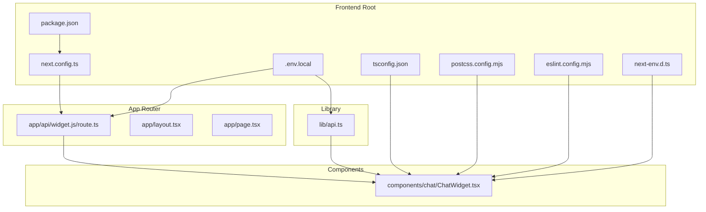
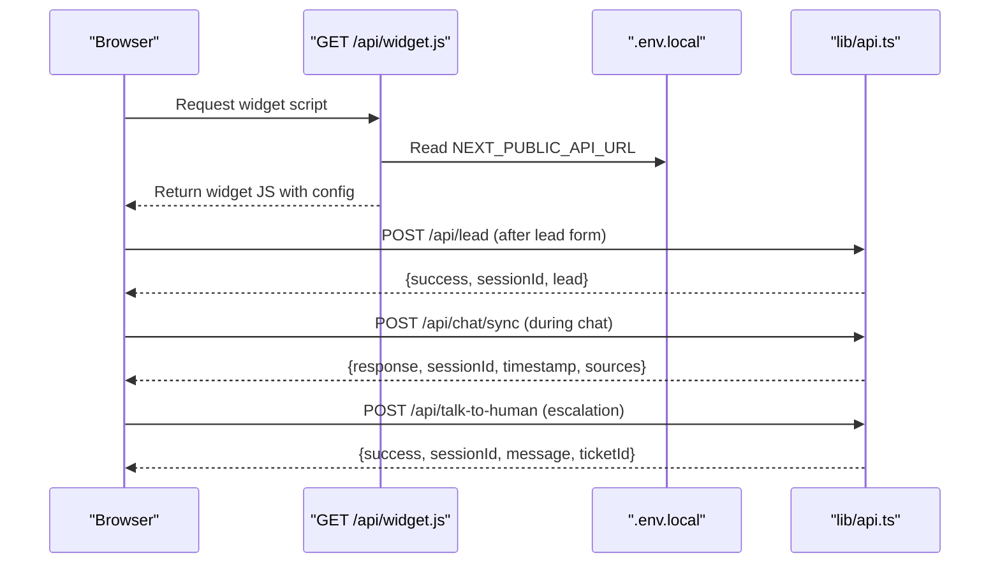
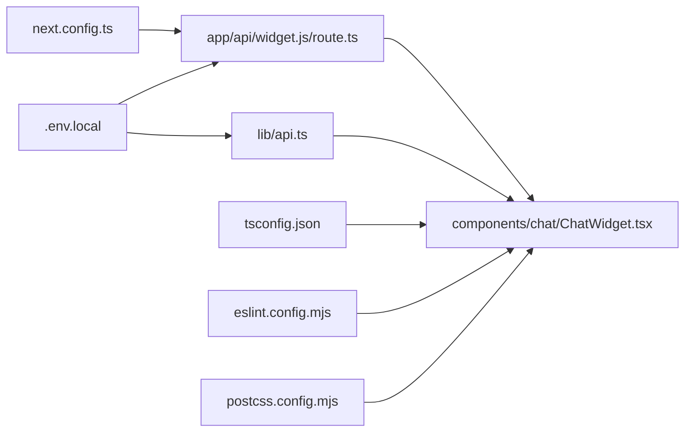

# Frontend Configuration

<cite>
**Referenced Files in This Document**
- [package.json](file://frontend/package.json)
- [next.config.ts](file://frontend/nex.config.ts)
- [.env.local](file://frontend/.env.local)
- [lib/api.ts](file://frontend/lib/api.ts)
- [components/chat/ChatWidget.tsx](file://frontend/components/chat/ChatWidget.tsx)
- [app/api/widget.js/route.ts](file://frontend/app/api/widget.js/route.ts)
- [tsconfig.json](file://frontend/tsconfig.json)
- [postcss.config.mjs](file://frontend/postcss.config.mjs)
- [eslint.config.mjs](file://frontend/eslint.config.mjs)
- [next-env.d.ts](file://frontend/nex-env.d.ts)
</cite>

## Table of Contents
1. [Introduction](#introduction)
2. [Project Structure](#project-structure)
3. [Core Components](#core-components)
4. [Architecture Overview](#architecture-overview)
5. [Detailed Component Analysis](#detailed-component-analysis)
6. [Dependency Analysis](#dependency-analysis)
7. [Performance Considerations](#performance-considerations)
8. [Troubleshooting Guide](#troubleshooting-guide)
9. [Conclusion](#conclusion)
10. [Appendices](#appendices)

## Introduction
This document explains the frontend configuration for the Next.js application, focusing on build settings, static asset handling, environment variable exposure, and integration with backend APIs. It also covers package.json scripts and dependencies, environment variable configuration via .env.local, frontend-backend URL integration, cross-origin considerations, build optimization, and deployment guidance for Vercel. Security considerations and configuration validation are included to ensure safe and reliable operation.

## Project Structure
The frontend is organized under the frontend directory with Next.js app router conventions. Key configuration files include Next.js configuration, TypeScript compiler options, PostCSS/Tailwind integration, ESLint configuration, and environment variables. The application exposes a widget endpoint that generates a client-side JavaScript widget for embedding.

**Diagram sources**
- [package.json](file://frontend/package.json)
- [next.config.ts](file://frontend/nex.config.ts)
- [.env.local](file://frontend/.env.local)
- [lib/api.ts](file://frontend/lib/api.ts)
- [components/chat/ChatWidget.tsx](file://frontend/components/chat/ChatWidget.tsx)
- [app/api/widget.js/route.ts](file://frontend/app/api/widget.js/route.ts)
- [tsconfig.json](file://frontend/tsconfig.json)
- [postcss.config.mjs](file://frontend/postcss.config.mjs)
- [eslint.config.mjs](file://frontend/eslint.config.mjs)
- [next-env.d.ts](file://frontend/nex-env.d.ts)

**Section sources**
- [package.json](file://frontend/package.json)
- [next.config.ts](file://frontend/nex.config.ts)
- [.env.local](file://frontend/.env.local)
- [tsconfig.json](file://frontend/tsconfig.json)
- [postcss.config.mjs](file://frontend/postcss.config.mjs)
- [eslint.config.mjs](file://frontend/eslint.config.mjs)
- [next-env.d.ts](file://frontend/nex-env.d.ts)

## Core Components
- Next.js configuration defines export output mode, distribution directory, image optimization settings, and environment variable exposure for the frontend.
- Package.json specifies scripts for development, production build, and server start, along with dependencies and devDependencies.
- Environment variables are configured via .env.local and consumed in both server-side routes and client-side API module.
- The API client encapsulates base URL and request configuration, enabling consistent backend communication.
- The ChatWidget component orchestrates lead submission, messaging, and human escalation flows, interacting with the API client.

**Section sources**
- [next.config.ts](file://frontend/nex.config.ts)
- [package.json](file://frontend/package.json)
- [.env.local](file://frontend/.env.local)
- [lib/api.ts](file://frontend/lib/api.ts)
- [components/chat/ChatWidget.tsx](file://frontend/components/chat/ChatWidget.tsx)

## Architecture Overview
The frontend integrates a Next.js app with a widget endpoint that serves a self-contained JavaScript widget. The widget loads configuration from query parameters and environment variables, communicates with the backend API, and persists session data locally.

**Diagram sources**
- [app/api/widget.js/route.ts](file://frontend/app/api/widget.js/route.ts)
- [.env.local](file://frontend/.env.local)
- [lib/api.ts](file://frontend/lib/api.ts)

## Detailed Component Analysis

### Next.js Configuration (next.config.ts)
- Build settings:
  - Output mode is export for static generation.
  - Distribution directory is customized to dist.
- Static asset handling:
  - Images are unoptimized to avoid external image optimization overhead.
- Environment variable exposure:
  - NEXT_PUBLIC_API_URL is exposed to the browser with a fallback value.

These settings enable a static export build suitable for hosting and predictable asset delivery.

**Section sources**
- [next.config.ts](file://frontend/nex.config.ts)

### Package.json Configuration
- Scripts:
  - dev: starts the Next.js development server.
  - build: performs the Next.js production build.
  - start: runs the production server.
  - lint: executes ESLint.
- Dependencies:
  - Next.js, React, and React DOM define the framework and runtime.
  - Tailwind-based UI libraries and icons provide styling and components.
  - Axios is used for HTTP requests.
- DevDependencies:
  - TypeScript, ESLint, Tailwind CSS, and related tooling support development workflow.

Build and runtime behavior are governed by these scripts and dependencies.

**Section sources**
- [package.json](file://frontend/package.json)

### Environment Variable Configuration (.env.local)
- Frontend-only variables:
  - NEXT_PUBLIC_API_URL: backend API base URL for the frontend.
  - NEXT_PUBLIC_WIDGET_API_URL: widget API base URL for the frontend.
- Consumption:
  - The widget route reads NEXT_PUBLIC_API_URL from environment variables.
  - The API client reads NEXT_PUBLIC_API_URL to configure the base URL.

Ensure these variables are set appropriately per environment (development, staging, production).

**Section sources**
- [.env.local](file://frontend/.env.local)
- [app/api/widget.js/route.ts](file://frontend/app/api/widget.js/route.ts)
- [lib/api.ts](file://frontend/lib/api.ts)

### API Client (lib/api.ts)
- Base URL:
  - Uses NEXT_PUBLIC_API_URL with a fallback to localhost for development.
- Endpoints:
  - Lead submission, chat sync, human escalation, conversation retrieval, and health checks.
- Headers:
  - JSON content type is standardized.

This module centralizes API communication and simplifies endpoint updates.

**Section sources**
- [lib/api.ts](file://frontend/lib/api.ts)

### Widget Route (app/api/widget.js/route.ts)
- Purpose:
  - Generates a JavaScript widget tailored for embedding on external pages.
- Configuration:
  - Reads apiUrl, primaryColor, and position from query parameters.
  - Falls back to NEXT_PUBLIC_API_URL if apiUrl is not provided.
- Behavior:
  - Manages lead collection, chat UI, message exchange, and human escalation.
  - Persists session data in localStorage with TTL.

This route enables flexible deployment and customization of the chat widget.

**Section sources**
- [app/api/widget.js/route.ts](file://frontend/app/api/widget.js/route.ts)

### ChatWidget Component (components/chat/ChatWidget.tsx)
- Responsibilities:
  - Renders lead form, chat UI, typing indicators, and input area.
  - Manages session lifecycle, message history, and escalation to human.
  - Integrates with the API client for backend interactions.
- Storage:
  - Uses localStorage to persist session data with a 24-hour TTL.

This component provides the interactive chat experience and coordinates with the API.

**Section sources**
- [components/chat/ChatWidget.tsx](file://frontend/components/chat/ChatWidget.tsx)

### TypeScript Configuration (tsconfig.json)
- Compiler options:
  - Strict type checking, ES2017 target, bundler module resolution, and JSX transform.
  - Path aliases mapped to the root for clean imports.
- Includes/excludes:
  - Includes Next.js type files and TypeScript sources while excluding node_modules.

Ensures robust type safety and predictable builds.

**Section sources**
- [tsconfig.json](file://frontend/tsconfig.json)

### PostCSS and Tailwind (postcss.config.mjs)
- Plugin:
  - Tailwind PostCSS plugin is enabled for CSS generation and JIT compilation.
- Integration:
  - Works with Next.js app directory and Tailwind CSS v4.

Provides efficient styling pipeline.

**Section sources**
- [postcss.config.mjs](file://frontend/postcss.config.mjs)

### ESLint Configuration (eslint.config.mjs)
- Extends:
  - Next.js core web vitals and TypeScript configurations.
- Overrides:
  - Adjusts default ignores to exclude Next.js build artifacts and type declaration files.

Maintains code quality and consistency.

**Section sources**
- [eslint.config.mjs](file://frontend/eslint.config.mjs)

### Next.js Type Declaration (next-env.d.ts)
- Purpose:
  - Declares Next.js and image types for type-safe development.
- Notes:
  - Intended not to be edited manually.

**Section sources**
- [next-env.d.ts](file://frontend/nex-env.d.ts)

## Dependency Analysis
The frontend depends on Next.js for routing and SSR/SSG, Axios for HTTP requests, and UI libraries for components. The widget route depends on environment variables and the API client. The ChatWidget component depends on the API client and local storage.

**Diagram sources**
- [next.config.ts](file://frontend/nex.config.ts)
- [.env.local](file://frontend/.env.local)
- [lib/api.ts](file://frontend/lib/api.ts)
- [components/chat/ChatWidget.tsx](file://frontend/components/chat/ChatWidget.tsx)
- [app/api/widget.js/route.ts](file://frontend/app/api/widget.js/route.ts)
- [tsconfig.json](file://frontend/tsconfig.json)
- [postcss.config.mjs](file://frontend/postcss.config.mjs)
- [eslint.config.mjs](file://frontend/eslint.config.mjs)

**Section sources**
- [next.config.ts](file://frontend/nex.config.ts)
- [package.json](file://frontend/package.json)
- [.env.local](file://frontend/.env.local)
- [lib/api.ts](file://frontend/lib/api.ts)
- [components/chat/ChatWidget.tsx](file://frontend/components/chat/ChatWidget.tsx)
- [app/api/widget.js/route.ts](file://frontend/app/api/widget.js/route.ts)
- [tsconfig.json](file://frontend/tsconfig.json)
- [postcss.config.mjs](file://frontend/postcss.config.mjs)
- [eslint.config.mjs](file://frontend/eslint.config.mjs)

## Performance Considerations
- Static export:
  - The export output mode reduces server requirements and improves cold start characteristics.
- Image optimization:
  - Unoptimized images reduce build complexity; consider enabling optimized images in production if CDN and performance require it.
- Build artifacts:
  - Using a dedicated dist directory helps with caching and deployment hygiene.
- Client-side widget:
  - The widget route returns a cached script; tune cache-control headers for optimal delivery.
- Local storage:
  - Session persistence avoids repeated network calls but should be cleared on logout or TTL expiration.

[No sources needed since this section provides general guidance]

## Troubleshooting Guide
- API URL misconfiguration:
  - Verify NEXT_PUBLIC_API_URL in .env.local matches the backend deployment address.
  - Confirm the widget route respects query parameter apiUrl overrides.
- CORS errors:
  - Ensure the backend allows requests from the frontend origin; configure CORS headers accordingly.
- Build failures:
  - Check Next.js configuration for export mode compatibility and image settings.
  - Validate TypeScript configuration and ESLint rules.
- Widget not loading:
  - Confirm the widget route is reachable and returns JavaScript content.
  - Inspect browser console for errors during widget initialization.

**Section sources**
- [.env.local](file://frontend/.env.local)
- [app/api/widget.js/route.ts](file://frontend/app/api/widget.js/route.ts)
- [lib/api.ts](file://frontend/lib/api.ts)
- [next.config.ts](file://frontend/nex.config.ts)
- [tsconfig.json](file://frontend/tsconfig.json)
- [eslint.config.mjs](file://frontend/eslint.config.mjs)

## Conclusion
The frontend configuration leverages Next.js export mode, environment-driven API URLs, and a self-contained widget route to deliver a scalable chat experience. By aligning environment variables, build settings, and API client configuration, teams can deploy reliably to Vercel or static hosts while maintaining strong security and performance characteristics.

[No sources needed since this section summarizes without analyzing specific files]

## Appendices

### Frontend Environment Setup Examples
- Development:
  - Set NEXT_PUBLIC_API_URL to the local backend address.
  - Run npm run dev to start the Next.js development server.
- Production:
  - Set NEXT_PUBLIC_API_URL to the production backend domain.
  - Build with npm run build and serve with npm run start.

**Section sources**
- [.env.local](file://frontend/.env.local)
- [package.json](file://frontend/package.json)

### Build Optimization Settings
- Export mode:
  - Suitable for static hosting; ensures deterministic builds.
- Image handling:
  - Unoptimized images simplify builds; enable optimized images if CDN and performance require it.
- Distribution directory:
  - dist improves artifact organization and caching.

**Section sources**
- [next.config.ts](file://frontend/nex.config.ts)

### Deployment Configuration for Vercel
- Static export:
  - Configure Vercel to serve the exported static site.
- Environment variables:
  - Add NEXT_PUBLIC_API_URL and NEXT_PUBLIC_WIDGET_API_URL in Vercel project settings.
- Widget route:
  - Ensure the /api/widget.js endpoint remains accessible for serving the widget script.

[No sources needed since this section provides general guidance]

### Frontend-Specific Security Considerations
- Expose only frontend-safe variables (NEXT_PUBLIC_ prefix).
- Validate and sanitize inputs in the widget route and API client.
- Use HTTPS for production deployments and enforce secure cookies if backend requires them.
- Implement rate limiting and input validation on the backend to mitigate abuse.

**Section sources**
- [app/api/widget.js/route.ts](file://frontend/app/api/widget.js/route.ts)
- [lib/api.ts](file://frontend/lib/api.ts)

### Configuration Validation Checklist
- Environment variables:
  - NEXT_PUBLIC_API_URL and NEXT_PUBLIC_WIDGET_API_URL are present and correct.
- Build:
  - next.config.ts export mode and distDir are set.
  - TypeScript and ESLint configurations pass without errors.
- Runtime:
  - Widget route responds with JavaScript content.
  - API client connects to backend endpoints successfully.

**Section sources**
- [.env.local](file://frontend/.env.local)
- [next.config.ts](file://frontend/nex.config.ts)
- [tsconfig.json](file://frontend/tsconfig.json)
- [eslint.config.mjs](file://frontend/eslint.config.mjs)
- [app/api/widget.js/route.ts](file://frontend/app/api/widget.js/route.ts)
- [lib/api.ts](file://frontend/lib/api.ts)