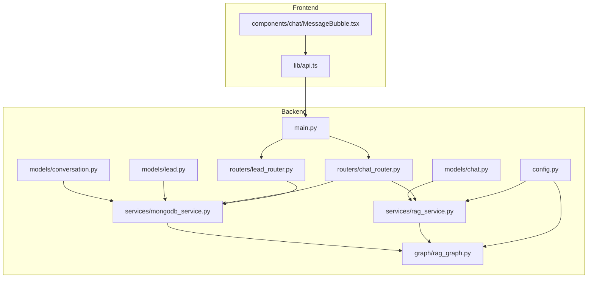
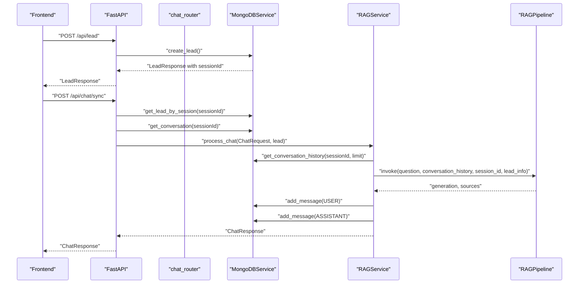
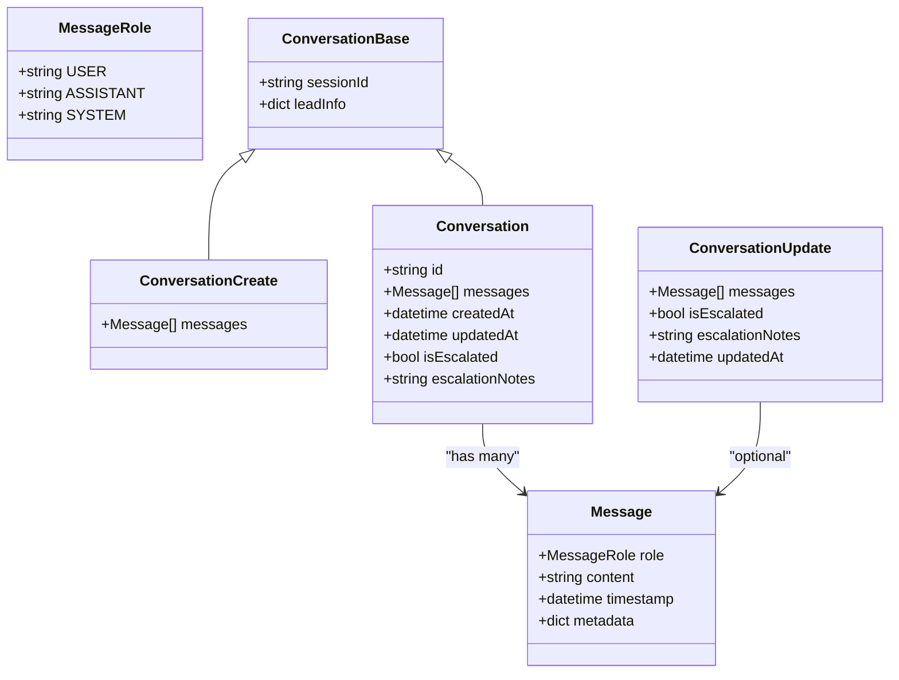
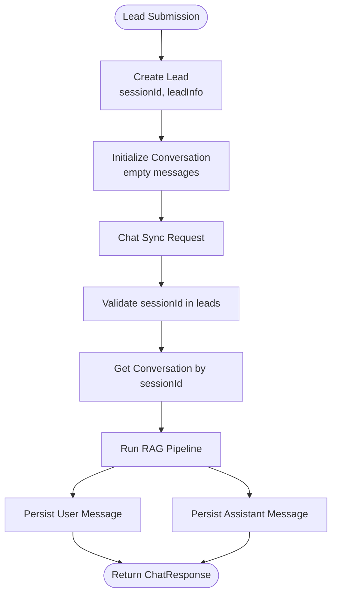
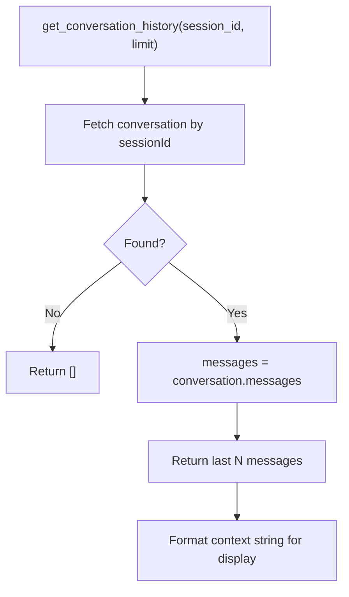
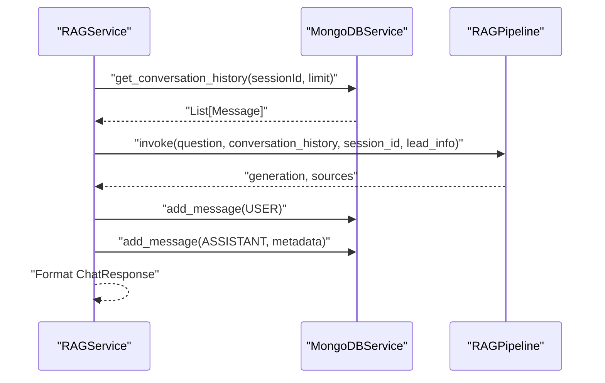
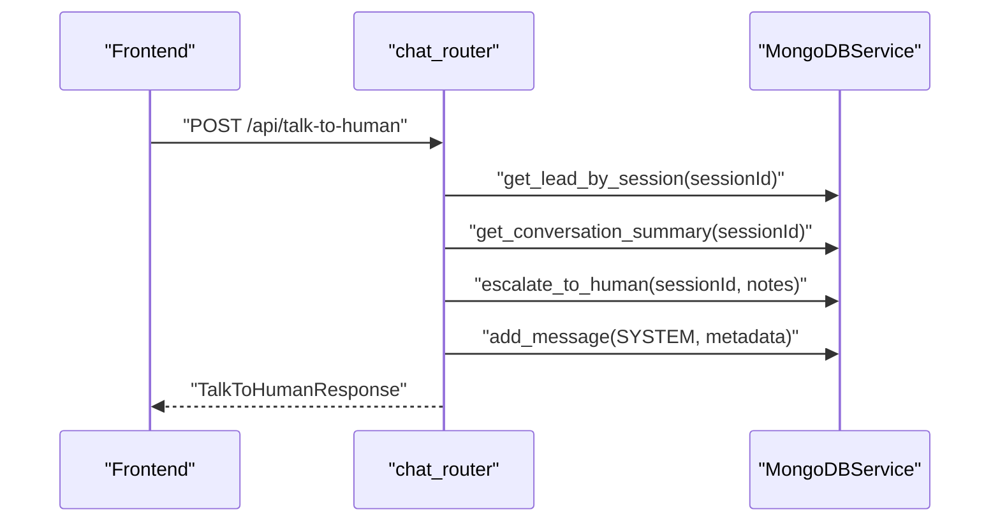
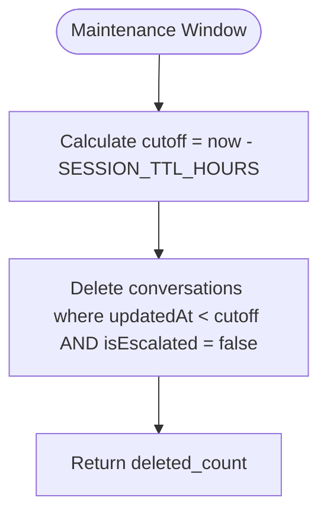
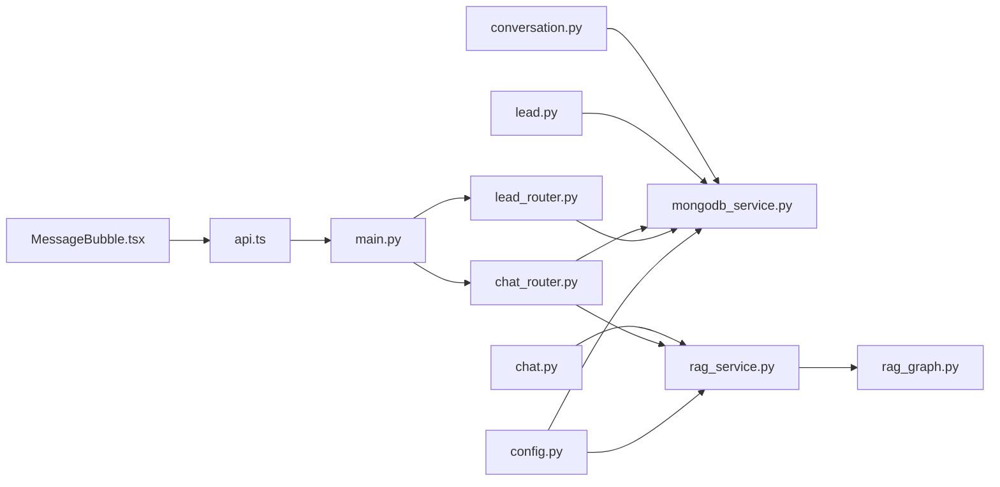

# Conversation Collection Schema

<cite>
**Referenced Files in This Document**
- [conversation.py](file://backend/app/models/conversation.py)
- [chat.py](file://backend/app/models/chat.py)
- [lead.py](file://backend/app/models/lead.py)
- [chat_router.py](file://backend/app/routers/chat_router.py)
- [lead_router.py](file://backend/app/routers/lead_router.py)
- [mongodb_service.py](file://backend/app/services/mongodb_service.py)
- [rag_service.py](file://backend/app/services/rag_service.py)
- [rag_graph.py](file://backend/app/graph/rag_graph.py)
- [config.py](file://backend/app/config.py)
- [main.py](file://backend/app/main.py)
- [api.ts](file://frontend/lib/api.ts)
- [MessageBubble.tsx](file://frontend/components/chat/MessageBubble.tsx)
</cite>

## Table of Contents
1. [Introduction](#introduction)
2. [Project Structure](#project-structure)
3. [Core Components](#core-components)
4. [Architecture Overview](#architecture-overview)
5. [Detailed Component Analysis](#detailed-component-analysis)
6. [Dependency Analysis](#dependency-analysis)
7. [Performance Considerations](#performance-considerations)
8. [Troubleshooting Guide](#troubleshooting-guide)
9. [Conclusion](#conclusion)
10. [Appendices](#appendices)

## Introduction
This document explains the Conversation collection schema implementation used by the RAG-powered chatbot. It covers the conversation document structure, message arrays, role definitions, timestamps, and metadata preservation. It also details conversation state management, session linking to lead sessions, message ordering, context preservation for RAG processing, and integration with chat message models and their serialization/deserialization. Finally, it outlines lifecycle management, pruning strategies, and memory optimization techniques, along with the relationship between conversation documents and lead sessions for complete customer journey tracking.

## Project Structure
The conversation schema is implemented in the backend Python application and integrated with routers, services, and the frontend. The key files involved are:
- Models: conversation schema and chat models
- Routers: endpoints for chat and lead management
- Services: MongoDB persistence and RAG orchestration
- Graph: LangGraph pipeline for RAG processing
- Frontend: API client and UI components consuming conversation data

**Diagram sources**
- [conversation.py:1-53](file://backend/app/models/conversation.py#L1-L53)
- [chat.py:1-45](file://backend/app/models/chat.py#L1-L45)
- [lead.py:1-64](file://backend/app/models/lead.py#L1-L64)
- [chat_router.py:1-130](file://backend/app/routers/chat_router.py#L1-L130)
- [lead_router.py:1-57](file://backend/app/routers/lead_router.py#L1-L57)
- [mongodb_service.py:1-202](file://backend/app/services/mongodb_service.py#L1-L202)
- [rag_service.py:1-116](file://backend/app/services/rag_service.py#L1-L116)
- [rag_graph.py:1-264](file://backend/app/graph/rag_graph.py#L1-L264)
- [config.py:1-65](file://backend/app/config.py#L1-L65)
- [main.py:1-90](file://backend/app/main.py#L1-L90)
- [api.ts:1-93](file://frontend/lib/api.ts#L1-L93)
- [MessageBubble.tsx:1-77](file://frontend/components/chat/MessageBubble.tsx#L1-L77)

**Section sources**
- [main.py:1-90](file://backend/app/main.py#L1-L90)
- [config.py:1-65](file://backend/app/config.py#L1-L65)

## Core Components
- Conversation schema: Defines message roles, message structure, and conversation document fields including timestamps and escalation metadata.
- Chat models: Define request/response shapes for chat and human escalation.
- Lead models: Define lead creation and storage, including session identifiers.
- MongoDB service: Implements CRUD operations for leads and conversations, indexing, and maintenance tasks.
- RAG service: Orchestrates conversation history retrieval, LangGraph pipeline invocation, and message persistence.
- RAG graph: Implements the LangGraph workflow for retrieval, grading, query transformation, and generation.
- Routers: Expose endpoints for synchronous chat, escalation, and conversation retrieval.
- Frontend API: Provides typed requests/responses and consumes conversation data.

**Section sources**
- [conversation.py:1-53](file://backend/app/models/conversation.py#L1-L53)
- [chat.py:1-45](file://backend/app/models/chat.py#L1-L45)
- [lead.py:1-64](file://backend/app/models/lead.py#L1-L64)
- [mongodb_service.py:1-202](file://backend/app/services/mongodb_service.py#L1-L202)
- [rag_service.py:1-116](file://backend/app/services/rag_service.py#L1-L116)
- [rag_graph.py:1-264](file://backend/app/graph/rag_graph.py#L1-L264)
- [chat_router.py:1-130](file://backend/app/routers/chat_router.py#L1-L130)
- [lead_router.py:1-57](file://backend/app/routers/lead_router.py#L1-L57)
- [api.ts:1-93](file://frontend/lib/api.ts#L1-L93)

## Architecture Overview
The conversation lifecycle spans lead creation, session initialization, chat processing with RAG, and persistent storage. The frontend interacts with FastAPI endpoints, which delegate to MongoDB and RAG services.

**Diagram sources**
- [lead_router.py:11-44](file://backend/app/routers/lead_router.py#L11-L44)
- [chat_router.py:12-56](file://backend/app/routers/chat_router.py#L12-L56)
- [mongodb_service.py:51-133](file://backend/app/services/mongodb_service.py#L51-L133)
- [rag_service.py:19-87](file://backend/app/services/rag_service.py#L19-L87)
- [rag_graph.py:221-251](file://backend/app/graph/rag_graph.py#L221-L251)

## Detailed Component Analysis

### Conversation Schema and Message Model
The conversation schema defines:
- MessageRole enum: user, assistant, system
- Message model: role, content, timestamp, metadata
- ConversationBase: sessionId and leadInfo snapshot
- ConversationCreate: creates a conversation with an empty messages array
- Conversation: full document with id, messages, timestamps, escalation flags
- ConversationUpdate: updateable fields including messages, escalation flags, and updatedAt

**Diagram sources**
- [conversation.py:8-53](file://backend/app/models/conversation.py#L8-L53)

**Section sources**
- [conversation.py:8-53](file://backend/app/models/conversation.py#L8-L53)

### Message Schema Details
- Role definitions: user (customer), assistant (AI), system (internal/system messages)
- Content: validated to be non-empty; serialized to MongoDB as strings
- Timestamp: UTC timestamps recorded for each message
- Metadata: optional dictionary for storing auxiliary data (e.g., sources, model, documents_used)

Serialization/deserialization:
- Pydantic models convert between Python dicts and typed models
- MongoDB stores messages as embedded documents with role, content, timestamp, and metadata

**Section sources**
- [conversation.py:15-21](file://backend/app/models/conversation.py#L15-L21)
- [mongodb_service.py:117-133](file://backend/app/services/mongodb_service.py#L117-L133)

### Conversation Document Structure
- sessionId: links to lead session
- leadInfo: snapshot of lead information at conversation creation
- messages: ordered array of Message objects
- createdAt/updatedAt: timestamps for lifecycle tracking
- isEscalated/escalationNotes: escalation state and notes

Indexes:
- Unique index on sessionId for fast lookup
- createdAt and isEscalated for analytics and pruning

**Section sources**
- [conversation.py:23-42](file://backend/app/models/conversation.py#L23-L42)
- [mongodb_service.py:44-48](file://backend/app/services/mongodb_service.py#L44-L48)
- [mongodb_service.py:98-111](file://backend/app/services/mongodb_service.py#L98-L111)

### Session Linking and Lead Integration
- Lead creation generates a sessionId and initializes an empty conversation
- Chat endpoints validate sessionId against leads before processing
- Conversation documents preserve leadInfo snapshot for context

**Diagram sources**
- [lead_router.py:11-38](file://backend/app/routers/lead_router.py#L11-L38)
- [mongodb_service.py:51-77](file://backend/app/services/mongodb_service.py#L51-L77)
- [mongodb_service.py:113-115](file://backend/app/services/mongodb_service.py#L113-L115)
- [rag_service.py:19-87](file://backend/app/services/rag_service.py#L19-L87)

**Section sources**
- [lead_router.py:11-38](file://backend/app/routers/lead_router.py#L11-L38)
- [mongodb_service.py:51-77](file://backend/app/services/mongodb_service.py#L51-L77)
- [mongodb_service.py:113-115](file://backend/app/services/mongodb_service.py#L113-L115)

### Message Ordering and Context Preservation
- Message order is preserved as an array; latest messages are appended last
- Context for RAG is derived from recent messages (default limit configured)
- Conversation history is formatted as a string for display and pipeline context

**Diagram sources**
- [mongodb_service.py:135-159](file://backend/app/services/mongodb_service.py#L135-L159)

**Section sources**
- [mongodb_service.py:135-159](file://backend/app/services/mongodb_service.py#L135-L159)
- [config.py:39-39](file://backend/app/config.py#L39-L39)

### RAG Integration and Serialization
- RAGService retrieves recent conversation history and formats it for LangGraph
- The pipeline invokes the graph with question, conversation_history, session_id, and lead_info
- After generation, user and assistant messages are persisted with metadata (sources, model, documents_used)

**Diagram sources**
- [rag_service.py:19-87](file://backend/app/services/rag_service.py#L19-L87)
- [rag_graph.py:221-251](file://backend/app/graph/rag_graph.py#L221-L251)
- [mongodb_service.py:117-133](file://backend/app/services/mongodb_service.py#L117-L133)

**Section sources**
- [rag_service.py:19-87](file://backend/app/services/rag_service.py#L19-L87)
- [rag_graph.py:150-219](file://backend/app/graph/rag_graph.py#L150-L219)

### Escalation and Human Handoff
- Escalation marks conversation as isEscalated and stores escalationNotes
- A system message is appended indicating escalation
- Lead status is updated to escalated
- Chat sync endpoint checks escalation flag and returns a system message if escalated

**Diagram sources**
- [chat_router.py:58-117](file://backend/app/routers/chat_router.py#L58-L117)
- [mongodb_service.py:161-180](file://backend/app/services/mongodb_service.py#L161-L180)

**Section sources**
- [chat_router.py:58-117](file://backend/app/routers/chat_router.py#L58-L117)
- [mongodb_service.py:161-180](file://backend/app/services/mongodb_service.py#L161-L180)

### Conversation Retrieval Patterns
- Endpoint GET /api/conversation/{session_id} returns the full conversation document
- Frontend API exposes getConversation(sessionId) to fetch and render history

**Section sources**
- [chat_router.py:120-129](file://backend/app/routers/chat_router.py#L120-L129)
- [api.ts:82-85](file://frontend/lib/api.ts#L82-L85)

### Lifecycle Management and Pruning Strategies
- Indexes: sessionId (unique), createdAt, isEscalated
- Maintenance: cleanup_expired_sessions deletes conversations older than a threshold where isEscalated is false
- TTL and pruning: SESSION_TTL_HOURS controls expiration window; MAX_CONVERSATION_HISTORY limits context size

**Diagram sources**
- [mongodb_service.py:182-192](file://backend/app/services/mongodb_service.py#L182-L192)
- [config.py:38-39](file://backend/app/config.py#L38-L39)

**Section sources**
- [mongodb_service.py:182-192](file://backend/app/services/mongodb_service.py#L182-L192)
- [config.py:38-39](file://backend/app/config.py#L38-L39)

### Memory Optimization Techniques
- Limit conversation history passed to RAG via MAX_CONVERSATION_HISTORY
- Store only essential metadata in messages (sources, model, documents_used)
- Use indexes to optimize frequent lookups by sessionId and createdAt

**Section sources**
- [config.py:39-39](file://backend/app/config.py#L39-L39)
- [rag_service.py:30-34](file://backend/app/services/rag_service.py#L30-L34)

### Relationship Between Conversations and Lead Sessions
- sessionId is the primary link between leads and conversations
- Lead creation initializes an empty conversation with leadInfo snapshot
- Escalation updates both conversation and lead statuses consistently

**Section sources**
- [lead_router.py:11-38](file://backend/app/routers/lead_router.py#L11-L38)
- [mongodb_service.py:98-111](file://backend/app/services/mongodb_service.py#L98-L111)
- [mongodb_service.py:161-180](file://backend/app/services/mongodb_service.py#L161-L180)

## Dependency Analysis
The conversation schema integrates tightly with MongoDB persistence, RAG orchestration, and FastAPI routers. The following diagram shows key dependencies:

**Diagram sources**
- [conversation.py:1-53](file://backend/app/models/conversation.py#L1-L53)
- [chat.py:1-45](file://backend/app/models/chat.py#L1-L45)
- [lead.py:1-64](file://backend/app/models/lead.py#L1-L64)
- [mongodb_service.py:1-202](file://backend/app/services/mongodb_service.py#L1-L202)
- [rag_service.py:1-116](file://backend/app/services/rag_service.py#L1-L116)
- [rag_graph.py:1-264](file://backend/app/graph/rag_graph.py#L1-L264)
- [chat_router.py:1-130](file://backend/app/routers/chat_router.py#L1-L130)
- [lead_router.py:1-57](file://backend/app/routers/lead_router.py#L1-L57)
- [config.py:1-65](file://backend/app/config.py#L1-L65)
- [main.py:1-90](file://backend/app/main.py#L1-L90)
- [api.ts:1-93](file://frontend/lib/api.ts#L1-L93)
- [MessageBubble.tsx:1-77](file://frontend/components/chat/MessageBubble.tsx#L1-L77)

**Section sources**
- [mongodb_service.py:1-202](file://backend/app/services/mongodb_service.py#L1-L202)
- [rag_service.py:1-116](file://backend/app/services/rag_service.py#L1-L116)
- [rag_graph.py:1-264](file://backend/app/graph/rag_graph.py#L1-L264)
- [chat_router.py:1-130](file://backend/app/routers/chat_router.py#L1-L130)
- [lead_router.py:1-57](file://backend/app/routers/lead_router.py#L1-L57)
- [config.py:1-65](file://backend/app/config.py#L1-L65)
- [main.py:1-90](file://backend/app/main.py#L1-L90)
- [api.ts:1-93](file://frontend/lib/api.ts#L1-L93)
- [MessageBubble.tsx:1-77](file://frontend/components/chat/MessageBubble.tsx#L1-L77)

## Performance Considerations
- Indexing: Ensure sessionId, createdAt, and isEscalated indexes are present for efficient lookups and pruning.
- History limits: Use MAX_CONVERSATION_HISTORY to cap context size and reduce LLM token usage.
- Metadata minimization: Store only necessary metadata in messages to keep documents compact.
- Batch operations: Prefer bulk operations for ingestion and maintenance tasks.
- Caching: Consider caching frequently accessed lead/session data at the application layer.

[No sources needed since this section provides general guidance]

## Troubleshooting Guide
Common issues and resolutions:
- Session not found: Ensure sessionId exists in leads before chat processing; chat router validates session presence.
- Escalated conversation: Chat sync returns a system message when isEscalated is true.
- Persistence errors: Verify MongoDB connectivity and indexes; check update operations for modified_count.
- RAG failures: Confirm Pinecone initialization and embedding service availability; review pipeline logs.

**Section sources**
- [chat_router.py:28-44](file://backend/app/routers/chat_router.py#L28-L44)
- [mongodb_service.py:21-34](file://backend/app/services/mongodb_service.py#L21-L34)
- [main.py:74-83](file://backend/app/main.py#L74-L83)

## Conclusion
The Conversation collection schema provides a robust foundation for managing chat histories with explicit roles, timestamps, and metadata. Through tight integration with MongoDB, RAG orchestration, and FastAPI endpoints, it enables contextual, scalable, and maintainable customer interactions. Proper indexing, pruning, and memory optimization ensure long-term performance, while escalation and lead session linkage support complete customer journey tracking.

## Appendices

### Example Endpoints and Data Flows
- Lead creation initializes a session and conversation:
  - Endpoint: POST /api/lead
  - Behavior: Creates lead, generates sessionId, initializes empty conversation
  - References: [lead_router.py:11-38](file://backend/app/routers/lead_router.py#L11-L38), [mongodb_service.py:51-77](file://backend/app/services/mongodb_service.py#L51-L77)

- Chat sync with RAG:
  - Endpoint: POST /api/chat/sync
  - Behavior: Validates session, retrieves conversation, runs RAG, persists messages, returns response
  - References: [chat_router.py:12-56](file://backend/app/routers/chat_router.py#L12-L56), [rag_service.py:19-87](file://backend/app/services/rag_service.py#L19-L87)

- Escalation to human:
  - Endpoint: POST /api/talk-to-human
  - Behavior: Marks conversation escalated, stores notes, appends system message
  - References: [chat_router.py:58-117](file://backend/app/routers/chat_router.py#L58-L117), [mongodb_service.py:161-180](file://backend/app/services/mongodb_service.py#L161-L180)

- Conversation retrieval:
  - Endpoint: GET /api/conversation/{session_id}
  - Behavior: Returns full conversation document
  - References: [chat_router.py:120-129](file://backend/app/routers/chat_router.py#L120-L129), [api.ts:82-85](file://frontend/lib/api.ts#L82-L85)