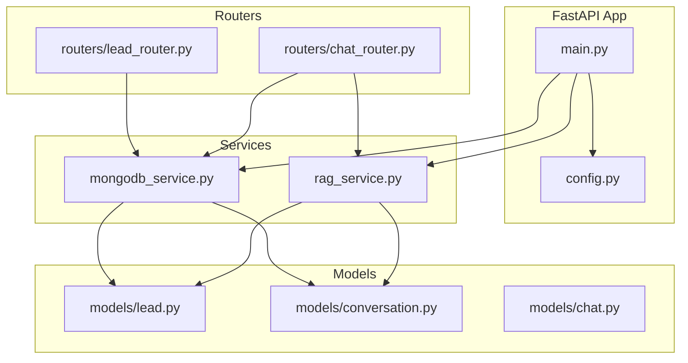
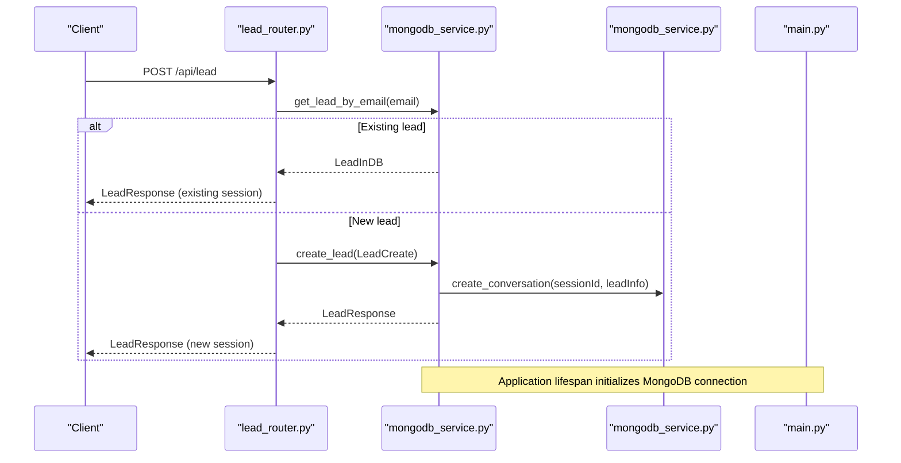
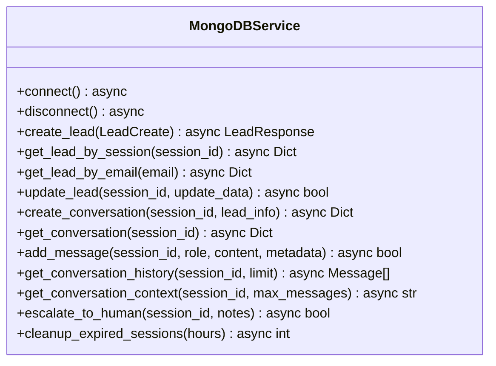
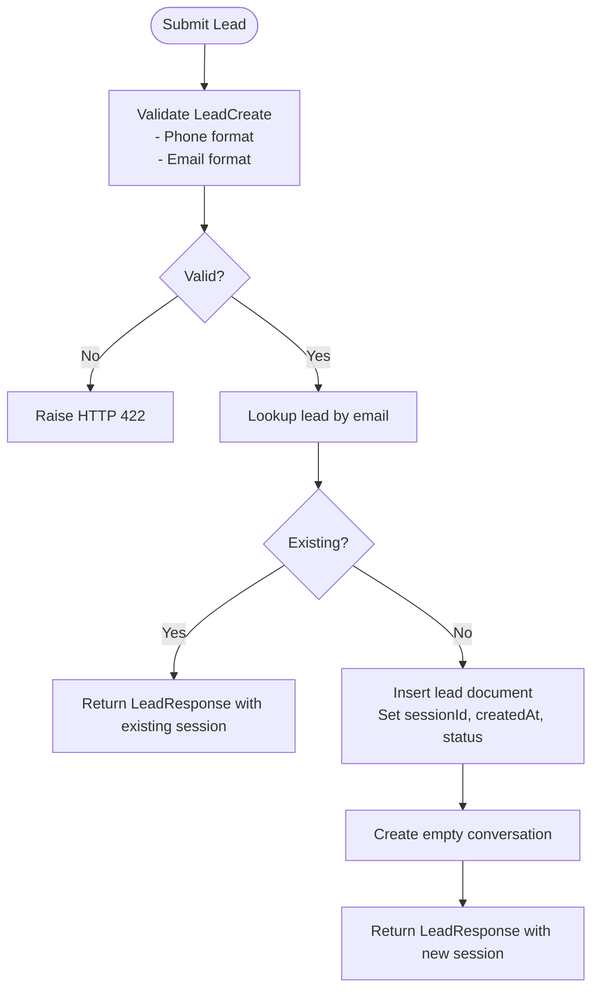
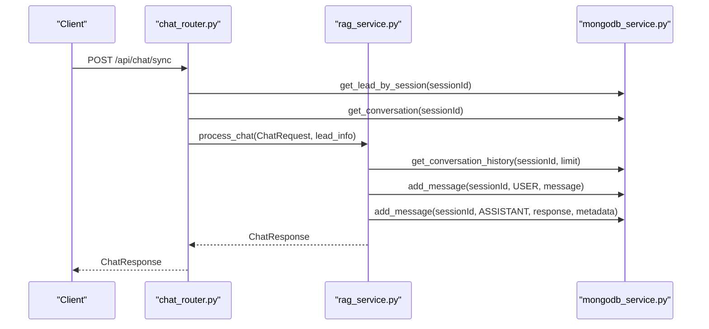
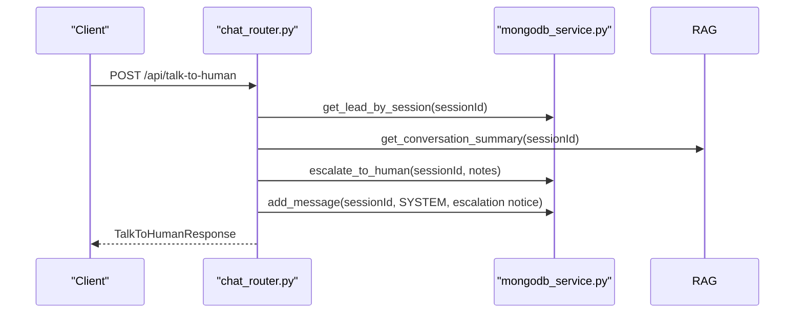
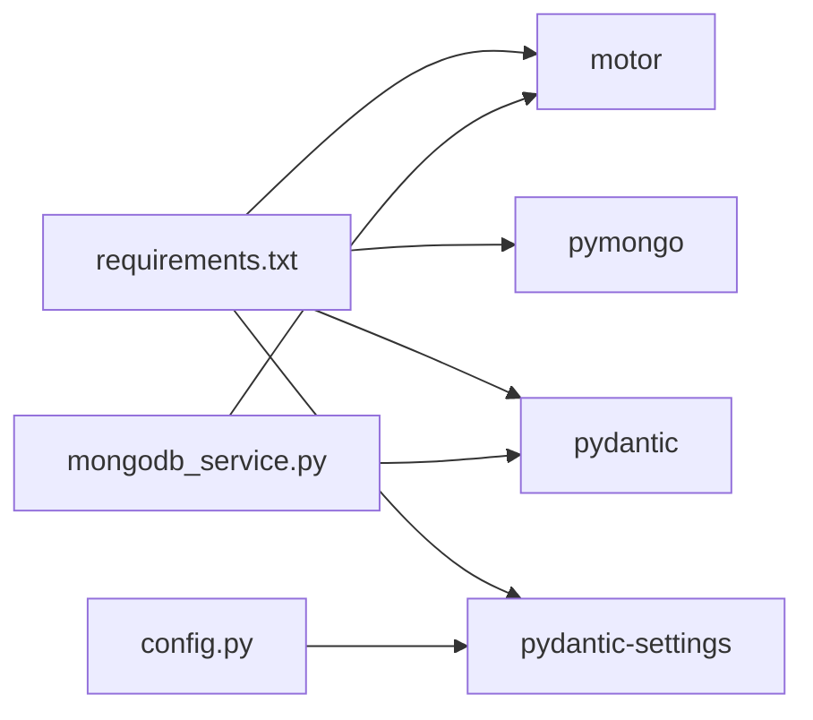

# Data Access Patterns and Operations

<cite>
**Referenced Files in This Document**
- [mongodb_service.py](file://backend/app/services/mongodb_service.py)
- [lead.py](file://backend/app/models/lead.py)
- [conversation.py](file://backend/app/models/conversation.py)
- [chat.py](file://backend/app/models/chat.py)
- [lead_router.py](file://backend/app/routers/lead_router.py)
- [chat_router.py](file://backend/app/routers/chat_router.py)
- [config.py](file://backend/app/config.py)
- [main.py](file://backend/app/main.py)
- [rag_service.py](file://backend/app/services/rag_service.py)
- [requirements.txt](file://backend/requirements.txt)
</cite>

## Table of Contents
1. [Introduction](#introduction)
2. [Project Structure](#project-structure)
3. [Core Components](#core-components)
4. [Architecture Overview](#architecture-overview)
5. [Detailed Component Analysis](#detailed-component-analysis)
6. [Dependency Analysis](#dependency-analysis)
7. [Performance Considerations](#performance-considerations)
8. [Troubleshooting Guide](#troubleshooting-guide)
9. [Conclusion](#conclusion)
10. [Appendices](#appendices)

## Introduction
This document explains the MongoDB data access patterns and CRUD operations implemented in the backend. It covers the service layer for connection management, collection operations, and transaction handling, along with query patterns for lead creation, conversation retrieval, and message insertion. It also documents indexing strategies for performance, concrete examples from the codebase, data consistency patterns, error handling, retry mechanisms, performance optimization techniques, and migration/schema evolution strategies.

## Project Structure
The backend is organized around a FastAPI application with modular services:
- Configuration and lifecycle management
- MongoDB service for data access
- Pydantic models for data validation and serialization
- Routers for API endpoints
- RAG service orchestrating chat and vector operations

**Diagram sources**
- [main.py:14-37](file://backend/app/main.py#L14-L37)
- [config.py:7-64](file://backend/app/config.py#L7-L64)
- [mongodb_service.py:13-202](file://backend/app/services/mongodb_service.py#L13-L202)
- [rag_service.py:11-116](file://backend/app/services/rag_service.py#L11-L116)
- [lead.py:18-64](file://backend/app/models/lead.py#L18-L64)
- [conversation.py:15-53](file://backend/app/models/conversation.py#L15-L53)
- [chat.py:7-45](file://backend/app/models/chat.py#L7-L45)
- [lead_router.py:11-57](file://backend/app/routers/lead_router.py#L11-L57)
- [chat_router.py:12-130](file://backend/app/routers/chat_router.py#L12-L130)

**Section sources**
- [main.py:14-37](file://backend/app/main.py#L14-L37)
- [config.py:7-64](file://backend/app/config.py#L7-L64)

## Core Components
- MongoDBService: Central data access layer managing connections, indexes, and CRUD operations for leads and conversations.
- Lead models: Validation and serialization for lead creation, storage, and responses.
- Conversation models: Message roles, conversation structure, and update models.
- Chat models: Request/response models for chat and escalation.
- Routers: API endpoints for lead submission, chat, and conversation retrieval.
- Configuration: Environment-driven settings for MongoDB, RAG, and session behavior.
- Lifespan management: Application startup/shutdown hooks to initialize and close MongoDB connections.

Key responsibilities:
- Connection lifecycle: Establish and tear down MongoDB connections.
- Index creation: Ensure efficient lookups on session IDs, timestamps, and escalation flags.
- CRUD operations: Create leads and conversations, update lead info, add messages, escalate conversations, and clean expired sessions.
- Query patterns: Retrieve leads by session/email, conversations by session, and recent message history.
- Integration: Coordinate with RAG service for chat processing and message persistence.

**Section sources**
- [mongodb_service.py:13-202](file://backend/app/services/mongodb_service.py#L13-L202)
- [lead.py:18-64](file://backend/app/models/lead.py#L18-L64)
- [conversation.py:15-53](file://backend/app/models/conversation.py#L15-L53)
- [chat.py:7-45](file://backend/app/models/chat.py#L7-L45)
- [lead_router.py:11-57](file://backend/app/routers/lead_router.py#L11-L57)
- [chat_router.py:12-130](file://backend/app/routers/chat_router.py#L12-L130)
- [config.py:7-64](file://backend/app/config.py#L7-L64)
- [main.py:14-37](file://backend/app/main.py#L14-L37)

## Architecture Overview
The system follows a layered architecture:
- API Layer: FastAPI routers expose endpoints for lead submission and chat.
- Service Layer: MongoDBService encapsulates data access; RAGService orchestrates chat and vector operations.
- Model Layer: Pydantic models define validation and serialization.
- Configuration Layer: Settings drive environment-specific behavior.

**Diagram sources**
- [lead_router.py:11-57](file://backend/app/routers/lead_router.py#L11-L57)
- [mongodb_service.py:51-77](file://backend/app/services/mongodb_service.py#L51-L77)
- [mongodb_service.py:98-111](file://backend/app/services/mongodb_service.py#L98-L111)
- [main.py:14-37](file://backend/app/main.py#L14-L37)

## Detailed Component Analysis

### MongoDB Service Layer
Responsibilities:
- Connection management: AsyncIOMotorClient initialization and cleanup.
- Index creation: Unique and single-field indexes on leads and conversations.
- Lead operations: Create, retrieve by session/email, update.
- Conversation operations: Create, retrieve, add messages, escalate, get recent history, and cleanup expired sessions.

Implementation highlights:
- Connection lifecycle: connect/disconnect methods manage client and database references.
- Indexes: Unique session index on leads and conversations; additional indexes on createdAt and isEscalated for filtering.
- CRUD patterns: Insert one document for lead and conversation; update with $set and $push modifiers; delete many for cleanup.
- Data consistency: Updates set updatedAt timestamps; escalation updates both conversation and lead status atomically via separate update operations.

**Diagram sources**
- [mongodb_service.py:13-202](file://backend/app/services/mongodb_service.py#L13-L202)

**Section sources**
- [mongodb_service.py:21-34](file://backend/app/services/mongodb_service.py#L21-L34)
- [mongodb_service.py:36-48](file://backend/app/services/mongodb_service.py#L36-L48)
- [mongodb_service.py:51-77](file://backend/app/services/mongodb_service.py#L51-L77)
- [mongodb_service.py:79-95](file://backend/app/services/mongodb_service.py#L79-L95)
- [mongodb_service.py:98-111](file://backend/app/services/mongodb_service.py#L98-L111)
- [mongodb_service.py:113-160](file://backend/app/services/mongodb_service.py#L113-L160)
- [mongodb_service.py:161-181](file://backend/app/services/mongodb_service.py#L161-L181)
- [mongodb_service.py:182-192](file://backend/app/services/mongodb_service.py#L182-L192)

### Lead Creation and Validation
- Lead validation: Phone number validator enforces Saudi phone number formats; email validated via EmailStr.
- Lead creation: Generates a unique session ID, sets source and status, inserts lead, and creates an empty conversation.
- Duplicate handling: Checks for existing email and returns existing session if found.

**Diagram sources**
- [lead_router.py:11-57](file://backend/app/routers/lead_router.py#L11-L57)
- [mongodb_service.py:51-77](file://backend/app/services/mongodb_service.py#L51-L77)
- [lead.py:26-38](file://backend/app/models/lead.py#L26-L38)

**Section sources**
- [lead_router.py:11-57](file://backend/app/routers/lead_router.py#L11-L57)
- [mongodb_service.py:51-77](file://backend/app/services/mongodb_service.py#L51-L77)
- [lead.py:18-64](file://backend/app/models/lead.py#L18-L64)

### Conversation Retrieval and Message Insertion
- Conversation retrieval: Fetch by session ID; return full document or recent messages.
- Message insertion: Append message to messages array with role, content, timestamp, and optional metadata; update updatedAt.
- Context extraction: Format recent messages into a context string for downstream processing.

**Diagram sources**
- [chat_router.py:12-56](file://backend/app/routers/chat_router.py#L12-L56)
- [rag_service.py:19-87](file://backend/app/services/rag_service.py#L19-L87)
- [mongodb_service.py:113-160](file://backend/app/services/mongodb_service.py#L113-L160)

**Section sources**
- [chat_router.py:12-56](file://backend/app/routers/chat_router.py#L12-L56)
- [rag_service.py:19-87](file://backend/app/services/rag_service.py#L19-L87)
- [mongodb_service.py:113-160](file://backend/app/services/mongodb_service.py#L113-L160)

### Escalation to Human Agent
- Escalation marks conversation as escalated and stores notes; also updates lead status.
- Adds a system message indicating escalation and returns a confirmation response with a ticket-like identifier.

**Diagram sources**
- [chat_router.py:58-117](file://backend/app/routers/chat_router.py#L58-L117)
- [rag_service.py:89-106](file://backend/app/services/rag_service.py#L89-L106)
- [mongodb_service.py:161-181](file://backend/app/services/mongodb_service.py#L161-L181)

**Section sources**
- [chat_router.py:58-117](file://backend/app/routers/chat_router.py#L58-L117)
- [rag_service.py:89-106](file://backend/app/services/rag_service.py#L89-L106)
- [mongodb_service.py:161-181](file://backend/app/services/mongodb_service.py#L161-L181)

### Indexing Strategies for Performance
- Leads collection:
  - Unique index on sessionId for fast session-based lookups.
  - Single-field indexes on email, phone, and createdAt to support filtering and sorting.
- Conversations collection:
  - Unique index on sessionId for session-based retrieval.
  - createdAt index for chronological queries.
  - isEscalated index for filtering escalated conversations.

These indexes optimize:
- Lead retrieval by session/email.
- Conversation retrieval by session.
- Filtering and sorting by creation time.
- Efficient escalation queries.

**Section sources**
- [mongodb_service.py:36-48](file://backend/app/services/mongodb_service.py#L36-L48)

### Data Consistency Patterns
- Atomic updates: Separate update operations for conversation escalation and lead status update; both set updatedAt timestamps.
- Eventual consistency: No multi-document ACID transactions; rely on separate updates and application-level checks.
- Timestamps: createdAt and updatedAt fields maintained for auditability and time-based queries.

**Section sources**
- [mongodb_service.py:161-181](file://backend/app/services/mongodb_service.py#L161-L181)

### Error Handling Strategies
- HTTP exceptions raised for invalid sessions, not found scenarios, and internal errors.
- Try/catch blocks in routers wrap service calls and translate exceptions to HTTP responses.
- Health endpoint reports MongoDB connection status.

**Section sources**
- [lead_router.py:24-44](file://backend/app/routers/lead_router.py#L24-L44)
- [chat_router.py:27-55](file://backend/app/routers/chat_router.py#L27-L55)
- [chat_router.py:71-117](file://backend/app/routers/chat_router.py#L71-L117)
- [main.py:74-83](file://backend/app/main.py#L74-L83)

### Retry Mechanisms
- No explicit retry logic is present in the current implementation.
- Consider adding retries for transient network errors when interacting with MongoDB or external services.

**Section sources**
- [mongodb_service.py:21-34](file://backend/app/services/mongodb_service.py#L21-L34)

### Performance Optimization Techniques
- Connection pooling: Motor’s AsyncIOMotorClient manages connection pooling internally; ensure proper reuse via global service instances.
- Query optimization: Use indexes on frequently queried fields (sessionId, createdAt, isEscalated).
- Batch operations: Not currently used; consider bulk writes for ingestion pipelines.
- Caching: Not implemented; consider caching frequent reads of lead/conversation metadata.

**Section sources**
- [requirements.txt:8-11](file://backend/requirements.txt#L8-L11)
- [mongodb_service.py:21-34](file://backend/app/services/mongodb_service.py#L21-L34)
- [mongodb_service.py:36-48](file://backend/app/services/mongodb_service.py#L36-L48)

### Data Migration and Schema Evolution
- Backward compatibility: Keep optional fields and default values to avoid breaking existing documents.
- Index management: Create indexes during service initialization; monitor index build progress and handle failures.
- Versioning: Introduce a schemaVersion field in documents to guide migrations.
- Incremental changes: Add new fields with defaults; avoid removing required fields without deprecation periods.

**Section sources**
- [mongodb_service.py:36-48](file://backend/app/services/mongodb_service.py#L36-L48)

## Dependency Analysis
External dependencies relevant to data access:
- motor: Asynchronous MongoDB driver for Python.
- pymongo: Core MongoDB driver used alongside motor.
- pydantic/pydantic-settings: Data validation and configuration management.

**Diagram sources**
- [requirements.txt:8-11](file://backend/requirements.txt#L8-L11)
- [mongodb_service.py:5-10](file://backend/app/services/mongodb_service.py#L5-L10)
- [config.py:2-6](file://backend/app/config.py#L2-L6)

**Section sources**
- [requirements.txt:8-11](file://backend/requirements.txt#L8-L11)
- [mongodb_service.py:5-10](file://backend/app/services/mongodb_service.py#L5-L10)
- [config.py:2-6](file://backend/app/config.py#L2-L6)

## Performance Considerations
- Use the established indexes to minimize collection scans.
- Limit message arrays by controlling MAX_CONVERSATION_HISTORY to reduce document sizes.
- Avoid unnecessary updates; batch operations can be considered for high-volume ingestion.
- Monitor connection pool utilization and tune application concurrency accordingly.

[No sources needed since this section provides general guidance]

## Troubleshooting Guide
Common issues and resolutions:
- Connection failures: Verify MONGODB_URI and MONGODB_DB_NAME in configuration; check MongoDB availability.
- Index creation errors: Ensure permissions and database connectivity; re-run initialization if needed.
- Session not found: Confirm sessionId validity and that lead/conversation documents exist.
- Escalation failures: Check that conversation exists and is not already escalated.

Operational checks:
- Health endpoint: /api/health to confirm MongoDB and Pinecone connectivity.
- Logs: Application prints indicate successful connection and shutdown.

**Section sources**
- [config.py:15-18](file://backend/app/config.py#L15-L18)
- [main.py:74-83](file://backend/app/main.py#L74-L83)
- [mongodb_service.py:21-34](file://backend/app/services/mongodb_service.py#L21-L34)

## Conclusion
The MongoDB service layer provides a robust foundation for lead and conversation management with clear separation of concerns, strong validation, and efficient indexing. The implementation demonstrates practical patterns for asynchronous data access, session-based queries, and message aggregation. While there is no explicit transaction framework, the design maintains consistency through atomic updates and careful application-level checks. Future enhancements could include retry logic, connection pooling tuning, and structured migration strategies for schema evolution.

[No sources needed since this section summarizes without analyzing specific files]

## Appendices
- Configuration keys used by the MongoDB service:
  - MONGODB_URI: MongoDB connection string.
  - MONGODB_DB_NAME: Target database name.
  - SESSION_TTL_HOURS: TTL for session cleanup.
  - MAX_CONVERSATION_HISTORY: Limit for recent message retrieval.

**Section sources**
- [config.py:15-18](file://backend/app/config.py#L15-L18)
- [config.py:38-39](file://backend/app/config.py#L38-L39)