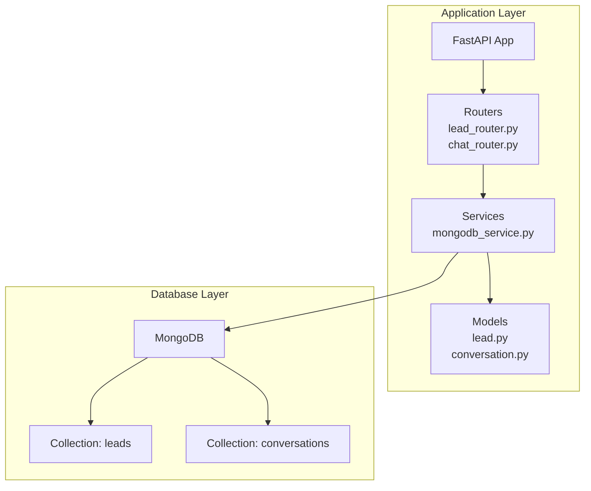
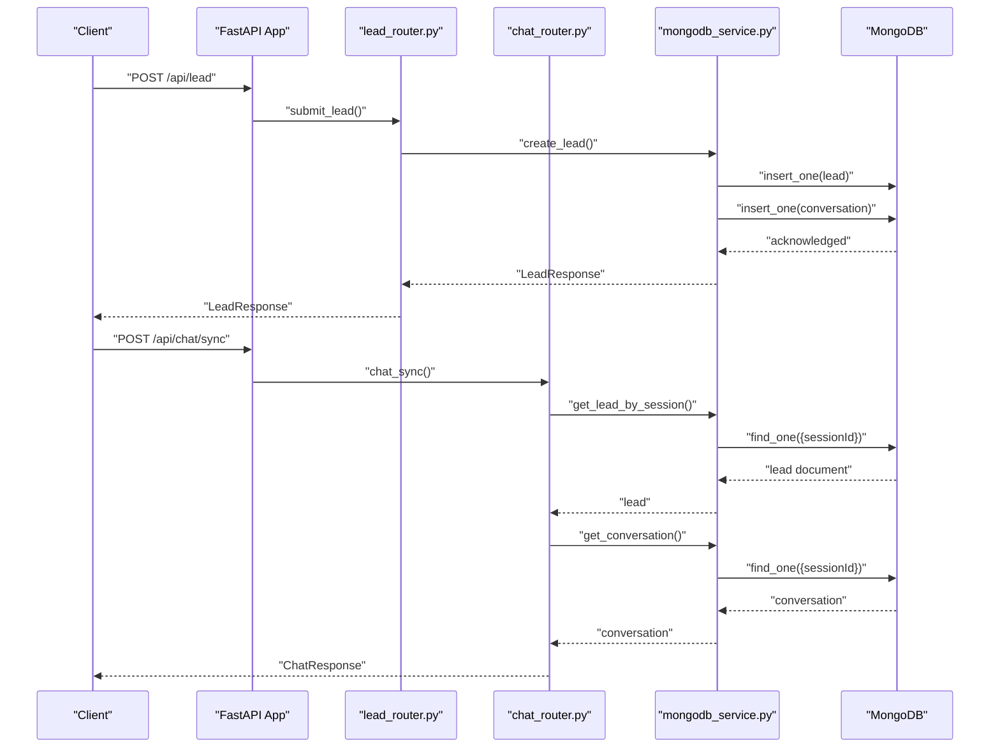
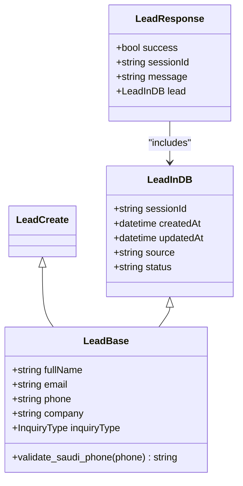
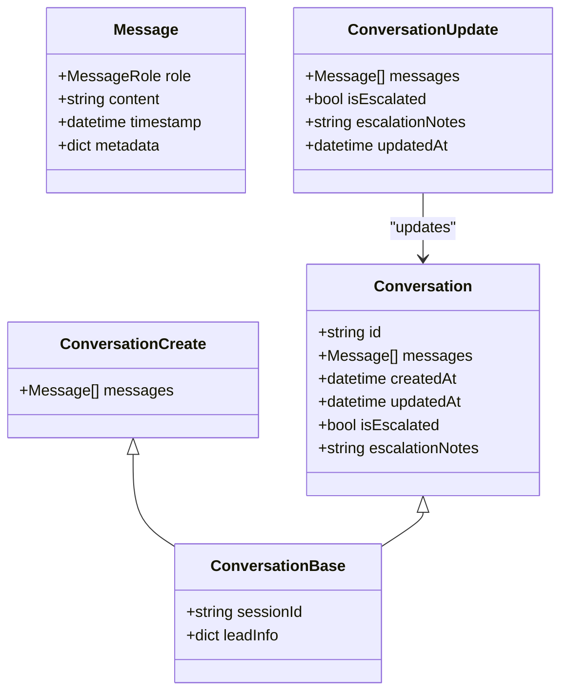
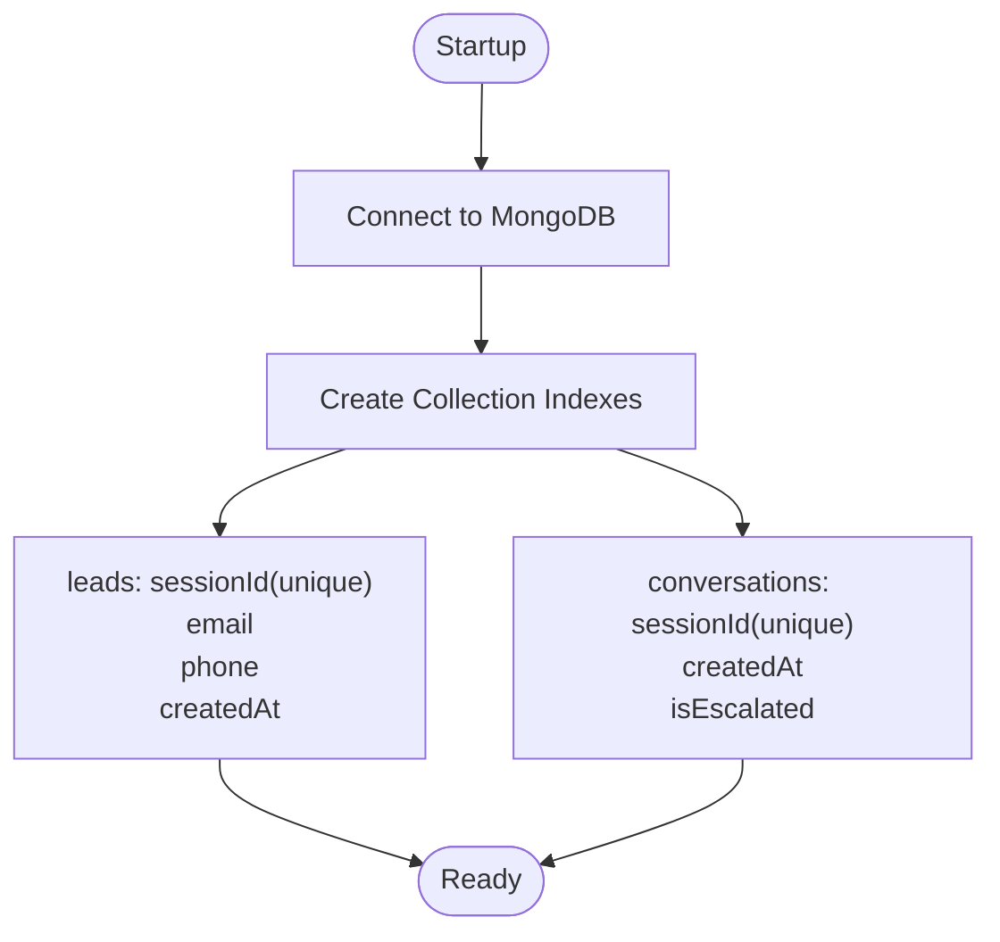
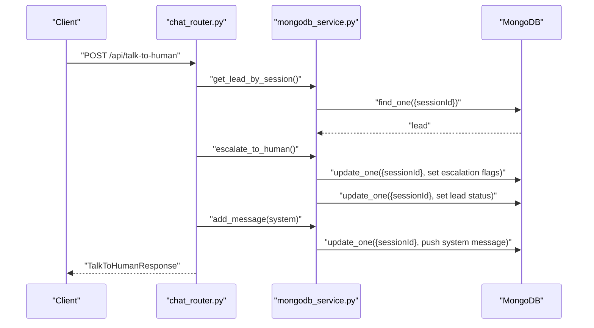
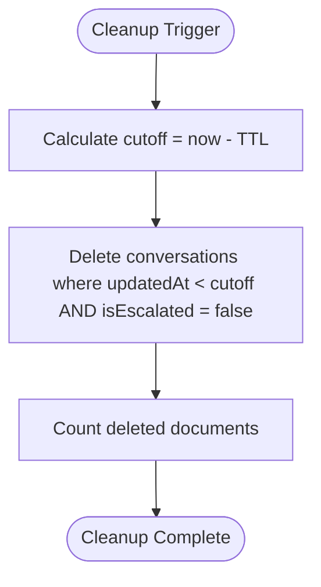
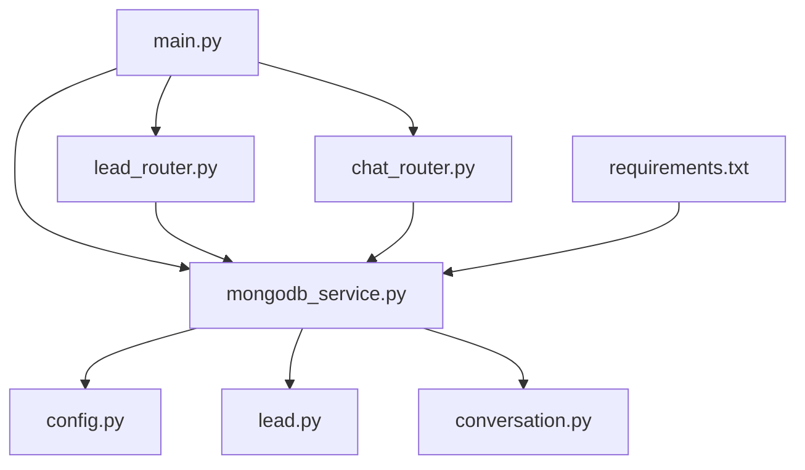

# Database Design

<cite>
**Referenced Files in This Document**
- [lead.py](file://backend/app/models/lead.py)
- [conversation.py](file://backend/app/models/conversation.py)
- [mongodb_service.py](file://backend/app/services/mongodb_service.py)
- [config.py](file://backend/app/config.py)
- [main.py](file://backend/app/main.py)
- [lead_router.py](file://backend/app/routers/lead_router.py)
- [chat_router.py](file://backend/app/routers/chat_router.py)
- [requirements.txt](file://backend/requirements.txt)
</cite>

## Table of Contents
1. [Introduction](#introduction)
2. [Project Structure](#project-structure)
3. [Core Components](#core-components)
4. [Architecture Overview](#architecture-overview)
5. [Detailed Component Analysis](#detailed-component-analysis)
6. [Dependency Analysis](#dependency-analysis)
7. [Performance Considerations](#performance-considerations)
8. [Troubleshooting Guide](#troubleshooting-guide)
9. [Conclusion](#conclusion)
10. [Appendices](#appendices)

## Introduction
This document describes the MongoDB database design for the Hitech RAG Chatbot. It focuses on the data models for leads and conversations, their relationships, field definitions, and data types. It also documents indexing strategies, query patterns, data lifecycle management, retention policies, cleanup procedures, security considerations, backup and disaster recovery planning, and migration procedures for schema evolution.

## Project Structure
The database design is implemented using Pydantic models for data validation and Motor (async MongoDB driver) for database operations. The application connects to MongoDB during startup and creates indexes for optimal query performance. The lead and conversation models define the schema and constraints for storing customer information and chat histories.

**Diagram sources**
- [main.py:14-37](file://backend/app/main.py#L14-L37)
- [mongodb_service.py:13-48](file://backend/app/services/mongodb_service.py#L13-L48)
- [lead_router.py:11-56](file://backend/app/routers/lead_router.py#L11-L56)
- [chat_router.py:12-129](file://backend/app/routers/chat_router.py#L12-L129)

**Section sources**
- [main.py:14-37](file://backend/app/main.py#L14-L37)
- [mongodb_service.py:13-48](file://backend/app/services/mongodb_service.py#L13-L48)
- [lead_router.py:11-56](file://backend/app/routers/lead_router.py#L11-L56)
- [chat_router.py:12-129](file://backend/app/routers/chat_router.py#L12-L129)

## Core Components
This section defines the core entities and their fields, including validation rules and data types.

- Lead entity
  - Purpose: Capture customer information and session metadata for chat interactions.
  - Key fields:
    - fullName: string, validated for length and presence.
    - email: string, validated as an email address.
    - phone: string, validated for Saudi phone number formats.
    - company: optional string.
    - inquiryType: optional enumeration of predefined categories.
    - sessionId: string, unique per lead.
    - createdAt: datetime, auto-generated on creation.
    - updatedAt: optional datetime, auto-updated on modifications.
    - source: string, defaults to chat widget.
    - status: string, defaults to new.

- Conversation entity
  - Purpose: Store message history and metadata for a given session.
  - Key fields:
    - sessionId: string, links to a lead session.
    - leadInfo: optional snapshot of lead information.
    - messages: array of message objects with:
      - role: enumeration (user, assistant, system).
      - content: string, validated for minimum length.
      - timestamp: datetime, auto-generated per message.
      - metadata: optional dictionary for additional attributes.
    - createdAt: datetime, auto-generated on creation.
    - updatedAt: datetime, auto-generated on updates.
    - isEscalated: boolean flag indicating escalation to human.
    - escalationNotes: optional string for escalation notes.

**Section sources**
- [lead.py:18-64](file://backend/app/models/lead.py#L18-L64)
- [conversation.py:15-53](file://backend/app/models/conversation.py#L15-L53)

## Architecture Overview
The application initializes database connections at startup and creates indexes for efficient lookups. The lead router handles lead submissions and session creation, while the chat router manages conversation operations and escalation.

**Diagram sources**
- [main.py:14-37](file://backend/app/main.py#L14-L37)
- [lead_router.py:11-56](file://backend/app/routers/lead_router.py#L11-L56)
- [chat_router.py:12-129](file://backend/app/routers/chat_router.py#L12-L129)
- [mongodb_service.py:51-133](file://backend/app/services/mongodb_service.py#L51-L133)

## Detailed Component Analysis

### Lead Schema
The lead schema captures customer information and session identifiers. It enforces phone number validation for Saudi formats and includes metadata for source and status tracking.

**Diagram sources**
- [lead.py:18-64](file://backend/app/models/lead.py#L18-L64)

Key validations and constraints:
- fullName: required, length bounds enforced.
- email: required, validated as email.
- phone: required, validated against Saudi formats (+9665xxxx, 9665xxxx, 05xxxx).
- inquiryType: optional enumeration with predefined values.
- sessionId: generated per lead creation and used as primary key for linking conversations.

**Section sources**
- [lead.py:18-64](file://backend/app/models/lead.py#L18-L64)

### Conversation Schema
The conversation schema stores message arrays with roles, timestamps, and optional metadata. It also tracks escalation state and associated lead information.

**Diagram sources**
- [conversation.py:15-53](file://backend/app/models/conversation.py#L15-L53)

Message structure and roles:
- role: enumeration with values user, assistant, system.
- content: required, minimum length enforced.
- timestamp: automatically set per message insertion.
- metadata: optional dictionary for additional attributes.

**Section sources**
- [conversation.py:15-53](file://backend/app/models/conversation.py#L15-L53)

### Indexing Strategy
Indexes are created during service initialization to optimize frequent queries.

- leads collection
  - sessionId: unique index for fast session-based lookups.
  - email: index for email-based duplicate detection.
  - phone: index for phone-based lookups.
  - createdAt: index for time-based queries and cleanup.

- conversations collection
  - sessionId: unique index for fast session-based lookups.
  - createdAt: index for time-based queries and pagination.
  - isEscalated: index for filtering escalated conversations.

**Diagram sources**
- [mongodb_service.py:21-48](file://backend/app/services/mongodb_service.py#L21-L48)

**Section sources**
- [mongodb_service.py:21-48](file://backend/app/services/mongodb_service.py#L21-L48)

### Query Patterns and Data Access Methods
Common operations and their query patterns:

- Lead operations
  - Create lead: insert a new lead document and initialize an empty conversation.
  - Get lead by session: find by sessionId.
  - Get lead by email: find by email to detect duplicates.
  - Update lead: update fields with updatedAt timestamp.

- Conversation operations
  - Create conversation: insert a new conversation document linked to a sessionId.
  - Get conversation: find by sessionId.
  - Add message: push a message into the messages array and update updatedAt.
  - Get conversation history: retrieve recent messages up to a configured limit.
  - Get conversation context: format recent messages into a context string.
  - Escalate to human: mark isEscalated true, add escalation notes, and update lead status.

**Diagram sources**
- [chat_router.py:58-117](file://backend/app/routers/chat_router.py#L58-L117)
- [mongodb_service.py:161-180](file://backend/app/services/mongodb_service.py#L161-L180)

**Section sources**
- [lead_router.py:11-56](file://backend/app/routers/lead_router.py#L11-L56)
- [chat_router.py:12-129](file://backend/app/routers/chat_router.py#L12-L129)
- [mongodb_service.py:51-180](file://backend/app/services/mongodb_service.py#L51-L180)

### Data Lifecycle Management and Retention Policies
The application includes a cleanup mechanism for expired sessions.

- Expiration policy
  - Sessions older than a configurable threshold (default 24 hours) are eligible for cleanup.
  - Cleanup applies only to non-escalated conversations to preserve human-assisted interactions.

- Cleanup procedure
  - Delete conversations where updatedAt is older than the cutoff and isEscalated is false.
  - Return the count of deleted documents.

**Diagram sources**
- [mongodb_service.py:182-192](file://backend/app/services/mongodb_service.py#L182-L192)

**Section sources**
- [mongodb_service.py:182-192](file://backend/app/services/mongodb_service.py#L182-L192)
- [config.py:37-40](file://backend/app/config.py#L37-L40)

### Security Considerations
- Environment-driven configuration
  - MongoDB URI and database name are loaded from environment variables via settings.
  - This prevents credentials from being hardcoded in the repository.

- Validation and sanitization
  - Phone numbers are validated against Saudi formats.
  - Emails are validated as email addresses.
  - Content fields enforce minimum lengths to reduce noise.

- Access control
  - The application does not implement database-level access control; rely on network-level controls and secure deployment practices.

**Section sources**
- [config.py:15-17](file://backend/app/config.py#L15-L17)
- [lead.py:26-38](file://backend/app/models/lead.py#L26-L38)

### Backup and Disaster Recovery Planning
- Backup strategy
  - Use MongoDB native tools (mongodump/mongorestore) or cloud provider backups.
  - Schedule periodic backups of the leads and conversations collections.
  - Maintain offsite copies of backups.

- Recovery procedures
  - Restore from the latest backup and verify connectivity.
  - Recreate indexes if necessary after restore.
  - Validate application health endpoints.

- Monitoring
  - Monitor database connectivity and health endpoints.
  - Track cleanup operations and their impact.

**Section sources**
- [main.py:74-83](file://backend/app/main.py#L74-L83)

### Migration Procedures and Version Management
- Schema evolution
  - Use explicit migrations to alter collections and indexes.
  - Back up data before applying migrations.
  - Test migrations in staging environments.

- Index changes
  - Drop and recreate indexes when schema changes require new indexes.
  - Ensure downtime windows are scheduled for index rebuilds.

- Versioning
  - Track schema versions in application settings or a dedicated migration table.
  - Apply migrations on startup or via a separate migration script.

[No sources needed since this section provides general guidance]

## Dependency Analysis
The application depends on Motor for asynchronous MongoDB operations and Pydantic models for data validation. The main application lifecycle manages database connection and disconnection.

**Diagram sources**
- [main.py:14-37](file://backend/app/main.py#L14-L37)
- [config.py:7-52](file://backend/app/config.py#L7-L52)
- [mongodb_service.py:13-20](file://backend/app/services/mongodb_service.py#L13-L20)
- [requirements.txt:8-10](file://backend/requirements.txt#L8-L10)

**Section sources**
- [main.py:14-37](file://backend/app/main.py#L14-L37)
- [config.py:7-52](file://backend/app/config.py#L7-L52)
- [mongodb_service.py:13-20](file://backend/app/services/mongodb_service.py#L13-L20)
- [requirements.txt:8-10](file://backend/requirements.txt#L8-L10)

## Performance Considerations
- Index selection
  - Unique indexes on sessionId ensure fast lookups and prevent duplicates.
  - Compound indexes can be considered for frequent composite queries (e.g., sessionId + createdAt).

- Query patterns
  - Use projection to limit fields returned for read-heavy operations.
  - Paginate conversation history using array slicing and createdAt sorting.

- Write patterns
  - Batch operations where possible to reduce round trips.
  - Use atomic updates for message pushes to maintain consistency.

- Caching
  - Cache frequently accessed lead and conversation metadata in memory for short TTLs.

[No sources needed since this section provides general guidance]

## Troubleshooting Guide
- Connection issues
  - Verify MONGODB_URI and MONGODB_DB_NAME in environment variables.
  - Check application health endpoint for MongoDB connectivity status.

- Index errors
  - Recreate indexes if they become corrupted or missing.
  - Ensure unique constraints are respected when inserting leads.

- Cleanup anomalies
  - Confirm TTL settings and verify cleanup job execution logs.
  - Manually inspect documents older than the cutoff to diagnose issues.

**Section sources**
- [config.py:15-17](file://backend/app/config.py#L15-L17)
- [main.py:74-83](file://backend/app/main.py#L74-L83)
- [mongodb_service.py:36-48](file://backend/app/services/mongodb_service.py#L36-L48)
- [mongodb_service.py:182-192](file://backend/app/services/mongodb_service.py#L182-L192)

## Conclusion
The MongoDB design for the Hitech RAG Chatbot centers on two collections: leads and conversations. The schema enforces strong validation for customer data and message content, while indexes optimize common query patterns. The application’s lifecycle manages database connections and includes a cleanup mechanism for expired sessions. Security is addressed through environment-driven configuration and input validation. Backup, recovery, and migration procedures should be integrated into operational workflows to ensure data integrity and availability.

## Appendices

### Sample Data Examples
- Lead document example
  - Fields: sessionId, fullName, email, phone, company, inquiryType, createdAt, source, status.
  - Notes: inquiryType is an enum value; source defaults to chat widget; status defaults to new.

- Conversation document example
  - Fields: sessionId, leadInfo, messages, createdAt, updatedAt, isEscalated, escalationNotes.
  - Messages array contains objects with role, content, timestamp, and optional metadata.

[No sources needed since this section provides general guidance]