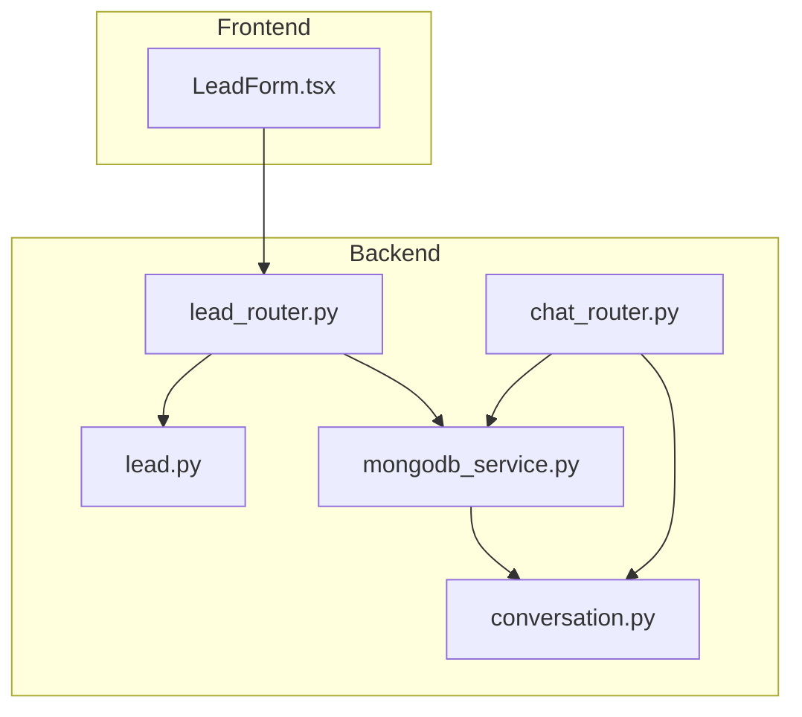
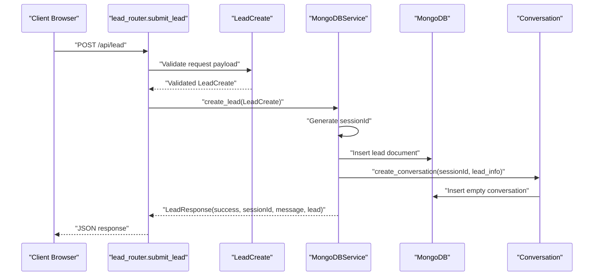
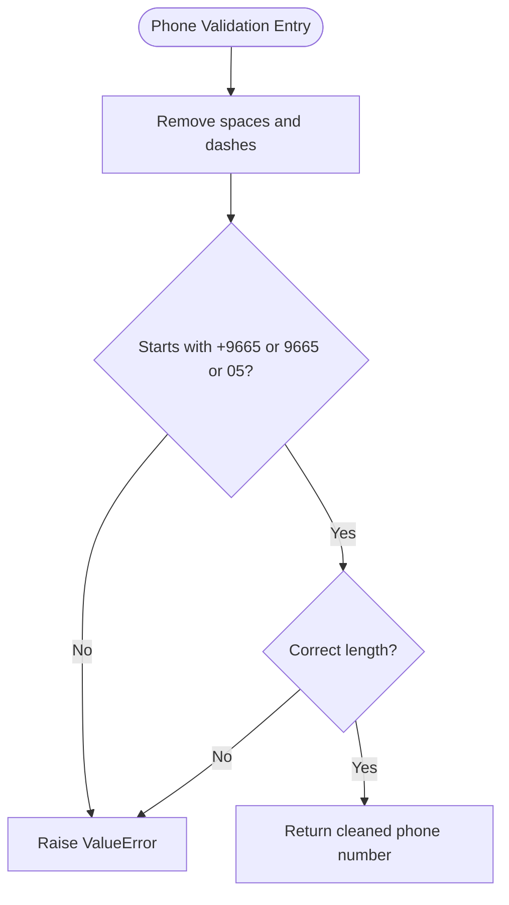
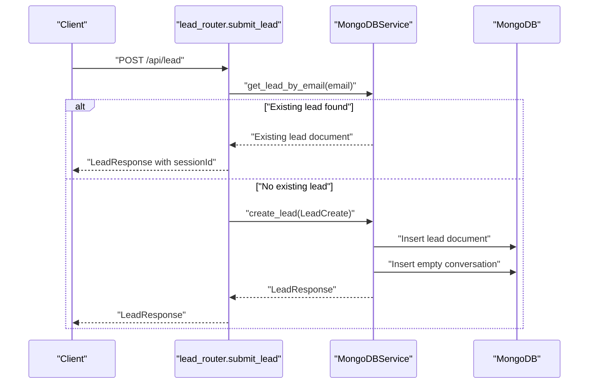
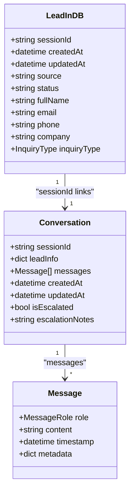
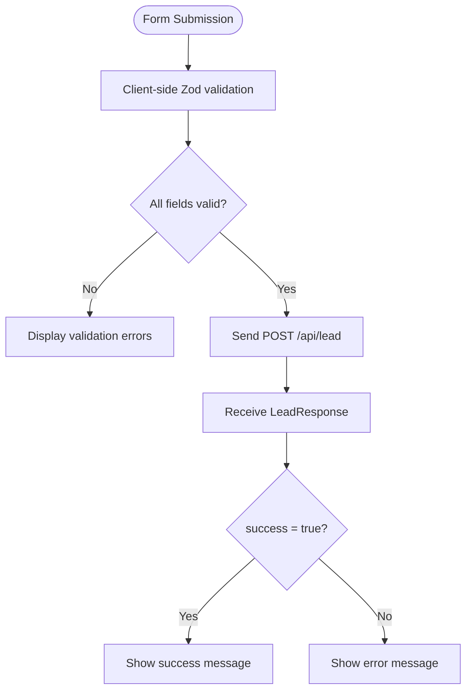
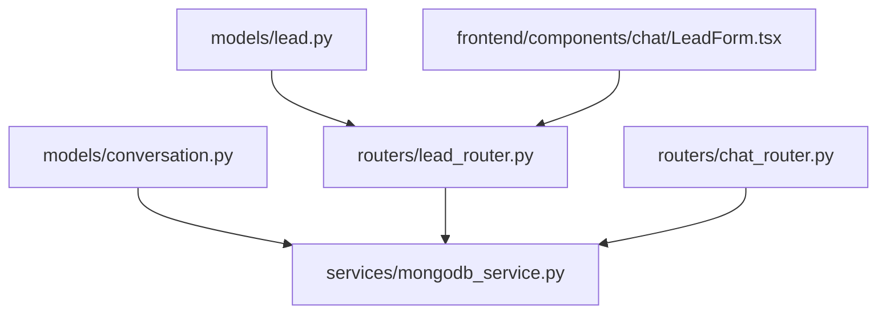

# Lead Collection Schema

<cite>
**Referenced Files in This Document**
- [lead.py](file://backend/app/models/lead.py)
- [lead_router.py](file://backend/app/routers/lead_router.py)
- [mongodb_service.py](file://backend/app/services/mongodb_service.py)
- [conversation.py](file://backend/app/models/conversation.py)
- [chat_router.py](file://backend/app/routers/chat_router.py)
- [LeadForm.tsx](file://frontend/components/chat/LeadForm.tsx)
</cite>

## Table of Contents
1. [Introduction](#introduction)
2. [Project Structure](#project-structure)
3. [Core Components](#core-components)
4. [Architecture Overview](#architecture-overview)
5. [Detailed Component Analysis](#detailed-component-analysis)
6. [Dependency Analysis](#dependency-analysis)
7. [Performance Considerations](#performance-considerations)
8. [Troubleshooting Guide](#troubleshooting-guide)
9. [Conclusion](#conclusion)

## Introduction
This document provides comprehensive technical documentation for the Lead collection schema implementation in the chatbot system. It explains the LeadInDB model structure, field definitions, validation rules, constraints, and operational workflows. It covers customer information fields (fullName, email, phone), Saudi phone number validation logic, session management fields (sessionId, createdAt, updatedAt), metadata fields (source, status), and their roles in conversation tracking. The document also includes concrete examples from the codebase, common validation errors and solutions, and the relationships between leads and conversation documents.

## Project Structure
The Lead schema is implemented across backend models, routers, and services, with frontend form validation that mirrors backend constraints. The key components are:
- Backend models define the LeadInDB schema and related enums.
- Backend routers handle lead submission and retrieval.
- MongoDB service manages database operations, indexes, and session persistence.
- Frontend form validates user input before submission.
- Conversation models and chat router integrate leads with persistent conversations.

**Diagram sources**
- [lead_router.py:11-56](file://backend/app/routers/lead_router.py#L11-L56)
- [lead.py:18-64](file://backend/app/models/lead.py#L18-L64)
- [conversation.py:15-53](file://backend/app/models/conversation.py#L15-L53)
- [mongodb_service.py:51-111](file://backend/app/services/mongodb_service.py#L51-L111)
- [chat_router.py:12-130](file://backend/app/routers/chat_router.py#L12-L130)
- [LeadForm.tsx:13-19](file://frontend/components/chat/LeadForm.tsx#L13-L19)

**Section sources**
- [lead_router.py:1-57](file://backend/app/routers/lead_router.py#L1-L57)
- [lead.py:1-64](file://backend/app/models/lead.py#L1-L64)
- [mongodb_service.py:1-202](file://backend/app/services/mongodb_service.py#L1-L202)
- [conversation.py:1-53](file://backend/app/models/conversation.py#L1-L53)
- [chat_router.py:1-130](file://backend/app/routers/chat_router.py#L1-L130)
- [LeadForm.tsx:1-168](file://frontend/components/chat/LeadForm.tsx#L1-L168)

## Core Components
This section documents the LeadInDB model and related components, including field definitions, validation rules, and constraints.

- LeadBase: Defines customer information fields and validation constraints.
  - fullName: String, min length 2, max length 100.
  - email: EmailStr validated by Pydantic.
  - phone: String, min length 10, max length 20, with Saudi phone number validator.
  - company: Optional string, max length 100.
  - inquiryType: Optional enum with predefined values.

- LeadInDB: Extends LeadBase with database-stored fields.
  - sessionId: String, unique identifier for session persistence.
  - createdAt: DateTime, defaults to UTC now.
  - updatedAt: Optional DateTime.
  - source: String, default "chat_widget".
  - status: String, default "new".

- LeadCreate: Lightweight model for creating leads (no database-specific fields).

- LeadResponse: Response model for lead submission, including success flag, sessionId, message, and optional lead data.

- Saudi Phone Number Validation:
  - Acceptable formats: +966 5xxxxxxxx, +9665xxxxxxxx, 9665xxxxxxxx, 05xxxxxxxx.
  - The validator cleans spaces and dashes, then checks prefix and length conditions.

- Indexes and Persistence:
  - MongoDB indexes on sessionId (unique), email, phone, createdAt for leads.
  - MongoDB indexes on sessionId (unique), createdAt, isEscalated for conversations.
  - On lead creation, a session ID is generated and a corresponding empty conversation is initialized.

**Section sources**
- [lead.py:18-64](file://backend/app/models/lead.py#L18-L64)
- [mongodb_service.py:36-48](file://backend/app/services/mongodb_service.py#L36-L48)
- [mongodb_service.py:51-77](file://backend/app/services/mongodb_service.py#L51-L77)

## Architecture Overview
The lead lifecycle spans frontend validation, backend routing, model validation, and MongoDB persistence. Upon successful lead submission, a session ID is created and associated with an empty conversation document. Subsequent chat interactions rely on this session ID to track conversation history and escalate to human agents when necessary.

**Diagram sources**
- [lead_router.py:11-44](file://backend/app/routers/lead_router.py#L11-L44)
- [lead.py:41-43](file://backend/app/models/lead.py#L41-L43)
- [mongodb_service.py:51-77](file://backend/app/services/mongodb_service.py#L51-L77)
- [mongodb_service.py:98-111](file://backend/app/services/mongodb_service.py#L98-L111)

## Detailed Component Analysis

### LeadInDB Model and Validation
The LeadInDB model defines the schema for storing leads in MongoDB. It inherits customer information fields from LeadBase and adds session and metadata fields. The model enforces:
- Customer fields: fullName, email, phone, company, inquiryType.
- Session fields: sessionId (unique), createdAt, updatedAt.
- Metadata fields: source, status.

Validation rules:
- fullName: Length constraints enforced by Pydantic Field.
- email: EmailStr validation ensures RFC-compliant email format.
- phone: Custom validator enforces Saudi phone number format and length.
- company: Optional string with max length.
- inquiryType: Optional enum with predefined values.

Saudi phone number validation logic:
- Removes spaces and dashes.
- Accepts formats: +966 5xxxxxxxx (+13 digits), +9665xxxxxxxx (+12 digits), 9665xxxxxxxx (+12 digits), 05xxxxxxxx (+10 digits).
- Raises a ValueError with a descriptive message if the format is invalid.

**Diagram sources**
- [lead.py:26-38](file://backend/app/models/lead.py#L26-L38)

**Section sources**
- [lead.py:18-64](file://backend/app/models/lead.py#L18-L64)

### Lead Submission Workflow
The lead submission endpoint orchestrates validation, deduplication by email, session creation, and conversation initialization.

Key steps:
- Validate incoming LeadCreate payload using FastAPI and Pydantic.
- Check for existing lead with the same email and active session.
- If existing lead is found, return the sessionId and a welcome-back message.
- Otherwise, create a new lead with a generated sessionId, set source and status, insert into leads collection, and initialize an empty conversation.

**Diagram sources**
- [lead_router.py:24-38](file://backend/app/routers/lead_router.py#L24-L38)
- [mongodb_service.py:51-77](file://backend/app/services/mongodb_service.py#L51-L77)

**Section sources**
- [lead_router.py:11-44](file://backend/app/routers/lead_router.py#L11-L44)
- [mongodb_service.py:51-77](file://backend/app/services/mongodb_service.py#L51-L77)

### Session Management and Conversation Tracking
Session management is central to conversation tracking. The sessionId links leads to conversations and enables:
- Persistent conversation history retrieval.
- Human escalation tracking via the isEscalated flag.
- Timestamp updates for activity tracking.

MongoDB indexes support efficient session lookups:
- Unique index on sessionId for leads and conversations.
- Additional indexes on email, phone, createdAt for leads.
- Indexes on createdAt and isEscalated for conversations.

Conversation lifecycle:
- Creation: An empty conversation is inserted with sessionId, leadInfo snapshot, and timestamps.
- Updates: Messages are appended to the conversation, and updatedAt is refreshed.
- Escalation: Mark isEscalated true and store escalation notes; also update lead status to "escalated".

**Diagram sources**
- [lead.py:46-52](file://backend/app/models/lead.py#L46-L52)
- [conversation.py:23-53](file://backend/app/models/conversation.py#L23-L53)

**Section sources**
- [mongodb_service.py:36-48](file://backend/app/services/mongodb_service.py#L36-L48)
- [mongodb_service.py:98-111](file://backend/app/services/mongodb_service.py#L98-L111)
- [mongodb_service.py:161-180](file://backend/app/services/mongodb_service.py#L161-L180)

### Frontend Form Validation and User Experience
The frontend LeadForm component enforces client-side validation that mirrors backend constraints:
- fullName: Minimum 2 characters.
- email: RFC-compliant email format.
- phone: Regex pattern matching Saudi phone number formats.
- company: Optional string.
- inquiryType: Optional selection from predefined options.

On successful submission, the form displays a success message and initiates the backend lead creation process.

**Diagram sources**
- [LeadForm.tsx:13-19](file://frontend/components/chat/LeadForm.tsx#L13-L19)
- [LeadForm.tsx:39-42](file://frontend/components/chat/LeadForm.tsx#L39-L42)

**Section sources**
- [LeadForm.tsx:13-19](file://frontend/components/chat/LeadForm.tsx#L13-L19)
- [LeadForm.tsx:39-56](file://frontend/components/chat/LeadForm.tsx#L39-L56)

## Dependency Analysis
The system exhibits clear separation of concerns:
- Models define schemas and validation rules.
- Routers orchestrate requests and responses.
- Services encapsulate database operations and business logic.
- Frontend forms mirror backend validation to reduce server load.

**Diagram sources**
- [lead.py:18-64](file://backend/app/models/lead.py#L18-L64)
- [lead_router.py:11-56](file://backend/app/routers/lead_router.py#L11-L56)
- [conversation.py:15-53](file://backend/app/models/conversation.py#L15-L53)
- [mongodb_service.py:51-111](file://backend/app/services/mongodb_service.py#L51-L111)
- [chat_router.py:12-130](file://backend/app/routers/chat_router.py#L12-L130)
- [LeadForm.tsx:13-19](file://frontend/components/chat/LeadForm.tsx#L13-L19)

**Section sources**
- [lead.py:18-64](file://backend/app/models/lead.py#L18-L64)
- [lead_router.py:11-56](file://backend/app/routers/lead_router.py#L11-L56)
- [conversation.py:15-53](file://backend/app/models/conversation.py#L15-L53)
- [mongodb_service.py:51-111](file://backend/app/services/mongodb_service.py#L51-L111)
- [chat_router.py:12-130](file://backend/app/routers/chat_router.py#L12-L130)
- [LeadForm.tsx:13-19](file://frontend/components/chat/LeadForm.tsx#L13-L19)

## Performance Considerations
- Indexes: Unique indexes on sessionId ensure fast lookups and prevent duplicates. Additional indexes on email, phone, and createdAt improve query performance for lead searches and analytics.
- Concurrency: MongoDB operations are asynchronous, minimizing blocking during lead creation and conversation updates.
- Cleanup: The cleanup_expired_sessions method removes stale non-escalated conversations to control database growth.
- Validation: Client-side validation reduces unnecessary server requests and improves user experience.

[No sources needed since this section provides general guidance]

## Troubleshooting Guide
Common validation errors and solutions:

- Invalid Saudi phone number:
  - Symptom: ValueError indicating incorrect format.
  - Cause: Phone number does not match accepted formats (+966 5xxxxxxxx, +9665xxxxxxxx, 9665xxxxxxxx, 05xxxxxxxx).
  - Solution: Ensure the phone number uses one of the accepted formats and remove spaces/dashes if present.

- Email already exists with active session:
  - Symptom: LeadResponse returns existing sessionId and a welcome-back message.
  - Cause: Duplicate email detected.
  - Solution: Use the returned sessionId to continue the existing conversation.

- Session not found during chat:
  - Symptom: HTTP 404 error indicating session not found.
  - Cause: Missing or invalid sessionId.
  - Solution: Submit the lead form first to create a session.

- Escalation failure:
  - Symptom: HTTP 500 error when escalating to human.
  - Cause: Conversation not found or database update failed.
  - Solution: Verify sessionId and retry; ensure conversation exists.

**Section sources**
- [lead.py:26-38](file://backend/app/models/lead.py#L26-L38)
- [lead_router.py:25-34](file://backend/app/routers/lead_router.py#L25-L34)
- [chat_router.py:29-34](file://backend/app/routers/chat_router.py#L29-L34)
- [mongodb_service.py:161-180](file://backend/app/services/mongodb_service.py#L161-L180)

## Conclusion
The Lead collection schema integrates robust validation, session management, and conversation persistence. The LeadInDB model enforces strong constraints on customer information and metadata, while the Saudi phone number validator ensures format compliance. MongoDB indexes and unique sessionId fields enable efficient session tracking and conversation management. The frontend form validation complements backend rules to deliver a smooth user experience. Together, these components form a reliable foundation for lead capture and ongoing customer engagement.