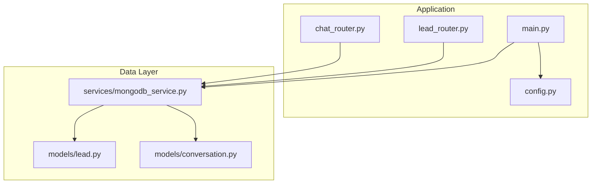
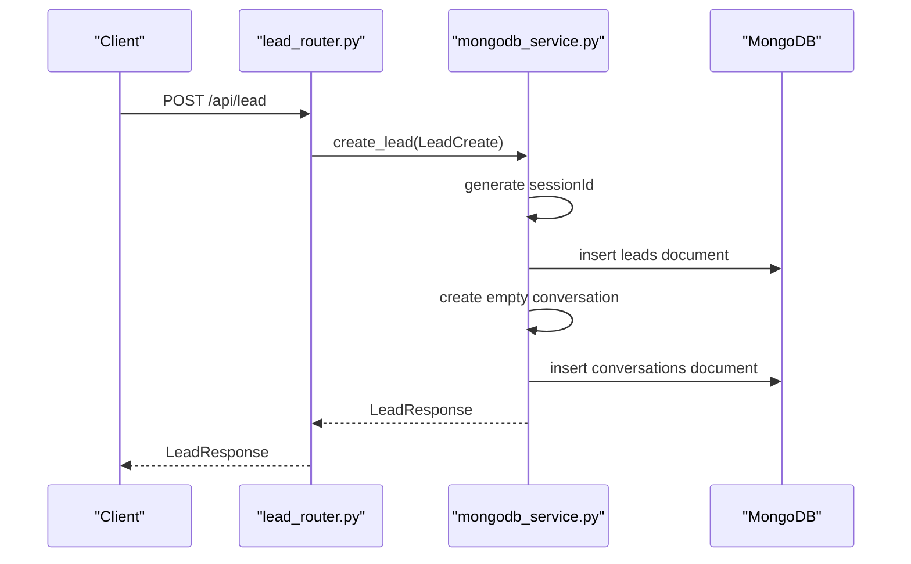
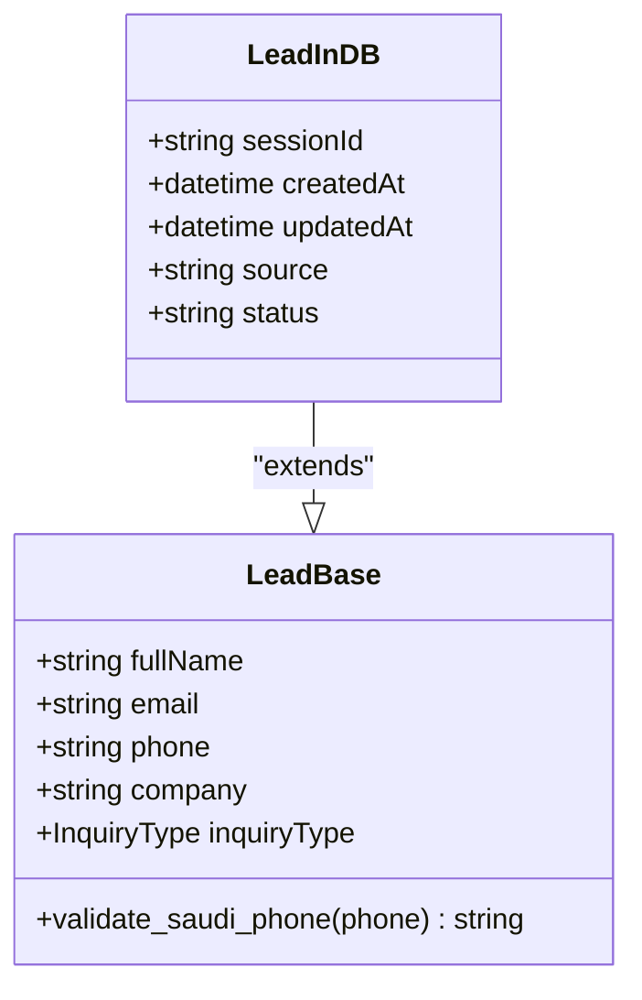
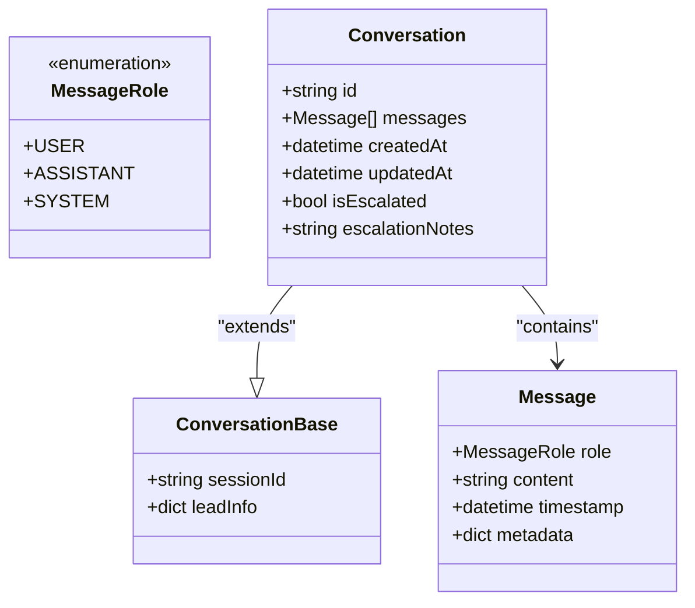
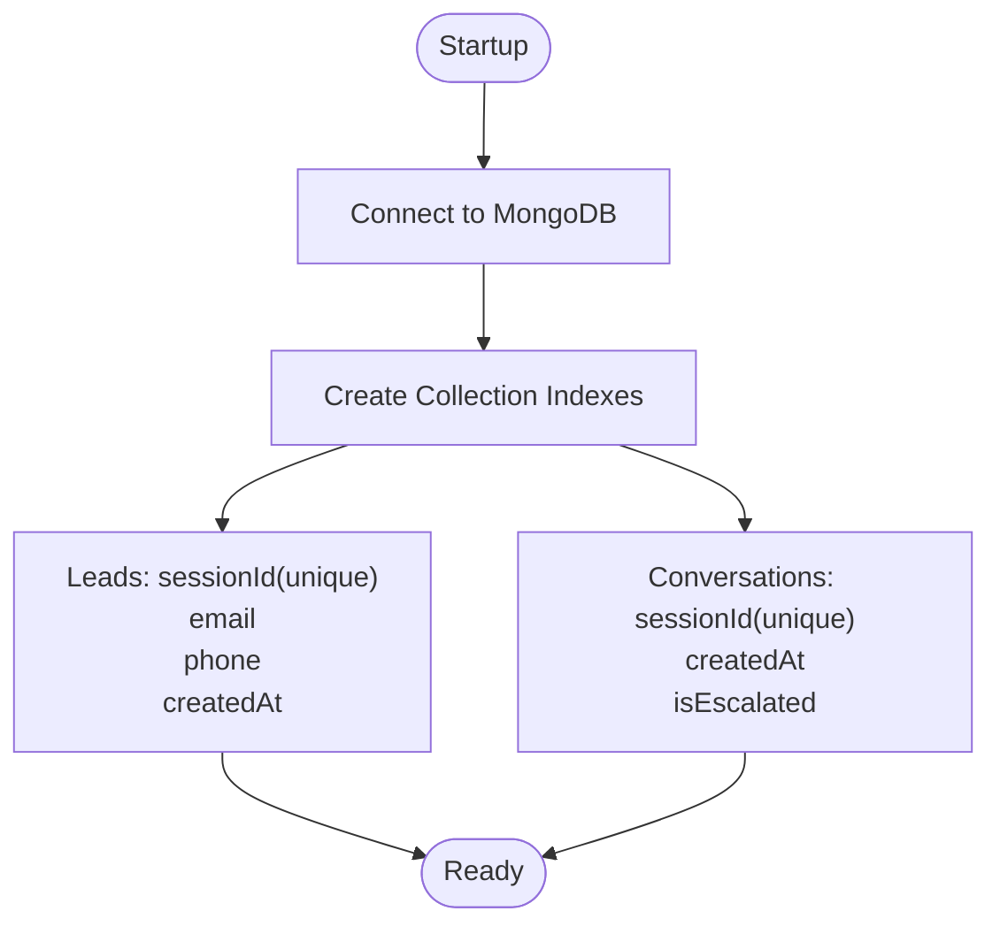
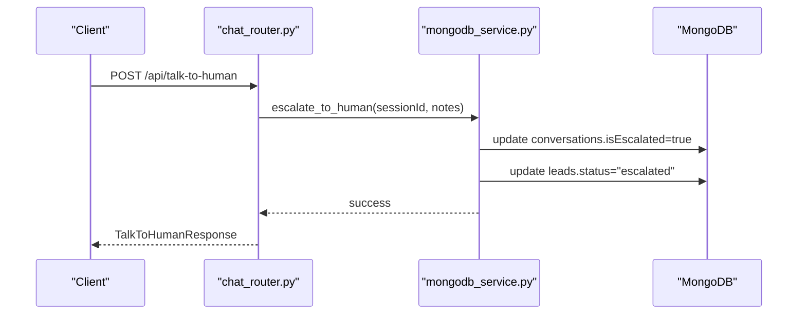
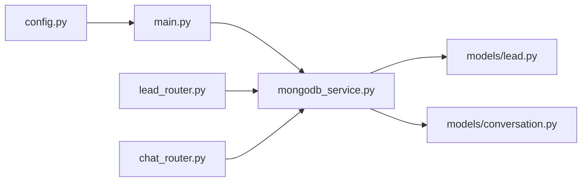
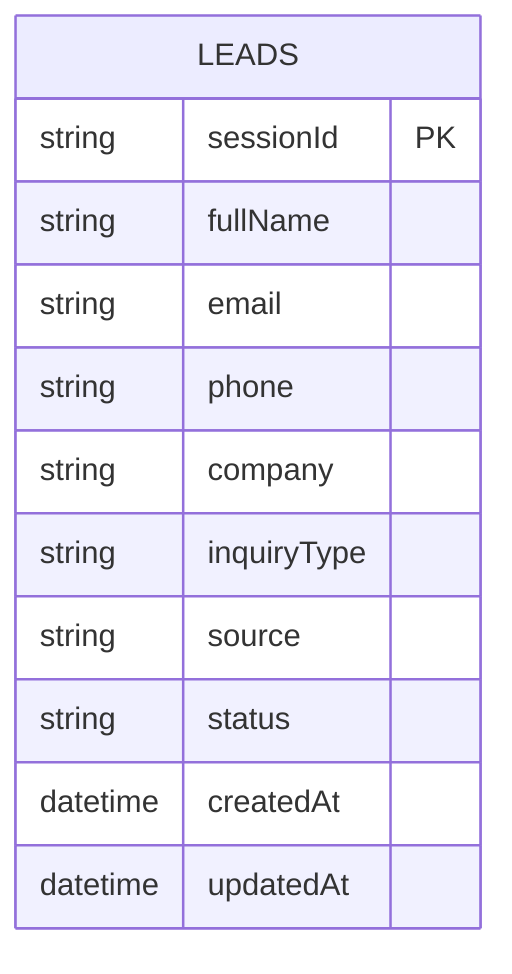
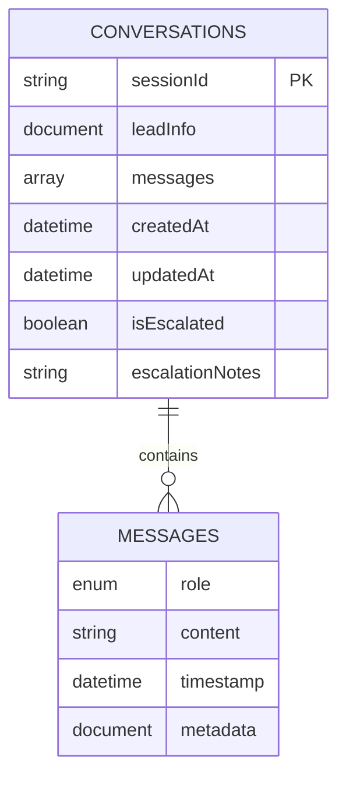

# MongoDB Schema Design

<cite>
**Referenced Files in This Document**
- [lead.py](file://backend/app/models/lead.py)
- [conversation.py](file://backend/app/models/conversation.py)
- [mongodb_service.py](file://backend/app/services/mongodb_service.py)
- [config.py](file://backend/app/config.py)
- [lead_router.py](file://backend/app/routers/lead_router.py)
- [chat_router.py](file://backend/app/routers/chat_router.py)
- [main.py](file://backend/app/main.py)
</cite>

## Table of Contents
1. [Introduction](#introduction)
2. [Project Structure](#project-structure)
3. [Core Components](#core-components)
4. [Architecture Overview](#architecture-overview)
5. [Detailed Component Analysis](#detailed-component-analysis)
6. [Dependency Analysis](#dependency-analysis)
7. [Performance Considerations](#performance-considerations)
8. [Troubleshooting Guide](#troubleshooting-guide)
9. [Conclusion](#conclusion)
10. [Appendices](#appendices)

## Introduction
This document provides comprehensive data model documentation for the MongoDB schema design used by the chatbot application. It focuses on the two primary collections: leads and conversations. The document details schemas, field definitions, data types, validation rules, indexing strategy, query patterns, data lifecycle management, and operational considerations such as security, backups, and disaster recovery.

## Project Structure
The MongoDB schema is implemented through Pydantic models and a dedicated MongoDB service. The application connects to MongoDB during startup and creates indexes for optimal query performance. The routers orchestrate requests and delegate persistence operations to the MongoDB service.

**Diagram sources**
- [main.py:14-36](file://backend/app/main.py#L14-L36)
- [lead_router.py:11-56](file://backend/app/routers/lead_router.py#L11-L56)
- [chat_router.py:12-129](file://backend/app/routers/chat_router.py#L12-L129)
- [mongodb_service.py:21-48](file://backend/app/services/mongodb_service.py#L21-L48)
- [config.py:15-18](file://backend/app/config.py#L15-L18)

**Section sources**
- [main.py:14-36](file://backend/app/main.py#L14-L36)
- [config.py:15-18](file://backend/app/config.py#L15-L18)

## Core Components
This section defines the core data models and their intended storage in MongoDB.

- LeadInDB schema
  - Purpose: Persist customer lead information and session metadata.
  - Key fields:
    - sessionId: Unique session identifier (string)
    - fullName: Customer full name (string)
    - email: Customer email (string)
    - phone: Saudi phone number (string)
    - company: Company name (string, optional)
    - inquiryType: Enumerated inquiry type (string)
    - source: Lead source (string)
    - status: Lead status (string)
    - createdAt: Timestamp of creation (datetime)
    - updatedAt: Timestamp of last update (datetime, optional)
  - Validation rules:
    - Phone number validated for Saudi formats (+966 5xxxxxxxx, 9665xxxxxxxx, 05xxxxxxxx)
    - Name length between 2 and 100 characters
    - Email validated as an email address
    - Optional fields may be null

- Conversation schema
  - Purpose: Store message threads associated with a lead session.
  - Key fields:
    - sessionId: Unique session identifier (string)
    - leadInfo: Snapshot of lead information (document)
    - messages: Array of message objects
      - role: Role enum (user, assistant, system)
      - content: Message content (string)
      - timestamp: Message timestamp (datetime)
      - metadata: Additional message metadata (document, optional)
    - createdAt: Conversation creation timestamp (datetime)
    - updatedAt: Last update timestamp (datetime)
    - isEscalated: Escalation flag (boolean)
    - escalationNotes: Notes from escalation (string, optional)
  - Validation rules:
    - Messages require role and content
    - Timestamp defaults to current UTC
    - Metadata is optional

**Section sources**
- [lead.py:18-56](file://backend/app/models/lead.py#L18-L56)
- [conversation.py:15-44](file://backend/app/models/conversation.py#L15-L44)

## Architecture Overview
The application initializes MongoDB connectivity at startup, creates indexes, and exposes endpoints to manage leads and conversations. The MongoDB service encapsulates CRUD operations and maintains session consistency.

**Diagram sources**
- [lead_router.py:11-38](file://backend/app/routers/lead_router.py#L11-L38)
- [mongodb_service.py:51-77](file://backend/app/services/mongodb_service.py#L51-L77)

**Section sources**
- [main.py:21-22](file://backend/app/main.py#L21-L22)
- [mongodb_service.py:21-28](file://backend/app/services/mongodb_service.py#L21-L28)

## Detailed Component Analysis

### LeadInDB Schema
The LeadInDB model defines the persisted structure for leads. It extends the base lead fields with session identifiers, timestamps, and metadata.

**Diagram sources**
- [lead.py:18-56](file://backend/app/models/lead.py#L18-L56)

Key characteristics:
- Unique session identifier ensures one conversation per lead session.
- Timestamps support audit trails and lifecycle management.
- Status and source fields enable analytics and routing.

Validation highlights:
- Phone number normalization and format validation.
- Email and name constraints enforced at model level.

**Section sources**
- [lead.py:18-56](file://backend/app/models/lead.py#L18-L56)

### Conversation Schema
The conversation model stores message threads with roles and timestamps, enabling contextual retrieval and escalation tracking.

**Diagram sources**
- [conversation.py:8-44](file://backend/app/models/conversation.py#L8-L44)

Message structure:
- Role-driven categorization for context formatting.
- Content length constraints and timestamp defaults.
- Optional metadata for extensibility.

Escalation tracking:
- isEscalated flag and escalationNotes support human-agent handoff.
- Automatic lead status updates when escalated.

**Section sources**
- [conversation.py:15-44](file://backend/app/models/conversation.py#L15-L44)

### Indexing Strategy
Indexes are created at startup to optimize frequent queries and enforce uniqueness where needed.

- Leads collection
  - sessionId: unique
  - email
  - phone
  - createdAt

- Conversations collection
  - sessionId: unique
  - createdAt
  - isEscalated

**Diagram sources**
- [mongodb_service.py:36-48](file://backend/app/services/mongodb_service.py#L36-L48)

**Section sources**
- [mongodb_service.py:36-48](file://backend/app/services/mongodb_service.py#L36-L48)

### Query Patterns and Data Access Methods
Common operations and their patterns:

- Lead operations
  - Create lead: generate sessionId, persist lead, initialize conversation.
  - Retrieve lead by sessionId or email.
  - Update lead metadata with updatedAt timestamp.

- Conversation operations
  - Create conversation for a sessionId.
  - Retrieve conversation by sessionId.
  - Append message to messages array with updatedAt.
  - Fetch recent messages with configurable limit.
  - Format conversation context string for RAG.
  - Escalate conversation and update lead status.

**Diagram sources**
- [chat_router.py:58-117](file://backend/app/routers/chat_router.py#L58-L117)
- [mongodb_service.py:161-180](file://backend/app/services/mongodb_service.py#L161-L180)

**Section sources**
- [mongodb_service.py:51-94](file://backend/app/services/mongodb_service.py#L51-L94)
- [mongodb_service.py:98-160](file://backend/app/services/mongodb_service.py#L98-L160)
- [mongodb_service.py:161-192](file://backend/app/services/mongodb_service.py#L161-L192)

### Data Lifecycle Management
- Session TTL: Controlled by configuration for session expiration.
- Cleanup procedure: Delete conversations older than cutoff and not escalated.
- Session initialization: Each lead creation triggers an empty conversation.

Operational notes:
- Expiration threshold is configurable via settings.
- Cleanup runs as a maintenance operation (e.g., cron job).

**Section sources**
- [config.py:38-39](file://backend/app/config.py#L38-L39)
- [mongodb_service.py:182-192](file://backend/app/services/mongodb_service.py#L182-L192)

## Dependency Analysis
The application’s data layer depends on configuration for MongoDB connection and on routers for request orchestration.

**Diagram sources**
- [config.py:15-18](file://backend/app/config.py#L15-L18)
- [main.py:21-22](file://backend/app/main.py#L21-L22)
- [lead_router.py:14](file://backend/app/routers/lead_router.py#L14)
- [chat_router.py:16](file://backend/app/routers/chat_router.py#L16)

**Section sources**
- [main.py:21-22](file://backend/app/main.py#L21-L22)
- [lead_router.py:14](file://backend/app/routers/lead_router.py#L14)
- [chat_router.py:16](file://backend/app/routers/chat_router.py#L16)

## Performance Considerations
- Index coverage
  - sessionId unique index ensures referential integrity and efficient lookups.
  - Secondary indexes on email, phone, createdAt improve search and analytics.
- Write patterns
  - Upserts and array push operations are used for message appending.
  - updatedAt timestamps support recency-based queries.
- Query limits
  - Recent message retrieval uses array slicing to limit payload size.
- Scalability
  - Consider sharding by sessionId for high-volume deployments.
  - Monitor index sizes and query plans regularly.

[No sources needed since this section provides general guidance]

## Troubleshooting Guide
- Connection issues
  - Verify MONGODB_URI and MONGODB_DB_NAME in configuration.
  - Confirm MongoDB service availability and network reachability.
- Index errors
  - Ensure indexes are created at startup; re-run initialization if missing.
- Session not found
  - Validate sessionId passed by clients; ensure lead creation precedes chat.
- Escalation failures
  - Confirm conversation exists and is not already escalated.
  - Check updatedAt timestamps and metadata propagation.

**Section sources**
- [config.py:15-18](file://backend/app/config.py#L15-L18)
- [mongodb_service.py:21-28](file://backend/app/services/mongodb_service.py#L21-L28)
- [lead_router.py:28-34](file://backend/app/routers/lead_router.py#L28-L34)
- [chat_router.py:36-44](file://backend/app/routers/chat_router.py#L36-L44)

## Conclusion
The MongoDB schema design centers on two collections—leads and conversations—each optimized for their primary use cases. The LeadInDB model captures customer and session metadata with robust validation, while the conversation model preserves message context with role-based categorization and escalation tracking. Indexes and operational procedures ensure performance and maintainability. The design supports secure, scalable deployment with clear pathways for monitoring, backups, and disaster recovery.

[No sources needed since this section summarizes without analyzing specific files]

## Appendices

### Data Model Diagrams

#### Leads Collection Schema

**Diagram sources**
- [lead.py:46-56](file://backend/app/models/lead.py#L46-L56)

#### Conversations Collection Schema

**Diagram sources**
- [conversation.py:23-44](file://backend/app/models/conversation.py#L23-L44)
- [conversation.py:15-21](file://backend/app/models/conversation.py#L15-L21)

### Operational Configuration References
- MongoDB connection settings
  - MONGODB_URI: Connection string for MongoDB
  - MONGODB_DB_NAME: Target database name
- Session and conversation limits
  - SESSION_TTL_HOURS: Session expiration window
  - MAX_CONVERSATION_HISTORY: Default message retrieval limit

**Section sources**
- [config.py:15-18](file://backend/app/config.py#L15-L18)
- [config.py:38-39](file://backend/app/config.py#L38-L39)