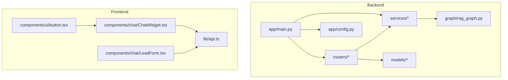
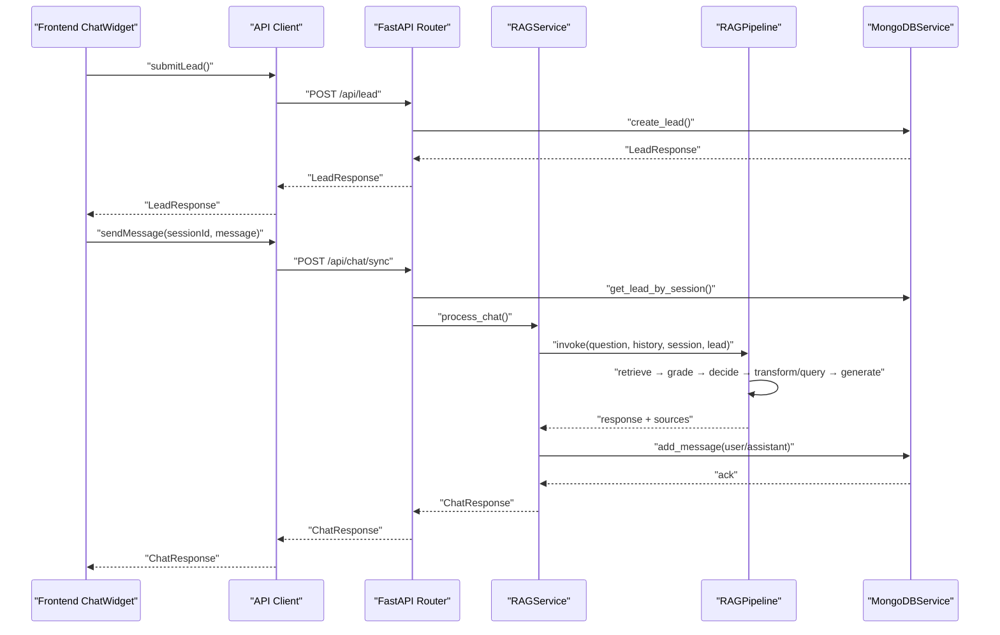
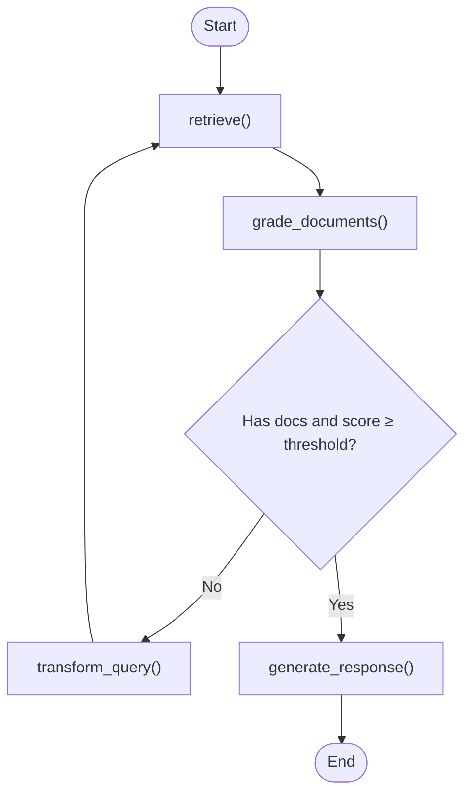
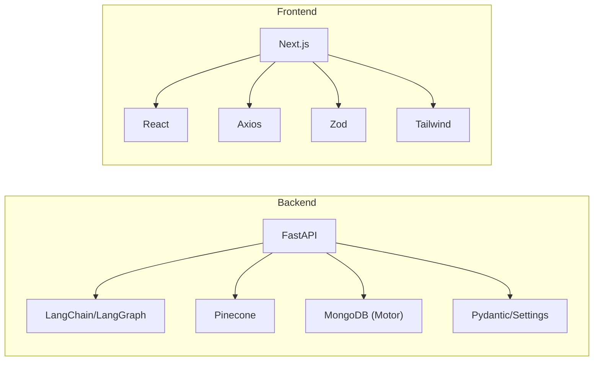

# Coding Standards

<cite>
**Referenced Files in This Document**
- [backend/app/main.py](file://backend/app/main.py)
- [backend/app/graph/rag_graph.py](file://backend/app/graph/rag_graph.py)
- [backend/app/services/rag_service.py](file://backend/app/services/rag_service.py)
- [backend/app/routers/chat_router.py](file://backend/app/routers/chat_router.py)
- [backend/app/routers/lead_router.py](file://backend/app/routers/lead_router.py)
- [backend/app/models/chat.py](file://backend/app/models/chat.py)
- [backend/app/models/lead.py](file://backend/app/models/lead.py)
- [backend/app/services/mongodb_service.py](file://backend/app/services/mongodb_service.py)
- [backend/app/config.py](file://backend/app/config.py)
- [backend/requirements.txt](file://backend/requirements.txt)
- [frontend/lib/api.ts](file://frontend/lib/api.ts)
- [frontend/components/chat/ChatWidget.tsx](file://frontend/components/chat/ChatWidget.tsx)
- [frontend/components/chat/LeadForm.tsx](file://frontend/components/chat/LeadForm.tsx)
- [frontend/components/ui/button.tsx](file://frontend/components/ui/button.tsx)
- [frontend/eslint.config.mjs](file://frontend/eslint.config.mjs)
- [frontend/tsconfig.json](file://frontend/tsconfig.json)
- [frontend/package.json](file://frontend/package.json)
</cite>

## Table of Contents
1. [Introduction](#introduction)
2. [Project Structure](#project-structure)
3. [Core Components](#core-components)
4. [Architecture Overview](#architecture-overview)
5. [Detailed Component Analysis](#detailed-component-analysis)
6. [Dependency Analysis](#dependency-analysis)
7. [Performance Considerations](#performance-considerations)
8. [Troubleshooting Guide](#troubleshooting-guide)
9. [Conclusion](#conclusion)
10. [Appendices](#appendices)

## Introduction
This document defines coding standards for the Hitech RAG Chatbot project across the Python backend and TypeScript/Next.js frontend. It establishes conventions for naming, formatting, imports, comments, error handling, logging, and security. It also outlines service-layer architecture, FastAPI patterns, LangGraph usage, and React component patterns to ensure consistency across the full-stack application.

## Project Structure
The project follows a clear separation of concerns:
- Backend: FastAPI application with routers, services, models, and a LangGraph pipeline.
- Frontend: Next.js application with React components, UI primitives, and an API client.

**Diagram sources**
- [backend/app/main.py:1-90](file://backend/app/main.py#L1-L90)
- [backend/app/config.py:1-65](file://backend/app/config.py#L1-L65)
- [backend/app/graph/rag_graph.py:1-264](file://backend/app/graph/rag_graph.py#L1-L264)
- [backend/app/routers/chat_router.py:1-130](file://backend/app/routers/chat_router.py#L1-L130)
- [backend/app/routers/lead_router.py:1-57](file://backend/app/routers/lead_router.py#L1-L57)
- [backend/app/services/mongodb_service.py:1-202](file://backend/app/services/mongodb_service.py#L1-L202)
- [frontend/lib/api.ts:1-93](file://frontend/lib/api.ts#L1-L93)
- [frontend/components/chat/ChatWidget.tsx:1-307](file://frontend/components/chat/ChatWidget.tsx#L1-L307)
- [frontend/components/chat/LeadForm.tsx:1-168](file://frontend/components/chat/LeadForm.tsx#L1-L168)
- [frontend/components/ui/button.tsx:1-57](file://frontend/components/ui/button.tsx#L1-L57)

**Section sources**
- [backend/app/main.py:1-90](file://backend/app/main.py#L1-L90)
- [frontend/lib/api.ts:1-93](file://frontend/lib/api.ts#L1-L93)

## Core Components
- Backend FastAPI application with lifespan-managed service initialization and CORS configuration.
- LangGraph pipeline encapsulated in a class with typed state and modular nodes.
- Service layer with dependency injection via global singletons and FastAPI Depends.
- Pydantic models for request/response validation and typed enums for domain concepts.
- MongoDB service with async operations, indexes, and session lifecycle management.
- Frontend API client with typed requests/responses and centralized error handling.
- React components with controlled state, TypeScript props, and Tailwind-based UI primitives.

**Section sources**
- [backend/app/main.py:14-89](file://backend/app/main.py#L14-L89)
- [backend/app/graph/rag_graph.py:15-264](file://backend/app/graph/rag_graph.py#L15-L264)
- [backend/app/services/rag_service.py:11-116](file://backend/app/services/rag_service.py#L11-L116)
- [backend/app/models/chat.py:7-45](file://backend/app/models/chat.py#L7-L45)
- [backend/app/models/lead.py:8-64](file://backend/app/models/lead.py#L8-L64)
- [backend/app/services/mongodb_service.py:13-202](file://backend/app/services/mongodb_service.py#L13-L202)
- [frontend/lib/api.ts:1-93](file://frontend/lib/api.ts#L1-L93)
- [frontend/components/chat/ChatWidget.tsx:1-307](file://frontend/components/chat/ChatWidget.tsx#L1-L307)

## Architecture Overview
High-level flow:
- Frontend widgets collect lead information and messages.
- Backend validates sessions, orchestrates RAG, persists messages, and returns responses.
- LangGraph manages retrieval, filtering, query transformation, and generation.

**Diagram sources**
- [frontend/components/chat/ChatWidget.tsx:84-142](file://frontend/components/chat/ChatWidget.tsx#L84-L142)
- [frontend/lib/api.ts:61-85](file://frontend/lib/api.ts#L61-L85)
- [backend/app/routers/lead_router.py:11-44](file://backend/app/routers/lead_router.py#L11-L44)
- [backend/app/routers/chat_router.py:12-56](file://backend/app/routers/chat_router.py#L12-L56)
- [backend/app/services/rag_service.py:19-87](file://backend/app/services/rag_service.py#L19-L87)
- [backend/app/graph/rag_graph.py:40-251](file://backend/app/graph/rag_graph.py#L40-L251)
- [backend/app/services/mongodb_service.py:51-133](file://backend/app/services/mongodb_service.py#L51-L133)

## Detailed Component Analysis

### Backend: FastAPI Application and Lifespan
- Use a lifespan manager to initialize services at startup and clean up on shutdown.
- Configure CORS for widget embedding scenarios.
- Centralized router inclusion and health checks.

Best practices:
- Keep startup/shutdown logic minimal and robust.
- Use environment-driven settings for origins and service endpoints.
- Expose a health endpoint that reports service connectivity.

**Section sources**
- [backend/app/main.py:14-89](file://backend/app/main.py#L14-L89)
- [backend/app/config.py:46-58](file://backend/app/config.py#L46-L58)

### Backend: LangGraph RAG Pipeline
- Define a TypedDict state with explicit keys for question, generation, documents, history, session, lead info, and retries.
- Encapsulate the pipeline in a class with a builder method that adds nodes and edges.
- Implement modular nodes: retrieve, grade, generate, transform query.
- Use a conditional edge to decide between generating or transforming the query.
- Apply similarity thresholds and top-K retrieval from Pinecone.

Guidelines:
- Keep node functions pure and stateless where possible.
- Validate inputs and guard against empty states.
- Limit context size and sources to improve performance and relevance.

**Diagram sources**
- [backend/app/graph/rag_graph.py:40-121](file://backend/app/graph/rag_graph.py#L40-L121)
- [backend/app/graph/rag_graph.py:150-219](file://backend/app/graph/rag_graph.py#L150-L219)

**Section sources**
- [backend/app/graph/rag_graph.py:15-264](file://backend/app/graph/rag_graph.py#L15-L264)

### Backend: Service Layer Architecture
- RAGService orchestrates MongoDB history retrieval, invokes the RAG pipeline, persists messages, and formats responses.
- MongoDBService encapsulates async operations, indexing, and session cleanup.
- Use dependency injection via global singletons and FastAPI Depends for testability and modularity.

Patterns:
- One service per domain capability.
- Return Pydantic models for consistent serialization.
- Propagate exceptions as HTTP exceptions with meaningful messages.

**Section sources**
- [backend/app/services/rag_service.py:11-116](file://backend/app/services/rag_service.py#L11-L116)
- [backend/app/services/mongodb_service.py:13-202](file://backend/app/services/mongodb_service.py#L13-L202)

### Backend: Routers and Error Handling
- Chat router handles synchronous chat, escalation to human, and conversation retrieval.
- Lead router manages lead creation and lookup.
- Centralized exception handling converts internal errors to HTTP exceptions.

Standards:
- Validate session existence and escalation state before processing.
- Return structured responses aligned with Pydantic models.
- Use appropriate HTTP status codes and consistent error payloads.

**Section sources**
- [backend/app/routers/chat_router.py:12-130](file://backend/app/routers/chat_router.py#L12-L130)
- [backend/app/routers/lead_router.py:11-57](file://backend/app/routers/lead_router.py#L11-L57)

### Backend: Models and Validation
- Pydantic models define request/response contracts with field constraints and descriptions.
- Enums represent fixed sets of values (e.g., inquiry types).
- Use optional fields where applicable and defaults for non-sensitive fields.

Standards:
- Keep models close to their usage (routers/services).
- Prefer enums for categorical data.
- Validate at boundaries (routers/services) and rely on models for serialization.

**Section sources**
- [backend/app/models/chat.py:7-45](file://backend/app/models/chat.py#L7-L45)
- [backend/app/models/lead.py:8-64](file://backend/app/models/lead.py#L8-L64)

### Frontend: API Client and Types
- Axios-based client with base URL from environment.
- Strongly typed request/response interfaces.
- Exported functions for each endpoint with clear signatures.

Standards:
- Centralize API calls in a single module.
- Use environment variables for base URLs.
- Return raw data from axios and parse with typed interfaces.

**Section sources**
- [frontend/lib/api.ts:1-93](file://frontend/lib/api.ts#L1-L93)

### Frontend: Chat Widget and Components
- ChatWidget manages session persistence, lead submission, message lifecycle, and escalation.
- LeadForm uses Zod for validation and react-hook-form for UX.
- UI components follow a design system with variants and sizes.

Patterns:
- Controlled components with explicit props and callbacks.
- Persist session data with TTL and handle loading states.
- Provide fallback UI and error messaging.

**Section sources**
- [frontend/components/chat/ChatWidget.tsx:27-307](file://frontend/components/chat/ChatWidget.tsx#L27-L307)
- [frontend/components/chat/LeadForm.tsx:28-168](file://frontend/components/chat/LeadForm.tsx#L28-L168)
- [frontend/components/ui/button.tsx:1-57](file://frontend/components/ui/button.tsx#L1-L57)

## Dependency Analysis
- Backend dependencies include FastAPI, LangGraph, Pinecone, MongoDB (Motor), and Pydantic settings.
- Frontend dependencies include Next.js, React, Tailwind, Zod, and Axios.

**Diagram sources**
- [backend/requirements.txt:1-48](file://backend/requirements.txt#L1-L48)
- [frontend/package.json:11-35](file://frontend/package.json#L11-L35)

**Section sources**
- [backend/requirements.txt:1-48](file://backend/requirements.txt#L1-L48)
- [frontend/package.json:11-35](file://frontend/package.json#L11-L35)

## Performance Considerations
- Limit conversation history and top-K documents to reduce context size.
- Apply similarity thresholds to filter irrelevant results early.
- Use async I/O and connection pooling for MongoDB and Pinecone.
- Cache embeddings and LLM calls where feasible.
- Minimize DOM updates in React components; batch state changes.

## Troubleshooting Guide
Common issues and resolutions:
- Session not found: Ensure lead submission precedes chat requests; verify session ID storage and TTL.
- Health check failures: Confirm MongoDB URI and Pinecone credentials; check network connectivity.
- CORS errors: Verify allowed origins and credentials configuration.
- Escalation not working: Check MongoDB update operations and system message insertion.

Logging and error handling patterns:
- Log startup/shutdown events and service initialization outcomes.
- Convert internal exceptions to HTTP exceptions with descriptive messages.
- Frontend should surface user-friendly messages and avoid exposing stack traces.

**Section sources**
- [backend/app/main.py:18-36](file://backend/app/main.py#L18-L36)
- [backend/app/routers/chat_router.py:27-55](file://backend/app/routers/chat_router.py#L27-L55)
- [frontend/components/chat/ChatWidget.tsx:84-108](file://frontend/components/chat/ChatWidget.tsx#L84-L108)

## Conclusion
These standards unify development practices across the backend and frontend. By adhering to consistent naming, formatting, error handling, and architectural patterns, teams can maintain reliability, readability, and scalability of the Hitech RAG Chatbot.

## Appendices

### Naming Conventions
- Modules and packages: snake_case.
- Classes: PascalCase.
- Functions and variables: snake_case.
- Constants: UPPER_SNAKE_CASE.
- Pydantic models: PascalCase.
- TypeScript interfaces: PascalCase.
- Environment variables: UPPER_SNAKE_CASE.

**Section sources**
- [backend/app/config.py:7-64](file://backend/app/config.py#L7-L64)
- [backend/app/models/chat.py:7-45](file://backend/app/models/chat.py#L7-L45)
- [frontend/lib/api.ts:14-58](file://frontend/lib/api.ts#L14-L58)

### Code Formatting and Imports
- Python: follow PEP 8; organize imports in standard library, third-party, local groups.
- TypeScript/Next.js: use ESLint with Next.js recommended configs; keep imports grouped and sorted.
- TypeScript strict mode enabled; JSX runtime configured.

**Section sources**
- [frontend/eslint.config.mjs:1-19](file://frontend/eslint.config.mjs#L1-L19)
- [frontend/tsconfig.json:7-14](file://frontend/tsconfig.json#L7-L14)

### Comment Standards
- Module-level docstrings describe purpose and responsibilities.
- Function/class docstrings explain intent, parameters, and return values.
- Inline comments clarify complex logic; avoid redundant comments.

**Section sources**
- [backend/app/graph/rag_graph.py:1-264](file://backend/app/graph/rag_graph.py#L1-L264)
- [backend/app/services/rag_service.py:1-116](file://backend/app/services/rag_service.py#L1-L116)
- [frontend/lib/api.ts:1-93](file://frontend/lib/api.ts#L1-L93)

### Security Best Practices
- Store secrets in environment variables; avoid hardcoding credentials.
- Validate and sanitize inputs at boundaries.
- Enforce CORS policies; restrict origins appropriately.
- Use HTTPS in production; enforce secure cookies if applicable.
- Sanitize logs to prevent sensitive data exposure.

**Section sources**
- [backend/app/config.py:20-47](file://backend/app/config.py#L20-L47)
- [backend/app/main.py:50-57](file://backend/app/main.py#L50-L57)

### Example References
- Backend FastAPI app creation and lifespan: [backend/app/main.py:39-89](file://backend/app/main.py#L39-L89)
- LangGraph pipeline class and state: [backend/app/graph/rag_graph.py:26-70](file://backend/app/graph/rag_graph.py#L26-L70)
- RAG service orchestration: [backend/app/services/rag_service.py:19-87](file://backend/app/services/rag_service.py#L19-L87)
- Chat router endpoint: [backend/app/routers/chat_router.py:12-47](file://backend/app/routers/chat_router.py#L12-L47)
- Lead router endpoint: [backend/app/routers/lead_router.py:11-38](file://backend/app/routers/lead_router.py#L11-L38)
- MongoDB service operations: [backend/app/services/mongodb_service.py:51-133](file://backend/app/services/mongodb_service.py#L51-L133)
- Frontend API client: [frontend/lib/api.ts:61-90](file://frontend/lib/api.ts#L61-L90)
- Chat widget component: [frontend/components/chat/ChatWidget.tsx:84-142](file://frontend/components/chat/ChatWidget.tsx#L84-L142)