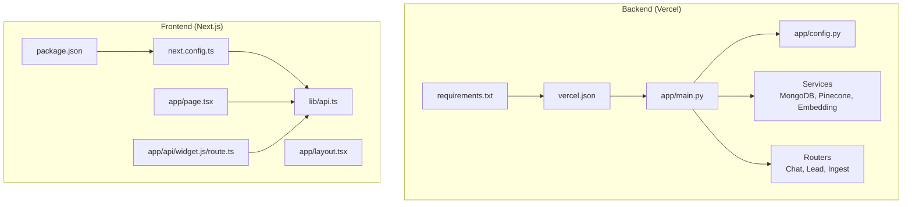
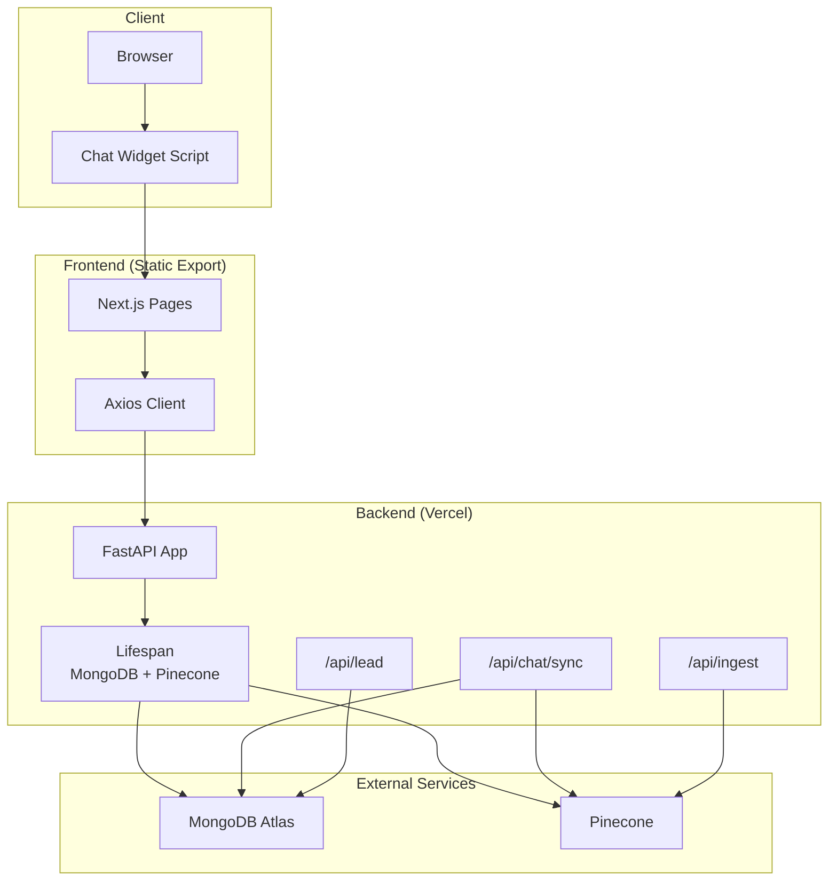
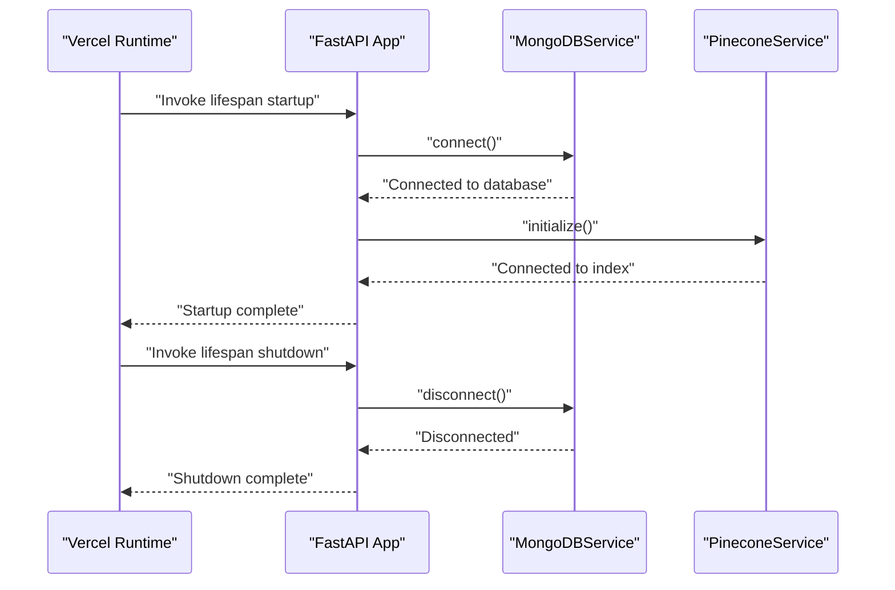
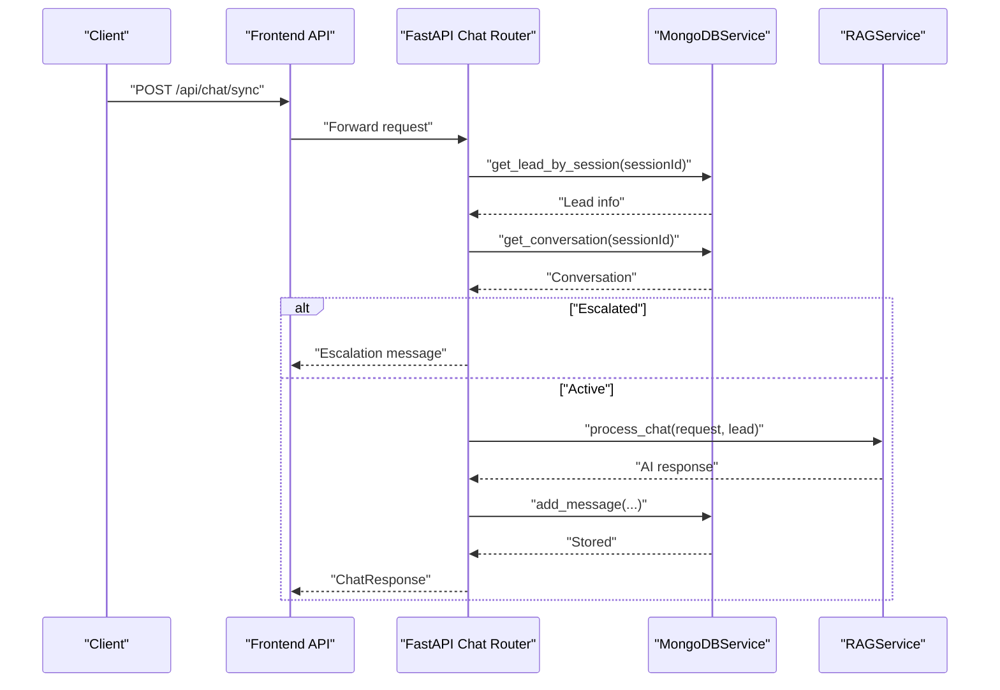
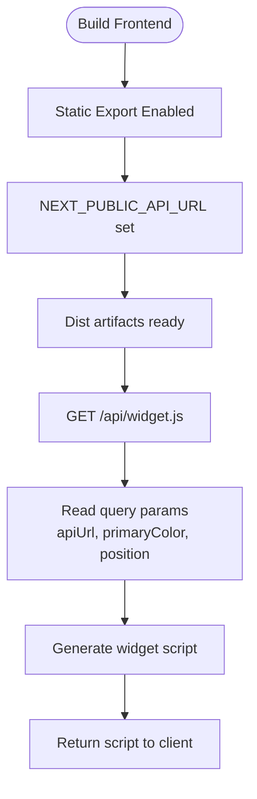
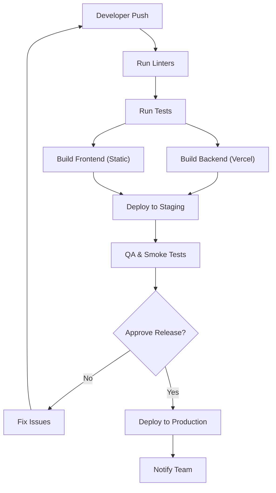

# Deployment Procedures

<cite>
**Referenced Files in This Document**
- [vercel.json](file://backend/vercel.json)
- [main.py](file://backend/app/main.py)
- [config.py](file://backend/app/config.py)
- [requirements.txt](file://backend/requirements.txt)
- [mongodb_service.py](file://backend/app/services/mongodb_service.py)
- [pinecone_service.py](file://backend/app/services/pinecone_service.py)
- [embedding_service.py](file://backend/app/services/embedding_service.py)
- [chat_router.py](file://backend/app/routers/chat_router.py)
- [lead_router.py](file://backend/app/routers/lead_router.py)
- [ingest_router.py](file://backend/app/routers/ingest_router.py)
- [package.json](file://frontend/package.json)
- [next.config.ts](file://frontend/next.config.ts)
- [layout.tsx](file://frontend/app/layout.tsx)
- [page.tsx](file://frontend/app/page.tsx)
- [api.ts](file://frontend/lib/api.ts)
- [route.ts](file://frontend/app/api/widget.js/route.ts)
</cite>

## Table of Contents
1. [Introduction](#introduction)
2. [Project Structure](#project-structure)
3. [Core Components](#core-components)
4. [Architecture Overview](#architecture-overview)
5. [Detailed Component Analysis](#detailed-component-analysis)
6. [Environment Configuration](#environment-configuration)
7. [Backend Deployment to Vercel](#backend-deployment-to-vercel)
8. [Frontend Deployment for Next.js](#frontend-deployment-for-nextjs)
9. [CI/CD Pipeline Setup](#cicd-pipeline-setup)
10. [Rollback Procedures](#rollback-procedures)
11. [Database Deployment Considerations](#database-deployment-considerations)
12. [Monitoring Setup](#monitoring-setup)
13. [Troubleshooting Guide](#troubleshooting-guide)
14. [Conclusion](#conclusion)

## Introduction
This document provides comprehensive deployment procedures for the Hitech RAG Chatbot, covering backend deployment to Vercel, frontend deployment for the Next.js application, environment configuration across development, staging, and production, database and vector store setup, CI/CD automation, rollback procedures, monitoring, and troubleshooting.

## Project Structure
The repository follows a clear separation of concerns:
- Backend: Python FastAPI application with Vercel serverless deployment configuration
- Frontend: Next.js 16 application with static export and serverless API routes
- Shared configuration and environment variables for both backend and frontend

**Diagram sources**
- [vercel.json:1-22](file://backend/vercel.json#L1-L22)
- [main.py:1-90](file://backend/app/main.py#L1-L90)
- [config.py:1-65](file://backend/app/config.py#L1-L65)
- [requirements.txt:1-48](file://backend/requirements.txt#L1-L48)
- [package.json:1-37](file://frontend/package.json#L1-L37)
- [next.config.ts:1-15](file://frontend/next.config.ts#L1-L15)
- [layout.tsx:1-20](file://frontend/app/layout.tsx#L1-L20)
- [page.tsx:1-12](file://frontend/app/page.tsx#L1-L12)
- [api.ts:1-92](file://frontend/lib/api.ts#L1-L92)
- [route.ts:1-44](file://frontend/app/api/widget.js/route.ts#L1-L44)

**Section sources**
- [vercel.json:1-22](file://backend/vercel.json#L1-L22)
- [main.py:1-90](file://backend/app/main.py#L1-L90)
- [config.py:1-65](file://backend/app/config.py#L1-L65)
- [requirements.txt:1-48](file://backend/requirements.txt#L1-L48)
- [package.json:1-37](file://frontend/package.json#L1-L37)
- [next.config.ts:1-15](file://frontend/next.config.ts#L1-L15)
- [layout.tsx:1-20](file://frontend/app/layout.tsx#L1-L20)
- [page.tsx:1-12](file://frontend/app/page.tsx#L1-L12)
- [api.ts:1-92](file://frontend/lib/api.ts#L1-L92)
- [route.ts:1-44](file://frontend/app/api/widget.js/route.ts#L1-L44)

## Core Components
- Backend FastAPI application initializes MongoDB and Pinecone during startup, exposes health checks, and defines routers for chat, lead, and ingestion.
- Environment variables are managed via Pydantic settings with defaults for local development and overrides for production.
- Frontend Next.js app uses static export, environment variables for API base URL, and a serverless route to generate the chat widget script.

Key deployment-relevant aspects:
- Backend uses a lifespan manager to connect to MongoDB and initialize Pinecone on startup.
- Frontend configuration exports static assets and reads NEXT_PUBLIC_API_URL for runtime API routing.
- Vercel build configuration targets the FastAPI entrypoint and sets Python path.

**Section sources**
- [main.py:14-37](file://backend/app/main.py#L14-L37)
- [config.py:7-64](file://backend/app/config.py#L7-L64)
- [next.config.ts:3-12](file://frontend/next.config.ts#L3-L12)
- [vercel.json:3-20](file://backend/vercel.json#L3-L20)

## Architecture Overview
The deployment architecture integrates the frontend and backend with external services:
- Frontend static site served via CDN with dynamic widget generation
- Backend serverless API on Vercel with persistent connections established at startup
- MongoDB Atlas for structured data storage
- Pinecone vector store for RAG embeddings

**Diagram sources**
- [main.py:14-37](file://backend/app/main.py#L14-L37)
- [chat_router.py:12-56](file://backend/app/routers/chat_router.py#L12-L56)
- [lead_router.py:11-44](file://backend/app/routers/lead_router.py#L11-L44)
- [ingest_router.py:26-73](file://backend/app/routers/ingest_router.py#L26-L73)
- [mongodb_service.py:21-34](file://backend/app/services/mongodb_service.py#L21-L34)
- [pinecone_service.py:27-55](file://backend/app/services/pinecone_service.py#L27-L55)

## Detailed Component Analysis

### Backend Application Lifecycle
The backend FastAPI app establishes connections to MongoDB and Pinecone during startup and disconnects gracefully on shutdown. Health checks expose service connectivity status.

**Diagram sources**
- [main.py:14-37](file://backend/app/main.py#L14-L37)
- [mongodb_service.py:21-34](file://backend/app/services/mongodb_service.py#L21-L34)
- [pinecone_service.py:27-55](file://backend/app/services/pinecone_service.py#L27-L55)

**Section sources**
- [main.py:14-37](file://backend/app/main.py#L14-L37)
- [mongodb_service.py:21-34](file://backend/app/services/mongodb_service.py#L21-L34)
- [pinecone_service.py:27-55](file://backend/app/services/pinecone_service.py#L27-L55)

### API Endpoints and Data Flow
The chat endpoint orchestrates lead validation, conversation escalation checks, RAG processing, and message persistence.

**Diagram sources**
- [chat_router.py:12-56](file://backend/app/routers/chat_router.py#L12-L56)
- [mongodb_service.py:79-133](file://backend/app/services/mongodb_service.py#L79-L133)

**Section sources**
- [chat_router.py:12-56](file://backend/app/routers/chat_router.py#L12-L56)
- [mongodb_service.py:79-133](file://backend/app/services/mongodb_service.py#L79-L133)

### Frontend Static Generation and Widget Route
The frontend uses static export and a serverless route to generate the chat widget script with configurable parameters.

**Diagram sources**
- [next.config.ts:3-12](file://frontend/next.config.ts#L3-L12)
- [route.ts:3-21](file://frontend/app/api/widget.js/route.ts#L3-L21)

**Section sources**
- [next.config.ts:3-12](file://frontend/next.config.ts#L3-L12)
- [route.ts:3-21](file://frontend/app/api/widget.js/route.ts#L3-L21)

## Environment Configuration
Environment variables are centralized in the backend settings and consumed by both backend and frontend.

Backend environment variables (with defaults):
- Application: APP_NAME, DEBUG, BACKEND_URL
- MongoDB: MONGODB_URI, MONGODB_DB_NAME
- Pinecone: PINECONE_API_KEY, PINECONE_ENVIRONMENT, PINECONE_INDEX_NAME, PINECONE_DIMENSION
- Google Gemini: GEMINI_API_KEY, GEMINI_MODEL, GEMINI_TEMPERATURE, GEMINI_MAX_TOKENS
- RAG: RAG_TOP_K, RAG_SIMILARITY_THRESHOLD, CHUNK_SIZE, CHUNK_OVERLAP
- Session: SESSION_TTL_HOURS, MAX_CONVERSATION_HISTORY
- Scraping: SCRAPE_BASE_URL, SCRAPE_MAX_PAGES, SCRAPE_DELAY
- CORS: CORS_ORIGINS

Frontend environment variables:
- NEXT_PUBLIC_API_URL: Base URL for backend API calls

Development vs Production guidance:
- Development: Local MongoDB and Pinecone stubs or local equivalents
- Staging: Dedicated MongoDB Atlas cluster and Pinecone index
- Production: Managed MongoDB Atlas and Pinecone with appropriate scaling and backup policies

**Section sources**
- [config.py:7-64](file://backend/app/config.py#L7-L64)
- [next.config.ts:9-11](file://frontend/next.config.ts#L9-L11)

## Backend Deployment to Vercel
Vercel serverless deployment for the FastAPI backend is configured via vercel.json.

Deployment steps:
1. Prepare backend
   - Ensure all dependencies are declared in requirements.txt
   - Confirm main.py is the FastAPI application entrypoint
2. Configure vercel.json
   - Build target: app/main.py with @vercel/python builder
   - Routes: forward all paths to app/main.py
   - Environment: PYTHONPATH set to "."
3. Set environment variables in Vercel dashboard
   - MONGODB_URI, MONGODB_DB_NAME
   - PINECONE_API_KEY, PINECONE_ENVIRONMENT, PINECONE_INDEX_NAME, PINECONE_DIMENSION
   - GEMINI_API_KEY, GEMINI_MODEL, GEMINI_TEMPERATURE, GEMINI_MAX_TOKENS
   - RAG_* and session-related variables
   - BACKEND_URL for CORS origins
4. Deploy
   - Push to Vercel-linked Git repository or deploy from CLI
   - Monitor build logs for Python dependencies installation
5. Verify
   - Health check endpoint: GET /api/health
   - Root endpoint: /
   - CORS configuration allows frontend origin

Scaling considerations:
- Vercel Functions cold start impact: model loading occurs at startup via lifespan
- Keep lambda memory sufficient for embedding model initialization
- Consider connection pooling and reuse for MongoDB and Pinecone
- Monitor latency and scale Vercel Functions as needed

**Section sources**
- [vercel.json:1-22](file://backend/vercel.json#L1-L22)
- [main.py:14-37](file://backend/app/main.py#L14-L37)
- [config.py:7-64](file://backend/app/config.py#L7-L64)
- [requirements.txt:1-48](file://backend/requirements.txt#L1-L48)

## Frontend Deployment for Next.js
Frontend deployment uses static export with a serverless API route for the chat widget.

Deployment steps:
1. Configure static export
   - next.config.ts enables output: 'export'
   - distDir set to 'dist'
   - Images unoptimized for static hosting
   - NEXT_PUBLIC_API_URL injected from environment
2. Build
   - Run build script to generate static assets
3. Deploy
   - Serve dist folder via CDN or static hosting provider
   - Ensure /api/widget.js route is available for serverless execution
4. Configure widget
   - Pass apiUrl, primaryColor, position as query parameters
   - Widget script loads session from localStorage with TTL

Static generation benefits:
- Reduced server costs
- Faster global delivery via CDN
- Easy rollback by redeploying previous build

**Section sources**
- [next.config.ts:3-12](file://frontend/next.config.ts#L3-L12)
- [package.json:5-10](file://frontend/package.json#L5-L10)
- [layout.tsx:1-20](file://frontend/app/layout.tsx#L1-L20)
- [page.tsx:1-12](file://frontend/app/page.tsx#L1-L12)
- [route.ts:3-21](file://frontend/app/api/widget.js/route.ts#L3-L21)

## CI/CD Pipeline Setup
Recommended CI/CD workflow for automated deployments:

Automation tasks:
- Backend
  - Install Python dependencies using requirements.txt
  - Run linters and tests
  - Deploy to Vercel with environment variables
- Frontend
  - Install dependencies
  - Run linters and tests
  - Build static export
  - Deploy to CDN with cache invalidation

Integration points:
- Vercel for backend deployments
- Static hosting provider for frontend (e.g., Vercel, Netlify, AWS S3 + CloudFront)
- GitHub Actions/GitLab CI for orchestration

[No sources needed since this section provides general guidance]

## Rollback Procedures
Rollback strategies for backend and frontend:

Backend (Vercel):
- Use Vercel dashboard to revert to previous successful deployment
- Alternatively, redeploy the last known good commit
- Verify /api/health remains healthy after rollback

Frontend:
- Re-deploy the previous working static build
- Clear CDN cache if necessary
- Validate widget script and API connectivity

Emergency measures:
- Temporarily disable new features via feature flags
- Downgrade to minimal viable configuration

[No sources needed since this section provides general guidance]

## Database Deployment Considerations
MongoDB Atlas:
- Provision dedicated cluster for production
- Enable backups and point-in-time recovery
- Configure network access and IAM roles
- Use connection pooling and retry logic in backend

Pinecone vector store:
- Create index with appropriate dimension (1024) and metric (cosine)
- Configure serverless spec with desired cloud and region
- Monitor index statistics and adjust batch sizes accordingly
- Use namespaces for multi-tenant or environment isolation

RAG model considerations:
- Embedding model is loaded once at startup; ensure sufficient memory allocation
- Batch embedding operations to optimize throughput

**Section sources**
- [pinecone_service.py:41-55](file://backend/app/services/pinecone_service.py#L41-L55)
- [embedding_service.py:29-48](file://backend/app/services/embedding_service.py#L29-L48)

## Monitoring Setup
Recommended monitoring approach:
- Backend
  - Health endpoint: GET /api/health for service status
  - Logs: Vercel platform logs for errors and cold starts
  - Metrics: Track request latency, error rates, and vector operations
- Frontend
  - Widget load success rate and session persistence
  - Network requests to backend APIs
- Databases
  - MongoDB Atlas metrics and alerts
  - Pinecone index statistics and query latency

Alerting:
- Critical: Health check failures, database disconnections, high error rates
- Warning: Slow response times, near-capacity index usage

[No sources needed since this section provides general guidance]

## Troubleshooting Guide
Common deployment issues and resolutions:

Backend startup failures:
- Symptoms: Cold start timeouts or model load errors
- Checks: Ensure PYTHONPATH is set, dependencies install cleanly, and model loads on CPU
- Actions: Increase Vercel Function timeout, verify PINECONE_API_KEY and MONGODB_URI

Frontend widget not loading:
- Symptoms: Blank widget or console errors
- Checks: Verify NEXT_PUBLIC_API_URL, CORS configuration, and /api/widget.js availability
- Actions: Confirm CDN serving static files and serverless route reachable

API connectivity issues:
- Symptoms: 404/500 errors from frontend
- Checks: Validate backend health endpoint, verify CORS origins, and environment variables
- Actions: Update CORS_ORIGINS to include frontend domain(s)

Vector store problems:
- Symptoms: Empty search results or upsert failures
- Checks: Confirm index creation, embedding dimension matches, and API keys
- Actions: Recreate index if corrupted, re-ingest knowledgebase

Database connection issues:
- Symptoms: MongoDB connection errors or timeouts
- Checks: Validate URI, network ACLs, and connection limits
- Actions: Use connection pooling, enable retries, and monitor Atlas metrics

**Section sources**
- [vercel.json:18-20](file://backend/vercel.json#L18-L20)
- [main.py:74-83](file://backend/app/main.py#L74-L83)
- [config.py:46-58](file://backend/app/config.py#L46-L58)
- [api.ts:4-11](file://frontend/lib/api.ts#L4-L11)

## Conclusion
The Hitech RAG Chatbot can be deployed efficiently using Vercel for the backend and static hosting for the frontend. Proper environment configuration, database and vector store provisioning, CI/CD automation, and monitoring ensure reliable operation across development, staging, and production environments. Follow the step-by-step procedures and troubleshooting guidance to achieve smooth deployments and maintain high availability.