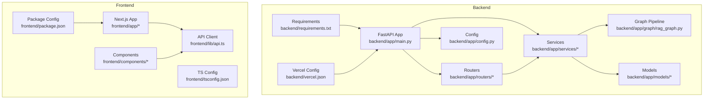
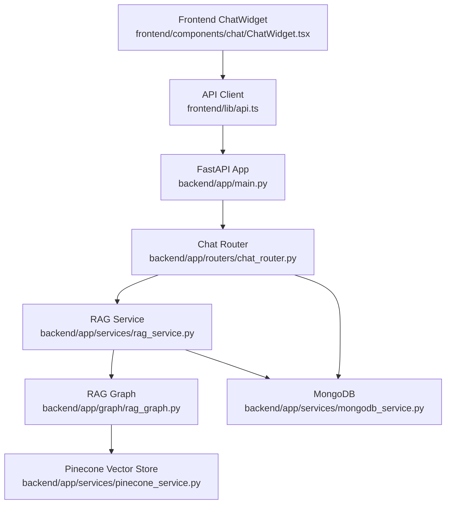
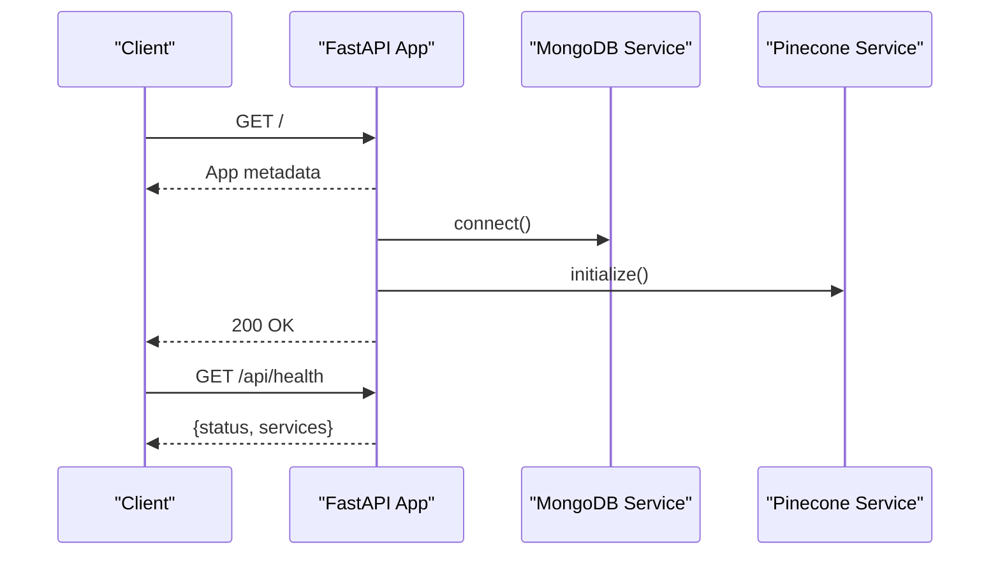
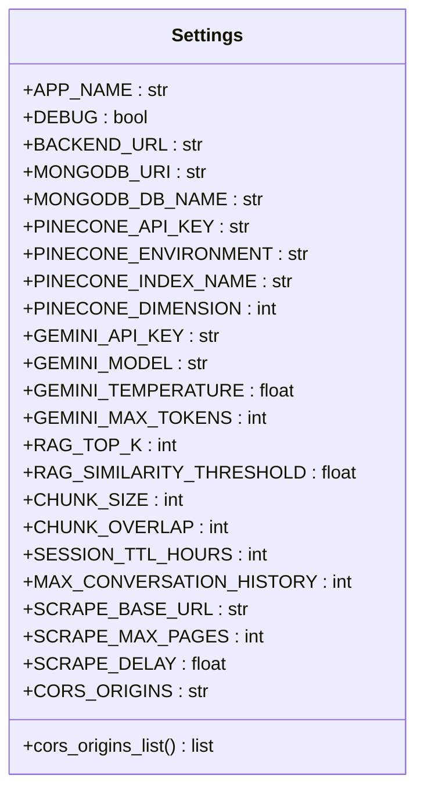
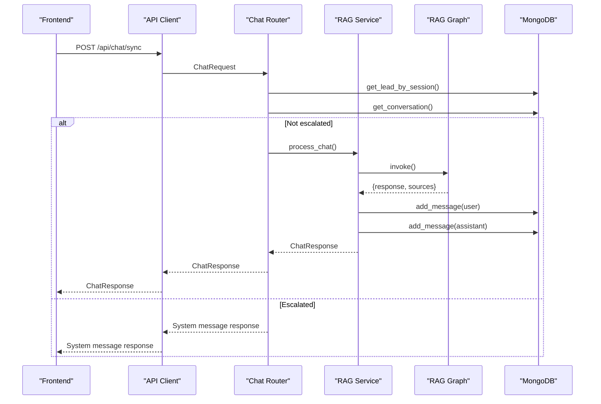
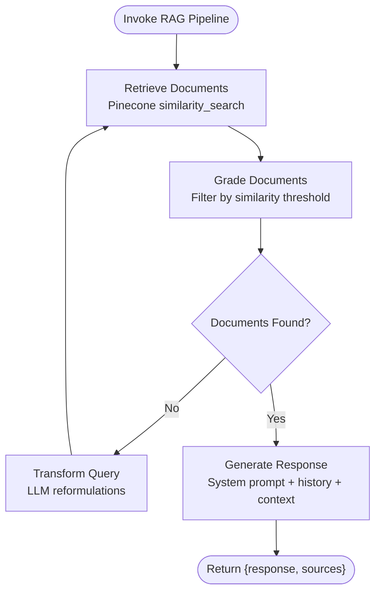
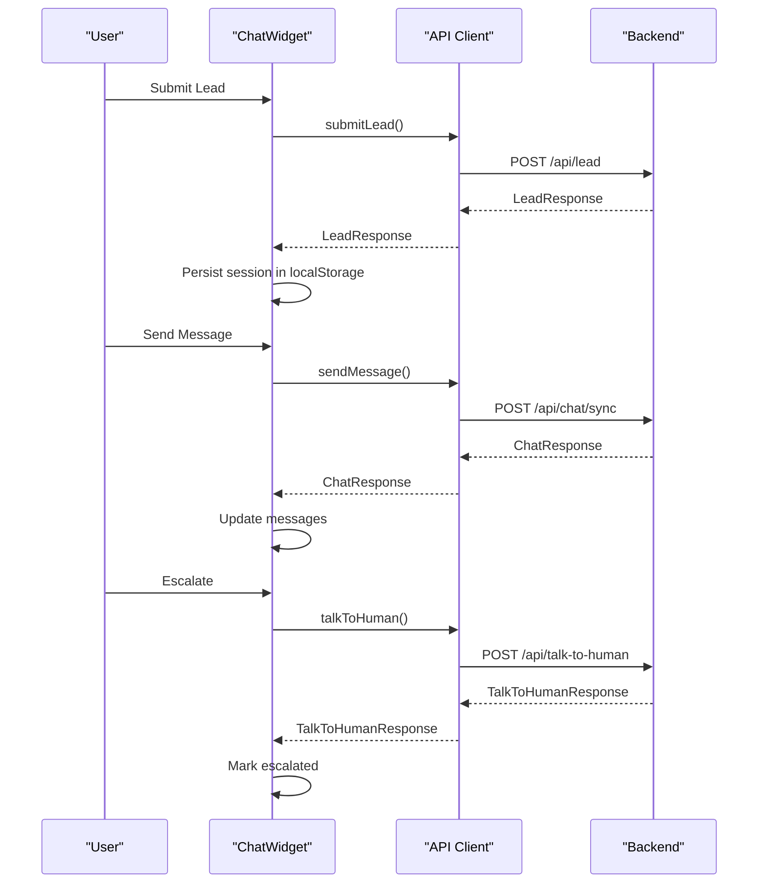
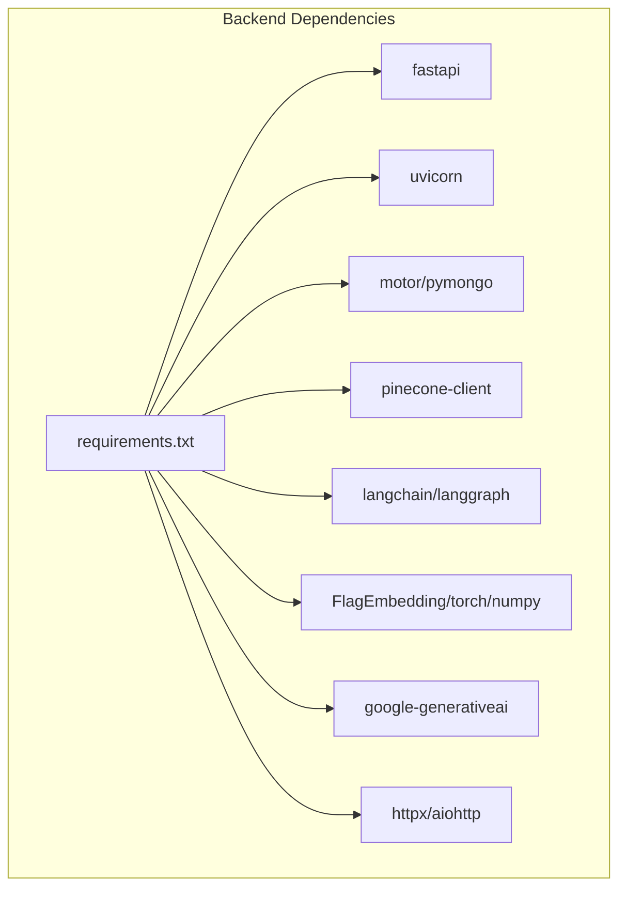
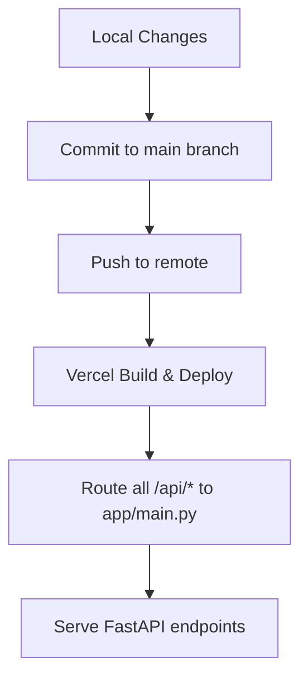

# Development Guidelines

<cite>
**Referenced Files in This Document**
- [backend/app/main.py](file://backend/app/main.py)
- [backend/app/config.py](file://backend/app/config.py)
- [backend/requirements.txt](file://backend/requirements.txt)
- [backend/vercel.json](file://backend/vercel.json)
- [backend/app/routers/chat_router.py](file://backend/app/routers/chat_router.py)
- [backend/app/services/rag_service.py](file://backend/app/services/rag_service.py)
- [backend/app/graph/rag_graph.py](file://backend/app/graph/rag_graph.py)
- [backend/app/models/chat.py](file://backend/app/models/chat.py)
- [frontend/package.json](file://frontend/package.json)
- [frontend/lib/api.ts](file://frontend/lib/api.ts)
- [frontend/components/chat/ChatWidget.tsx](file://frontend/components/chat/ChatWidget.tsx)
- [frontend/app/layout.tsx](file://frontend/app/layout.tsx)
- [frontend/tsconfig.json](file://frontend/tsconfig.json)
- [frontend/README.md](file://frontend/README.md)
</cite>

## Table of Contents
1. [Introduction](#introduction)
2. [Project Structure](#project-structure)
3. [Core Components](#core-components)
4. [Architecture Overview](#architecture-overview)
5. [Detailed Component Analysis](#detailed-component-analysis)
6. [Dependency Analysis](#dependency-analysis)
7. [Performance Considerations](#performance-considerations)
8. [Testing Strategy](#testing-strategy)
9. [Deployment Procedures](#deployment-procedures)
10. [Development Workflow](#development-workflow)
11. [Monitoring and Logging](#monitoring-and-logging)
12. [Troubleshooting Guide](#troubleshooting-guide)
13. [Conclusion](#conclusion)

## Introduction
This document provides comprehensive development guidelines for contributing to the Hitech RAG Chatbot project. It covers code organization principles, naming conventions, architectural patterns, testing strategies, deployment procedures, development workflow, monitoring/logging, performance optimization, and troubleshooting practices. The project consists of a Python FastAPI backend and a Next.js TypeScript frontend, integrated with MongoDB, Pinecone, and Google Gemini for a Retrieval-Augmented Generation (RAG) chat experience.

## Project Structure
The repository follows a clear separation of concerns:
- Backend: FastAPI application with routers, services, models, and graph-based RAG pipeline
- Frontend: Next.js application with chat components, UI primitives, and API client
- Shared configuration via environment variables and Vercel deployment configuration

**Diagram sources**
- [backend/app/main.py:1-90](file://backend/app/main.py#L1-L90)
- [backend/app/config.py:1-65](file://backend/app/config.py#L1-L65)
- [backend/app/routers/chat_router.py:1-130](file://backend/app/routers/chat_router.py#L1-L130)
- [backend/app/services/rag_service.py:1-116](file://backend/app/services/rag_service.py#L1-L116)
- [backend/app/graph/rag_graph.py:1-264](file://backend/app/graph/rag_graph.py#L1-L264)
- [backend/requirements.txt:1-48](file://backend/requirements.txt#L1-L48)
- [backend/vercel.json:1-22](file://backend/vercel.json#L1-L22)
- [frontend/package.json:1-37](file://frontend/package.json#L1-L37)
- [frontend/lib/api.ts:1-93](file://frontend/lib/api.ts#L1-L93)
- [frontend/tsconfig.json:1-35](file://frontend/tsconfig.json#L1-L35)

**Section sources**
- [backend/app/main.py:1-90](file://backend/app/main.py#L1-L90)
- [backend/app/config.py:1-65](file://backend/app/config.py#L1-L65)
- [backend/requirements.txt:1-48](file://backend/requirements.txt#L1-L48)
- [backend/vercel.json:1-22](file://backend/vercel.json#L1-L22)
- [frontend/package.json:1-37](file://frontend/package.json#L1-L37)
- [frontend/tsconfig.json:1-35](file://frontend/tsconfig.json#L1-L35)

## Core Components
- Backend FastAPI application initializes services and exposes REST endpoints for chat, ingestion, and leads.
- Configuration class centralizes environment-driven settings with caching.
- Routers define API contracts and orchestrate service interactions.
- Services encapsulate domain logic for RAG processing, vector storage, and database operations.
- Graph pipeline implements a LangGraph workflow for retrieval, filtering, query transformation, and generation.
- Frontend Next.js app provides a chat widget with lead collection, message handling, and human escalation.

Key conventions observed:
- Module naming: snake_case for Python modules and directories
- Class naming: PascalCase for classes and services
- Function naming: snake_case for functions and methods
- Constants: UPPER_CASE for configuration keys
- Type hints: used consistently in Python and TypeScript
- Pydantic models for request/response validation in Python
- TypeScript interfaces for frontend API contracts

**Section sources**
- [backend/app/main.py:1-90](file://backend/app/main.py#L1-L90)
- [backend/app/config.py:1-65](file://backend/app/config.py#L1-L65)
- [backend/app/routers/chat_router.py:1-130](file://backend/app/routers/chat_router.py#L1-L130)
- [backend/app/services/rag_service.py:1-116](file://backend/app/services/rag_service.py#L1-L116)
- [backend/app/graph/rag_graph.py:1-264](file://backend/app/graph/rag_graph.py#L1-L264)
- [frontend/lib/api.ts:1-93](file://frontend/lib/api.ts#L1-L93)
- [frontend/components/chat/ChatWidget.tsx:1-307](file://frontend/components/chat/ChatWidget.tsx#L1-L307)

## Architecture Overview
The system integrates a frontend chat widget with a backend RAG pipeline:
- Frontend sends lead submission, chat messages, and escalation requests to backend endpoints
- Backend validates sessions, retrieves conversation history, executes the RAG graph, stores messages, and returns responses
- Vector search retrieves relevant documents, filters by similarity, optionally transforms queries, and generates contextual answers
- MongoDB persists leads, conversations, and messages; Pinecone provides vector embeddings

**Diagram sources**
- [frontend/components/chat/ChatWidget.tsx:1-307](file://frontend/components/chat/ChatWidget.tsx#L1-L307)
- [frontend/lib/api.ts:1-93](file://frontend/lib/api.ts#L1-L93)
- [backend/app/main.py:1-90](file://backend/app/main.py#L1-L90)
- [backend/app/routers/chat_router.py:1-130](file://backend/app/routers/chat_router.py#L1-L130)
- [backend/app/services/rag_service.py:1-116](file://backend/app/services/rag_service.py#L1-L116)
- [backend/app/graph/rag_graph.py:1-264](file://backend/app/graph/rag_graph.py#L1-L264)

## Detailed Component Analysis

### Backend Application Lifecycle and Health Checks
- Lifespan manager connects to MongoDB and initializes Pinecone during startup, loads the embedding model singleton, and disconnects on shutdown
- Health endpoint reports MongoDB and Pinecone connection statuses
- Root endpoint provides app metadata and API docs location

**Diagram sources**
- [backend/app/main.py:14-37](file://backend/app/main.py#L14-L37)
- [backend/app/main.py:64-83](file://backend/app/main.py#L64-L83)

**Section sources**
- [backend/app/main.py:1-90](file://backend/app/main.py#L1-L90)

### Configuration Management
- Centralized settings via a Pydantic Settings class with defaults and environment variable loading
- CORS origins parsed from a comma-separated string
- Keys include application settings, database, vector store, LLM, RAG parameters, session controls, scraping, and CORS

**Diagram sources**
- [backend/app/config.py:7-58](file://backend/app/config.py#L7-L58)

**Section sources**
- [backend/app/config.py:1-65](file://backend/app/config.py#L1-L65)

### Chat Router and Conversation Flow
- Synchronous chat endpoint validates session, checks escalation status, runs RAG pipeline, stores messages, and returns AI response
- Human escalation marks conversation, adds system message, and returns confirmation with optional ticket ID
- Conversation retrieval endpoint returns stored messages

**Diagram sources**
- [backend/app/routers/chat_router.py:12-56](file://backend/app/routers/chat_router.py#L12-L56)
- [backend/app/services/rag_service.py:19-87](file://backend/app/services/rag_service.py#L19-L87)
- [backend/app/graph/rag_graph.py:221-251](file://backend/app/graph/rag_graph.py#L221-L251)

**Section sources**
- [backend/app/routers/chat_router.py:1-130](file://backend/app/routers/chat_router.py#L1-L130)
- [backend/app/services/rag_service.py:1-116](file://backend/app/services/rag_service.py#L1-L116)
- [backend/app/models/chat.py:1-45](file://backend/app/models/chat.py#L1-L45)

### RAG Graph Pipeline
- LangGraph workflow with nodes for retrieval, document grading, query transformation, and generation
- Uses Pinecone similarity search with configurable top-K and similarity threshold
- Generates responses using Google Gemini with system prompts enriched by lead and conversation context

**Diagram sources**
- [backend/app/graph/rag_graph.py:40-69](file://backend/app/graph/rag_graph.py#L40-L69)
- [backend/app/graph/rag_graph.py:71-148](file://backend/app/graph/rag_graph.py#L71-L148)
- [backend/app/graph/rag_graph.py:150-219](file://backend/app/graph/rag_graph.py#L150-L219)

**Section sources**
- [backend/app/graph/rag_graph.py:1-264](file://backend/app/graph/rag_graph.py#L1-L264)

### Frontend Chat Widget
- Manages session persistence in localStorage with TTL
- Handles lead submission, message sending, typing indicators, escalation flow, and conversation rendering
- Integrates with API client for backend communication

**Diagram sources**
- [frontend/components/chat/ChatWidget.tsx:84-170](file://frontend/components/chat/ChatWidget.tsx#L84-L170)
- [frontend/lib/api.ts:61-85](file://frontend/lib/api.ts#L61-L85)

**Section sources**
- [frontend/components/chat/ChatWidget.tsx:1-307](file://frontend/components/chat/ChatWidget.tsx#L1-L307)
- [frontend/lib/api.ts:1-93](file://frontend/lib/api.ts#L1-L93)

## Dependency Analysis
- Backend dependencies include FastAPI, uvicorn, motor/pymongo, pinecone-client, langchain/langgraph, FlagEmbedding, torch, numpy, beautifulsoup4, requests, python-dotenv, uuid-utils, typing-extensions, google-generativeai, starlette, httpx, aiohttp
- Frontend dependencies include Next.js, React, TailwindCSS, axios, radix-ui, lucide-react, zod, and TypeScript tooling

**Diagram sources**
- [backend/requirements.txt:1-48](file://backend/requirements.txt#L1-L48)

**Section sources**
- [backend/requirements.txt:1-48](file://backend/requirements.txt#L1-L48)
- [frontend/package.json:1-37](file://frontend/package.json#L1-L37)

## Performance Considerations
- Vector search tuning: adjust RAG_TOP_K and RAG_SIMILARITY_THRESHOLD to balance recall and latency
- Chunking strategy: configure CHUNK_SIZE and CHUNK_OVERLAP for optimal context length vs. cost
- Model parameters: tune GEMINI_TEMPERATURE and GEMINI_MAX_TOKENS for responsiveness and cost
- Caching: embedding model is loaded as a singleton; ensure proper lifecycle management
- Network efficiency: reuse connections with httpx/aiohttp; minimize payload sizes
- Frontend optimization: lazy-load components, debounce user input, and avoid unnecessary re-renders

[No sources needed since this section provides general guidance]

## Testing Strategy
- Unit tests: validate individual functions and services (e.g., RAG pipeline steps, model serialization, API request/response shapes)
- Integration tests: test router endpoints with mocked services to verify end-to-end flows without external systems
- End-to-end tests: simulate user journeys (lead submission → chat → escalation) against a staging backend and database
- Environment isolation: use separate .env files for local, staging, and production environments
- Mock external services: stub Pinecone and Google Gemini for deterministic test outcomes

[No sources needed since this section provides general guidance]

## Deployment Procedures

### Backend Deployment (Vercel)
- Build configuration routes all requests to the FastAPI entrypoint
- PYTHONPATH is set to the repository root
- Environment variables are managed via Vercel project settings

**Diagram sources**
- [backend/vercel.json:1-22](file://backend/vercel.json#L1-L22)

**Section sources**
- [backend/vercel.json:1-22](file://backend/vercel.json#L1-L22)

### Frontend Deployment (Vercel)
- Next.js builds static assets and serves them via Vercel
- Environment variables are configured in Vercel dashboard
- API calls are proxied to the backend using NEXT_PUBLIC_API_URL

**Section sources**
- [frontend/README.md:32-36](file://frontend/README.md#L32-L36)
- [frontend/lib/api.ts:4-11](file://frontend/lib/api.ts#L4-L11)

## Development Workflow
- Branching: use feature branches for new features; merge to main after review
- Commits: keep commits small and focused; include clear descriptions
- Code reviews: ensure at least one reviewer approves; address comments promptly
- CI/CD: automate linting, tests, and deployments on pull requests and main branch
- Environment setup: create .env with required secrets; install dependencies from requirements.txt and package.json

[No sources needed since this section provides general guidance]

## Monitoring and Logging
- Health checks: use /api/health to monitor service status
- Application logs: enable FastAPI server logs; capture structured logs for errors and latency metrics
- Frontend telemetry: instrument API client to track request durations and error rates
- Observability: integrate with a logging platform (e.g., ELK stack or cloud provider logging) for centralized logs

**Section sources**
- [backend/app/main.py:74-83](file://backend/app/main.py#L74-L83)

## Troubleshooting Guide
Common issues and resolutions:
- Session not found: ensure lead is submitted before sending chat messages; verify sessionId is persisted in localStorage
- Escalation failures: confirm MongoDB connection and escalation logic; check backend error responses
- Vector search returns no results: increase RAG_TOP_K or lower RAG_SIMILARITY_THRESHOLD; verify Pinecone index initialization
- CORS errors: validate CORS_ORIGINS configuration and frontend API URL
- LLM generation errors: check GEMINI_API_KEY validity and quota limits

**Section sources**
- [backend/app/routers/chat_router.py:28-44](file://backend/app/routers/chat_router.py#L28-L44)
- [backend/app/config.py:46-58](file://backend/app/config.py#L46-L58)
- [frontend/components/chat/ChatWidget.tsx:144-170](file://frontend/components/chat/ChatWidget.tsx#L144-L170)

## Conclusion
This guide outlines the development practices, architecture, and operational procedures for the Hitech RAG Chatbot. By adhering to the documented conventions, testing strategies, and deployment processes, contributors can maintain code quality, reliability, and scalability across the full-stack solution.