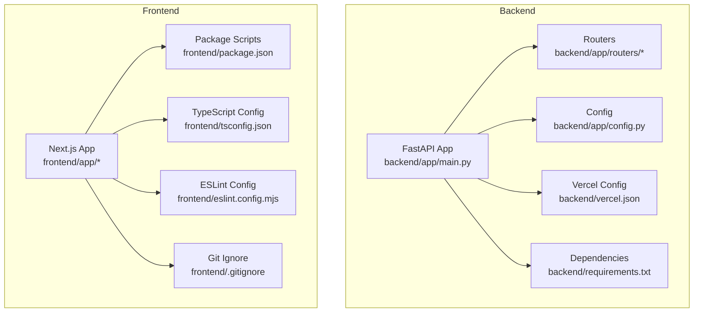
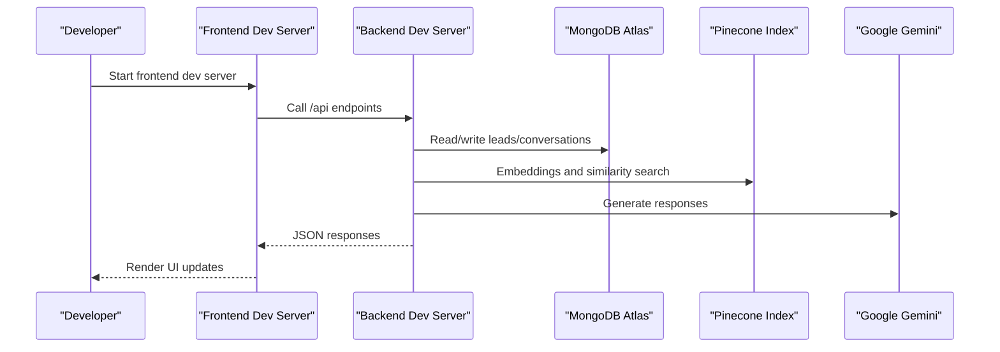
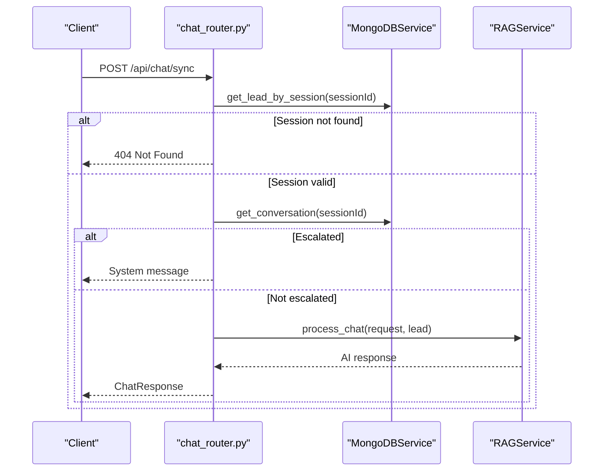
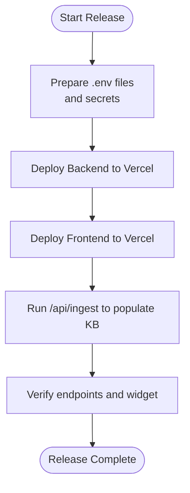
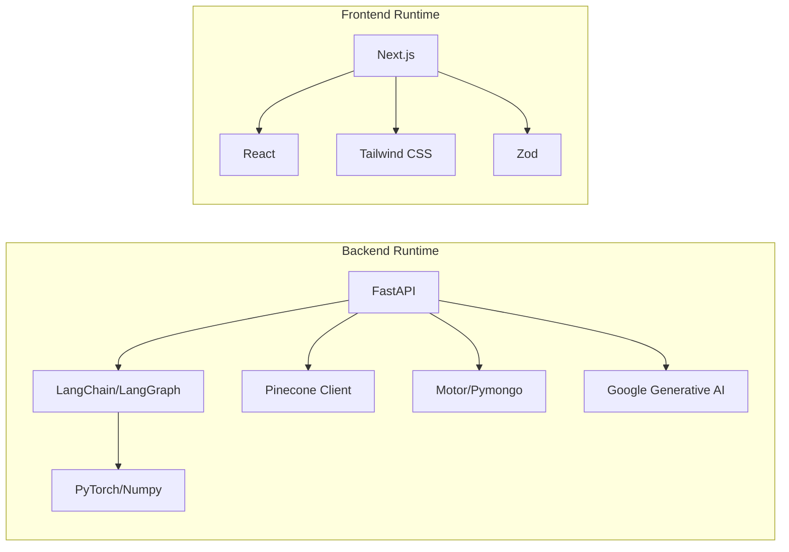

# Development Workflow

<cite>
**Referenced Files in This Document**
- [README.md](file://README.md)
- [backend/app/main.py](file://backend/app/main.py)
- [backend/app/config.py](file://backend/app/config.py)
- [backend/requirements.txt](file://backend/requirements.txt)
- [backend/vercel.json](file://backend/vercel.json)
- [frontend/README.md](file://frontend/README.md)
- [frontend/package.json](file://frontend/package.json)
- [frontend/tsconfig.json](file://frontend/tsconfig.json)
- [frontend/eslint.config.mjs](file://frontend/eslint.config.mjs)
- [frontend/.gitignore](file://frontend/.gitignore)
- [frontend/AGENTS.md](file://frontend/AGENTS.md)
- [backend/app/routers/chat_router.py](file://backend/app/routers/chat_router.py)
</cite>

## Table of Contents
1. [Introduction](#introduction)
2. [Project Structure](#project-structure)
3. [Core Components](#core-components)
4. [Architecture Overview](#architecture-overview)
5. [Detailed Component Analysis](#detailed-component-analysis)
6. [Dependency Analysis](#dependency-analysis)
7. [Performance Considerations](#performance-considerations)
8. [Troubleshooting Guide](#troubleshooting-guide)
9. [Conclusion](#conclusion)
10. [Appendices](#appendices)

## Introduction
This document defines the complete development workflow for contributing to the Hitech RAG Chatbot project. It covers local development setup, environment configuration, development server startup, Git branching and commit conventions, pull request guidelines, code review expectations, testing requirements, release management, feature lifecycle, debugging and profiling, and collaboration guidelines for both internal and external contributors.

## Project Structure
The project is a full-stack application with a Python FastAPI backend and a Next.js frontend. The backend exposes REST endpoints for lead capture, chat with RAG, human escalation, and knowledgebase ingestion. The frontend provides a standalone chat page and an embeddable widget generator.

**Diagram sources**
- [backend/app/main.py:1-90](file://backend/app/main.py#L1-L90)
- [backend/app/config.py:1-65](file://backend/app/config.py#L1-L65)
- [backend/vercel.json:1-22](file://backend/vercel.json#L1-L22)
- [backend/requirements.txt:1-48](file://backend/requirements.txt#L1-L48)
- [frontend/package.json:1-37](file://frontend/package.json#L1-L37)
- [frontend/tsconfig.json:1-45](file://frontend/tsconfig.json#L1-L45)
- [frontend/eslint.config.mjs:1-19](file://frontend/eslint.config.mjs#L1-L19)
- [frontend/.gitignore:1-42](file://frontend/.gitignore#L1-L42)

**Section sources**
- [README.md:64-99](file://README.md#L64-L99)
- [backend/app/main.py:1-90](file://backend/app/main.py#L1-L90)
- [frontend/README.md:1-37](file://frontend/README.md#L1-L37)

## Core Components
- Backend entrypoint initializes services, sets up CORS, and registers routers for lead, chat, and ingestion.
- Configuration loads environment variables for MongoDB, Pinecone, Google Gemini, RAG parameters, and CORS.
- Frontend provides development scripts, TypeScript strictness, ESLint configuration, and ignores for build artifacts and environment files.

Key responsibilities:
- Backend: service initialization, health checks, CORS, and API routing.
- Frontend: development server, linting, and build pipeline.

**Section sources**
- [backend/app/main.py:14-85](file://backend/app/main.py#L14-L85)
- [backend/app/config.py:7-64](file://backend/app/config.py#L7-L64)
- [frontend/package.json:5-10](file://frontend/package.json#L5-L10)
- [frontend/tsconfig.json:10-18](file://frontend/tsconfig.json#L10-L18)
- [frontend/eslint.config.mjs:1-19](file://frontend/eslint.config.mjs#L1-L19)

## Architecture Overview
High-level runtime flow during development and production:

**Diagram sources**
- [backend/app/main.py:14-85](file://backend/app/main.py#L14-L85)
- [backend/app/config.py:15-44](file://backend/app/config.py#L15-L44)
- [backend/app/routers/chat_router.py:12-56](file://backend/app/routers/chat_router.py#L12-L56)

## Detailed Component Analysis

### Local Development Setup
- Backend
  - Install dependencies from requirements.
  - Configure environment variables for MongoDB URI, Pinecone API key, Google Gemini API key, and CORS origins.
  - Start the development server using the FastAPI runner.
- Frontend
  - Install dependencies from package.json.
  - Configure environment variables for API base URLs.
  - Start the Next.js development server.

Environment variables and scripts are defined in the respective configuration files.

**Section sources**
- [backend/requirements.txt:1-48](file://backend/requirements.txt#L1-L48)
- [backend/app/config.py:10-58](file://backend/app/config.py#L10-L58)
- [backend/app/main.py:43-85](file://backend/app/main.py#L43-L85)
- [frontend/package.json:5-10](file://frontend/package.json#L5-L10)
- [frontend/README.md:5-15](file://frontend/README.md#L5-L15)

### Environment Configuration
- Backend
  - Settings include application name, debug mode, backend URL, MongoDB connection, Pinecone credentials and index, Google Gemini model and limits, RAG parameters, session TTL and history length, scraping base URL and limits, and CORS origins.
  - CORS origins can be a wildcard or a comma-separated list parsed into a list.
- Frontend
  - Environment variables include public API URLs for backend and widget endpoints.
  - Build artifacts and logs are ignored by .gitignore.

**Section sources**
- [backend/app/config.py:10-58](file://backend/app/config.py#L10-L58)
- [backend/app/config.py:53-58](file://backend/app/config.py#L53-L58)
- [README.md:101-122](file://README.md#L101-L122)
- [frontend/.gitignore:16-21](file://frontend/.gitignore#L16-L21)

### Development Server Startup
- Backend
  - The FastAPI app is created with lifespan hooks to initialize MongoDB, Pinecone, and embedding services, and to disconnect on shutdown.
  - Health check endpoint reports service connectivity.
- Frontend
  - Development server runs on port 3000 with hot reload enabled.

**Section sources**
- [backend/app/main.py:14-85](file://backend/app/main.py#L14-L85)
- [frontend/README.md:5-15](file://frontend/README.md#L5-L15)

### API Endpoints and Routers
- Chat endpoint validates session, checks escalation status, runs RAG pipeline, stores messages, and returns AI responses.
- Human escalation endpoint marks conversations as escalated, stores notes, and returns a confirmation with a ticket identifier.
- Conversation retrieval endpoint returns stored messages by session ID.

**Diagram sources**
- [backend/app/routers/chat_router.py:12-56](file://backend/app/routers/chat_router.py#L12-L56)

**Section sources**
- [backend/app/routers/chat_router.py:12-130](file://backend/app/routers/chat_router.py#L12-L130)

### Testing Requirements
- Frontend
  - Linting is configured via ESLint; ensure lint passes locally before submitting changes.
  - TypeScript strictness is enabled; fix type errors prior to merge.
- Backend
  - No explicit test files were identified in the repository snapshot; however, maintainers should add unit tests for services and integration tests for routers.
  - Run linting and type checks locally before opening a pull request.

**Section sources**
- [frontend/eslint.config.mjs:1-19](file://frontend/eslint.config.mjs#L1-L19)
- [frontend/tsconfig.json:10-18](file://frontend/tsconfig.json#L10-L18)

### Release Management
- Backend deployment
  - Vercel configuration routes all requests to the FastAPI entrypoint and sets PYTHONPATH.
  - Use the Vercel CLI to deploy the backend.
- Frontend deployment
  - Use the Vercel CLI to deploy the Next.js frontend.
- Knowledgebase ingestion
  - Trigger ingestion via the dedicated endpoint to populate Pinecone with scraped content.

**Diagram sources**
- [backend/vercel.json:1-22](file://backend/vercel.json#L1-L22)
- [README.md:166-178](file://README.md#L166-L178)
- [README.md:180-189](file://README.md#L180-L189)

**Section sources**
- [backend/vercel.json:1-22](file://backend/vercel.json#L1-L22)
- [README.md:166-189](file://README.md#L166-L189)

### Feature Development Lifecycle
- Planning
  - Define feature scope, acceptance criteria, and dependencies on backend services.
- Branching
  - Use feature branches prefixed with feature/, fix/, or chore/.
- Implementation
  - Follow existing code style and patterns; add or update routers/services as needed.
- Testing
  - Ensure linting passes and add unit/integration tests where applicable.
- Pull Request
  - Open PR against develop or main depending on project policy; include screenshots/demos where helpful.
- Review and Merge
  - Obtain approvals; address comments promptly; keep PRs focused and small.
- Deployment
  - Merge to target branch; trigger CI/CD or manual deployments as configured.

[No sources needed since this section provides general guidance]

### Debugging Workflows
- Backend
  - Use the health check endpoint to confirm service connectivity.
  - Enable debug mode in configuration for verbose logging.
  - Inspect lifespan initialization logs for service startup order.
- Frontend
  - Use browser developer tools to inspect network requests and console logs.
  - Verify environment variables are correctly loaded in the browser.

**Section sources**
- [backend/app/main.py:74-83](file://backend/app/main.py#L74-L83)
- [backend/app/config.py:12-13](file://backend/app/config.py#L12-L13)
- [frontend/README.md:17-17](file://frontend/README.md#L17-L17)

### Performance Profiling
- Backend
  - Monitor latency of chat and ingestion endpoints; profile embedding and vector search calls.
  - Tune RAG parameters (top_k, similarity threshold) and chunking settings.
- Frontend
  - Audit bundle size and hydration performance; leverage Next.js static generation where appropriate.
  - Minimize re-renders and optimize heavy computations.

[No sources needed since this section provides general guidance]

### Issue Tracking Procedures
- Use repository issues to track bugs, enhancements, and tasks.
- Assign issues to team members; add labels for priority and type.
- Link pull requests to issues using keywords in commit messages.

[No sources needed since this section provides general guidance]

## Dependency Analysis
Runtime dependencies and their roles:

**Diagram sources**
- [backend/requirements.txt:2-47](file://backend/requirements.txt#L2-L47)
- [frontend/package.json:11-24](file://frontend/package.json#L11-L24)

**Section sources**
- [backend/requirements.txt:1-48](file://backend/requirements.txt#L1-L48)
- [frontend/package.json:11-35](file://frontend/package.json#L11-L35)

## Performance Considerations
- Backend
  - Optimize embedding model loading and caching.
  - Adjust Pinecone query parameters and chunk sizes to balance accuracy and speed.
- Frontend
  - Defer non-critical resources; use dynamic imports for large components.
  - Leverage Next.js image and font optimization.

[No sources needed since this section provides general guidance]

## Troubleshooting Guide
- CORS Issues
  - Ensure CORS_ORIGINS includes the frontend domain; verify parsing logic handles wildcards and lists.
- Health Checks
  - Use the /api/health endpoint to verify MongoDB and Pinecone connections.
- Environment Variables
  - Confirm .env and .env.local values are present and correctly formatted.
- Build Artifacts
  - Remove .next, build, and coverage folders before committing; avoid committing environment files.

**Section sources**
- [backend/app/config.py:46-58](file://backend/app/config.py#L46-L58)
- [backend/app/main.py:74-83](file://backend/app/main.py#L74-L83)
- [frontend/.gitignore:16-21](file://frontend/.gitignore#L16-L21)

## Conclusion
This workflow document consolidates local development, configuration, testing, review, and release practices for the Hitech RAG Chatbot. By following the outlined steps—branching, commit conventions, code review, testing, and deployment—you can contribute effectively and consistently across the full-stack codebase.

[No sources needed since this section summarizes without analyzing specific files]

## Appendices

### Git Branching and Commit Conventions
- Branch naming
  - feature/<description>: new features
  - fix/<description>: bug fixes
  - chore/<description>: maintenance tasks
- Commit messages
  - Use imperative mood: "Add feature" not "Added feature"
  - Keep subject under 50 characters; separate body with blank line
  - Reference related issues using keywords and issue numbers

[No sources needed since this section provides general guidance]

### Pull Request Guidelines
- Keep PRs small and focused
- Include a clear description and links to related issues
- Ensure all checks pass (lint, type checks, tests)
- Request reviews from maintainers; address feedback promptly

[No sources needed since this section provides general guidance]

### Collaboration Guidelines
- Internal team members: follow project-specific standards and sync with leads
- External contributors: fork the repository, create feature branches, and open PRs with clear descriptions

[No sources needed since this section provides general guidance]