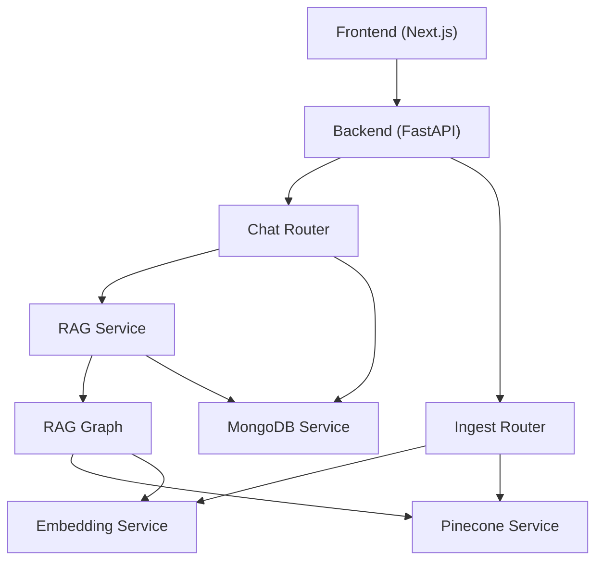
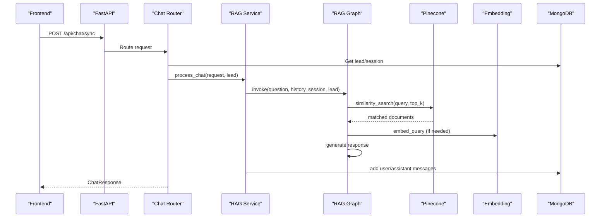
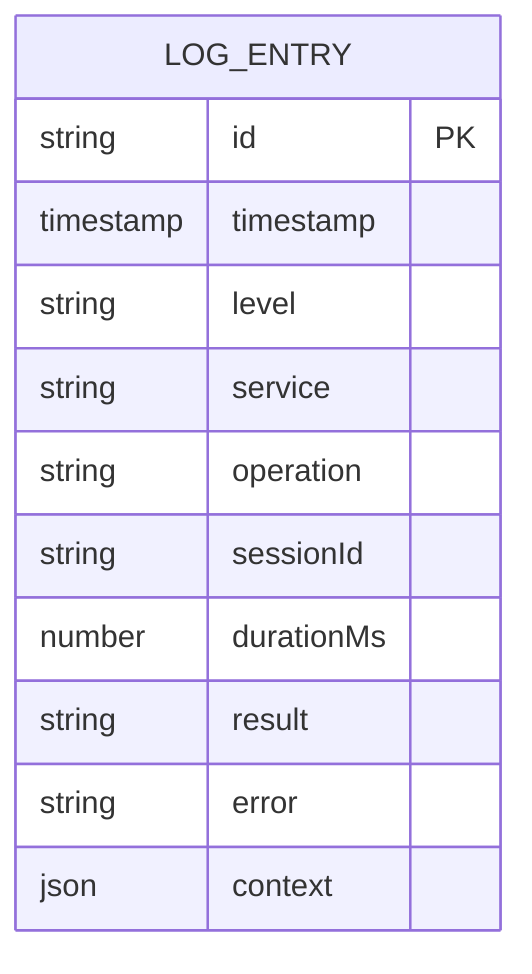
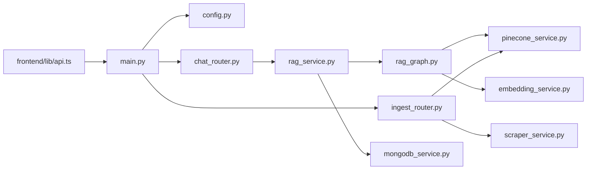

# Monitoring and Logging

<cite>
**Referenced Files in This Document**
- [backend/app/main.py](file://backend/app/main.py)
- [backend/app/config.py](file://backend/app/config.py)
- [backend/app/routers/chat_router.py](file://backend/app/routers/chat_router.py)
- [backend/app/routers/ingest_router.py](file://backend/app/routers/ingest_router.py)
- [backend/app/services/mongodb_service.py](file://backend/app/services/mongodb_service.py)
- [backend/app/services/pinecone_service.py](file://backend/app/services/pinecone_service.py)
- [backend/app/services/embedding_service.py](file://backend/app/services/embedding_service.py)
- [backend/app/services/rag_service.py](file://backend/app/services/rag_service.py)
- [backend/app/graph/rag_graph.py](file://backend/app/graph/rag_graph.py)
- [backend/app/services/scraper_service.py](file://backend/app/services/scraper_service.py)
- [backend/requirements.txt](file://backend/requirements.txt)
- [frontend/lib/api.ts](file://frontend/lib/api.ts)
</cite>

## Table of Contents
1. [Introduction](#introduction)
2. [Project Structure](#project-structure)
3. [Core Components](#core-components)
4. [Architecture Overview](#architecture-overview)
5. [Detailed Component Analysis](#detailed-component-analysis)
6. [Dependency Analysis](#dependency-analysis)
7. [Performance Considerations](#performance-considerations)
8. [Troubleshooting Guide](#troubleshooting-guide)
9. [Conclusion](#conclusion)
10. [Appendices](#appendices)

## Introduction
This document provides monitoring and logging guidance for the Hitech RAG Chatbot system. It covers logging strategies for both backend and frontend applications, outlines monitoring setups for API endpoints, database, and vector store operations, and defines alerting criteria for critical failures, performance degradation, and security incidents. It also documents observability practices for the RAG pipeline, latency monitoring, and error tracking, along with debugging, profiling, and health-check procedures. Finally, it includes logging best practices for sensitive data handling and compliance.

## Project Structure
The system comprises:
- Backend: FastAPI application with routers, services, and a LangGraph-based RAG pipeline.
- Frontend: Next.js application that communicates with the backend via typed API calls.
- Vector store: Pinecone-backed index for semantic search.
- Data store: MongoDB for leads and conversation history.
- Embedding engine: BGE-M3 model for vector embeddings.

**Diagram sources**
- [backend/app/main.py:39-85](file://backend/app/main.py#L39-L85)
- [backend/app/routers/chat_router.py:12-129](file://backend/app/routers/chat_router.py#L12-L129)
- [backend/app/routers/ingest_router.py:26-111](file://backend/app/routers/ingest_router.py#L26-L111)
- [backend/app/services/rag_service.py:19-87](file://backend/app/services/rag_service.py#L19-L87)
- [backend/app/graph/rag_graph.py:26-251](file://backend/app/graph/rag_graph.py#L26-L251)
- [backend/app/services/pinecone_service.py:10-180](file://backend/app/services/pinecone_service.py#L10-L180)
- [backend/app/services/embedding_service.py:10-157](file://backend/app/services/embedding_service.py#L10-L157)
- [backend/app/services/mongodb_service.py:13-201](file://backend/app/services/mongodb_service.py#L13-L201)

**Section sources**
- [backend/app/main.py:1-90](file://backend/app/main.py#L1-L90)
- [frontend/lib/api.ts:1-93](file://frontend/lib/api.ts#L1-L93)

## Core Components
- Backend application lifecycle and health checks:
  - Startup/shutdown hooks initialize MongoDB, Pinecone, and the embedding model.
  - Health endpoint reports service connectivity.
- Routers:
  - Chat router handles synchronous chat, escalation to human, and conversation retrieval.
  - Ingest router manages knowledgebase ingestion, status, and clearing operations.
- Services:
  - MongoDB service persists leads and conversations with indexing and cleanup.
  - Pinecone service manages vector upserts, similarity search, and index statistics.
  - Embedding service loads BGE-M3 once and computes dense vectors.
  - RAG service orchestrates conversation history, graph invocation, and persistence.
  - Scraper service extracts, cleans, chunks, embeds, and ingests content into Pinecone.
- Frontend API client:
  - Typed requests to lead submission, chat sync, escalation, conversation retrieval, and health checks.

**Section sources**
- [backend/app/main.py:14-85](file://backend/app/main.py#L14-L85)
- [backend/app/routers/chat_router.py:12-129](file://backend/app/routers/chat_router.py#L12-L129)
- [backend/app/routers/ingest_router.py:26-111](file://backend/app/routers/ingest_router.py#L26-L111)
- [backend/app/services/mongodb_service.py:13-201](file://backend/app/services/mongodb_service.py#L13-L201)
- [backend/app/services/pinecone_service.py:10-180](file://backend/app/services/pinecone_service.py#L10-L180)
- [backend/app/services/embedding_service.py:10-157](file://backend/app/services/embedding_service.py#L10-L157)
- [backend/app/services/rag_service.py:11-116](file://backend/app/services/rag_service.py#L11-L116)
- [backend/app/services/scraper_service.py:26-329](file://backend/app/services/scraper_service.py#L26-L329)
- [frontend/lib/api.ts:61-90](file://frontend/lib/api.ts#L61-L90)

## Architecture Overview
The RAG pipeline integrates retrieval, filtering, generation, and persistence. Observability spans API endpoints, vector store operations, and database writes.

**Diagram sources**
- [backend/app/routers/chat_router.py:12-47](file://backend/app/routers/chat_router.py#L12-L47)
- [backend/app/services/rag_service.py:19-87](file://backend/app/services/rag_service.py#L19-L87)
- [backend/app/graph/rag_graph.py:71-251](file://backend/app/graph/rag_graph.py#L71-L251)
- [backend/app/services/pinecone_service.py:108-154](file://backend/app/services/pinecone_service.py#L108-L154)
- [backend/app/services/embedding_service.py:55-77](file://backend/app/services/embedding_service.py#L55-L77)
- [backend/app/services/mongodb_service.py:117-133](file://backend/app/services/mongodb_service.py#L117-L133)

## Detailed Component Analysis

### Logging Strategy

- Log levels
  - Trace/Debug: verbose steps during ingestion and RAG pipeline stages.
  - Info: startup/shutdown events, health checks, successful operations.
  - Warn: non-fatal conditions (e.g., no pages scraped, low-relevance matches).
  - Error: exceptions, failed upserts/searches, invalid sessions.

- Structured logging
  - Include correlation IDs (session ID), component names, operation types, and outcomes.
  - Example fields: service, operation, sessionId, durationMs, result, error.

- Log aggregation
  - Backend: stream logs to stdout/stderr; deploy with container logging drivers or sidecars.
  - Frontend: capture console logs and send to backend for centralized storage.

- Sensitive data handling
  - Mask or redact PII (email, phone) and API keys in logs.
  - Avoid logging full conversation content; log summaries or hashes instead.
  - Comply with data minimization and retention policies.

- Compliance
  - Retain audit trails for escalations and admin actions.
  - Enable log encryption at rest and in transit.

[No sources needed since this section provides general guidance]

### Monitoring Setup

- API endpoints
  - Metrics: request count, latency (p50/p95/p99), error rates, status code distribution.
  - Traces: span per endpoint, including downstream calls to MongoDB and Pinecone.
  - Health: /api/health endpoint for service readiness.

- Database (MongoDB)
  - Metrics: connection pool utilization, command durations, index hit ratios.
  - Alerts: slow queries, high connection waits, index creation failures.

- Vector store (Pinecone)
  - Metrics: upsert/query latency, success rates, index stats (vector count, fullness).
  - Alerts: high query latency, frequent timeouts, index capacity nearing limits.

- RAG pipeline
  - Metrics: retrieval count, relevance thresholds, generation latency, source attribution.
  - Traces: end-to-end latency per chat request.

- Frontend
  - Metrics: page load times, API call latencies, error rates.
  - Traces: request/response spans for chat and ingestion flows.

[No sources needed since this section provides general guidance]

### Alerting Configurations

- Critical system failures
  - Backend health degraded or down.
  - MongoDB connection lost or index creation fails.
  - Pinecone client initialization errors.

- Performance degradation
  - Chat endpoint p95 latency > threshold.
  - Vector search latency increases.
  - Embedding model load failures.

- Security incidents
  - Unauthorized access attempts.
  - Excessive failed authentication or malformed requests.
  - Exposure of secrets in logs.

[No sources needed since this section provides general guidance]

### Observability Practices

- Latency monitoring
  - Instrument endpoints and internal services with timing metrics.
  - Track tail latency to detect outliers.

- Error tracking
  - Capture stack traces and contextual fields.
  - Correlate errors with session IDs for triage.

- RAG pipeline observability
  - Track retrieval quality (top-k, threshold), generation tokens, and source counts.
  - Monitor hallucination risk indicators and grounding signals.

[No sources needed since this section provides general guidance]

### Debugging and Profiling

- Debugging production issues
  - Enable debug logs temporarily with controlled scope.
  - Use correlation IDs to trace requests across services.
  - Inspect vector store entries and conversation history for anomalies.

- Performance profiling
  - Profile embedding generation and similarity search.
  - Analyze database write/read patterns and index usage.

- System health checks
  - Verify health endpoint responses.
  - Confirm vector store statistics and index readiness.

[No sources needed since this section provides general guidance]

### Data Model for Logs and Metrics

[No sources needed since this diagram shows conceptual data model]

## Dependency Analysis

**Diagram sources**
- [backend/app/main.py:39-85](file://backend/app/main.py#L39-L85)
- [backend/app/routers/chat_router.py:12-129](file://backend/app/routers/chat_router.py#L12-L129)
- [backend/app/routers/ingest_router.py:26-111](file://backend/app/routers/ingest_router.py#L26-L111)
- [backend/app/services/rag_service.py:11-116](file://backend/app/services/rag_service.py#L11-L116)
- [backend/app/graph/rag_graph.py:26-251](file://backend/app/graph/rag_graph.py#L26-L251)
- [backend/app/services/pinecone_service.py:10-180](file://backend/app/services/pinecone_service.py#L10-L180)
- [backend/app/services/embedding_service.py:10-157](file://backend/app/services/embedding_service.py#L10-L157)
- [backend/app/services/mongodb_service.py:13-201](file://backend/app/services/mongodb_service.py#L13-L201)
- [backend/app/services/scraper_service.py:26-329](file://backend/app/services/scraper_service.py#L26-L329)
- [frontend/lib/api.ts:61-90](file://frontend/lib/api.ts#L61-L90)

**Section sources**
- [backend/requirements.txt:1-48](file://backend/requirements.txt#L1-L48)

## Performance Considerations
- Embedding and retrieval
  - Batch embedding and upsert operations to reduce overhead.
  - Tune top-k and similarity threshold to balance recall and latency.
- Database writes
  - Use bulk operations for message writes; ensure indexes are optimized.
- Vector store
  - Monitor index statistics and periodically reindex if fragmentation increases.
- Frontend
  - Debounce chat submissions and cache recent conversation history.

[No sources needed since this section provides general guidance]

## Troubleshooting Guide

- Backend health
  - Verify /api/health for MongoDB and Pinecone connectivity.
  - Check startup/shutdown logs for initialization errors.

- Chat failures
  - Validate session existence and escalation status.
  - Inspect conversation history and RAG graph execution logs.

- Ingestion issues
  - Confirm website accessibility and content extraction.
  - Review embedding generation and Pinecone upsert results.

- Vector search problems
  - Check query embedding generation and similarity thresholds.
  - Inspect index statistics and retry counts.

**Section sources**
- [backend/app/main.py:74-83](file://backend/app/main.py#L74-L83)
- [backend/app/routers/chat_router.py:27-55](file://backend/app/routers/chat_router.py#L27-L55)
- [backend/app/routers/ingest_router.py:43-73](file://backend/app/routers/ingest_router.py#L43-L73)
- [backend/app/graph/rag_graph.py:71-121](file://backend/app/graph/rag_graph.py#L71-L121)
- [backend/app/services/pinecone_service.py:108-154](file://backend/app/services/pinecone_service.py#L108-L154)

## Conclusion
A robust monitoring and logging strategy ensures reliable operation of the Hitech RAG Chatbot. By instrumenting APIs, databases, and vector stores, correlating logs with session IDs, and alerting on critical and performance regressions, teams can maintain high availability and responsiveness. Structured logging, sensitive data protection, and compliance-aware retention further strengthen operational safety.

[No sources needed since this section summarizes without analyzing specific files]

## Appendices

### API Definitions for Monitoring
- GET /api/health
  - Purpose: Health check for MongoDB and Pinecone.
  - Response fields: status, services (mongodb, pinecone).
- GET /api/conversation/{session_id}
  - Purpose: Retrieve conversation history for diagnostics.
- POST /api/chat/sync
  - Purpose: Synchronous chat with RAG.
  - Request: sessionId, message.
  - Response: response, sessionId, sources, model.
- POST /api/talk-to-human
  - Purpose: Escalate conversation to human.
  - Request: sessionId, notes.
  - Response: success, sessionId, message, ticketId.
- POST /api/ingest
  - Purpose: Ingest knowledgebase from website.
  - Request: url, max_pages.
  - Response: status, message, pages_scraped, chunks_created.
- GET /api/ingest/status
  - Purpose: Get vector store statistics.
  - Response: status, vector_store, total_vectors, dimension, index_fullness.
- DELETE /api/ingest/clear
  - Purpose: Clear all vectors from the index.
  - Response: status, message, deleted.

**Section sources**
- [backend/app/main.py:74-83](file://backend/app/main.py#L74-L83)
- [backend/app/routers/chat_router.py:120-129](file://backend/app/routers/chat_router.py#L120-L129)
- [backend/app/routers/chat_router.py:12-117](file://backend/app/routers/chat_router.py#L12-L117)
- [backend/app/routers/ingest_router.py:26-111](file://backend/app/routers/ingest_router.py#L26-L111)
- [frontend/lib/api.ts:82-90](file://frontend/lib/api.ts#L82-L90)