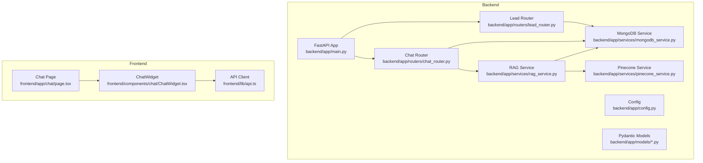
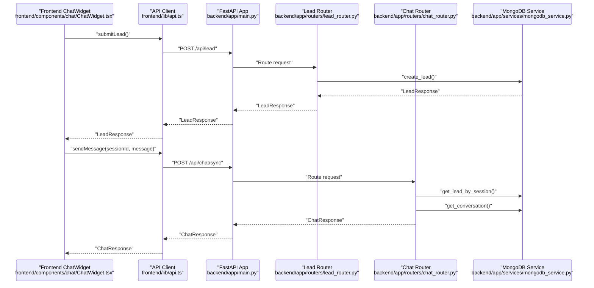
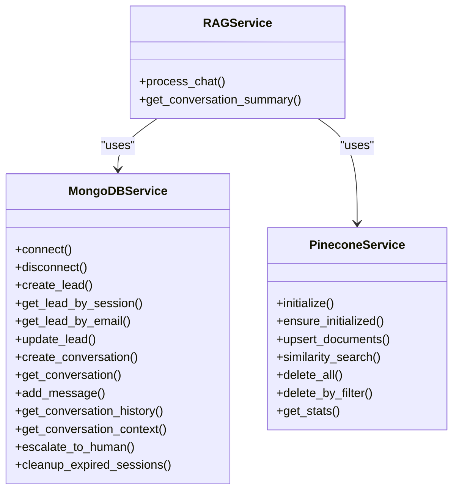
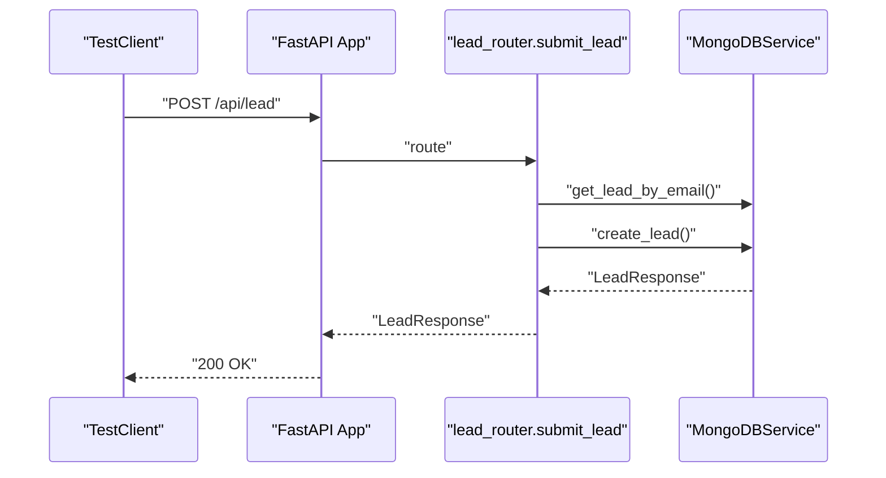
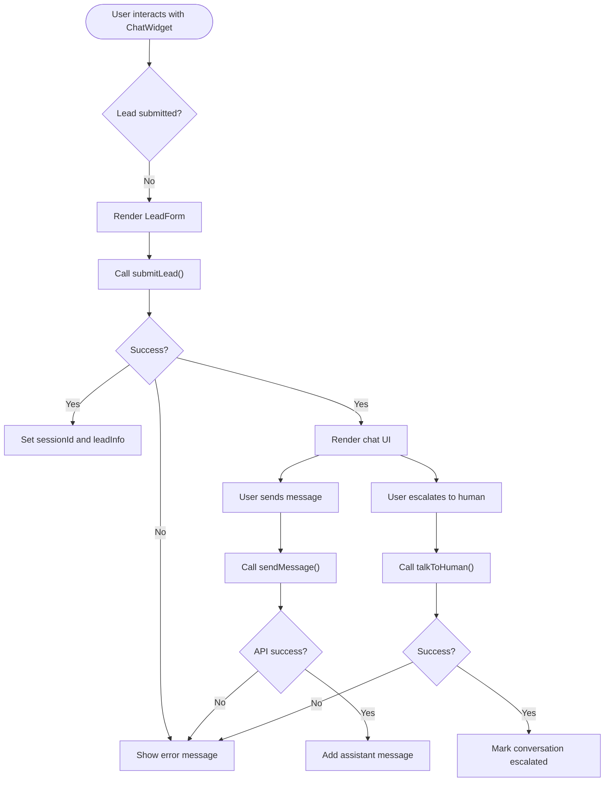
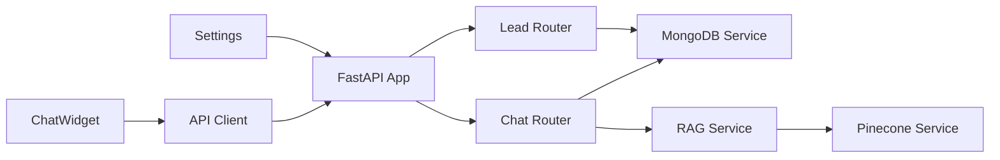

# Testing Strategy

<cite>
**Referenced Files in This Document**
- [backend/app/main.py](file://backend/app/main.py)
- [backend/app/config.py](file://backend/app/config.py)
- [backend/app/routers/lead_router.py](file://backend/app/routers/lead_router.py)
- [backend/app/routers/chat_router.py](file://backend/app/routers/chat_router.py)
- [backend/app/services/mongodb_service.py](file://backend/app/services/mongodb_service.py)
- [backend/app/services/pinecone_service.py](file://backend/app/services/pinecone_service.py)
- [backend/app/services/rag_service.py](file://backend/app/services/rag_service.py)
- [backend/app/models/lead.py](file://backend/app/models/lead.py)
- [backend/app/models/chat.py](file://backend/app/models/chat.py)
- [frontend/package.json](file://frontend/package.json)
- [frontend/lib/api.ts](file://frontend/lib/api.ts)
- [frontend/components/chat/ChatWidget.tsx](file://frontend/components/chat/ChatWidget.tsx)
- [frontend/app/chat/page.tsx](file://frontend/app/chat/page.tsx)
</cite>

## Table of Contents
1. [Introduction](#introduction)
2. [Project Structure](#project-structure)
3. [Core Components](#core-components)
4. [Architecture Overview](#architecture-overview)
5. [Detailed Component Analysis](#detailed-component-analysis)
6. [Dependency Analysis](#dependency-analysis)
7. [Performance Considerations](#performance-considerations)
8. [Troubleshooting Guide](#troubleshooting-guide)
9. [Conclusion](#conclusion)
10. [Appendices](#appendices)

## Introduction
This document defines a comprehensive testing strategy for the Hitech RAG Chatbot application. It covers unit testing for Python services with mocks for external dependencies (MongoDB and Pinecone), integration testing for FastAPI endpoints and database operations, frontend testing guidelines for React components and API mocking, and CI considerations. It also outlines test organization patterns, examples of critical test cases for the RAG pipeline, lead capture, and chat functionality, and guidance for performance and load testing.

## Project Structure
The application follows a clear separation of concerns:
- Backend: FastAPI application with routers, services, models, and configuration.
- Frontend: Next.js application with React components, API client, and pages.
- Knowledge base and static assets are present but not part of the primary runtime logic.

**Diagram sources**
- [backend/app/main.py:1-90](file://backend/app/main.py#L1-L90)
- [backend/app/config.py:1-65](file://backend/app/config.py#L1-L65)
- [backend/app/routers/lead_router.py:1-57](file://backend/app/routers/lead_router.py#L1-L57)
- [backend/app/routers/chat_router.py:1-130](file://backend/app/routers/chat_router.py#L1-L130)
- [backend/app/services/mongodb_service.py:1-202](file://backend/app/services/mongodb_service.py#L1-L202)
- [backend/app/services/pinecone_service.py:1-186](file://backend/app/services/pinecone_service.py#L1-L186)
- [backend/app/services/rag_service.py:1-116](file://backend/app/services/rag_service.py#L1-L116)
- [frontend/app/chat/page.tsx:1-12](file://frontend/app/chat/page.tsx#L1-L12)
- [frontend/components/chat/ChatWidget.tsx:1-307](file://frontend/components/chat/ChatWidget.tsx#L1-L307)
- [frontend/lib/api.ts:1-93](file://frontend/lib/api.ts#L1-L93)

**Section sources**
- [backend/app/main.py:1-90](file://backend/app/main.py#L1-L90)
- [frontend/package.json:1-37](file://frontend/package.json#L1-L37)

## Core Components
- Configuration: Centralized settings via Pydantic settings with environment-backed keys for MongoDB, Pinecone, RAG parameters, and CORS.
- Routers: FastAPI endpoints for lead submission, chat sync, escalation, and conversation retrieval.
- Services:
  - MongoDB service: Asynchronous operations for leads and conversations with indexes and TTL-like cleanup.
  - Pinecone service: Singleton vector store with upsert, similarity search, and index management.
  - RAG service: Orchestrates conversation history retrieval, graph invocation, and persistence.
- Models: Pydantic models for lead validation, chat requests/responses, and related types.
- Frontend: ChatWidget composes lead form, message bubbles, typing indicator, and input; communicates via API client.

Key testing focus areas:
- Unit tests for services (mock external dependencies).
- Integration tests for routers and database operations.
- Frontend tests for components and API interactions.
- CI setup to run unit and integration tests automatically.

**Section sources**
- [backend/app/config.py:1-65](file://backend/app/config.py#L1-L65)
- [backend/app/routers/lead_router.py:1-57](file://backend/app/routers/lead_router.py#L1-L57)
- [backend/app/routers/chat_router.py:1-130](file://backend/app/routers/chat_router.py#L1-L130)
- [backend/app/services/mongodb_service.py:1-202](file://backend/app/services/mongodb_service.py#L1-L202)
- [backend/app/services/pinecone_service.py:1-186](file://backend/app/services/pinecone_service.py#L1-L186)
- [backend/app/services/rag_service.py:1-116](file://backend/app/services/rag_service.py#L1-L116)
- [backend/app/models/lead.py:1-64](file://backend/app/models/lead.py#L1-L64)
- [backend/app/models/chat.py:1-45](file://backend/app/models/chat.py#L1-L45)
- [frontend/lib/api.ts:1-93](file://frontend/lib/api.ts#L1-L93)
- [frontend/components/chat/ChatWidget.tsx:1-307](file://frontend/components/chat/ChatWidget.tsx#L1-L307)

## Architecture Overview
The backend initializes services at startup, mounts routers, and exposes health checks. The frontend integrates via an API client and renders a chat widget that persists session data locally.

**Diagram sources**
- [frontend/components/chat/ChatWidget.tsx:1-307](file://frontend/components/chat/ChatWidget.tsx#L1-L307)
- [frontend/lib/api.ts:1-93](file://frontend/lib/api.ts#L1-L93)
- [backend/app/main.py:1-90](file://backend/app/main.py#L1-L90)
- [backend/app/routers/lead_router.py:1-57](file://backend/app/routers/lead_router.py#L1-L57)
- [backend/app/routers/chat_router.py:1-130](file://backend/app/routers/chat_router.py#L1-L130)
- [backend/app/services/mongodb_service.py:1-202](file://backend/app/services/mongodb_service.py#L1-L202)

## Detailed Component Analysis

### Backend Unit Testing Strategy
- Test framework: pytest recommended for Python services.
- Mocking:
  - Use unittest.mock or pytest-mock to patch Motor client and Pinecone client.
  - Replace MongoDBService and PineconeService with minimal stubs returning deterministic results.
- Isolation:
  - Test RAGService independently by injecting mocked MongoDBService and graph invocations.
  - Test routers with mocked services to validate routing, validation, and error handling.
- Examples of test scenarios:
  - Lead creation with duplicate email reuse existing session.
  - Chat sync with valid session returns response; invalid session raises 404.
  - Escalation marks conversation and updates lead status.
  - MongoDB operations: insert, update, query, and TTL cleanup.
  - Pinecone upsert and similarity search with pagination/batching.

**Diagram sources**
- [backend/app/services/mongodb_service.py:1-202](file://backend/app/services/mongodb_service.py#L1-L202)
- [backend/app/services/pinecone_service.py:1-186](file://backend/app/services/pinecone_service.py#L1-L186)
- [backend/app/services/rag_service.py:1-116](file://backend/app/services/rag_service.py#L1-L116)

**Section sources**
- [backend/app/services/mongodb_service.py:1-202](file://backend/app/services/mongodb_service.py#L1-L202)
- [backend/app/services/pinecone_service.py:1-186](file://backend/app/services/pinecone_service.py#L1-L186)
- [backend/app/services/rag_service.py:1-116](file://backend/app/services/rag_service.py#L1-L116)

### Integration Testing Strategy (FastAPI)
- Test framework: pytest with FastAPI TestClient.
- Scope:
  - Endpoint coverage: POST /api/lead, POST /api/chat/sync, POST /api/talk-to-human, GET /api/conversation/{session_id}.
  - Validation: Pydantic model validation errors and HTTP exceptions.
  - Health check: GET /api/health validates service connectivity.
- Data fixtures:
  - Use temporary MongoDB collections and ephemeral Pinecone index for tests.
  - Seed test data via service methods or direct inserts.
- Error handling:
  - Simulate missing session, database failures, and external service errors.

**Diagram sources**
- [backend/app/routers/lead_router.py:1-57](file://backend/app/routers/lead_router.py#L1-L57)
- [backend/app/services/mongodb_service.py:1-202](file://backend/app/services/mongodb_service.py#L1-L202)
- [backend/app/main.py:1-90](file://backend/app/main.py#L1-L90)

**Section sources**
- [backend/app/routers/lead_router.py:1-57](file://backend/app/routers/lead_router.py#L1-L57)
- [backend/app/routers/chat_router.py:1-130](file://backend/app/routers/chat_router.py#L1-L130)
- [backend/app/main.py:74-83](file://backend/app/main.py#L74-L83)

### Frontend Testing Strategy (React)
- Test framework: Jest + React Testing Library for component tests; Vitest or Jest for API mocking.
- Scope:
  - ChatWidget: session persistence, lead submission flow, sending messages, escalation, and UI states.
  - API client: endpoint calls, error handling, and response parsing.
  - Pages: Chat page rendering and props.
- Mocking:
  - Mock axios in the API client to simulate backend responses.
  - Stub localStorage for session persistence.
- Examples of test scenarios:
  - Lead form submission success and failure paths.
  - Sending a message updates messages array and handles network errors.
  - Escalation toggles UI state and calls API.
  - Conversation retrieval endpoint returns expected data.

**Diagram sources**
- [frontend/components/chat/ChatWidget.tsx:1-307](file://frontend/components/chat/ChatWidget.tsx#L1-L307)
- [frontend/lib/api.ts:1-93](file://frontend/lib/api.ts#L1-L93)

**Section sources**
- [frontend/components/chat/ChatWidget.tsx:1-307](file://frontend/components/chat/ChatWidget.tsx#L1-L307)
- [frontend/lib/api.ts:1-93](file://frontend/lib/api.ts#L1-L93)
- [frontend/app/chat/page.tsx:1-12](file://frontend/app/chat/page.tsx#L1-L12)

### Test Organization Patterns
- Backend:
  - Directory: tests/backend/
  - Group by module: test_routers/, test_services/, test_models/.
  - Fixtures: conftest.py for TestClient and service mocks.
- Frontend:
  - Directory: tests/frontend/
  - Group by domain: test_components/, test_pages/, test_api/.
  - Fixtures: setup for React Testing Library and axios mocks.

[No sources needed since this section provides general guidance]

## Dependency Analysis
- Backend startup depends on configuration, MongoDB connection, Pinecone initialization, and embedding service singleton.
- Routers depend on services via dependency injection.
- Frontend depends on API client and environment variables for backend URL.

**Diagram sources**
- [backend/app/config.py:1-65](file://backend/app/config.py#L1-L65)
- [backend/app/main.py:1-90](file://backend/app/main.py#L1-L90)
- [backend/app/routers/lead_router.py:1-57](file://backend/app/routers/lead_router.py#L1-L57)
- [backend/app/routers/chat_router.py:1-130](file://backend/app/routers/chat_router.py#L1-L130)
- [backend/app/services/mongodb_service.py:1-202](file://backend/app/services/mongodb_service.py#L1-L202)
- [backend/app/services/pinecone_service.py:1-186](file://backend/app/services/pinecone_service.py#L1-L186)
- [backend/app/services/rag_service.py:1-116](file://backend/app/services/rag_service.py#L1-L116)
- [frontend/lib/api.ts:1-93](file://frontend/lib/api.ts#L1-L93)

**Section sources**
- [backend/app/main.py:14-37](file://backend/app/main.py#L14-L37)
- [backend/app/config.py:1-65](file://backend/app/config.py#L1-L65)

## Performance Considerations
- Unit tests:
  - Keep tests fast by mocking I/O and external services.
  - Use parameterized tests for varying input sizes and edge cases.
- Integration tests:
  - Use lightweight test databases and ephemeral indexes.
  - Limit concurrency and batch operations to avoid timeouts.
- Load testing:
  - Use Locust or k6 to simulate concurrent users submitting leads, sending messages, and escalating.
  - Monitor backend CPU, memory, and external service latency.
- Observability:
  - Instrument key endpoints and services with metrics.
  - Log slow queries and retries.

[No sources needed since this section provides general guidance]

## Troubleshooting Guide
- Common backend issues:
  - MongoDB connection failures: verify URI and credentials; ensure container/network availability.
  - Pinecone initialization failures: confirm API key and index existence.
  - Validation errors: inspect Pydantic model constraints and router error responses.
- Frontend issues:
  - API calls failing: check NEXT_PUBLIC_API_URL and CORS configuration.
  - Session not persisting: verify localStorage support and TTL logic.
- Debugging tips:
  - Enable debug logs in configuration.
  - Use curl or Postman to test endpoints independently.

**Section sources**
- [backend/app/config.py:1-65](file://backend/app/config.py#L1-L65)
- [backend/app/main.py:74-83](file://backend/app/main.py#L74-L83)
- [frontend/lib/api.ts:4-11](file://frontend/lib/api.ts#L4-L11)

## Conclusion
A robust testing strategy combines unit tests for services with precise mocks, integration tests for endpoints and database operations, and frontend tests for components and API interactions. By organizing tests by module, leveraging mocking for external dependencies, and establishing CI pipelines, the project can maintain reliability as it evolves.

[No sources needed since this section summarizes without analyzing specific files]

## Appendices

### Example Test Scenarios (by component)
- Lead capture
  - Submit lead with valid data; expect LeadResponse with sessionId.
  - Submit lead with duplicate email; expect reuse of existing session.
  - Submit lead with invalid phone number; expect validation error.
- Chat functionality
  - Chat sync with valid session; expect ChatResponse with sources.
  - Chat sync with invalid session; expect 404 Not Found.
  - Escalation to human; expect conversation marked escalated and system message added.
- RAG pipeline
  - Retrieve conversation history; expect last N messages.
  - Summarize conversation; expect formatted summary text.
  - Similarity search returns top K documents; verify metadata presence.
- Frontend
  - Lead form submits successfully; widget transitions to chat view.
  - Sending message updates UI and handles network error gracefully.
  - Escalation confirms and updates UI state.

[No sources needed since this section provides general guidance]