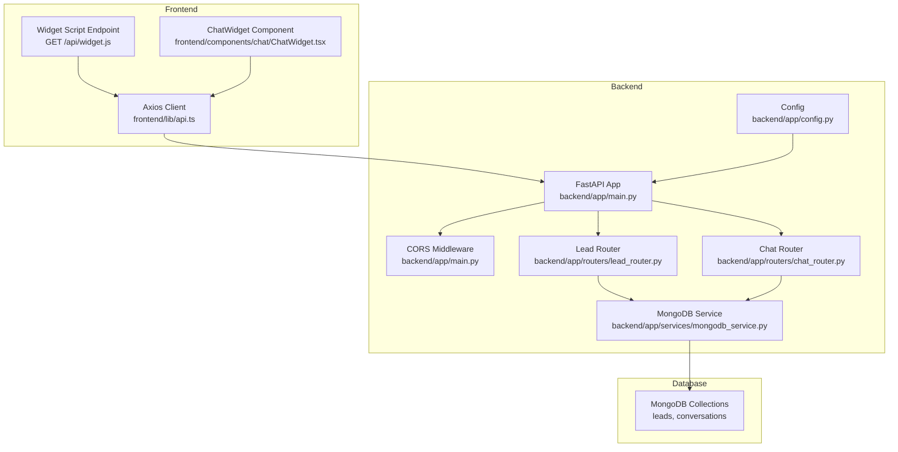
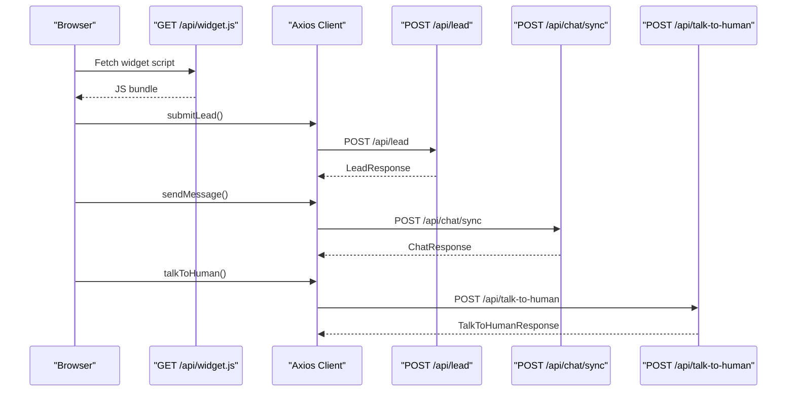
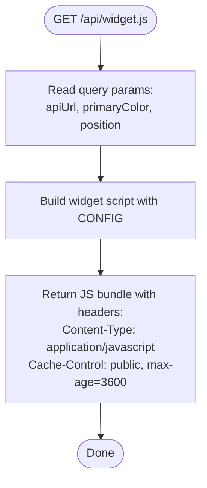
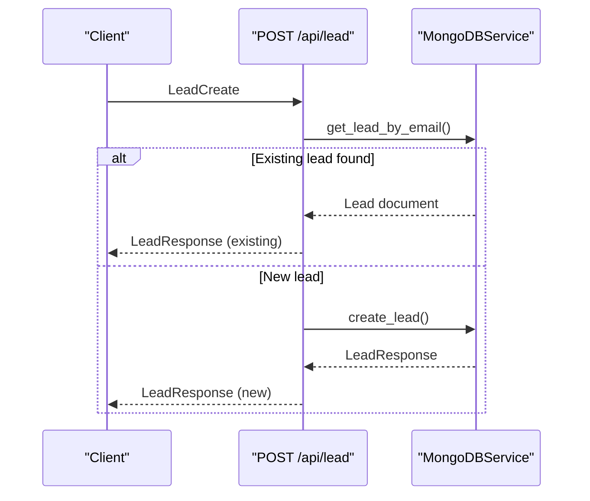
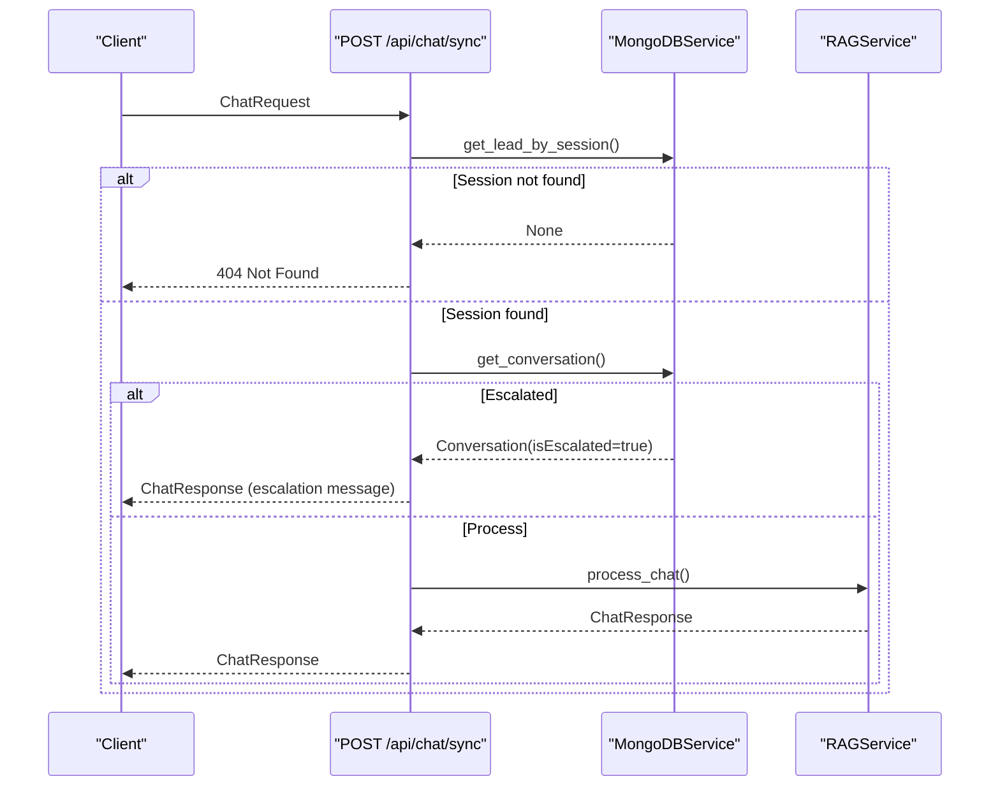
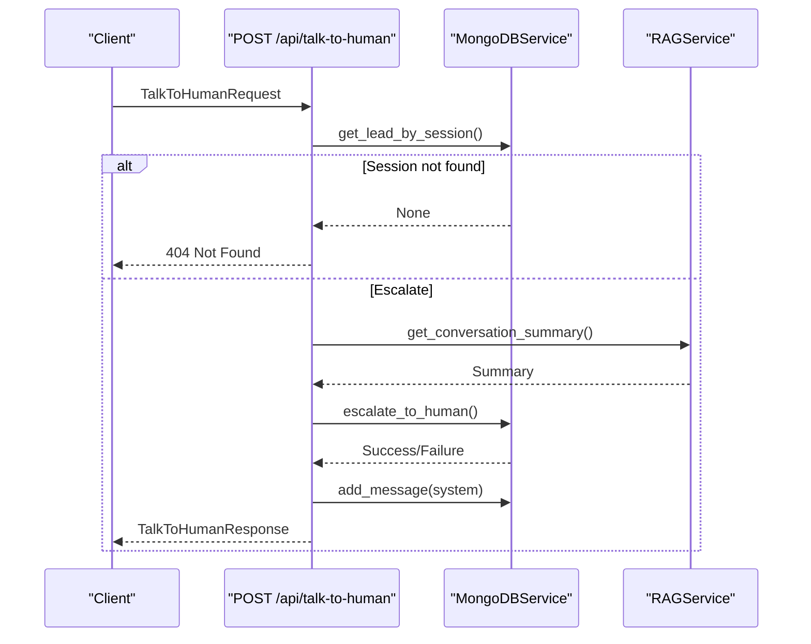
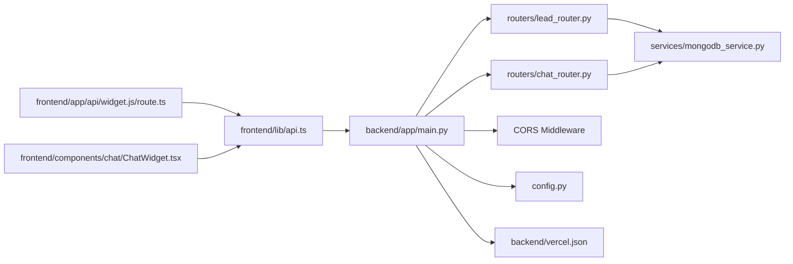

# Widget API Endpoints

<cite>
**Referenced Files in This Document**
- [main.py](file://backend/app/main.py)
- [config.py](file://backend/app/config.py)
- [chat_router.py](file://backend/app/routers/chat_router.py)
- [lead_router.py](file://backend/app/routers/lead_router.py)
- [chat.py](file://backend/app/models/chat.py)
- [lead.py](file://backend/app/models/lead.py)
- [conversation.py](file://backend/app/models/conversation.py)
- [mongodb_service.py](file://backend/app/services/mongodb_service.py)
- [route.ts](file://frontend/app/api/widget.js/route.ts)
- [api.ts](file://frontend/lib/api.ts)
- [ChatWidget.tsx](file://frontend/components/chat/ChatWidget.tsx)
- [vercel.json](file://backend/vercel.json)
</cite>

## Table of Contents
1. [Introduction](#introduction)
2. [Project Structure](#project-structure)
3. [Core Components](#core-components)
4. [Architecture Overview](#architecture-overview)
5. [Detailed Component Analysis](#detailed-component-analysis)
6. [Dependency Analysis](#dependency-analysis)
7. [Performance Considerations](#performance-considerations)
8. [Troubleshooting Guide](#troubleshooting-guide)
9. [Conclusion](#conclusion)

## Introduction
This document provides comprehensive API documentation for the widget-server communication endpoints used by the chat widget. It covers:
- Widget generation endpoint that serves the client-side widget script
- Lead submission endpoint for initiating a chat session
- Chat message processing endpoint with RAG
- Human escalation endpoint
- Request/response schemas, authentication, error handling, CORS, security headers, rate limiting considerations, and API versioning strategy

## Project Structure
The system consists of:
- Backend (FastAPI) exposing REST endpoints under /api
- Frontend Next.js app serving the widget script and client-side API calls
- MongoDB for persistence of leads and conversations
- Optional Vercel deployment configuration

**Diagram sources**
- [main.py:39-85](file://backend/app/main.py#L39-L85)
- [config.py:7-64](file://backend/app/config.py#L7-L64)
- [lead_router.py:1-57](file://backend/app/routers/lead_router.py#L1-L57)
- [chat_router.py:1-130](file://backend/app/routers/chat_router.py#L1-L130)
- [mongodb_service.py:13-202](file://backend/app/services/mongodb_service.py#L13-L202)
- [route.ts:1-347](file://frontend/app/api/widget.js/route.ts#L1-L347)
- [api.ts:1-93](file://frontend/lib/api.ts#L1-L93)
- [ChatWidget.tsx:1-307](file://frontend/components/chat/ChatWidget.tsx#L1-L307)

**Section sources**
- [main.py:39-85](file://backend/app/main.py#L39-L85)
- [config.py:7-64](file://backend/app/config.py#L7-L64)
- [route.ts:1-347](file://frontend/app/api/widget.js/route.ts#L1-L347)
- [api.ts:1-93](file://frontend/lib/api.ts#L1-L93)
- [ChatWidget.tsx:1-307](file://frontend/components/chat/ChatWidget.tsx#L1-L307)

## Core Components
- Widget generation endpoint: GET /api/widget.js
- Lead submission endpoint: POST /api/lead
- Chat sync endpoint: POST /api/chat/sync
- Human escalation endpoint: POST /api/talk-to-human
- Conversation retrieval endpoint: GET /api/conversation/{session_id}

These endpoints are exposed by the FastAPI application configured with CORS middleware and served via Vercel.

**Section sources**
- [main.py:39-85](file://backend/app/main.py#L39-L85)
- [chat_router.py:12-129](file://backend/app/routers/chat_router.py#L12-L129)
- [lead_router.py:11-56](file://backend/app/routers/lead_router.py#L11-L56)
- [vercel.json:1-22](file://backend/vercel.json#L1-L22)

## Architecture Overview
The widget is dynamically generated server-side and returned as a JavaScript bundle. The frontend client (Next.js) either embeds this script or consumes it via the widget endpoint. Client-side code sends requests to backend endpoints for lead creation, chat, and escalation.

**Diagram sources**
- [route.ts:3-347](file://frontend/app/api/widget.js/route.ts#L3-L347)
- [api.ts:61-80](file://frontend/lib/api.ts#L61-L80)
- [lead_router.py:11-44](file://backend/app/routers/lead_router.py#L11-L44)
- [chat_router.py:12-117](file://backend/app/routers/chat_router.py#L12-L117)

## Detailed Component Analysis

### Widget Generation Endpoint: GET /api/widget.js
- Purpose: Serve the client-side widget script as a JavaScript bundle.
- Behavior:
  - Reads query parameters for apiUrl, primaryColor, and position.
  - Generates a self-contained widget script that manages session storage, lead form, chat UI, and API calls.
  - Returns the script with appropriate caching headers.
- Response:
  - Content-Type: application/javascript
  - Cache-Control: public, max-age=3600
- Notes:
  - The widget script constructs API URLs using the apiUrl parameter and performs fetch calls to /api/lead, /api/chat/sync, and /api/talk-to-human.

**Diagram sources**
- [route.ts:3-347](file://frontend/app/api/widget.js/route.ts#L3-L347)

**Section sources**
- [route.ts:3-347](file://frontend/app/api/widget.js/route.ts#L3-L347)

### Lead Submission: POST /api/lead
- Purpose: Create a new lead and initialize a chat session.
- Request Schema (LeadCreate):
  - fullName: string (2-100 chars)
  - email: email string
  - phone: string (validated Saudi phone formats)
  - company: optional string
  - inquiryType: optional enumeration
- Response Schema (LeadResponse):
  - success: boolean
  - sessionId: string
  - message: string
  - lead: optional object containing session info and timestamps
- Behavior:
  - Validates lead data (including phone number format).
  - Checks for existing lead with the same email; if found, returns existing session.
  - Creates a new session ID and stores lead data.
  - Initializes an empty conversation record.
- Error Handling:
  - On failure, returns HTTP 500 with error message.

**Diagram sources**
- [lead_router.py:11-44](file://backend/app/routers/lead_router.py#L11-L44)
- [mongodb_service.py:51-77](file://backend/app/services/mongodb_service.py#L51-L77)

**Section sources**
- [lead_router.py:11-44](file://backend/app/routers/lead_router.py#L11-L44)
- [lead.py:18-64](file://backend/app/models/lead.py#L18-L64)
- [mongodb_service.py:51-77](file://backend/app/services/mongodb_service.py#L51-L77)

### Chat Message Processing: POST /api/chat/sync
- Purpose: Process a user message synchronously using RAG.
- Request Schema (ChatRequest):
  - sessionId: string
  - message: string (1-2000 chars)
  - context: optional string
- Response Schema (ChatResponse):
  - response: string (AI-generated reply)
  - sessionId: string
  - timestamp: ISO datetime
  - sources: optional array of source documents (content, source, title, score)
  - model: string (default gemini-2.5-flash)
- Behavior:
  - Validates session existence.
  - Checks if conversation is escalated; if so, returns escalation message.
  - Processes chat via RAG pipeline and returns response.
- Error Handling:
  - On invalid session: HTTP 404.
  - On internal errors: HTTP 500.

**Diagram sources**
- [chat_router.py:12-55](file://backend/app/routers/chat_router.py#L12-L55)
- [mongodb_service.py:79-115](file://backend/app/services/mongodb_service.py#L79-L115)
- [chat.py:7-28](file://backend/app/models/chat.py#L7-L28)

**Section sources**
- [chat_router.py:12-55](file://backend/app/routers/chat_router.py#L12-L55)
- [chat.py:7-28](file://backend/app/models/chat.py#L7-L28)
- [mongodb_service.py:79-115](file://backend/app/services/mongodb_service.py#L79-L115)

### Human Escalation: POST /api/talk-to-human
- Purpose: Escalate a conversation to a human agent.
- Request Schema (TalkToHumanRequest):
  - sessionId: string
  - notes: optional string (max 500 chars)
  - urgency: string (default normal)
- Response Schema (TalkToHumanResponse):
  - success: boolean
  - sessionId: string
  - message: string
  - estimatedResponseTime: string (default Within 24 hours)
  - ticketId: optional string (first 8 chars of sessionId uppercase)
- Behavior:
  - Validates session existence.
  - Generates escalation notes combining provided notes and conversation summary.
  - Marks conversation as escalated and adds a system message.
- Error Handling:
  - On invalid session: HTTP 404.
  - On escalation failure: HTTP 500.

**Diagram sources**
- [chat_router.py:58-117](file://backend/app/routers/chat_router.py#L58-L117)
- [mongodb_service.py:161-180](file://backend/app/services/mongodb_service.py#L161-L180)
- [chat.py:31-45](file://backend/app/models/chat.py#L31-L45)

**Section sources**
- [chat_router.py:58-117](file://backend/app/routers/chat_router.py#L58-L117)
- [chat.py:31-45](file://backend/app/models/chat.py#L31-L45)
- [mongodb_service.py:161-180](file://backend/app/services/mongodb_service.py#L161-L180)

### Conversation Retrieval: GET /api/conversation/{session_id}
- Purpose: Retrieve conversation history by session ID.
- Response: Full conversation object including messages, timestamps, escalation status, and notes.
- Error Handling:
  - On missing conversation: HTTP 404.

**Section sources**
- [chat_router.py:120-129](file://backend/app/routers/chat_router.py#L120-L129)
- [conversation.py:23-53](file://backend/app/models/conversation.py#L23-L53)

## Dependency Analysis
- Frontend depends on:
  - Axios client for HTTP calls
  - Widget endpoint for dynamic script injection
  - React components for UI rendering
- Backend depends on:
  - MongoDB service for persistence
  - RAG service for chat processing
  - CORS middleware for cross-origin support
- Deployment:
  - Vercel routes all requests to the FastAPI app

**Diagram sources**
- [api.ts:61-80](file://frontend/lib/api.ts#L61-L80)
- [route.ts:3-347](file://frontend/app/api/widget.js/route.ts#L3-L347)
- [ChatWidget.tsx:84-170](file://frontend/components/chat/ChatWidget.tsx#L84-L170)
- [main.py:39-85](file://backend/app/main.py#L39-L85)
- [lead_router.py:11-44](file://backend/app/routers/lead_router.py#L11-L44)
- [chat_router.py:12-117](file://backend/app/routers/chat_router.py#L12-L117)
- [mongodb_service.py:13-202](file://backend/app/services/mongodb_service.py#L13-L202)
- [config.py:7-64](file://backend/app/config.py#L7-L64)
- [vercel.json:1-22](file://backend/vercel.json#L1-L22)

**Section sources**
- [api.ts:61-80](file://frontend/lib/api.ts#L61-L80)
- [route.ts:3-347](file://frontend/app/api/widget.js/route.ts#L3-L347)
- [ChatWidget.tsx:84-170](file://frontend/components/chat/ChatWidget.tsx#L84-L170)
- [main.py:39-85](file://backend/app/main.py#L39-L85)
- [lead_router.py:11-44](file://backend/app/routers/lead_router.py#L11-L44)
- [chat_router.py:12-117](file://backend/app/routers/chat_router.py#L12-L117)
- [mongodb_service.py:13-202](file://backend/app/services/mongodb_service.py#L13-L202)
- [config.py:7-64](file://backend/app/config.py#L7-L64)
- [vercel.json:1-22](file://backend/vercel.json#L1-L22)

## Performance Considerations
- Caching:
  - The widget endpoint sets Cache-Control to cache the script for 1 hour.
- Database indexing:
  - MongoDB collections have indexes on session IDs, emails, phones, and timestamps to optimize lookups.
- RAG pipeline:
  - Chat processing relies on vector similarity retrieval; ensure Pinecone and embedding services are properly initialized.
- Concurrency:
  - Chat endpoint validates session and escalations before processing to avoid unnecessary computation.

[No sources needed since this section provides general guidance]

## Troubleshooting Guide
Common error scenarios and resolutions:
- Session not found (HTTP 404):
  - Ensure the lead was submitted first to obtain a valid sessionId.
  - Verify the sessionId is present in local storage and not expired.
- Chat processing error (HTTP 500):
  - Check backend health endpoint and service initialization.
  - Confirm RAG and vector store connectivity.
- Escalation failure (HTTP 500):
  - Validate session existence and that the conversation is not already escalated.
- CORS issues:
  - Confirm CORS origins are configured to allow the frontend origin.
- Widget not loading:
  - Verify the widget endpoint responds with application/javascript and appropriate cache headers.

**Section sources**
- [chat_router.py:27-55](file://backend/app/routers/chat_router.py#L27-L55)
- [chat_router.py:71-117](file://backend/app/routers/chat_router.py#L71-L117)
- [main.py:50-57](file://backend/app/main.py#L50-L57)
- [mongodb_service.py:36-47](file://backend/app/services/mongodb_service.py#L36-L47)

## Conclusion
The widget-server communication endpoints provide a cohesive chat experience with lead capture, synchronous RAG-powered messaging, and human escalation. The system is designed with clear request/response schemas, robust error handling, CORS support, and caching for the widget script. For production deployments, monitor health endpoints, ensure proper CORS configuration, and consider implementing rate limiting at the gateway or ingress layer if needed.