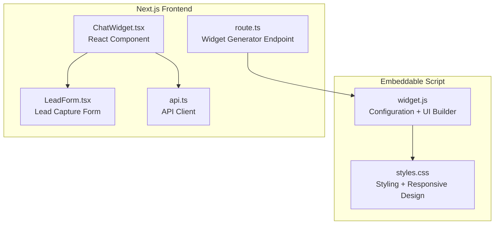
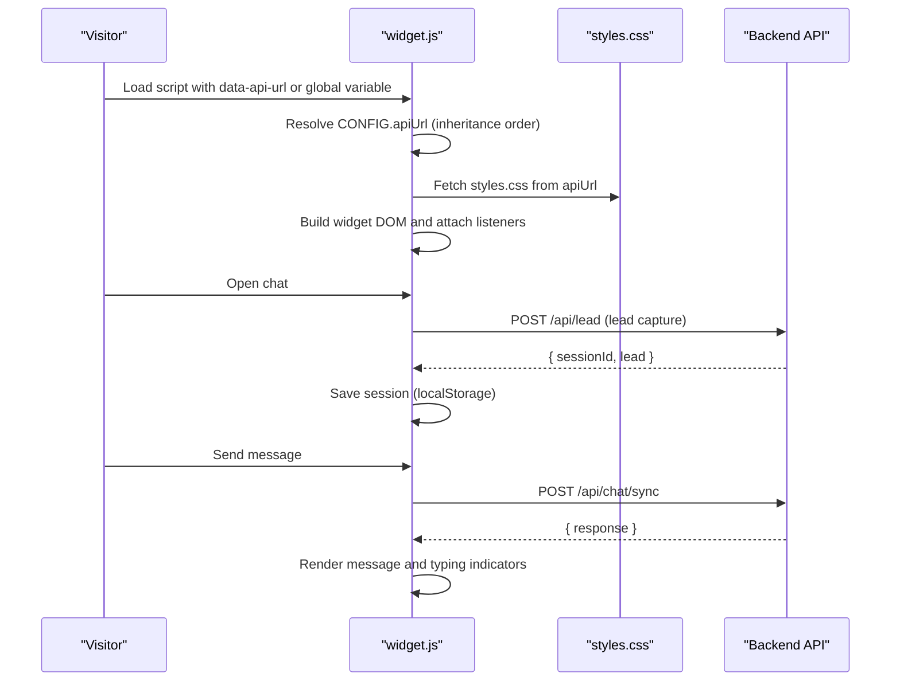
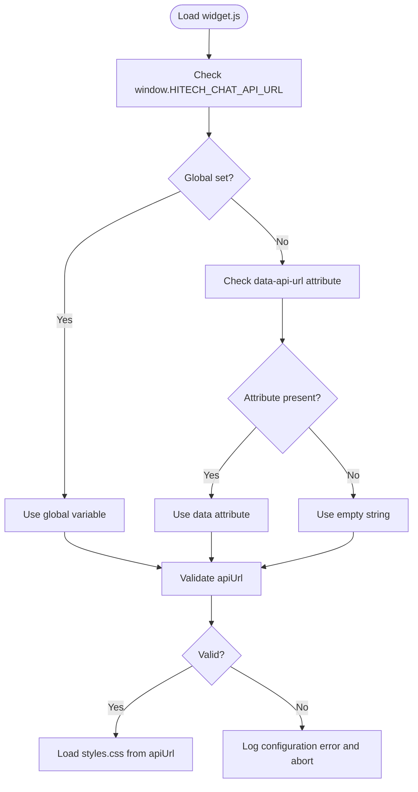
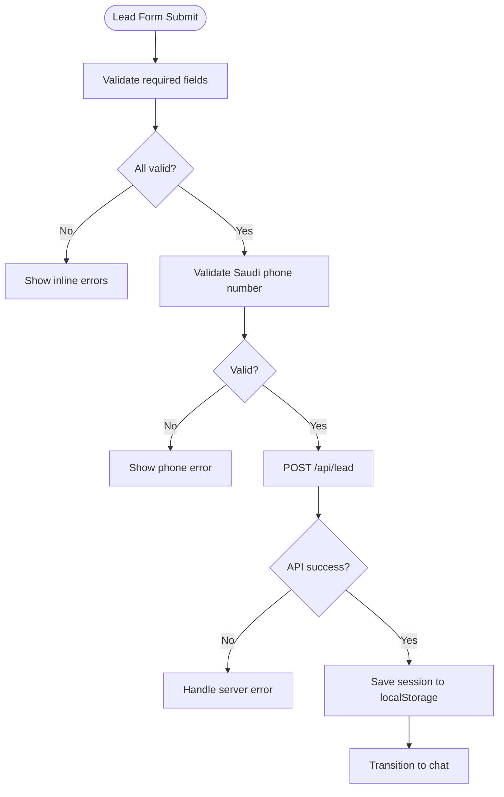
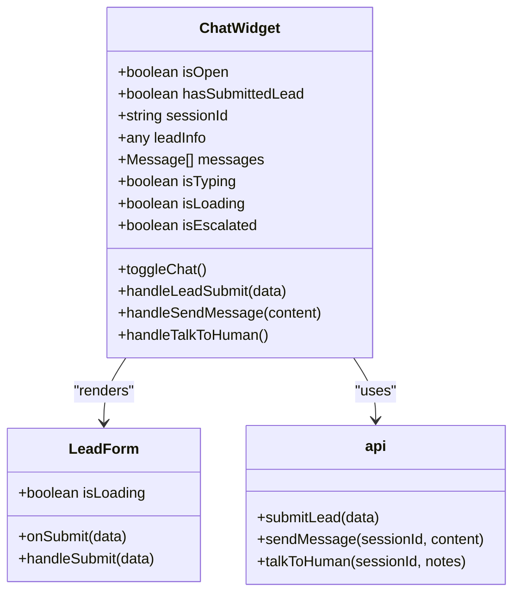
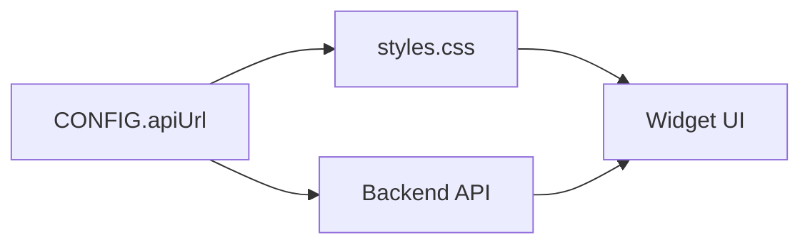

# Widget Configuration

<cite>
**Referenced Files in This Document**
- [widget.js](file://widget.js)
- [styles.css](file://styles.css)
- [index.html](file://index.html)
- [frontend/components/chat/ChatWidget.tsx](file://frontend/components/chat/ChatWidget.tsx)
- [frontend/components/chat/LeadForm.tsx](file://frontend/components/chat/LeadForm.tsx)
- [frontend/lib/api.ts](file://frontend/lib/api.ts)
- [frontend/app/api/widget.js/route.ts](file://frontend/app/api/widget.js/route.ts)
</cite>

## Table of Contents
1. [Introduction](#introduction)
2. [Project Structure](#project-structure)
3. [Core Components](#core-components)
4. [Architecture Overview](#architecture-overview)
5. [Detailed Component Analysis](#detailed-component-analysis)
6. [Dependency Analysis](#dependency-analysis)
7. [Performance Considerations](#performance-considerations)
8. [Troubleshooting Guide](#troubleshooting-guide)
9. [Conclusion](#conclusion)

## Introduction
This document provides comprehensive guidance for configuring and customizing the Hitech Steel Industries chat widget. It covers all configurable properties, inheritance order, dynamic configuration via global variables, CSS custom properties for styling, responsive design considerations, mobile optimization, validation rules, default fallback values, and error handling strategies.

## Project Structure
The widget exists in two primary forms:
- A standalone embeddable script that dynamically builds the widget and loads styles from the configured API endpoint.
- A React-based embedded version integrated into the Next.js frontend application.

**Diagram sources**
- [widget.js:14-27](file://widget.js#L14-L27)
- [styles.css:10-42](file://styles.css#L10-L42)
- [frontend/components/chat/ChatWidget.tsx:27-306](file://frontend/components/chat/ChatWidget.tsx#L27-L306)
- [frontend/components/chat/LeadForm.tsx:28-167](file://frontend/components/chat/LeadForm.tsx#L28-L167)
- [frontend/lib/api.ts:4-65](file://frontend/lib/api.ts#L4-L65)
- [frontend/app/api/widget.js/route.ts:3-346](file://frontend/app/api/widget.js/route.ts#L3-L346)

**Section sources**
- [widget.js:14-27](file://widget.js#L14-L27)
- [styles.css:10-42](file://styles.css#L10-L42)
- [frontend/components/chat/ChatWidget.tsx:27-306](file://frontend/components/chat/ChatWidget.tsx#L27-L306)
- [frontend/components/chat/LeadForm.tsx:28-167](file://frontend/components/chat/LeadForm.tsx#L28-L167)
- [frontend/lib/api.ts:4-65](file://frontend/lib/api.ts#L4-L65)
- [frontend/app/api/widget.js/route.ts:3-346](file://frontend/app/api/widget.js/route.ts#L3-L346)

## Core Components
This section documents all configurable properties and their roles in the widget.

- apiUrl
  - Purpose: Backend API base URL used for all chat operations.
  - Inheritance order: data attribute on script tag → global variable → empty default.
  - Dynamic configuration example: Set `window.HITECH_CHAT_API_URL` before loading the script.
  - Validation: Required; initialization fails if unset.
  - Default: Empty string.
  - Error handling: Logs configuration error and aborts widget creation.

- primaryColor
  - Purpose: Primary brand color for gradients and accents.
  - Inheritance: Not configurable via data attributes or global variables; uses hardcoded default.
  - Default: #E30613 (brand red).
  - Usage: Applied to header gradient, buttons, and message backgrounds.

- secondaryColor
  - Purpose: Secondary brand color for accents.
  - Inheritance: Not configurable via data attributes or global variables; uses hardcoded default.
  - Default: #003087 (brand navy).
  - Usage: Used for user message avatars and button borders.

- position
  - Purpose: Floating button and container placement (top/bottom × left/right).
  - Inheritance: Not configurable via data attributes or global variables; uses hardcoded default.
  - Default: bottom-right.
  - Behavior: Controls fixed positioning offsets and alignment.

- companyName
  - Purpose: Company name displayed in the welcome message and UI.
  - Inheritance: Not configurable via data attributes or global variables; uses hardcoded default.
  - Default: Hitech Steel Industries.
  - Usage: Rendered in the welcome message and header.

- botName
  - Purpose: Bot name displayed in the header.
  - Inheritance: Not configurable via data attributes or global variables; uses hardcoded default.
  - Default: Hitech Assistant.
  - Usage: Shown in the chat header.

- welcomeMessage
  - Purpose: Initial greeting shown to users.
  - Inheritance: Not configurable via data attributes or global variables; uses hardcoded default.
  - Default: Generic welcome text.
  - Usage: Displayed as the first message in the chat.

- leadFormTitle
  - Purpose: Lead capture form title.
  - Inheritance: Not configurable via data attributes or global variables; uses hardcoded default.
  - Default: Get Started.
  - Usage: Appears in the lead capture form header.

- leadFormSubtitle
  - Purpose: Lead capture form subtitle.
  - Inheritance: Not configurable via data attributes or global variables; uses hardcoded default.
  - Default: Please provide your details so we can assist you better.
  - Usage: Appears below the title in the lead capture form.

- privacyText
  - Purpose: Privacy policy text displayed under the form.
  - Inheritance: Not configurable via data attributes or global variables; uses hardcoded default.
  - Default: By submitting, you agree to our privacy policy. Your information is secure.
  - Usage: Shown beneath the form submit button.

- showTalkToHuman
  - Purpose: Whether to display the "Talk to Human" option.
  - Inheritance: Not configurable via data attributes or global variables; uses hardcoded default.
  - Default: true.
  - Behavior: Controls visibility of the escalation button in the chat interface.

- sessionTTL
  - Purpose: Session expiration time in milliseconds.
  - Inheritance: Not configurable via data attributes or global variables; uses hardcoded default.
  - Default: 24 hours (86400000 ms).
  - Behavior: Sessions older than TTL are cleared automatically.

**Section sources**
- [widget.js:14-27](file://widget.js#L14-L27)
- [widget.js:834-839](file://widget.js#L834-L839)
- [frontend/app/api/widget.js/route.ts:13-21](file://frontend/app/api/widget.js/route.ts#L13-L21)

## Architecture Overview
The widget architecture supports two deployment modes: embeddable script and embedded React component.

**Diagram sources**
- [widget.js:14-27](file://widget.js#L14-L27)
- [widget.js:841-848](file://widget.js#L841-L848)
- [widget.js:181-202](file://widget.js#L181-L202)
- [widget.js:204-225](file://widget.js#L204-L225)

## Detailed Component Analysis

### Configuration Resolution and Dynamic Setup
The embeddable script resolves configuration in a strict order:
1. data-api-url attribute on the script tag.
2. window.HITECH_CHAT_API_URL global variable.
3. Empty string fallback.

Dynamic configuration example:
- Set `window.HITECH_CHAT_API_URL = 'https://your-api.example.com'` before including the script.
- Include the script with ``.

**Diagram sources**
- [widget.js:14-16](file://widget.js#L14-L16)
- [widget.js:834-839](file://widget.js#L834-L839)

**Section sources**
- [widget.js:14-16](file://widget.js#L14-L16)
- [widget.js:834-839](file://widget.js#L834-L839)

### CSS Custom Properties and Styling
The widget relies on CSS custom properties defined in styles.css for consistent theming:
- Brand colors: --hitech-red, --hitech-red-dark, --hitech-navy, --hitech-navy-dark
- Grayscale palette: --white, --gray-50 to --gray-900
- Semantic colors: --success, --warning, --error
- Shadows and radii: --shadow-sm to --shadow-xl, --radius-sm to --radius-xl

These variables are consumed throughout the stylesheet to apply consistent branding and spacing.

Responsive design considerations:
- Mobile-first breakpoints at 480px adjust container width, height, and paddings.
- Floating button repositions to bottom/right with smaller dimensions on small screens.
- Typography scales appropriately for readability on mobile devices.

**Section sources**
- [styles.css:10-42](file://styles.css#L10-L42)
- [styles.css:173-182](file://styles.css#L173-L182)
- [styles.css:804-820](file://styles.css#L804-L820)

### Validation Rules and Error Handling
Validation and error handling are implemented across multiple layers:

- Lead form validation (embeddable script):
  - Required fields: fullName, email, phone.
  - Email format validation using regex.
  - Saudi phone number validation supporting formats with optional country codes.
  - Real-time validation on blur and input events.
  - Error messages displayed inline with visual indicators.

- API error handling:
  - Network failures are caught and surfaced with user-friendly messages.
  - Server-side errors include structured error fields or generic HTTP status messages.
  - Talk to human escalation displays success or failure states with appropriate messaging.

- Session persistence:
  - Automatic cleanup when sessions exceed TTL.
  - Graceful degradation if localStorage is unavailable.

**Diagram sources**
- [widget.js:539-564](file://widget.js#L539-L564)
- [widget.js:583-641](file://widget.js#L583-L641)
- [widget.js:181-202](file://widget.js#L181-L202)

**Section sources**
- [widget.js:539-564](file://widget.js#L539-L564)
- [widget.js:583-641](file://widget.js#L583-L641)
- [widget.js:181-202](file://widget.js#L181-L202)
- [widget.js:227-248](file://widget.js#L227-L248)

### React-Based Embedded Widget (Next.js)
The embedded React version provides equivalent functionality with TypeScript and modern React patterns:
- Session management mirrors the standalone script using localStorage keys and TTL.
- Lead form uses Zod for runtime validation with user-friendly error messages.
- API client encapsulates backend endpoints for lead submission, chat sync, and escalation.
- UI components are styled using Tailwind classes with consistent spacing and typography.

**Diagram sources**
- [frontend/components/chat/ChatWidget.tsx:27-306](file://frontend/components/chat/ChatWidget.tsx#L27-L306)
- [frontend/components/chat/LeadForm.tsx:28-167](file://frontend/components/chat/LeadForm.tsx#L28-L167)
- [frontend/lib/api.ts:4-65](file://frontend/lib/api.ts#L4-L65)

**Section sources**
- [frontend/components/chat/ChatWidget.tsx:27-306](file://frontend/components/chat/ChatWidget.tsx#L27-L306)
- [frontend/components/chat/LeadForm.tsx:28-167](file://frontend/components/chat/LeadForm.tsx#L28-L167)
- [frontend/lib/api.ts:4-65](file://frontend/lib/api.ts#L4-L65)

## Dependency Analysis
The widget depends on:
- Configuration resolution via data attributes and global variables.
- External styles loaded from the configured API endpoint.
- Backend endpoints for lead capture, chat synchronization, and human escalation.

**Diagram sources**
- [widget.js:14-16](file://widget.js#L14-L16)
- [widget.js:841-848](file://widget.js#L841-L848)

**Section sources**
- [widget.js:14-16](file://widget.js#L14-L16)
- [widget.js:841-848](file://widget.js#L841-L848)

## Performance Considerations
- Session persistence uses localStorage to avoid repeated lead capture on subsequent visits.
- Message history is capped during rendering to maintain performance.
- CSS custom properties enable efficient theming without recalculating styles.
- Responsive breakpoints minimize layout thrashing on mobile devices.

## Troubleshooting Guide
Common configuration and runtime issues:
- API URL not configured: The widget logs a configuration error and does not initialize. Ensure either the data attribute or global variable is set before loading the script.
- Network connectivity issues: API calls surface user-friendly messages indicating network problems.
- Session expiration: Sessions older than the TTL are automatically cleared; users will need to re-enter their details.
- Form validation errors: Inline error messages guide users to correct input formats.

**Section sources**
- [widget.js:834-839](file://widget.js#L834-L839)
- [widget.js:196-201](file://widget.js#L196-L201)
- [widget.js:237-247](file://widget.js#L237-L247)
- [widget.js:633-641](file://widget.js#L633-L641)

## Conclusion
The widget offers flexible configuration through data attributes and global variables, robust validation, and a cohesive theming system powered by CSS custom properties. Its responsive design ensures optimal usability across devices, while session management and error handling provide a reliable user experience. For advanced customization, leverage the CSS variables and ensure proper configuration of the apiUrl to integrate seamlessly with your backend infrastructure.