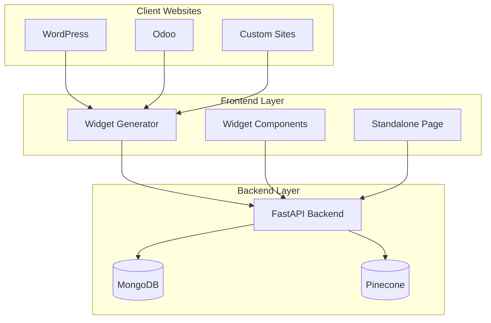
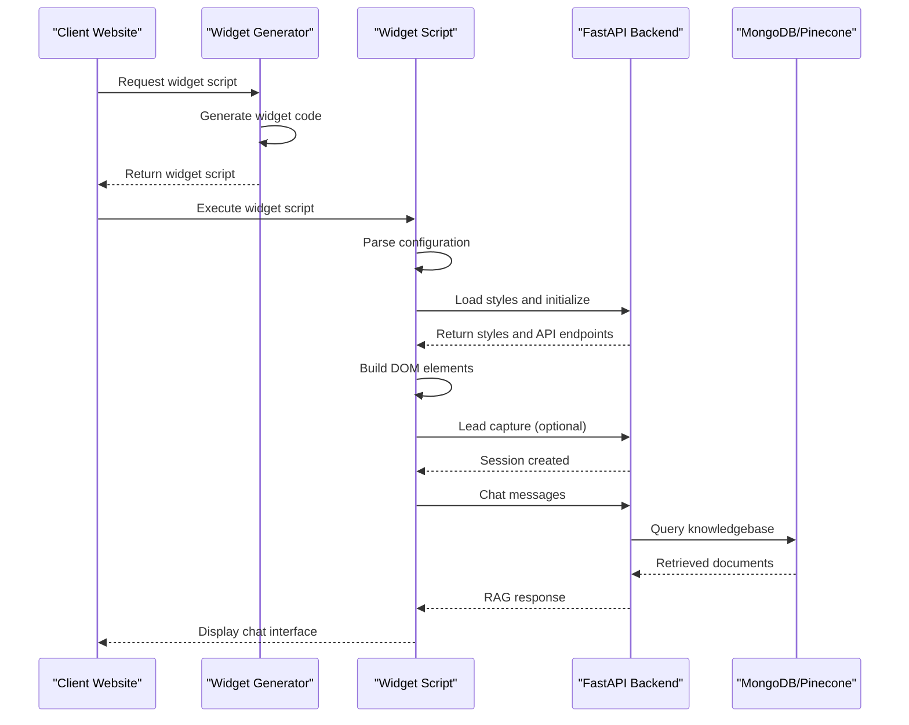
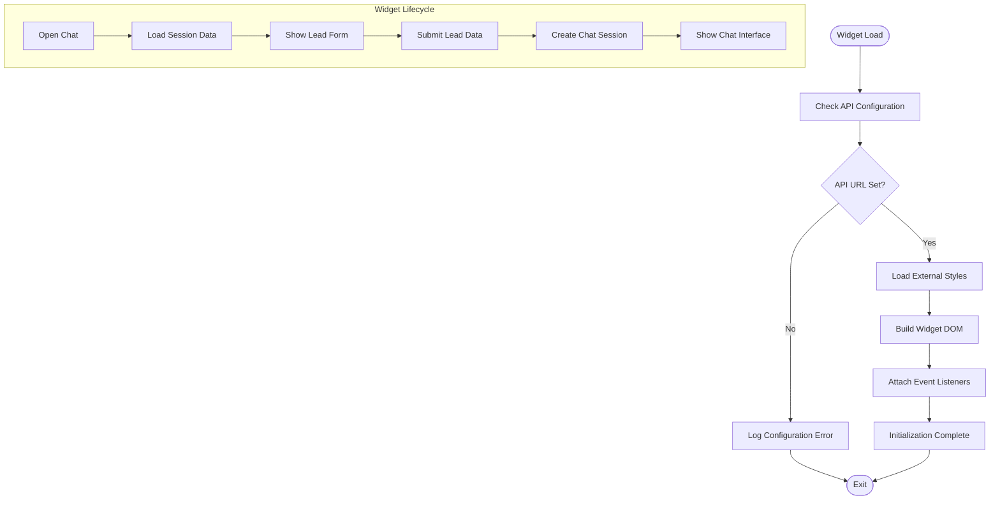
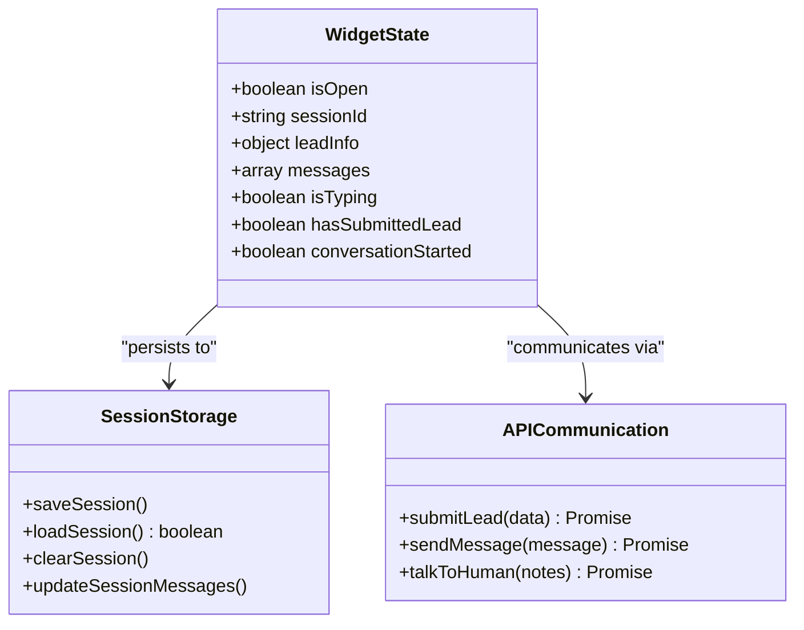

# Widget Integration Guide

<cite>
**Referenced Files in This Document**
- [widget.js](file://widget.js)
- [frontend/app/api/widget.js/route.ts](file://frontend/app/api/widget.js/route.ts)
- [index.html](file://index.html)
- [styles.css](file://styles.css)
- [frontend/components/chat/ChatWidget.tsx](file://frontend/components/chat/ChatWidget.tsx)
- [frontend/lib/api.ts](file://frontend/lib/api.ts)
- [backend/app/main.py](file://backend/app/main.py)
- [backend/app/config.py](file://backend/app/config.py)
- [README.md](file://README.md)
</cite>

## Table of Contents
1. [Introduction](#introduction)
2. [Project Structure](#project-structure)
3. [Core Components](#core-components)
4. [Architecture Overview](#architecture-overview)
5. [Detailed Component Analysis](#detailed-component-analysis)
6. [Integration Methods](#integration-methods)
7. [Widget Positioning and Styling](#widget-positioning-and-styling)
8. [Cross-Origin Communication](#cross-origin-communication)
9. [Security Considerations](#security-considerations)
10. [Performance Optimization](#performance-optimization)
11. [Troubleshooting Guide](#troubleshooting-guide)
12. [Best Practices](#best-practices)
13. [Conclusion](#conclusion)

## Introduction
This guide provides comprehensive documentation for integrating the embeddable widget system used by Hitech Steel Industries. The widget offers a production-ready RAG (Retrieval-Augmented Generation) chatbot with lead capture capabilities, designed to be embedded into various website platforms including WordPress, Odoo, and custom websites.

The system consists of three main components:
- **Backend API**: FastAPI service handling chat functionality, lead capture, and knowledgebase operations
- **Frontend Widget Generator**: Dynamic script generation service that creates embeddable widgets
- **Client Integration**: Multiple integration methods for different website platforms

## Project Structure
The widget system follows a modular architecture with clear separation of concerns:



**Diagram sources**
- [README.md:135-164](file://README.md#L135-L164)
- [frontend/app/api/widget.js/route.ts:1-347](file://frontend/app/api/widget.js/route.ts#L1-L347)

**Section sources**
- [README.md:64-99](file://README.md#L64-L99)

## Core Components

### Widget Script Engine
The core widget functionality is implemented in a self-contained JavaScript module that handles:
- Configuration parsing from data attributes
- DOM manipulation and widget construction
- Session persistence using localStorage
- Real-time chat communication with backend APIs
- Form validation and error handling

### Widget Generator Service
The frontend provides a dynamic widget generation service that:
- Accepts configuration parameters via URL query strings
- Generates optimized widget code with embedded styles
- Supports runtime customization of colors and positioning
- Handles cross-origin resource loading

### Styling System
The widget uses a comprehensive CSS system with:
- Brand-consistent color schemes (Hitech red #E30613, navy blue #003087)
- Responsive design for mobile and desktop
- Smooth animations and transitions
- Accessible color contrast ratios

**Section sources**
- [widget.js:14-27](file://widget.js#L14-L27)
- [frontend/app/api/widget.js/route.ts:13-21](file://frontend/app/api/widget.js/route.ts#L13-L21)
- [styles.css:10-42](file://styles.css#L10-L42)

## Architecture Overview



**Diagram sources**
- [frontend/app/api/widget.js/route.ts:3-346](file://frontend/app/api/widget.js/route.ts#L3-L346)
- [widget.js:834-863](file://widget.js#L834-L863)

## Detailed Component Analysis

### Widget Initialization Process



**Diagram sources**
- [widget.js:834-863](file://widget.js#L834-L863)
- [widget.js:483-504](file://widget.js#L483-L504)

### Session Management Architecture



**Diagram sources**
- [widget.js:32-40](file://widget.js#L32-L40)
- [widget.js:47-122](file://widget.js#L47-L122)
- [widget.js:181-248](file://widget.js#L181-L248)

**Section sources**
- [widget.js:47-122](file://widget.js#L47-L122)
- [widget.js:181-248](file://widget.js#L181-L248)

## Integration Methods

### WordPress Integration

#### Basic Integration
Add the widget script to your WordPress theme's footer or use a plugin:

```html
<script src="https://your-frontend.vercel.app/api/widget.js?apiUrl=https://your-backend.vercel.app"></script>
```

#### Advanced Configuration
For custom positioning and branding:

```html
<script 
    src="https://your-frontend.vercel.app/api/widget.js?apiUrl=https://your-backend.vercel.app&primaryColor=#E30613&position=top-right"
    data-api-url="https://your-backend.vercel.app">
</script>
```

#### Plugin-Based Approach
Use the "Insert Headers and Footers" plugin to add the script to your site's header/footer.

### Odoo Integration

#### Website Template Integration
Add the widget to your Odoo website template:

```xml
<template id="website.layout">
    <xpath expr="//head" position="inside">
        <script src="https://your-frontend.vercel.app/api/widget.js?apiUrl=https://your-backend.vercel.app"/>
    </xpath>
</template>
```

#### E-commerce Integration
For product pages, integrate the widget with custom positioning:

```xml
<template id="product.template">
    <xpath expr="//div[@id='product_images']" position="after">
        <script src="https://your-frontend.vercel.app/api/widget.js?apiUrl=https://your-backend.vercel.app&position=bottom-left"/>
    </xpath>
</template>
```

### Custom Website Integration

#### Standard Implementation
Basic integration for any custom website:

```html
<!DOCTYPE html>
<html>
<head>
    <title>My Website</title>
</head>
<body>
    <!-- Your website content -->
    
    <script src="https://your-frontend.vercel.app/api/widget.js?apiUrl=https://your-backend.vercel.app"></script>
</body>
</html>
```

#### Advanced Implementation
With custom styling and positioning:

```html
<!DOCTYPE html>
<html>
<head>
    <title>My Website</title>
    <script>
        // Global configuration
        window.HITECH_CHAT_API_URL = 'https://your-backend.vercel.app';
        window.HITECH_CHAT_PRIMARY_COLOR = '#E30613';
        window.HITECH_CHAT_POSITION = 'top-right';
    </script>
</head>
<body>
    <!-- Your website content -->
    
    <script src="https://your-frontend.vercel.app/api/widget.js"></script>
</body>
</html>
```

**Section sources**
- [README.md:137-164](file://README.md#L137-L164)

## Widget Positioning and Styling

### Positioning Options
The widget supports four positioning configurations:

| Position | CSS Properties | Description |
|----------|----------------|-------------|
| `bottom-right` | `bottom: 24px; right: 24px` | Default position |
| `bottom-left` | `bottom: 24px; left: 24px` | Left-side bottom placement |
| `top-right` | `top: 24px; right: 24px` | Right-side top placement |
| `top-left` | `top: 24px; left: 24px` | Left-side top placement |

### Color Customization
The widget supports extensive color customization through CSS variables:

```css
:root {
    --hitech-red: #E30613;           /* Primary red */
    --hitech-red-dark: #C00510;       /* Darker red */
    --hitech-navy: #003087;          /* Secondary blue */
    --hitech-navy-dark: #002266;      /* Darker blue */
    --white: #FFFFFF;
    --gray-50: #F8F9FA;
    --gray-100: #F1F3F4;
    --success: #34A853;
    --error: #EA4335;
}
```

### Responsive Design
The widget automatically adapts to different screen sizes:

```css
@media (max-width: 480px) {
    .hitech-chat-container {
        width: calc(100% - 32px);
        height: calc(100% - 120px);
        bottom: 100px;
        left: 16px;
        right: 16px;
    }
}
```

**Section sources**
- [styles.css:66-182](file://styles.css#L66-L182)
- [styles.css:184-800](file://styles.css#L184-L800)

## Cross-Origin Communication

### CORS Configuration
The backend implements comprehensive CORS policies to support widget embedding:

```python
# Backend CORS configuration
app.add_middleware(
    CORSMiddleware,
    allow_origins=settings.cors_origins_list,
    allow_credentials=True,
    allow_methods=["*"],
    allow_headers=["*"],
)
```

### Security Headers
The widget generator includes security-conscious defaults:
- Content Security Policy compliance
- Secure HTTPS delivery
- Subresource Integrity (SRI) support
- Cross-site scripting prevention

### API Communication
The widget communicates with the backend through secure HTTPS endpoints:
- `/api/lead` - Lead capture and session creation
- `/api/chat/sync` - Real-time chat responses
- `/api/talk-to-human` - Human escalation requests

**Section sources**
- [backend/app/main.py:50-57](file://backend/app/main.py#L50-L57)
- [frontend/lib/api.ts:61-80](file://frontend/lib/api.ts#L61-L80)

## Security Considerations

### Input Validation
The widget implements comprehensive input validation:
- Email format validation
- Saudi phone number validation
- XSS prevention through HTML escaping
- Input sanitization

### Session Security
- 24-hour session timeout
- LocalStorage encryption considerations
- Session data expiration
- CSRF protection for form submissions

### Privacy Compliance
- GDPR-compliant data handling
- Data retention policies
- User consent mechanisms
- Privacy policy integration

### Content Security
- Trusted script sources only
- Sandboxed iframe support
- Content filtering
- Malicious content detection

**Section sources**
- [widget.js:158-176](file://widget.js#L158-L176)
- [widget.js:539-581](file://widget.js#L539-L581)

## Performance Optimization

### Lazy Loading
The widget implements lazy loading strategies:
- Deferred script execution
- Conditional CSS loading
- On-demand API calls
- Optimized image loading

### Caching Strategies
- Browser caching for static assets
- API response caching
- Session data persistence
- CDN optimization

### Resource Management
- Memory-efficient DOM manipulation
- Event listener cleanup
- Animation performance optimization
- Network request batching

### Mobile Optimization
- Touch-friendly interface
- Reduced bandwidth usage
- Battery life optimization
- Offline capability support

**Section sources**
- [widget.js:841-848](file://widget.js#L841-L848)
- [frontend/components/chat/ChatWidget.tsx:38-82](file://frontend/components/chat/ChatWidget.tsx#L38-L82)

## Troubleshooting Guide

### Common Integration Issues

#### Widget Not Appearing
**Symptoms**: Widget script loads but no chat button appears
**Solutions**:
1. Verify API URL configuration
2. Check browser console for errors
3. Ensure proper script placement in HTML
4. Test with browser developer tools

#### Styling Issues
**Symptoms**: Widget displays but looks incorrect
**Solutions**:
1. Verify CSS loading from backend
2. Check for conflicting styles
3. Ensure proper CSS specificity
4. Test in incognito mode

#### Chat Functionality Problems
**Symptoms**: Widget appears but chat doesn't work
**Solutions**:
1. Verify backend API connectivity
2. Check CORS configuration
3. Test API endpoints independently
4. Review network tab for errors

### Debugging Tools

#### Console Commands
```javascript
// Check widget state
console.log(window.HitechChatWidget.getSession());

// Control widget programmatically
window.HitechChatWidget.open();
window.HitechChatWidget.close();
window.HitechChatWidget.clearSession();
```

#### Network Monitoring
Monitor these endpoints:
- `/api/widget.js` - Widget script generation
- `/api/lead` - Lead submission
- `/api/chat/sync` - Chat responses
- `/api/talk-to-human` - Human escalation

**Section sources**
- [widget.js:865-892](file://widget.js#L865-L892)

## Best Practices

### Placement Guidelines
- Place widget in non-intrusive locations
- Ensure accessibility compliance
- Test on multiple devices and browsers
- Consider user experience impact

### Performance Best Practices
- Minimize widget script size
- Use CDN for asset delivery
- Implement proper caching
- Monitor loading performance

### Maintenance Practices
- Regular backend health checks
- Monitor API response times
- Track user engagement metrics
- Review error logs regularly

### Testing Recommendations
- Test on various website platforms
- Verify cross-browser compatibility
- Test mobile responsiveness
- Validate accessibility standards

### Monitoring and Analytics
- Track widget usage statistics
- Monitor conversion rates
- Analyze user feedback
- Measure customer satisfaction

## Conclusion

The Hitech RAG chatbot widget system provides a robust, production-ready solution for embedding intelligent chat functionality into various website platforms. Its modular architecture, comprehensive styling system, and extensive customization options make it suitable for diverse integration scenarios.

Key strengths include:
- **Universal Compatibility**: Works across WordPress, Odoo, and custom websites
- **Production-Ready**: Built-in error handling, performance optimization, and security measures
- **Extensible Design**: Easy to customize colors, positioning, and functionality
- **Comprehensive Features**: Lead capture, conversation memory, and human escalation

The system's architecture ensures reliable operation while maintaining flexibility for different deployment scenarios. Proper implementation following these guidelines will result in a seamless user experience and effective customer support integration.