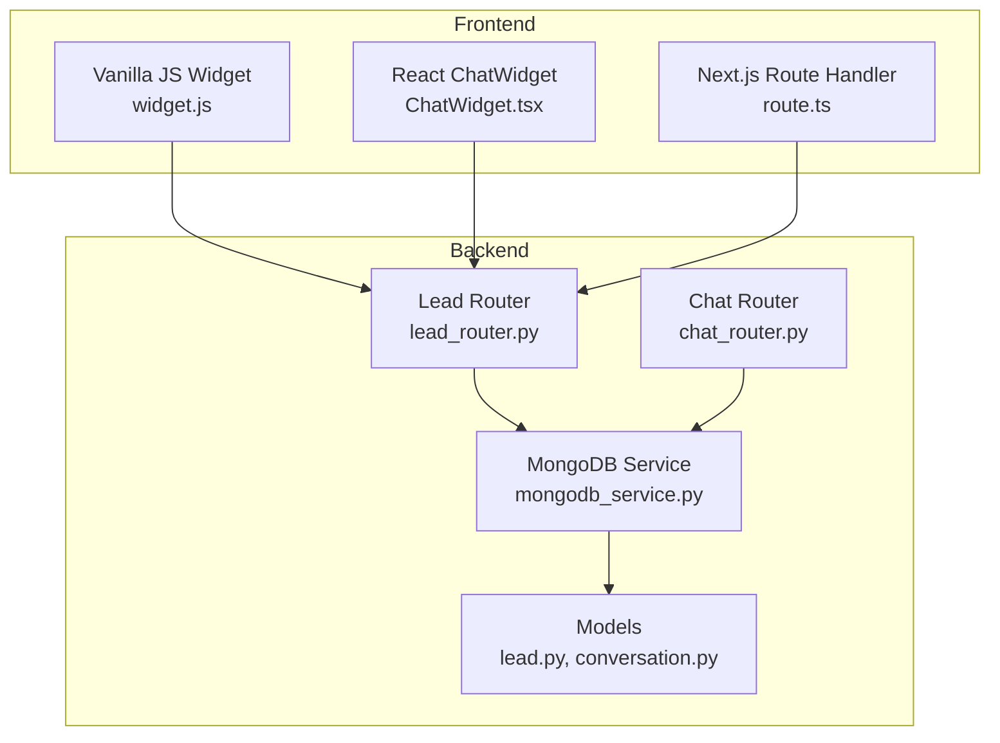
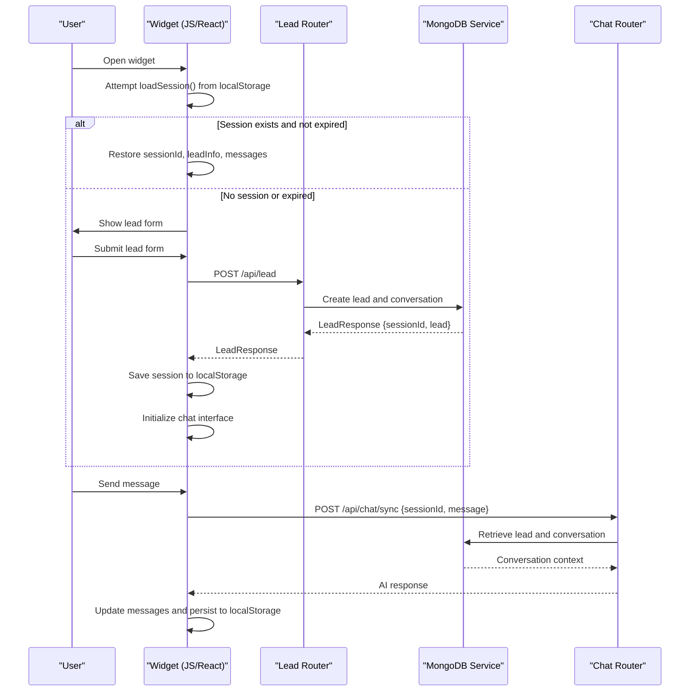
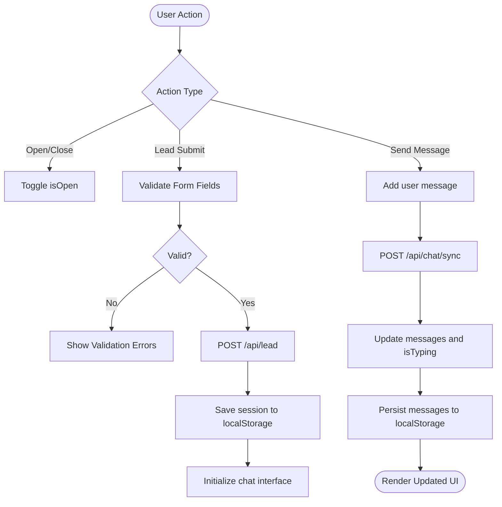
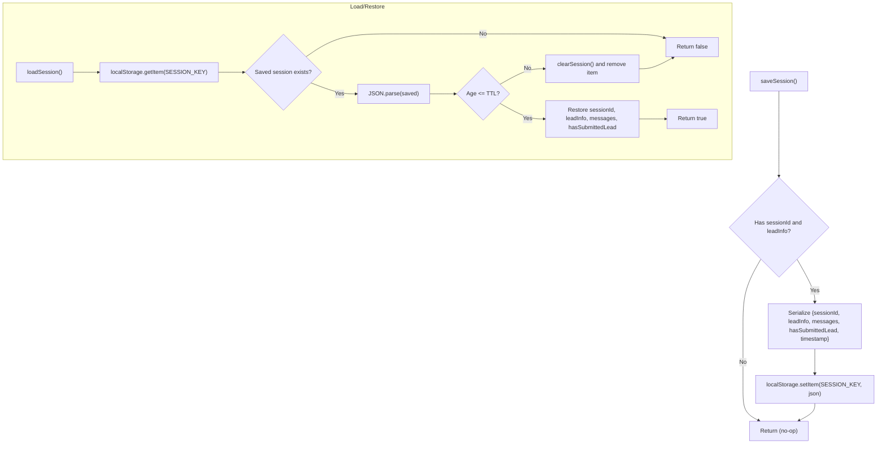
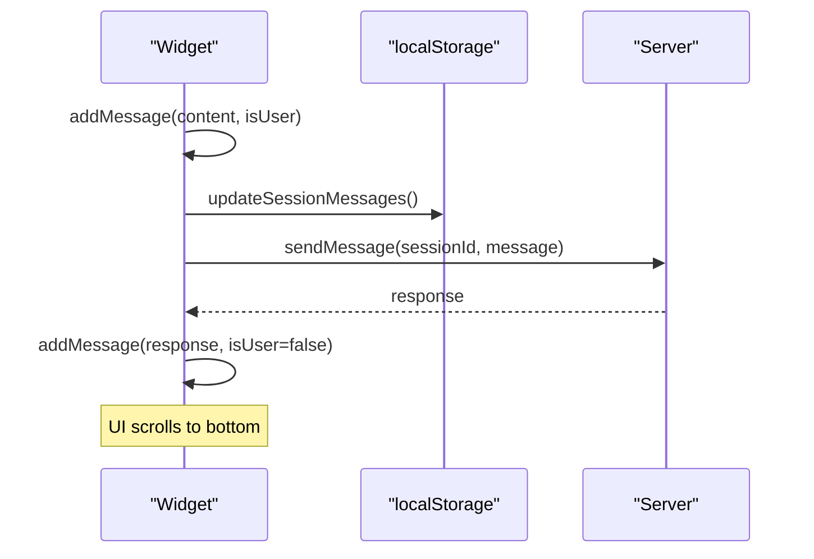
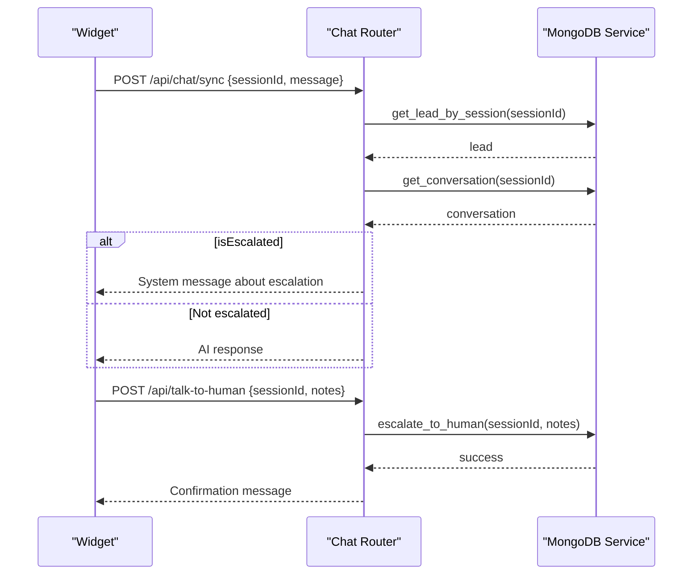
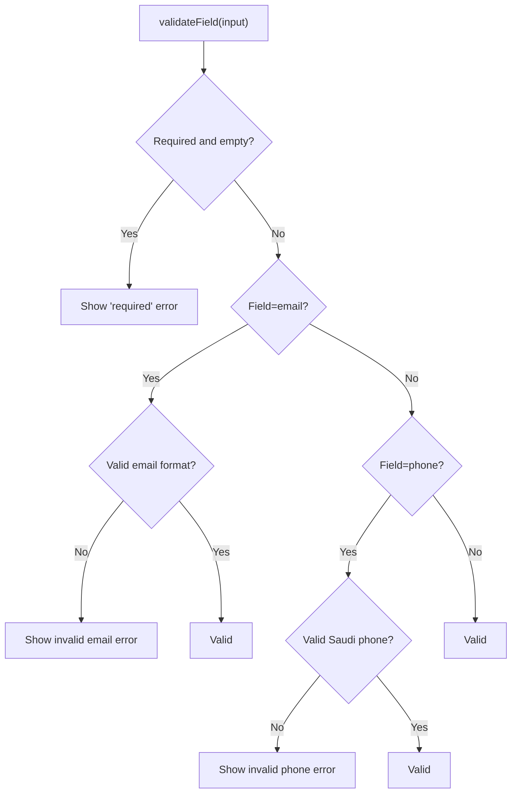
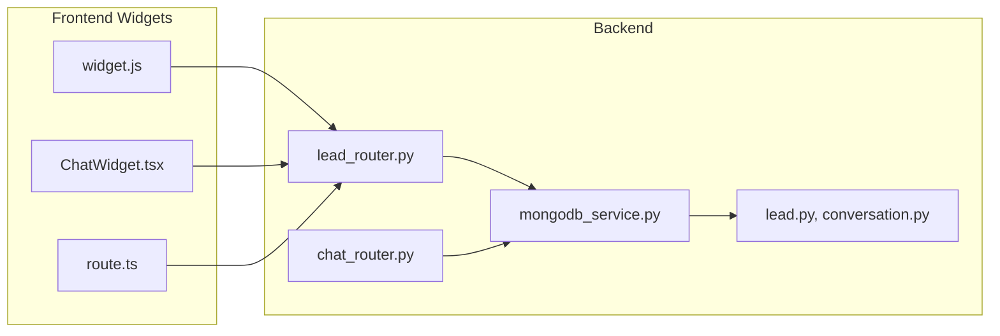

# Widget State Management

<cite>
**Referenced Files in This Document**
- [widget.js](file://widget.js)
- [ChatWidget.tsx](file://frontend/components/chat/ChatWidget.tsx)
- [route.ts](file://frontend/app/api/widget.js/route.ts)
- [chat_router.py](file://backend/app/routers/chat_router.py)
- [lead_router.py](file://backend/app/routers/lead_router.py)
- [mongodb_service.py](file://backend/app/services/mongodb_service.py)
- [lead.py](file://backend/app/models/lead.py)
- [conversation.py](file://backend/app/models/conversation.py)
</cite>

## Table of Contents
1. [Introduction](#introduction)
2. [Project Structure](#project-structure)
3. [Core Components](#core-components)
4. [Architecture Overview](#architecture-overview)
5. [Detailed Component Analysis](#detailed-component-analysis)
6. [Dependency Analysis](#dependency-analysis)
7. [Performance Considerations](#performance-considerations)
8. [Troubleshooting Guide](#troubleshooting-guide)
9. [Conclusion](#conclusion)

## Introduction
This document explains the widget state management and persistence mechanisms used across the frontend and backend chat systems. It covers the state object structure, localStorage-based session persistence, TTL expiration handling, session restoration logic, message history management, conversation state synchronization, cross-session continuity, state mutation patterns, event-driven updates, validation rules, session cleanup procedures, data sanitization, and privacy considerations.

## Project Structure
The state management spans three layers:
- Frontend widget implementations (Vanilla JS and React)
- Backend API routes for lead and chat operations
- MongoDB-backed persistence and conversation lifecycle management

**Diagram sources**
- [widget.js:1-895](file://widget.js#L1-L895)
- [ChatWidget.tsx:1-307](file://frontend/components/chat/ChatWidget.tsx#L1-L307)
- [route.ts:1-347](file://frontend/app/api/widget.js/route.ts#L1-L347)
- [lead_router.py:1-57](file://backend/app/routers/lead_router.py#L1-L57)
- [chat_router.py:1-130](file://backend/app/routers/chat_router.py#L1-L130)
- [mongodb_service.py:1-202](file://backend/app/services/mongodb_service.py#L1-L202)
- [lead.py:1-64](file://backend/app/models/lead.py#L1-L64)
- [conversation.py:1-53](file://backend/app/models/conversation.py#L1-L53)

**Section sources**
- [widget.js:1-895](file://widget.js#L1-L895)
- [ChatWidget.tsx:1-307](file://frontend/components/chat/ChatWidget.tsx#L1-L307)
- [route.ts:1-347](file://frontend/app/api/widget.js/route.ts#L1-L347)
- [lead_router.py:1-57](file://backend/app/routers/lead_router.py#L1-L57)
- [chat_router.py:1-130](file://backend/app/routers/chat_router.py#L1-L130)
- [mongodb_service.py:1-202](file://backend/app/services/mongodb_service.py#L1-L202)
- [lead.py:1-64](file://backend/app/models/lead.py#L1-L64)
- [conversation.py:1-53](file://backend/app/models/conversation.py#L1-L53)

## Core Components
The state object is shared across implementations and includes:
- isOpen: controls visibility of the chat widget
- sessionId: unique identifier for the current lead/session
- leadInfo: sanitized customer information (name, email, phone, company, inquiry type)
- messages: array of conversation messages with content, role, and timestamps
- isTyping: indicates when the AI is generating a response
- hasSubmittedLead: flag indicating whether lead submission has occurred
- conversationStarted: flag indicating whether the chat interface has been initialized

Persistence keys and TTL:
- SESSION_KEY: localStorage key for serialized session data
- sessionTTL: expiration threshold (24 hours) used to invalidate stale sessions

Validation and sanitization:
- Phone numbers are normalized and validated for Saudi Arabia formats
- HTML content is escaped to prevent XSS in message rendering
- Form inputs are validated before submission

**Section sources**
- [widget.js:32-40](file://widget.js#L32-L40)
- [widget.js:45](file://widget.js#L45)
- [widget.js:26](file://widget.js#L26)
- [widget.js:158-176](file://widget.js#L158-L176)
- [ChatWidget.tsx:12-16](file://frontend/components/chat/ChatWidget.tsx#L12-L16)
- [ChatWidget.tsx:24-25](file://frontend/components/chat/ChatWidget.tsx#L24-L25)
- [route.ts:23-32](file://frontend/app/api/widget.js/route.ts#L23-L32)

## Architecture Overview
The system synchronizes state across browser storage and backend databases. On initialization, the widget attempts to restore a session from localStorage. After lead submission, the backend creates a session and initializes an empty conversation. Subsequent chat messages are persisted to both localStorage and the backend, ensuring continuity across browser sessions.

**Diagram sources**
- [widget.js:66-93](file://widget.js#L66-L93)
- [widget.js:181-202](file://widget.js#L181-L202)
- [widget.js:204-225](file://widget.js#L204-L225)
- [lead_router.py:11-44](file://backend/app/routers/lead_router.py#L11-L44)
- [mongodb_service.py:51-77](file://backend/app/services/mongodb_service.py#L51-L77)
- [chat_router.py:12-56](file://backend/app/routers/chat_router.py#L12-L56)

## Detailed Component Analysis

### State Object and Mutation Patterns
- State is mutated locally in response to user actions (open/close, lead submission, sending messages).
- Mutations trigger immediate UI updates and, where applicable, persistence to localStorage.
- The React implementation uses React state hooks and effects to manage persistence automatically.

**Diagram sources**
- [widget.js:456-481](file://widget.js#L456-L481)
- [widget.js:583-641](file://widget.js#L583-L641)
- [widget.js:719-762](file://widget.js#L719-L762)
- [ChatWidget.tsx:84-108](file://frontend/components/chat/ChatWidget.tsx#L84-L108)
- [ChatWidget.tsx:110-142](file://frontend/components/chat/ChatWidget.tsx#L110-L142)

**Section sources**
- [widget.js:32-40](file://widget.js#L32-L40)
- [widget.js:456-481](file://widget.js#L456-L481)
- [widget.js:583-641](file://widget.js#L583-L641)
- [widget.js:719-762](file://widget.js#L719-L762)
- [ChatWidget.tsx:27-77](file://frontend/components/chat/ChatWidget.tsx#L27-L77)
- [ChatWidget.tsx:84-142](file://frontend/components/chat/ChatWidget.tsx#L84-L142)

### localStorage-Based Session Persistence
- Session serialization includes sessionId, leadInfo, messages, hasSubmittedLead, and timestamp.
- Restoration validates TTL and clears expired sessions.
- Message arrays are updated independently to avoid rewriting the entire session payload.

**Diagram sources**
- [widget.js:47-64](file://widget.js#L47-L64)
- [widget.js:66-93](file://widget.js#L66-L93)
- [widget.js:110-122](file://widget.js#L110-L122)
- [ChatWidget.tsx:63-77](file://frontend/components/chat/ChatWidget.tsx#L63-L77)
- [route.ts:35-53](file://frontend/app/api/widget.js/route.ts#L35-L53)

**Section sources**
- [widget.js:47-122](file://widget.js#L47-L122)
- [ChatWidget.tsx:38-77](file://frontend/components/chat/ChatWidget.tsx#L38-L77)
- [route.ts:35-64](file://frontend/app/api/widget.js/route.ts#L35-L64)

### Message History Management and Cross-Session Continuity
- Messages are appended to state and rendered immediately.
- Local persistence updates only the messages array to reduce payload size.
- On subsequent visits, recent messages are restored and the UI scrolls to the latest message.

**Diagram sources**
- [widget.js:747-762](file://widget.js#L747-L762)
- [widget.js:110-122](file://widget.js#L110-L122)
- [widget.js:204-225](file://widget.js#L204-L225)

**Section sources**
- [widget.js:747-762](file://widget.js#L747-L762)
- [widget.js:110-122](file://widget.js#L110-L122)
- [widget.js:204-225](file://widget.js#L204-L225)

### Conversation State Synchronization
- The backend ensures session validity and prevents processing if the session is not found.
- Escalation marks the conversation as escalated and stores escalation notes.
- The system adds a system message upon escalation to inform the user.

**Diagram sources**
- [chat_router.py:12-56](file://backend/app/routers/chat_router.py#L12-L56)
- [chat_router.py:58-117](file://backend/app/routers/chat_router.py#L58-L117)
- [mongodb_service.py:161-180](file://backend/app/services/mongodb_service.py#L161-L180)

**Section sources**
- [chat_router.py:12-56](file://backend/app/routers/chat_router.py#L12-L56)
- [chat_router.py:58-117](file://backend/app/routers/chat_router.py#L58-L117)
- [mongodb_service.py:161-180](file://backend/app/services/mongodb_service.py#L161-L180)

### State Validation Rules
- Lead form validation enforces presence of required fields and formats emails and Saudi phone numbers.
- Phone number normalization ensures consistent storage and display.
- HTML escaping prevents XSS in message bubbles.

**Diagram sources**
- [widget.js:539-564](file://widget.js#L539-L564)
- [widget.js:158-170](file://widget.js#L158-L170)
- [widget.js:172-176](file://widget.js#L172-L176)

**Section sources**
- [widget.js:539-564](file://widget.js#L539-L564)
- [widget.js:158-170](file://widget.js#L158-L170)
- [widget.js:172-176](file://widget.js#L172-L176)

### Privacy and Data Sanitization
- Phone numbers are normalized to a consistent international format (+966 5xxxxxxx).
- HTML content is escaped before insertion into the DOM.
- Lead creation and retrieval models define allowed fields and enforce constraints.

**Section sources**
- [widget.js:164-170](file://widget.js#L164-L170)
- [widget.js:172-176](file://widget.js#L172-L176)
- [lead.py:26-38](file://backend/app/models/lead.py#L26-L38)

### Session Cleanup Procedures
- Frontend: Expired sessions are detected and cleared during loadSession().
- Backend: Maintenance operation to clean up expired non-escalated conversations.

**Section sources**
- [widget.js:74-78](file://widget.js#L74-L78)
- [mongodb_service.py:182-192](file://backend/app/services/mongodb_service.py#L182-L192)

## Dependency Analysis
The frontend widgets depend on the backend APIs for lead creation and chat responses. The backend depends on MongoDB for persistent storage and uses Pydantic models for validation and serialization.

**Diagram sources**
- [widget.js:181-202](file://widget.js#L181-L202)
- [ChatWidget.tsx:10](file://frontend/components/chat/ChatWidget.tsx#L10)
- [route.ts:67-83](file://frontend/app/api/widget.js/route.ts#L67-L83)
- [lead_router.py:11-44](file://backend/app/routers/lead_router.py#L11-L44)
- [chat_router.py:12-56](file://backend/app/routers/chat_router.py#L12-L56)
- [mongodb_service.py:51-77](file://backend/app/services/mongodb_service.py#L51-L77)
- [lead.py:18-64](file://backend/app/models/lead.py#L18-L64)
- [conversation.py:15-53](file://backend/app/models/conversation.py#L15-L53)

**Section sources**
- [widget.js:181-202](file://widget.js#L181-L202)
- [ChatWidget.tsx:10](file://frontend/components/chat/ChatWidget.tsx#L10)
- [route.ts:67-83](file://frontend/app/api/widget.js/route.ts#L67-L83)
- [lead_router.py:11-44](file://backend/app/routers/lead_router.py#L11-L44)
- [chat_router.py:12-56](file://backend/app/routers/chat_router.py#L12-L56)
- [mongodb_service.py:51-77](file://backend/app/services/mongodb_service.py#L51-L77)
- [lead.py:18-64](file://backend/app/models/lead.py#L18-L64)
- [conversation.py:15-53](file://backend/app/models/conversation.py#L15-L53)

## Performance Considerations
- Limit message history rendered per session to improve UI responsiveness.
- Persist only incremental changes (e.g., messages array) to reduce localStorage write overhead.
- Debounce or batch UI updates during rapid message bursts.
- Use efficient scrolling to the latest message to avoid layout thrashing.

## Troubleshooting Guide
Common issues and resolutions:
- Session not restored: Verify localStorage availability and that the session is not expired.
- Lead submission fails: Check network connectivity and backend error responses.
- Chat response errors: Confirm session validity and escalation status.
- Escalation not working: Ensure the conversation exists and is not already escalated.

**Section sources**
- [widget.js:66-93](file://widget.js#L66-L93)
- [widget.js:196-202](file://widget.js#L196-L202)
- [chat_router.py:28-43](file://backend/app/routers/chat_router.py#L28-L43)
- [chat_router.py:72-94](file://backend/app/routers/chat_router.py#L72-L94)

## Conclusion
The widget state management combines local and server-side persistence to deliver a seamless chat experience. The state object is straightforward and well-encapsulated, with robust validation, sanitization, and TTL-based session handling. The backend ensures data integrity and escalations, while the frontend provides responsive UI updates and cross-session continuity.