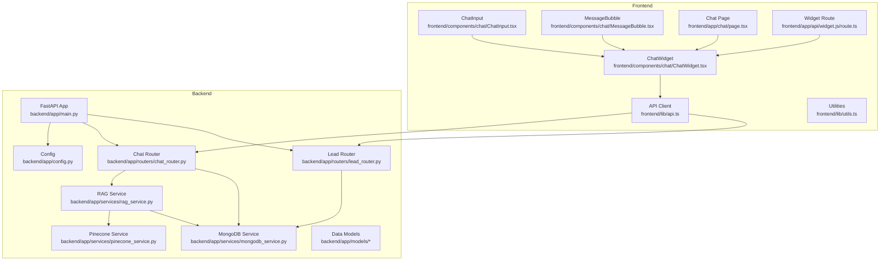
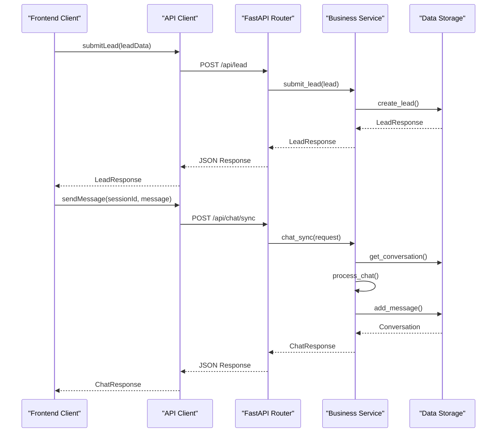
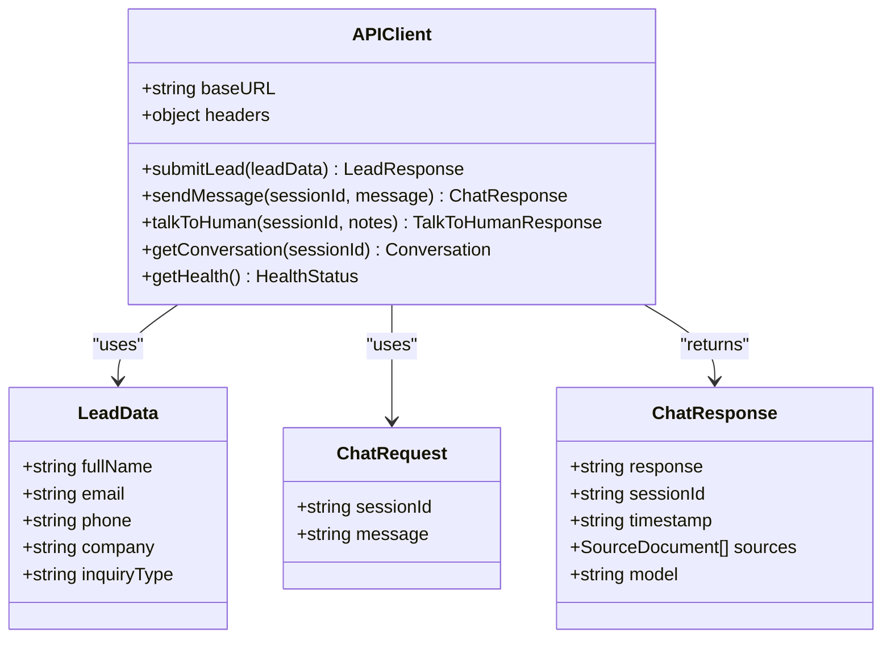
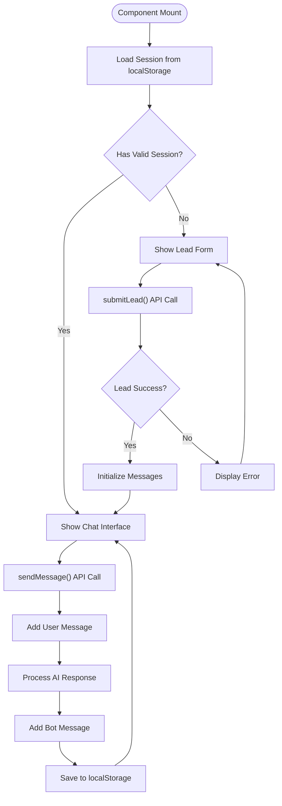
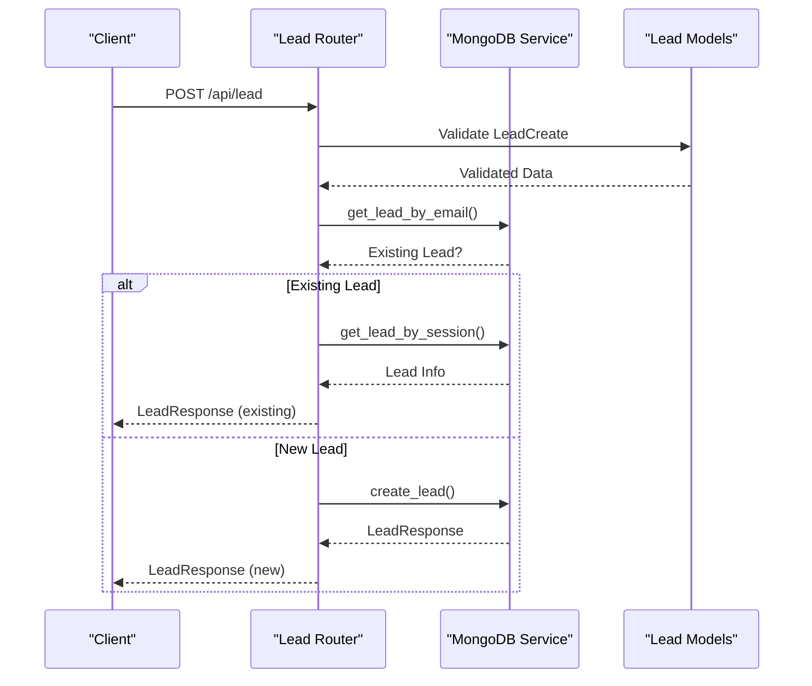
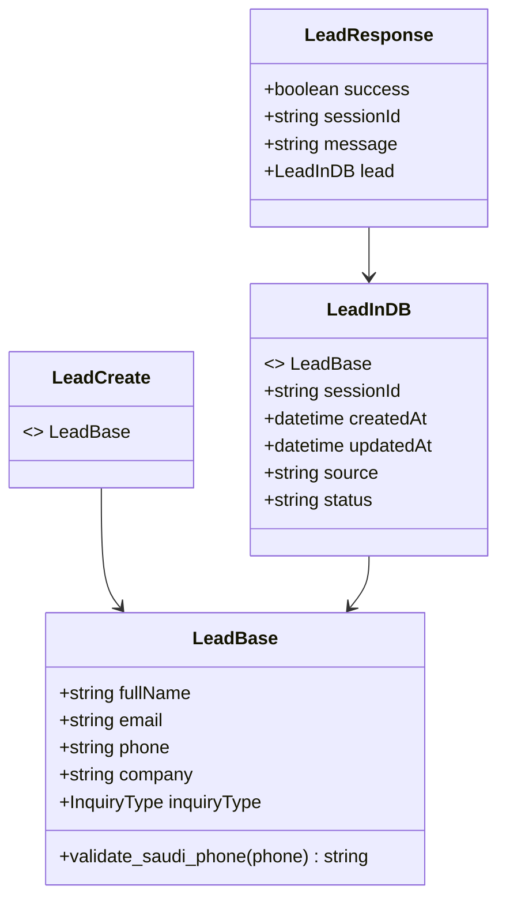
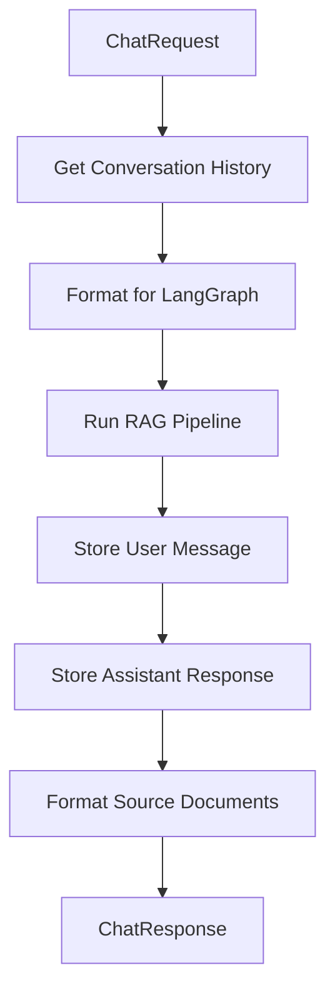
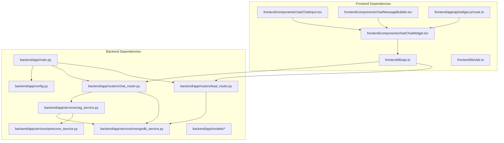
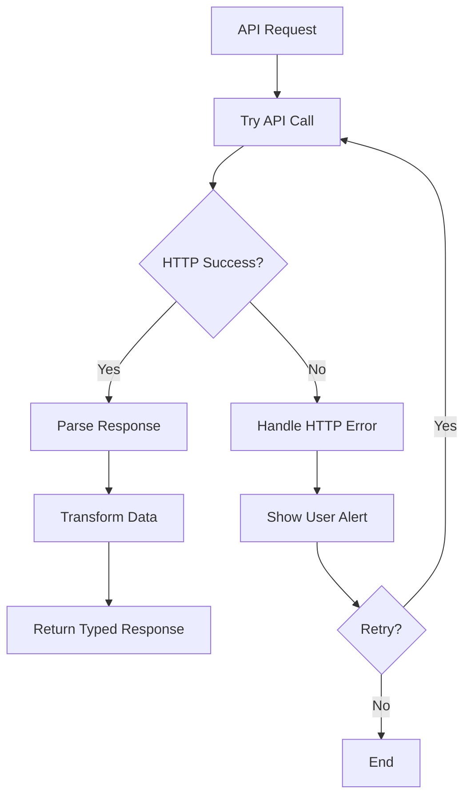

# API Client Integration

<cite>
**Referenced Files in This Document**
- [api.ts](file://frontend/lib/api.ts)
- [utils.ts](file://frontend/lib/utils.ts)
- [ChatWidget.tsx](file://frontend/components/chat/ChatWidget.tsx)
- [ChatInput.tsx](file://frontend/components/chat/ChatInput.tsx)
- [MessageBubble.tsx](file://frontend/components/chat/MessageBubble.tsx)
- [page.tsx](file://frontend/app/chat/page.tsx)
- [route.ts](file://frontend/app/api/widget.js/route.ts)
- [main.py](file://backend/app/main.py)
- [config.py](file://backend/app/config.py)
- [lead_router.py](file://backend/app/routers/lead_router.py)
- [chat_router.py](file://backend/app/routers/chat_router.py)
- [mongodb_service.py](file://backend/app/services/mongodb_service.py)
- [pinecone_service.py](file://backend/app/services/pinecone_service.py)
- [rag_service.py](file://backend/app/services/rag_service.py)
- [lead.py](file://backend/app/models/lead.py)
- [chat.py](file://backend/app/models/chat.py)
- [conversation.py](file://backend/app/models/conversation.py)
</cite>

## Table of Contents
1. [Introduction](#introduction)
2. [Project Structure](#project-structure)
3. [Core Components](#core-components)
4. [Architecture Overview](#architecture-overview)
5. [Detailed Component Analysis](#detailed-component-analysis)
6. [Dependency Analysis](#dependency-analysis)
7. [Performance Considerations](#performance-considerations)
8. [Troubleshooting Guide](#troubleshooting-guide)
9. [Conclusion](#conclusion)

## Introduction
This document provides comprehensive documentation for the API client implementation and utility functions used in the Hitech RAG-powered chatbot. It covers API client configuration, request/response handling, TypeScript interfaces, error handling strategies, loading states, retry mechanisms, examples of API calls, data transformation, integration patterns, authentication considerations, rate limiting, and performance optimization techniques. The system consists of a React/Next.js frontend and a FastAPI backend with MongoDB and Pinecone integrations.

## Project Structure
The project follows a clear separation between frontend and backend:
- Frontend: Next.js application with a chat widget, API client, and UI components
- Backend: FastAPI application with routers, services, and data models

**Diagram sources**
- [api.ts:1-93](file://frontend/lib/api.ts#L1-L93)
- [ChatWidget.tsx:1-307](file://frontend/components/chat/ChatWidget.tsx#L1-L307)
- [ChatInput.tsx:1-67](file://frontend/components/chat/ChatInput.tsx#L1-L67)
- [MessageBubble.tsx:1-77](file://frontend/components/chat/MessageBubble.tsx#L1-L77)
- [page.tsx:1-12](file://frontend/app/chat/page.tsx#L1-L12)
- [route.ts:1-347](file://frontend/app/api/widget.js/route.ts#L1-L347)
- [main.py:1-90](file://backend/app/main.py#L1-L90)
- [config.py:1-65](file://backend/app/config.py#L1-L65)
- [lead_router.py:1-57](file://backend/app/routers/lead_router.py#L1-L57)
- [chat_router.py:1-130](file://backend/app/routers/chat_router.py#L1-L130)
- [mongodb_service.py:1-202](file://backend/app/services/mongodb_service.py#L1-L202)
- [pinecone_service.py:1-186](file://backend/app/services/pinecone_service.py#L1-L186)
- [rag_service.py:1-116](file://backend/app/services/rag_service.py#L1-L116)

**Section sources**
- [api.ts:1-93](file://frontend/lib/api.ts#L1-L93)
- [main.py:1-90](file://backend/app/main.py#L1-L90)

## Core Components
This section documents the API client configuration, TypeScript interfaces, and utility functions.

### API Client Configuration
The frontend API client is configured using Axios with a base URL derived from environment variables. It sets a default Content-Type header for JSON requests.

Key configuration aspects:
- Base URL resolution from NEXT_PUBLIC_API_URL environment variable
- Default JSON content type header
- Exported API functions for lead submission, chat messaging, human escalation, conversation retrieval, and health checks

**Section sources**
- [api.ts:4-11](file://frontend/lib/api.ts#L4-L11)

### TypeScript Interfaces
The API client defines comprehensive TypeScript interfaces for type safety:

Data Models:
- LeadData: Customer information with validation constraints
- LeadResponse: Response structure for lead submissions
- ChatRequest: Chat message payload with session context
- ChatResponse: AI-generated response with optional sources
- TalkToHumanRequest: Escalation request with notes
- TalkToHumanResponse: Escalation confirmation with ticket information

These interfaces ensure compile-time type checking and improve developer experience.

**Section sources**
- [api.ts:14-58](file://frontend/lib/api.ts#L14-L58)

### Utility Functions
The frontend includes a utility function for conditional class name merging using clsx and tailwind-merge, enabling dynamic styling in components.

**Section sources**
- [utils.ts:1-7](file://frontend/lib/utils.ts#L1-L7)

## Architecture Overview
The system implements a client-server architecture with clear separation of concerns:

**Diagram sources**
- [api.ts:61-85](file://frontend/lib/api.ts#L61-L85)
- [lead_router.py:11-44](file://backend/app/routers/lead_router.py#L11-L44)
- [chat_router.py:12-56](file://backend/app/routers/chat_router.py#L12-L56)
- [mongodb_service.py:51-77](file://backend/app/services/mongodb_service.py#L51-L77)
- [rag_service.py:19-87](file://backend/app/services/rag_service.py#L19-L87)

The architecture follows these patterns:
- RESTful API design with semantic endpoints
- Service layer abstraction for business logic
- Data persistence through MongoDB collections
- Vector search integration via Pinecone
- Asynchronous operations for scalability

## Detailed Component Analysis

### API Client Implementation
The frontend API client provides typed HTTP requests to the backend services:

**Diagram sources**
- [api.ts:6-11](file://frontend/lib/api.ts#L6-L11)
- [api.ts:14-58](file://frontend/lib/api.ts#L14-L58)

Key implementation patterns:
- Promise-based async/await for request handling
- Direct JSON serialization for request bodies
- Response data extraction and return
- Environment-driven configuration

**Section sources**
- [api.ts:61-90](file://frontend/lib/api.ts#L61-L90)

### Chat Widget Integration
The ChatWidget component demonstrates comprehensive API integration patterns:

**Diagram sources**
- [ChatWidget.tsx:84-142](file://frontend/components/chat/ChatWidget.tsx#L84-L142)

Integration patterns demonstrated:
- Session management with localStorage persistence
- Loading state management during API calls
- Error handling with user feedback
- Real-time message updates
- Conversation history preservation

**Section sources**
- [ChatWidget.tsx:27-178](file://frontend/components/chat/ChatWidget.tsx#L27-L178)

### Backend API Endpoints
The backend implements comprehensive REST endpoints with proper error handling:

**Diagram sources**
- [lead_router.py:11-44](file://backend/app/routers/lead_router.py#L11-L44)
- [lead.py:41-64](file://backend/app/models/lead.py#L41-L64)

**Section sources**
- [lead_router.py:11-57](file://backend/app/routers/lead_router.py#L11-L57)
- [chat_router.py:12-129](file://backend/app/routers/chat_router.py#L12-L129)

### Data Models and Validation
The backend implements robust data validation and transformation:

**Diagram sources**
- [lead.py:18-64](file://backend/app/models/lead.py#L18-L64)

Validation features include:
- Phone number format validation for Saudi Arabia (+966, 966, 05 prefixes)
- Email validation using Pydantic EmailStr
- Length constraints and field descriptions
- Automatic timestamp management

**Section sources**
- [lead.py:26-38](file://backend/app/models/lead.py#L26-L38)

### RAG Service Integration
The RAG service orchestrates the conversational AI pipeline:

**Diagram sources**
- [rag_service.py:19-87](file://backend/app/services/rag_service.py#L19-L87)

Key capabilities:
- Conversation history management
- Vector similarity search integration
- Message metadata storage
- Source attribution for responses

**Section sources**
- [rag_service.py:19-107](file://backend/app/services/rag_service.py#L19-L107)

## Dependency Analysis
The system exhibits clean dependency management with clear boundaries:

**Diagram sources**
- [api.ts:1-93](file://frontend/lib/api.ts#L1-L93)
- [ChatWidget.tsx:1-307](file://frontend/components/chat/ChatWidget.tsx#L1-L307)
- [main.py:1-90](file://backend/app/main.py#L1-L90)

Key dependency characteristics:
- Loose coupling between frontend and backend
- Clear service boundaries in backend
- Dependency injection pattern for services
- Environment-driven configuration

**Section sources**
- [main.py:39-85](file://backend/app/main.py#L39-L85)
- [config.py:61-65](file://backend/app/config.py#L61-L65)

## Performance Considerations
Several performance optimization techniques are implemented:

### Caching Strategies
- LRU cache for configuration settings
- Session persistence to reduce server requests
- Local storage caching for conversation history

### Database Optimization
- Index creation on frequently queried fields (sessionId, email, phone)
- Efficient query patterns with projection and filtering
- Batch operations for vector upserts

### Network Optimization
- Environment-driven base URL configuration
- Minimal request/response payload sizes
- Connection pooling through service initialization

### Scalability Features
- Asynchronous operations throughout the stack
- Singleton pattern for expensive services (Pinecone, RAG)
- Modular service architecture for independent scaling

**Section sources**
- [config.py:61-65](file://backend/app/config.py#L61-L65)
- [mongodb_service.py:36-48](file://backend/app/services/mongodb_service.py#L36-L48)
- [pinecone_service.py:10-26](file://backend/app/services/pinecone_service.py#L10-L26)

## Troubleshooting Guide

### Common API Issues
1. **Network Connectivity**: Verify NEXT_PUBLIC_API_URL environment variable
2. **CORS Errors**: Check backend CORS configuration for widget embedding
3. **Session Expiration**: Implement proper session TTL handling
4. **Rate Limiting**: Monitor backend service limits

### Error Handling Patterns
The system implements comprehensive error handling:

**Diagram sources**
- [ChatWidget.tsx:84-142](file://frontend/components/chat/ChatWidget.tsx#L84-L142)

### Debugging Techniques
- Enable debug mode in configuration for verbose logging
- Monitor backend health endpoints for service status
- Use browser developer tools for network request inspection
- Implement structured logging in service layers

**Section sources**
- [main.py:74-83](file://backend/app/main.py#L74-L83)
- [ChatWidget.tsx:102-139](file://frontend/components/chat/ChatWidget.tsx#L102-L139)

## Conclusion
The API client integration demonstrates a well-architected system combining modern frontend development practices with robust backend services. Key strengths include comprehensive type safety, modular architecture, effective error handling, and performance optimizations. The implementation provides a solid foundation for scalable chatbot functionality with clear extension points for additional features.

The system successfully balances developer experience with production readiness, offering:
- Strong TypeScript integration
- Clean separation of concerns
- Comprehensive error handling
- Performance-conscious design
- Extensible service architecture

Future enhancements could include built-in retry mechanisms, authentication integration, and advanced caching strategies, building upon the solid foundation established in the current implementation.