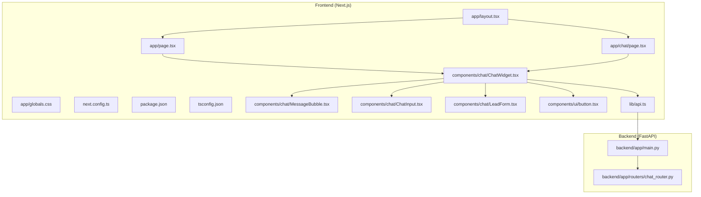
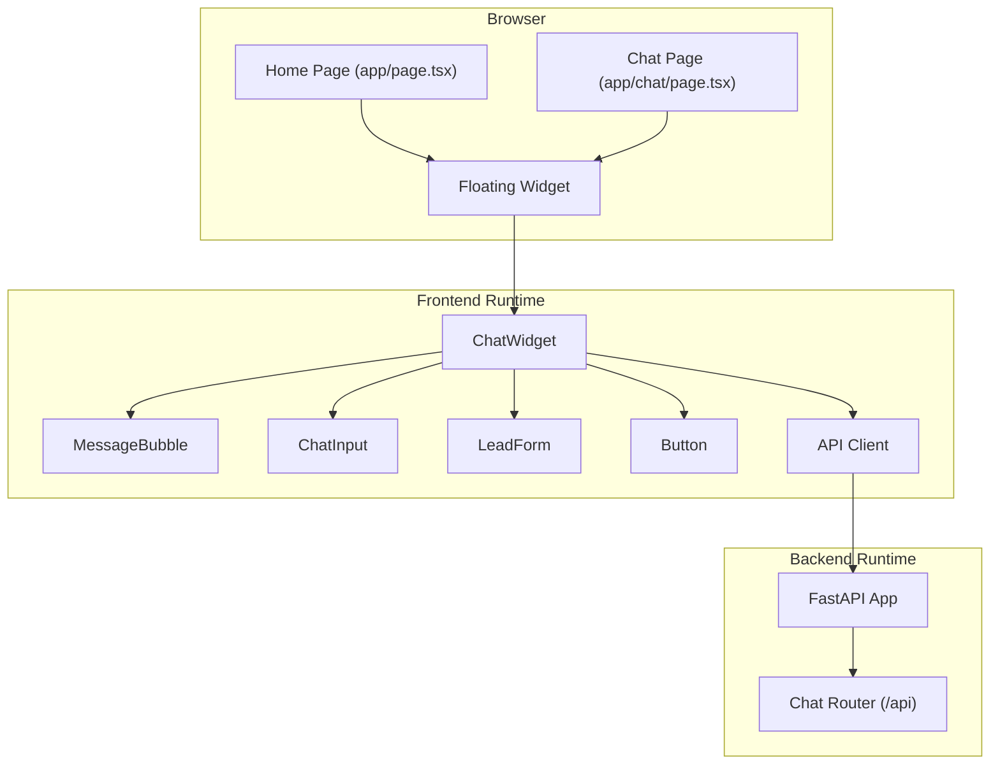
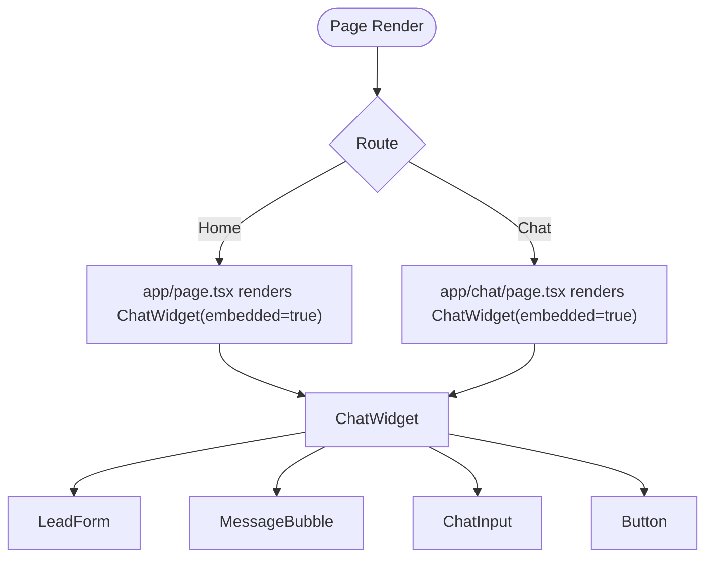
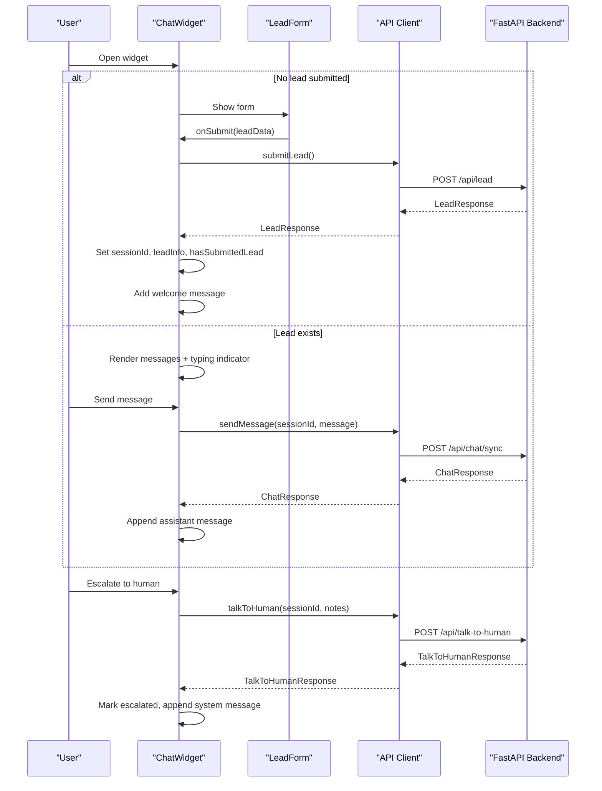
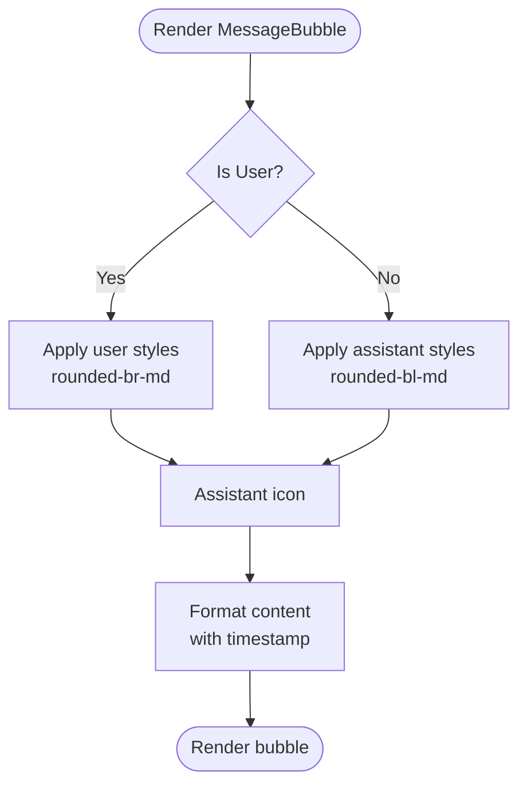
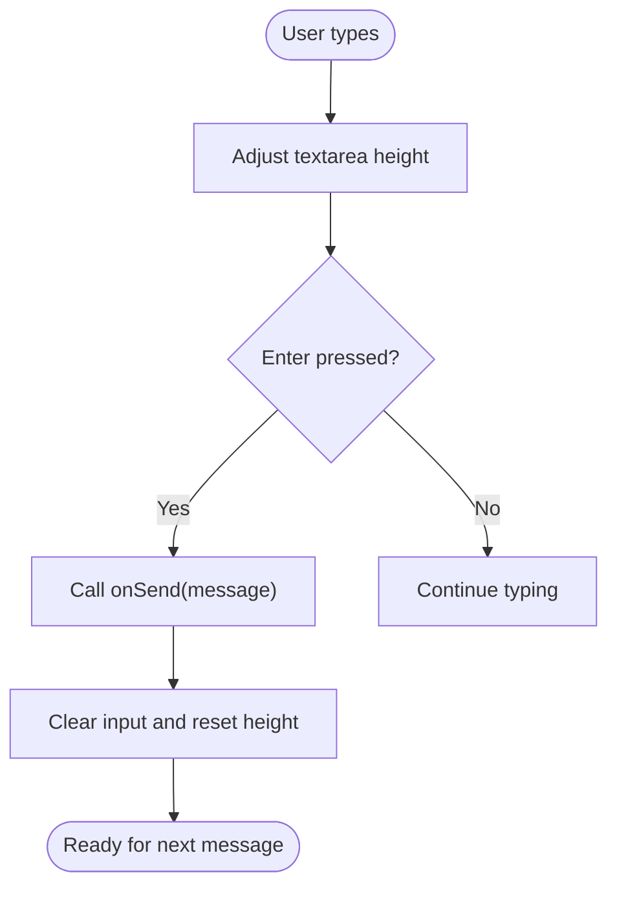
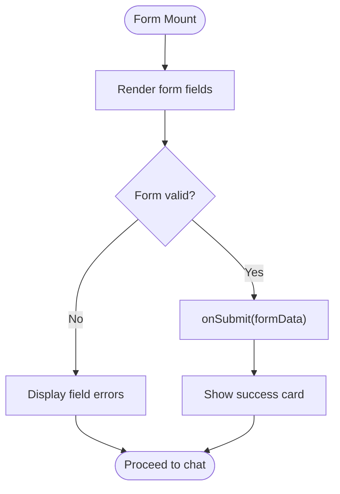
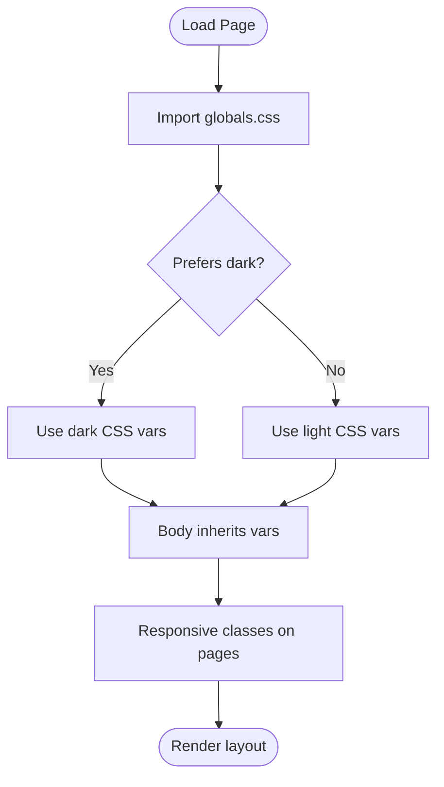
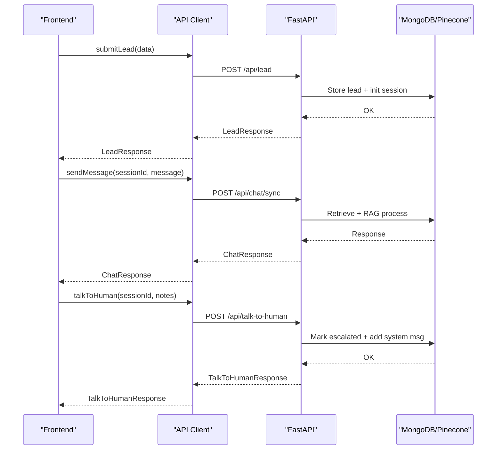
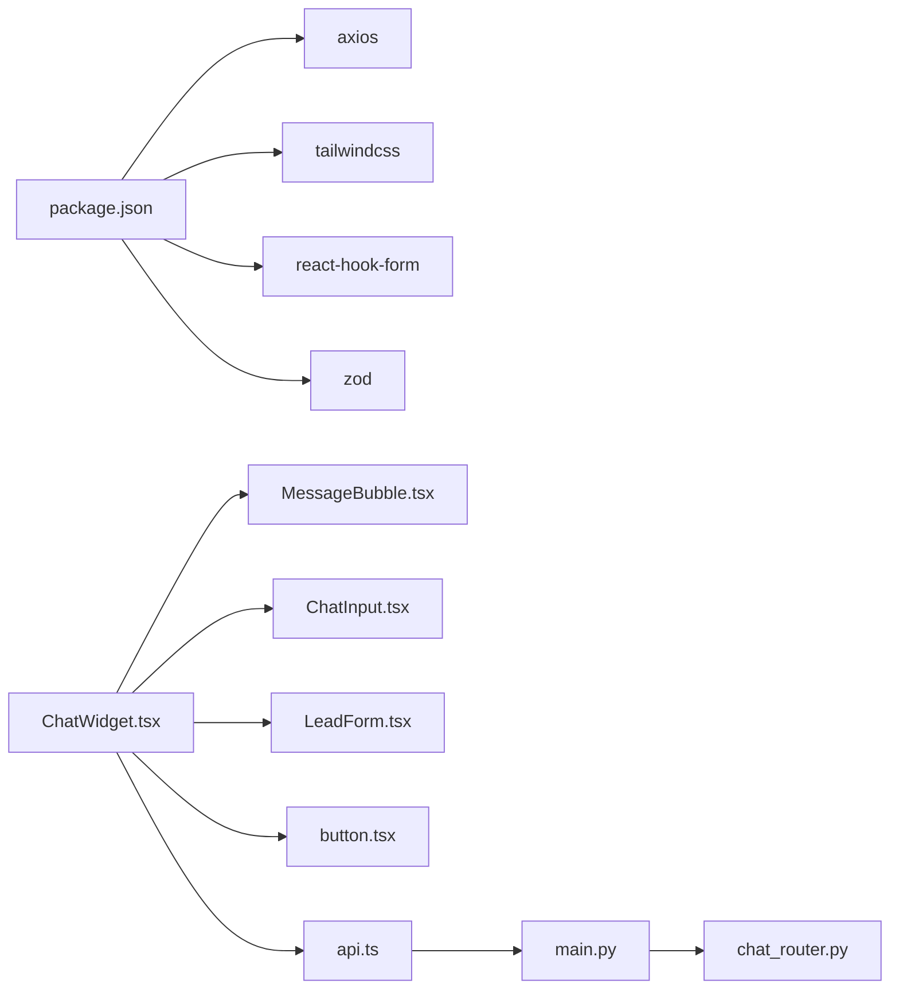

# Application Architecture

<cite>
**Referenced Files in This Document**
- [layout.tsx](file://frontend/app/layout.tsx)
- [page.tsx](file://frontend/app/page.tsx)
- [chat/page.tsx](file://frontend/app/chat/page.tsx)
- [globals.css](file://frontend/app/globals.css)
- [next.config.ts](file://frontend/next.config.ts)
- [package.json](file://frontend/package.json)
- [tsconfig.json](file://frontend/tsconfig.json)
- [README.md](file://frontend/README.md)
- [ChatWidget.tsx](file://frontend/components/chat/ChatWidget.tsx)
- [MessageBubble.tsx](file://frontend/components/chat/MessageBubble.tsx)
- [ChatInput.tsx](file://frontend/components/chat/ChatInput.tsx)
- [LeadForm.tsx](file://frontend/components/chat/LeadForm.tsx)
- [button.tsx](file://frontend/components/ui/button.tsx)
- [api.ts](file://frontend/lib/api.ts)
- [main.py](file://backend/app/main.py)
- [chat_router.py](file://backend/app/routers/chat_router.py)
</cite>

## Table of Contents
1. [Introduction](#introduction)
2. [Project Structure](#project-structure)
3. [Core Components](#core-components)
4. [Architecture Overview](#architecture-overview)
5. [Detailed Component Analysis](#detailed-component-analysis)
6. [Dependency Analysis](#dependency-analysis)
7. [Performance Considerations](#performance-considerations)
8. [Troubleshooting Guide](#troubleshooting-guide)
9. [Conclusion](#conclusion)
10. [Appendices](#appendices)

## Introduction
This document explains the architecture of the Next.js frontend and its integration with the Python FastAPI backend for a RAG-powered chatbot. It covers the App Router structure, page-based routing, component hierarchy, layout customization, and responsive design patterns. It also documents the chat page implementation, standalone page structure, application entry points, global styling approach, and the relationship between pages and their roles in the application flow.

## Project Structure
The frontend follows Next.js App Router conventions under the app directory. Pages are defined per-route, and shared layouts are centralized. The chat experience is encapsulated in reusable components located under components/chat and components/ui. Global styling is configured via Tailwind CSS and a dedicated CSS file. The backend exposes REST endpoints consumed by the frontend.

**Diagram sources**
- [layout.tsx:1-20](file://frontend/app/layout.tsx#L1-L20)
- [page.tsx:1-12](file://frontend/app/page.tsx#L1-L12)
- [chat/page.tsx:1-12](file://frontend/app/chat/page.tsx#L1-L12)
- [globals.css:1-27](file://frontend/app/globals.css#L1-L27)
- [next.config.ts:1-15](file://frontend/next.config.ts#L1-L15)
- [package.json:1-37](file://frontend/package.json#L1-L37)
- [tsconfig.json:1-35](file://frontend/tsconfig.json#L1-L35)
- [ChatWidget.tsx:1-307](file://frontend/components/chat/ChatWidget.tsx#L1-L307)
- [MessageBubble.tsx:1-77](file://frontend/components/chat/MessageBubble.tsx#L1-L77)
- [ChatInput.tsx:1-67](file://frontend/components/chat/ChatInput.tsx#L1-L67)
- [LeadForm.tsx:1-168](file://frontend/components/chat/LeadForm.tsx#L1-L168)
- [button.tsx:1-57](file://frontend/components/ui/button.tsx#L1-L57)
- [api.ts:1-93](file://frontend/lib/api.ts#L1-L93)
- [main.py:1-90](file://backend/app/main.py#L1-L90)
- [chat_router.py:1-130](file://backend/app/routers/chat_router.py#L1-L130)

**Section sources**
- [layout.tsx:1-20](file://frontend/app/layout.tsx#L1-L20)
- [page.tsx:1-12](file://frontend/app/page.tsx#L1-L12)
- [chat/page.tsx:1-12](file://frontend/app/chat/page.tsx#L1-L12)
- [globals.css:1-27](file://frontend/app/globals.css#L1-L27)
- [next.config.ts:1-15](file://frontend/next.config.ts#L1-L15)
- [package.json:1-37](file://frontend/package.json#L1-L37)
- [tsconfig.json:1-35](file://frontend/tsconfig.json#L1-L35)

## Core Components
- Root layout defines site metadata and wraps all pages with a global body container.
- Home page and chat page both render the ChatWidget in embedded mode.
- ChatWidget orchestrates lead collection, conversation lifecycle, typing indicators, and human escalation.
- MessageBubble renders user and assistant messages with timestamps and clickable URLs.
- ChatInput handles multi-line input, Enter-to-send, and dynamic textarea height.
- LeadForm validates and submits lead data with Zod and React Hook Form.
- UI Button component provides consistent styling and variants.
- API client abstracts backend endpoints for leads, chat, escalation, and conversation retrieval.

**Section sources**
- [layout.tsx:1-20](file://frontend/app/layout.tsx#L1-L20)
- [page.tsx:1-12](file://frontend/app/page.tsx#L1-L12)
- [chat/page.tsx:1-12](file://frontend/app/chat/page.tsx#L1-L12)
- [ChatWidget.tsx:1-307](file://frontend/components/chat/ChatWidget.tsx#L1-L307)
- [MessageBubble.tsx:1-77](file://frontend/components/chat/MessageBubble.tsx#L1-L77)
- [ChatInput.tsx:1-67](file://frontend/components/chat/ChatInput.tsx#L1-L67)
- [LeadForm.tsx:1-168](file://frontend/components/chat/LeadForm.tsx#L1-L168)
- [button.tsx:1-57](file://frontend/components/ui/button.tsx#L1-L57)
- [api.ts:1-93](file://frontend/lib/api.ts#L1-L93)

## Architecture Overview
The frontend is a Next.js App Router application exporting a static build. The chat experience is delivered via a floating widget or an embedded page. The widget communicates with the backend through REST endpoints exposed by the FastAPI service.

**Diagram sources**
- [page.tsx:1-12](file://frontend/app/page.tsx#L1-L12)
- [chat/page.tsx:1-12](file://frontend/app/chat/page.tsx#L1-L12)
- [ChatWidget.tsx:1-307](file://frontend/components/chat/ChatWidget.tsx#L1-L307)
- [MessageBubble.tsx:1-77](file://frontend/components/chat/MessageBubble.tsx#L1-L77)
- [ChatInput.tsx:1-67](file://frontend/components/chat/ChatInput.tsx#L1-L67)
- [LeadForm.tsx:1-168](file://frontend/components/chat/LeadForm.tsx#L1-L168)
- [button.tsx:1-57](file://frontend/components/ui/button.tsx#L1-L57)
- [api.ts:1-93](file://frontend/lib/api.ts#L1-L93)
- [main.py:1-90](file://backend/app/main.py#L1-L90)
- [chat_router.py:1-130](file://backend/app/routers/chat_router.py#L1-L130)

## Detailed Component Analysis

### Layout and Pages
- Root layout sets metadata and applies global CSS. It is the parent of all pages.
- Home page and chat page both embed the ChatWidget and center it with responsive sizing.
- Both pages share the same embedded layout pattern, differing only by route.

**Diagram sources**
- [layout.tsx:1-20](file://frontend/app/layout.tsx#L1-L20)
- [page.tsx:1-12](file://frontend/app/page.tsx#L1-L12)
- [chat/page.tsx:1-12](file://frontend/app/chat/page.tsx#L1-L12)
- [ChatWidget.tsx:1-307](file://frontend/components/chat/ChatWidget.tsx#L1-L307)
- [LeadForm.tsx:1-168](file://frontend/components/chat/LeadForm.tsx#L1-L168)
- [MessageBubble.tsx:1-77](file://frontend/components/chat/MessageBubble.tsx#L1-L77)
- [ChatInput.tsx:1-67](file://frontend/components/chat/ChatInput.tsx#L1-L67)
- [button.tsx:1-57](file://frontend/components/ui/button.tsx#L1-L57)

**Section sources**
- [layout.tsx:1-20](file://frontend/app/layout.tsx#L1-L20)
- [page.tsx:1-12](file://frontend/app/page.tsx#L1-L12)
- [chat/page.tsx:1-12](file://frontend/app/chat/page.tsx#L1-L12)

### ChatWidget Implementation
ChatWidget manages:
- Session persistence in localStorage with TTL.
- Lead submission and welcome message injection.
- Real-time messaging with typing indicators.
- Human escalation flow with confirmation and system messages.
- Two rendering modes: floating widget and embedded page.

**Diagram sources**
- [ChatWidget.tsx:1-307](file://frontend/components/chat/ChatWidget.tsx#L1-L307)
- [LeadForm.tsx:1-168](file://frontend/components/chat/LeadForm.tsx#L1-L168)
- [api.ts:1-93](file://frontend/lib/api.ts#L1-L93)
- [chat_router.py:1-130](file://backend/app/routers/chat_router.py#L1-L130)

**Section sources**
- [ChatWidget.tsx:1-307](file://frontend/components/chat/ChatWidget.tsx#L1-L307)
- [api.ts:1-93](file://frontend/lib/api.ts#L1-L93)
- [chat_router.py:1-130](file://backend/app/routers/chat_router.py#L1-L130)

### MessageBubble Component
MessageBubble renders user and assistant messages with:
- Role-specific styling and icons.
- Timestamp formatting.
- Automatic URL detection and linkification.

**Diagram sources**
- [MessageBubble.tsx:1-77](file://frontend/components/chat/MessageBubble.tsx#L1-L77)

**Section sources**
- [MessageBubble.tsx:1-77](file://frontend/components/chat/MessageBubble.tsx#L1-L77)

### ChatInput Component
ChatInput supports:
- Multi-line text area with dynamic height.
- Enter-to-send behavior.
- Disabled states during typing or escalation.

**Diagram sources**
- [ChatInput.tsx:1-67](file://frontend/components/chat/ChatInput.tsx#L1-L67)

**Section sources**
- [ChatInput.tsx:1-67](file://frontend/components/chat/ChatInput.tsx#L1-L67)

### LeadForm Component
LeadForm enforces validation using Zod and React Hook Form:
- Required fields with custom messages.
- Saudi phone number regex validation.
- Success state after submission.

**Diagram sources**
- [LeadForm.tsx:1-168](file://frontend/components/chat/LeadForm.tsx#L1-L168)

**Section sources**
- [LeadForm.tsx:1-168](file://frontend/components/chat/LeadForm.tsx#L1-L168)

### UI Button Component
The Button component provides consistent styling and variants via class variance authority, enabling theme-aligned buttons across the chat UI.

**Section sources**
- [button.tsx:1-57](file://frontend/components/ui/button.tsx#L1-L57)

### Global Styling and Responsive Design
- Tailwind CSS is configured via PostCSS and a dedicated globals.css file.
- CSS variables adapt to light/dark mode preferences.
- Pages use responsive utilities to center and constrain the chat widget.
- next.config enables static export and unoptimized images for local builds.

**Diagram sources**
- [globals.css:1-27](file://frontend/app/globals.css#L1-L27)
- [page.tsx:1-12](file://frontend/app/page.tsx#L1-L12)
- [chat/page.tsx:1-12](file://frontend/app/chat/page.tsx#L1-L12)
- [next.config.ts:1-15](file://frontend/next.config.ts#L1-L15)

**Section sources**
- [globals.css:1-27](file://frontend/app/globals.css#L1-L27)
- [next.config.ts:1-15](file://frontend/next.config.ts#L1-L15)

### Backend Integration
The frontend consumes the following backend endpoints:
- POST /api/lead: Creates a lead and returns a session identifier.
- POST /api/chat/sync: Sends a message and returns an AI response.
- POST /api/talk-to-human: Escalates conversation to a human agent.
- GET /api/conversation/{sessionId}: Retrieves conversation history.

**Diagram sources**
- [api.ts:1-93](file://frontend/lib/api.ts#L1-L93)
- [chat_router.py:1-130](file://backend/app/routers/chat_router.py#L1-L130)
- [main.py:1-90](file://backend/app/main.py#L1-L90)

**Section sources**
- [api.ts:1-93](file://frontend/lib/api.ts#L1-L93)
- [chat_router.py:1-130](file://backend/app/routers/chat_router.py#L1-L130)
- [main.py:1-90](file://backend/app/main.py#L1-L90)

## Dependency Analysis
- Frontend depends on Next.js runtime, Tailwind CSS, Axios, and UI primitives.
- ChatWidget depends on child components (MessageBubble, ChatInput, LeadForm) and the API client.
- API client depends on environment configuration and FastAPI endpoints.
- Backend depends on MongoDB and Pinecone services for data and embeddings.

**Diagram sources**
- [package.json:1-37](file://frontend/package.json#L1-L37)
- [ChatWidget.tsx:1-307](file://frontend/components/chat/ChatWidget.tsx#L1-L307)
- [MessageBubble.tsx:1-77](file://frontend/components/chat/MessageBubble.tsx#L1-L77)
- [ChatInput.tsx:1-67](file://frontend/components/chat/ChatInput.tsx#L1-L67)
- [LeadForm.tsx:1-168](file://frontend/components/chat/LeadForm.tsx#L1-L168)
- [button.tsx:1-57](file://frontend/components/ui/button.tsx#L1-L57)
- [api.ts:1-93](file://frontend/lib/api.ts#L1-L93)
- [main.py:1-90](file://backend/app/main.py#L1-L90)
- [chat_router.py:1-130](file://backend/app/routers/chat_router.py#L1-L130)

**Section sources**
- [package.json:1-37](file://frontend/package.json#L1-L37)
- [tsconfig.json:1-35](file://frontend/tsconfig.json#L1-L35)

## Performance Considerations
- Static export configuration reduces server overhead for hosting.
- LocalStorage caching minimizes repeated lead submissions and preserves conversation state.
- Dynamic textarea height prevents layout thrashing during input.
- Environment variable for API base URL enables easy deployment-time overrides.

[No sources needed since this section provides general guidance]

## Troubleshooting Guide
- Health checks: Use the backend health endpoint to confirm service connectivity.
- Session persistence: If conversations disappear, verify localStorage availability and TTL logic.
- Network errors: Inspect API client responses and backend logs for 4xx/5xx errors.
- Escalation flow: Confirm escalation endpoint returns success and system message is appended.

**Section sources**
- [main.py:74-83](file://backend/app/main.py#L74-L83)
- [ChatWidget.tsx:38-77](file://frontend/components/chat/ChatWidget.tsx#L38-L77)
- [api.ts:60-90](file://frontend/lib/api.ts#L60-L90)

## Conclusion
The application combines a streamlined Next.js frontend with a modular chat component architecture and a FastAPI backend. The App Router structure cleanly separates pages, while the ChatWidget encapsulates complex state and interactions. Global styling and responsive utilities ensure a consistent user experience across devices. The backend provides robust endpoints for lead management, RAG-powered chat, and human escalation, forming a cohesive full-stack solution.

[No sources needed since this section summarizes without analyzing specific files]

## Appendices

### Page Composition Examples
- Home page composes the ChatWidget in an embedded layout with centered constraints.
- Chat page mirrors the home page’s composition for a dedicated route.

**Section sources**
- [page.tsx:1-12](file://frontend/app/page.tsx#L1-L12)
- [chat/page.tsx:1-12](file://frontend/app/chat/page.tsx#L1-L12)

### Layout Customization Notes
- Root layout centralizes metadata and global CSS.
- Pages apply responsive containers and gradient backgrounds for visual consistency.

**Section sources**
- [layout.tsx:1-20](file://frontend/app/layout.tsx#L1-L20)
- [page.tsx:1-12](file://frontend/app/page.tsx#L1-L12)
- [chat/page.tsx:1-12](file://frontend/app/chat/page.tsx#L1-L12)

### Navigation Patterns
- Single-page chat experience with optional floating toggle.
- Embedded widget pattern allows placement on any page without route changes.

[No sources needed since this section doesn't analyze specific files]