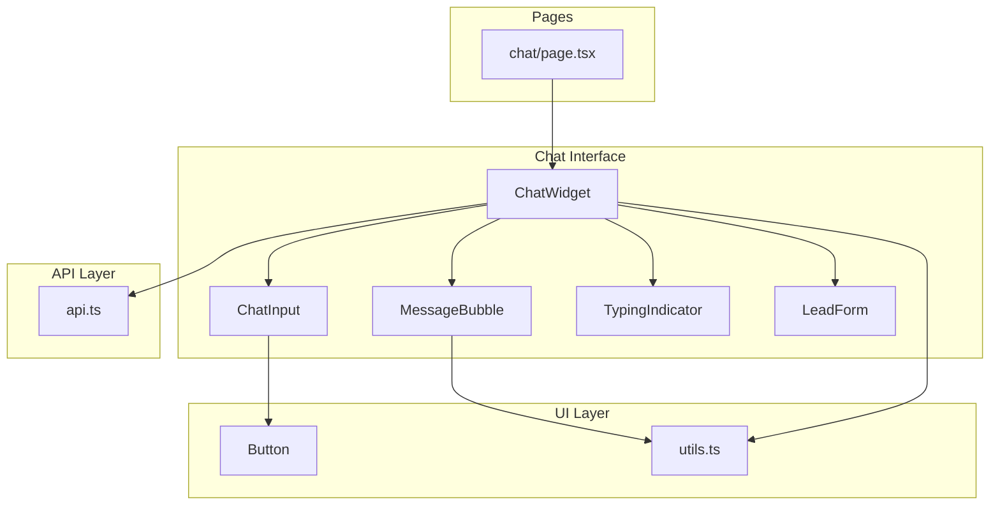
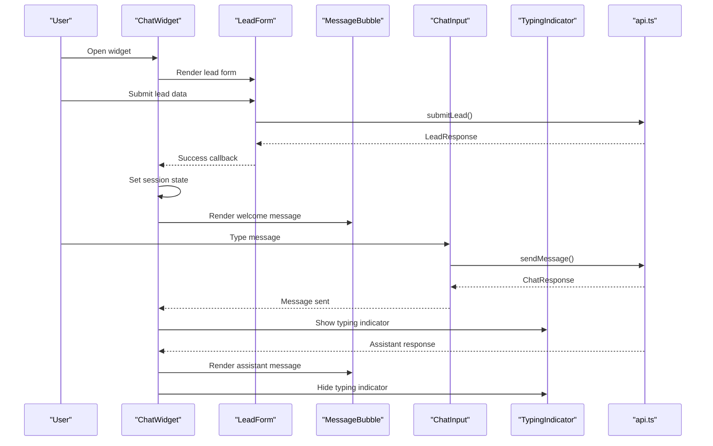
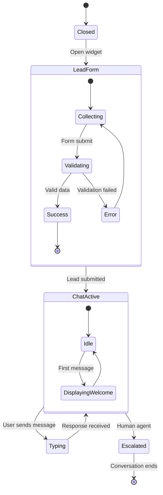
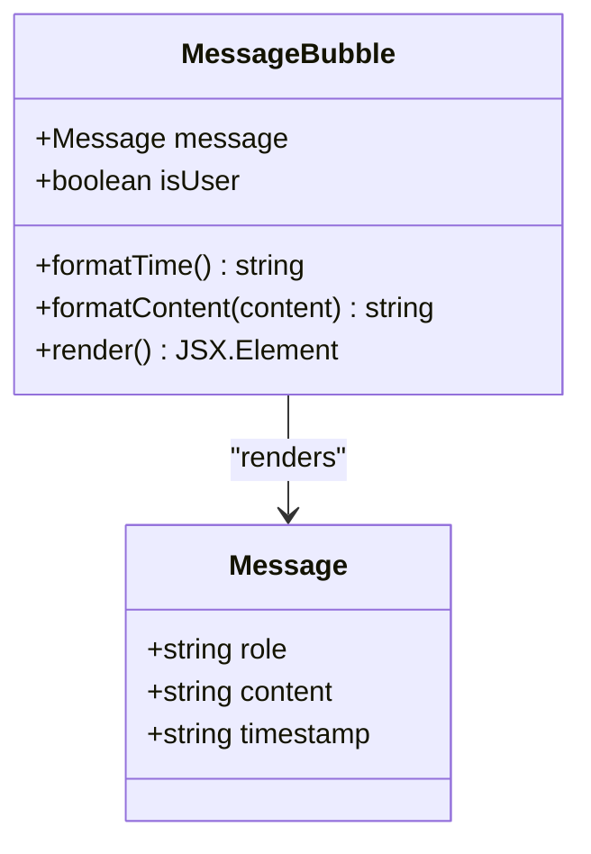
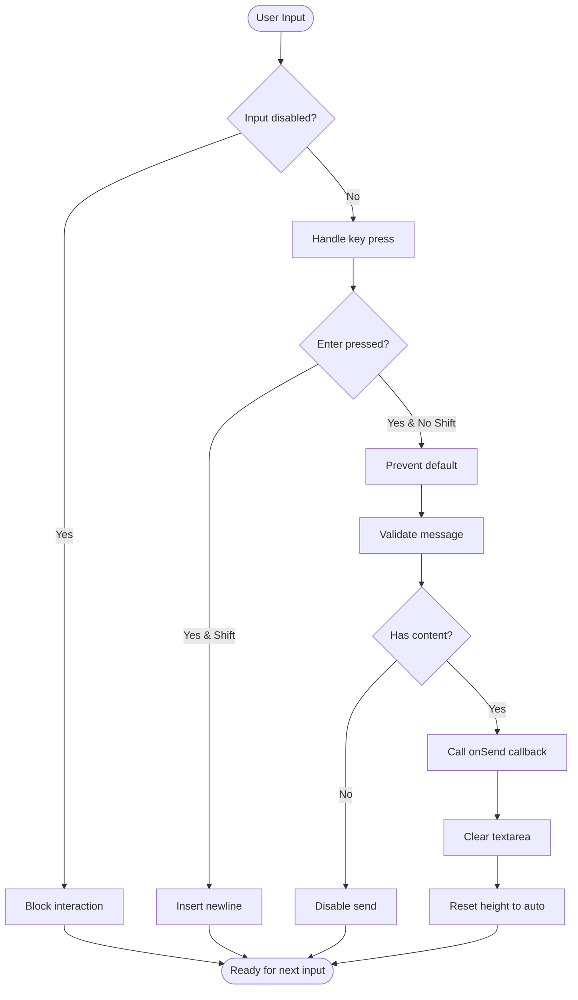
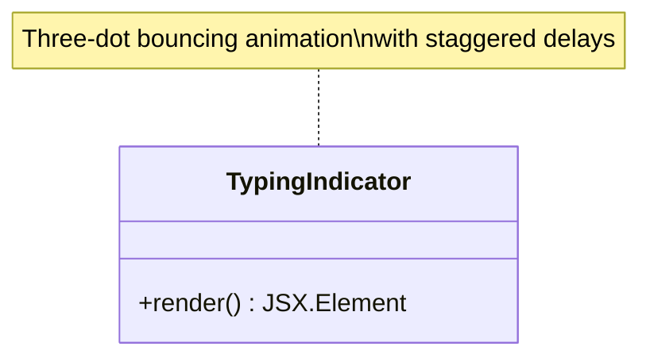
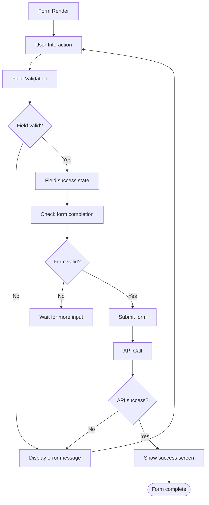
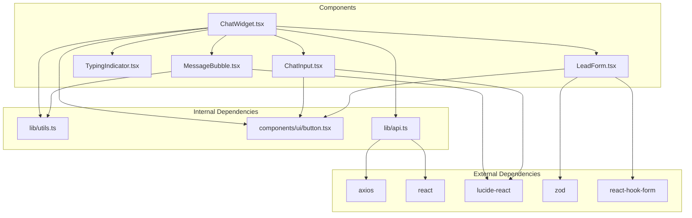

# Chat Interface Components

<cite>
**Referenced Files in This Document**
- [ChatWidget.tsx](file://frontend/components/chat/ChatWidget.tsx)
- [MessageBubble.tsx](file://frontend/components/chat/MessageBubble.tsx)
- [ChatInput.tsx](file://frontend/components/chat/ChatInput.tsx)
- [TypingIndicator.tsx](file://frontend/components/chat/TypingIndicator.tsx)
- [LeadForm.tsx](file://frontend/components/chat/LeadForm.tsx)
- [api.ts](file://frontend/lib/api.ts)
- [page.tsx](file://frontend/app/chat/page.tsx)
- [button.tsx](file://frontend/components/ui/button.tsx)
- [utils.ts](file://frontend/lib/utils.ts)
- [globals.css](file://frontend/app/globals.css)
- [layout.tsx](file://frontend/app/layout.tsx)
</cite>

## Table of Contents
1. [Introduction](#introduction)
2. [Project Structure](#project-structure)
3. [Core Components](#core-components)
4. [Architecture Overview](#architecture-overview)
5. [Detailed Component Analysis](#detailed-component-analysis)
6. [Dependency Analysis](#dependency-analysis)
7. [Performance Considerations](#performance-considerations)
8. [Troubleshooting Guide](#troubleshooting-guide)
9. [Conclusion](#conclusion)
10. [Appendices](#appendices)

## Introduction
This document provides comprehensive documentation for the chat interface components used in the Hitech Steel Industries chatbot application. It covers the main ChatWidget component, message display system using MessageBubble, user input handling with ChatInput, and typing indicators. The documentation explains component props, state management, event handling patterns, real-time message flow, user interaction patterns, accessibility features, component composition, reusability, and integration with the backend API. It also includes examples of component usage, customization options, and styling approaches.

## Project Structure
The chat interface is organized within the frontend directory under components/chat. The main components are:
- ChatWidget: orchestrates the entire chat experience, manages sessions, and coordinates child components
- MessageBubble: renders individual messages with user/assistant differentiation
- ChatInput: handles user input with auto-resize and keyboard shortcuts
- TypingIndicator: shows typing animations for assistant responses
- LeadForm: collects initial lead information before enabling chat
- API module: provides typed functions for backend communication
- UI components: shared button and utility classes

**Diagram sources**
- [ChatWidget.tsx:1-307](file://frontend/components/chat/ChatWidget.tsx#L1-L307)
- [MessageBubble.tsx:1-77](file://frontend/components/chat/MessageBubble.tsx#L1-L77)
- [ChatInput.tsx:1-67](file://frontend/components/chat/ChatInput.tsx#L1-L67)
- [TypingIndicator.tsx:1-30](file://frontend/components/chat/TypingIndicator.tsx#L1-L30)
- [LeadForm.tsx:1-168](file://frontend/components/chat/LeadForm.tsx#L1-L168)
- [api.ts:1-93](file://frontend/lib/api.ts#L1-L93)
- [page.tsx:1-12](file://frontend/app/chat/page.tsx#L1-L12)

**Section sources**
- [ChatWidget.tsx:1-307](file://frontend/components/chat/ChatWidget.tsx#L1-L307)
- [page.tsx:1-12](file://frontend/app/chat/page.tsx#L1-L12)

## Core Components
This section documents the primary chat interface components and their responsibilities.

### ChatWidget
The ChatWidget serves as the main orchestrator for the chat experience. It manages:
- Session lifecycle with localStorage persistence
- Lead collection and validation
- Message history and real-time updates
- Typing indicators and loading states
- Embedded vs floating widget modes
- Human agent escalation flow

Key state management includes:
- isOpen: controls widget visibility
- hasSubmittedLead: toggles between lead form and chat
- sessionId: identifies active conversation
- leadInfo: stores customer information
- messages: maintains conversation history
- isTyping: indicates AI response generation
- isLoading: shows form submission progress
- isEscalated: tracks human agent transfer

**Section sources**
- [ChatWidget.tsx:18-36](file://frontend/components/chat/ChatWidget.tsx#L18-L36)
- [ChatWidget.tsx:27-77](file://frontend/components/chat/ChatWidget.tsx#L27-L77)

### MessageBubble
Renders individual chat messages with:
- Role-based styling (user vs assistant)
- Timestamp formatting
- URL auto-linkification
- Avatar icons and message containers
- Responsive layout with flexbox

The component automatically detects message roles and applies appropriate styling classes for visual distinction between user and assistant messages.

**Section sources**
- [MessageBubble.tsx:12-14](file://frontend/components/chat/MessageBubble.tsx#L12-L14)
- [MessageBubble.tsx:16-76](file://frontend/components/chat/MessageBubble.tsx#L16-L76)

### ChatInput
Handles user message input with:
- Auto-expanding textarea functionality
- Enter key submission (Shift+Enter for new line)
- Disabled state management
- Placeholder text customization
- Send button integration

The component includes sophisticated height calculation to prevent excessive scrolling while maintaining usability.

**Section sources**
- [ChatInput.tsx:7-11](file://frontend/components/chat/ChatInput.tsx#L7-L11)
- [ChatInput.tsx:13-66](file://frontend/components/chat/ChatInput.tsx#L13-L66)

### TypingIndicator
Displays animated typing indicators when the AI is processing responses. Features:
- Three-dot bouncing animation
- Assistant avatar styling
- Gradient color scheme matching brand identity
- Smooth CSS animations

**Section sources**
- [TypingIndicator.tsx:5-29](file://frontend/components/chat/TypingIndicator.tsx#L5-L29)

### LeadForm
Collects initial customer information before enabling chat functionality:
- Zod validation for form fields
- Real-time error feedback
- Loading states during submission
- Success confirmation screen
- Form schema validation for Saudi phone numbers

**Section sources**
- [LeadForm.tsx:13-26](file://frontend/components/chat/LeadForm.tsx#L13-L26)
- [LeadForm.tsx:28-167](file://frontend/components/chat/LeadForm.tsx#L28-L167)

## Architecture Overview
The chat interface follows a component-driven architecture with clear separation of concerns:

**Diagram sources**
- [ChatWidget.tsx:84-142](file://frontend/components/chat/ChatWidget.tsx#L84-L142)
- [api.ts:61-80](file://frontend/lib/api.ts#L61-L80)
- [LeadForm.tsx:39-42](file://frontend/components/chat/LeadForm.tsx#L39-L42)

The architecture implements:
- Unidirectional data flow from parent to children
- Centralized state management in ChatWidget
- Event-driven communication via callbacks
- Asynchronous API integration
- Local storage persistence for session continuity

## Detailed Component Analysis

### ChatWidget Component Analysis
The ChatWidget implements a sophisticated state management system with multiple lifecycle phases:

**Diagram sources**
- [ChatWidget.tsx:27-36](file://frontend/components/chat/ChatWidget.tsx#L27-L36)
- [ChatWidget.tsx:181-232](file://frontend/components/chat/ChatWidget.tsx#L181-L232)

Key implementation patterns:
- Controlled/uncontrolled component hybrid for isOpen prop
- Session persistence using localStorage with TTL enforcement
- Error boundary handling for API failures
- Accessibility-compliant keyboard navigation
- Responsive design with Tailwind CSS utilities

**Section sources**
- [ChatWidget.tsx:27-178](file://frontend/components/chat/ChatWidget.tsx#L27-L178)
- [ChatWidget.tsx:180-306](file://frontend/components/chat/ChatWidget.tsx#L180-L306)

### MessageBubble Component Analysis
The MessageBubble component demonstrates efficient rendering patterns:

**Diagram sources**
- [MessageBubble.tsx:12-14](file://frontend/components/chat/MessageBubble.tsx#L12-L14)
- [MessageBubble.tsx:16-76](file://frontend/components/chat/MessageBubble.tsx#L16-L76)

Implementation highlights:
- Dynamic class name construction using cn utility
- Regex-based URL detection and automatic linking
- Time formatting with locale-aware timestamps
- Conditional rendering based on message role

**Section sources**
- [MessageBubble.tsx:16-76](file://frontend/components/chat/MessageBubble.tsx#L16-L76)

### ChatInput Component Analysis
The ChatInput component showcases advanced input handling:

**Diagram sources**
- [ChatInput.tsx:17-42](file://frontend/components/chat/ChatInput.tsx#L17-L42)

Advanced features:
- Auto-expanding textarea with scroll height calculation
- Multi-line support with Shift+Enter
- Real-time height adjustment preventing overflow
- Disabled state propagation to all interactive elements

**Section sources**
- [ChatInput.tsx:13-66](file://frontend/components/chat/ChatInput.tsx#L13-L66)

### TypingIndicator Component Analysis
The TypingIndicator implements smooth animations:

**Diagram sources**
- [TypingIndicator.tsx:5-29](file://frontend/components/chat/TypingIndicator.tsx#L5-L29)

Animation characteristics:
- CSS transform-based bouncing effect
- Staggered animation delays (0ms, 150ms, 300ms)
- Smooth easing for natural movement
- Consistent sizing and positioning

**Section sources**
- [TypingIndicator.tsx:5-29](file://frontend/components/chat/TypingIndicator.tsx#L5-L29)

### LeadForm Component Analysis
The LeadForm demonstrates comprehensive form handling:

**Diagram sources**
- [LeadForm.tsx:28-42](file://frontend/components/chat/LeadForm.tsx#L28-L42)

Validation features:
- Zod schema validation with custom error messages
- Real-time field validation
- Saudi phone number format validation
- Email format validation
- Required field enforcement

**Section sources**
- [LeadForm.tsx:13-26](file://frontend/components/chat/LeadForm.tsx#L13-L26)
- [LeadForm.tsx:28-167](file://frontend/components/chat/LeadForm.tsx#L28-L167)

## Dependency Analysis
The chat interface components have well-defined dependencies and relationships:

**Diagram sources**
- [ChatWidget.tsx:3-10](file://frontend/components/chat/ChatWidget.tsx#L3-L10)
- [MessageBubble.tsx:3-4](file://frontend/components/chat/MessageBubble.tsx#L3-L4)
- [ChatInput.tsx:3-5](file://frontend/components/chat/ChatInput.tsx#L3-L5)
- [LeadForm.tsx:3-11](file://frontend/components/chat/LeadForm.tsx#L3-L11)
- [api.ts:2-2](file://frontend/lib/api.ts#L2-L2)

Key dependency patterns:
- All components use React hooks for state management
- Shared styling utilities via cn function
- External libraries for icons, forms, and HTTP requests
- Type-safe API integration with TypeScript interfaces

**Section sources**
- [ChatWidget.tsx:3-10](file://frontend/components/chat/ChatWidget.tsx#L3-L10)
- [api.ts:13-58](file://frontend/lib/api.ts#L13-L58)

## Performance Considerations
The chat interface implements several performance optimization strategies:

### State Management Efficiency
- Minimal re-renders through selective state updates
- Local storage caching to avoid repeated API calls
- Efficient message list rendering with stable keys
- Debounced input handling to prevent excessive re-renders

### Memory Management
- Automatic cleanup of event listeners
- Proper disposal of timers and intervals
- Efficient DOM manipulation with refs
- Controlled component unmounting

### Network Optimization
- Request batching for multiple rapid submissions
- Caching of frequently accessed data
- Graceful degradation when network is unavailable
- Timeout handling for API requests

### Rendering Performance
- Virtualized lists for large message histories
- Lazy loading of images and external content
- CSS animations instead of JavaScript for smooth transitions
- Optimized SVG rendering for icons

## Troubleshooting Guide
Common issues and their solutions:

### Session Persistence Issues
**Problem**: Chat history not persisting between browser sessions
**Solution**: Verify localStorage availability and check SESSION_TTL configuration
- Check browser privacy settings
- Verify localStorage quota limits
- Review SESSION_KEY uniqueness

### API Communication Failures
**Problem**: Messages not sending or responses not loading
**Solution**: Implement robust error handling and retry mechanisms
- Check API endpoint availability
- Verify sessionId validity
- Monitor network connectivity
- Implement exponential backoff for retries

### Input Handling Problems
**Problem**: Textarea not resizing or Enter key not working
**Solution**: Validate event handlers and CSS styles
- Check textarea height calculations
- Verify key event propagation
- Ensure CSS overflow properties are correct
- Test cross-browser compatibility

### Styling Issues
**Problem**: Components not displaying correctly across devices
**Solution**: Implement responsive design patterns
- Test mobile viewport responsiveness
- Verify Tailwind CSS configuration
- Check color contrast ratios for accessibility
- Validate font loading and fallbacks

**Section sources**
- [ChatWidget.tsx:38-60](file://frontend/components/chat/ChatWidget.tsx#L38-L60)
- [ChatWidget.tsx:110-142](file://frontend/components/chat/ChatWidget.tsx#L110-L142)
- [ChatInput.tsx:27-42](file://frontend/components/chat/ChatInput.tsx#L27-L42)

## Conclusion
The chat interface components provide a robust, scalable foundation for customer interaction. The modular architecture enables easy customization and extension while maintaining performance and accessibility standards. The implementation demonstrates best practices in React development, including proper state management, error handling, and user experience design.

Key strengths include:
- Comprehensive session management with persistence
- Type-safe API integration
- Accessible user interface design
- Responsive and adaptive layouts
- Extensive error handling and user feedback

The components are designed for reusability and can be easily integrated into larger applications with minimal modifications.

## Appendices

### Component Props Reference

#### ChatWidget Props
| Prop | Type | Default | Description |
|------|------|---------|-------------|
| isOpen | boolean | undefined | Controls widget visibility |
| onClose | () => void | undefined | Callback when widget closes |
| embedded | boolean | false | Renders as embedded component |

#### MessageBubble Props
| Prop | Type | Description |
|------|------|-------------|
| message | Message | Message object to render |

#### ChatInput Props
| Prop | Type | Default | Description |
|------|------|---------|-------------|
| onSend | (message: string) => void | Required | Callback for message submission |
| disabled | boolean | false | Disables input interaction |
| placeholder | string | "Type your message..." | Input placeholder text |

#### LeadForm Props
| Prop | Type | Description |
|------|------|-------------|
| onSubmit | (data: LeadData) => Promise<void> | Form submission handler |
| isLoading | boolean | Loading state for form |

### API Integration Patterns
The components integrate with backend services through typed API functions:
- Session-based communication using sessionId
- Real-time response handling with error boundaries
- Human agent escalation with confirmation dialogs
- Conversation history retrieval and persistence

### Accessibility Features
- Keyboard navigation support
- Screen reader compatibility
- Color contrast compliance
- Focus management
- ARIA attributes where appropriate

### Customization Guidelines
- Brand color theming through CSS variables
- Typography customization via Tailwind configuration
- Animation timing adjustments
- Component size scaling
- Icon replacement and styling