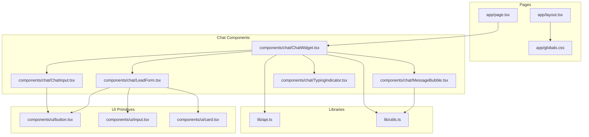
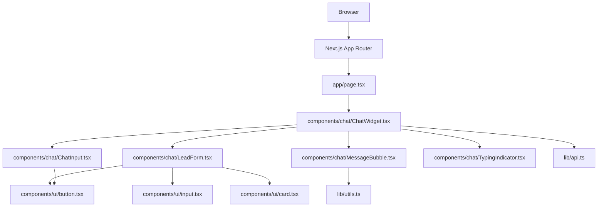
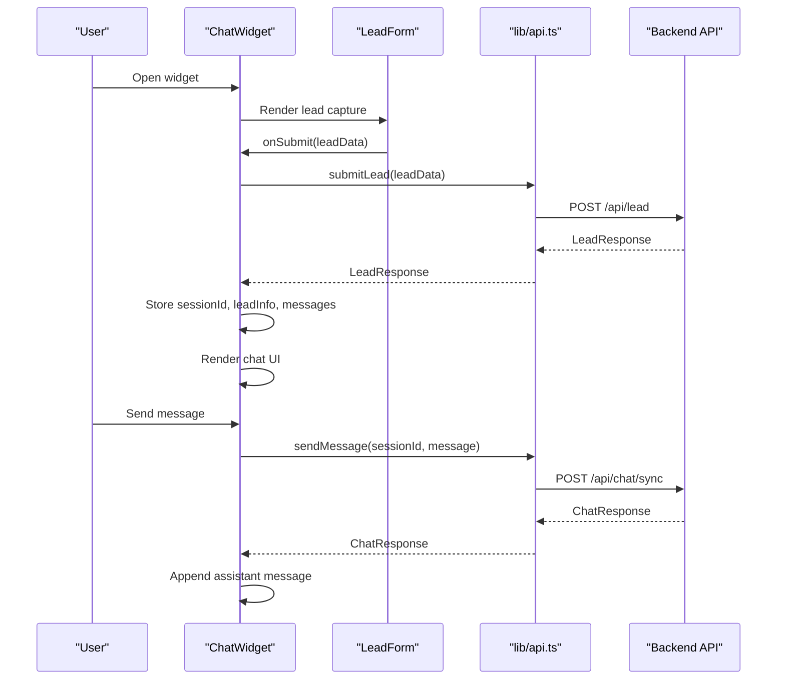
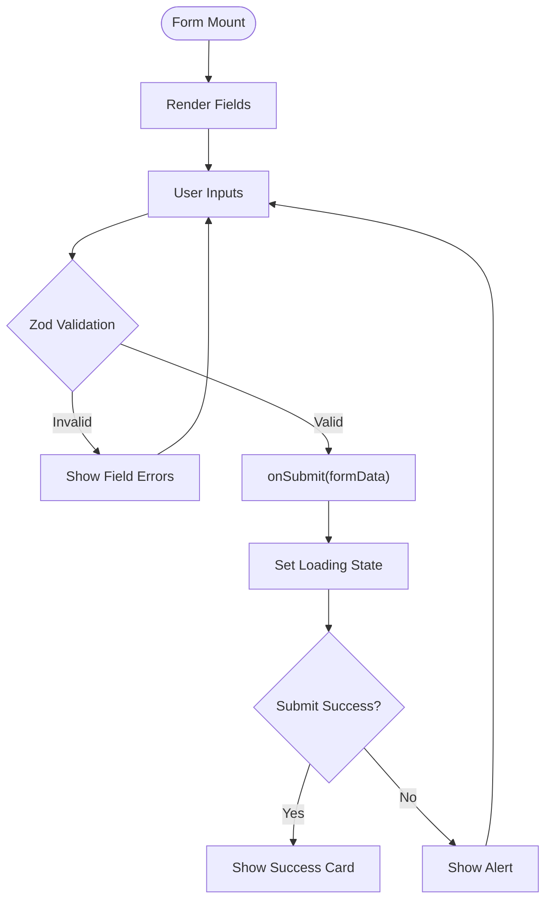
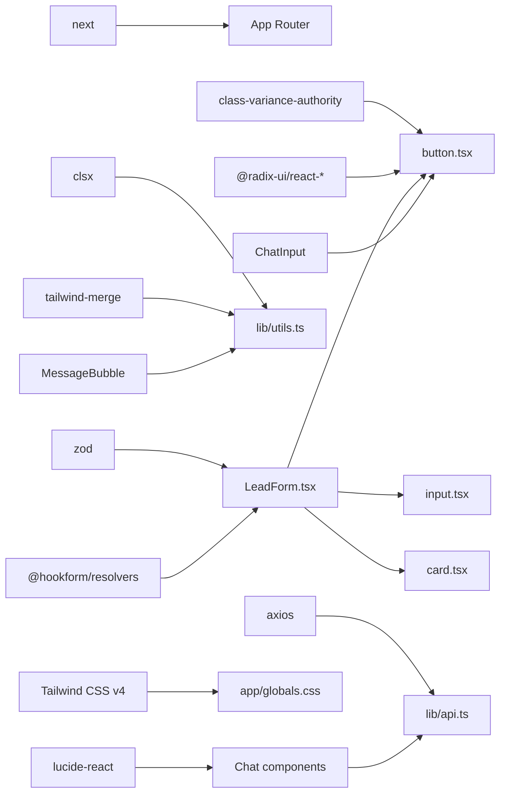

# Frontend Application

<cite>
**Referenced Files in This Document**
- [package.json](file://frontend/package.json)
- [next.config.ts](file://frontend/next.config.ts)
- [tsconfig.json](file://frontend/tsconfig.json)
- [app/layout.tsx](file://frontend/app/layout.tsx)
- [app/page.tsx](file://frontend/app/page.tsx)
- [app/globals.css](file://frontend/app/globals.css)
- [lib/api.ts](file://frontend/lib/api.ts)
- [lib/utils.ts](file://frontend/lib/utils.ts)
- [components/chat/ChatWidget.tsx](file://frontend/components/chat/ChatWidget.tsx)
- [components/chat/LeadForm.tsx](file://frontend/components/chat/LeadForm.tsx)
- [components/chat/MessageBubble.tsx](file://frontend/components/chat/MessageBubble.tsx)
- [components/chat/ChatInput.tsx](file://frontend/components/chat/ChatInput.tsx)
- [components/chat/TypingIndicator.tsx](file://frontend/components/chat/TypingIndicator.tsx)
- [components/ui/button.tsx](file://frontend/components/ui/button.tsx)
- [components/ui/input.tsx](file://frontend/components/ui/input.tsx)
- [components/ui/card.tsx](file://frontend/components/ui/card.tsx)
</cite>

## Table of Contents
1. [Introduction](#introduction)
2. [Project Structure](#project-structure)
3. [Core Components](#core-components)
4. [Architecture Overview](#architecture-overview)
5. [Detailed Component Analysis](#detailed-component-analysis)
6. [Dependency Analysis](#dependency-analysis)
7. [Performance Considerations](#performance-considerations)
8. [Troubleshooting Guide](#troubleshooting-guide)
9. [Conclusion](#conclusion)
10. [Appendices](#appendices)

## Introduction
This document describes the Next.js frontend application for the RAG-powered chatbot. It covers the App Router-based structure, component architecture, state management patterns, and integration with the backend API. It documents the main chat interface, lead capture form, and widget integration components. It also explains the API client implementation, TypeScript interfaces, utility functions, styling approach using Tailwind CSS and shadcn/ui primitives, responsive design, user interaction patterns, accessibility features, performance optimization, SEO considerations, and deployment configuration.

## Project Structure
The frontend is organized under the Next.js App Router with a clear separation of pages, components, and shared libraries:
- Pages: app/layout.tsx, app/page.tsx, app/globals.css
- API client: lib/api.ts
- Utilities: lib/utils.ts
- UI primitives: components/ui/*
- Chat widgets and forms: components/chat/*

**Diagram sources**
- [app/layout.tsx](file://frontend/app/layout.tsx)
- [app/page.tsx](file://frontend/app/page.tsx)
- [app/globals.css](file://frontend/app/globals.css)
- [lib/api.ts](file://frontend/lib/api.ts)
- [lib/utils.ts](file://frontend/lib/utils.ts)
- [components/chat/ChatWidget.tsx](file://frontend/components/chat/ChatWidget.tsx)
- [components/chat/LeadForm.tsx](file://frontend/components/chat/LeadForm.tsx)
- [components/chat/MessageBubble.tsx](file://frontend/components/chat/MessageBubble.tsx)
- [components/chat/ChatInput.tsx](file://frontend/components/chat/ChatInput.tsx)
- [components/chat/TypingIndicator.tsx](file://frontend/components/chat/TypingIndicator.tsx)
- [components/ui/button.tsx](file://frontend/components/ui/button.tsx)
- [components/ui/input.tsx](file://frontend/components/ui/input.tsx)
- [components/ui/card.tsx](file://frontend/components/ui/card.tsx)

**Section sources**
- [package.json](file://frontend/package.json)
- [next.config.ts](file://frontend/next.config.ts)
- [tsconfig.json](file://frontend/tsconfig.json)
- [app/layout.tsx](file://frontend/app/layout.tsx)
- [app/page.tsx](file://frontend/app/page.tsx)
- [app/globals.css](file://frontend/app/globals.css)

## Core Components
- ChatWidget: Central widget orchestrating lead capture, conversation, typing indicators, and human escalation. Manages session persistence via localStorage and integrates with the API client.
- LeadForm: Zod-based form capturing lead details with validation and submission feedback.
- MessageBubble: Renders user and assistant messages with timestamps and clickable URLs.
- ChatInput: Multi-line text input with auto-resize and Enter-to-send behavior.
- TypingIndicator: Animated typing cue for assistant messages.
- UI primitives: Reusable button, input, and card components built with shadcn/ui patterns and Tailwind CSS.

Key integration points:
- API client encapsulates base URL, request/response types, and endpoints for leads, chat, escalation, conversation retrieval, and health checks.
- Utility function cn merges Tailwind classes safely.

**Section sources**
- [components/chat/ChatWidget.tsx](file://frontend/components/chat/ChatWidget.tsx)
- [components/chat/LeadForm.tsx](file://frontend/components/chat/LeadForm.tsx)
- [components/chat/MessageBubble.tsx](file://frontend/components/chat/MessageBubble.tsx)
- [components/chat/ChatInput.tsx](file://frontend/components/chat/ChatInput.tsx)
- [components/chat/TypingIndicator.tsx](file://frontend/components/chat/TypingIndicator.tsx)
- [lib/api.ts](file://frontend/lib/api.ts)
- [lib/utils.ts](file://frontend/lib/utils.ts)
- [components/ui/button.tsx](file://frontend/components/ui/button.tsx)
- [components/ui/input.tsx](file://frontend/components/ui/input.tsx)
- [components/ui/card.tsx](file://frontend/components/ui/card.tsx)

## Architecture Overview
The application follows a layered architecture:
- Presentation layer: Next.js App Router pages and client components
- Domain layer: ChatWidget composes UI components and manages state
- Integration layer: API client module encapsulates backend communication
- Styling layer: Tailwind CSS v4 with shadcn/ui primitives

**Diagram sources**
- [app/page.tsx](file://frontend/app/page.tsx)
- [components/chat/ChatWidget.tsx](file://frontend/components/chat/ChatWidget.tsx)
- [components/chat/LeadForm.tsx](file://frontend/components/chat/LeadForm.tsx)
- [components/chat/MessageBubble.tsx](file://frontend/components/chat/MessageBubble.tsx)
- [components/chat/ChatInput.tsx](file://frontend/components/chat/ChatInput.tsx)
- [components/chat/TypingIndicator.tsx](file://frontend/components/chat/TypingIndicator.tsx)
- [lib/api.ts](file://frontend/lib/api.ts)
- [lib/utils.ts](file://frontend/lib/utils.ts)
- [components/ui/button.tsx](file://frontend/components/ui/button.tsx)
- [components/ui/input.tsx](file://frontend/components/ui/input.tsx)
- [components/ui/card.tsx](file://frontend/components/ui/card.tsx)

## Detailed Component Analysis

### ChatWidget
Responsibilities:
- Session lifecycle: create, persist, and restore sessions with TTL
- Lead capture: delegate to LeadForm and initialize conversation
- Messaging: append user messages, call API for assistant replies, render MessageBubble and TypingIndicator
- Escalation: forward conversation to human agents
- Rendering modes: floating widget and embedded full-page layouts

State management:
- Local state for open/closed visibility, lead info, session ID, messages, typing, loading, escalation flag
- Persisted state: session data in localStorage with timestamp

Integration:
- Uses API client for lead submission, chat sync, human escalation, and conversation retrieval
- Scrolls to bottom on new messages

Accessibility and UX:
- Disabled states during async operations
- Clear visual feedback for escalation and welcome messages

**Diagram sources**
- [components/chat/ChatWidget.tsx](file://frontend/components/chat/ChatWidget.tsx)
- [components/chat/LeadForm.tsx](file://frontend/components/chat/LeadForm.tsx)
- [lib/api.ts](file://frontend/lib/api.ts)

**Section sources**
- [components/chat/ChatWidget.tsx](file://frontend/components/chat/ChatWidget.tsx)
- [lib/api.ts](file://frontend/lib/api.ts)

### LeadForm
Responsibilities:
- Capture lead details with Zod validation
- Render form with labels, inputs, and dropdown options
- Provide success feedback after submission
- Integrate with parent via onSubmit callback

Validation:
- Full name minimum length
- Email format
- Saudi Arabia phone number pattern
- Optional company and inquiry type

Styling:
- Uses Card, Input, Label, Button primitives
- Conditional error styling and loader state

**Diagram sources**
- [components/chat/LeadForm.tsx](file://frontend/components/chat/LeadForm.tsx)

**Section sources**
- [components/chat/LeadForm.tsx](file://frontend/components/chat/LeadForm.tsx)
- [components/ui/button.tsx](file://frontend/components/ui/button.tsx)
- [components/ui/input.tsx](file://frontend/components/ui/input.tsx)
- [components/ui/card.tsx](file://frontend/components/ui/card.tsx)

### MessageBubble
Responsibilities:
- Render user vs assistant messages with distinct styling
- Format timestamps from ISO or current time
- Convert URLs to clickable links

Accessibility:
- Semantic icons for user and bot identities
- Proper contrast and readable typography

**Section sources**
- [components/chat/MessageBubble.tsx](file://frontend/components/chat/MessageBubble.tsx)
- [lib/utils.ts](file://frontend/lib/utils.ts)

### ChatInput
Responsibilities:
- Multi-line text input with auto-resize up to a max height
- Enter-to-send behavior (Shift+Enter for newline)
- Send button with disabled states

Accessibility:
- Focus ring and keyboard navigation support
- Disabled state styling

**Section sources**
- [components/chat/ChatInput.tsx](file://frontend/components/chat/ChatInput.tsx)
- [components/ui/button.tsx](file://frontend/components/ui/button.tsx)

### TypingIndicator
Responsibilities:
- Animated typing dots for assistant presence
- Consistent styling with message bubbles

**Section sources**
- [components/chat/TypingIndicator.tsx](file://frontend/components/chat/TypingIndicator.tsx)

### API Client
Responsibilities:
- Centralized HTTP client with base URL from environment
- Typed request/response interfaces for leads, chat, escalation, conversation retrieval, and health checks
- Exported functions for each endpoint

Endpoints:
- POST /api/lead
- POST /api/chat/sync
- POST /api/talk-to-human
- GET /api/conversation/{sessionId}
- GET /api/health

**Section sources**
- [lib/api.ts](file://frontend/lib/api.ts)

### UI Primitives
- Button: Variants (default, destructive, outline, secondary, ghost, link) and sizes with radix slot support
- Input: Styled base input with focus states
- Card: Header, Title, Description, Content, Footer slots

**Section sources**
- [components/ui/button.tsx](file://frontend/components/ui/button.tsx)
- [components/ui/input.tsx](file://frontend/components/ui/input.tsx)
- [components/ui/card.tsx](file://frontend/components/ui/card.tsx)

## Dependency Analysis
External dependencies and their roles:
- next: App Router, SSR/SSG, image optimization configuration
- react/react-dom: UI runtime
- axios: HTTP client for API communication
- lucide-react: Icons
- @hookform/resolvers + zod: Form validation
- class-variance-authority + clsx + tailwind-merge: Component variants and class merging
- @radix-ui/react-*: Accessible UI primitives
- Tailwind CSS v4: Utility-first styling

Internal dependencies:
- Components depend on UI primitives and lib/utils
- ChatWidget depends on API client and child components
- Pages depend on ChatWidget

**Diagram sources**
- [package.json](file://frontend/package.json)
- [lib/api.ts](file://frontend/lib/api.ts)
- [lib/utils.ts](file://frontend/lib/utils.ts)
- [components/chat/LeadForm.tsx](file://frontend/components/chat/LeadForm.tsx)
- [components/chat/ChatInput.tsx](file://frontend/components/chat/ChatInput.tsx)
- [components/chat/MessageBubble.tsx](file://frontend/components/chat/MessageBubble.tsx)
- [components/ui/button.tsx](file://frontend/components/ui/button.tsx)
- [components/ui/input.tsx](file://frontend/components/ui/input.tsx)
- [components/ui/card.tsx](file://frontend/components/ui/card.tsx)
- [app/globals.css](file://frontend/app/globals.css)

**Section sources**
- [package.json](file://frontend/package.json)

## Performance Considerations
- Client-side rendering: All interactive components are client components, enabling dynamic state updates without server roundtrips.
- Local storage caching: Sessions persist across browser reloads with TTL to avoid unnecessary backend calls.
- Minimal re-renders: Individual components manage their own state; avoid unnecessary prop drilling by keeping state local where appropriate.
- Image optimization: Images are unoptimized in current config; consider enabling optimized images for production builds.
- Bundle size: Keep UI primitives small and lazy-load heavy assets if needed.
- Accessibility: Use semantic HTML and proper focus management; ensure keyboard navigation works across forms and buttons.

[No sources needed since this section provides general guidance]

## Troubleshooting Guide
Common issues and resolutions:
- API connectivity: Verify NEXT_PUBLIC_API_URL environment variable and network access to backend endpoints.
- Session restoration: If sessions do not persist, check localStorage availability and TTL logic.
- Form validation: Ensure Zod schema matches backend expectations; display validation messages clearly.
- Styling conflicts: Confirm Tailwind configuration and class merging via cn utility.
- Escalation flow: Confirm human escalation endpoint and user confirmation dialog behavior.

**Section sources**
- [lib/api.ts](file://frontend/lib/api.ts)
- [components/chat/ChatWidget.tsx](file://frontend/components/chat/ChatWidget.tsx)
- [components/chat/LeadForm.tsx](file://frontend/components/chat/LeadForm.tsx)
- [lib/utils.ts](file://frontend/lib/utils.ts)

## Conclusion
The frontend application leverages Next.js App Router, a modular component architecture, and a typed API client to deliver a responsive, accessible chat experience. The ChatWidget orchestrates lead capture, conversation, and escalation while maintaining session continuity. UI primitives from shadcn/ui and Tailwind CSS provide consistent styling. With careful attention to performance, accessibility, and deployment configuration, the application is ready for production.

[No sources needed since this section summarizes without analyzing specific files]

## Appendices

### Responsive Design and Accessibility
- Responsive layout: Flexbox and max-width constraints ensure proper sizing on mobile and desktop.
- Accessibility: Buttons, inputs, and cards follow semantic patterns; focus states and keyboard navigation are supported.
- Color scheme: Brand colors (#E30613, #C00510, #003087) are applied consistently; consider WCAG contrast ratios for text.

**Section sources**
- [app/page.tsx](file://frontend/app/page.tsx)
- [components/chat/ChatWidget.tsx](file://frontend/components/chat/ChatWidget.tsx)
- [components/chat/MessageBubble.tsx](file://frontend/components/chat/MessageBubble.tsx)
- [components/ui/button.tsx](file://frontend/components/ui/button.tsx)
- [components/ui/input.tsx](file://frontend/components/ui/input.tsx)
- [components/ui/card.tsx](file://frontend/components/ui/card.tsx)

### SEO Considerations
- Metadata: Title and description are configured at the root layout level.
- Static export: Build output is configured for static export; ensure canonical URLs and meta tags are added if needed.

**Section sources**
- [app/layout.tsx](file://frontend/app/layout.tsx)
- [next.config.ts](file://frontend/next.config.ts)

### Deployment Configuration
- Static export: The build targets static export with a custom dist directory and unoptimized images.
- Environment variables: NEXT_PUBLIC_API_URL is exposed to the client.
- TypeScript: Strict mode enabled with modern compiler options.

**Section sources**
- [next.config.ts](file://frontend/next.config.ts)
- [tsconfig.json](file://frontend/tsconfig.json)