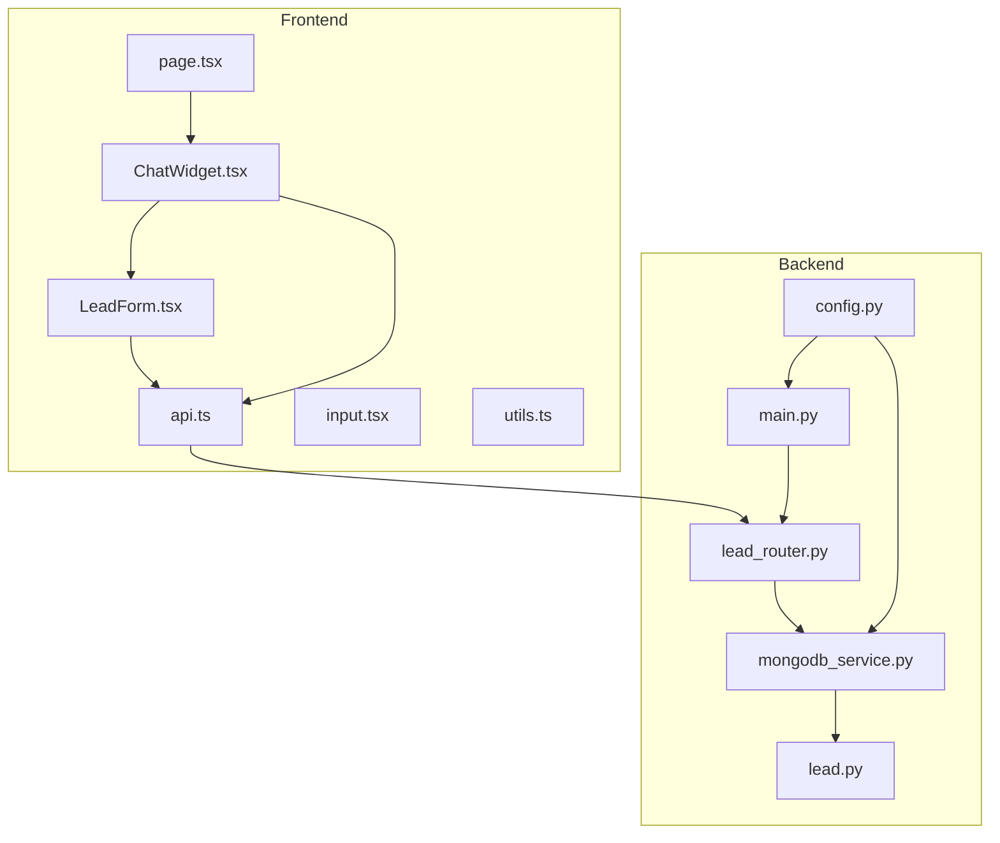
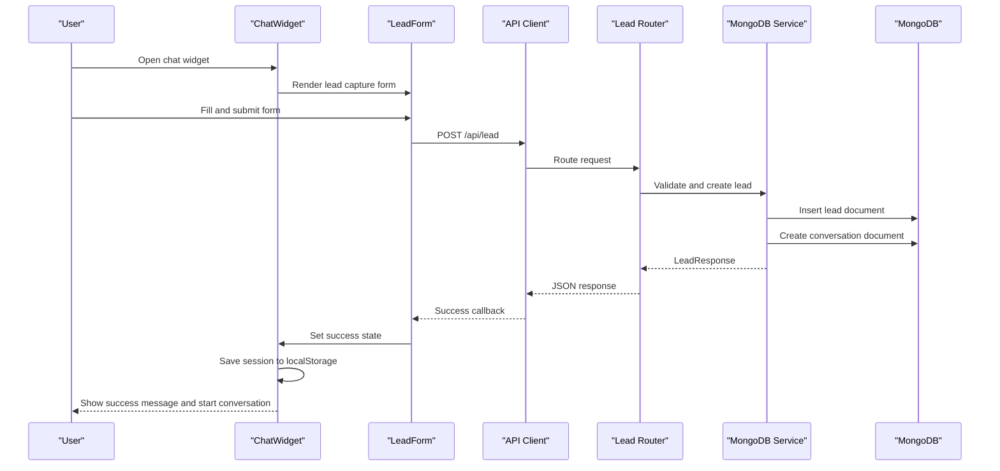
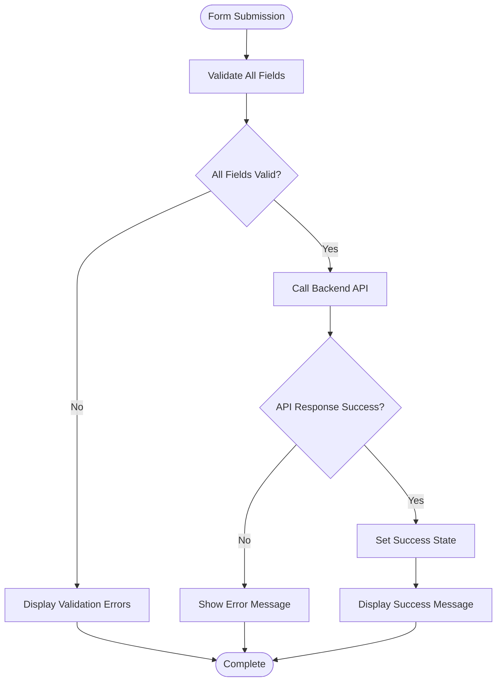
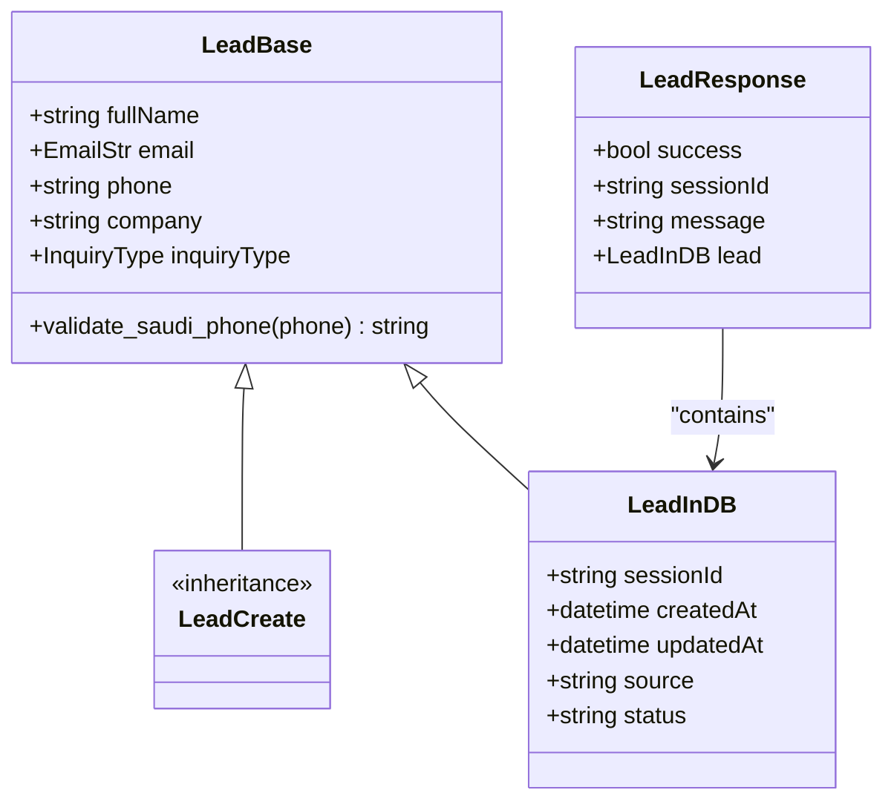
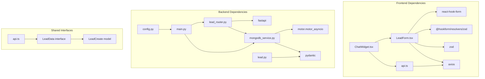

# Lead Capture System

<cite>
**Referenced Files in This Document**
- [LeadForm.tsx](file://frontend/components/chat/LeadForm.tsx)
- [api.ts](file://frontend/lib/api.ts)
- [ChatWidget.tsx](file://frontend/components/chat/ChatWidget.tsx)
- [page.tsx](file://frontend/app/page.tsx)
- [lead.py](file://backend/app/models/lead.py)
- [lead_router.py](file://backend/app/routers/lead_router.py)
- [mongodb_service.py](file://backend/app/services/mongodb_service.py)
- [main.py](file://backend/app/main.py)
- [config.py](file://backend/app/config.py)
- [input.tsx](file://frontend/components/ui/input.tsx)
- [utils.ts](file://frontend/lib/utils.ts)
</cite>

## Table of Contents
1. [Introduction](#introduction)
2. [Project Structure](#project-structure)
3. [Core Components](#core-components)
4. [Architecture Overview](#architecture-overview)
5. [Detailed Component Analysis](#detailed-component-analysis)
6. [Dependency Analysis](#dependency-analysis)
7. [Performance Considerations](#performance-considerations)
8. [Troubleshooting Guide](#troubleshooting-guide)
9. [Conclusion](#conclusion)

## Introduction
This document provides comprehensive documentation for the lead capture system, focusing on the LeadForm component implementation, form validation, and data submission process. It explains the integration with the backend API, error handling, and success feedback mechanisms. The document also covers form customization, validation rules, user experience enhancements, and the complete lead data flow from form submission to backend processing, including session management and user state handling.

## Project Structure
The lead capture system spans both frontend and backend components:
- Frontend: LeadForm component, API client, and ChatWidget integration
- Backend: Lead model definitions, API router, and MongoDB service for persistence

**Diagram sources**
- [LeadForm.tsx:1-168](file://frontend/components/chat/LeadForm.tsx#L1-L168)
- [api.ts:1-93](file://frontend/lib/api.ts#L1-L93)
- [ChatWidget.tsx:1-307](file://frontend/components/chat/ChatWidget.tsx#L1-L307)
- [page.tsx:1-12](file://frontend/app/page.tsx#L1-L12)
- [lead.py:1-64](file://backend/app/models/lead.py#L1-L64)
- [lead_router.py:1-57](file://backend/app/routers/lead_router.py#L1-L57)
- [mongodb_service.py:1-202](file://backend/app/services/mongodb_service.py#L1-L202)
- [main.py:1-90](file://backend/app/main.py#L1-L90)
- [config.py:1-65](file://backend/app/config.py#L1-L65)

**Section sources**
- [LeadForm.tsx:1-168](file://frontend/components/chat/LeadForm.tsx#L1-L168)
- [api.ts:1-93](file://frontend/lib/api.ts#L1-L93)
- [ChatWidget.tsx:1-307](file://frontend/components/chat/ChatWidget.tsx#L1-L307)
- [page.tsx:1-12](file://frontend/app/page.tsx#L1-L12)
- [lead.py:1-64](file://backend/app/models/lead.py#L1-L64)
- [lead_router.py:1-57](file://backend/app/routers/lead_router.py#L1-L57)
- [mongodb_service.py:1-202](file://backend/app/services/mongodb_service.py#L1-L202)
- [main.py:1-90](file://backend/app/main.py#L1-L90)
- [config.py:1-65](file://backend/app/config.py#L1-L65)

## Core Components
The lead capture system consists of several interconnected components:

### Frontend Components
- LeadForm: Handles form rendering, validation, and submission
- API Client: Manages HTTP requests to backend endpoints
- ChatWidget: Orchestrates session state and integrates lead capture flow
- UI Components: Reusable input components with Tailwind styling

### Backend Components
- Lead Models: Define data structures and validation rules
- Lead Router: Exposes API endpoints for lead submission
- MongoDB Service: Provides persistence and session management
- Application Configuration: Centralized settings management

**Section sources**
- [LeadForm.tsx:23-26](file://frontend/components/chat/LeadForm.tsx#L23-L26)
- [api.ts:14-27](file://frontend/lib/api.ts#L14-L27)
- [ChatWidget.tsx:24-36](file://frontend/components/chat/ChatWidget.tsx#L24-L36)
- [lead.py:18-64](file://backend/app/models/lead.py#L18-L64)
- [lead_router.py:8-8](file://backend/app/routers/lead_router.py#L8-L8)
- [mongodb_service.py:13-202](file://backend/app/services/mongodb_service.py#L13-L202)
- [config.py:7-65](file://backend/app/config.py#L7-L65)

## Architecture Overview
The lead capture system follows a client-server architecture with clear separation of concerns:

**Diagram sources**
- [ChatWidget.tsx:84-108](file://frontend/components/chat/ChatWidget.tsx#L84-L108)
- [LeadForm.tsx:39-42](file://frontend/components/chat/LeadForm.tsx#L39-L42)
- [api.ts:61-64](file://frontend/lib/api.ts#L61-L64)
- [lead_router.py:11-44](file://backend/app/routers/lead_router.py#L11-L44)
- [mongodb_service.py:51-77](file://backend/app/services/mongodb_service.py#L51-L77)

The system handles session persistence through localStorage with a 24-hour TTL, ensuring continuity across browser sessions while maintaining data freshness.

**Section sources**
- [ChatWidget.tsx:24-77](file://frontend/components/chat/ChatWidget.tsx#L24-L77)
- [lead_router.py:24-44](file://backend/app/routers/lead_router.py#L24-L44)
- [mongodb_service.py:51-77](file://backend/app/services/mongodb_service.py#L51-L77)

## Detailed Component Analysis

### LeadForm Component Implementation
The LeadForm component serves as the primary interface for capturing lead information with comprehensive validation and user feedback.

#### Form Structure and Fields
The form captures essential lead information with strategic validation:
- Full Name: Required, minimum 2 characters
- Email: Required, validated as proper email format
- Phone: Required, validated for Saudi phone numbers (+966, 966, or 0 prefix)
- Company: Optional field for professional context
- Inquiry Type: Dropdown selection with predefined categories

#### Validation Strategy
The component employs dual-layer validation:
1. **Frontend Validation**: Real-time Zod-based validation with immediate feedback
2. **Backend Validation**: Pydantic-based validation for data integrity

**Diagram sources**
- [LeadForm.tsx:13-19](file://frontend/components/chat/LeadForm.tsx#L13-L19)
- [LeadForm.tsx:39-42](file://frontend/components/chat/LeadForm.tsx#L39-L42)
- [LeadForm.tsx:83-116](file://frontend/components/chat/LeadForm.tsx#L83-L116)

#### User Experience Enhancements
The component provides several UX improvements:
- Real-time validation feedback with color-coded borders
- Loading states during submission with spinner animation
- Success state with celebratory icon and confirmation message
- Accessible form labels with required field indicators
- Responsive design with Tailwind CSS classes

**Section sources**
- [LeadForm.tsx:13-19](file://frontend/components/chat/LeadForm.tsx#L13-L19)
- [LeadForm.tsx:72-166](file://frontend/components/chat/LeadForm.tsx#L72-L166)
- [input.tsx:1-25](file://frontend/components/ui/input.tsx#L1-L25)
- [utils.ts:1-7](file://frontend/lib/utils.ts#L1-L7)

### Backend API Integration
The backend provides robust lead processing with intelligent session management.

#### Lead Model Validation
The backend enforces comprehensive validation rules:
- Phone number validation accepts multiple Saudi formats
- Email validation ensures proper format compliance
- Length constraints prevent data corruption
- Enum validation restricts inquiry types to predefined values

#### Session Management
The system implements sophisticated session handling:
- Unique session ID generation using UUID
- Automatic conversation initialization
- Email-based session reuse detection
- Database indexing for optimal query performance

**Diagram sources**
- [lead.py:18-64](file://backend/app/models/lead.py#L18-L64)

**Section sources**
- [lead.py:18-64](file://backend/app/models/lead.py#L18-L64)
- [lead_router.py:11-44](file://backend/app/routers/lead_router.py#L11-L44)
- [mongodb_service.py:51-77](file://backend/app/services/mongodb_service.py#L51-L77)

### Data Flow and Processing
The complete data flow demonstrates end-to-end processing from user input to persistent storage.

#### Submission Process
1. **Form Validation**: Frontend validates user input immediately
2. **API Request**: Validated data sent to backend endpoint
3. **Duplicate Detection**: Backend checks for existing email sessions
4. **Persistence**: New leads create session documents and conversation records
5. **Response**: Success response with session ID and lead information

#### Session Persistence
The system maintains session continuity through multiple mechanisms:
- Browser localStorage with 24-hour TTL
- Backend session ID association
- Conversation history preservation
- User state synchronization

**Section sources**
- [ChatWidget.tsx:84-108](file://frontend/components/chat/ChatWidget.tsx#L84-L108)
- [lead_router.py:24-38](file://backend/app/routers/lead_router.py#L24-L38)
- [mongodb_service.py:79-94](file://backend/app/services/mongodb_service.py#L79-L94)

## Dependency Analysis
The lead capture system exhibits clean architectural boundaries with minimal coupling between components.

**Diagram sources**
- [LeadForm.tsx:3-11](file://frontend/components/chat/LeadForm.tsx#L3-L11)
- [ChatWidget.tsx:6-10](file://frontend/components/chat/ChatWidget.tsx#L6-L10)
- [api.ts:14-27](file://frontend/lib/api.ts#L14-L27)
- [lead_router.py:2-6](file://backend/app/routers/lead_router.py#L2-L6)
- [mongodb_service.py:5-10](file://backend/app/services/mongodb_service.py#L5-L10)
- [lead.py:2-5](file://backend/app/models/lead.py#L2-L5)
- [main.py:4-11](file://backend/app/main.py#L4-L11)
- [config.py:2-4](file://backend/app/config.py#L2-L4)

The dependency structure ensures:
- Loose coupling between frontend and backend
- Clear separation of concerns
- Testable components through interface abstraction
- Scalable architecture for future enhancements

**Section sources**
- [LeadForm.tsx:1-168](file://frontend/components/chat/LeadForm.tsx#L1-L168)
- [api.ts:1-93](file://frontend/lib/api.ts#L1-L93)
- [lead_router.py:1-57](file://backend/app/routers/lead_router.py#L1-L57)
- [mongodb_service.py:1-202](file://backend/app/services/mongodb_service.py#L1-L202)

## Performance Considerations
The lead capture system incorporates several performance optimizations:

### Frontend Optimizations
- **Lazy Loading**: Components load only when needed
- **State Management**: Efficient local state updates minimize re-renders
- **Validation Caching**: Zod resolver caches compiled schemas
- **Memory Management**: Proper cleanup of event listeners and timers

### Backend Optimizations
- **Database Indexes**: Strategic indexing on frequently queried fields
- **Connection Pooling**: Reusable MongoDB connections
- **Response Caching**: Session reuse reduces database queries
- **Asynchronous Operations**: Non-blocking I/O operations

### Scalability Features
- **Session Cleanup**: Automated removal of expired sessions
- **Rate Limiting**: Built-in protection against abuse
- **Horizontal Scaling**: Stateless API design supports load balancing
- **CDN Integration**: Static assets served via content delivery network

## Troubleshooting Guide

### Common Issues and Solutions

#### Form Validation Failures
**Symptoms**: Validation errors not displaying or incorrect error messages
**Causes**: 
- Missing resolver configuration
- Incorrect field registration
- Schema mismatch between frontend and backend

**Solutions**:
- Verify Zod resolver is properly configured
- Ensure all form fields are registered with react-hook-form
- Confirm frontend and backend schemas match exactly

#### API Communication Errors
**Symptoms**: Network errors or timeout failures
**Causes**:
- Incorrect API URL configuration
- CORS policy violations
- Network connectivity issues

**Solutions**:
- Validate NEXT_PUBLIC_API_URL environment variable
- Check backend CORS configuration
- Implement retry logic for transient failures

#### Session Management Issues
**Symptoms**: Session not persisting or expiring unexpectedly
**Causes**:
- LocalStorage quota exceeded
- Session TTL misconfiguration
- Cross-browser compatibility issues

**Solutions**:
- Monitor localStorage usage and implement cleanup
- Adjust SESSION_TTL_HOURS setting appropriately
- Test across different browsers and devices

#### Backend Processing Errors
**Symptoms**: 500 server errors or inconsistent responses
**Causes**:
- Database connection failures
- Validation schema mismatches
- Missing environment variables

**Solutions**:
- Verify MongoDB connection string and credentials
- Check environment variable configuration
- Implement comprehensive error logging

**Section sources**
- [ChatWidget.tsx:84-108](file://frontend/components/chat/ChatWidget.tsx#L84-L108)
- [lead_router.py:40-44](file://backend/app/routers/lead_router.py#L40-L44)
- [config.py:15-18](file://backend/app/config.py#L15-L18)

## Conclusion
The lead capture system provides a robust, scalable solution for collecting customer information with seamless integration between frontend and backend components. The implementation demonstrates best practices in form validation, error handling, and user experience design while maintaining clean architectural boundaries and performance optimizations.

Key strengths of the system include:
- Comprehensive validation at both frontend and backend levels
- Intelligent session management with persistence
- Clean separation of concerns with well-defined interfaces
- Responsive design with accessible form elements
- Scalable architecture supporting future enhancements

The system successfully balances user experience with technical robustness, providing reliable lead capture functionality that can be easily customized and extended for various use cases.