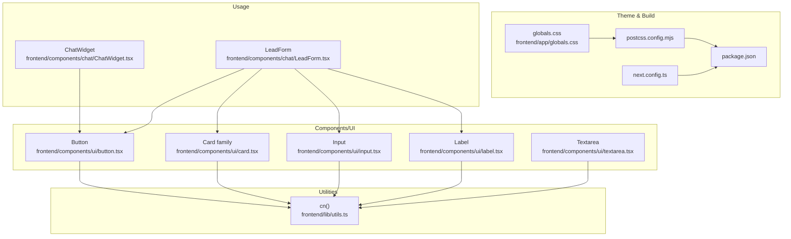
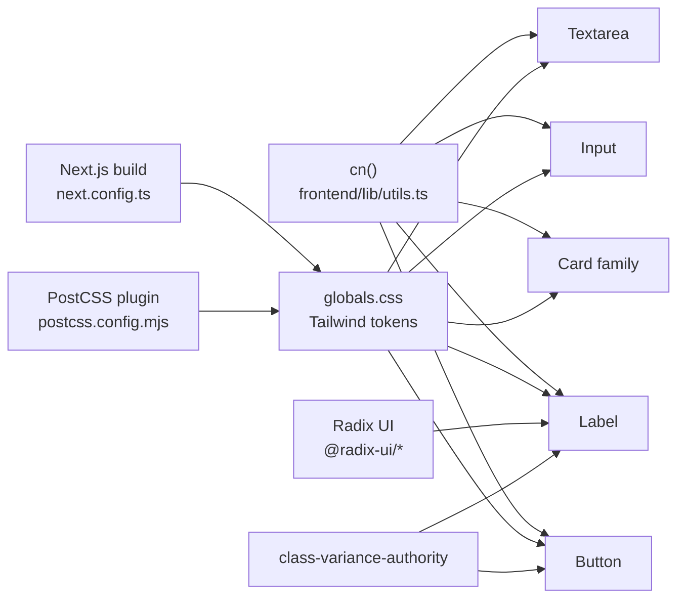
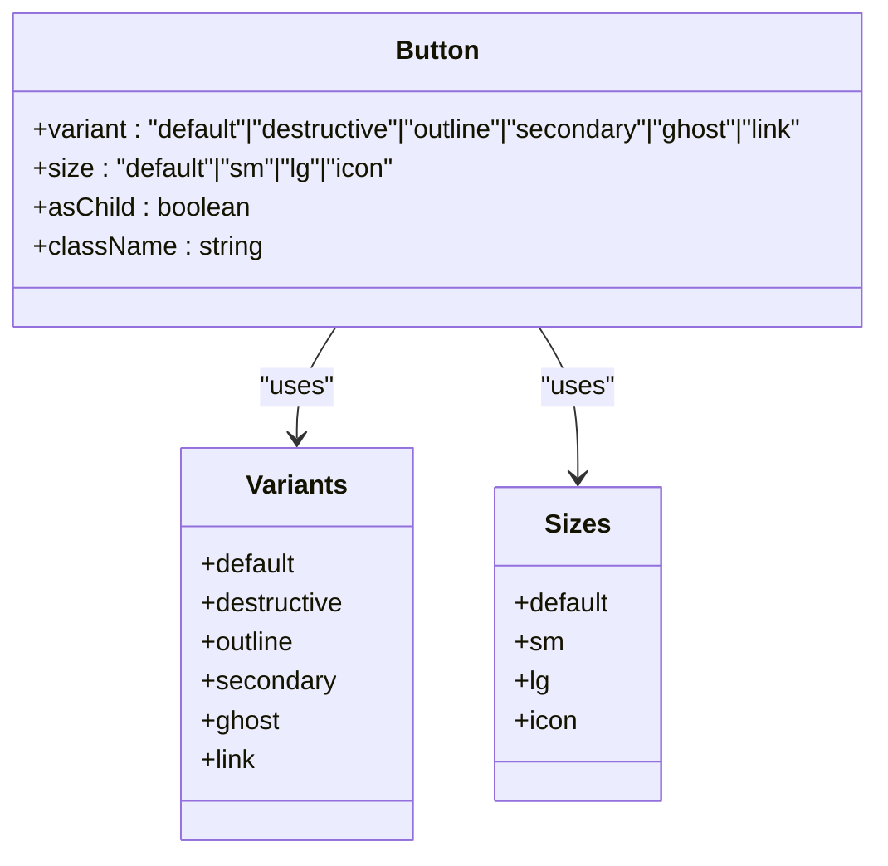
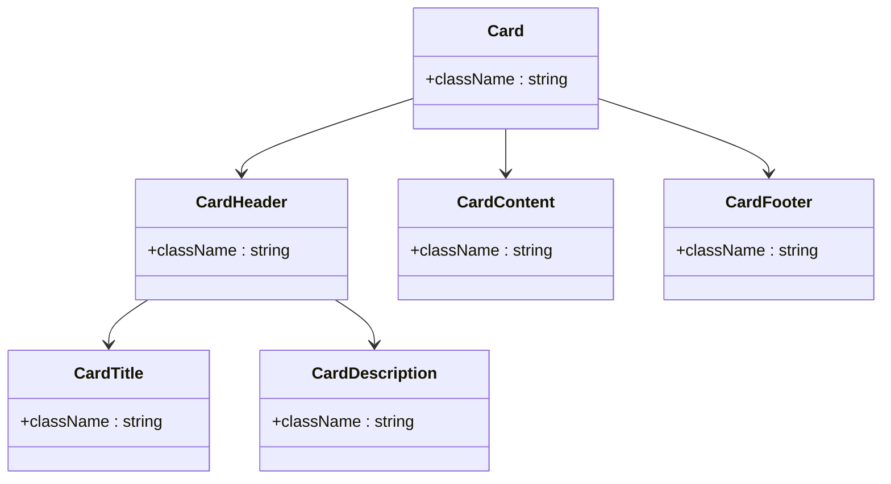
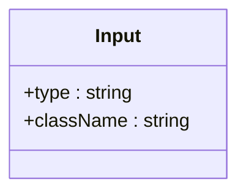
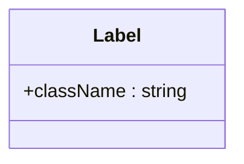
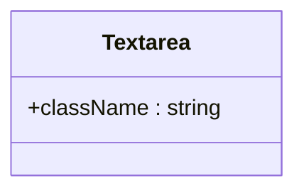
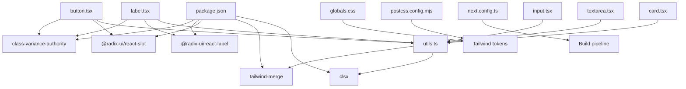

# UI Component Library

<cite>
**Referenced Files in This Document**
- [button.tsx](file://frontend/components/ui/button.tsx)
- [card.tsx](file://frontend/components/ui/card.tsx)
- [input.tsx](file://frontend/components/ui/input.tsx)
- [label.tsx](file://frontend/components/ui/label.tsx)
- [textarea.tsx](file://frontend/components/ui/textarea.tsx)
- [utils.ts](file://frontend/lib/utils.ts)
- [globals.css](file://frontend/app/globals.css)
- [package.json](file://frontend/package.json)
- [postcss.config.mjs](file://frontend/postcss.config.mjs)
- [next.config.ts](file://frontend/next.config.ts)
- [ChatWidget.tsx](file://frontend/components/chat/ChatWidget.tsx)
- [LeadForm.tsx](file://frontend/components/chat/LeadForm.tsx)
</cite>

## Table of Contents
1. [Introduction](#introduction)
2. [Project Structure](#project-structure)
3. [Core Components](#core-components)
4. [Architecture Overview](#architecture-overview)
5. [Detailed Component Analysis](#detailed-component-analysis)
6. [Dependency Analysis](#dependency-analysis)
7. [Performance Considerations](#performance-considerations)
8. [Troubleshooting Guide](#troubleshooting-guide)
9. [Conclusion](#conclusion)
10. [Appendices](#appendices)

## Introduction
This document describes the custom UI component library built with shadcn/ui-inspired patterns and Tailwind CSS in the frontend. It focuses on the button, card, input, label, and textarea components, explaining their props, styling variants, customization options, accessibility features, state management, and composition patterns. It also provides guidelines for extending the library while maintaining design consistency and integrating with themes and responsive design.

## Project Structure
The UI components live under the components/ui directory and are consumed by chat widgets and forms. Utility functions centralize Tailwind class merging, and global styles define theme tokens and base styles. Build-time configuration integrates Tailwind via PostCSS and Next.js.

**Diagram sources**
- [button.tsx:1-57](file://frontend/components/ui/button.tsx#L1-L57)
- [card.tsx:1-76](file://frontend/components/ui/card.tsx#L1-L76)
- [input.tsx:1-25](file://frontend/components/ui/input.tsx#L1-L25)
- [label.tsx:1-26](file://frontend/components/ui/label.tsx#L1-L26)
- [textarea.tsx:1-24](file://frontend/components/ui/textarea.tsx#L1-L24)
- [utils.ts:1-7](file://frontend/lib/utils.ts#L1-L7)
- [globals.css:1-27](file://frontend/app/globals.css#L1-L27)
- [postcss.config.mjs:1-8](file://frontend/postcss.config.mjs#L1-L8)
- [next.config.ts:1-15](file://frontend/next.config.ts#L1-L15)
- [package.json:1-37](file://frontend/package.json#L1-L37)
- [ChatWidget.tsx:1-307](file://frontend/components/chat/ChatWidget.tsx#L1-L307)
- [LeadForm.tsx:1-168](file://frontend/components/chat/LeadForm.tsx#L1-L168)

**Section sources**
- [button.tsx:1-57](file://frontend/components/ui/button.tsx#L1-L57)
- [card.tsx:1-76](file://frontend/components/ui/card.tsx#L1-L76)
- [input.tsx:1-25](file://frontend/components/ui/input.tsx#L1-L25)
- [label.tsx:1-26](file://frontend/components/ui/label.tsx#L1-L26)
- [textarea.tsx:1-24](file://frontend/components/ui/textarea.tsx#L1-L24)
- [utils.ts:1-7](file://frontend/lib/utils.ts#L1-L7)
- [globals.css:1-27](file://frontend/app/globals.css#L1-L27)
- [postcss.config.mjs:1-8](file://frontend/postcss.config.mjs#L1-L8)
- [next.config.ts:1-15](file://frontend/next.config.ts#L1-L15)
- [package.json:1-37](file://frontend/package.json#L1-L37)
- [ChatWidget.tsx:1-307](file://frontend/components/chat/ChatWidget.tsx#L1-L307)
- [LeadForm.tsx:1-168](file://frontend/components/chat/LeadForm.tsx#L1-L168)

## Core Components
This section documents the five UI primitives and their capabilities.

- Button
  - Purpose: Action trigger with multiple variants and sizes.
  - Props:
    - Inherits standard button attributes.
    - variant: default, destructive, outline, secondary, ghost, link.
    - size: default, sm, lg, icon.
    - asChild: renders using a slot composition pattern.
  - Styling: Uses class variance authority for variants and sizes; integrates focus-visible ring and disabled states.
  - Accessibility: Supports keyboard focus and screen readers via native button semantics.
  - Composition: Works seamlessly with icons and child elements.

- Card
  - Purpose: Container with header, title, description, content, and footer slots.
  - Props: Standard div attributes for each part.
  - Styling: Base card uses background and border tokens; parts apply spacing and typography utilities.
  - Accessibility: Semantic grouping with proper heading hierarchy recommended in usage.

- Input
  - Purpose: Text field with consistent focus states and placeholder styling.
  - Props: Inherits standard input attributes.
  - Styling: Border, background, padding, and focus ring applied consistently.
  - Accessibility: Use with Label for proper association.

- Label
  - Purpose: Accessible label for form controls.
  - Props: Inherits Radix label attributes; supports variant styling via class variance authority.
  - Accessibility: Peer-based disabled state and semantic association with form controls.

- Textarea
  - Purpose: Multi-line text input with consistent focus and disabled states.
  - Props: Inherits standard textarea attributes.
  - Styling: Same foundational tokens as Input with appropriate padding and min height.

**Section sources**
- [button.tsx:6-34](file://frontend/components/ui/button.tsx#L6-L34)
- [button.tsx:36-40](file://frontend/components/ui/button.tsx#L36-L40)
- [card.tsx:4-17](file://frontend/components/ui/card.tsx#L4-L17)
- [card.tsx:19-29](file://frontend/components/ui/card.tsx#L19-L29)
- [card.tsx:31-41](file://frontend/components/ui/card.tsx#L31-L41)
- [card.tsx:43-53](file://frontend/components/ui/card.tsx#L43-L53)
- [card.tsx:55-61](file://frontend/components/ui/card.tsx#L55-L61)
- [card.tsx:63-73](file://frontend/components/ui/card.tsx#L63-L73)
- [input.tsx:4-5](file://frontend/components/ui/input.tsx#L4-L5)
- [label.tsx:12-22](file://frontend/components/ui/label.tsx#L12-L22)
- [textarea.tsx:4-5](file://frontend/components/ui/textarea.tsx#L4-L5)

## Architecture Overview
The components rely on a shared utility for class merging and a theme-driven CSS foundation. They integrate with Radix UI for accessible primitives and shadcn-inspired variant systems.

**Diagram sources**
- [utils.ts:4-6](file://frontend/lib/utils.ts#L4-L6)
- [button.tsx:1-4](file://frontend/components/ui/button.tsx#L1-L4)
- [label.tsx:3-6](file://frontend/components/ui/label.tsx#L3-L6)
- [globals.css:1-27](file://frontend/app/globals.css#L1-L27)
- [postcss.config.mjs:1-8](file://frontend/postcss.config.mjs#L1-L8)
- [next.config.ts:1-15](file://frontend/next.config.ts#L1-L15)

## Detailed Component Analysis

### Button Component
- Implementation highlights:
  - Uses class variance authority to define variants and sizes.
  - Supports composition via asChild to render as a different element.
  - Integrates focus-visible ring and pointer-events handling for disabled states.
- Props and customization:
  - variant: default, destructive, outline, secondary, ghost, link.
  - size: default, sm, lg, icon.
  - className: additive customization.
  - asChild: enables slot-based composition.
- Accessibility:
  - Inherits native button semantics; focus ring visible for keyboard navigation.
- Usage patterns:
  - Combined with icons and used in forms and chat actions.

**Diagram sources**
- [button.tsx:6-34](file://frontend/components/ui/button.tsx#L6-L34)

**Section sources**
- [button.tsx:6-34](file://frontend/components/ui/button.tsx#L6-L34)
- [button.tsx:36-40](file://frontend/components/ui/button.tsx#L36-L40)

### Card Component Family
- Implementation highlights:
  - Provides container, header, title, description, content, and footer parts.
  - Each part is a forwardRef component inheriting standard div attributes.
- Props and customization:
  - className prop allows additive styling per part.
- Accessibility:
  - Encourage semantic heading usage inside CardTitle and logical grouping.

**Diagram sources**
- [card.tsx:4-17](file://frontend/components/ui/card.tsx#L4-L17)
- [card.tsx:19-29](file://frontend/components/ui/card.tsx#L19-L29)
- [card.tsx:31-41](file://frontend/components/ui/card.tsx#L31-L41)
- [card.tsx:43-53](file://frontend/components/ui/card.tsx#L43-L53)
- [card.tsx:55-61](file://frontend/components/ui/card.tsx#L55-L61)
- [card.tsx:63-73](file://frontend/components/ui/card.tsx#L63-L73)

**Section sources**
- [card.tsx:4-17](file://frontend/components/ui/card.tsx#L4-L17)
- [card.tsx:19-29](file://frontend/components/ui/card.tsx#L19-L29)
- [card.tsx:31-41](file://frontend/components/ui/card.tsx#L31-L41)
- [card.tsx:43-53](file://frontend/components/ui/card.tsx#L43-L53)
- [card.tsx:55-61](file://frontend/components/ui/card.tsx#L55-L61)
- [card.tsx:63-73](file://frontend/components/ui/card.tsx#L63-L73)

### Input Component
- Implementation highlights:
  - Inherits standard input attributes and applies consistent focus and disabled styling.
- Props and customization:
  - className: additive customization.
  - type: standard input types.
- Accessibility:
  - Pair with Label for proper association.

**Diagram sources**
- [input.tsx:4-5](file://frontend/components/ui/input.tsx#L4-L5)
- [input.tsx:7-21](file://frontend/components/ui/input.tsx#L7-L21)

**Section sources**
- [input.tsx:4-5](file://frontend/components/ui/input.tsx#L4-L5)
- [input.tsx:7-21](file://frontend/components/ui/input.tsx#L7-L21)

### Label Component
- Implementation highlights:
  - Uses Radix UI Label primitive with class variance authority for variant styling.
  - Disabled state handled via peer utilities.
- Props and customization:
  - className: additive customization.
- Accessibility:
  - Ensures proper labeling for form controls; peer-disabled state improves UX.

**Diagram sources**
- [label.tsx:12-22](file://frontend/components/ui/label.tsx#L12-L22)
- [label.tsx:3-6](file://frontend/components/ui/label.tsx#L3-L6)

**Section sources**
- [label.tsx:8-10](file://frontend/components/ui/label.tsx#L8-L10)
- [label.tsx:12-22](file://frontend/components/ui/label.tsx#L12-L22)

### Textarea Component
- Implementation highlights:
  - Inherits standard textarea attributes with consistent focus and disabled styling.
- Props and customization:
  - className: additive customization.
- Accessibility:
  - Pair with Label for proper association.

**Diagram sources**
- [textarea.tsx:4-5](file://frontend/components/ui/textarea.tsx#L4-L5)
- [textarea.tsx:7-20](file://frontend/components/ui/textarea.tsx#L7-L20)

**Section sources**
- [textarea.tsx:4-5](file://frontend/components/ui/textarea.tsx#L4-L5)
- [textarea.tsx:7-20](file://frontend/components/ui/textarea.tsx#L7-L20)

## Dependency Analysis
The components depend on shared utilities and external libraries for accessibility and variant styling. The theme system is driven by Tailwind tokens and CSS variables.

**Diagram sources**
- [package.json:11-25](file://frontend/package.json#L11-L25)
- [utils.ts:1-7](file://frontend/lib/utils.ts#L1-L7)
- [button.tsx:1-4](file://frontend/components/ui/button.tsx#L1-L4)
- [label.tsx:3-6](file://frontend/components/ui/label.tsx#L3-L6)
- [input.tsx:1-2](file://frontend/components/ui/input.tsx#L1-L2)
- [textarea.tsx:1-2](file://frontend/components/ui/textarea.tsx#L1-L2)
- [card.tsx:1-2](file://frontend/components/ui/card.tsx#L1-L2)
- [globals.css:1-27](file://frontend/app/globals.css#L1-L27)
- [postcss.config.mjs:1-8](file://frontend/postcss.config.mjs#L1-L8)
- [next.config.ts:1-15](file://frontend/next.config.ts#L1-L15)

**Section sources**
- [package.json:11-25](file://frontend/package.json#L11-L25)
- [utils.ts:1-7](file://frontend/lib/utils.ts#L1-L7)
- [button.tsx:1-4](file://frontend/components/ui/button.tsx#L1-L4)
- [label.tsx:3-6](file://frontend/components/ui/label.tsx#L3-L6)
- [input.tsx:1-2](file://frontend/components/ui/input.tsx#L1-L2)
- [textarea.tsx:1-2](file://frontend/components/ui/textarea.tsx#L1-L2)
- [card.tsx:1-2](file://frontend/components/ui/card.tsx#L1-L2)
- [globals.css:1-27](file://frontend/app/globals.css#L1-L27)
- [postcss.config.mjs:1-8](file://frontend/postcss.config.mjs#L1-L8)
- [next.config.ts:1-15](file://frontend/next.config.ts#L1-L15)

## Performance Considerations
- Prefer additive className usage over overriding variants to minimize re-renders.
- Use asChild for lightweight composition to avoid unnecessary DOM wrappers.
- Keep variant sets minimal to reduce CSS bundle size.
- Consolidate theme updates in globals.css to leverage Tailwind’s optimized token resolution.

## Troubleshooting Guide
- Focus ring not visible:
  - Ensure focus-visible ring classes are preserved in variants and that no global override hides outlines.
- Disabled state not applying:
  - Verify disabled prop is passed and that pointer-events and opacity classes are intact.
- Label not associated with input:
  - Confirm Label is paired with the input via htmlFor and that the input id matches.
- Composition issues with asChild:
  - Ensure the parent element supports the underlying slot composition and that className merges correctly.

**Section sources**
- [button.tsx:6-34](file://frontend/components/ui/button.tsx#L6-L34)
- [label.tsx:12-22](file://frontend/components/ui/label.tsx#L12-L22)
- [input.tsx:7-21](file://frontend/components/ui/input.tsx#L7-L21)
- [textarea.tsx:7-20](file://frontend/components/ui/textarea.tsx#L7-L20)

## Conclusion
The UI component library follows shadcn-inspired patterns with Tailwind CSS for styling and Radix UI for accessibility. The button, card, input, label, and textarea components provide consistent APIs, robust variants, and compositional flexibility. By leveraging the shared cn utility and theme tokens, teams can maintain design consistency while extending the library with new components and variants.

## Appendices

### Theme Integration and Responsive Design Patterns
- Theme tokens:
  - CSS variables in globals.css define background and foreground tokens; media queries adapt for dark mode.
- Responsive patterns:
  - Use Tailwind utilities for responsive sizing and spacing; ensure variants remain consistent across breakpoints.
- Example usage patterns:
  - Buttons: variant and size combinations for different contexts.
  - Cards: structured layouts with header/title/description/content/footer.
  - Forms: Input and Label pairing with validation messaging.

**Section sources**
- [globals.css:3-20](file://frontend/app/globals.css#L3-L20)
- [ChatWidget.tsx:210-222](file://frontend/components/chat/ChatWidget.tsx#L210-L222)
- [LeadForm.tsx:72-158](file://frontend/components/chat/LeadForm.tsx#L72-L158)

### Accessibility Features
- Keyboard navigation:
  - Buttons support focus-visible rings; Inputs and Textareas support focus-visible rings.
- Screen reader support:
  - Label composes Radix UI Label for improved peer-based disabled states and semantics.
- Form associations:
  - Pair Label with Input/Textarea via htmlFor/id to ensure correct labeling.

**Section sources**
- [button.tsx:6-34](file://frontend/components/ui/button.tsx#L6-L34)
- [label.tsx:12-22](file://frontend/components/ui/label.tsx#L12-L22)
- [input.tsx:7-21](file://frontend/components/ui/input.tsx#L7-L21)
- [textarea.tsx:7-20](file://frontend/components/ui/textarea.tsx#L7-L20)

### State Management and Composition Patterns
- State management:
  - Components expose props for disabled, loading, and controlled states; consumers manage state externally.
- Composition:
  - asChild enables rendering components as different elements (e.g., Link) while preserving styling.
  - Card parts compose to create consistent layouts.

**Section sources**
- [button.tsx:36-40](file://frontend/components/ui/button.tsx#L36-L40)
- [card.tsx:4-17](file://frontend/components/ui/card.tsx#L4-L17)
- [card.tsx:19-29](file://frontend/components/ui/card.tsx#L19-L29)
- [card.tsx:31-41](file://frontend/components/ui/card.tsx#L31-L41)
- [card.tsx:43-53](file://frontend/components/ui/card.tsx#L43-L53)
- [card.tsx:55-61](file://frontend/components/ui/card.tsx#L55-L61)
- [card.tsx:63-73](file://frontend/components/ui/card.tsx#L63-L73)

### Extending the Component Library
- Guidelines:
  - Use class variance authority for variants and sizes.
  - Centralize class merging via cn to ensure deterministic styles.
  - Integrate with Radix UI for accessible primitives.
  - Maintain consistent naming and prop shapes across components.
- Best practices:
  - Keep variants scoped and focused.
  - Prefer additive className over replacing base styles.
  - Test disabled, focus, and hover/focus-visible states.

**Section sources**
- [button.tsx:6-34](file://frontend/components/ui/button.tsx#L6-L34)
- [label.tsx:8-10](file://frontend/components/ui/label.tsx#L8-L10)
- [utils.ts:4-6](file://frontend/lib/utils.ts#L4-L6)
- [package.json:11-25](file://frontend/package.json#L11-L25)