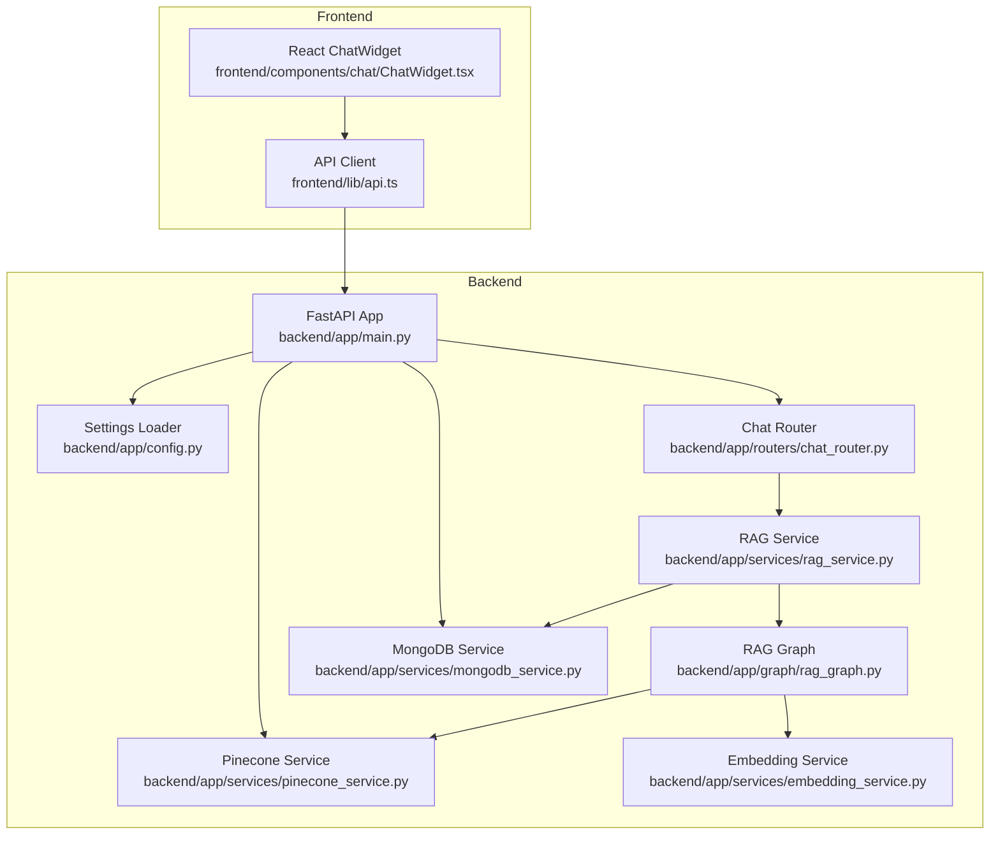

# Getting Started

<cite>
**Referenced Files in This Document**
- [backend/requirements.txt](file://backend/requirements.txt)
- [frontend/package.json](file://frontend/package.json)
- [backend/app/config.py](file://backend/app/config.py)
- [backend/app/main.py](file://backend/app/main.py)
- [backend/app/services/mongodb_service.py](file://backend/app/services/mongodb_service.py)
- [backend/app/services/pinecone_service.py](file://backend/app/services/pinecone_service.py)
- [backend/app/services/embedding_service.py](file://backend/app/services/embedding_service.py)
- [backend/app/services/rag_service.py](file://backend/app/services/rag_service.py)
- [backend/app/graph/rag_graph.py](file://backend/app/graph/rag_graph.py)
- [backend/app/routers/chat_router.py](file://backend/app/routers/chat_router.py)
- [frontend/lib/api.ts](file://frontend/lib/api.ts)
- [frontend/components/chat/ChatWidget.tsx](file://frontend/components/chat/ChatWidget.tsx)
- [frontend/README.md](file://frontend/README.md)
</cite>

## Table of Contents
1. [Introduction](#introduction)
2. [Prerequisites](#prerequisites)
3. [Installation](#installation)
4. [Initial Configuration](#initial-configuration)
5. [Local Development](#local-development)
6. [Verification](#verification)
7. [Architecture Overview](#architecture-overview)
8. [Troubleshooting](#troubleshooting)
9. [Conclusion](#conclusion)

## Introduction
This guide helps you install, configure, and run the Hitech RAG Chatbot locally. It covers backend and frontend setup, required accounts, environment variables, and first-time verification steps. The system integrates FastAPI, MongoDB, Pinecone, Google Gemini, and a React-based chat widget.

## Prerequisites
Before installing, ensure your environment meets the following requirements:
- Python 3.8 or newer for the backend
- Node.js 16 or newer for the frontend
- Accounts and keys for:
  - MongoDB Atlas (hosted database)
  - Pinecone (vector database)
  - Google Gemini (LLM provider)

These services are used by the backend services and configuration:
- MongoDB connection and collections are managed by the backend MongoDB service.
- Pinecone is used for vector storage and similarity search.
- Google Gemini is used for LLM inference in the RAG pipeline.

**Section sources**
- [backend/app/config.py:15-47](file://backend/app/config.py#L15-L47)
- [backend/app/services/mongodb_service.py:21-47](file://backend/app/services/mongodb_service.py#L21-L47)
- [backend/app/services/pinecone_service.py:27-55](file://backend/app/services/pinecone_service.py#L27-L55)
- [backend/app/graph/rag_graph.py:31-36](file://backend/app/graph/rag_graph.py#L31-L36)

## Installation
Follow these steps to install both backend and frontend applications.

### Backend (Python)
1. Navigate to the backend directory.
2. Install dependencies using pip:
   - Use the provided requirements file to install all packages.
3. Confirm installation by checking the installed packages in the requirements file.

Key backend dependencies include:
- FastAPI and uvicorn for the web server
- Motor and PyMongo for MongoDB
- Pinecone client for vector store
- LangChain and LangGraph for RAG orchestration
- FlagEmbedding and Torch for embeddings
- Google Generative AI libraries
- python-dotenv for environment variables

**Section sources**
- [backend/requirements.txt:1-48](file://backend/requirements.txt#L1-L48)

### Frontend (Node.js)
1. Navigate to the frontend directory.
2. Install dependencies using npm:
   - The frontend uses Next.js 16.2.4 and React 19.2.4.
3. Confirm installation by checking the package manifest.

**Section sources**
- [frontend/package.json:11-35](file://frontend/package.json#L11-L35)

## Initial Configuration
Set up environment variables for the backend. The backend loads settings from a .env file and exposes defaults in the configuration module.

### Environment Variables
Create a .env file in the backend root with the following keys:
- MONGODB_URI: MongoDB connection string
- PINECONE_API_KEY: Pinecone API key
- PINECONE_ENVIRONMENT: Pinecone environment (default provided)
- PINECONE_INDEX_NAME: Pinecone index name (default provided)
- PINECONE_DIMENSION: Vector dimension (default provided)
- GEMINI_API_KEY: Google Gemini API key
- GEMINI_MODEL: Model identifier (default provided)
- GEMINI_TEMPERATURE: Generation temperature (default provided)
- GEMINI_MAX_TOKENS: Maximum tokens (default provided)
- BACKEND_URL: Backend URL for CORS and health checks (default provided)
- CORS_ORIGINS: Allowed origins (default "*" for development)

Defaults and parsing behavior are defined in the configuration module.

**Section sources**
- [backend/app/config.py:7-64](file://backend/app/config.py#L7-L64)

### Frontend Environment
The frontend reads NEXT_PUBLIC_API_URL from environment variables to determine the backend base URL. Ensure this matches your backend host and port.

**Section sources**
- [frontend/lib/api.ts:4](file://frontend/lib/api.ts#L4)

## Local Development
Start the backend and frontend servers locally.

### Backend
- The FastAPI app defines a lifespan hook that connects to MongoDB, initializes Pinecone, and loads the embedding model on startup.
- Health endpoints expose service status for MongoDB and Pinecone.

Recommended startup command:
- Use uvicorn to run the FastAPI app with the ASGI entrypoint.

**Section sources**
- [backend/app/main.py:14-37](file://backend/app/main.py#L14-L37)
- [backend/app/main.py:74-83](file://backend/app/main.py#L74-L83)

### Frontend
- The frontend README describes running the development server with Next.js.
- Open http://localhost:3000 in your browser after starting the dev server.

**Section sources**
- [frontend/README.md:5-17](file://frontend/README.md#L5-L17)

## Verification
After starting both servers, verify the system works end-to-end.

### Backend Health
- Call the health endpoint to confirm MongoDB and Pinecone connections.
- Expect a JSON response indicating service statuses.

**Section sources**
- [backend/app/main.py:74-83](file://backend/app/main.py#L74-L83)

### Frontend Chat Widget
- Start the frontend dev server.
- Open the chat widget and submit a lead to create a session.
- Send a test message to trigger the RAG pipeline.
- Verify that the widget displays responses and stores conversation history.

**Section sources**
- [frontend/components/chat/ChatWidget.tsx:84-108](file://frontend/components/chat/ChatWidget.tsx#L84-L108)
- [frontend/components/chat/ChatWidget.tsx:110-142](file://frontend/components/chat/ChatWidget.tsx#L110-L142)
- [backend/app/routers/chat_router.py:12-56](file://backend/app/routers/chat_router.py#L12-L56)

## Architecture Overview
The system consists of a FastAPI backend and a React chat widget frontend. The backend orchestrates RAG using Pinecone and Google Gemini, while storing conversation data in MongoDB.

**Diagram sources**
- [backend/app/main.py:39-85](file://backend/app/main.py#L39-L85)
- [backend/app/config.py:7-64](file://backend/app/config.py#L7-L64)
- [backend/app/routers/chat_router.py:9-129](file://backend/app/routers/chat_router.py#L9-L129)
- [backend/app/services/rag_service.py:11-116](file://backend/app/services/rag_service.py#L11-L116)
- [backend/app/graph/rag_graph.py:26-264](file://backend/app/graph/rag_graph.py#L26-L264)
- [backend/app/services/pinecone_service.py:10-186](file://backend/app/services/pinecone_service.py#L10-L186)
- [backend/app/services/mongodb_service.py:13-202](file://backend/app/services/mongodb_service.py#L13-L202)
- [backend/app/services/embedding_service.py:10-158](file://backend/app/services/embedding_service.py#L10-L158)
- [frontend/lib/api.ts:1-93](file://frontend/lib/api.ts#L1-L93)
- [frontend/components/chat/ChatWidget.tsx:1-307](file://frontend/components/chat/ChatWidget.tsx#L1-L307)

## Troubleshooting
Common setup issues and resolutions:

- MongoDB connection fails
  - Verify MONGODB_URI is correct and accessible.
  - Ensure the database name matches the configured value.
  - Check network/firewall settings if connecting to a hosted instance.

- Pinecone initialization errors
  - Confirm PINECONE_API_KEY is set and valid.
  - Ensure PINECONE_INDEX_NAME exists or can be created.
  - Check environment and region settings.

- Google Gemini API errors
  - Verify GEMINI_API_KEY is set and has access to the selected model.
  - Confirm the model name is valid and supported.

- Frontend cannot reach backend
  - Set NEXT_PUBLIC_API_URL to the backend address.
  - Ensure CORS settings allow the frontend origin.

- Embedding model loading failures
  - Ensure FlagEmbedding and Torch are installed.
  - The embedding service runs on CPU for broader compatibility.

- Health check shows disconnected services
  - Confirm environment variables are loaded from .env.
  - Restart the backend after setting environment variables.

**Section sources**
- [backend/app/config.py:49-64](file://backend/app/config.py#L49-L64)
- [backend/app/main.py:18-36](file://backend/app/main.py#L18-L36)
- [backend/app/services/mongodb_service.py:21-28](file://backend/app/services/mongodb_service.py#L21-L28)
- [backend/app/services/pinecone_service.py:27-55](file://backend/app/services/pinecone_service.py#L27-L55)
- [backend/app/services/embedding_service.py:29-48](file://backend/app/services/embedding_service.py#L29-L48)
- [frontend/lib/api.ts:4](file://frontend/lib/api.ts#L4)

## Conclusion
You have installed the backend and frontend, configured environment variables, and verified the system end-to-end. For ongoing development, keep environment variables secure, monitor service health, and expand the knowledge base as needed.