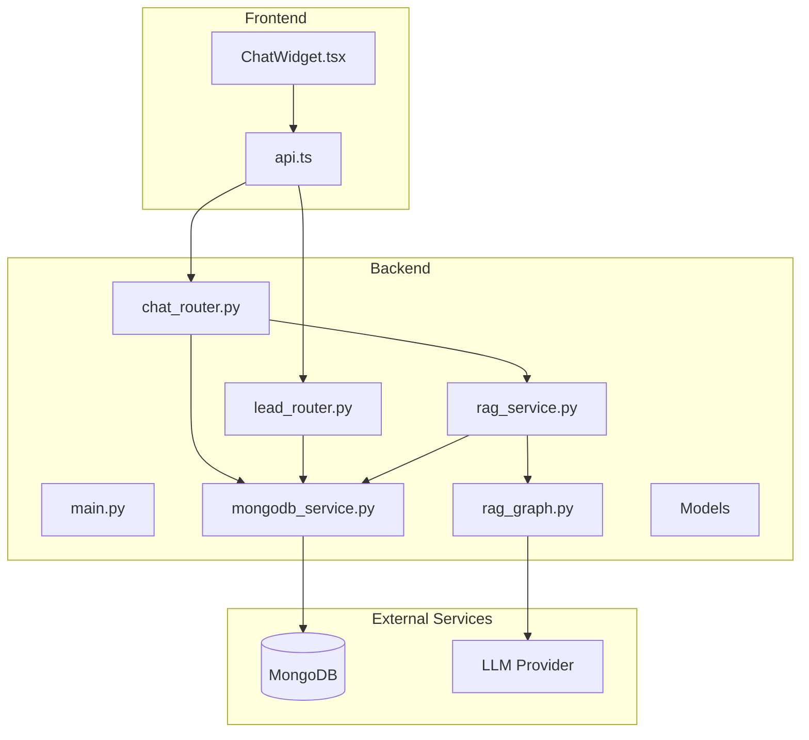
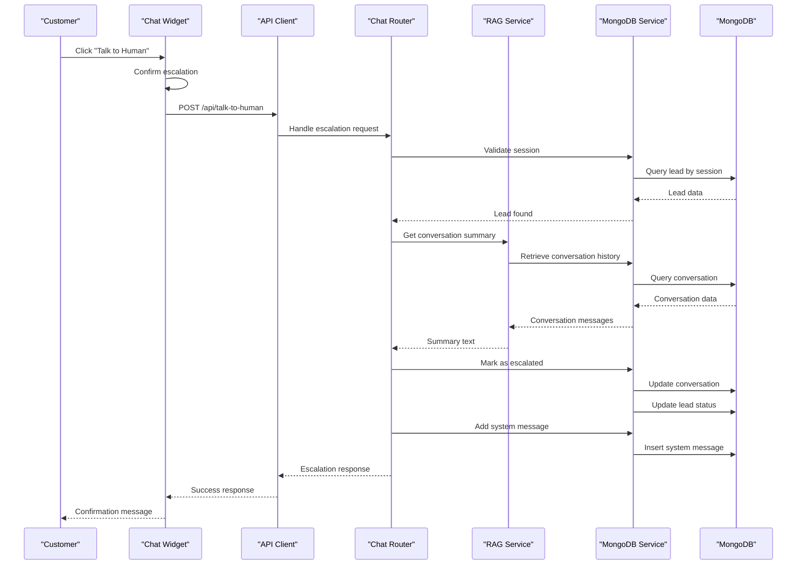
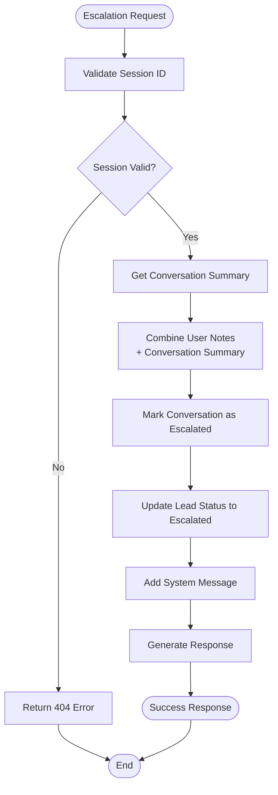
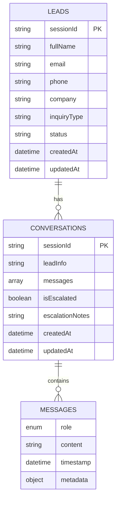
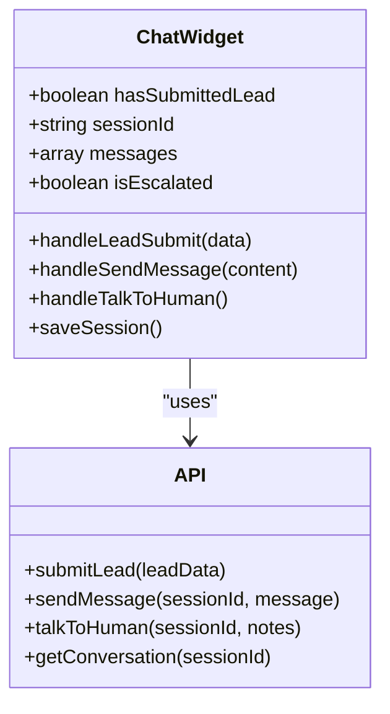
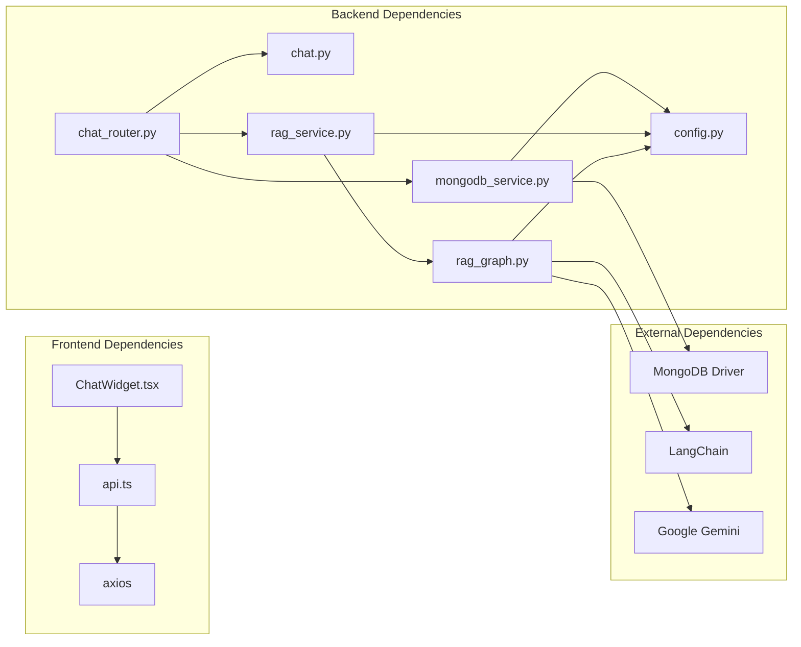
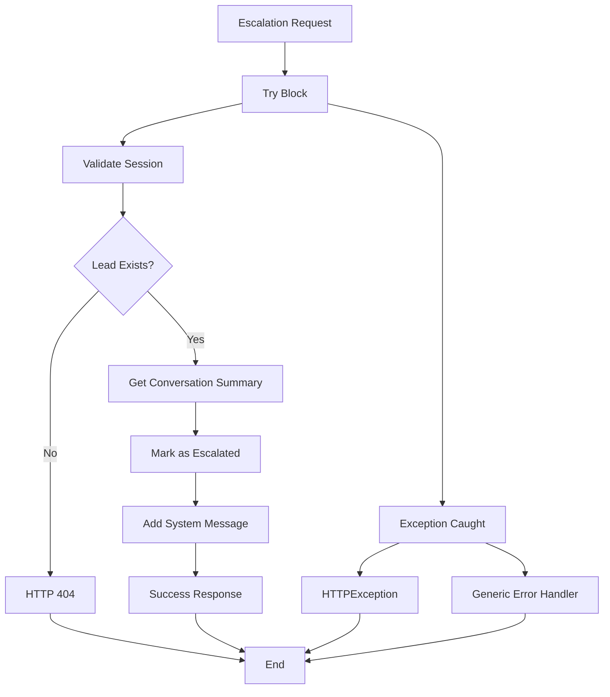

# Human Escalation System

<cite>
**Referenced Files in This Document**
- [main.py](file://backend/app/main.py)
- [chat_router.py](file://backend/app/routers/chat_router.py)
- [lead_router.py](file://backend/app/routers/lead_router.py)
- [chat.py](file://backend/app/models/chat.py)
- [conversation.py](file://backend/app/models/conversation.py)
- [lead.py](file://backend/app/models/lead.py)
- [mongodb_service.py](file://backend/app/services/mongodb_service.py)
- [rag_service.py](file://backend/app/services/rag_service.py)
- [rag_graph.py](file://backend/app/graph/rag_graph.py)
- [config.py](file://backend/app/config.py)
- [api.ts](file://frontend/lib/api.ts)
- [ChatWidget.tsx](file://frontend/components/chat/ChatWidget.tsx)
</cite>

## Table of Contents
1. [Introduction](#introduction)
2. [Project Structure](#project-structure)
3. [Core Components](#core-components)
4. [Architecture Overview](#architecture-overview)
5. [Detailed Component Analysis](#detailed-component-analysis)
6. [Dependency Analysis](#dependency-analysis)
7. [Performance Considerations](#performance-considerations)
8. [Troubleshooting Guide](#troubleshooting-guide)
9. [Conclusion](#conclusion)

## Introduction
This document provides comprehensive documentation for the human escalation system within the Hitech RAG chatbot platform. The escalation system enables customers to request human assistance when AI responses are insufficient, automating ticket creation, status tracking, and agent notification workflows. The system integrates seamlessly with MongoDB for persistent storage, maintains conversation context, and provides a robust UI trigger mechanism for initiating escalations.

## Project Structure
The escalation system spans both frontend and backend components with clear separation of concerns:

**Diagram sources**
- [main.py:1-90](file://backend/app/main.py#L1-L90)
- [chat_router.py:1-130](file://backend/app/routers/chat_router.py#L1-L130)
- [mongodb_service.py:1-202](file://backend/app/services/mongodb_service.py#L1-L202)

**Section sources**
- [main.py:1-90](file://backend/app/main.py#L1-L90)
- [chat_router.py:1-130](file://backend/app/routers/chat_router.py#L1-L130)
- [mongodb_service.py:1-202](file://backend/app/services/mongodb_service.py#L1-L202)

## Core Components
The escalation system comprises several interconnected components that work together to provide seamless human assistance:

### Backend Components
- **Chat Router**: Handles escalation requests and conversation state management
- **MongoDB Service**: Manages lead and conversation persistence with indexing support
- **RAG Service**: Provides conversation summarization for escalation notes
- **Configuration**: Centralized settings management for escalation thresholds and timeouts

### Frontend Components
- **Chat Widget**: Provides UI trigger for escalation with session management
- **API Client**: Manages communication with backend endpoints

**Section sources**
- [chat_router.py:58-118](file://backend/app/routers/chat_router.py#L58-L118)
- [mongodb_service.py:161-180](file://backend/app/services/mongodb_service.py#L161-L180)
- [rag_service.py:89-106](file://backend/app/services/rag_service.py#L89-L106)
- [ChatWidget.tsx:144-170](file://frontend/components/chat/ChatWidget.tsx#L144-L170)

## Architecture Overview
The escalation workflow follows a structured sequence from user initiation to agent notification:

**Diagram sources**
- [ChatWidget.tsx:144-170](file://frontend/components/chat/ChatWidget.tsx#L144-L170)
- [api.ts:74-80](file://frontend/lib/api.ts#L74-L80)
- [chat_router.py:58-118](file://backend/app/routers/chat_router.py#L58-L118)
- [rag_service.py:89-106](file://backend/app/services/rag_service.py#L89-L106)
- [mongodb_service.py:161-180](file://backend/app/services/mongodb_service.py#L161-L180)

## Detailed Component Analysis

### Escalation Request Processing
The escalation request processing involves multiple validation steps and state updates:

**Diagram sources**
- [chat_router.py:72-109](file://backend/app/routers/chat_router.py#L72-L109)
- [rag_service.py:89-106](file://backend/app/services/rag_service.py#L89-L106)
- [mongodb_service.py:161-180](file://backend/app/services/mongodb_service.py#L161-L180)

### Data Models and Storage Structure
The escalation system utilizes a structured approach to data persistence:

**Diagram sources**
- [lead.py:46-56](file://backend/app/models/lead.py#L46-L56)
- [conversation.py:34-42](file://backend/app/models/conversation.py#L34-L42)
- [mongodb_service.py:51-111](file://backend/app/services/mongodb_service.py#L51-L111)

### Frontend Implementation Details
The frontend escalation implementation provides a user-friendly interface with session management:

**Diagram sources**
- [ChatWidget.tsx:27-307](file://frontend/components/chat/ChatWidget.tsx#L27-L307)
- [api.ts:61-85](file://frontend/lib/api.ts#L61-L85)

**Section sources**
- [chat_router.py:58-118](file://backend/app/routers/chat_router.py#L58-L118)
- [mongodb_service.py:161-180](file://backend/app/services/mongodb_service.py#L161-L180)
- [ChatWidget.tsx:144-170](file://frontend/components/chat/ChatWidget.tsx#L144-L170)
- [api.ts:74-80](file://frontend/lib/api.ts#L74-L80)

## Dependency Analysis
The escalation system exhibits clean dependency management with clear separation of concerns:

**Diagram sources**
- [chat_router.py:1-10](file://backend/app/routers/chat_router.py#L1-L10)
- [rag_service.py:1-17](file://backend/app/services/rag_service.py#L1-L17)
- [rag_graph.py:1-13](file://backend/app/graph/rag_graph.py#L1-L13)

**Section sources**
- [chat_router.py:1-10](file://backend/app/routers/chat_router.py#L1-L10)
- [rag_service.py:1-17](file://backend/app/services/rag_service.py#L1-L17)
- [rag_graph.py:1-13](file://backend/app/graph/rag_graph.py#L1-L13)

## Performance Considerations
The escalation system incorporates several performance optimizations:

### Database Indexing Strategy
- **Leads Collection**: Unique session ID index, email index, phone index, creation timestamp index
- **Conversations Collection**: Session ID unique index, creation timestamp index, escalation status index

### Caching and Connection Management
- MongoDB connection pooling through Motor driver
- Settings caching using LRU cache decorator
- Singleton pattern for RAG pipeline to avoid repeated initialization

### Memory Management
- Conversation history limits controlled by configuration
- Message content truncation for summaries
- Session TTL enforcement (24 hours)

**Section sources**
- [mongodb_service.py:36-48](file://backend/app/services/mongodb_service.py#L36-L48)
- [config.py:37-39](file://backend/app/config.py#L37-L39)
- [rag_service.py:30-34](file://backend/app/services/rag_service.py#L30-L34)

## Troubleshooting Guide

### Common Escalation Issues
1. **Session Not Found**: Occurs when session ID is invalid or expired
2. **Database Connection Failures**: MongoDB connectivity issues during escalation
3. **RAG Processing Errors**: LLM provider unavailability affecting conversation summaries
4. **Frontend API Communication**: Network errors between UI and backend

### Error Handling Patterns
The system implements comprehensive error handling:

**Diagram sources**
- [chat_router.py:71-117](file://backend/app/routers/chat_router.py#L71-L117)

### Monitoring and Health Checks
The system provides built-in health monitoring:

- **Health Endpoint**: `/api/health` returns service status
- **MongoDB Connection Status**: Connection verification
- **Pinecone Vector Store Status**: Index availability check

**Section sources**
- [main.py:74-83](file://backend/app/main.py#L74-L83)
- [chat_router.py:49-55](file://backend/app/routers/chat_router.py#L49-L55)

## Conclusion
The human escalation system provides a robust framework for customer service automation within the Hitech RAG chatbot platform. The system successfully integrates frontend UI triggers with backend processing, ensuring reliable ticket generation, status tracking, and agent notification workflows. Key strengths include comprehensive error handling, efficient database design, and clear separation of concerns between frontend and backend components.

The implementation demonstrates best practices in modern web development with proper state management, responsive UI patterns, and scalable backend architecture. Future enhancements could include real-time agent notifications, escalation analytics dashboard, and automated timeout handling for improved customer experience.