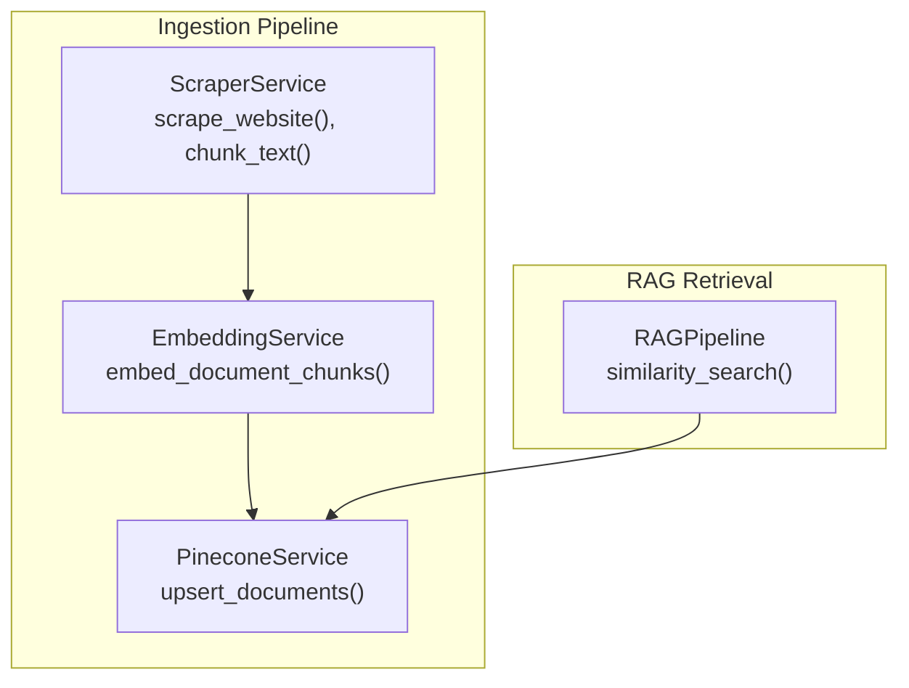
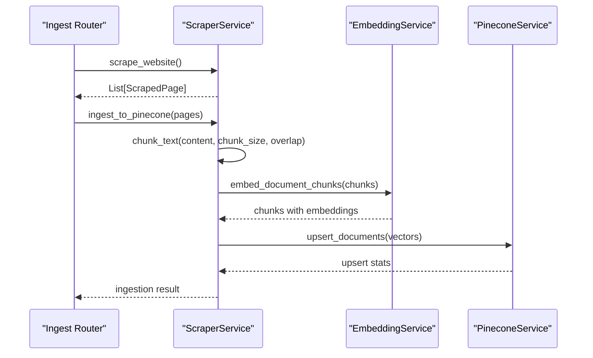
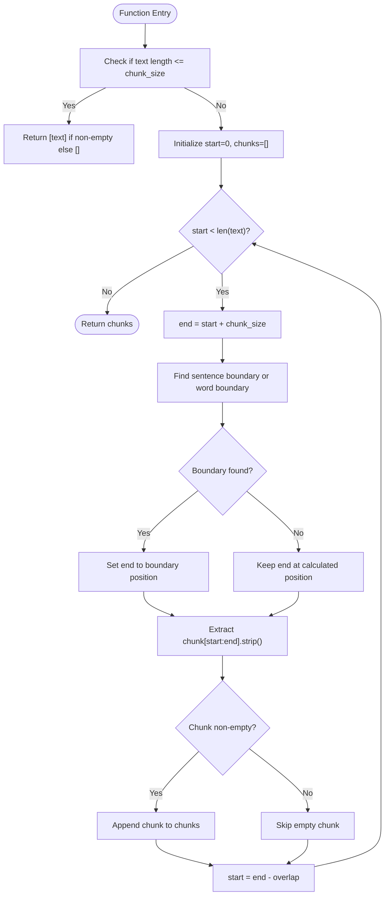
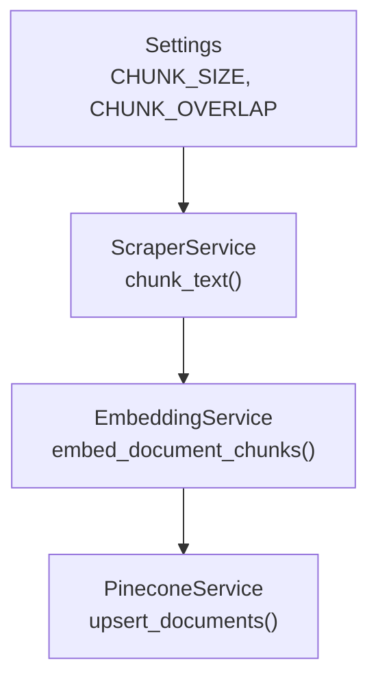

# Content Processing and Chunking

<cite>
**Referenced Files in This Document**
- [scraper_service.py](file://backend/app/services/scraper_service.py)
- [config.py](file://backend/app/config.py)
- [embedding_service.py](file://backend/app/services/embedding_service.py)
- [pinecone_service.py](file://backend/app/services/pinecone_service.py)
- [ingest_router.py](file://backend/app/routers/ingest_router.py)
- [rag_graph.py](file://backend/app/graph/rag_graph.py)
- [chat.py](file://backend/app/models/chat.py)
</cite>

## Table of Contents
1. [Introduction](#introduction)
2. [Project Structure](#project-structure)
3. [Core Components](#core-components)
4. [Architecture Overview](#architecture-overview)
5. [Detailed Component Analysis](#detailed-component-analysis)
6. [Dependency Analysis](#dependency-analysis)
7. [Performance Considerations](#performance-considerations)
8. [Troubleshooting Guide](#troubleshooting-guide)
9. [Conclusion](#conclusion)

## Introduction
This document explains the content processing and chunking system used by the RAG chatbot. It covers the text chunking algorithm with configurable chunk sizes and overlap parameters, sentence boundary detection, word boundary fallback, and content quality filtering. It also documents the chunk metadata structure, validation rules, minimum length requirements, and empty content handling. Finally, it provides examples of chunking configurations for different content types and use cases, along with performance considerations and the relationship between chunk size, semantic coherence, and retrieval accuracy.

## Project Structure
The chunking system is primarily implemented in the web scraping and ingestion pipeline. The key components are:
- Web scraping and content extraction
- Text chunking with sentence and word boundary awareness
- Content quality filtering and metadata enrichment
- Vector embedding generation and storage in Pinecone
- Retrieval pipeline using similarity search

**Diagram sources**
- [scraper_service.py:164-194](file://backend/app/services/scraper_service.py#L164-L194)
- [embedding_service.py:106-126](file://backend/app/services/embedding_service.py#L106-L126)
- [pinecone_service.py:62-106](file://backend/app/services/pinecone_service.py#L62-L106)
- [rag_graph.py:108-154](file://backend/app/graph/rag_graph.py#L108-L154)

**Section sources**
- [scraper_service.py:164-194](file://backend/app/services/scraper_service.py#L164-L194)
- [ingest_router.py:26-73](file://backend/app/routers/ingest_router.py#L26-L73)

## Core Components
- Text chunking with configurable chunk size and overlap
- Sentence boundary detection with word boundary fallback
- Content quality filtering and minimum length enforcement
- Chunk metadata structure including source URLs, titles, timestamps, and chunk indices
- Validation rules for empty content and minimum length thresholds
- Integration with embedding generation and vector storage

**Section sources**
- [scraper_service.py:164-194](file://backend/app/services/scraper_service.py#L164-L194)
- [scraper_service.py:250-306](file://backend/app/services/scraper_service.py#L250-L306)
- [config.py:34-35](file://backend/app/config.py#L34-L35)

## Architecture Overview
The ingestion pipeline transforms raw web content into vectorized chunks with metadata, enabling semantic search during retrieval. The chunking algorithm ensures semantic coherence while maintaining efficient retrieval.

**Diagram sources**
- [ingest_router.py:26-73](file://backend/app/routers/ingest_router.py#L26-L73)
- [scraper_service.py:195-248](file://backend/app/services/scraper_service.py#L195-L248)
- [scraper_service.py:250-306](file://backend/app/services/scraper_service.py#L250-L306)
- [embedding_service.py:106-126](file://backend/app/services/embedding_service.py#L106-L126)
- [pinecone_service.py:62-106](file://backend/app/services/pinecone_service.py#L62-L106)

## Detailed Component Analysis

### Text Chunking Algorithm
The chunking algorithm splits long text into overlapping segments while attempting to respect sentence boundaries and falling back to word boundaries when necessary. It enforces minimum length checks and strips whitespace from chunks.

Key behaviors:
- If the entire text fits within the chunk size, return the text as a single chunk or an empty list if it is empty.
- Iterate through the text with a sliding window defined by chunk size minus overlap.
- At each step, attempt to break at a sentence boundary (period followed by a space within the window).
- If no sentence boundary is found within a reasonable distance from the start of the window, fall back to a word boundary (last space within the window).
- Strip whitespace from each chunk and append non-empty chunks to the result.

**Diagram sources**
- [scraper_service.py:164-194](file://backend/app/services/scraper_service.py#L164-L194)

**Section sources**
- [scraper_service.py:164-194](file://backend/app/services/scraper_service.py#L164-L194)

### Sentence Boundary Detection and Word Boundary Fallback
The algorithm prioritizes sentence boundaries to preserve semantic units:
- Searches backward for a period followed by a space within the current window.
- If a sentence boundary is found beyond a midpoint threshold, it aligns the chunk end to that boundary.
- Otherwise, it falls back to the last space within the window to avoid splitting words.

This approach balances semantic coherence with practical chunking constraints.

**Section sources**
- [scraper_service.py:175-186](file://backend/app/services/scraper_service.py#L175-L186)

### Content Quality Filtering and Minimum Length Requirements
During ingestion, pages with insufficient content are skipped:
- Pages with empty content or content shorter than a minimum threshold are ignored.
- This prevents low-quality or empty chunks from entering the vector store.

Additionally, the embedding service filters out empty or whitespace-only texts before generating embeddings.

**Section sources**
- [scraper_service.py:267-268](file://backend/app/services/scraper_service.py#L267-L268)
- [embedding_service.py:90-96](file://backend/app/services/embedding_service.py#L90-L96)

### Chunk Metadata Structure
Each chunk is enriched with metadata for provenance and retrieval:
- Identifier: unique ID for the vector
- Content: the chunk text
- Source: originating URL
- Title: page title
- URL: page URL
- Timestamp: creation timestamp
- Chunk index: sequential index within the page

These fields are stored in the vector metadata and used during retrieval and response formatting.

**Section sources**
- [scraper_service.py:277-285](file://backend/app/services/scraper_service.py#L277-L285)
- [pinecone_service.py:85-92](file://backend/app/services/pinecone_service.py#L85-L92)

### Retrieval Accuracy and Semantic Coherence
The retrieval pipeline uses cosine similarity against embeddings to select relevant chunks:
- Similarity search retrieves top-k results filtered by a similarity threshold.
- The LLM generates responses using the selected context and conversation history.

The chunk size and overlap influence retrieval accuracy:
- Larger chunks improve semantic coherence but reduce granularity and increase embedding costs.
- Smaller chunks improve granularity and recall but risk losing context across boundaries.
- Overlap helps maintain continuity across chunk boundaries, reducing abrupt transitions.

**Section sources**
- [rag_graph.py:71-91](file://backend/app/graph/rag_graph.py#L71-L91)
- [rag_graph.py:108-108](file://backend/app/graph/rag_graph.py#L108-L108)
- [config.py:32-35](file://backend/app/config.py#L32-L35)

### Configuration Examples for Different Content Types
- Web pages: Default chunk size and overlap suitable for HTML content with natural paragraph breaks.
- Long-form articles: Increase chunk size moderately to preserve article-level semantics.
- Technical documentation: Adjust overlap slightly higher to capture cross-references spanning boundaries.
- API reference: Reduce chunk size for precise code examples and smaller semantic units.
- PDFs: Consider preprocessing to normalize text before chunking; adjust chunk size based on paragraph structure.

These examples illustrate how to tune chunk size and overlap for different content characteristics while balancing retrieval accuracy and performance.

**Section sources**
- [config.py:34-35](file://backend/app/config.py#L34-L35)

## Dependency Analysis
The ingestion pipeline depends on configuration settings for chunking parameters and integrates with embedding and vector storage services.

**Diagram sources**
- [config.py:34-35](file://backend/app/config.py#L34-L35)
- [scraper_service.py:164-194](file://backend/app/services/scraper_service.py#L164-L194)
- [scraper_service.py:270-274](file://backend/app/services/scraper_service.py#L270-L274)
- [embedding_service.py:106-126](file://backend/app/services/embedding_service.py#L106-L126)
- [pinecone_service.py:62-106](file://backend/app/services/pinecone_service.py#L62-L106)

**Section sources**
- [config.py:34-35](file://backend/app/config.py#L34-L35)
- [scraper_service.py:270-274](file://backend/app/services/scraper_service.py#L270-L274)

## Performance Considerations
- Memory optimization:
  - Process content in batches during embedding generation to limit memory usage.
  - Use streaming or chunked processing for very large documents.
  - Filter out empty or short chunks early to reduce downstream processing.
- Throughput:
  - Tune batch size for embedding generation to balance speed and resource usage.
  - Control upsert batch size for vector storage to manage network and latency.
- Latency:
  - Adjust chunk size and overlap to minimize unnecessary retrieval and generation overhead.
  - Preprocess content to remove noise and normalize structure before chunking.
- Cost:
  - Larger chunks increase embedding and storage costs; smaller chunks increase retrieval overhead.
  - Monitor vector store statistics to optimize index sizing and query parameters.

[No sources needed since this section provides general guidance]

## Troubleshooting Guide
Common issues and resolutions:
- Empty or minimal content:
  - Ensure pages meet the minimum length requirement before chunking.
  - Verify cleaning and extraction steps produce sufficient text.
- Poor retrieval accuracy:
  - Adjust chunk size and overlap to improve semantic coverage.
  - Review similarity threshold and top-k parameters.
- Memory errors during embedding:
  - Reduce batch size for embedding generation.
  - Pre-filter chunks to exclude duplicates and low-value content.
- Vector storage errors:
  - Confirm vector store initialization and credentials.
  - Validate metadata fields match index schema expectations.

**Section sources**
- [scraper_service.py:267-268](file://backend/app/services/scraper_service.py#L267-L268)
- [embedding_service.py:90-96](file://backend/app/services/embedding_service.py#L90-L96)
- [rag_graph.py:108-154](file://backend/app/graph/rag_graph.py#L108-L154)

## Conclusion
The content processing and chunking system provides a robust foundation for RAG-based retrieval. By combining sentence-aware chunking with configurable parameters, quality filtering, and structured metadata, it achieves a balance between semantic coherence and retrieval accuracy. Proper tuning of chunk size and overlap, along with careful validation and batching strategies, ensures scalable performance across diverse content types.