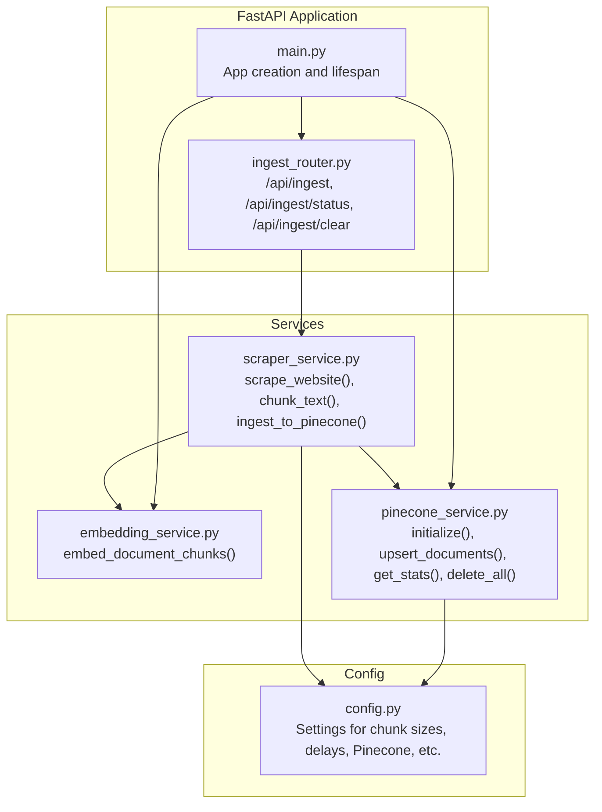
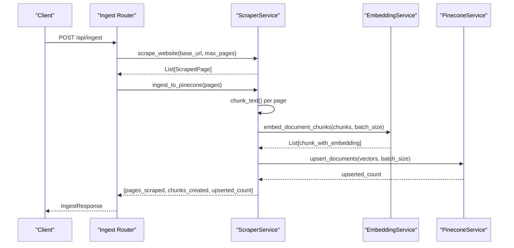
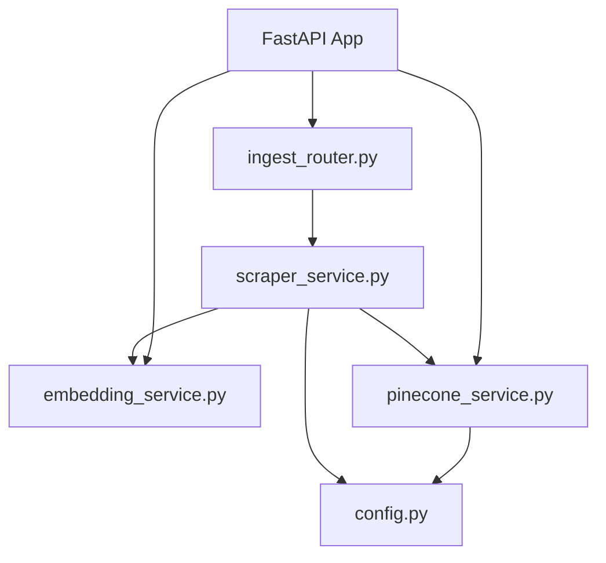

# Ingestion Pipeline

<cite>
**Referenced Files in This Document**
- [ingest_router.py](file://backend/app/routers/ingest_router.py)
- [scraper_service.py](file://backend/app/services/scraper_service.py)
- [embedding_service.py](file://backend/app/services/embedding_service.py)
- [pinecone_service.py](file://backend/app/services/pinecone_service.py)
- [config.py](file://backend/app/config.py)
- [main.py](file://backend/app/main.py)
- [rag_graph.py](file://backend/app/graph/rag_graph.py)
- [requirements.txt](file://backend/requirements.txt)
</cite>

## Table of Contents
1. [Introduction](#introduction)
2. [Project Structure](#project-structure)
3. [Core Components](#core-components)
4. [Architecture Overview](#architecture-overview)
5. [Detailed Component Analysis](#detailed-component-analysis)
6. [Dependency Analysis](#dependency-analysis)
7. [Performance Considerations](#performance-considerations)
8. [Troubleshooting Guide](#troubleshooting-guide)
9. [Conclusion](#conclusion)
10. [Appendices](#appendices)

## Introduction
This document explains the complete ingestion pipeline from web scraping to vector database insertion. It covers the end-to-end workflow from page scraping, content chunking, embedding generation, and vector upsert into Pinecone. It also documents the API endpoints for triggering ingestion, request parameters, response formats, integration with embedding services, and Pinecone vector database operations. Additionally, it addresses batch processing strategies, error handling, partial failure recovery, monitoring/logging, ingestion statistics tracking, performance metrics, capacity planning, content freshness policies, incremental updates, and maintenance procedures to keep the knowledge base current.

## Project Structure
The ingestion pipeline is implemented in the backend Python application using FastAPI. The key components are:
- Router for ingestion endpoints
- Scraper service for website crawling and content extraction
- Embedding service for generating dense vectors
- Pinecone service for vector upsert and retrieval
- Configuration settings for ingestion parameters and external integrations
- Application lifecycle initialization connecting services

**Diagram sources**
- [main.py:14-37](file://backend/app/main.py#L14-L37)
- [ingest_router.py:26-112](file://backend/app/routers/ingest_router.py#L26-L112)
- [scraper_service.py:195-307](file://backend/app/services/scraper_service.py#L195-L307)
- [embedding_service.py:106-126](file://backend/app/services/embedding_service.py#L106-L126)
- [pinecone_service.py:27-106](file://backend/app/services/pinecone_service.py#L27-L106)
- [config.py:7-64](file://backend/app/config.py#L7-L64)

**Section sources**
- [main.py:14-37](file://backend/app/main.py#L14-L37)
- [ingest_router.py:26-112](file://backend/app/routers/ingest_router.py#L26-L112)
- [scraper_service.py:195-307](file://backend/app/services/scraper_service.py#L195-L307)
- [embedding_service.py:106-126](file://backend/app/services/embedding_service.py#L106-L126)
- [pinecone_service.py:27-106](file://backend/app/services/pinecone_service.py#L27-L106)
- [config.py:7-64](file://backend/app/config.py#L7-L64)

## Core Components
- Ingestion Router: Exposes endpoints to trigger ingestion, check vector store stats, and clear the knowledge base.
- Scraper Service: Implements website crawling, content extraction, text cleaning, and chunking.
- Embedding Service: Provides BGE-M3 embeddings for queries and document chunks.
- Pinecone Service: Manages Pinecone index lifecycle, upserts vectors, similarity search, and statistics.
- Configuration: Centralized settings controlling chunk size, overlap, delays, and Pinecone dimensions.

Key responsibilities:
- Ingestion Router orchestrates scraping, embedding, and upsert operations.
- Scraper Service handles rate limiting, content filtering, and chunk boundaries.
- Embedding Service batches chunk embeddings for efficient processing.
- Pinecone Service manages index creation, batch upserts, and retrieval.

**Section sources**
- [ingest_router.py:26-112](file://backend/app/routers/ingest_router.py#L26-L112)
- [scraper_service.py:26-307](file://backend/app/services/scraper_service.py#L26-L307)
- [embedding_service.py:10-126](file://backend/app/services/embedding_service.py#L10-L126)
- [pinecone_service.py:10-106](file://backend/app/services/pinecone_service.py#L10-L106)
- [config.py:7-64](file://backend/app/config.py#L7-L64)

## Architecture Overview
The ingestion pipeline follows a synchronous orchestration pattern exposed via a FastAPI endpoint. The flow is:
1. Client calls the ingestion endpoint with a URL and optional max pages.
2. The router invokes the scraper service to crawl and extract content.
3. The scraper service chunks content and generates embeddings.
4. The embeddings are upserted into Pinecone.
5. The router returns ingestion statistics.

**Diagram sources**
- [ingest_router.py:26-74](file://backend/app/routers/ingest_router.py#L26-L74)
- [scraper_service.py:195-307](file://backend/app/services/scraper_service.py#L195-L307)
- [embedding_service.py:106-126](file://backend/app/services/embedding_service.py#L106-L126)
- [pinecone_service.py:62-106](file://backend/app/services/pinecone_service.py#L62-L106)

## Detailed Component Analysis

### Ingestion Router
- Endpoint: POST /api/ingest
  - Request body: IngestRequest with url (optional) and max_pages (optional, default 50).
  - Response: IngestResponse with status, message, pages_scraped, chunks_created.
- Endpoint: GET /api/ingest/status
  - Returns vector store statistics from Pinecone.
- Endpoint: DELETE /api/ingest/clear
  - Clears all vectors from the knowledge base.

Behavior:
- Synchronous ingestion by default; can be adapted to background tasks.
- On error, raises HTTPException with detailed message.
- Delegates to ScraperService for scraping and to PineconeService for upsert.

**Section sources**
- [ingest_router.py:12-24](file://backend/app/routers/ingest_router.py#L12-L24)
- [ingest_router.py:26-74](file://backend/app/routers/ingest_router.py#L26-L74)
- [ingest_router.py:76-92](file://backend/app/routers/ingest_router.py#L76-L92)
- [ingest_router.py:95-112](file://backend/app/routers/ingest_router.py#L95-L112)

### Scraper Service
Responsibilities:
- Validates URLs by scheme, domain, and common non-content patterns.
- Extracts title, main content, and links from HTML.
- Cleans text and splits into overlapping chunks.
- Generates embeddings for chunks and upserts to Pinecone.

Key methods:
- scrape_page(url): Fetches and parses a single page.
- scrape_website(base_url, max_pages, delay): BFS crawl with rate limiting.
- chunk_text(text, chunk_size, overlap): Overlapping chunking with sentence/word boundaries.
- ingest_to_pinecone(pages): Orchestrates chunking, embedding, and upsert.

Chunking strategy:
- Uses configurable chunk_size and overlap from settings.
- Attempts to split at sentence or word boundaries to preserve semantics.

Batching:
- Embedding batch size is configurable and passed to embedding service.
- Pinecone upsert uses a fixed batch size.

Error handling:
- Returns structured error responses when no content is found or scraping fails.

**Section sources**
- [scraper_service.py:37-69](file://backend/app/services/scraper_service.py#L37-L69)
- [scraper_service.py:136-163](file://backend/app/services/scraper_service.py#L136-L163)
- [scraper_service.py:164-194](file://backend/app/services/scraper_service.py#L164-L194)
- [scraper_service.py:195-248](file://backend/app/services/scraper_service.py#L195-L248)
- [scraper_service.py:250-307](file://backend/app/services/scraper_service.py#L250-L307)

### Embedding Service
- Singleton model loader using BGE-M3 (dimension 1024).
- Methods:
  - embed_query(text): Adds query instruction and encodes for retrieval.
  - embed_documents(texts, batch_size): Encodes multiple texts.
  - embed_document_chunks(chunks, batch_size): Adds embeddings to chunk metadata.

Batching:
- Batch size configurable; defaults used in ingestion pipeline.

Fallback:
- Raises runtime error if model fails to load to prevent silent failures.

**Section sources**
- [embedding_service.py:10-48](file://backend/app/services/embedding_service.py#L10-L48)
- [embedding_service.py:55-104](file://backend/app/services/embedding_service.py#L55-L104)
- [embedding_service.py:106-126](file://backend/app/services/embedding_service.py#L106-L126)

### Pinecone Service
- Singleton initialization ensures index exists and connects to it.
- Index creation uses serverless spec with AWS cloud and us-east-1 region.
- Upsert:
  - Converts chunk metadata to Pinecone vectors.
  - Batches upserts by a fixed batch size.
- Similarity search:
  - Generates query embedding via embedding service.
  - Filters results by similarity threshold configured in settings.
- Statistics:
  - Provides total vectors, dimension, and index fullness.

**Section sources**
- [pinecone_service.py:27-55](file://backend/app/services/pinecone_service.py#L27-L55)
- [pinecone_service.py:62-106](file://backend/app/services/pinecone_service.py#L62-L106)
- [pinecone_service.py:108-154](file://backend/app/services/pinecone_service.py#L108-L154)
- [pinecone_service.py:168-176](file://backend/app/services/pinecone_service.py#L168-L176)

### Configuration
Settings affecting ingestion:
- SCRAPE_BASE_URL, SCRAPE_MAX_PAGES, SCRAPE_DELAY
- CHUNK_SIZE, CHUNK_OVERLAP
- PINECONE_API_KEY, PINECONE_INDEX_NAME, PINECONE_DIMENSION
- RAG_TOP_K, RAG_SIMILARITY_THRESHOLD

These values are consumed by the scraper and Pinecone services to control behavior and dimensions.

**Section sources**
- [config.py:41-44](file://backend/app/config.py#L41-L44)
- [config.py:34-35](file://backend/app/config.py#L34-L35)
- [config.py:19-23](file://backend/app/config.py#L19-L23)
- [config.py:32-33](file://backend/app/config.py#L32-L33)

### Retrieval Integration
While ingestion builds the knowledge base, retrieval uses Pinecone similarity search. The RAG graph retrieves documents and filters by similarity threshold, then generates responses using the LLM.

**Section sources**
- [rag_graph.py:71-91](file://backend/app/graph/rag_graph.py#L71-L91)
- [rag_graph.py:80-84](file://backend/app/graph/rag_graph.py#L80-L84)
- [rag_graph.py:108-108](file://backend/app/graph/rag_graph.py#L108-L108)

## Dependency Analysis
External libraries and their roles:
- FastAPI and uvicorn for the API server
- requests and beautifulsoup4 for web scraping
- FlagEmbedding and torch for BGE-M3 embeddings
- pinecone-client for vector operations
- langchain and langgraph for RAG pipeline
- motor/pymongo for MongoDB persistence

**Diagram sources**
- [main.py:39-85](file://backend/app/main.py#L39-L85)
- [ingest_router.py:26-112](file://backend/app/routers/ingest_router.py#L26-L112)
- [scraper_service.py:26-307](file://backend/app/services/scraper_service.py#L26-L307)
- [embedding_service.py:10-126](file://backend/app/services/embedding_service.py#L10-L126)
- [pinecone_service.py:10-106](file://backend/app/services/pinecone_service.py#L10-L106)
- [config.py:7-64](file://backend/app/config.py#L7-L64)

**Section sources**
- [requirements.txt:1-48](file://backend/requirements.txt#L1-L48)
- [main.py:39-85](file://backend/app/main.py#L39-L85)

## Performance Considerations
- Chunking and overlap:
  - CHUNK_SIZE and CHUNK_OVERLAP are configurable to balance recall and storage costs.
- Embedding batching:
  - EmbeddingService supports configurable batch_size; larger batches improve throughput but increase memory usage.
- Pinecone upsert batching:
  - Fixed batch size in PineconeService; tune based on network and latency characteristics.
- Rate limiting:
  - SCRAPE_DELAY controls request pacing to avoid site throttling and respect robots.txt implicitly.
- Model initialization:
  - EmbeddingService is a singleton to avoid reloading the BGE-M3 model across requests.
- Index dimensionality:
  - PINECONE_DIMENSION matches BGE-M3 output (1024) to ensure compatibility.

[No sources needed since this section provides general guidance]

## Troubleshooting Guide
Common issues and remedies:
- No pages scraped:
  - Verify URL validity and domain constraints; check skip patterns and content type checks.
- No valid content to ingest:
  - Ensure pages contain sufficient text; content cleaning removes short or empty content.
- Embedding model load failure:
  - Confirm FlagEmbedding and torch availability; model loads on CPU for serverless compatibility.
- Pinecone connection/index issues:
  - Check API key and index name; service auto-creates index if missing.
- HTTP errors:
  - Ingestion router wraps exceptions and returns detailed messages; inspect logs for underlying causes.

Monitoring and logging:
- Print statements are used throughout the pipeline for progress and errors.
- Health endpoint indicates service connectivity for MongoDB and Pinecone.

Recovery strategies:
- Partial failures:
  - If embedding generation fails mid-batch, the pipeline returns an error; re-run ingestion after resolving the issue.
- Incremental updates:
  - Current implementation replaces content by clearing and re-ingesting; future enhancements could support delta updates.

**Section sources**
- [scraper_service.py:136-163](file://backend/app/services/scraper_service.py#L136-L163)
- [scraper_service.py:288-289](file://backend/app/services/scraper_service.py#L288-L289)
- [embedding_service.py:30-48](file://backend/app/services/embedding_service.py#L30-L48)
- [pinecone_service.py:32-55](file://backend/app/services/pinecone_service.py#L32-L55)
- [ingest_router.py:69-73](file://backend/app/routers/ingest_router.py#L69-L73)
- [main.py:74-83](file://backend/app/main.py#L74-L83)

## Conclusion
The ingestion pipeline provides a robust, configurable mechanism to build a knowledge base from web content. It balances content quality through careful extraction and chunking, efficient processing via batching, and reliable vector storage with Pinecone. While the current implementation is synchronous and clears/rebuilds the index, the modular design allows for future enhancements such as background tasks, incremental updates, and improved error recovery.

[No sources needed since this section summarizes without analyzing specific files]

## Appendices

### API Endpoints and Payloads
- POST /api/ingest
  - Request: IngestRequest
    - url: string (optional)
    - max_pages: integer (optional, default 50)
  - Response: IngestResponse
    - status: string
    - message: string
    - pages_scraped: integer (optional)
    - chunks_created: integer (optional)
- GET /api/ingest/status
  - Response: Vector store statistics including total_vectors, dimension, index_fullness
- DELETE /api/ingest/clear
  - Response: Success confirmation with deletion flag

**Section sources**
- [ingest_router.py:12-24](file://backend/app/routers/ingest_router.py#L12-L24)
- [ingest_router.py:26-74](file://backend/app/routers/ingest_router.py#L26-L74)
- [ingest_router.py:76-92](file://backend/app/routers/ingest_router.py#L76-L92)
- [ingest_router.py:95-112](file://backend/app/routers/ingest_router.py#L95-L112)

### Batch Processing Strategy
- Embedding batch size: Configurable in EmbeddingService and used by ScraperService during ingestion.
- Pinecone upsert batch size: Fixed in PineconeService; adjust based on latency and throughput.
- Scraping delay: Configurable to control request pacing.

**Section sources**
- [embedding_service.py:79-104](file://backend/app/services/embedding_service.py#L79-L104)
- [scraper_service.py:294-294](file://backend/app/services/scraper_service.py#L294-L294)
- [pinecone_service.py:65-101](file://backend/app/services/pinecone_service.py#L65-L101)
- [config.py:42-44](file://backend/app/config.py#L42-L44)

### Content Freshness and Maintenance
- Current behavior:
  - Clear and re-ingest to refresh content.
- Recommended practices:
  - Implement incremental updates by detecting changed URLs and updating only affected chunks.
  - Schedule periodic ingestion runs and monitor vector store growth.
  - Use metadata filters to target specific domains or content types for updates.

[No sources needed since this section provides general guidance]

### Capacity Planning Considerations
- Vector count and dimension:
  - Monitor total_vectors and dimension via /api/ingest/status.
- Storage sizing:
  - Estimate storage needs based on average chunk size, number of chunks, and metadata overhead.
- Throughput tuning:
  - Adjust chunk_size, overlap, embedding batch_size, and Pinecone upsert batch_size to meet latency targets.

**Section sources**
- [pinecone_service.py:168-176](file://backend/app/services/pinecone_service.py#L168-L176)