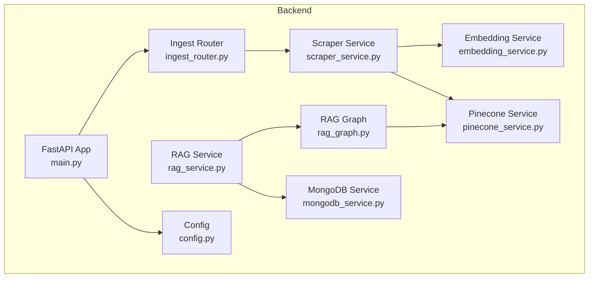
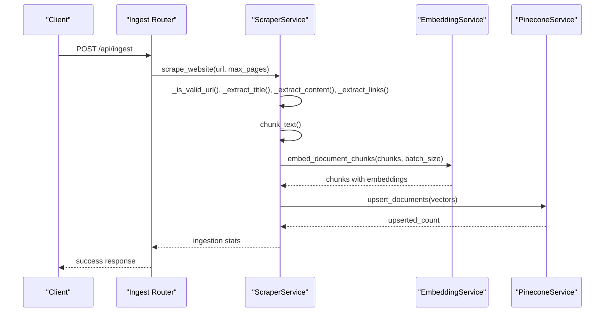
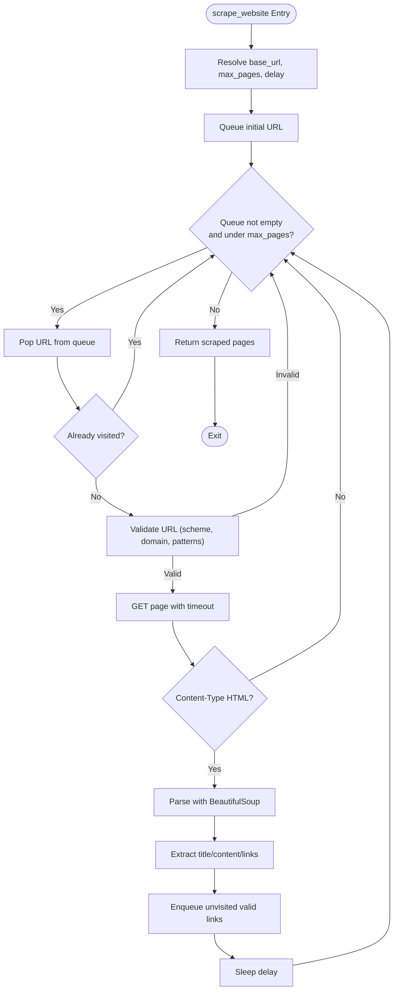
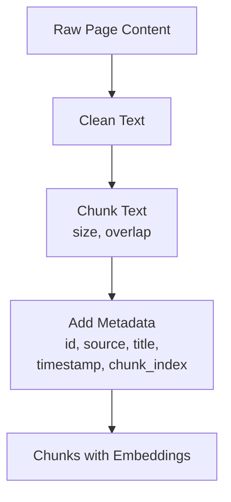
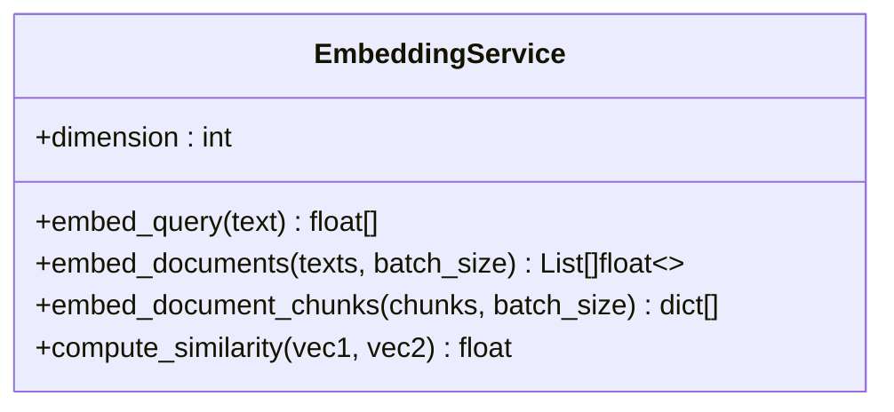
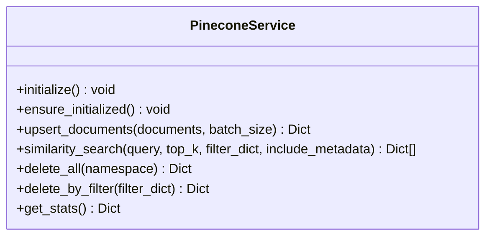
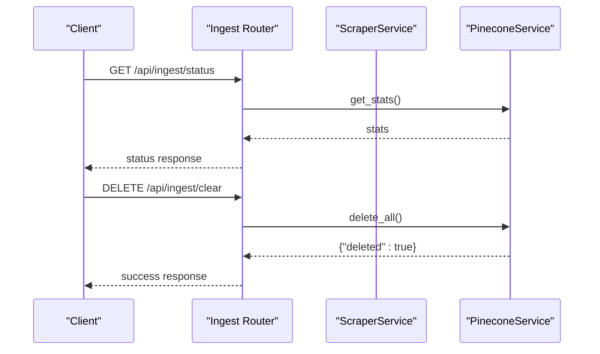
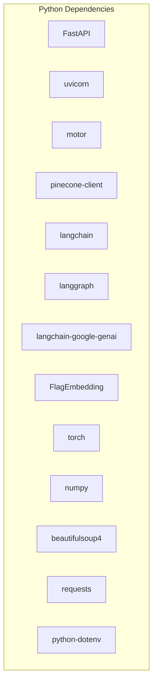

# Knowledgebase Management

<cite>
**Referenced Files in This Document**
- [scraper_service.py](file://backend/app/services/scraper_service.py)
- [embedding_service.py](file://backend/app/services/embedding_service.py)
- [pinecone_service.py](file://backend/app/services/pinecone_service.py)
- [ingest_router.py](file://backend/app/routers/ingest_router.py)
- [config.py](file://backend/app/config.py)
- [main.py](file://backend/app/main.py)
- [rag_graph.py](file://backend/app/graph/rag_graph.py)
- [rag_service.py](file://backend/app/services/rag_service.py)
- [mongodb_service.py](file://backend/app/services/mongodb_service.py)
- [requirements.txt](file://backend/requirements.txt)
</cite>

## Table of Contents
1. [Introduction](#introduction)
2. [Project Structure](#project-structure)
3. [Core Components](#core-components)
4. [Architecture Overview](#architecture-overview)
5. [Detailed Component Analysis](#detailed-component-analysis)
6. [Dependency Analysis](#dependency-analysis)
7. [Performance Considerations](#performance-considerations)
8. [Troubleshooting Guide](#troubleshooting-guide)
9. [Conclusion](#conclusion)
10. [Appendices](#appendices)

## Introduction
This document explains the knowledgebase management system that powers content discovery, extraction, processing, and vector indexing for a Retrieval-Augmented Generation (RAG) chatbot. It covers:
- Web scraping with BeautifulSoup, including URL filtering, content extraction, and pagination-like breadth-first traversal
- Content processing workflows, including cleaning, chunking, and metadata enrichment
- Ingestion pipeline from discovery to vector indexing with Pinecone
- Integration with the embedding service and vector database operations
- API endpoints for triggering ingestion, configuration parameters, and monitoring
- Strategies for content freshness, updates, and maintenance
- Relationships among content sources, processing pipelines, and vector store updates

## Project Structure
The knowledgebase management spans backend services, routers, configuration, and graph-based RAG orchestration:
- Services: scraper, embedding, pinecone, MongoDB
- Routers: ingestion API endpoints
- Graph: RAG pipeline orchestrating retrieval and generation
- Configuration: environment-driven settings for scraping, chunking, and vector dimensions
- Application lifecycle: startup initialization and health checks

**Diagram sources**
- [main.py:39-85](file://backend/app/main.py#L39-L85)
- [ingest_router.py:26-74](file://backend/app/routers/ingest_router.py#L26-L74)
- [scraper_service.py:26-329](file://backend/app/services/scraper_service.py#L26-L329)
- [embedding_service.py:10-158](file://backend/app/services/embedding_service.py#L10-L158)
- [pinecone_service.py:10-186](file://backend/app/services/pinecone_service.py#L10-L186)
- [rag_graph.py:26-264](file://backend/app/graph/rag_graph.py#L26-L264)
- [rag_service.py:11-116](file://backend/app/services/rag_service.py#L11-L116)
- [mongodb_service.py:13-202](file://backend/app/services/mongodb_service.py#L13-L202)
- [config.py:7-65](file://backend/app/config.py#L7-L65)

**Section sources**
- [main.py:14-37](file://backend/app/main.py#L14-L37)
- [config.py:7-65](file://backend/app/config.py#L7-L65)

## Core Components
- Scraper Service: Validates URLs, extracts titles and content, collects links, cleans text, chunks content, and ingests into Pinecone
- Embedding Service: Singleton BGE-M3 model for dense vector embeddings with batch support
- Pinecone Service: Index initialization, upsert, similarity search, deletion, and stats
- Ingest Router: Public API endpoints to trigger ingestion, check status, and clear the knowledgebase
- Configuration: Environment-driven settings for scraping, chunking, and vector dimensions
- RAG Graph: LangGraph pipeline retrieving relevant documents and generating contextual answers
- MongoDB Service: Conversation and lead persistence supporting RAG context and escalations

**Section sources**
- [scraper_service.py:26-329](file://backend/app/services/scraper_service.py#L26-L329)
- [embedding_service.py:10-158](file://backend/app/services/embedding_service.py#L10-L158)
- [pinecone_service.py:10-186](file://backend/app/services/pinecone_service.py#L10-L186)
- [ingest_router.py:26-112](file://backend/app/routers/ingest_router.py#L26-L112)
- [config.py:7-65](file://backend/app/config.py#L7-L65)
- [rag_graph.py:26-264](file://backend/app/graph/rag_graph.py#L26-L264)
- [mongodb_service.py:13-202](file://backend/app/services/mongodb_service.py#L13-L202)

## Architecture Overview
The ingestion pipeline integrates web scraping, content processing, embedding generation, and vector storage. The RAG pipeline retrieves relevant chunks and generates contextual responses.

**Diagram sources**
- [ingest_router.py:26-74](file://backend/app/routers/ingest_router.py#L26-L74)
- [scraper_service.py:195-320](file://backend/app/services/scraper_service.py#L195-L320)
- [embedding_service.py:106-126](file://backend/app/services/embedding_service.py#L106-L126)
- [pinecone_service.py:62-106](file://backend/app/services/pinecone_service.py#L62-L106)

## Detailed Component Analysis

### Web Scraping and Content Extraction
- URL validation: Ensures HTTP/HTTPS scheme, same-domain policy, and skips media, admin, and feed URLs
- Content extraction: Targets semantic main content areas, falls back to body after removing navigation/footer/aside
- Text cleaning: Normalizes whitespace and removes excessive special characters
- Link extraction: Resolves relative URLs and collects candidate links for breadth-first traversal
- Pagination handling: Implemented as breadth-first traversal with a queue and visited-set to avoid revisits and enforce max_pages
- Rate limiting: Configurable delay between requests

**Diagram sources**
- [scraper_service.py:195-248](file://backend/app/services/scraper_service.py#L195-L248)
- [scraper_service.py:37-69](file://backend/app/services/scraper_service.py#L37-L69)
- [scraper_service.py:136-163](file://backend/app/services/scraper_service.py#L136-L163)

**Section sources**
- [scraper_service.py:37-163](file://backend/app/services/scraper_service.py#L37-L163)
- [scraper_service.py:195-248](file://backend/app/services/scraper_service.py#L195-L248)

### Content Processing and Chunking
- Cleaning: Removes excessive whitespace and filters special characters while preserving punctuation
- Chunking: Splits text into overlapping segments, attempting sentence or word boundaries for coherence
- Metadata enrichment: Adds identifiers, source, title, timestamps, and chunk indices for traceability

**Diagram sources**
- [scraper_service.py:71-194](file://backend/app/services/scraper_service.py#L71-L194)

**Section sources**
- [scraper_service.py:71-194](file://backend/app/services/scraper_service.py#L71-L194)

### Embedding Service Integration
- Model: BGE-M3 loaded once as a singleton on CPU for serverless compatibility
- Query encoding: Prepends a query instruction for retrieval
- Document encoding: Batch processing with configurable batch size
- Similarity: Cosine similarity computation for evaluation

**Diagram sources**
- [embedding_service.py:10-158](file://backend/app/services/embedding_service.py#L10-L158)

**Section sources**
- [embedding_service.py:26-48](file://backend/app/services/embedding_service.py#L26-L48)
- [embedding_service.py:79-126](file://backend/app/services/embedding_service.py#L79-L126)

### Vector Database Operations (Pinecone)
- Initialization: Creates index if missing with cosine metric and configured dimension
- Upsert: Converts chunks to vectors with metadata and batches upserts
- Similarity search: Generates query embedding and retrieves top-k results with optional filters
- Maintenance: Clear all vectors and delete by filter; get stats for monitoring

**Diagram sources**
- [pinecone_service.py:10-186](file://backend/app/services/pinecone_service.py#L10-L186)

**Section sources**
- [pinecone_service.py:27-55](file://backend/app/services/pinecone_service.py#L27-L55)
- [pinecone_service.py:62-106](file://backend/app/services/pinecone_service.py#L62-L106)
- [pinecone_service.py:108-177](file://backend/app/services/pinecone_service.py#L108-L177)

### Ingestion Pipeline Orchestration
- Endpoint: POST /api/ingest triggers synchronous scraping and ingestion
- Status: GET /api/ingest/status returns vector store statistics
- Clear: DELETE /api/ingest/clear deletes all vectors
- Error handling: Raises HTTP exceptions with detailed messages

**Diagram sources**
- [ingest_router.py:76-112](file://backend/app/routers/ingest_router.py#L76-L112)
- [pinecone_service.py:156-166](file://backend/app/services/pinecone_service.py#L156-L166)

**Section sources**
- [ingest_router.py:26-74](file://backend/app/routers/ingest_router.py#L26-L74)
- [ingest_router.py:76-112](file://backend/app/routers/ingest_router.py#L76-L112)

### Configuration Parameters
Key settings controlling scraping, chunking, and vector dimensions:
- SCRAPE_BASE_URL, SCRAPE_MAX_PAGES, SCRAPE_DELAY
- CHUNK_SIZE, CHUNK_OVERLAP
- PINECONE_API_KEY, PINECONE_INDEX_NAME, PINECONE_DIMENSION
- RAG_TOP_K, RAG_SIMILARITY_THRESHOLD

**Section sources**
- [config.py:41-44](file://backend/app/config.py#L41-L44)
- [config.py:34-35](file://backend/app/config.py#L34-L35)
- [config.py:19-23](file://backend/app/config.py#L19-L23)
- [config.py:32-33](file://backend/app/config.py#L32-L33)

### Relationship Between Sources, Pipelines, and Vector Updates
- Content sources: Website URLs discovered via breadth-first traversal
- Processing pipelines: BeautifulSoup extraction → cleaning → chunking → embedding → upsert
- Vector updates: Each chunk becomes a vector with metadata; upserts preserve existing vectors and add new ones

**Diagram sources**
- [scraper_service.py:195-306](file://backend/app/services/scraper_service.py#L195-L306)
- [pinecone_service.py:62-106](file://backend/app/services/pinecone_service.py#L62-L106)

## Dependency Analysis
External libraries and their roles:
- FastAPI, uvicorn: Web framework and ASGI server
- motor, pymongo: Asynchronous MongoDB driver
- pinecone-client, pinecone-plugin-interface: Vector database client
- langchain, langgraph, langchain-google-genai: RAG orchestration and LLM integration
- FlagEmbedding, torch, numpy: Dense vector embeddings
- beautifulsoup4, requests: Web scraping
- python-dotenv: Environment variable loading

**Diagram sources**
- [requirements.txt:1-48](file://backend/requirements.txt#L1-L48)

**Section sources**
- [requirements.txt:1-48](file://backend/requirements.txt#L1-L48)

## Performance Considerations
- Embedding batch size: Tune batch_size in embedding service to balance throughput and memory
- Chunk size and overlap: Larger chunks reduce overhead but may decrease granularity; overlaps improve continuity
- Rate limiting: Adjust delay between requests to respect target site policies and avoid throttling
- Index dimension: Ensure embedding dimension matches Pinecone index dimension
- Vector upsert batching: Increase batch_size for upsert to reduce network overhead
- Model runtime: Running on CPU is compatible but slower; consider GPU if available

[No sources needed since this section provides general guidance]

## Troubleshooting Guide
Common issues and strategies:
- No pages scraped: Verify base URL, max_pages, and robots/exclusions; check URL validation patterns
- Empty content or short content: Review content selectors and cleaning rules; adjust thresholds
- Embedding errors: Confirm model load success and environment availability; ensure proper fallback handling
- Pinecone connectivity: Validate API key and index name; confirm index creation and dimension alignment
- Health checks: Use /api/health to verify MongoDB and Pinecone connections
- Monitoring: Use /api/ingest/status to inspect vector counts and index stats

**Section sources**
- [scraper_service.py:136-163](file://backend/app/services/scraper_service.py#L136-L163)
- [embedding_service.py:30-48](file://backend/app/services/embedding_service.py#L30-L48)
- [pinecone_service.py:27-55](file://backend/app/services/pinecone_service.py#L27-L55)
- [main.py:74-83](file://backend/app/main.py#L74-L83)
- [ingest_router.py:76-92](file://backend/app/routers/ingest_router.py#L76-L92)

## Conclusion
The knowledgebase management system provides a robust pipeline from content discovery to vector indexing and RAG retrieval. By combining BeautifulSoup-based extraction, BGE-M3 embeddings, and Pinecone vector storage, it supports scalable and maintainable knowledge ingestion. Configuration-driven parameters enable tuning for performance and accuracy, while API endpoints facilitate monitoring and maintenance.

[No sources needed since this section summarizes without analyzing specific files]

## Appendices

### API Endpoints Summary
- POST /api/ingest
  - Request: url (optional), max_pages (optional)
  - Response: status, message, pages_scraped, chunks_created
- GET /api/ingest/status
  - Response: status, vector_store, total_vectors, dimension, index_fullness
- DELETE /api/ingest/clear
  - Response: status, message, deleted

**Section sources**
- [ingest_router.py:26-112](file://backend/app/routers/ingest_router.py#L26-L112)

### RAG Retrieval and Generation
- Retrieval: Similarity search with top_k and similarity threshold
- Generation: Prompt assembly with conversation history, lead info, and retrieved context
- Escalation: Conversation escalation tracked in MongoDB

**Section sources**
- [rag_graph.py:71-220](file://backend/app/graph/rag_graph.py#L71-L220)
- [rag_service.py:19-87](file://backend/app/services/rag_service.py#L19-L87)
- [mongodb_service.py:161-180](file://backend/app/services/mongodb_service.py#L161-L180)