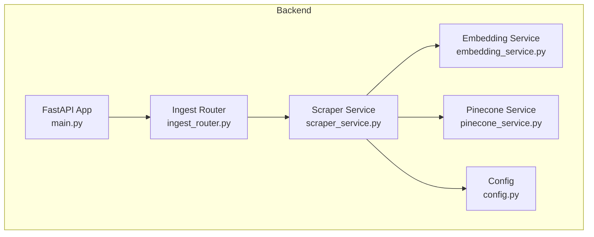
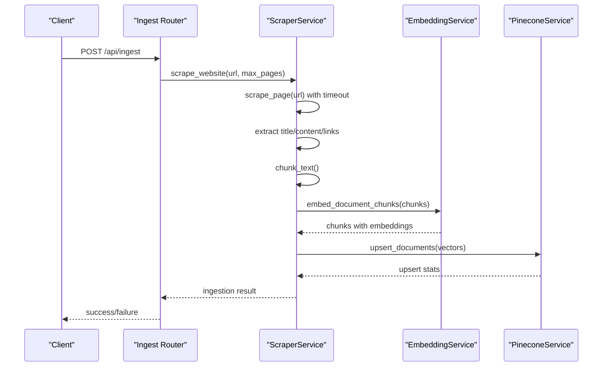
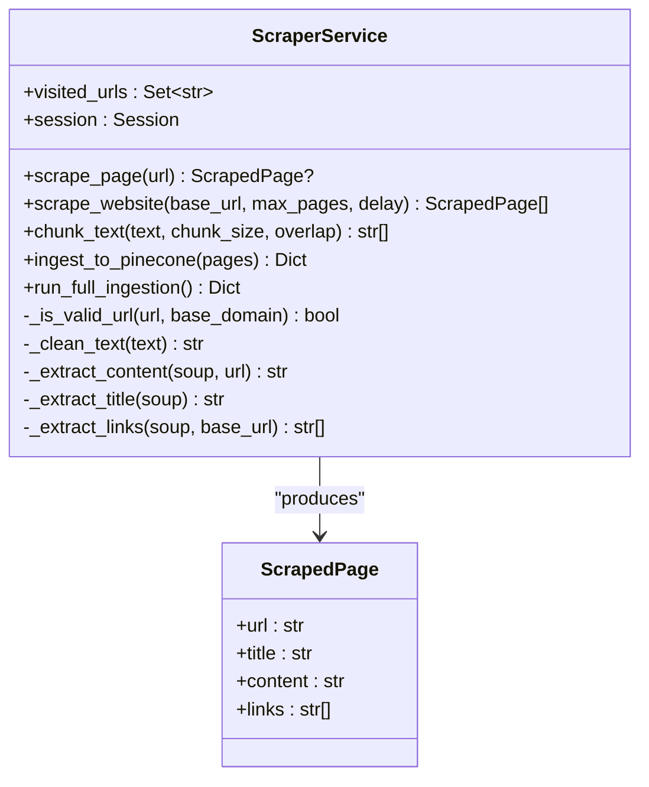
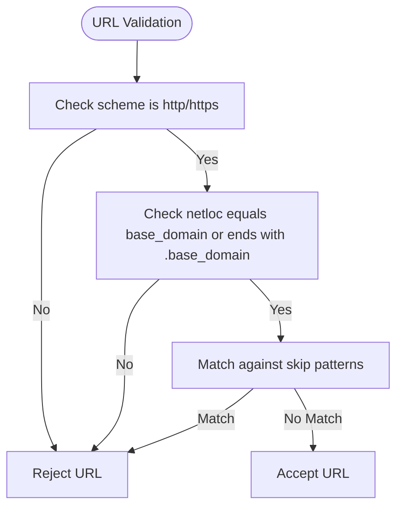
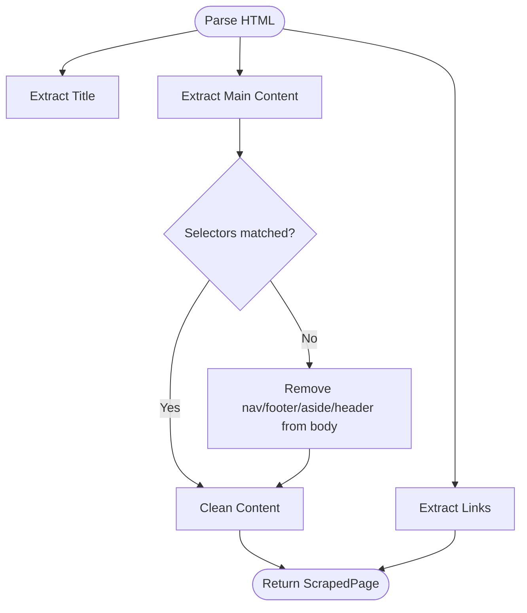
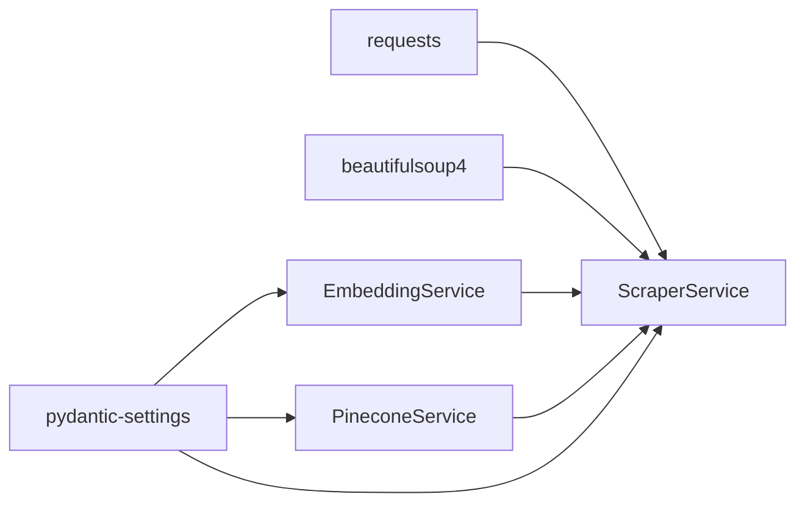
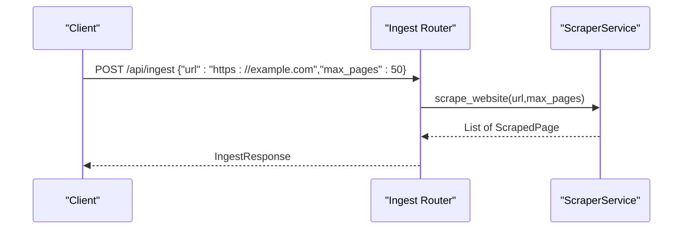

# Web Scraping Engine

<cite>
**Referenced Files in This Document**
- [scraper_service.py](file://backend/app/services/scraper_service.py)
- [config.py](file://backend/app/config.py)
- [ingest_router.py](file://backend/app/routers/ingest_router.py)
- [embedding_service.py](file://backend/app/services/embedding_service.py)
- [pinecone_service.py](file://backend/app/services/pinecone_service.py)
- [main.py](file://backend/app/main.py)
- [requirements.txt](file://backend/requirements.txt)
- [README.md](file://README.md)
</cite>

## Table of Contents
1. [Introduction](#introduction)
2. [Project Structure](#project-structure)
3. [Core Components](#core-components)
4. [Architecture Overview](#architecture-overview)
5. [Detailed Component Analysis](#detailed-component-analysis)
6. [Dependency Analysis](#dependency-analysis)
7. [Performance Considerations](#performance-considerations)
8. [Troubleshooting Guide](#troubleshooting-guide)
9. [Conclusion](#conclusion)
10. [Appendices](#appendices)

## Introduction
This document explains the web scraping engine used to build the knowledgebase for the RAG chatbot. It focuses on the ScraperService class architecture, URL validation logic, content extraction strategies, BeautifulSoup-based parsing, link extraction and filtering, text cleaning and sanitization, and integration with the embedding and vector store services. Practical configuration examples, timeouts, delays, and rate limiting are covered, along with guidance for handling dynamic content, anti-bot measures, and content quality assessment.

## Project Structure
The scraping pipeline is implemented in the backend under the services module and exposed via a FastAPI router. The ingestion flow connects scraping, chunking, embedding, and vector store upsert.

**Diagram sources**
- [main.py:39-85](file://backend/app/main.py#L39-L85)
- [ingest_router.py:26-73](file://backend/app/routers/ingest_router.py#L26-L73)
- [scraper_service.py:26-329](file://backend/app/services/scraper_service.py#L26-L329)
- [embedding_service.py:10-158](file://backend/app/services/embedding_service.py#L10-L158)
- [pinecone_service.py:10-186](file://backend/app/services/pinecone_service.py#L10-L186)
- [config.py:7-65](file://backend/app/config.py#L7-L65)

**Section sources**
- [main.py:39-85](file://backend/app/main.py#L39-L85)
- [ingest_router.py:26-73](file://backend/app/routers/ingest_router.py#L26-L73)
- [scraper_service.py:26-329](file://backend/app/services/scraper_service.py#L26-L329)
- [embedding_service.py:10-158](file://backend/app/services/embedding_service.py#L10-L158)
- [pinecone_service.py:10-186](file://backend/app/services/pinecone_service.py#L10-L186)
- [config.py:7-65](file://backend/app/config.py#L7-L65)

## Core Components
- ScraperService: Orchestrates scraping, content extraction, link discovery, text cleaning, chunking, and ingestion into Pinecone.
- Config: Provides defaults for scraping behavior (base URL, max pages, delay) and chunking parameters.
- EmbeddingService: Generates dense vector embeddings for text chunks using BGE-M3.
- PineconeService: Manages Pinecone index lifecycle and upsert operations.
- Ingest Router: Exposes endpoints to trigger ingestion and check vector store stats.

Key responsibilities:
- URL validation and domain restriction
- Content extraction via CSS selectors with fallbacks
- Text cleaning and chunking with overlap
- Rate limiting and delay between requests
- Vector store ingestion with embeddings

**Section sources**
- [scraper_service.py:26-329](file://backend/app/services/scraper_service.py#L26-L329)
- [config.py:41-44](file://backend/app/config.py#L41-L44)
- [embedding_service.py:10-158](file://backend/app/services/embedding_service.py#L10-L158)
- [pinecone_service.py:10-186](file://backend/app/services/pinecone_service.py#L10-L186)
- [ingest_router.py:26-73](file://backend/app/routers/ingest_router.py#L26-L73)

## Architecture Overview
The ingestion pipeline is a multi-stage process: scrape, clean, chunk, embed, and upsert.

**Diagram sources**
- [ingest_router.py:26-73](file://backend/app/routers/ingest_router.py#L26-L73)
- [scraper_service.py:136-329](file://backend/app/services/scraper_service.py#L136-L329)
- [embedding_service.py:106-126](file://backend/app/services/embedding_service.py#L106-L126)
- [pinecone_service.py:62-106](file://backend/app/services/pinecone_service.py#L62-L106)

## Detailed Component Analysis

### ScraperService Class
Responsibilities:
- Session management with a default User-Agent header
- URL validation with scheme, domain, and skip patterns
- HTML parsing with BeautifulSoup to extract title, main content, and links
- Text cleaning and chunking with configurable overlap
- Recursive site crawling with visited URL tracking and rate limiting
- Integration with embedding and vector store services

Key methods and behaviors:
- _is_valid_url: Enforces http/https, domain restrictions, and skips non-content URLs (media, feeds, admin).
- _extract_title: Prefers H1, falls back to title tag.
- _extract_content: Uses CSS selectors targeting main content areas; falls back to body text after removing navigation/footer/aside/header.
- _extract_links: Resolves relative links to absolute URLs.
- _clean_text: Normalizes whitespace and removes excessive special characters.
- scrape_page: Fetches page with timeout, validates content type, parses HTML, and returns a ScrapedPage.
- scrape_website: Breadth-first crawl with max pages, delay, and domain restriction.
- chunk_text: Overlapping chunking aligned to sentence or word boundaries.
- ingest_to_pinecone: Filters short content, chunks, embeds, and upserts to Pinecone.
- run_full_ingestion: Convenience method chaining scrape_website and ingest_to_pinecone.

**Diagram sources**
- [scraper_service.py:17-329](file://backend/app/services/scraper_service.py#L17-L329)

**Section sources**
- [scraper_service.py:26-329](file://backend/app/services/scraper_service.py#L26-L329)

### URL Validation Logic
Validation criteria:
- Scheme must be http or https
- Domain must match base domain or be a subdomain
- Skip patterns include common non-content resources and administrative paths

Patterns used:
- Media extensions (pdf, jpg, mp4, etc.)
- WordPress directories (uploads, includes, json)
- Feeds and RSS
- Query parameters commonly used for comments/admin/cart/checkout/my-account

**Diagram sources**
- [scraper_service.py:37-69](file://backend/app/services/scraper_service.py#L37-L69)

**Section sources**
- [scraper_service.py:37-69](file://backend/app/services/scraper_service.py#L37-L69)

### Content Extraction Strategies
Title extraction:
- Prefer H1 element
- Fallback to title tag

Main content extraction:
- Try multiple selectors targeting main content areas
- If none found, remove navigation, footer, aside, header from body, then extract text
- Clean text via whitespace normalization and selective character removal

Link extraction:
- Collect all anchors with href attributes
- Resolve relative URLs to absolute using base URL

**Diagram sources**
- [scraper_service.py:113-134](file://backend/app/services/scraper_service.py#L113-L134)
- [scraper_service.py:79-111](file://backend/app/services/scraper_service.py#L79-L111)

**Section sources**
- [scraper_service.py:79-134](file://backend/app/services/scraper_service.py#L79-L134)

### Link Extraction and Filtering
- Extract all anchor tags with href
- Convert to absolute URLs using base URL
- Filter by domain and validation rules before adding to the queue
- Avoid revisiting URLs already seen

**Section sources**
- [scraper_service.py:127-143](file://backend/app/services/scraper_service.py#L127-L143)
- [scraper_service.py:222-245](file://backend/app/services/scraper_service.py#L222-L245)

### Text Cleaning and Sanitization
- Normalize whitespace to single spaces
- Remove excessive special characters while preserving punctuation
- Strip leading/trailing whitespace

**Section sources**
- [scraper_service.py:71-77](file://backend/app/services/scraper_service.py#L71-L77)

### Character Encoding Handling
- The service relies on the requests library’s automatic decoding based on HTTP headers and charset detection
- BeautifulSoup parses using the default parser; ensure content-type is text/html to avoid binary content

**Section sources**
- [scraper_service.py:136-162](file://backend/app/services/scraper_service.py#L136-L162)

### Chunking and Overlap
- Split text into overlapping segments
- Prefer sentence boundaries; otherwise word boundaries
- Minimum length threshold before chunking

**Section sources**
- [scraper_service.py:164-193](file://backend/app/services/scraper_service.py#L164-L193)

### Integration with Embeddings and Vector Store
- Embeddings are generated using BGE-M3 via EmbeddingService
- PineconeService manages index creation and upsert batches
- Metadata stored includes source URL, title, timestamp, and chunk index

**Section sources**
- [scraper_service.py:250-306](file://backend/app/services/scraper_service.py#L250-L306)
- [embedding_service.py:106-126](file://backend/app/services/embedding_service.py#L106-L126)
- [pinecone_service.py:62-106](file://backend/app/services/pinecone_service.py#L62-L106)

## Dependency Analysis
External libraries and their roles:
- requests: HTTP client with session reuse and timeouts
- beautifulsoup4: HTML parsing and selector-based extraction
- pinecone-client: Vector store operations
- FlagEmbedding + torch + numpy: Dense vector embeddings
- pydantic-settings: Typed configuration from environment

**Diagram sources**
- [requirements.txt:28-31](file://backend/requirements.txt#L28-L31)
- [requirements.txt:23-26](file://backend/requirements.txt#L23-L26)
- [requirements.txt:12-14](file://backend/requirements.txt#L12-L14)
- [requirements.txt:5-6](file://backend/requirements.txt#L5-L6)
- [scraper_service.py:9-14](file://backend/app/services/scraper_service.py#L9-L14)
- [embedding_service.py:2-7](file://backend/app/services/embedding_service.py#L2-L7)
- [pinecone_service.py:4-7](file://backend/app/services/pinecone_service.py#L4-L7)
- [config.py:2-4](file://backend/app/config.py#L2-L4)

**Section sources**
- [requirements.txt:1-48](file://backend/requirements.txt#L1-L48)
- [scraper_service.py:9-14](file://backend/app/services/scraper_service.py#L9-L14)
- [embedding_service.py:2-7](file://backend/app/services/embedding_service.py#L2-L7)
- [pinecone_service.py:4-7](file://backend/app/services/pinecone_service.py#L4-L7)
- [config.py:2-4](file://backend/app/config.py#L2-L4)

## Performance Considerations
- Timeout: Default 30 seconds per request; adjust based on target site responsiveness.
- Rate limiting: Configurable delay between requests to respect robots and reduce load.
- Max pages: Limit breadth-first traversal to control resource usage.
- Chunk size and overlap: Tune for retrieval quality vs. embedding cost.
- Batch size for embeddings: Controlled by EmbeddingService; adjust based on GPU/CPU capacity.
- Index upsert batching: PineconeService batches upserts to optimize throughput.

[No sources needed since this section provides general guidance]

## Troubleshooting Guide
Common issues and resolutions:
- No pages scraped:
  - Verify base URL and network connectivity
  - Check domain restrictions and skip patterns
  - Confirm content-type is text/html
- Empty or low-quality content:
  - Review content selectors and fallback logic
  - Increase chunk size or adjust overlap
- Rate limiting or blocking:
  - Increase delay between requests
  - Rotate User-Agent headers (current implementation sets a fixed header)
- Dynamic content:
  - Current implementation uses static HTML; consider headless browser solutions for SPA-heavy sites
- Embedding model errors:
  - Ensure BGE-M3 model loads successfully on CPU
  - Verify environment variables for API keys and dimensions
- Vector store errors:
  - Confirm Pinecone API key and index name
  - Check index dimension matches embedding dimension

**Section sources**
- [scraper_service.py:136-162](file://backend/app/services/scraper_service.py#L136-L162)
- [scraper_service.py:222-245](file://backend/app/services/scraper_service.py#L222-L245)
- [embedding_service.py:29-48](file://backend/app/services/embedding_service.py#L29-L48)
- [pinecone_service.py:27-55](file://backend/app/services/pinecone_service.py#L27-L55)

## Conclusion
The web scraping engine provides a robust foundation for knowledgebase ingestion, combining URL validation, resilient content extraction, text cleaning, chunking, and vector store integration. While the current implementation targets static HTML, it can be extended to handle dynamic content and anti-bot measures with minimal architectural changes.

[No sources needed since this section summarizes without analyzing specific files]

## Appendices

### Practical Configuration Examples
- Base URL: Configure via settings for the starting point of crawling.
- Max pages: Limit the breadth-first traversal to manage runtime and resources.
- Delay: Introduce per-request sleep to avoid rate limiting and respect servers.
- Chunk size and overlap: Adjust for retrieval quality and embedding cost trade-offs.

Environment variables and defaults:
- SCRAPE_BASE_URL, SCRAPE_MAX_PAGES, SCRAPE_DELAY
- CHUNK_SIZE, CHUNK_OVERLAP

**Section sources**
- [config.py:41-44](file://backend/app/config.py#L41-L44)
- [config.py:34-35](file://backend/app/config.py#L34-L35)
- [scraper_service.py:195-214](file://backend/app/services/scraper_service.py#L195-L214)

### API Usage Example
Trigger ingestion via the ingest endpoint with optional URL and max pages parameters.

**Diagram sources**
- [ingest_router.py:26-73](file://backend/app/routers/ingest_router.py#L26-L73)
- [scraper_service.py:195-248](file://backend/app/services/scraper_service.py#L195-L248)

### Anti-Bot Measures and Dynamic Content
- Current implementation uses static HTML parsing and a fixed User-Agent.
- Recommended enhancements:
  - Add randomized User-Agent rotation
  - Implement retries with exponential backoff
  - Use a headless browser (e.g., Playwright/Selenium) for JavaScript-heavy sites
  - Respect robots.txt and implement a sitemap-based crawl strategy

[No sources needed since this section provides general guidance]