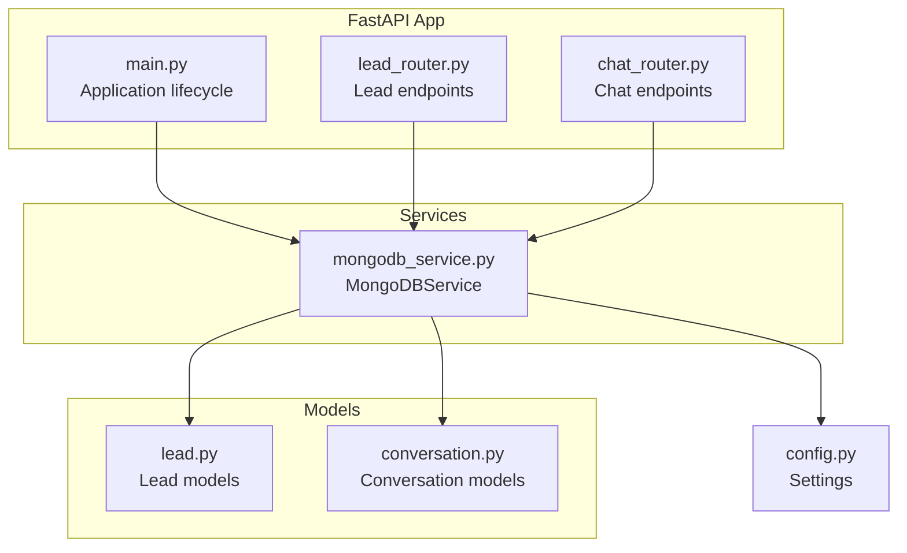
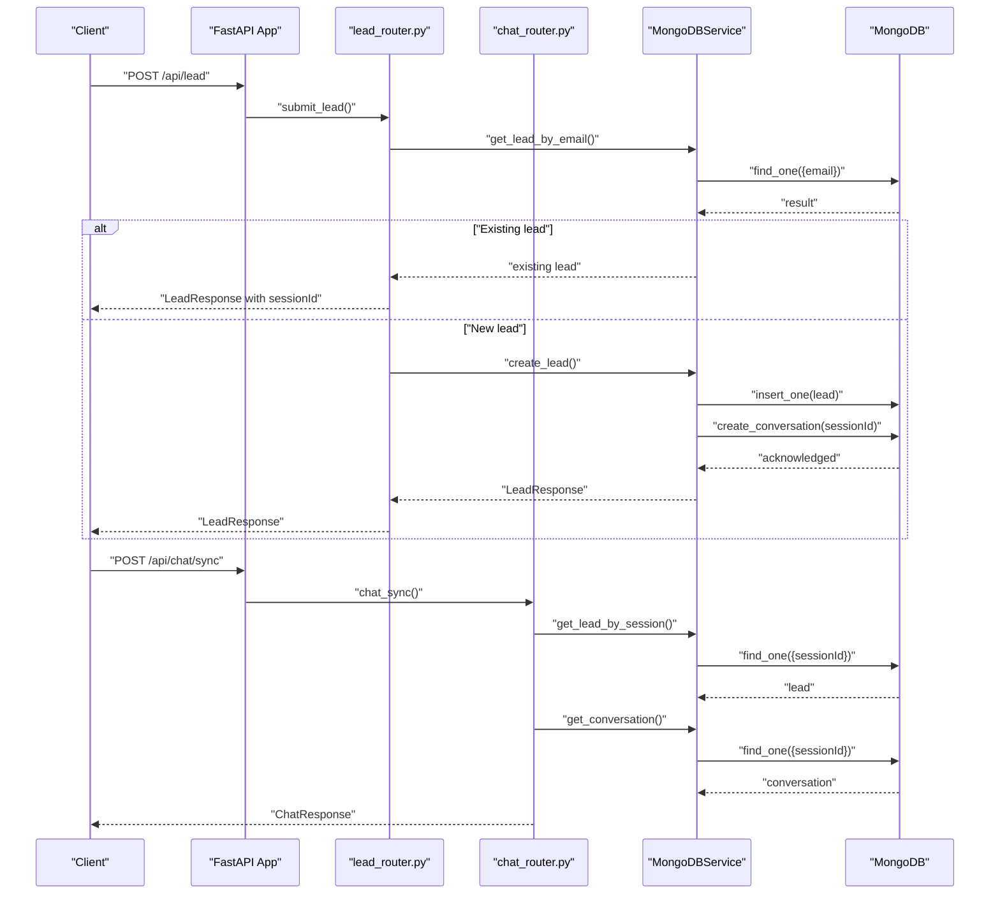
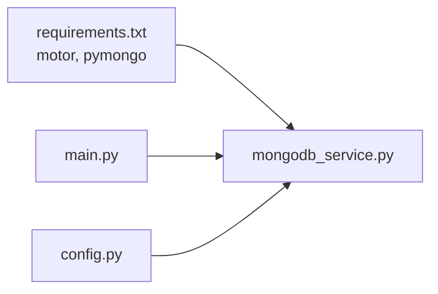

# Data Storage Integration

<cite>
**Referenced Files in This Document**
- [lead.py](file://backend/app/models/lead.py)
- [conversation.py](file://backend/app/models/conversation.py)
- [mongodb_service.py](file://backend/app/services/mongodb_service.py)
- [lead_router.py](file://backend/app/routers/lead_router.py)
- [chat_router.py](file://backend/app/routers/chat_router.py)
- [config.py](file://backend/app/config.py)
- [main.py](file://backend/app/main.py)
- [requirements.txt](file://backend/requirements.txt)
</cite>

## Table of Contents
1. [Introduction](#introduction)
2. [Project Structure](#project-structure)
3. [Core Components](#core-components)
4. [Architecture Overview](#architecture-overview)
5. [Detailed Component Analysis](#detailed-component-analysis)
6. [Dependency Analysis](#dependency-analysis)
7. [Performance Considerations](#performance-considerations)
8. [Troubleshooting Guide](#troubleshooting-guide)
9. [Conclusion](#conclusion)
10. [Appendices](#appendices)

## Introduction
This document explains the data storage integration for the lead capture system, focusing on MongoDB schema design, connection management, CRUD operations, indexing, and query optimization. It also covers the lead data model, integration with the conversation system, validation and transformation rules, error handling, and operational considerations such as security, backups, and migrations.

## Project Structure
The backend integrates MongoDB through a dedicated service layer and exposes endpoints for lead creation and chat interactions. The application lifecycle manages the MongoDB connection during startup and shutdown.

**Diagram sources**
- [main.py:14-37](file://backend/app/main.py#L14-L37)
- [lead_router.py:11-56](file://backend/app/routers/lead_router.py#L11-L56)
- [chat_router.py:12-129](file://backend/app/routers/chat_router.py#L12-L129)
- [mongodb_service.py:13-48](file://backend/app/services/mongodb_service.py#L13-L48)
- [config.py:7-58](file://backend/app/config.py#L7-L58)

**Section sources**
- [main.py:14-37](file://backend/app/main.py#L14-L37)
- [config.py:7-58](file://backend/app/config.py#L7-L58)

## Core Components
- MongoDBService: Asynchronous service managing connections, indexes, lead and conversation CRUD, and maintenance tasks.
- Lead models: Pydantic models defining validation, transformation, and serialization for lead data.
- Conversation models: Pydantic models for message and conversation structures.
- Routers: FastAPI endpoints for lead submission and chat operations that depend on MongoDBService.

Key responsibilities:
- Connection lifecycle: connect/disconnect managed by application lifespan.
- Indexes: unique and compound indexes for session, email, phone, createdAt, and escalation flags.
- CRUD: create lead and conversation, fetch by session/email, update lead, add messages, escalate to human, cleanup expired sessions.
- Validation: phone number validator for Saudi numbers; email and length validations via Pydantic fields.

**Section sources**
- [mongodb_service.py:13-48](file://backend/app/services/mongodb_service.py#L13-L48)
- [lead.py:18-64](file://backend/app/models/lead.py#L18-L64)
- [conversation.py:15-53](file://backend/app/models/conversation.py#L15-L53)
- [lead_router.py:11-56](file://backend/app/routers/lead_router.py#L11-L56)
- [chat_router.py:12-129](file://backend/app/routers/chat_router.py#L12-L129)

## Architecture Overview
The system connects to MongoDB at startup, creates indexes, and exposes endpoints that rely on the MongoDBService. Lead submissions initialize a session and an empty conversation. Chat endpoints leverage session IDs to retrieve leads and conversations, integrate with RAG, and optionally escalate to human agents.

**Diagram sources**
- [lead_router.py:11-56](file://backend/app/routers/lead_router.py#L11-L56)
- [chat_router.py:12-47](file://backend/app/routers/chat_router.py#L12-L47)
- [mongodb_service.py:51-111](file://backend/app/services/mongodb_service.py#L51-L111)

## Detailed Component Analysis

### MongoDB Schema Design and Indexing
Collections and fields:
- leads
  - sessionId: string, unique
  - fullName: string
  - email: string
  - phone: string
  - company: string (optional)
  - inquiryType: string enum value (optional)
  - source: string (default "chat_widget")
  - status: string (default "new")
  - createdAt: datetime
  - updatedAt: datetime (optional)
- conversations
  - sessionId: string, unique
  - leadInfo: embedded document snapshot of lead
  - messages: array of message documents
  - isEscalated: boolean
  - escalationNotes: string (optional)
  - createdAt: datetime
  - updatedAt: datetime

Indexes:
- leads: sessionId (unique), email, phone, createdAt
- conversations: sessionId (unique), createdAt, isEscalated

These indexes support:
- Fast lookup by session and email
- Efficient pagination and filtering by creation time
- Quick escalation flag checks

**Section sources**
- [mongodb_service.py:36-48](file://backend/app/services/mongodb_service.py#L36-L48)
- [lead.py:46-56](file://backend/app/models/lead.py#L46-L56)
- [conversation.py:34-42](file://backend/app/models/conversation.py#L34-L42)

### Data Model Definitions and Validation
Lead models:
- LeadBase: shared fields with Pydantic constraints and a validator for Saudi phone numbers.
- LeadCreate: extends base for creation.
- LeadInDB: adds session, timestamps, source, and status.
- LeadResponse: standardized response envelope.

Conversation models:
- Message: role, content, timestamp, optional metadata.
- Conversation: includes identifiers, arrays/messages, timestamps, escalation flags.

Validation rules:
- Phone number validator enforces Saudi formats (+9665, 9665, 05) with strict lengths.
- Email validated via EmailStr.
- Length constraints on names, company, and phone.
- Inquiry type constrained to predefined enum values.

Transformation:
- Enum values serialized as strings.
- Timestamps set automatically on create/update.
- Session IDs generated as UUIDs.

**Section sources**
- [lead.py:18-64](file://backend/app/models/lead.py#L18-L64)
- [conversation.py:15-53](file://backend/app/models/conversation.py#L15-L53)

### Database Connection Management
Connection lifecycle:
- Startup: MongoDBService.connect() called during app lifespan startup.
- Shutdown: MongoDBService.disconnect() closes client.
- Settings: MONGODB_URI and MONGODB_DB_NAME configured via environment variables.

Connection pooling:
- Motor’s AsyncIOMotorClient manages internal connection pooling and concurrency.
- Single global service instance reused across requests.

Operational notes:
- Indexes created on connect to optimize queries.
- Health endpoint reports MongoDB connectivity.

**Section sources**
- [main.py:14-37](file://backend/app/main.py#L14-L37)
- [mongodb_service.py:21-34](file://backend/app/services/mongodb_service.py#L21-L34)
- [config.py:15-17](file://backend/app/config.py#L15-L17)

### CRUD Operations and Query Patterns
Lead operations:
- Create: generate sessionId, assemble lead document, insert into leads, create empty conversation.
- Retrieve by session: find_one by sessionId.
- Retrieve by email: find_one by email.
- Update: update_one with $set, including updatedAt.

Conversation operations:
- Create: insert conversation with leadInfo snapshot.
- Retrieve: find_one by sessionId.
- Add message: push to messages array, update timestamps.
- Get recent history: return last N messages.
- Escalation: mark isEscalated, add system message, update lead status.
- Cleanup: delete old non-escalated conversations.

Query optimization:
- Unique indexes on sessionId enable O(1) lookups.
- Compound indexes on email/phone support fast deduplication and retrieval.
- createdAt indexes support time-based queries and cleanup.

**Section sources**
- [mongodb_service.py:51-192](file://backend/app/services/mongodb_service.py#L51-L192)
- [lead_router.py:11-56](file://backend/app/routers/lead_router.py#L11-L56)
- [chat_router.py:12-129](file://backend/app/routers/chat_router.py#L12-L129)

### Integration with the Conversation System
- Lead creation triggers conversation initialization with leadInfo snapshot.
- Chat sync validates session, retrieves conversation, and returns AI responses.
- Escalation updates both conversation and lead status, logs a system message.
- Conversation context extraction supports downstream RAG processing.

**Section sources**
- [mongodb_service.py:69-111](file://backend/app/services/mongodb_service.py#L69-L111)
- [chat_router.py:36-47](file://backend/app/routers/chat_router.py#L36-L47)
- [chat_router.py:84-109](file://backend/app/routers/chat_router.py#L84-L109)

### Error Handling and Edge Cases
- Lead submission:
  - Existing email with active session returns existing sessionId.
  - General exceptions mapped to HTTP 500.
- Chat sync:
  - Session not found returns HTTP 404.
  - Escalated conversations return a system message.
  - General exceptions mapped to HTTP 500.
- Escalation:
  - Session validation, failure raises HTTP 500.
  - System message added upon successful escalation.

**Section sources**
- [lead_router.py:24-44](file://backend/app/routers/lead_router.py#L24-L44)
- [chat_router.py:27-55](file://backend/app/routers/chat_router.py#L27-L55)
- [chat_router.py:71-117](file://backend/app/routers/chat_router.py#L71-L117)

### Data Security, Backups, and Migration Procedures
Security:
- Transport encryption: use TLS-enabled MongoDB URIs in production.
- Principle of least privilege: restrict database user permissions.
- Environment isolation: separate MONGODB_URI per environment.
- Input sanitization: Pydantic validation reduces injection risks; avoid raw aggregation bypass.

Backups:
- Use MongoDB native tools (mongodump/mongorestore) or cloud provider snapshots.
- Schedule periodic full backups; test restore procedures regularly.

Migrations:
- For schema changes, implement idempotent migrations (e.g., add default values, derive new fields).
- Use application-managed migrations to update existing documents with indexes and defaults.

[No sources needed since this section provides general guidance]

## Dependency Analysis
External dependencies relevant to MongoDB:
- motor: asynchronous MongoDB driver for Python.
- pymongo: synchronous driver (often used alongside motor for compatibility).

**Diagram sources**
- [requirements.txt:8-10](file://backend/requirements.txt#L8-L10)
- [mongodb_service.py:5](file://backend/app/services/mongodb_service.py#L5)
- [main.py:7-8](file://backend/app/main.py#L7-L8)
- [config.py:15-17](file://backend/app/config.py#L15-L17)

**Section sources**
- [requirements.txt:8-10](file://backend/requirements.txt#L8-L10)
- [mongodb_service.py:5](file://backend/app/services/mongodb_service.py#L5)

## Performance Considerations
Indexing:
- Ensure unique indexes on sessionId for O(1) lookups.
- Secondary indexes on email/phone prevent duplicates and speed retrieval.
- createdAt indexes support time-based queries and maintenance jobs.

Query patterns:
- Prefer exact-match lookups on indexed fields.
- Limit returned fields for read-heavy endpoints.
- Use server-side sorting and projection to reduce payload sizes.

Connection and concurrency:
- Motor’s async nature scales with concurrent requests.
- Keep a single long-lived client instance; reuse the global service.

Maintenance:
- Periodic cleanup of expired non-escalated sessions to control growth.
- Monitor slow queries and missing indexes using database profiling.

[No sources needed since this section provides general guidance]

## Troubleshooting Guide
Common issues and resolutions:
- Connection failures:
  - Verify MONGODB_URI and network reachability.
  - Check MongoDB service availability and authentication.
- Index errors:
  - Confirm index creation succeeded; re-run connect if needed.
- Session not found:
  - Ensure sessionId is passed correctly and not expired.
- Escalation failures:
  - Validate session exists; confirm update operations succeed.

Operational checks:
- Health endpoint indicates MongoDB connectivity.
- Logs show connection/disconnection events.

**Section sources**
- [main.py:74-83](file://backend/app/main.py#L74-L83)
- [mongodb_service.py:21-34](file://backend/app/services/mongodb_service.py#L21-L34)

## Conclusion
The lead capture system integrates MongoDB through a centralized asynchronous service with robust indexing, validation, and operational safeguards. The design supports efficient lead ingestion, session management, and seamless conversation tracking, while enabling future enhancements such as analytics, reporting, and advanced search capabilities.

## Appendices

### Appendix A: Endpoint Reference
- POST /api/lead: Submit lead, create session, initialize conversation.
- GET /api/lead/{session_id}: Retrieve lead by session.
- POST /api/chat/sync: Chat with RAG using session context.
- POST /api/talk-to-human: Escalate conversation to human.
- GET /api/conversation/{session_id}: Retrieve conversation history.

**Section sources**
- [lead_router.py:11-56](file://backend/app/routers/lead_router.py#L11-L56)
- [chat_router.py:12-129](file://backend/app/routers/chat_router.py#L12-L129)