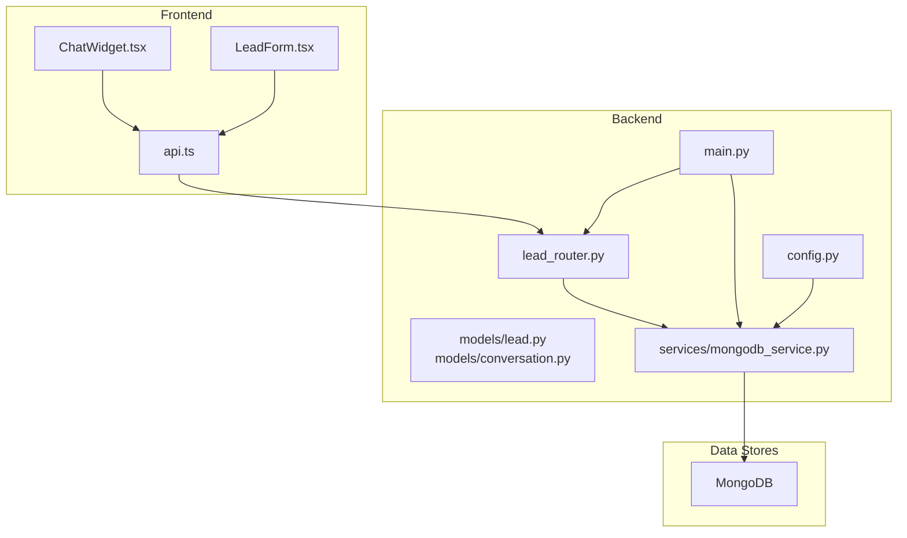
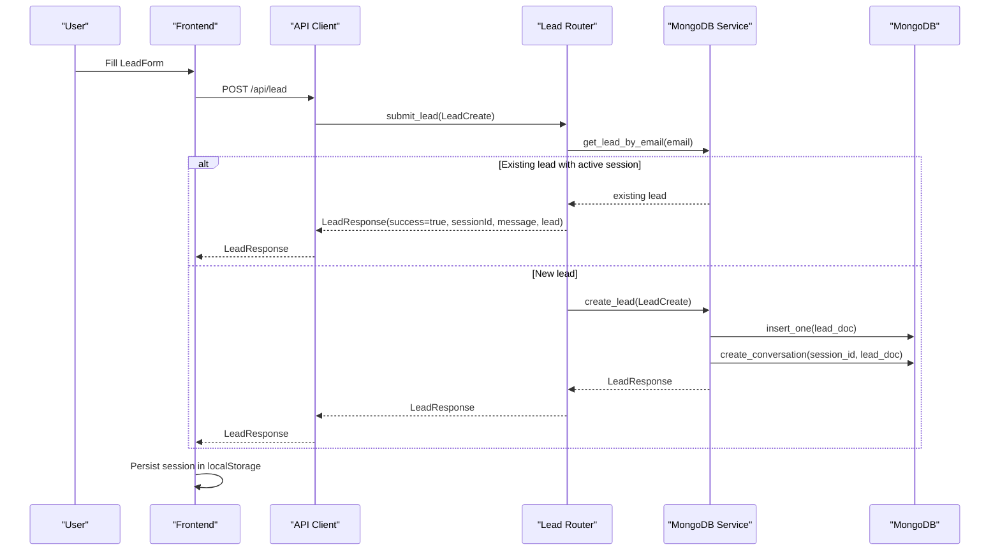
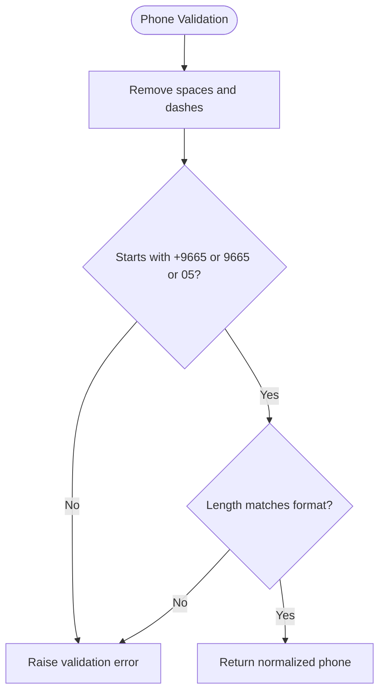
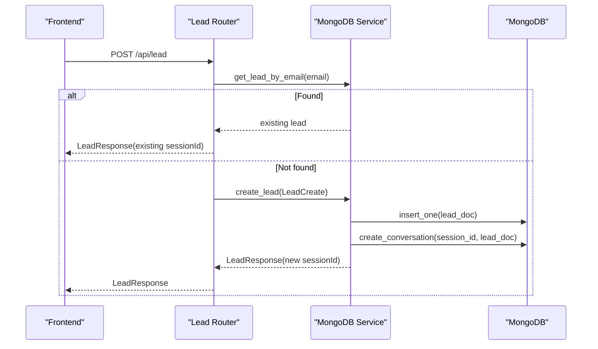
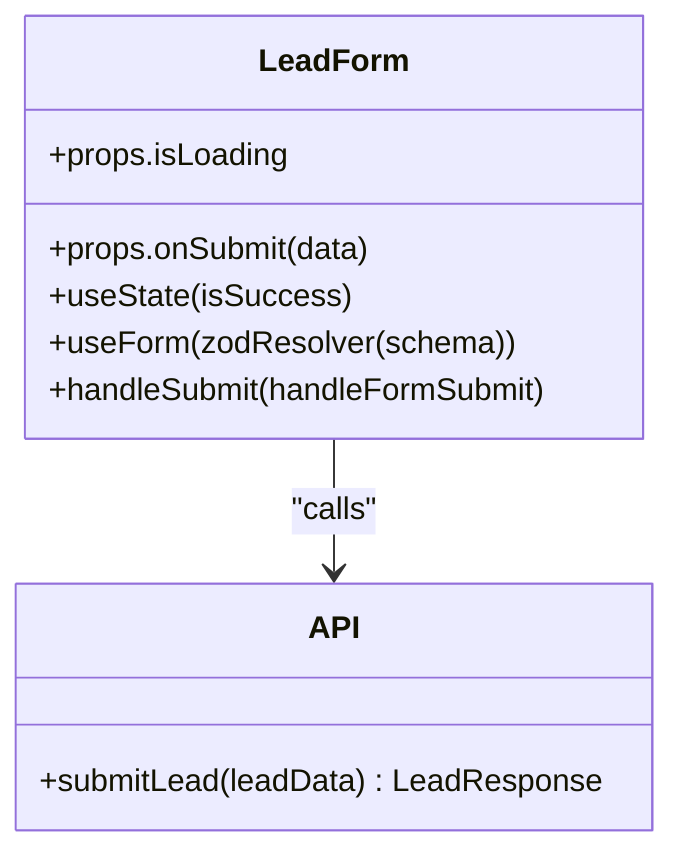
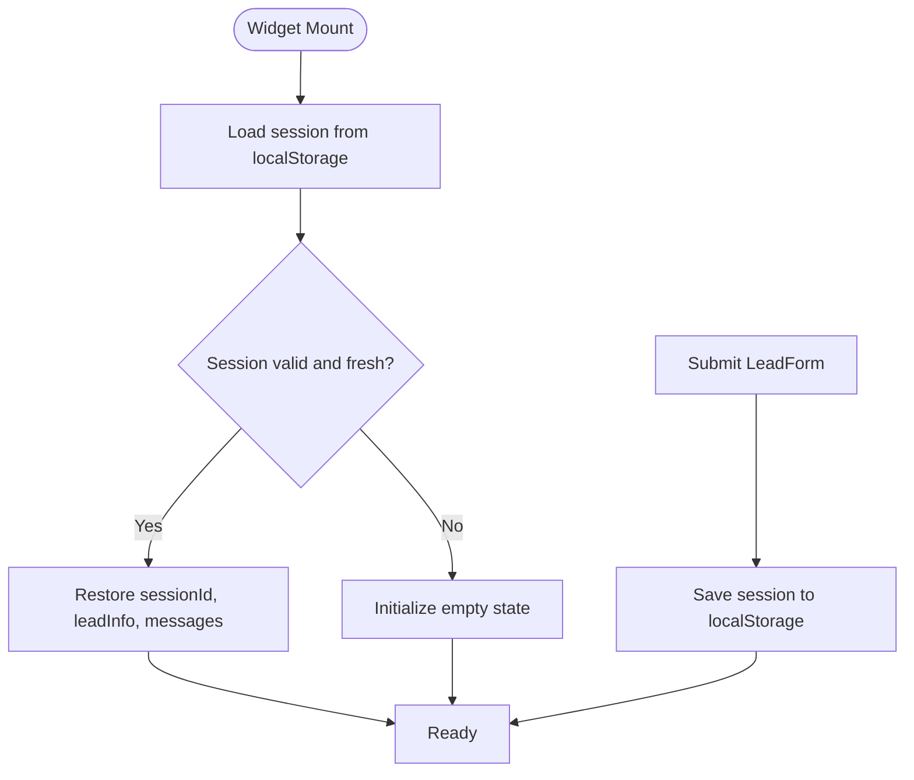
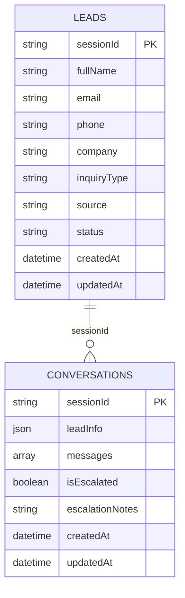
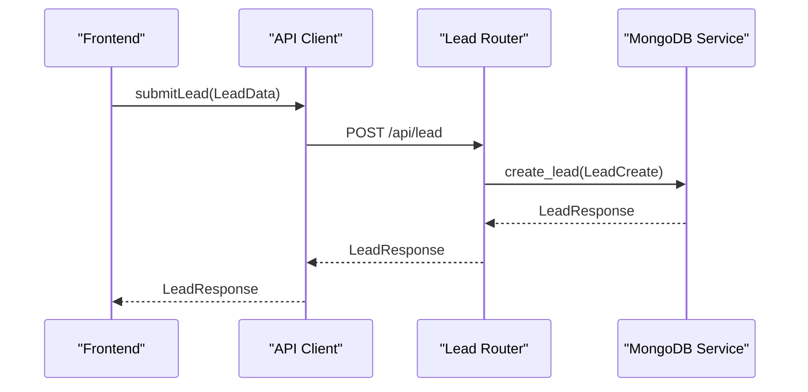
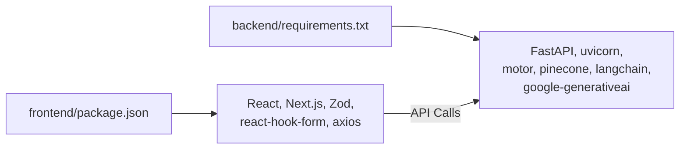

# Lead Capture System

<cite>
**Referenced Files in This Document**
- [README.md](file://README.md)
- [backend/app/models/lead.py](file://backend/app/models/lead.py)
- [backend/app/models/conversation.py](file://backend/app/models/conversation.py)
- [backend/app/routers/lead_router.py](file://backend/app/routers/lead_router.py)
- [backend/app/services/mongodb_service.py](file://backend/app/services/mongodb_service.py)
- [backend/app/config.py](file://backend/app/config.py)
- [backend/app/main.py](file://backend/app/main.py)
- [frontend/components/chat/LeadForm.tsx](file://frontend/components/chat/LeadForm.tsx)
- [frontend/components/chat/ChatWidget.tsx](file://frontend/components/chat/ChatWidget.tsx)
- [frontend/lib/api.ts](file://frontend/lib/api.ts)
- [frontend/package.json](file://frontend/package.json)
- [backend/requirements.txt](file://backend/requirements.txt)
</cite>

## Table of Contents
1. [Introduction](#introduction)
2. [Project Structure](#project-structure)
3. [Core Components](#core-components)
4. [Architecture Overview](#architecture-overview)
5. [Detailed Component Analysis](#detailed-component-analysis)
6. [Dependency Analysis](#dependency-analysis)
7. [Performance Considerations](#performance-considerations)
8. [Troubleshooting Guide](#troubleshooting-guide)
9. [Conclusion](#conclusion)
10. [Appendices](#appendices)

## Introduction
This document provides comprehensive documentation for the lead capture system powering the Hitech RAG Chatbot. It covers the lead form design, validation rules, and data collection process; the lead submission workflow, session creation, and customer information flow; the integration between frontend form components and backend API endpoints; validation logic for Saudi phone numbers; form state management and error handling; the MongoDB schema for lead storage, indexing strategy, and data retrieval patterns; examples of lead data structures, API interactions; and integration considerations with CRM systems. It also addresses data privacy, security considerations, and compliance requirements for customer information handling.

## Project Structure
The lead capture system spans a frontend built with Next.js and TypeScript and a backend powered by FastAPI. The frontend includes a standalone chat page and an embeddable widget generator. The backend exposes REST endpoints for lead submission, chat, escalation, and ingestion, backed by MongoDB for lead and conversation storage.

**Diagram sources**
- [frontend/components/chat/ChatWidget.tsx:1-307](file://frontend/components/chat/ChatWidget.tsx#L1-L307)
- [frontend/components/chat/LeadForm.tsx:1-168](file://frontend/components/chat/LeadForm.tsx#L1-L168)
- [frontend/lib/api.ts:1-93](file://frontend/lib/api.ts#L1-L93)
- [backend/app/main.py:1-90](file://backend/app/main.py#L1-L90)
- [backend/app/routers/lead_router.py:1-57](file://backend/app/routers/lead_router.py#L1-L57)
- [backend/app/models/lead.py:1-64](file://backend/app/models/lead.py#L1-L64)
- [backend/app/models/conversation.py:1-53](file://backend/app/models/conversation.py#L1-L53)
- [backend/app/services/mongodb_service.py:1-202](file://backend/app/services/mongodb_service.py#L1-L202)
- [backend/app/config.py:1-65](file://backend/app/config.py#L1-L65)

**Section sources**
- [README.md:1-205](file://README.md#L1-L205)
- [backend/app/main.py:1-90](file://backend/app/main.py#L1-L90)
- [frontend/components/chat/ChatWidget.tsx:1-307](file://frontend/components/chat/ChatWidget.tsx#L1-L307)

## Core Components
- Lead data models define the structure and validation rules for lead submissions, including Saudi phone number validation.
- The lead router handles lead creation, session assignment, and retrieval by session ID.
- The MongoDB service manages connections, indexes, lead and conversation CRUD operations, and session lifecycle.
- The frontend LeadForm component captures user input with client-side validation and Zod-based schema enforcement.
- The ChatWidget orchestrates session persistence, lead submission, and conversation flow.
- The API client encapsulates backend endpoint interactions.

**Section sources**
- [backend/app/models/lead.py:1-64](file://backend/app/models/lead.py#L1-L64)
- [backend/app/routers/lead_router.py:1-57](file://backend/app/routers/lead_router.py#L1-L57)
- [backend/app/services/mongodb_service.py:1-202](file://backend/app/services/mongodb_service.py#L1-L202)
- [frontend/components/chat/LeadForm.tsx:1-168](file://frontend/components/chat/LeadForm.tsx#L1-L168)
- [frontend/components/chat/ChatWidget.tsx:1-307](file://frontend/components/chat/ChatWidget.tsx#L1-L307)
- [frontend/lib/api.ts:1-93](file://frontend/lib/api.ts#L1-L93)

## Architecture Overview
The lead capture workflow begins when a user submits the LeadForm. The frontend validates input, sends a POST request to the backend, and upon success, stores session data locally for persistence. The backend validates the lead, creates a unique session ID, persists the lead record, initializes an empty conversation, and returns a structured response. Subsequent chat interactions rely on the session ID to retrieve context and maintain continuity.

**Diagram sources**
- [frontend/components/chat/LeadForm.tsx:1-168](file://frontend/components/chat/LeadForm.tsx#L1-L168)
- [frontend/lib/api.ts:1-93](file://frontend/lib/api.ts#L1-L93)
- [backend/app/routers/lead_router.py:1-57](file://backend/app/routers/lead_router.py#L1-L57)
- [backend/app/services/mongodb_service.py:1-202](file://backend/app/services/mongodb_service.py#L1-L202)

## Detailed Component Analysis

### Lead Model and Validation
The lead model enforces strong typing and validation rules:
- Full name: required, length bounds.
- Email: validated as an email address.
- Phone: validated as a Saudi mobile number with multiple accepted formats.
- Company: optional.
- Inquiry type: optional enumeration of predefined categories.

Saudi phone number validation logic accepts three formats:
- +9665xxxxxxxx (13 digits)
- 9665xxxxxxxx (12 digits)
- 05xxxxxxxx (10 digits)

The validator cleans whitespace and dashes before applying format checks.

**Diagram sources**
- [backend/app/models/lead.py:26-38](file://backend/app/models/lead.py#L26-L38)

**Section sources**
- [backend/app/models/lead.py:1-64](file://backend/app/models/lead.py#L1-L64)

### Lead Submission Workflow
The lead submission endpoint performs:
- Duplicate detection by email.
- Session creation using UUID.
- Lead insertion into MongoDB.
- Conversation initialization for the session.
- Response formatting with success flag, session ID, and lead snapshot.

**Diagram sources**
- [backend/app/routers/lead_router.py:11-44](file://backend/app/routers/lead_router.py#L11-L44)
- [backend/app/services/mongodb_service.py:51-77](file://backend/app/services/mongodb_service.py#L51-L77)

**Section sources**
- [backend/app/routers/lead_router.py:1-57](file://backend/app/routers/lead_router.py#L1-L57)
- [backend/app/services/mongodb_service.py:1-202](file://backend/app/services/mongodb_service.py#L1-L202)

### Frontend Form Integration
The LeadForm component:
- Uses Zod schema for client-side validation.
- Integrates with react-hook-form for controlled inputs and error rendering.
- Displays success state after submission.
- Communicates with the API client to submit lead data.

**Diagram sources**
- [frontend/components/chat/LeadForm.tsx:1-168](file://frontend/components/chat/LeadForm.tsx#L1-L168)
- [frontend/lib/api.ts:61-64](file://frontend/lib/api.ts#L61-L64)

**Section sources**
- [frontend/components/chat/LeadForm.tsx:1-168](file://frontend/components/chat/LeadForm.tsx#L1-L168)
- [frontend/lib/api.ts:1-93](file://frontend/lib/api.ts#L1-L93)

### Session Management and Persistence
The ChatWidget manages:
- Local storage of session data with TTL.
- Loading saved sessions on mount.
- Saving messages and lead info during the session.
- Transitioning from lead form to chat after successful submission.

**Diagram sources**
- [frontend/components/chat/ChatWidget.tsx:38-77](file://frontend/components/chat/ChatWidget.tsx#L38-L77)
- [frontend/components/chat/ChatWidget.tsx:84-108](file://frontend/components/chat/ChatWidget.tsx#L84-L108)

**Section sources**
- [frontend/components/chat/ChatWidget.tsx:1-307](file://frontend/components/chat/ChatWidget.tsx#L1-L307)

### MongoDB Schema and Indexing Strategy
The MongoDB service defines:
- Collections: leads and conversations.
- Indexes:
  - Leads: unique sessionId, email, phone, createdAt.
  - Conversations: unique sessionId, createdAt, isEscalated.
- Operations:
  - Create lead and initialize conversation.
  - Retrieve lead by session or email.
  - Update lead metadata.
  - Manage conversation lifecycle (create, add messages, escalate, cleanup).

**Diagram sources**
- [backend/app/services/mongodb_service.py:36-47](file://backend/app/services/mongodb_service.py#L36-L47)
- [backend/app/services/mongodb_service.py:51-77](file://backend/app/services/mongodb_service.py#L51-L77)
- [backend/app/models/conversation.py:23-44](file://backend/app/models/conversation.py#L23-L44)

**Section sources**
- [backend/app/services/mongodb_service.py:1-202](file://backend/app/services/mongodb_service.py#L1-L202)
- [backend/app/models/conversation.py:1-53](file://backend/app/models/conversation.py#L1-L53)

### API Interactions and Data Structures
- Lead submission endpoint: POST /api/lead.
- Response includes success flag, sessionId, message, and optional lead snapshot.
- Frontend API client encapsulates endpoint URLs and response types.

**Diagram sources**
- [frontend/lib/api.ts:61-64](file://frontend/lib/api.ts#L61-L64)
- [backend/app/routers/lead_router.py:11-15](file://backend/app/routers/lead_router.py#L11-L15)
- [backend/app/services/mongodb_service.py:51-77](file://backend/app/services/mongodb_service.py#L51-L77)

**Section sources**
- [frontend/lib/api.ts:1-93](file://frontend/lib/api.ts#L1-L93)
- [backend/app/routers/lead_router.py:1-57](file://backend/app/routers/lead_router.py#L1-L57)

### CRM Integration Considerations
- The lead model includes fields suitable for CRM ingestion: fullName, email, phone, company, inquiryType, source, status, and timestamps.
- The backend can be extended to export lead records to CRM systems via scheduled jobs or webhook triggers.
- Consider adding a dedicated endpoint to push leads to CRM with deduplication and error handling.

[No sources needed since this section provides general guidance]

## Dependency Analysis
- Frontend dependencies include React, Next.js, Zod, react-hook-form, axios, and Tailwind CSS.
- Backend dependencies include FastAPI, uvicorn, motor for MongoDB, pinecone for vector storage, langchain/google-ai for RAG, and pydantic for validation.
- Runtime dependencies are configured via requirements.txt and package.json.

**Diagram sources**
- [frontend/package.json:1-37](file://frontend/package.json#L1-L37)
- [backend/requirements.txt:1-48](file://backend/requirements.txt#L1-L48)

**Section sources**
- [frontend/package.json:1-37](file://frontend/package.json#L1-L37)
- [backend/requirements.txt:1-48](file://backend/requirements.txt#L1-L48)

## Performance Considerations
- Indexing strategy ensures efficient lookups by sessionId, email, phone, and createdAt for leads, and by sessionId, createdAt, and isEscalated for conversations.
- Session TTL and conversation history limits reduce storage overhead and improve retrieval performance.
- Consider connection pooling and async operations to minimize latency in lead creation and chat retrieval.

[No sources needed since this section provides general guidance]

## Troubleshooting Guide
Common issues and resolutions:
- Invalid Saudi phone number: Ensure the phone number matches accepted formats (+9665xxxxxxxx, 9665xxxxxxxx, 05xxxxxxxx). The backend validator raises a validation error for invalid formats.
- Session not found: The chat endpoint requires a valid sessionId; ensure the lead form was submitted successfully and the session is persisted in localStorage.
- Network errors: Verify API_URL environment variable and CORS configuration. Confirm backend health endpoint responds correctly.
- Duplicate lead detection: If a lead with an existing email is detected, the system returns the existing sessionId and message indicating continuation of the previous session.

**Section sources**
- [backend/app/models/lead.py:26-38](file://backend/app/models/lead.py#L26-L38)
- [backend/app/routers/lead_router.py:24-44](file://backend/app/routers/lead_router.py#L24-L44)
- [backend/app/main.py:74-83](file://backend/app/main.py#L74-L83)
- [frontend/components/chat/ChatWidget.tsx:84-108](file://frontend/components/chat/ChatWidget.tsx#L84-L108)

## Conclusion
The lead capture system integrates robust frontend validation with a strongly typed backend and efficient MongoDB storage. It provides a seamless user experience with session persistence, clear validation feedback, and scalable conversation management. Extending the system to integrate with CRM platforms involves mapping lead fields and implementing export mechanisms while maintaining strict validation and privacy controls.

[No sources needed since this section summarizes without analyzing specific files]

## Appendices

### API Definitions
- POST /api/lead
  - Request: LeadCreate (fields: fullName, email, phone, company, inquiryType)
  - Response: LeadResponse (success, sessionId, message, lead)
- GET /api/lead/{session_id}
  - Response: Lead document by sessionId

**Section sources**
- [backend/app/routers/lead_router.py:11-57](file://backend/app/routers/lead_router.py#L11-L57)
- [backend/app/models/lead.py:41-64](file://backend/app/models/lead.py#L41-L64)

### Data Privacy, Security, and Compliance
- Data minimization: Only collect necessary fields (fullName, email, phone, company, inquiryType).
- Validation: Enforce Saudi phone number format server-side to prevent malformed entries.
- Storage: Use MongoDB Atlas with appropriate network policies and encryption at rest.
- Access control: Restrict access to admin endpoints and ensure API keys are managed securely.
- Retention: Implement session TTL and cleanup procedures for expired conversations.
- Consent: Display privacy policy and obtain consent before collecting personal data.
- Data subject rights: Provide mechanisms for data access, rectification, and deletion upon request.

[No sources needed since this section provides general guidance]