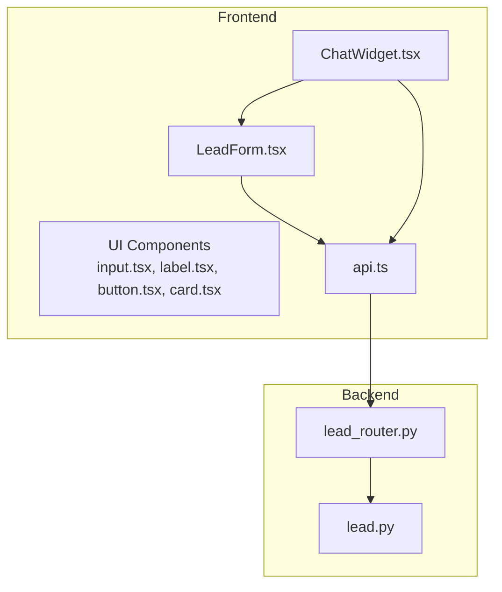
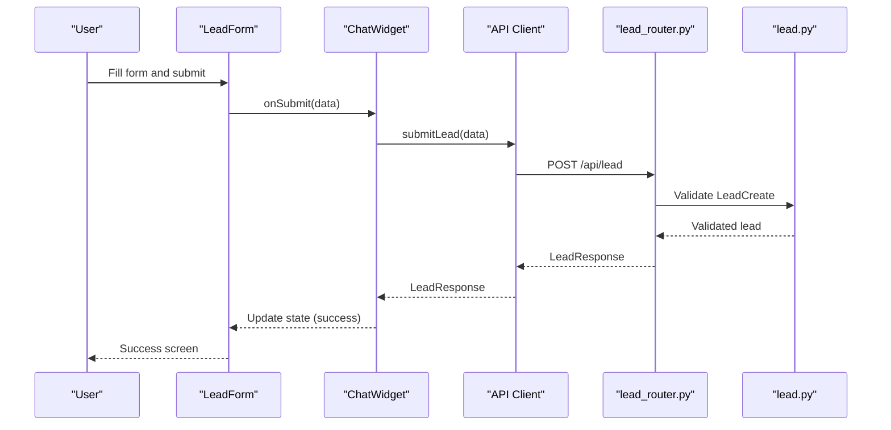
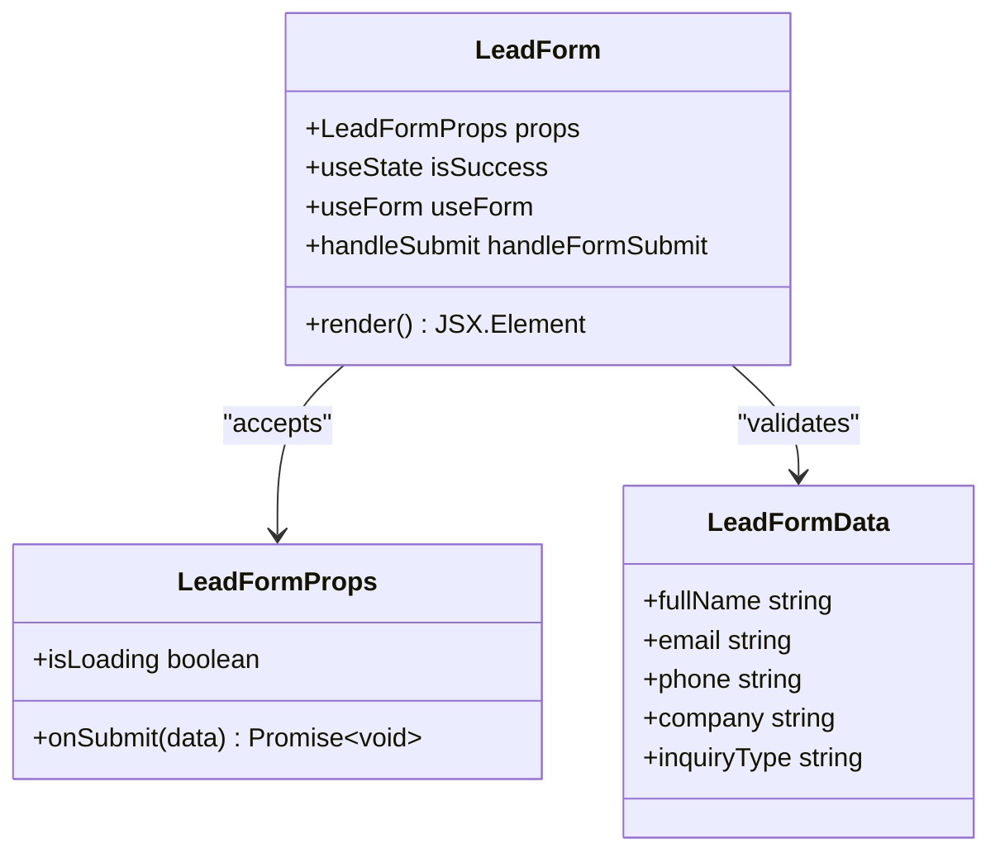
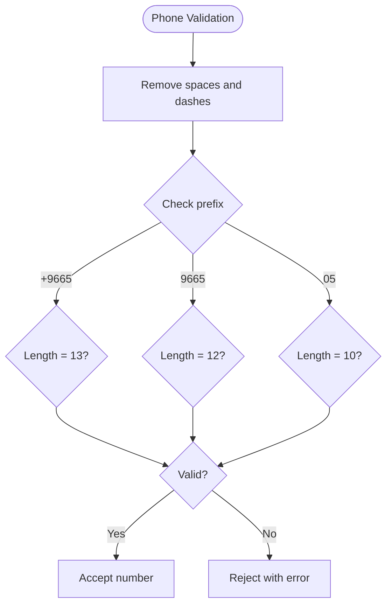
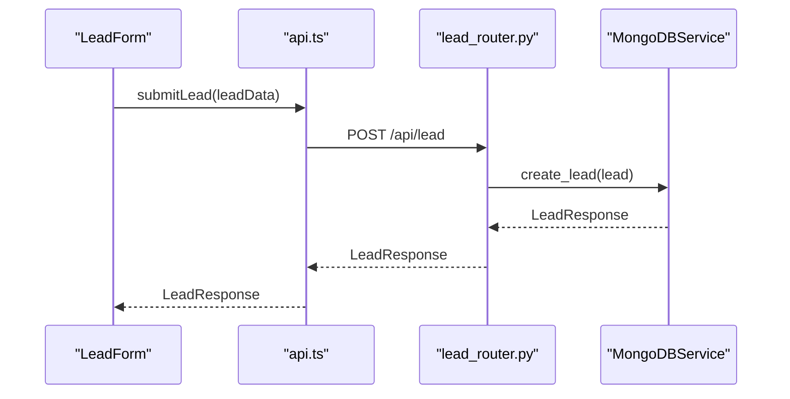
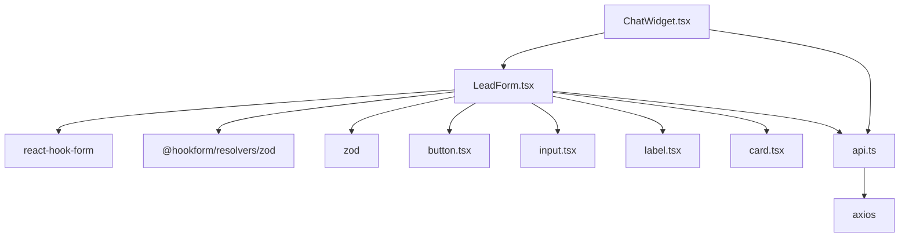

# Lead Form Design

<cite>
**Referenced Files in This Document**
- [LeadForm.tsx](file://frontend/components/chat/LeadForm.tsx)
- [ChatWidget.tsx](file://frontend/components/chat/ChatWidget.tsx)
- [api.ts](file://frontend/lib/api.ts)
- [input.tsx](file://frontend/components/ui/input.tsx)
- [label.tsx](file://frontend/components/ui/label.tsx)
- [button.tsx](file://frontend/components/ui/button.tsx)
- [card.tsx](file://frontend/components/ui/card.tsx)
- [lead.py](file://backend/app/models/lead.py)
- [lead_router.py](file://backend/app/routers/lead_router.py)
- [page.tsx](file://frontend/app/page.tsx)
- [globals.css](file://frontend/app/globals.css)
- [next.config.ts](file://frontend/next.config.ts)
</cite>

## Table of Contents
1. [Introduction](#introduction)
2. [Project Structure](#project-structure)
3. [Core Components](#core-components)
4. [Architecture Overview](#architecture-overview)
5. [Detailed Component Analysis](#detailed-component-analysis)
6. [Dependency Analysis](#dependency-analysis)
7. [Performance Considerations](#performance-considerations)
8. [Troubleshooting Guide](#troubleshooting-guide)
9. [Conclusion](#conclusion)

## Introduction
This document provides comprehensive technical documentation for the Lead Form Design component, focusing on the React-based lead capture form used within the chat widget. It covers component structure, form validation rules, UI elements, state management, input configurations, Saudi phone number validation logic, component props and event handlers, API integration, styling with Tailwind CSS, responsive design patterns, accessibility considerations, submission flow, and user experience optimizations.

## Project Structure
The lead form is part of a larger chat widget system that includes:
- Frontend React components for the chat widget and form
- A shared API client for backend communication
- Backend FastAPI routes and Pydantic models for lead validation and persistence

**Diagram sources**
- [ChatWidget.tsx:1-307](file://frontend/components/chat/ChatWidget.tsx#L1-L307)
- [LeadForm.tsx:1-168](file://frontend/components/chat/LeadForm.tsx#L1-L168)
- [api.ts:1-93](file://frontend/lib/api.ts#L1-L93)
- [lead_router.py:1-57](file://backend/app/routers/lead_router.py#L1-L57)
- [lead.py:1-64](file://backend/app/models/lead.py#L1-L64)

**Section sources**
- [ChatWidget.tsx:1-307](file://frontend/components/chat/ChatWidget.tsx#L1-L307)
- [LeadForm.tsx:1-168](file://frontend/components/chat/LeadForm.tsx#L1-L168)
- [api.ts:1-93](file://frontend/lib/api.ts#L1-L93)
- [lead_router.py:1-57](file://backend/app/routers/lead_router.py#L1-L57)
- [lead.py:1-64](file://backend/app/models/lead.py#L1-L64)

## Core Components
The lead form is implemented as a standalone React component that integrates with:
- React Hook Form for form state and validation
- Zod for runtime validation schema
- Shared UI components for inputs, labels, buttons, and cards
- A centralized API client for backend communication

Key responsibilities:
- Define validation schema for lead data
- Manage form state and submission lifecycle
- Render form fields with validation feedback
- Integrate with parent container for loading states and success transitions
- Provide accessible form controls and error messaging

**Section sources**
- [LeadForm.tsx:13-26](file://frontend/components/chat/LeadForm.tsx#L13-L26)
- [LeadForm.tsx:28-42](file://frontend/components/chat/LeadForm.tsx#L28-L42)
- [LeadForm.tsx:72-166](file://frontend/components/chat/LeadForm.tsx#L72-L166)

## Architecture Overview
The lead form participates in a two-tier architecture:
- Frontend: React component with form validation and UI rendering
- Backend: FastAPI service validating and persisting lead data

**Diagram sources**
- [LeadForm.tsx:39-42](file://frontend/components/chat/LeadForm.tsx#L39-L42)
- [ChatWidget.tsx:84-108](file://frontend/components/chat/ChatWidget.tsx#L84-L108)
- [api.ts:61-64](file://frontend/lib/api.ts#L61-L64)
- [lead_router.py:11-44](file://backend/app/routers/lead_router.py#L11-L44)
- [lead.py:18-38](file://backend/app/models/lead.py#L18-L38)

## Detailed Component Analysis

### LeadForm Component
The LeadForm component encapsulates the lead capture functionality with the following structure:

**Diagram sources**
- [LeadForm.tsx:23-26](file://frontend/components/chat/LeadForm.tsx#L23-L26)
- [LeadForm.tsx:21](file://frontend/components/chat/LeadForm.tsx#L21)

#### Validation Schema and Rules
The form uses Zod for validation with specific rules:
- Full name: required, minimum 2 characters
- Email: required, valid email format
- Phone: required, Saudi phone number format validation
- Company: optional
- Inquiry type: optional

Saudi phone number validation accepts formats:
- +966 5xxxxxxxx (13 digits)
- 966 5xxxxxxxx (12 digits)
- 05xxxxxxxx (10 digits)

**Diagram sources**
- [lead.py:26-38](file://backend/app/models/lead.py#L26-L38)
- [LeadForm.tsx:13-19](file://frontend/components/chat/LeadForm.tsx#L13-L19)

#### Form State Management
The component manages state through:
- Local success state for form completion
- React Hook Form for field-level validation
- Controlled loading state from parent component

#### Input Field Configurations
Field definitions and behaviors:
- Full name: text input with character minimum validation
- Email: email input with format validation
- Phone: text input with Saudi phone number regex validation
- Company: optional text input
- Inquiry type: dropdown with predefined options

#### Event Handlers and Submission Flow
Submission flow:
1. User submits form
2. Parent component handles API call
3. On success, component transitions to success screen
4. Loading state disables submit button during submission

**Section sources**
- [LeadForm.tsx:13-19](file://frontend/components/chat/LeadForm.tsx#L13-L19)
- [LeadForm.tsx:28-42](file://frontend/components/chat/LeadForm.tsx#L28-L42)
- [LeadForm.tsx:72-166](file://frontend/components/chat/LeadForm.tsx#L72-L166)
- [lead.py:26-38](file://backend/app/models/lead.py#L26-L38)

### API Integration
The form integrates with the backend through a centralized API client:

**Diagram sources**
- [api.ts:61-64](file://frontend/lib/api.ts#L61-L64)
- [lead_router.py:11-38](file://backend/app/routers/lead_router.py#L11-L38)

#### Backend Validation and Persistence
Backend validation includes:
- Pydantic model validation with field constraints
- Custom validator for Saudi phone number format
- MongoDB persistence with session management
- Duplicate email detection for session continuity

**Section sources**
- [api.ts:14-27](file://frontend/lib/api.ts#L14-L27)
- [lead_router.py:11-44](file://backend/app/routers/lead_router.py#L11-L44)
- [lead.py:18-56](file://backend/app/models/lead.py#L18-L56)

### UI Components and Styling
The form leverages shared UI components with Tailwind CSS:

#### Input Component
The input component provides consistent styling and accessibility:
- Focus states with ring effects
- Disabled state handling
- Placeholder text styling
- Responsive sizing

#### Label Component
Accessible labeling with:
- Proper association to inputs
- Focus and disabled states
- Consistent typography

#### Button Component
Primary submit button with:
- Gradient styling
- Loading state with spinner
- Disabled state during submission
- Hover and focus states

#### Card Component
Form container with:
- Shadow and border styling
- Responsive width constraints
- Centered layout
- Typography hierarchy

**Section sources**
- [input.tsx:4-24](file://frontend/components/ui/input.tsx#L4-L24)
- [label.tsx:8-25](file://frontend/components/ui/label.tsx#L8-L25)
- [button.tsx:6-33](file://frontend/components/ui/button.tsx#L6-L33)
- [card.tsx:4-75](file://frontend/components/ui/card.tsx#L4-L75)

### Accessibility Considerations
The form implements several accessibility features:
- Proper label associations for all inputs
- Focus management and keyboard navigation
- Screen reader friendly error messages
- Color contrast compliance for validation states
- Semantic HTML structure
- Disabled state indicators for interactive elements

### Responsive Design Patterns
The form follows responsive design principles:
- Mobile-first layout with centered card
- Flexible width constraints (max-w-md)
- Adaptive spacing and typography
- Touch-friendly input sizes
- Consistent padding and margins across breakpoints

**Section sources**
- [LeadForm.tsx:59-166](file://frontend/components/chat/LeadForm.tsx#L59-L166)
- [globals.css:1-27](file://frontend/app/globals.css#L1-L27)

## Dependency Analysis
The lead form has the following dependencies:

**Diagram sources**
- [LeadForm.tsx:3-11](file://frontend/components/chat/LeadForm.tsx#L3-L11)
- [ChatWidget.tsx:3-10](file://frontend/components/chat/ChatWidget.tsx#L3-L10)
- [api.ts:2](file://frontend/lib/api.ts#L2)

**Section sources**
- [LeadForm.tsx:3-11](file://frontend/components/chat/LeadForm.tsx#L3-L11)
- [ChatWidget.tsx:3-10](file://frontend/components/chat/ChatWidget.tsx#L3-L10)
- [api.ts:2](file://frontend/lib/api.ts#L2)

## Performance Considerations
- Form validation occurs client-side with Zod for immediate feedback
- React Hook Form optimizes re-renders by only updating touched fields
- API calls are debounced through loading states
- Component composition reduces unnecessary re-renders
- Tailwind CSS utility classes minimize CSS overhead

## Troubleshooting Guide
Common issues and resolutions:

### Validation Errors
- **Phone number format**: Ensure Saudi phone numbers match accepted formats (+966 5xxxxxxxx, 966 5xxxxxxxx, 05xxxxxxxx)
- **Email format**: Verify email addresses follow standard format requirements
- **Name length**: Full names must be at least 2 characters

### API Integration Issues
- **Network connectivity**: Check API URL configuration in environment variables
- **CORS policies**: Verify backend CORS settings allow frontend origin
- **Session persistence**: Review localStorage usage for session management

### Styling Issues
- **Tailwind classes**: Ensure Tailwind is properly configured in the build pipeline
- **Color contrast**: Verify accessibility compliance for validation states
- **Responsive breakpoints**: Test form layout across different viewport sizes

**Section sources**
- [LeadForm.tsx:13-19](file://frontend/components/chat/LeadForm.tsx#L13-L19)
- [api.ts:4](file://frontend/lib/api.ts#L4)
- [next.config.ts:9-11](file://frontend/next.config.ts#L9-L11)

## Conclusion
The Lead Form Design component provides a robust, accessible, and user-friendly solution for capturing lead information within the chat widget ecosystem. Its architecture ensures strong validation, responsive design, and seamless integration with both frontend and backend systems. The component's modular design allows for easy maintenance and extension while maintaining consistency with the overall application's design system.