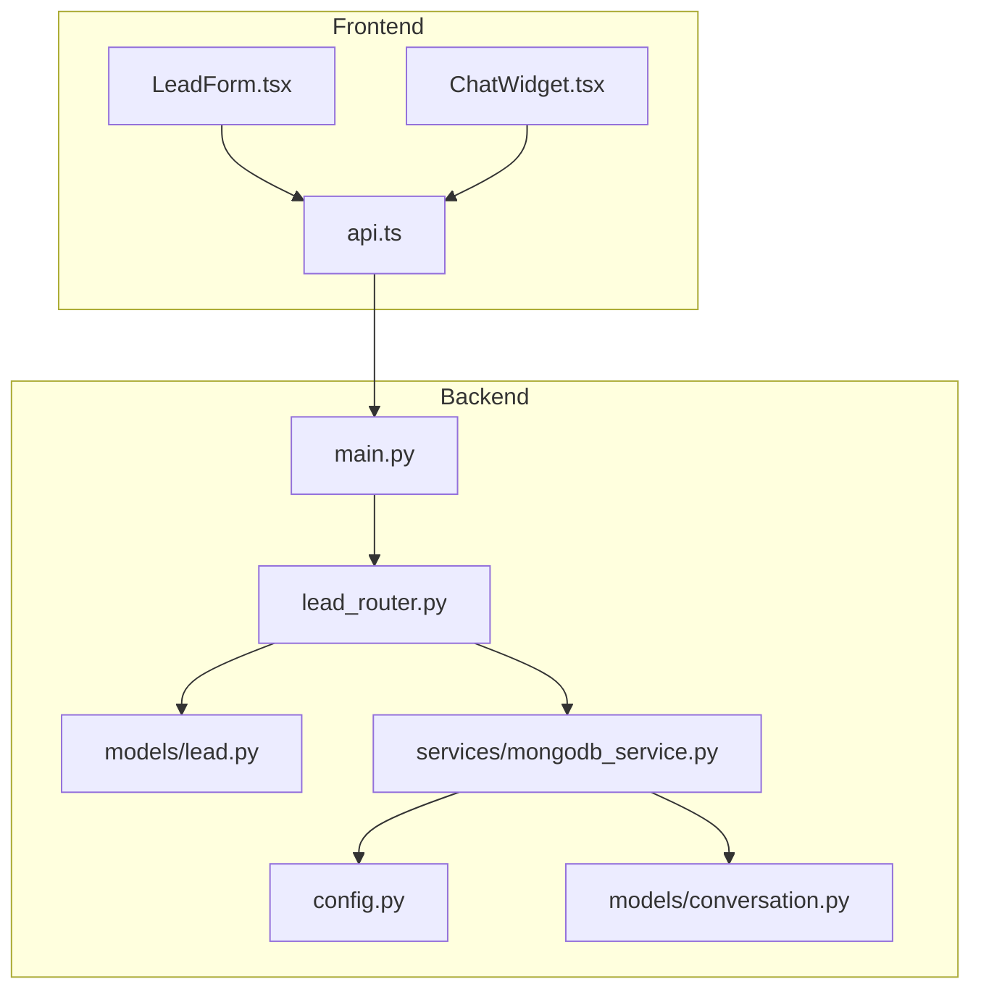
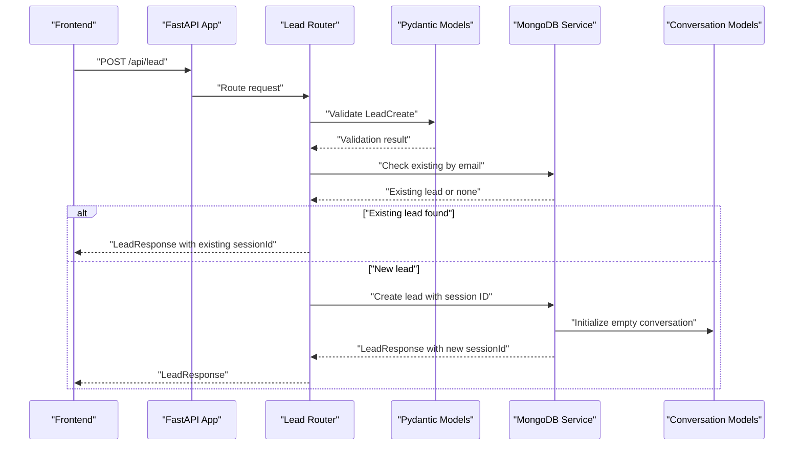
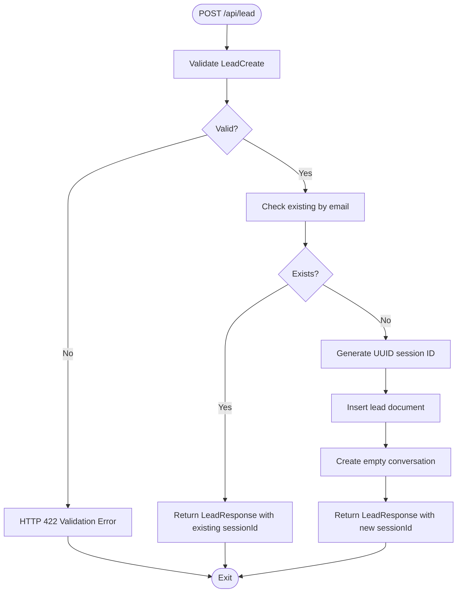
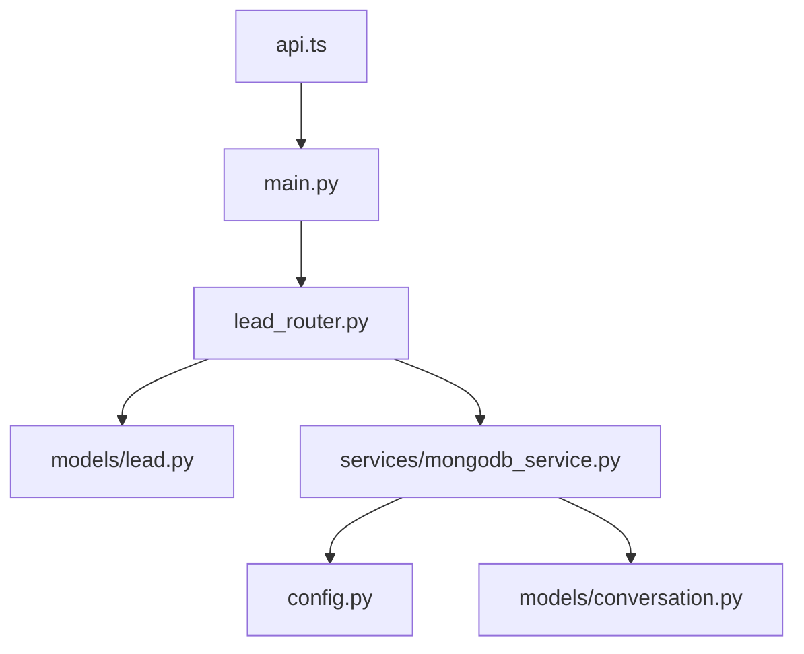

# Lead Submission Workflow

<cite>
**Referenced Files in This Document**
- [lead.py](file://backend/app/models/lead.py)
- [lead_router.py](file://backend/app/routers/lead_router.py)
- [mongodb_service.py](file://backend/app/services/mongodb_service.py)
- [main.py](file://backend/app/main.py)
- [config.py](file://backend/app/config.py)
- [conversation.py](file://backend/app/models/conversation.py)
- [LeadForm.tsx](file://frontend/components/chat/LeadForm.tsx)
- [api.ts](file://frontend/lib/api.ts)
- [ChatWidget.tsx](file://frontend/components/chat/ChatWidget.tsx)
</cite>

## Table of Contents
1. [Introduction](#introduction)
2. [Project Structure](#project-structure)
3. [Core Components](#core-components)
4. [Architecture Overview](#architecture-overview)
5. [Detailed Component Analysis](#detailed-component-analysis)
6. [Dependency Analysis](#dependency-analysis)
7. [Performance Considerations](#performance-considerations)
8. [Troubleshooting Guide](#troubleshooting-guide)
9. [Conclusion](#conclusion)

## Introduction
This document describes the complete lead submission workflow for the Hitech RAG Chatbot. It covers the API endpoint implementation, request validation, response handling, lead creation, session ID generation, duplicate detection logic, MongoDB integration, error handling strategies, and HTTP status codes. It also documents the LeadCreate and LeadResponse Pydantic models, field requirements, and data transformation processes, along with security considerations, rate limiting, and input sanitization.

## Project Structure
The lead submission workflow spans the backend FastAPI application and the frontend React widget. The backend defines models, routes, and MongoDB service, while the frontend provides a form and API client to submit lead data.

**Diagram sources**
- [main.py:39-85](file://backend/app/main.py#L39-L85)
- [lead_router.py:11-56](file://backend/app/routers/lead_router.py#L11-L56)
- [lead.py:18-64](file://backend/app/models/lead.py#L18-L64)
- [mongodb_service.py:13-202](file://backend/app/services/mongodb_service.py#L13-L202)
- [config.py:7-65](file://backend/app/config.py#L7-L65)
- [conversation.py:15-53](file://backend/app/models/conversation.py#L15-L53)
- [LeadForm.tsx:13-19](file://frontend/components/chat/LeadForm.tsx#L13-L19)
- [api.ts:61-64](file://frontend/lib/api.ts#L61-L64)

**Section sources**
- [main.py:39-85](file://backend/app/main.py#L39-L85)
- [lead_router.py:11-56](file://backend/app/routers/lead_router.py#L11-L56)
- [lead.py:18-64](file://backend/app/models/lead.py#L18-L64)
- [mongodb_service.py:13-202](file://backend/app/services/mongodb_service.py#L13-L202)
- [config.py:7-65](file://backend/app/config.py#L7-L65)
- [conversation.py:15-53](file://backend/app/models/conversation.py#L15-L53)
- [LeadForm.tsx:13-19](file://frontend/components/chat/LeadForm.tsx#L13-L19)
- [api.ts:61-64](file://frontend/lib/api.ts#L61-L64)

## Core Components
- Lead data models define validation rules and transformations for lead submissions.
- The lead router exposes the POST /api/lead endpoint and GET /api/lead/{session_id}.
- The MongoDB service manages lead and conversation persistence, session ID generation, and duplicate detection.
- Frontend components provide form validation and API integration.

Key responsibilities:
- Validation: Pydantic models enforce field presence, length, and format; phone validation ensures Saudi phone number compliance.
- Session management: UUID-based session IDs are generated during lead creation.
- Duplicate detection: Existing leads with the same email are returned with their session ID.
- Response handling: Standardized LeadResponse payload with success flag, session ID, message, and optional lead data.

**Section sources**
- [lead.py:18-64](file://backend/app/models/lead.py#L18-L64)
- [lead_router.py:11-56](file://backend/app/routers/lead_router.py#L11-L56)
- [mongodb_service.py:51-77](file://backend/app/services/mongodb_service.py#L51-L77)

## Architecture Overview
The lead submission flow integrates frontend form validation, backend API routing, Pydantic model validation, MongoDB persistence, and conversation initialization.

**Diagram sources**
- [lead_router.py:11-44](file://backend/app/routers/lead_router.py#L11-L44)
- [lead.py:18-64](file://backend/app/models/lead.py#L18-L64)
- [mongodb_service.py:51-77](file://backend/app/services/mongodb_service.py#L51-L77)
- [conversation.py:23-42](file://backend/app/models/conversation.py#L23-L42)

## Detailed Component Analysis

### Lead Data Models
The lead models define strict validation and transformation rules:
- LeadBase: Common fields with constraints for name, email, phone, company, and inquiry type.
- LeadCreate: Extends LeadBase for incoming requests.
- LeadInDB: Adds session ID, timestamps, source, and status for storage.
- LeadResponse: Standardized response envelope with success, session ID, message, and optional lead data.

Field requirements and constraints:
- fullName: Required, min length 2, max length 100.
- email: Required, validated as email.
- phone: Required, validated for Saudi formats (+966 5xxxxxxxx, 9665xxxxxxxx, 05xxxxxxxx).
- company: Optional, max length 100.
- inquiryType: Optional enumeration with predefined values.
- sessionId: Generated during creation, unique in MongoDB.
- createdAt/updatedAt: Timestamps managed by models and service.
- source/status: Defaults applied during creation.

Phone validation logic:
- Removes spaces and dashes.
- Accepts three formats with specific lengths.
- Raises validation error for invalid formats.

Data transformation:
- inquiryType stored as value string.
- createdAt/updatedAt normalized to UTC.

**Section sources**
- [lead.py:18-64](file://backend/app/models/lead.py#L18-L64)

### Lead Router Endpoint
The router exposes:
- POST /api/lead: Submits a new lead, validates input, checks for duplicates, creates session ID, stores lead, initializes conversation, and returns LeadResponse.
- GET /api/lead/{session_id}: Retrieves lead by session ID, returns 404 if not found.

Duplicate detection:
- Queries MongoDB by email.
- Returns existing session ID and lead data if found.

Error handling:
- Catches exceptions and raises HTTP 500 with detail message.

HTTP status codes:
- 200 OK: Successful lead creation or duplicate detection.
- 404 Not Found: Lead lookup by session ID fails.
- 500 Internal Server Error: General failure during processing.

**Section sources**
- [lead_router.py:11-56](file://backend/app/routers/lead_router.py#L11-L56)

### MongoDB Service
Responsibilities:
- Connect/disconnect to MongoDB using configured URI and database name.
- Create unique indexes on sessionId, email, phone, createdAt for leads; and on sessionId, createdAt, isEscalated for conversations.
- Create lead: Generates UUID session ID, constructs lead document, inserts into leads collection, and initializes an empty conversation.
- Retrieve leads: By session ID or email.
- Update lead: Sets updatedAt automatically.
- Conversation operations: Create, add messages, retrieve history, escalate to human, and cleanup expired sessions.

Session ID generation:
- Uses UUID v4 to ensure uniqueness.

Duplicate detection:
- Implemented in router using get_lead_by_email.

Data consistency:
- updatedAt is updated on all lead modifications.
- Conversation snapshots lead info at creation.

**Section sources**
- [mongodb_service.py:13-202](file://backend/app/services/mongodb_service.py#L13-L202)
- [config.py:15-18](file://backend/app/config.py#L15-L18)

### Frontend Integration
Frontend components:
- LeadForm.tsx: Zod-based validation mirrors backend constraints for name, email, and Saudi phone number format.
- api.ts: Defines LeadData and LeadResponse types and implements submitLead to POST to /api/lead.
- ChatWidget.tsx: Manages session lifecycle, persists session in localStorage, and orchestrates lead submission and chat flow.

Validation alignment:
- Frontend enforces similar constraints to backend to reduce server errors.

**Section sources**
- [LeadForm.tsx:13-19](file://frontend/components/chat/LeadForm.tsx#L13-L19)
- [api.ts:14-27](file://frontend/lib/api.ts#L14-L27)
- [api.ts:61-64](file://frontend/lib/api.ts#L61-L64)
- [ChatWidget.tsx:24-77](file://frontend/components/chat/ChatWidget.tsx#L24-L77)

### Request and Response Payloads

#### Request Payload (LeadCreate)
- fullName: string (required)
- email: string (required)
- phone: string (required)
- company: string (optional)
- inquiryType: enum string (optional)

Example request:
{
  "fullName": "Ahmed Al-Shehri",
  "email": "ahmed@example.com",
  "phone": "+966512345678",
  "company": "Tech Solutions",
  "inquiryType": "Product Information"
}

#### Response Payload (LeadResponse)
- success: boolean
- sessionId: string
- message: string
- lead: object (optional)

Example successful response:
{
  "success": true,
  "sessionId": "550e8400-e29b-41d4-a716-446655440000",
  "message": "Lead created successfully",
  "lead": {
    "fullName": "Ahmed Al-Shehri",
    "email": "ahmed@example.com",
    "phone": "+966512345678",
    "company": "Tech Solutions",
    "inquiryType": "Product Information",
    "sessionId": "550e8400-e29b-41d4-a716-446655440000",
    "createdAt": "2023-05-15T10:00:00Z",
    "source": "chat_widget",
    "status": "new"
  }
}

Example duplicate detection response:
{
  "success": true,
  "sessionId": "550e8400-e29b-41d4-a716-446655440000",
  "message": "Welcome back! Continuing your previous session.",
  "lead": { ... }
}

**Section sources**
- [lead.py:41-64](file://backend/app/models/lead.py#L41-L64)
- [mongodb_service.py:51-77](file://backend/app/services/mongodb_service.py#L51-L77)
- [lead_router.py:24-34](file://backend/app/routers/lead_router.py#L24-L34)

### Validation Scenarios and Edge Cases
- Invalid phone number: Fails Saudi phone number validation; returns validation error.
- Missing required fields: Pydantic validation rejects missing fullName, email, or phone.
- Invalid email: Pydantic validation rejects malformed email.
- Duplicate email: Router returns existing session ID and lead data.
- MongoDB connection failure: Router raises HTTP 500.
- Nonexistent session ID: GET /api/lead/{session_id} returns 404.

**Section sources**
- [lead.py:26-38](file://backend/app/models/lead.py#L26-L38)
- [lead_router.py:24-44](file://backend/app/routers/lead_router.py#L24-L44)
- [mongodb_service.py:79-85](file://backend/app/services/mongodb_service.py#L79-L85)

### Security Considerations
- Input sanitization: Pydantic validation and MongoDB insertion sanitize basic data types; ensure no raw HTML/script injection in non-schema fields.
- CORS: Backend allows configured origins for widget embedding.
- Rate limiting: Not implemented in the current codebase; consider adding rate limiting at gateway or middleware level.
- Secrets: MongoDB URI and other secrets are loaded from environment via Settings.

Recommendations:
- Add rate limiting per IP/email to prevent abuse.
- Implement input sanitization for free-text fields.
- Add request size limits and timeout configuration.
- Consider WAF rules for common attack vectors.

**Section sources**
- [main.py:50-57](file://backend/app/main.py#L50-L57)
- [config.py:15-18](file://backend/app/config.py#L15-L18)

### Data Flow and Transformation

**Diagram sources**
- [lead_router.py:11-44](file://backend/app/routers/lead_router.py#L11-L44)
- [mongodb_service.py:51-77](file://backend/app/services/mongodb_service.py#L51-L77)

## Dependency Analysis
The lead submission workflow depends on:
- FastAPI application lifecycle and CORS configuration.
- MongoDB service for persistence and indexing.
- Pydantic models for validation and serialization.
- Frontend API client for request/response handling.

**Diagram sources**
- [main.py:39-85](file://backend/app/main.py#L39-L85)
- [lead_router.py:11-56](file://backend/app/routers/lead_router.py#L11-L56)
- [lead.py:18-64](file://backend/app/models/lead.py#L18-L64)
- [mongodb_service.py:13-202](file://backend/app/services/mongodb_service.py#L13-L202)
- [config.py:7-65](file://backend/app/config.py#L7-L65)
- [conversation.py:15-53](file://backend/app/models/conversation.py#L15-L53)
- [api.ts:61-64](file://frontend/lib/api.ts#L61-L64)

**Section sources**
- [main.py:39-85](file://backend/app/main.py#L39-L85)
- [lead_router.py:11-56](file://backend/app/routers/lead_router.py#L11-L56)
- [mongodb_service.py:13-202](file://backend/app/services/mongodb_service.py#L13-L202)

## Performance Considerations
- Indexes: Unique sessionId and compound indexes on email/phone/createdAt improve lookup performance.
- Concurrency: Async MongoDB operations support concurrent requests.
- Payload size: Keep lead payloads minimal; avoid large optional fields.
- Caching: Consider caching frequent lookups (e.g., recent sessions) at application level.

## Troubleshooting Guide
Common issues and resolutions:
- HTTP 404 on GET /api/lead/{session_id}: Verify session ID validity and existence.
- HTTP 500 on POST /api/lead: Check MongoDB connectivity and logs; ensure indexes are created.
- Validation errors: Confirm frontend/backend validation alignment; phone format must match Saudi patterns.
- Duplicates not detected: Ensure email uniqueness and that router queries by email.

Operational checks:
- Health endpoint: Use /api/health to verify MongoDB and Pinecone connections.
- Logs: Inspect backend logs for exceptions during lead creation or conversation initialization.

**Section sources**
- [lead_router.py:47-56](file://backend/app/routers/lead_router.py#L47-L56)
- [main.py:74-83](file://backend/app/main.py#L74-L83)
- [mongodb_service.py:21-34](file://backend/app/services/mongodb_service.py#L21-L34)

## Conclusion
The lead submission workflow provides a robust, validated path from frontend form submission to MongoDB persistence and conversation initialization. Pydantic models ensure strong validation, UUID-based session IDs guarantee uniqueness, and duplicate detection improves user experience. While the current implementation lacks explicit rate limiting and advanced input sanitization, the modular design supports easy addition of such features. The standardized LeadResponse envelope simplifies frontend integration and error handling.