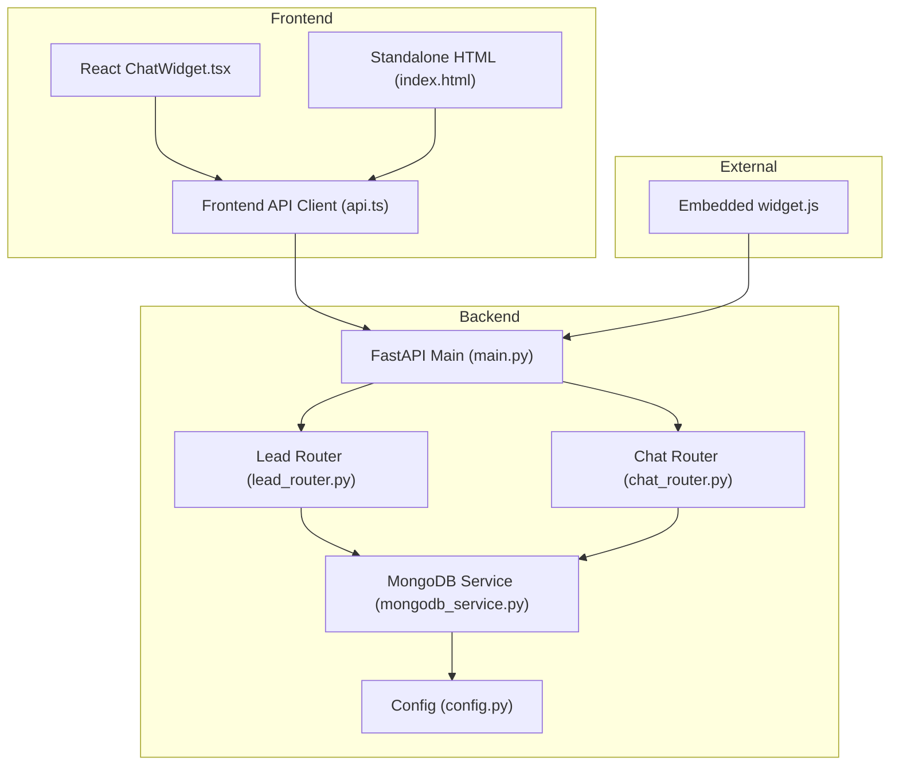
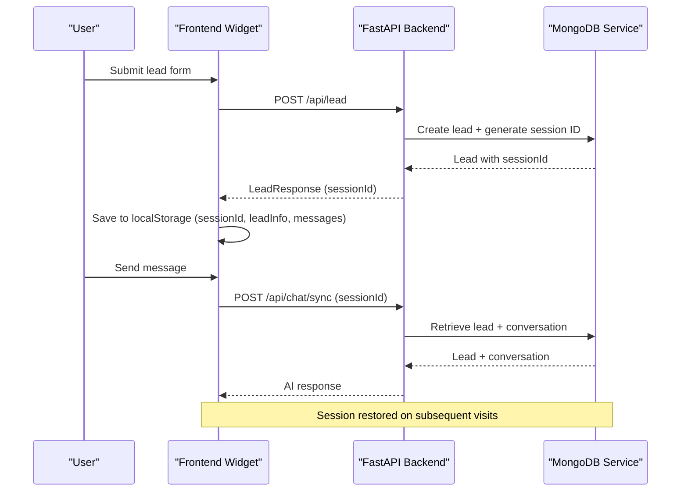
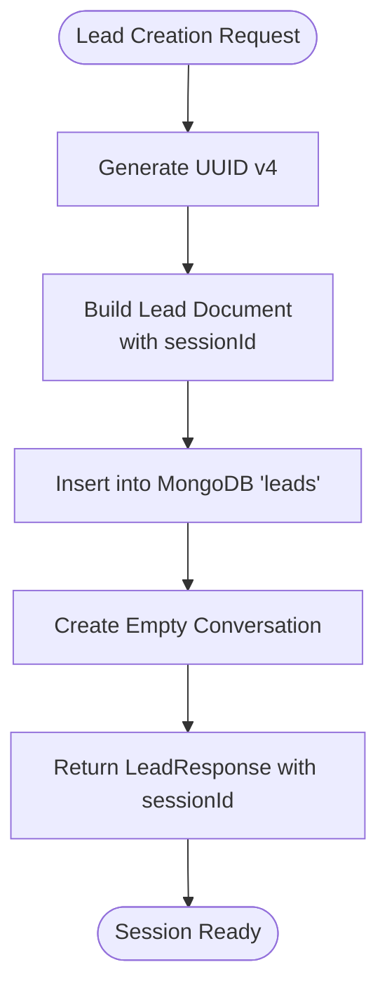
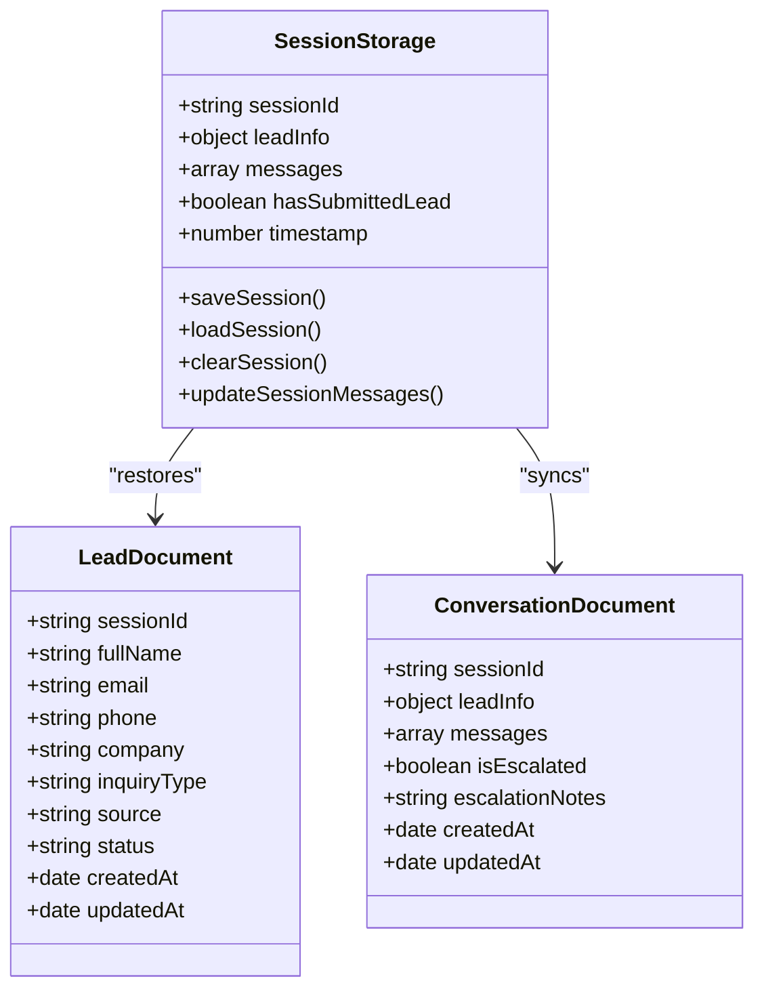
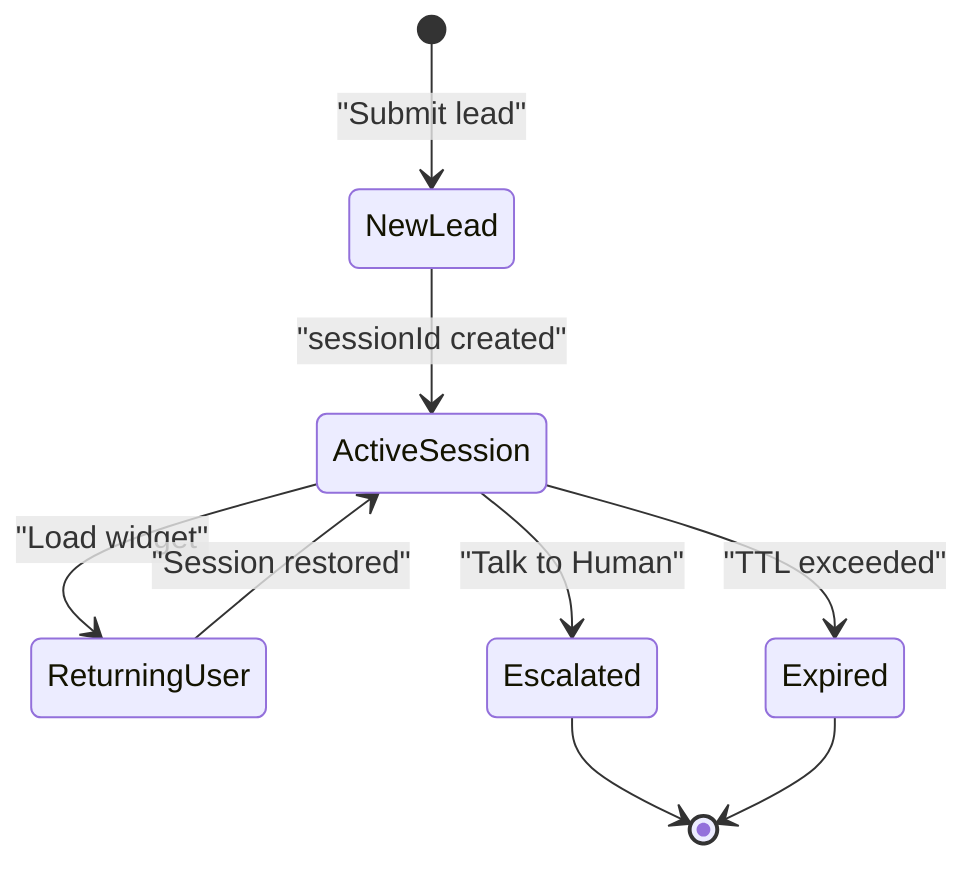
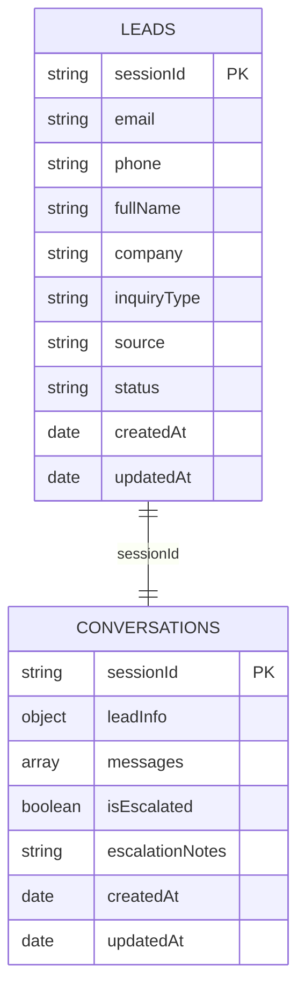
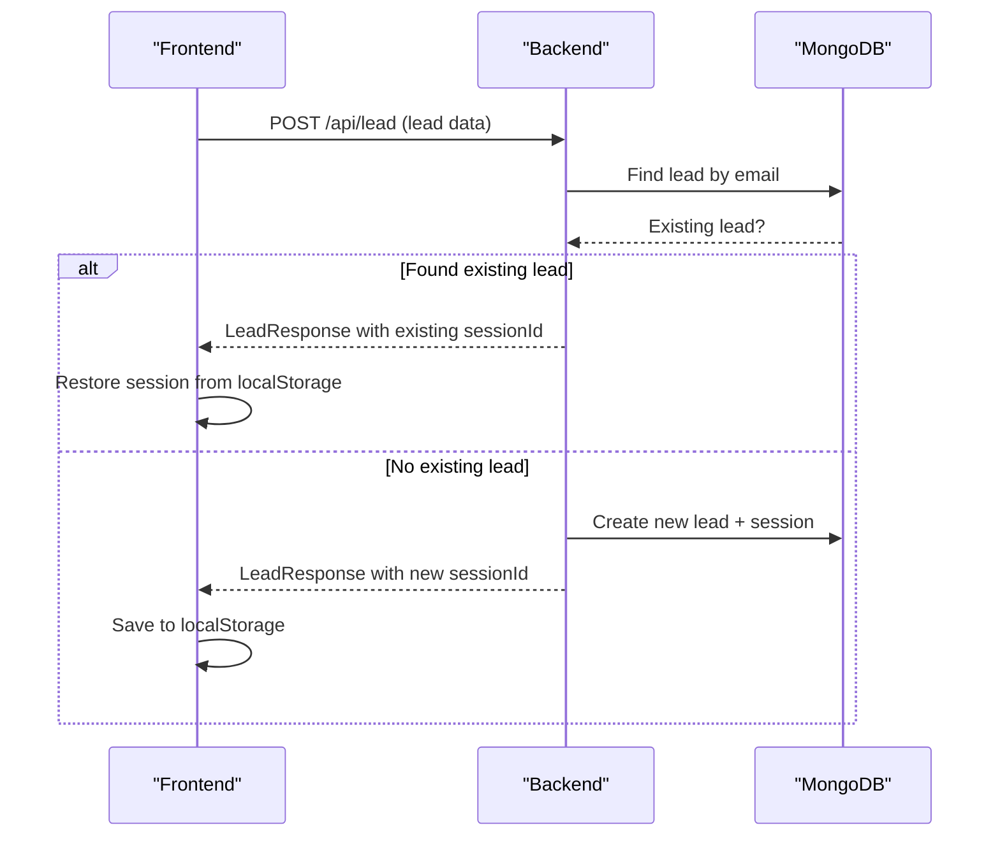
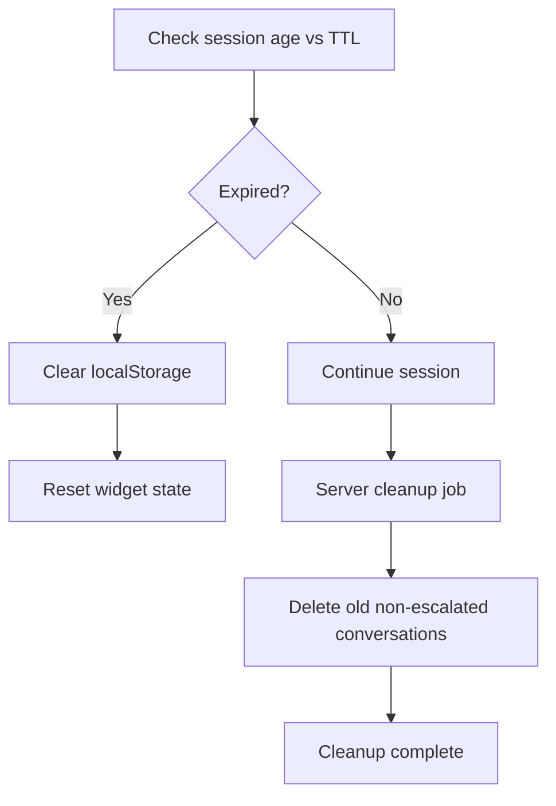
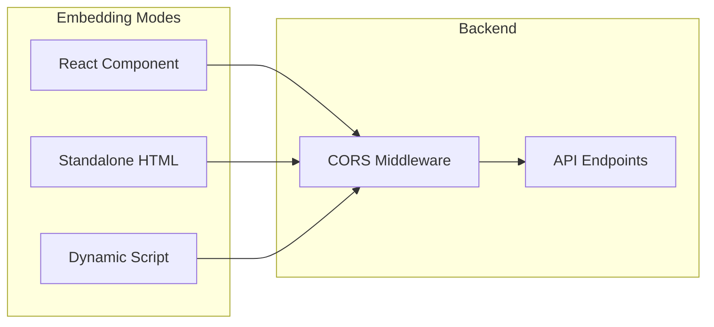
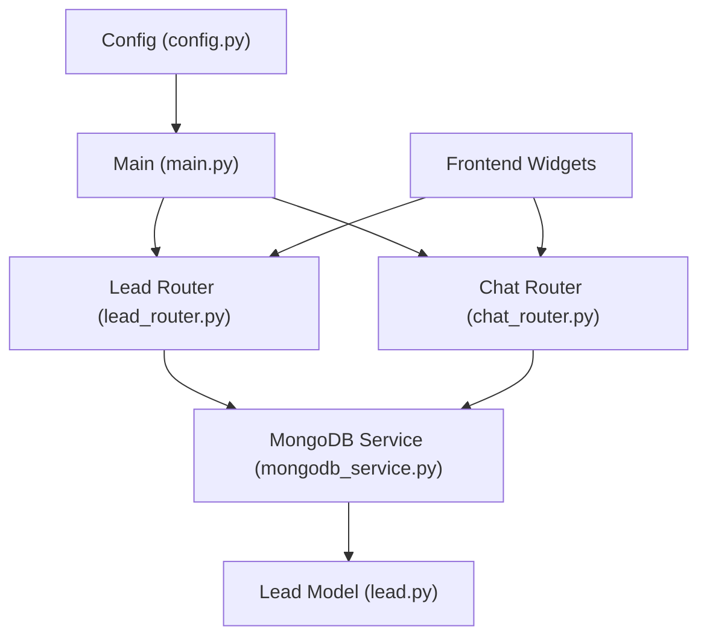

# Session Management

<cite>
**Referenced Files in This Document**
- [mongodb_service.py](file://backend/app/services/mongodb_service.py)
- [lead_router.py](file://backend/app/routers/lead_router.py)
- [chat_router.py](file://backend/app/routers/chat_router.py)
- [config.py](file://backend/app/config.py)
- [main.py](file://backend/app/main.py)
- [lead.py](file://backend/app/models/lead.py)
- [widget.js](file://widget.js)
- [index.html](file://index.html)
- [ChatWidget.tsx](file://frontend/components/chat/ChatWidget.tsx)
- [api.ts](file://frontend/lib/api.ts)
- [route.ts](file://frontend/app/api/widget.js/route.ts)
</cite>

## Table of Contents
1. [Introduction](#introduction)
2. [Project Structure](#project-structure)
3. [Core Components](#core-components)
4. [Architecture Overview](#architecture-overview)
5. [Detailed Component Analysis](#detailed-component-analysis)
6. [Dependency Analysis](#dependency-analysis)
7. [Performance Considerations](#performance-considerations)
8. [Troubleshooting Guide](#troubleshooting-guide)
9. [Conclusion](#conclusion)

## Introduction
This document provides comprehensive coverage of session management within the lead capture system. It explains how session IDs are generated, how sessions persist locally and in MongoDB, and how the system handles session restoration for returning customers. It also documents session expiration handling, cleanup procedures, and cross-domain session handling for embedded widgets.

## Project Structure
The session management spans three distinct environments:
- Frontend React widget (Next.js) with local storage persistence
- Standalone HTML widget with local storage persistence
- Backend FastAPI service with MongoDB for persistent storage

**Diagram sources**
- [main.py:39-85](file://backend/app/main.py#L39-L85)
- [lead_router.py:11-56](file://backend/app/routers/lead_router.py#L11-L56)
- [chat_router.py:12-129](file://backend/app/routers/chat_router.py#L12-L129)
- [mongodb_service.py:13-48](file://backend/app/services/mongodb_service.py#L13-L48)
- [config.py:7-64](file://backend/app/config.py#L7-L64)
- [widget.js:14-27](file://widget.js#L14-L27)
- [index.html:625-627](file://index.html#L625-L627)

**Section sources**
- [main.py:39-85](file://backend/app/main.py#L39-L85)
- [lead_router.py:11-56](file://backend/app/routers/lead_router.py#L11-L56)
- [chat_router.py:12-129](file://backend/app/routers/chat_router.py#L12-L129)
- [mongodb_service.py:13-48](file://backend/app/services/mongodb_service.py#L13-L48)
- [config.py:7-64](file://backend/app/config.py#L7-L64)
- [widget.js:14-27](file://widget.js#L14-L27)
- [index.html:625-627](file://index.html#L625-L627)

## Core Components
- Session ID Generation: UUID-based identifiers created during lead creation
- Local Storage Persistence: Client-side session storage with TTL-based expiration
- MongoDB Persistence: Server-side storage for leads and conversations
- Session Restoration: Returning customer detection via email and session restoration
- Session Expiration: Client-side TTL enforcement and server-side cleanup
- Cross-Domain Handling: CORS configuration for embedded widget scenarios

**Section sources**
- [mongodb_service.py:51-77](file://backend/app/services/mongodb_service.py#L51-L77)
- [lead_router.py:24-38](file://backend/app/routers/lead_router.py#L24-L38)
- [config.py:37-39](file://backend/app/config.py#L37-L39)
- [main.py:50-57](file://backend/app/main.py#L50-L57)

## Architecture Overview
The session lifecycle connects frontend widgets, backend APIs, and MongoDB storage:

**Diagram sources**
- [lead_router.py:11-44](file://backend/app/routers/lead_router.py#L11-L44)
- [mongodb_service.py:51-77](file://backend/app/services/mongodb_service.py#L51-L77)
- [chat_router.py:12-47](file://backend/app/routers/chat_router.py#L12-L47)
- [widget.js:613-641](file://widget.js#L613-L641)
- [ChatWidget.tsx:84-108](file://frontend/components/chat/ChatWidget.tsx#L84-L108)

## Detailed Component Analysis

### Session ID Generation Algorithm
- UUID Generation: The backend generates a unique session ID using a UUID library during lead creation
- Data Model: The session ID is stored alongside lead information in MongoDB
- Uniqueness: MongoDB enforces uniqueness on the session ID field to prevent collisions

**Diagram sources**
- [mongodb_service.py:51-77](file://backend/app/services/mongodb_service.py#L51-L77)
- [lead.py:46-56](file://backend/app/models/lead.py#L46-L56)

**Section sources**
- [mongodb_service.py:51-77](file://backend/app/services/mongodb_service.py#L51-L77)
- [lead.py:46-56](file://backend/app/models/lead.py#L46-L56)

### Session Persistence Strategies
- Client-Side (Local Storage):
  - Keys: Unique session key per widget type
  - Data: sessionId, leadInfo, messages, hasSubmittedLead, timestamp
  - TTL Enforcement: Age-based expiration checks
- Server-Side (MongoDB):
  - Collections: leads and conversations
  - Indexes: unique session ID, email, phone, timestamps
  - Documents: Lead records and conversation histories

**Diagram sources**
- [widget.js:47-122](file://widget.js#L47-L122)
- [index.html:640-708](file://index.html#L640-L708)
- [ChatWidget.tsx:63-77](file://frontend/components/chat/ChatWidget.tsx#L63-L77)
- [mongodb_service.py:98-111](file://backend/app/services/mongodb_service.py#L98-L111)

**Section sources**
- [widget.js:47-122](file://widget.js#L47-L122)
- [index.html:640-708](file://index.html#L640-L708)
- [ChatWidget.tsx:63-77](file://frontend/components/chat/ChatWidget.tsx#L63-L77)
- [mongodb_service.py:98-111](file://backend/app/services/mongodb_service.py#L98-L111)

### Session Lifecycle Management
- Creation: Lead submission triggers session ID creation and conversation initialization
- Restoration: On widget load, client checks local storage and restores if not expired
- Validation: Backend validates session existence for chat operations
- Escalation: Human handoff marks conversation as escalated
- Cleanup: Background job removes expired non-escalated conversations

**Diagram sources**
- [lead_router.py:11-44](file://backend/app/routers/lead_router.py#L11-L44)
- [chat_router.py:58-117](file://backend/app/routers/chat_router.py#L58-L117)
- [mongodb_service.py:182-192](file://backend/app/services/mongodb_service.py#L182-L192)

**Section sources**
- [lead_router.py:11-44](file://backend/app/routers/lead_router.py#L11-L44)
- [chat_router.py:58-117](file://backend/app/routers/chat_router.py#L58-L117)
- [mongodb_service.py:182-192](file://backend/app/services/mongodb_service.py#L182-L192)

### MongoDB Integration for Session Storage
- Collections and Fields:
  - Leads: sessionId (unique), email, phone, fullName, createdAt, updatedAt
  - Conversations: sessionId (unique), messages, isEscalated, createdAt, updatedAt
- Indexes:
  - Unique: sessionId on both collections
  - Non-unique: email, phone, createdAt for efficient lookups
- Query Patterns:
  - Get lead by email (returning customer detection)
  - Get lead by sessionId (session validation)
  - Get conversation by sessionId (message retrieval)
  - Upsert conversation with push and set operations

**Diagram sources**
- [mongodb_service.py:36-48](file://backend/app/services/mongodb_service.py#L36-L48)
- [mongodb_service.py:79-85](file://backend/app/services/mongodb_service.py#L79-L85)
- [mongodb_service.py:113-115](file://backend/app/services/mongodb_service.py#L113-L115)

**Section sources**
- [mongodb_service.py:36-48](file://backend/app/services/mongodb_service.py#L36-L48)
- [mongodb_service.py:79-85](file://backend/app/services/mongodb_service.py#L79-L85)
- [mongodb_service.py:113-115](file://backend/app/services/mongodb_service.py#L113-L115)

### Session Restoration Logic for Returning Customers
- Email-Based Detection: Backend checks for existing leads by email
- Session Reuse: If found, returns existing sessionId instead of creating a new one
- Client Restoration: Frontend loads session from local storage if present and unexpired
- Seamless Experience: Returning users continue conversations without re-submission

**Diagram sources**
- [lead_router.py:24-38](file://backend/app/routers/lead_router.py#L24-L38)
- [mongodb_service.py:83-85](file://backend/app/services/mongodb_service.py#L83-L85)
- [widget.js:66-93](file://widget.js#L66-L93)

**Section sources**
- [lead_router.py:24-38](file://backend/app/routers/lead_router.py#L24-L38)
- [mongodb_service.py:83-85](file://backend/app/services/mongodb_service.py#L83-L85)
- [widget.js:66-93](file://widget.js#L66-L93)

### Session Expiration Handling and Cleanup Procedures
- Client-Side TTL: Sessions expire after configured hours (default 24)
- Server-Side Cleanup: Background job removes expired non-escalated conversations
- Graceful Degradation: Expired sessions trigger cleanup and reset
- Configuration: TTL controlled via application settings

**Diagram sources**
- [config.py:37-39](file://backend/app/config.py#L37-L39)
- [mongodb_service.py:182-192](file://backend/app/services/mongodb_service.py#L182-L192)
- [widget.js:74-79](file://widget.js#L74-L79)

**Section sources**
- [config.py:37-39](file://backend/app/config.py#L37-L39)
- [mongodb_service.py:182-192](file://backend/app/services/mongodb_service.py#L182-L192)
- [widget.js:74-79](file://widget.js#L74-L79)

### Session Data Structures and Retrieval Queries
- Lead Data Structure:
  - Required: sessionId, fullName, email, phone, source, status
  - Optional: company, inquiryType, timestamps
- Conversation Data Structure:
  - Required: sessionId, leadInfo, messages array
  - Flags: isEscalated, escalationNotes
  - Timestamps: createdAt, updatedAt
- Retrieval Patterns:
  - Single lead by sessionId
  - Single conversation by sessionId
  - Lead by email for returning customer detection

**Section sources**
- [lead.py:46-64](file://backend/app/models/lead.py#L46-L64)
- [mongodb_service.py:98-111](file://backend/app/services/mongodb_service.py#L98-L111)
- [mongodb_service.py:79-85](file://backend/app/services/mongodb_service.py#L79-L85)

### Relationship Between Leads and Sessions
- One-to-One Mapping: Each lead corresponds to exactly one session
- Session as Identifier: sessionId serves as the primary key linking leads and conversations
- Conversation Initialization: Every new lead automatically creates an associated empty conversation
- Status Tracking: Lead status updates when conversations are escalated

**Section sources**
- [mongodb_service.py:51-77](file://backend/app/services/mongodb_service.py#L51-L77)
- [mongodb_service.py:98-111](file://backend/app/services/mongodb_service.py#L98-L111)
- [mongodb_service.py:161-180](file://backend/app/services/mongodb_service.py#L161-L180)

### Session Timeout Configurations
- Frontend TTL: 24 hours (configurable via configuration constants)
- Backend TTL: Controlled by application settings
- Cleanup Interval: Server-side cleanup runs periodically to remove expired sessions
- Configuration Access: Settings loaded from environment variables

**Section sources**
- [config.py:37-39](file://backend/app/config.py#L37-L39)
- [main.py:14-36](file://backend/app/main.py#L14-L36)

### Cross-Domain Session Handling for Embedded Widgets
- CORS Configuration: Backend enables cross-origin requests with credentials
- Widget Embedding: Three embedding modes:
  - React Next.js component
  - Standalone HTML page
  - Dynamic script injection
- Session Consistency: All modes use the same session key and TTL logic
- Security: CORS allows configured origins while maintaining session isolation

**Diagram sources**
- [main.py:50-57](file://backend/app/main.py#L50-L57)
- [widget.js:14-27](file://widget.js#L14-L27)
- [index.html:625-627](file://index.html#L625-L627)

**Section sources**
- [main.py:50-57](file://backend/app/main.py#L50-L57)
- [widget.js:14-27](file://widget.js#L14-L27)
- [index.html:625-627](file://index.html#L625-L627)

## Dependency Analysis
The session management system exhibits clear separation of concerns:

**Diagram sources**
- [config.py:7-64](file://backend/app/config.py#L7-L64)
- [main.py:39-85](file://backend/app/main.py#L39-L85)
- [lead_router.py:11-56](file://backend/app/routers/lead_router.py#L11-L56)
- [chat_router.py:12-129](file://backend/app/routers/chat_router.py#L12-L129)
- [mongodb_service.py:13-48](file://backend/app/services/mongodb_service.py#L13-L48)
- [lead.py:18-64](file://backend/app/models/lead.py#L18-L64)

**Section sources**
- [config.py:7-64](file://backend/app/config.py#L7-L64)
- [main.py:39-85](file://backend/app/main.py#L39-L85)
- [lead_router.py:11-56](file://backend/app/routers/lead_router.py#L11-L56)
- [chat_router.py:12-129](file://backend/app/routers/chat_router.py#L12-L129)
- [mongodb_service.py:13-48](file://backend/app/services/mongodb_service.py#L13-L48)
- [lead.py:18-64](file://backend/app/models/lead.py#L18-L64)

## Performance Considerations
- Index Optimization: Unique indexes on sessionId and email reduce query times
- TTL Strategy: Client-side TTL prevents unnecessary server requests for expired sessions
- Message Limits: Conversation history limits reduce payload sizes
- Cleanup Efficiency: Server-side cleanup prevents database bloat

## Troubleshooting Guide
- Session Not Restoring:
  - Verify localStorage contains session data
  - Check TTL configuration and elapsed time
  - Confirm sessionId validity in MongoDB
- Session Lost After Refresh:
  - Ensure localStorage persistence is enabled
  - Verify cross-domain cookie/CORS settings
  - Check for browser storage quotas
- MongoDB Session Issues:
  - Validate sessionId uniqueness constraint
  - Check for index creation on startup
  - Monitor cleanup job execution

**Section sources**
- [mongodb_service.py:36-48](file://backend/app/services/mongodb_service.py#L36-L48)
- [widget.js:66-93](file://widget.js#L66-L93)
- [main.py:50-57](file://backend/app/main.py#L50-L57)

## Conclusion
The session management system provides a robust foundation for lead capture and conversation continuity. It balances client-side convenience with server-side reliability, supports returning customers seamlessly, and maintains security through proper CORS configuration. The modular design enables easy extension for additional features while maintaining clear separation between frontend and backend responsibilities.