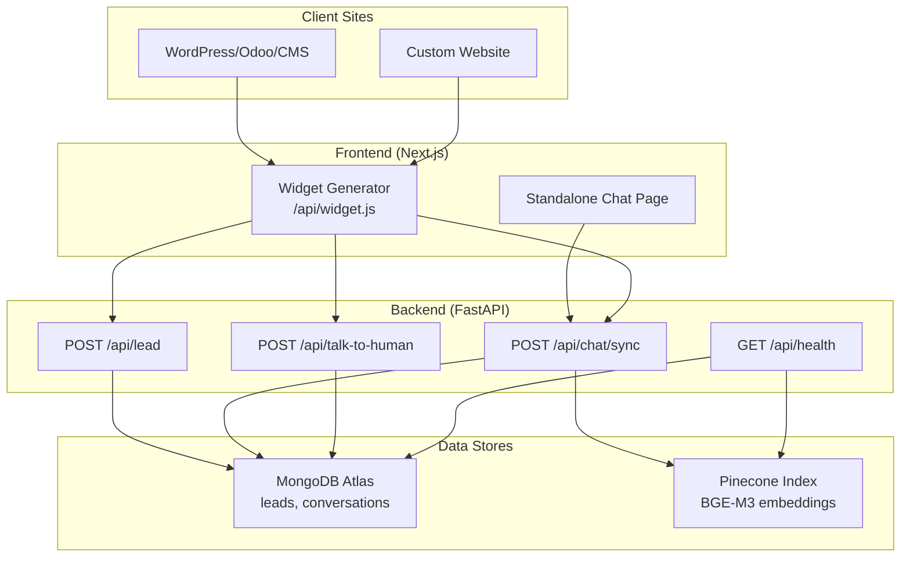
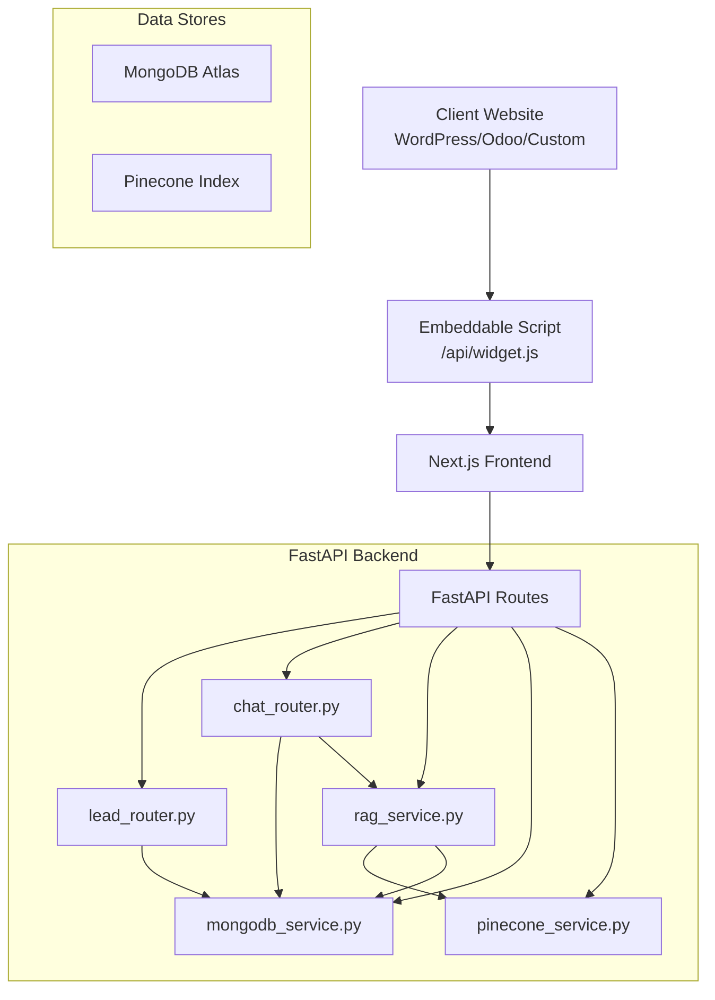
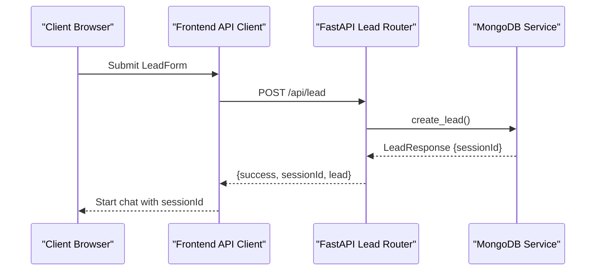
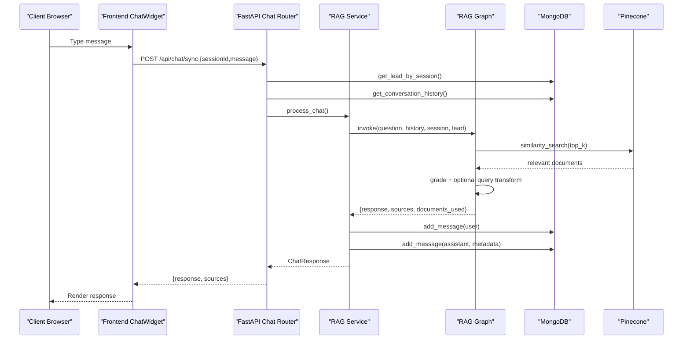
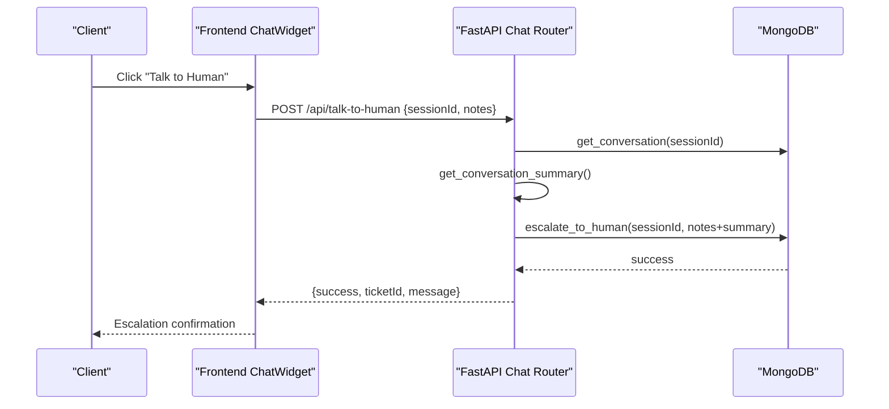
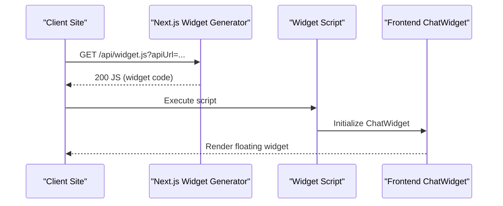
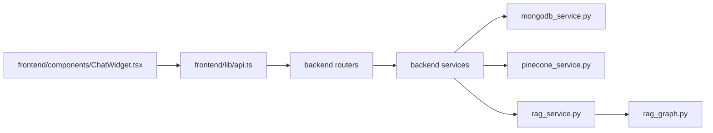

# Project Overview

<cite>
**Referenced Files in This Document**
- [README.md](file://README.md)
- [backend/app/main.py](file://backend/app/main.py)
- [backend/app/config.py](file://backend/app/config.py)
- [backend/app/routers/lead_router.py](file://backend/app/routers/lead_router.py)
- [backend/app/routers/chat_router.py](file://backend/app/routers/chat_router.py)
- [backend/app/services/mongodb_service.py](file://backend/app/services/mongodb_service.py)
- [backend/app/services/pinecone_service.py](file://backend/app/services/pinecone_service.py)
- [backend/app/graph/rag_graph.py](file://backend/app/graph/rag_graph.py)
- [backend/app/services/rag_service.py](file://backend/app/services/rag_service.py)
- [backend/app/models/lead.py](file://backend/app/models/lead.py)
- [frontend/components/chat/ChatWidget.tsx](file://frontend/components/chat/ChatWidget.tsx)
- [frontend/components/chat/LeadForm.tsx](file://frontend/components/chat/LeadForm.tsx)
- [frontend/lib/api.ts](file://frontend/lib/api.ts)
- [frontend/app/chat/page.tsx](file://frontend/app/chat/page.tsx)
- [frontend/app/api/widget.js/route.ts](file://frontend/app/api/widget.js/route.ts)
- [widget.js](file://widget.js)
</cite>

## Table of Contents
1. [Introduction](#introduction)
2. [Project Structure](#project-structure)
3. [Core Components](#core-components)
4. [Architecture Overview](#architecture-overview)
5. [Detailed Component Analysis](#detailed-component-analysis)
6. [Dependency Analysis](#dependency-analysis)
7. [Performance Considerations](#performance-considerations)
8. [Troubleshooting Guide](#troubleshooting-guide)
9. [Conclusion](#conclusion)

## Introduction
Hitech RAG Chatbot is a production-ready Retrieval-Augmented Generation (RAG) chatbot designed for Hitech Steel Industries. Its purpose is to deliver intelligent, contextual customer assistance powered by an internal knowledge base, while capturing qualified leads and enabling seamless human escalation when needed. The system supports embeddable widgets for easy integration across diverse client websites and platforms, and maintains conversation memory to improve user experience.

Key value propositions:
- Intelligent automation: Answers product, pricing, technical support, and partnership questions using RAG with a curated knowledge base.
- Lead generation: Captures visitor information to qualify and personalize interactions.
- Human escalation: Provides a “Talk to Human” capability with automatic conversation summaries for smooth handoffs.
- Embeddable widget: Supports both standalone Next.js pages and embeddable scripts for WordPress, Odoo, and custom websites.
- Industrial focus: Tailored prompts and validations for the steel manufacturing domain and Saudi Arabia market.

Target use cases:
- Customer service on corporate websites and marketing landing pages.
- Lead qualification and nurturing across sales and marketing channels.
- Technical support for product specifications and applications in construction and infrastructure sectors.
- Internal knowledge sharing and quick access to policies and procedures.

## Project Structure
The project follows a clear separation of concerns:
- Frontend (Next.js): Provides a standalone chat page and a widget generator endpoint for embeddable integration.
- Backend (FastAPI): Exposes REST endpoints for lead capture, chat, escalation, and ingestion; orchestrates RAG and persistence.
- Data stores: MongoDB Atlas for leads and conversations; Pinecone for vectorized knowledge base.

**Diagram sources**
- [README.md:8-43](file://README.md#L8-L43)
- [backend/app/main.py:39-85](file://backend/app/main.py#L39-L85)
- [frontend/app/api/widget.js/route.ts:3-346](file://frontend/app/api/widget.js/route.ts#L3-L346)

**Section sources**
- [README.md:64-99](file://README.md#L64-L99)
- [README.md:166-178](file://README.md#L166-L178)

## Core Components
- Lead capture and session management:
  - Lead form collects name, email, phone, company, and inquiry type; validates Saudi phone numbers; creates a session ID and initializes conversation storage.
- Conversation memory:
  - Maintains the last N messages in context for each session to keep responses coherent.
- RAG pipeline:
  - Retrieves relevant documents from Pinecone, grades relevance, optionally transforms queries, and generates contextual answers using a multilingual LLM.
- Human escalation:
  - Marks conversations as escalated, stores notes, and returns a ticket-like identifier for follow-up.
- Embeddable widget:
  - Two implementations: a Next.js component for standalone pages and a dynamic script generator for third-party sites.

Practical examples in industrial steel manufacturing:
- “What are the tensile strength specs for Q345 steel plates?” → RAG retrieves technical documents and responds with precise ranges.
- “Can you provide pricing for 20mm thick beams?” → Responds with general guidance or escalates to sales for a quote.
- “How do I apply for a partnership with Hitech?” → Guides through the process and captures lead information.

**Section sources**
- [backend/app/routers/lead_router.py:11-57](file://backend/app/routers/lead_router.py#L11-L57)
- [backend/app/routers/chat_router.py:12-130](file://backend/app/routers/chat_router.py#L12-L130)
- [backend/app/services/rag_service.py:19-107](file://backend/app/services/rag_service.py#L19-L107)
- [frontend/components/chat/ChatWidget.tsx:84-170](file://frontend/components/chat/ChatWidget.tsx#L84-L170)
- [README.md:191-201](file://README.md#L191-L201)

## Architecture Overview
The system integrates client websites with a Next.js frontend and a FastAPI backend, backed by MongoDB and Pinecone. The RAG pipeline leverages Google Gemini with BGE-M3 embeddings to provide accurate, context-aware responses.

**Diagram sources**
- [backend/app/main.py:39-85](file://backend/app/main.py#L39-L85)
- [backend/app/routers/lead_router.py:8-57](file://backend/app/routers/lead_router.py#L8-L57)
- [backend/app/routers/chat_router.py:9-130](file://backend/app/routers/chat_router.py#L9-L130)
- [backend/app/services/rag_service.py:11-18](file://backend/app/services/rag_service.py#L11-L18)
- [backend/app/services/mongodb_service.py:13-202](file://backend/app/services/mongodb_service.py#L13-L202)
- [backend/app/services/pinecone_service.py:10-186](file://backend/app/services/pinecone_service.py#L10-L186)

## Detailed Component Analysis

### Lead Capture and Session Lifecycle
- Frontend:
  - LeadForm validates inputs and submits to backend; upon success, a session ID is stored locally and used for subsequent chat interactions.
- Backend:
  - Lead router creates a unique session ID, persists lead data, and initializes an empty conversation record.
  - MongoDB service manages indexes and CRUD operations for leads and conversations.

**Diagram sources**
- [frontend/components/chat/LeadForm.tsx:39-42](file://frontend/components/chat/LeadForm.tsx#L39-L42)
- [frontend/lib/api.ts:61-64](file://frontend/lib/api.ts#L61-L64)
- [backend/app/routers/lead_router.py:11-39](file://backend/app/routers/lead_router.py#L11-L39)
- [backend/app/services/mongodb_service.py:51-77](file://backend/app/services/mongodb_service.py#L51-L77)

**Section sources**
- [frontend/components/chat/LeadForm.tsx:13-19](file://frontend/components/chat/LeadForm.tsx#L13-L19)
- [frontend/lib/api.ts:14-27](file://frontend/lib/api.ts#L14-L27)
- [backend/app/routers/lead_router.py:24-39](file://backend/app/routers/lead_router.py#L24-L39)
- [backend/app/services/mongodb_service.py:51-77](file://backend/app/services/mongodb_service.py#L51-L77)
- [backend/app/models/lead.py:18-56](file://backend/app/models/lead.py#L18-L56)

### Chat and RAG Pipeline
- Frontend:
  - ChatWidget manages session persistence, renders messages, and sends/receives messages via API.
- Backend:
  - Chat router validates session, checks escalation status, and delegates to RAG service.
  - RAG service retrieves conversation history, invokes the LangGraph pipeline, stores messages, and formats sources.
  - RAG graph performs retrieval, document grading, optional query transformation, and response generation using a system prompt tailored for Hitech Steel Industries.

**Diagram sources**
- [frontend/components/chat/ChatWidget.tsx:110-142](file://frontend/components/chat/ChatWidget.tsx#L110-L142)
- [frontend/lib/api.ts:66-72](file://frontend/lib/api.ts#L66-L72)
- [backend/app/routers/chat_router.py:12-56](file://backend/app/routers/chat_router.py#L12-L56)
- [backend/app/services/rag_service.py:19-87](file://backend/app/services/rag_service.py#L19-L87)
- [backend/app/graph/rag_graph.py:221-251](file://backend/app/graph/rag_graph.py#L221-L251)
- [backend/app/services/pinecone_service.py:108-154](file://backend/app/services/pinecone_service.py#L108-L154)
- [backend/app/services/mongodb_service.py:117-145](file://backend/app/services/mongodb_service.py#L117-L145)

**Section sources**
- [backend/app/routers/chat_router.py:12-56](file://backend/app/routers/chat_router.py#L12-L56)
- [backend/app/services/rag_service.py:19-87](file://backend/app/services/rag_service.py#L19-L87)
- [backend/app/graph/rag_graph.py:26-264](file://backend/app/graph/rag_graph.py#L26-L264)
- [backend/app/services/pinecone_service.py:108-154](file://backend/app/services/pinecone_service.py#L108-L154)
- [backend/app/services/mongodb_service.py:117-145](file://backend/app/services/mongodb_service.py#L117-L145)

### Human Escalation Workflow
- Frontend:
  - ChatWidget provides a “Talk to Human” action that triggers escalation after confirmation.
- Backend:
  - Chat router validates session, computes a conversation summary, marks the conversation as escalated, and returns a ticket-like identifier.

**Diagram sources**
- [frontend/components/chat/ChatWidget.tsx:144-170](file://frontend/components/chat/ChatWidget.tsx#L144-L170)
- [frontend/lib/api.ts:74-80](file://frontend/lib/api.ts#L74-L80)
- [backend/app/routers/chat_router.py:58-118](file://backend/app/routers/chat_router.py#L58-L118)
- [backend/app/services/rag_service.py:89-106](file://backend/app/services/rag_service.py#L89-L106)
- [backend/app/services/mongodb_service.py:161-180](file://backend/app/services/mongodb_service.py#L161-L180)

**Section sources**
- [frontend/components/chat/ChatWidget.tsx:144-170](file://frontend/components/chat/ChatWidget.tsx#L144-L170)
- [backend/app/routers/chat_router.py:58-118](file://backend/app/routers/chat_router.py#L58-L118)
- [backend/app/services/rag_service.py:89-106](file://backend/app/services/rag_service.py#L89-L106)
- [backend/app/services/mongodb_service.py:161-180](file://backend/app/services/mongodb_service.py#L161-L180)

### Embeddable Widget Support
- Next.js standalone page:
  - The chat page embeds the ChatWidget component in an embedded mode for full-page use.
- Widget generator:
  - The /api/widget.js endpoint dynamically serves a JavaScript widget tailored to the caller’s origin, configurable via query parameters (e.g., apiUrl, primaryColor, position).
- Legacy widget:
  - A separate static widget.js file provides an alternative embeddable implementation with similar capabilities.

**Diagram sources**
- [frontend/app/chat/page.tsx:3-11](file://frontend/app/chat/page.tsx#L3-L11)
- [frontend/app/api/widget.js/route.ts:3-346](file://frontend/app/api/widget.js/route.ts#L3-L346)
- [widget.js:1-895](file://widget.js#L1-L895)

**Section sources**
- [frontend/app/chat/page.tsx:3-11](file://frontend/app/chat/page.tsx#L3-L11)
- [frontend/app/api/widget.js/route.ts:3-346](file://frontend/app/api/widget.js/route.ts#L3-L346)
- [widget.js:1-895](file://widget.js#L1-L895)

## Dependency Analysis
High-level dependencies:
- Frontend depends on backend APIs for lead capture, chat, and escalation.
- Backend depends on MongoDB for persistence and Pinecone for vector search.
- RAG pipeline depends on Google Gemini for generation and BGE-M3 embeddings.

**Diagram sources**
- [frontend/lib/api.ts:60-90](file://frontend/lib/api.ts#L60-L90)
- [frontend/components/chat/ChatWidget.tsx:10](file://frontend/components/chat/ChatWidget.tsx#L10)
- [backend/app/routers/lead_router.py:6-7](file://backend/app/routers/lead_router.py#L6-L7)
- [backend/app/routers/chat_router.py:6-7](file://backend/app/routers/chat_router.py#L6-L7)
- [backend/app/services/rag_service.py:7-8](file://backend/app/services/rag_service.py#L7-L8)
- [backend/app/services/mongodb_service.py:5-10](file://backend/app/services/mongodb_service.py#L5-L10)
- [backend/app/services/pinecone_service.py:4-7](file://backend/app/services/pinecone_service.py#L4-L7)
- [backend/app/graph/rag_graph.py:8-12](file://backend/app/graph/rag_graph.py#L8-L12)

**Section sources**
- [backend/app/main.py:11-11](file://backend/app/main.py#L11)
- [backend/app/config.py:7-64](file://backend/app/config.py#L7-L64)

## Performance Considerations
- Vector search tuning:
  - Adjust top_k and similarity_threshold to balance recall and latency.
  - Use chunk size and overlap appropriate for the knowledge base density.
- Caching and initialization:
  - Embedding model and Pinecone client are initialized once at startup; ensure adequate warm-up on cold starts.
- Conversation history:
  - Limit the number of historical messages included in context to reduce prompt length and cost.
- Frontend responsiveness:
  - Debounce input events and avoid frequent re-renders during long typing indicators.
- Scalability:
  - Use CDN for widget delivery and consider regional deployments for latency.
  - Monitor Pinecone index statistics and adjust dimensions/specs as needed.

[No sources needed since this section provides general guidance]

## Troubleshooting Guide
Common issues and resolutions:
- Session not found:
  - Ensure the lead form is submitted first; the session ID must be present before sending chat messages.
- Escalation failures:
  - Verify the session exists and that MongoDB updates succeed; check conversation summary computation.
- RAG retrieval quality:
  - Confirm Pinecone index exists and is populated; verify embedding dimension matches the model.
- CORS errors:
  - Validate CORS origins configuration in backend settings and ensure frontend requests originate from allowed domains.
- Widget not appearing:
  - Confirm the widget script loads and that localStorage is accessible; check browser console for errors.

**Section sources**
- [backend/app/routers/chat_router.py:28-43](file://backend/app/routers/chat_router.py#L28-L43)
- [backend/app/routers/chat_router.py:72-94](file://backend/app/routers/chat_router.py#L72-L94)
- [backend/app/services/pinecone_service.py:27-55](file://backend/app/services/pinecone_service.py#L27-L55)
- [backend/app/config.py:46-58](file://backend/app/config.py#L46-L58)
- [frontend/app/api/widget.js/route.ts:332-336](file://frontend/app/api/widget.js/route.ts#L332-L336)

## Conclusion
Hitech RAG Chatbot delivers a robust, production-grade solution for intelligent customer engagement in the steel industry. It combines validated lead capture, persistent conversation memory, and a powerful RAG pipeline with human escalation, all packaged for easy integration via embeddable widgets. The architecture balances scalability, maintainability, and performance, making it suitable for enterprise deployment across diverse client environments.

[No sources needed since this section summarizes without analyzing specific files]