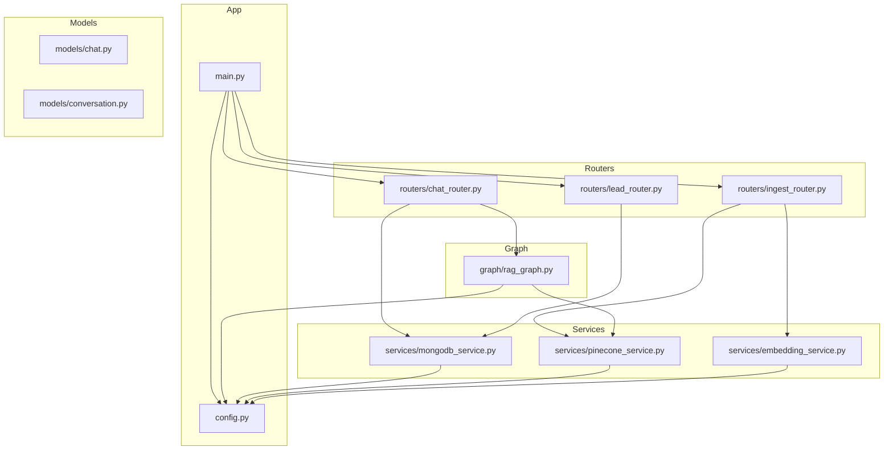
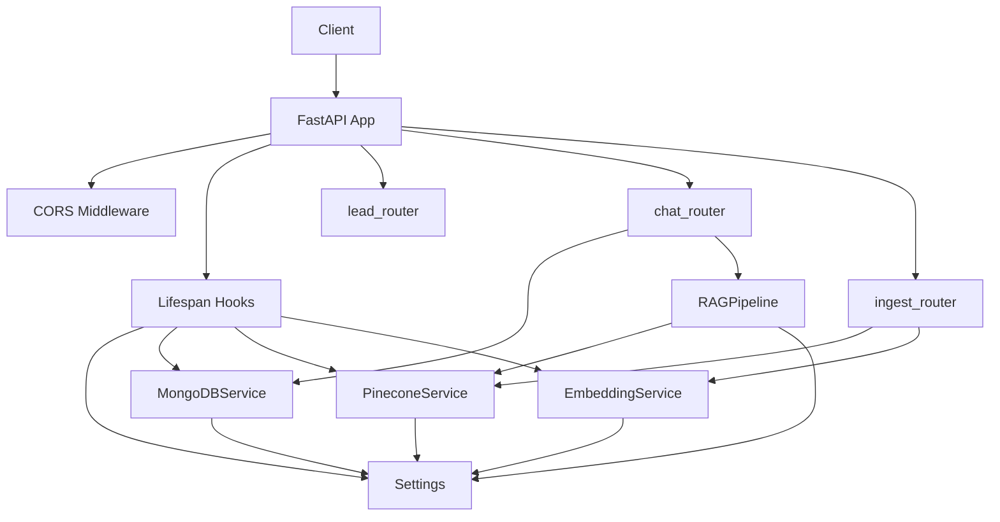
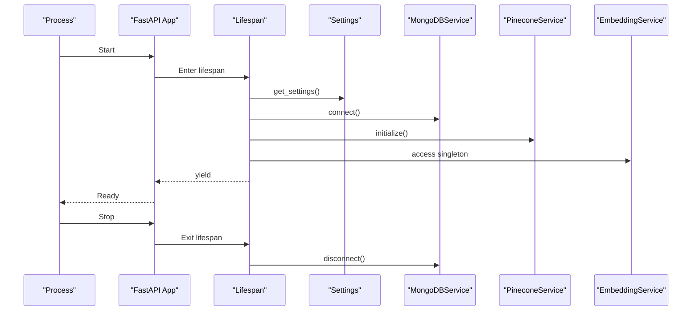
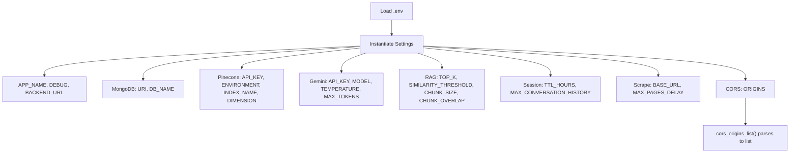
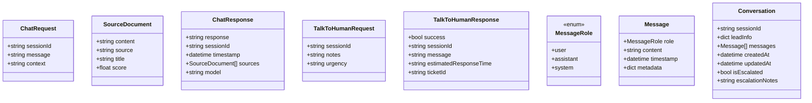
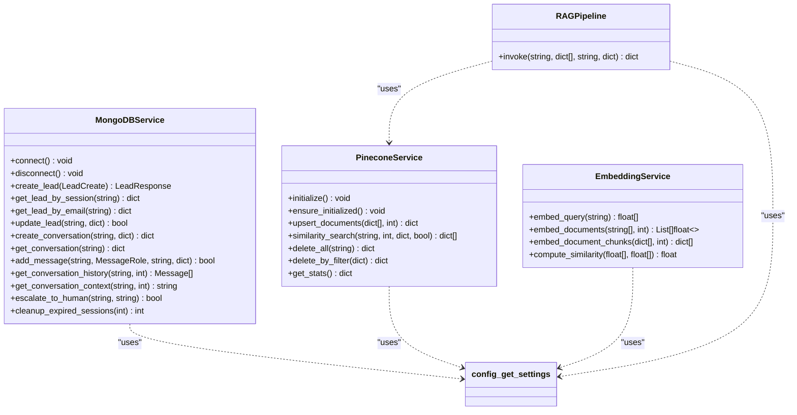
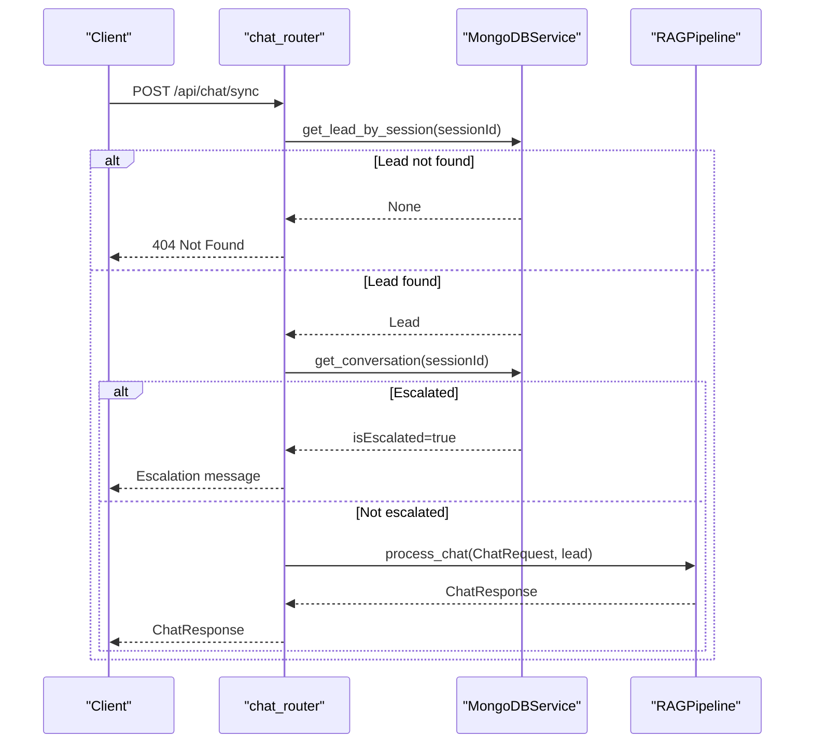
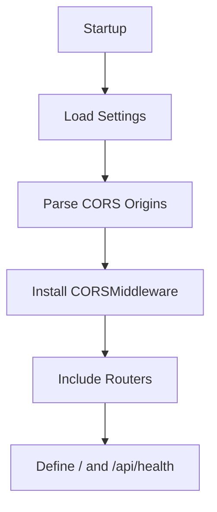
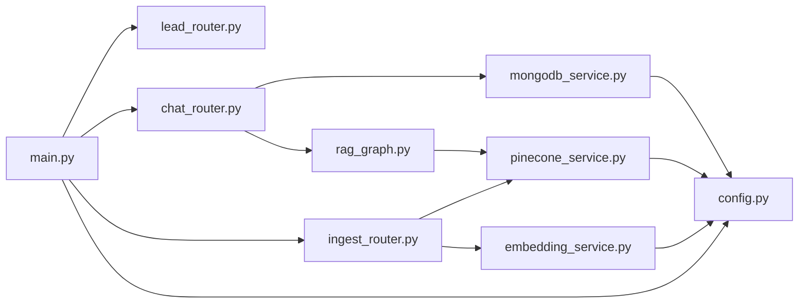

# Backend Architecture

<cite>
**Referenced Files in This Document**
- [main.py](file://backend/app/main.py)
- [config.py](file://backend/app/config.py)
- [rag_graph.py](file://backend/app/graph/rag_graph.py)
- [mongodb_service.py](file://backend/app/services/mongodb_service.py)
- [pinecone_service.py](file://backend/app/services/pinecone_service.py)
- [embedding_service.py](file://backend/app/services/embedding_service.py)
- [chat_router.py](file://backend/app/routers/chat_router.py)
- [ingest_router.py](file://backend/app/routers/ingest_router.py)
- [lead_router.py](file://backend/app/routers/lead_router.py)
- [chat.py](file://backend/app/models/chat.py)
- [conversation.py](file://backend/app/models/conversation.py)
</cite>

## Table of Contents
1. [Introduction](#introduction)
2. [Project Structure](#project-structure)
3. [Core Components](#core-components)
4. [Architecture Overview](#architecture-overview)
5. [Detailed Component Analysis](#detailed-component-analysis)
6. [Dependency Analysis](#dependency-analysis)
7. [Performance Considerations](#performance-considerations)
8. [Troubleshooting Guide](#troubleshooting-guide)
9. [Conclusion](#conclusion)
10. [Appendices](#appendices)

## Introduction
This document describes the FastAPI backend architecture for the Hitech RAG Chatbot. It covers application initialization, dependency injection patterns, router organization, clean architecture separation between models, services, and routers, configuration management, API endpoint organization, request/response handling, error management, lifespan management for database and external services, CORS configuration, health checks, and deployment considerations. The backend integrates MongoDB for session and conversation persistence, Pinecone for vector storage, and a LangGraph-based RAG pipeline powered by Google Gemini.

## Project Structure
The backend follows a layered architecture:
- app/main.py: Application factory and lifecycle management
- app/config.py: Centralized settings and environment variable handling
- app/models/: Pydantic models for requests/responses
- app/services/: Business logic services (MongoDB, Pinecone, Embeddings, RAG orchestration)
- app/routers/: API endpoints grouped by domain
- app/graph/: RAG pipeline built with LangGraph

**Diagram sources**
- [main.py:1-90](file://backend/app/main.py#L1-L90)
- [config.py:1-65](file://backend/app/config.py#L1-L65)
- [rag_graph.py:1-264](file://backend/app/graph/rag_graph.py#L1-L264)
- [mongodb_service.py:1-202](file://backend/app/services/mongodb_service.py#L1-L202)
- [pinecone_service.py:1-186](file://backend/app/services/pinecone_service.py#L1-L186)
- [embedding_service.py:1-158](file://backend/app/services/embedding_service.py#L1-L158)
- [chat_router.py:1-130](file://backend/app/routers/chat_router.py#L1-L130)
- [ingest_router.py:1-112](file://backend/app/routers/ingest_router.py#L1-L112)
- [lead_router.py:1-57](file://backend/app/routers/lead_router.py#L1-L57)
- [chat.py:1-45](file://backend/app/models/chat.py#L1-L45)
- [conversation.py:1-53](file://backend/app/models/conversation.py#L1-L53)

**Section sources**
- [main.py:1-90](file://backend/app/main.py#L1-L90)
- [config.py:1-65](file://backend/app/config.py#L1-L65)

## Core Components
- Application factory and lifespan: The application is created with a lifespan manager that initializes MongoDB, Pinecone, and the embedding model during startup and performs cleanup on shutdown.
- Configuration: Centralized settings class loads environment variables from a .env file and exposes parsed CORS origins as a list.
- Services:
  - MongoDBService: Asynchronous operations for leads and conversations, including indexing, message management, and escalation.
  - PineconeService: Singleton vector store client with index creation, upsert, similarity search, and statistics.
  - EmbeddingService: Singleton BGE-M3 model loader with query/document embedding and similarity computation.
  - RAGPipeline: LangGraph workflow orchestrating retrieval, filtering, query transformation, and generation.
- Routers: Organized by domain with explicit tags and endpoints for leads, chat, and ingestion.

**Section sources**
- [main.py:14-85](file://backend/app/main.py#L14-L85)
- [config.py:7-64](file://backend/app/config.py#L7-L64)
- [mongodb_service.py:13-202](file://backend/app/services/mongodb_service.py#L13-L202)
- [pinecone_service.py:10-186](file://backend/app/services/pinecone_service.py#L10-L186)
- [embedding_service.py:10-158](file://backend/app/services/embedding_service.py#L10-L158)
- [rag_graph.py:26-264](file://backend/app/graph/rag_graph.py#L26-L264)
- [chat_router.py:1-130](file://backend/app/routers/chat_router.py#L1-L130)
- [ingest_router.py:1-112](file://backend/app/routers/ingest_router.py#L1-L112)
- [lead_router.py:1-57](file://backend/app/routers/lead_router.py#L1-L57)

## Architecture Overview
The system adheres to clean architecture:
- Models define request/response contracts.
- Services encapsulate business logic and external integrations.
- Routers expose endpoints and delegate to services.
- Lifespan manages startup/shutdown hooks for external services.

**Diagram sources**
- [main.py:39-85](file://backend/app/main.py#L39-L85)
- [config.py:7-64](file://backend/app/config.py#L7-L64)
- [mongodb_service.py:13-202](file://backend/app/services/mongodb_service.py#L13-L202)
- [pinecone_service.py:10-186](file://backend/app/services/pinecone_service.py#L10-L186)
- [embedding_service.py:10-158](file://backend/app/services/embedding_service.py#L10-L158)
- [rag_graph.py:26-264](file://backend/app/graph/rag_graph.py#L26-L264)
- [lead_router.py:1-57](file://backend/app/routers/lead_router.py#L1-L57)
- [chat_router.py:1-130](file://backend/app/routers/chat_router.py#L1-L130)
- [ingest_router.py:1-112](file://backend/app/routers/ingest_router.py#L1-L112)

## Detailed Component Analysis

### Application Initialization and Lifespan
- The application factory creates a FastAPI app with title, description, version, and lifespan.
- The lifespan manager:
  - Loads settings.
  - Connects to MongoDB.
  - Initializes Pinecone index.
  - Lazily loads the embedding model singleton.
  - On shutdown, disconnects MongoDB.

**Diagram sources**
- [main.py:14-37](file://backend/app/main.py#L14-L37)
- [config.py:61-64](file://backend/app/config.py#L61-L64)
- [mongodb_service.py:21-34](file://backend/app/services/mongodb_service.py#L21-L34)
- [pinecone_service.py:27-55](file://backend/app/services/pinecone_service.py#L27-L55)
- [embedding_service.py:10-28](file://backend/app/services/embedding_service.py#L10-L28)

**Section sources**
- [main.py:14-37](file://backend/app/main.py#L14-L37)
- [config.py:61-64](file://backend/app/config.py#L61-L64)
- [mongodb_service.py:21-34](file://backend/app/services/mongodb_service.py#L21-L34)
- [pinecone_service.py:27-55](file://backend/app/services/pinecone_service.py#L27-L55)
- [embedding_service.py:10-28](file://backend/app/services/embedding_service.py#L10-L28)

### Configuration Management and Environment Variables
- Settings class defines typed configuration fields for application, MongoDB, Pinecone, Google Gemini, RAG, session, scraping, and CORS.
- Environment variables are loaded from a .env file.
- CORS origins are parsed into a list, supporting wildcard or comma-separated origins.

**Diagram sources**
- [config.py:7-64](file://backend/app/config.py#L7-L64)

**Section sources**
- [config.py:7-64](file://backend/app/config.py#L7-L64)

### Clean Architecture: Models
- Request/response models define strict contracts for endpoints.
- Conversation roles and message structures are enumerated and typed.

**Diagram sources**
- [chat.py:7-45](file://backend/app/models/chat.py#L7-L45)
- [conversation.py:8-53](file://backend/app/models/conversation.py#L8-L53)

**Section sources**
- [chat.py:1-45](file://backend/app/models/chat.py#L1-L45)
- [conversation.py:1-53](file://backend/app/models/conversation.py#L1-L53)

### Service Layer Architecture
- MongoDBService: Provides asynchronous CRUD operations for leads and conversations, maintains indexes, escalates conversations, and formats context.
- PineconeService: Singleton vector store client with index lifecycle, upsert, similarity search, and statistics.
- EmbeddingService: Singleton BGE-M3 model loader with query/document embedding and similarity computation.
- RAGPipeline: LangGraph workflow orchestrating retrieval, relevance grading, query transformation, and generation using Google Gemini.

**Diagram sources**
- [mongodb_service.py:13-202](file://backend/app/services/mongodb_service.py#L13-L202)
- [pinecone_service.py:10-186](file://backend/app/services/pinecone_service.py#L10-L186)
- [embedding_service.py:10-158](file://backend/app/services/embedding_service.py#L10-L158)
- [rag_graph.py:26-264](file://backend/app/graph/rag_graph.py#L26-L264)
- [config.py:61-64](file://backend/app/config.py#L61-L64)

**Section sources**
- [mongodb_service.py:13-202](file://backend/app/services/mongodb_service.py#L13-L202)
- [pinecone_service.py:10-186](file://backend/app/services/pinecone_service.py#L10-L186)
- [embedding_service.py:10-158](file://backend/app/services/embedding_service.py#L10-L158)
- [rag_graph.py:26-264](file://backend/app/graph/rag_graph.py#L26-L264)

### Router Organization and API Endpoints
- Lead Router (/api/leads):
  - POST /api/lead: Create or resume a lead session.
  - GET /api/lead/{session_id}: Retrieve lead by session.
- Chat Router (/api/chat):
  - POST /api/chat/sync: Process chat with RAG, validate session, handle escalation.
  - POST /api/talk-to-human: Escalate to human with notes and system message.
  - GET /api/conversation/{session_id}: Retrieve conversation by session.
- Ingest Router (/api/ingestion):
  - POST /api/ingest: Scrape website, chunk, embed, and upsert to Pinecone.
  - GET /api/ingest/status: Retrieve vector store statistics.
  - DELETE /api/ingest/clear: Clear all vectors from the index.

**Diagram sources**
- [chat_router.py:12-56](file://backend/app/routers/chat_router.py#L12-L56)
- [mongodb_service.py:79-111](file://backend/app/services/mongodb_service.py#L79-L111)
- [rag_graph.py:221-251](file://backend/app/graph/rag_graph.py#L221-L251)

**Section sources**
- [lead_router.py:11-57](file://backend/app/routers/lead_router.py#L11-L57)
- [chat_router.py:12-130](file://backend/app/routers/chat_router.py#L12-L130)
- [ingest_router.py:26-112](file://backend/app/routers/ingest_router.py#L26-L112)

### CORS Configuration and Health Checks
- CORS middleware is configured using parsed origins from settings, allowing credentials and all methods/headers.
- Root endpoint returns app metadata.
- Health check endpoint reports service connectivity status for MongoDB and Pinecone.

**Diagram sources**
- [main.py:40-83](file://backend/app/main.py#L40-L83)
- [config.py:53-58](file://backend/app/config.py#L53-L58)

**Section sources**
- [main.py:40-83](file://backend/app/main.py#L40-L83)
- [config.py:53-58](file://backend/app/config.py#L53-L58)

### Error Management
- Endpoints catch exceptions and raise HTTPException with appropriate status codes and messages.
- Chat endpoint handles missing sessions and escalated conversations explicitly.
- Ingest endpoint validates results and raises errors on failure.

**Section sources**
- [chat_router.py:27-55](file://backend/app/routers/chat_router.py#L27-L55)
- [ingest_router.py:43-73](file://backend/app/routers/ingest_router.py#L43-L73)

## Dependency Analysis
- Coupling:
  - Routers depend on services via dependency injection functions.
  - Services depend on configuration and each other (e.g., PineconeService depends on EmbeddingService).
  - RAGPipeline depends on PineconeService and Settings.
- Cohesion:
  - Each service module encapsulates a single responsibility.
  - Routers group related endpoints by domain.
- External dependencies:
  - MongoDB via Motor, Pinecone SDK, LangChain/LangGraph, Google Generative AI, BGE M3 model.

**Diagram sources**
- [main.py:1-11](file://backend/app/main.py#L1-L11)
- [chat_router.py:1-8](file://backend/app/routers/chat_router.py#L1-L8)
- [ingest_router.py:1-7](file://backend/app/routers/ingest_router.py#L1-L7)
- [lead_router.py:1-6](file://backend/app/routers/lead_router.py#L1-L6)
- [rag_graph.py:1-13](file://backend/app/graph/rag_graph.py#L1-L13)
- [mongodb_service.py:1-10](file://backend/app/services/mongodb_service.py#L1-L10)
- [pinecone_service.py:1-7](file://backend/app/services/pinecone_service.py#L1-L7)
- [embedding_service.py:1-7](file://backend/app/services/embedding_service.py#L1-L7)
- [config.py:1-51](file://backend/app/config.py#L1-L51)

**Section sources**
- [main.py:1-11](file://backend/app/main.py#L1-L11)
- [chat_router.py:1-8](file://backend/app/routers/chat_router.py#L1-L8)
- [ingest_router.py:1-7](file://backend/app/routers/ingest_router.py#L1-L7)
- [lead_router.py:1-6](file://backend/app/routers/lead_router.py#L1-L6)
- [rag_graph.py:1-13](file://backend/app/graph/rag_graph.py#L1-L13)
- [mongodb_service.py:1-10](file://backend/app/services/mongodb_service.py#L1-L10)
- [pinecone_service.py:1-7](file://backend/app/services/pinecone_service.py#L1-L7)
- [embedding_service.py:1-7](file://backend/app/services/embedding_service.py#L1-L7)
- [config.py:1-51](file://backend/app/config.py#L1-L51)

## Performance Considerations
- Embedding model is loaded once as a singleton to avoid repeated initialization overhead.
- Pinecone upsert is batched to reduce network overhead.
- MongoDB indexes are created on hot fields to optimize lookups.
- Conversation history is truncated to a bounded number of messages to keep prompts concise.
- Lifespan ensures resources are initialized only once and cleaned up deterministically.

[No sources needed since this section provides general guidance]

## Troubleshooting Guide
- Health check indicates service connectivity:
  - MongoDB connection status is derived from the service’s database handle.
  - Pinecone connection status reflects initialization flag.
- Common issues:
  - Missing or invalid Pinecone API key/environment/index name.
  - Empty or invalid embedding model path/device availability.
  - Incorrect CORS origins configuration causing cross-origin errors.
  - Chat session not found due to expired or invalid session ID.

**Section sources**
- [main.py:74-83](file://backend/app/main.py#L74-L83)
- [pinecone_service.py:27-55](file://backend/app/services/pinecone_service.py#L27-L55)
- [mongodb_service.py:21-34](file://backend/app/services/mongodb_service.py#L21-L34)

## Conclusion
The backend employs a clean, modular architecture with clear separation of concerns. FastAPI’s dependency injection and lifespan lifecycle simplify initialization and teardown. The service layer encapsulates business logic and external integrations, while routers provide focused, testable endpoints. Configuration is centralized and environment-driven, enabling flexible deployments. The RAG pipeline integrates seamlessly with vector storage and language models to deliver contextual responses.

[No sources needed since this section summarizes without analyzing specific files]

## Appendices

### Endpoint Reference
- GET /
  - Description: Root endpoint returning app metadata.
  - Response: name, version, status, docs.
- GET /api/health
  - Description: Health check reporting MongoDB and Pinecone connectivity.
  - Response: status, services with connection state.
- POST /api/lead
  - Description: Create or resume a lead session.
  - Request: LeadCreate.
  - Response: LeadResponse.
- GET /api/lead/{session_id}
  - Description: Retrieve lead by session ID.
  - Response: Lead document.
- POST /api/chat/sync
  - Description: Process chat with RAG; validates session and handles escalation.
  - Request: ChatRequest.
  - Response: ChatResponse.
- POST /api/talk-to-human
  - Description: Escalate conversation to human with notes.
  - Request: TalkToHumanRequest.
  - Response: TalkToHumanResponse.
- GET /api/conversation/{session_id}
  - Description: Retrieve conversation by session ID.
  - Response: Conversation document.
- POST /api/ingest
  - Description: Ingest knowledgebase from website; returns status and counts.
  - Request: IngestRequest.
  - Response: IngestResponse.
- GET /api/ingest/status
  - Description: Get vector store statistics.
  - Response: Stats including total vectors and dimension.
- DELETE /api/ingest/clear
  - Description: Clear all vectors from the index.
  - Response: Success message and deletion result.

**Section sources**
- [main.py:64-83](file://backend/app/main.py#L64-L83)
- [lead_router.py:11-57](file://backend/app/routers/lead_router.py#L11-L57)
- [chat_router.py:12-130](file://backend/app/routers/chat_router.py#L12-L130)
- [ingest_router.py:26-112](file://backend/app/routers/ingest_router.py#L26-L112)