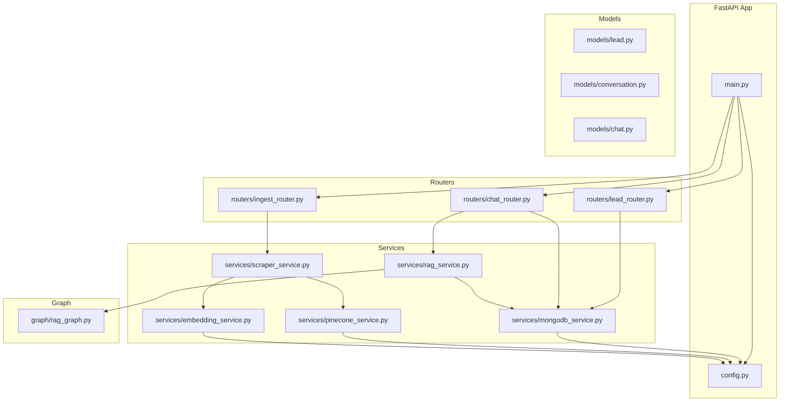
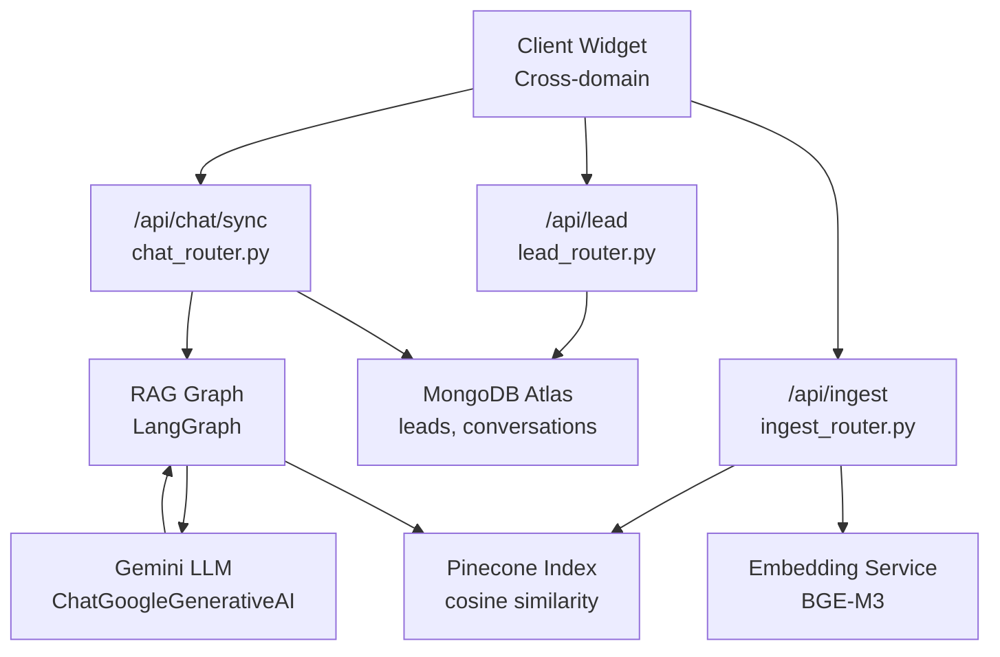
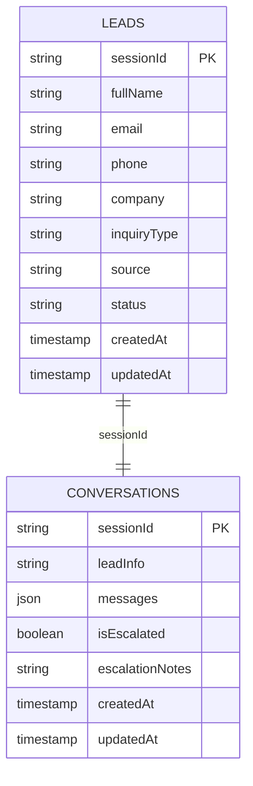
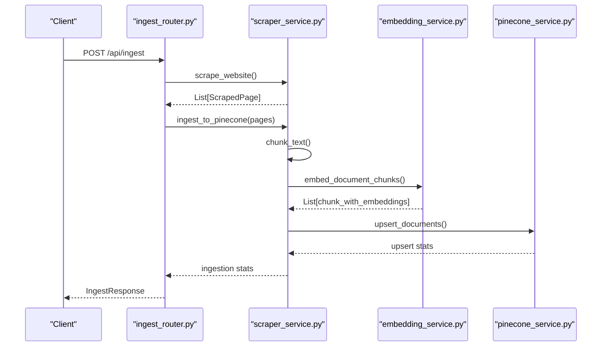
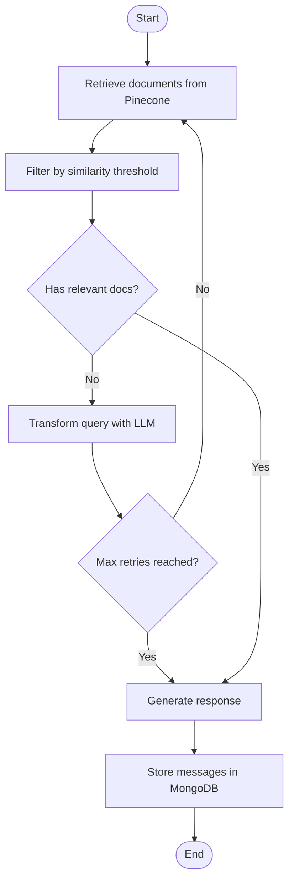
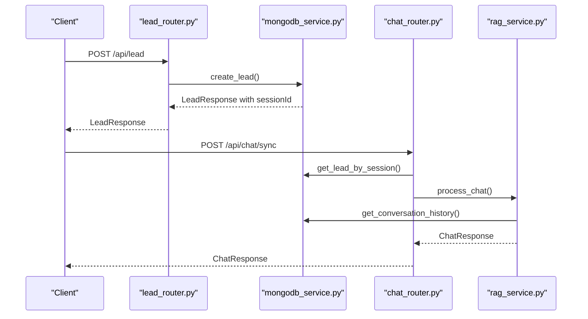
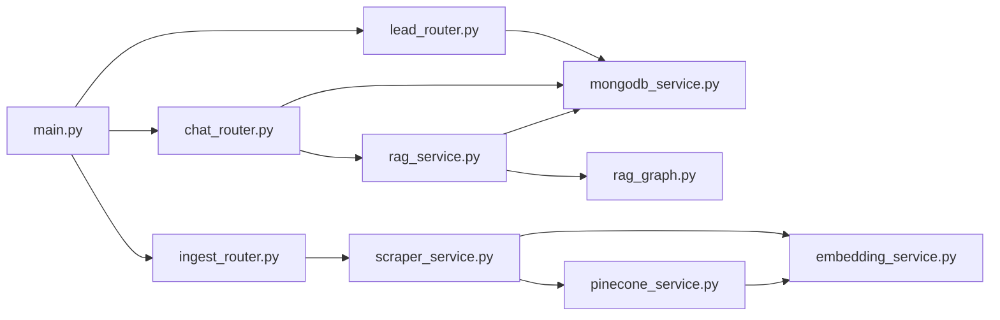

# Data Architecture

<cite>
**Referenced Files in This Document**
- [main.py](file://backend/app/main.py)
- [config.py](file://backend/app/config.py)
- [lead.py](file://backend/app/models/lead.py)
- [conversation.py](file://backend/app/models/conversation.py)
- [chat.py](file://backend/app/models/chat.py)
- [mongodb_service.py](file://backend/app/services/mongodb_service.py)
- [pinecone_service.py](file://backend/app/services/pinecone_service.py)
- [embedding_service.py](file://backend/app/services/embedding_service.py)
- [rag_service.py](file://backend/app/services/rag_service.py)
- [scraper_service.py](file://backend/app/services/scraper_service.py)
- [rag_graph.py](file://backend/app/graph/rag_graph.py)
- [lead_router.py](file://backend/app/routers/lead_router.py)
- [chat_router.py](file://backend/app/routers/chat_router.py)
- [ingest_router.py](file://backend/app/routers/ingest_router.py)
</cite>

## Table of Contents
1. [Introduction](#introduction)
2. [Project Structure](#project-structure)
3. [Core Components](#core-components)
4. [Architecture Overview](#architecture-overview)
5. [Detailed Component Analysis](#detailed-component-analysis)
6. [Dependency Analysis](#dependency-analysis)
7. [Performance Considerations](#performance-considerations)
8. [Troubleshooting Guide](#troubleshooting-guide)
9. [Conclusion](#conclusion)

## Introduction
This document describes the data architecture of the Hitech RAG Chatbot system, focusing on the dual-data store approach that combines MongoDB Atlas for structured data (leads, conversations) with Pinecone for vector embeddings. It explains the data models for Lead, Conversation, and Message entities, details the MongoDB schema design and indexing strategy, documents the vector database architecture with BGE-M3 embeddings and similarity search, and covers ingestion, session persistence, and cross-domain data sharing patterns.

## Project Structure
The backend is organized around a FastAPI application with clear separation of concerns:
- Models define Pydantic data structures for validation and serialization
- Services encapsulate data access and external integrations
- Routers expose REST endpoints
- Graph defines the RAG pipeline using LangGraph

**Diagram sources**
- [main.py:14-37](file://backend/app/main.py#L14-L37)
- [config.py:7-64](file://backend/app/config.py#L7-L64)
- [mongodb_service.py:13-48](file://backend/app/services/mongodb_service.py#L13-L48)
- [pinecone_service.py:10-56](file://backend/app/services/pinecone_service.py#L10-L56)
- [embedding_service.py:10-28](file://backend/app/services/embedding_service.py#L10-L28)
- [rag_service.py:11-18](file://backend/app/services/rag_service.py#L11-L18)
- [scraper_service.py:26-36](file://backend/app/services/scraper_service.py#L26-L36)
- [lead_router.py:11-56](file://backend/app/routers/lead_router.py#L11-L56)
- [chat_router.py:12-129](file://backend/app/routers/chat_router.py#L12-L129)
- [ingest_router.py:26-111](file://backend/app/routers/ingest_router.py#L26-L111)
- [rag_graph.py:40-69](file://backend/app/graph/rag_graph.py#L40-L69)

**Section sources**
- [main.py:39-85](file://backend/app/main.py#L39-L85)
- [config.py:7-64](file://backend/app/config.py#L7-L64)

## Core Components
This section outlines the primary data models and their roles in the system.

- Lead model: Captures customer information, session linkage, and lifecycle fields
- Conversation model: Stores message threads, escalation state, and timestamps
- Chat request/response models: Define chat interactions and human escalation flows
- MongoDB service: Provides CRUD operations, indexing, and session lifecycle management
- Pinecone service: Manages vector index creation, upsert, similarity search, and statistics
- Embedding service: Generates BGE-M3 embeddings for queries and documents
- RAG service: Orchestrates conversation history, vector retrieval, and response generation
- Scraper service: Extracts, chunks, embeds, and ingests content into Pinecone
- RAG graph: Implements the LangGraph workflow for retrieval, grading, and generation

**Section sources**
- [lead.py:18-64](file://backend/app/models/lead.py#L18-L64)
- [conversation.py:15-53](file://backend/app/models/conversation.py#L15-L53)
- [chat.py:7-45](file://backend/app/models/chat.py#L7-L45)
- [mongodb_service.py:13-202](file://backend/app/services/mongodb_service.py#L13-L202)
- [pinecone_service.py:10-186](file://backend/app/services/pinecone_service.py#L10-L186)
- [embedding_service.py:10-158](file://backend/app/services/embedding_service.py#L10-L158)
- [rag_service.py:11-116](file://backend/app/services/rag_service.py#L11-L116)
- [scraper_service.py:26-329](file://backend/app/services/scraper_service.py#L26-L329)
- [rag_graph.py:26-264](file://backend/app/graph/rag_graph.py#L26-L264)

## Architecture Overview
The system employs a dual-data store architecture:
- Structured data (leads and conversations) are persisted in MongoDB Atlas
- Unstructured knowledge is embedded and indexed in Pinecone
- The RAG pipeline retrieves relevant chunks, constructs context, and generates responses using a generative model

**Diagram sources**
- [main.py:59-62](file://backend/app/main.py#L59-L62)
- [lead_router.py:11-56](file://backend/app/routers/lead_router.py#L11-L56)
- [chat_router.py:12-129](file://backend/app/routers/chat_router.py#L12-L129)
- [ingest_router.py:26-111](file://backend/app/routers/ingest_router.py#L26-L111)
- [mongodb_service.py:13-48](file://backend/app/services/mongodb_service.py#L13-L48)
- [embedding_service.py:10-28](file://backend/app/services/embedding_service.py#L10-L28)
- [pinecone_service.py:10-56](file://backend/app/services/pinecone_service.py#L10-L56)
- [rag_graph.py:29-38](file://backend/app/graph/rag_graph.py#L29-L38)

## Detailed Component Analysis

### Data Models and Validation Rules
- Lead
  - Fields: fullName, email, phone, company, inquiryType, sessionId, createdAt, updatedAt, source, status
  - Validation: Phone number validation for Saudi Arabia formats; email validation via EmailStr
  - Relationships: One lead maps to one conversation via sessionId
- Conversation
  - Fields: sessionId, leadInfo snapshot, messages array, createdAt, updatedAt, isEscalated, escalationNotes
  - Validation: Message content length constraints; role enumeration
  - Relationships: One conversation per sessionId; escalation affects both conversation and lead status
- Message
  - Fields: role, content, timestamp, metadata
  - Validation: Role enumeration; content length constraints
- Chat request/response
  - Request: sessionId, message, context
  - Response: response, sessionId, timestamp, sources, model
  - Escalation request/response: sessionId, notes, urgency, estimatedResponseTime, ticketId

**Section sources**
- [lead.py:18-64](file://backend/app/models/lead.py#L18-L64)
- [conversation.py:15-53](file://backend/app/models/conversation.py#L15-L53)
- [chat.py:7-45](file://backend/app/models/chat.py#L7-L45)

### MongoDB Schema Design and Indexing Strategy
Collections:
- leads
  - Unique index on sessionId
  - Indexes on email, phone, createdAt
- conversations
  - Unique index on sessionId
  - Indexes on createdAt, isEscalated

Operations:
- Lead creation: Generates a UUID session, persists lead, and initializes an empty conversation
- Conversation creation: Creates a document with leadInfo snapshot and empty messages array
- Message management: Pushes new messages and updates timestamps
- Escalation: Sets isEscalated flag and stores escalation notes; also updates lead status
- Cleanup: Deletes expired non-escalated conversations based on updatedAt threshold

**Diagram sources**
- [mongodb_service.py:38-48](file://backend/app/services/mongodb_service.py#L38-L48)
- [mongodb_service.py:51-111](file://backend/app/services/mongodb_service.py#L51-L111)
- [mongodb_service.py:161-180](file://backend/app/services/mongodb_service.py#L161-L180)

**Section sources**
- [mongodb_service.py:36-48](file://backend/app/services/mongodb_service.py#L36-L48)
- [mongodb_service.py:51-111](file://backend/app/services/mongodb_service.py#L51-L111)
- [mongodb_service.py:161-180](file://backend/app/services/mongodb_service.py#L161-L180)

### Vector Database Architecture and Retrieval
Vector store:
- Pinecone index configured with cosine distance and dimension matching BGE-M3 (1024)
- Index auto-created if missing during initialization

Ingestion pipeline:
- Web scraping: Recursive extraction of pages, content cleaning, and link discovery
- Chunking: Overlapping text chunks sized by configuration (CHUNK_SIZE, CHUNK_OVERLAP)
- Embedding: BGE-M3 embeddings generated for document chunks
- Upsert: Vectors inserted into Pinecone with metadata (content, source, title, url, timestamp, chunk_index)

Similarity search:
- Query embedding generated using BGE-M3
- Top-K retrieval with configurable similarity threshold
- Results include content, source, title, and score

**Diagram sources**
- [ingest_router.py:26-73](file://backend/app/routers/ingest_router.py#L26-L73)
- [scraper_service.py:195-248](file://backend/app/services/scraper_service.py#L195-L248)
- [scraper_service.py:250-306](file://backend/app/services/scraper_service.py#L250-L306)
- [embedding_service.py:106-126](file://backend/app/services/embedding_service.py#L106-L126)
- [pinecone_service.py:62-106](file://backend/app/services/pinecone_service.py#L62-L106)

**Section sources**
- [pinecone_service.py:27-56](file://backend/app/services/pinecone_service.py#L27-L56)
- [scraper_service.py:164-194](file://backend/app/services/scraper_service.py#L164-L194)
- [scraper_service.py:250-306](file://backend/app/services/scraper_service.py#L250-L306)
- [embedding_service.py:106-126](file://backend/app/services/embedding_service.py#L106-L126)

### RAG Pipeline and Chat Flow
The RAG pipeline orchestrates retrieval, filtering, and generation:
- Retrieve: Similarity search against Pinecone using the current question
- Grade: Filter by similarity threshold
- Decide: If no documents or retries exhausted, transform query; otherwise generate
- Transform: Reformulate query using the LLM to improve retrieval
- Generate: Build system prompt with context, conversation history, and lead info; produce response

**Diagram sources**
- [rag_graph.py:71-121](file://backend/app/graph/rag_graph.py#L71-L121)
- [rag_graph.py:150-219](file://backend/app/graph/rag_graph.py#L150-L219)
- [rag_service.py:19-87](file://backend/app/services/rag_service.py#L19-L87)

**Section sources**
- [rag_graph.py:71-121](file://backend/app/graph/rag_graph.py#L71-L121)
- [rag_graph.py:150-219](file://backend/app/graph/rag_graph.py#L150-L219)
- [rag_service.py:19-87](file://backend/app/services/rag_service.py#L19-L87)

### Session Persistence and Lifecycle Management
- Session creation: Lead submission generates a unique sessionId and initializes an empty conversation
- Session continuity: Returning leads with existing emails reuse the same sessionId
- Conversation history: Stored messages are limited by configuration and appended with timestamps
- Escalation: Marks conversation as escalated, updates lead status, and records escalation notes
- Cleanup: Periodic deletion of expired non-escalated conversations based on updatedAt threshold

**Diagram sources**
- [lead_router.py:11-44](file://backend/app/routers/lead_router.py#L11-L44)
- [mongodb_service.py:51-77](file://backend/app/services/mongodb_service.py#L51-L77)
- [chat_router.py:12-55](file://backend/app/routers/chat_router.py#L12-L55)
- [rag_service.py:19-87](file://backend/app/services/rag_service.py#L19-L87)

**Section sources**
- [lead_router.py:11-44](file://backend/app/routers/lead_router.py#L11-L44)
- [mongodb_service.py:51-77](file://backend/app/services/mongodb_service.py#L51-L77)
- [chat_router.py:12-55](file://backend/app/routers/chat_router.py#L12-L55)
- [rag_service.py:19-87](file://backend/app/services/rag_service.py#L19-L87)

### Cross-Domain Data Sharing Patterns
- CORS configuration allows cross-origin requests from the embedded widget
- Health checks expose service connectivity status
- Endpoints are designed to accept sessionId for session continuity across domains

**Section sources**
- [main.py:50-57](file://backend/app/main.py#L50-L57)
- [main.py:74-83](file://backend/app/main.py#L74-L83)
- [chat.py:7-12](file://backend/app/models/chat.py#L7-L12)

## Dependency Analysis
The system exhibits layered dependencies:
- Application bootstrap initializes services and registers routers
- Routers depend on services for data operations
- RAG service depends on MongoDB for conversation history and on the graph for generation
- Scraper service depends on embedding and Pinecone services
- Pinecone service depends on embedding service for query embeddings

**Diagram sources**
- [main.py:59-62](file://backend/app/main.py#L59-L62)
- [lead_router.py:11-14](file://backend/app/routers/lead_router.py#L11-L14)
- [chat_router.py:12-16](file://backend/app/routers/chat_router.py#L12-L16)
- [ingest_router.py:26-31](file://backend/app/routers/ingest_router.py#L26-L31)
- [rag_service.py:14-17](file://backend/app/services/rag_service.py#L14-L17)
- [scraper_service.py:26-36](file://backend/app/services/scraper_service.py#L26-L36)
- [pinecone_service.py:21-25](file://backend/app/services/pinecone_service.py#L21-L25)
- [embedding_service.py:22-28](file://backend/app/services/embedding_service.py#L22-L28)

**Section sources**
- [main.py:59-62](file://backend/app/main.py#L59-L62)
- [rag_service.py:14-17](file://backend/app/services/rag_service.py#L14-L17)
- [scraper_service.py:26-36](file://backend/app/services/scraper_service.py#L26-L36)
- [pinecone_service.py:21-25](file://backend/app/services/pinecone_service.py#L21-L25)
- [embedding_service.py:22-28](file://backend/app/services/embedding_service.py#L22-L28)

## Performance Considerations
- Embedding dimensionality: BGE-M3 provides 1024-d embeddings; ensure Pinecone index dimension matches configuration
- Chunking strategy: Overlapping chunks improve recall; tune CHUNK_SIZE and CHUNK_OVERLAP for balance
- Query transformation: Retry mechanism reduces false negatives by reformulating queries
- Indexing: Proper indexes on sessionId, createdAt, and isEscalated optimize frequent lookups
- Batch upsert: Pinecone upsert batching minimizes network overhead
- Model loading: Singleton embedding service prevents repeated model initialization

[No sources needed since this section provides general guidance]

## Troubleshooting Guide
Common issues and resolutions:
- MongoDB connection failures: Verify URI and database name in configuration; check service lifecycle hooks
- Pinecone initialization errors: Confirm API key and index name; ensure index creation permissions
- Empty or low-relevance results: Adjust similarity threshold and top-K parameters; review chunking strategy
- Session not found: Ensure sessionId is passed correctly in chat requests; verify lead submission flow
- Escalation not recorded: Check MongoDB update operations and lead status synchronization

**Section sources**
- [config.py:15-23](file://backend/app/config.py#L15-L23)
- [pinecone_service.py:27-56](file://backend/app/services/pinecone_service.py#L27-L56)
- [mongodb_service.py:161-180](file://backend/app/services/mongodb_service.py#L161-L180)
- [chat_router.py:28-44](file://backend/app/routers/chat_router.py#L28-L44)

## Conclusion
The Hitech RAG Chatbot employs a robust dual-data store architecture: MongoDB Atlas for structured session and conversation data, and Pinecone for scalable vector retrieval powered by BGE-M3 embeddings. The system’s design emphasizes session continuity, efficient indexing, configurable chunking, and a flexible RAG pipeline with query transformation and escalation handling. Proper configuration of environment variables and adherence to the documented data models and flows ensure reliable operation across domains and use cases.