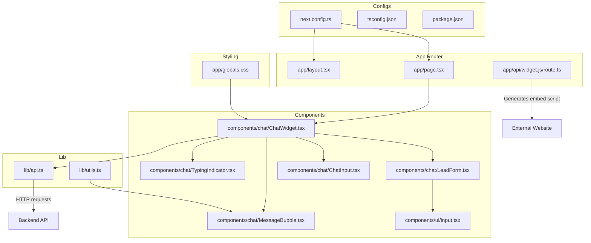
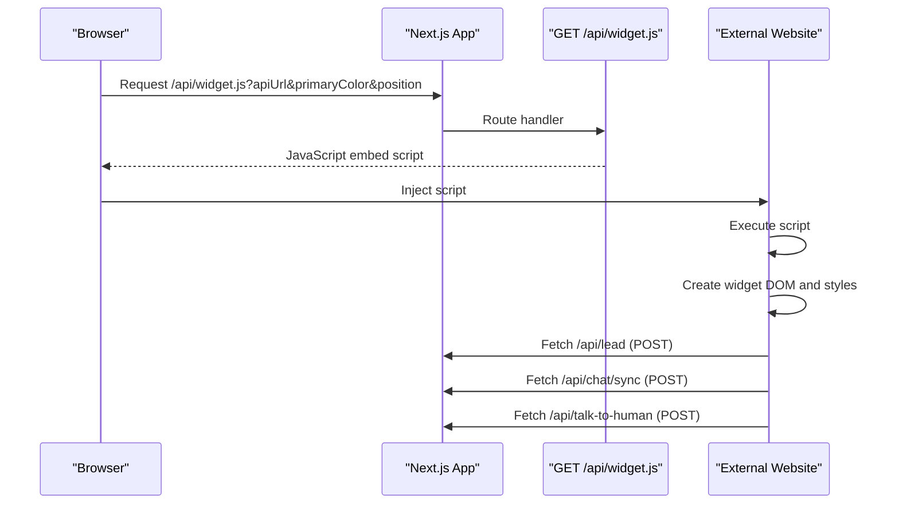
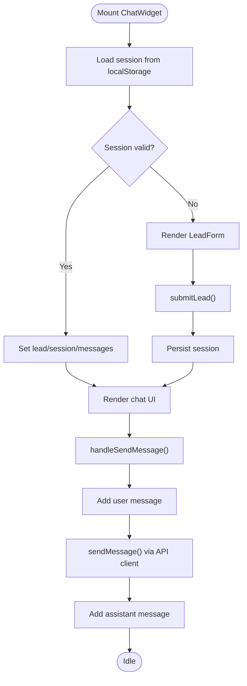
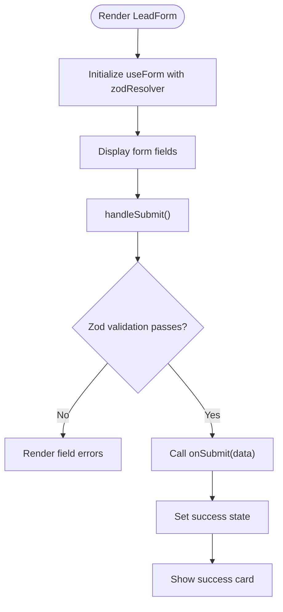
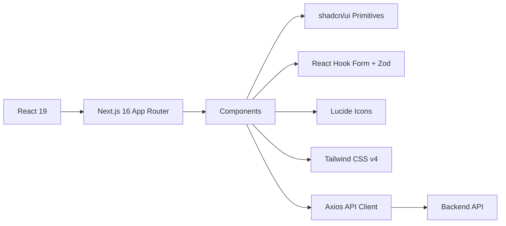

# Frontend Architecture

<cite>
**Referenced Files in This Document**
- [layout.tsx](file://frontend/app/layout.tsx)
- [page.tsx](file://frontend/app/page.tsx)
- [ChatWidget.tsx](file://frontend/components/chat/ChatWidget.tsx)
- [api.ts](file://frontend/lib/api.ts)
- [route.ts](file://frontend/app/api/widget.js/route.ts)
- [LeadForm.tsx](file://frontend/components/chat/LeadForm.tsx)
- [ChatInput.tsx](file://frontend/components/chat/ChatInput.tsx)
- [MessageBubble.tsx](file://frontend/components/chat/MessageBubble.tsx)
- [TypingIndicator.tsx](file://frontend/components/chat/TypingIndicator.tsx)
- [input.tsx](file://frontend/components/ui/input.tsx)
- [globals.css](file://frontend/app/globals.css)
- [utils.ts](file://frontend/lib/utils.ts)
- [package.json](file://frontend/package.json)
- [tsconfig.json](file://frontend/tsconfig.json)
- [next.config.ts](file://frontend/next.config.ts)
</cite>

## Table of Contents
1. [Introduction](#introduction)
2. [Project Structure](#project-structure)
3. [Core Components](#core-components)
4. [Architecture Overview](#architecture-overview)
5. [Detailed Component Analysis](#detailed-component-analysis)
6. [Dependency Analysis](#dependency-analysis)
7. [Performance Considerations](#performance-considerations)
8. [Troubleshooting Guide](#troubleshooting-guide)
9. [Conclusion](#conclusion)
10. [Appendices](#appendices)

## Introduction
This document describes the frontend architecture of the Next.js application that powers both a standalone chat page and an embeddable widget. It explains the App Router structure, component hierarchy, state management patterns, API client implementation, cross-origin communication handling via a server-generated embed script, styling system using Tailwind CSS and shadcn/ui primitives, responsive design patterns, TypeScript integration, and form handling with React Hook Form and Zod validation.

## Project Structure
The frontend is organized around Next.js App Router conventions:
- app/: Application routes, metadata, and global styles
- components/: Reusable UI and chat components
- lib/: Shared utilities and API client
- next.config.ts: Build configuration including static export and environment exposure
- tsconfig.json: Strict TypeScript configuration
- package.json: Dependencies including React 19, Next.js 16, Tailwind CSS v4, shadcn/ui primitives, React Hook Form, and Zod

**Diagram sources**
- [layout.tsx:1-20](file://frontend/app/layout.tsx#L1-L20)
- [page.tsx:1-12](file://frontend/app/page.tsx#L1-L12)
- [ChatWidget.tsx:1-307](file://frontend/components/chat/ChatWidget.tsx#L1-L307)
- [LeadForm.tsx:1-168](file://frontend/components/chat/LeadForm.tsx#L1-L168)
- [ChatInput.tsx:1-67](file://frontend/components/chat/ChatInput.tsx#L1-L67)
- [MessageBubble.tsx:1-77](file://frontend/components/chat/MessageBubble.tsx#L1-L77)
- [TypingIndicator.tsx:1-30](file://frontend/components/chat/TypingIndicator.tsx#L1-L30)
- [input.tsx:1-25](file://frontend/components/ui/input.tsx#L1-L25)
- [api.ts:1-93](file://frontend/lib/api.ts#L1-L93)
- [route.ts:1-347](file://frontend/app/api/widget.js/route.ts#L1-L347)
- [globals.css:1-27](file://frontend/app/globals.css#L1-L27)
- [utils.ts:1-7](file://frontend/lib/utils.ts#L1-L7)
- [next.config.ts:1-15](file://frontend/next.config.ts#L1-L15)
- [tsconfig.json:1-35](file://frontend/tsconfig.json#L1-L35)
- [package.json:1-37](file://frontend/package.json#L1-L37)

**Section sources**
- [layout.tsx:1-20](file://frontend/app/layout.tsx#L1-L20)
- [page.tsx:1-12](file://frontend/app/page.tsx#L1-L12)
- [next.config.ts:1-15](file://frontend/next.config.ts#L1-L15)
- [tsconfig.json:1-35](file://frontend/tsconfig.json#L1-L35)
- [package.json:1-37](file://frontend/package.json#L1-L37)

## Core Components
- ChatWidget: Central component orchestrating lead collection, chat lifecycle, typing indicators, and human escalation. Manages local session persistence and renders either LeadForm or the chat UI depending on state.
- LeadForm: Validates lead data with Zod and React Hook Form, renders a styled form using shadcn/ui primitives.
- ChatInput: Rich text input with auto-resize and Enter-to-send behavior.
- MessageBubble: Renders user and assistant messages with URL auto-linking and time formatting.
- TypingIndicator: Animated typing dots for assistant presence.
- API Client: Axios-based client exposing typed functions for lead submission, chat sync, human escalation, and conversation retrieval.
- Widget Generation Endpoint: Serves a JavaScript embed script that injects a floating chat widget into external websites.

**Section sources**
- [ChatWidget.tsx:1-307](file://frontend/components/chat/ChatWidget.tsx#L1-L307)
- [LeadForm.tsx:1-168](file://frontend/components/chat/LeadForm.tsx#L1-L168)
- [ChatInput.tsx:1-67](file://frontend/components/chat/ChatInput.tsx#L1-L67)
- [MessageBubble.tsx:1-77](file://frontend/components/chat/MessageBubble.tsx#L1-L77)
- [TypingIndicator.tsx:1-30](file://frontend/components/chat/TypingIndicator.tsx#L1-L30)
- [api.ts:1-93](file://frontend/lib/api.ts#L1-L93)
- [route.ts:1-347](file://frontend/app/api/widget.js/route.ts#L1-L347)

## Architecture Overview
The frontend supports two deployment modes:
- Standalone page: A centered chat widget rendered on the home page.
- Embeddable widget: A server-generated script that injects a floating chat interface into third-party websites.

**Diagram sources**
- [route.ts:1-347](file://frontend/app/api/widget.js/route.ts#L1-L347)

## Detailed Component Analysis

### ChatWidget Component
Responsibilities:
- Session lifecycle: load/save to localStorage with TTL, manage lead info, messages, typing state, escalation state.
- Dual UI rendering: LeadForm when unauthenticated, chat UI otherwise.
- Chat actions: send messages, escalate to human, toggle open/close.
- Embedded vs floating mode: renders a compact floating widget or a full-page embedded container.

State management patterns:
- useState for UI state and component-controlled open state.
- useRef for DOM scrolling to latest message.
- localStorage for persistent session across browser sessions.

**Diagram sources**
- [ChatWidget.tsx:1-307](file://frontend/components/chat/ChatWidget.tsx#L1-L307)
- [api.ts:61-80](file://frontend/lib/api.ts#L61-L80)

**Section sources**
- [ChatWidget.tsx:1-307](file://frontend/components/chat/ChatWidget.tsx#L1-L307)

### LeadForm Component
Validation and UX:
- Zod schema enforces name, email, Saudi Arabia phone number, optional company and inquiry type.
- React Hook Form integrates validation, error display, and controlled inputs.
- Styled with shadcn/ui primitives (Input, Label, Button, Card) and Tailwind classes.

**Diagram sources**
- [LeadForm.tsx:1-168](file://frontend/components/chat/LeadForm.tsx#L1-L168)

**Section sources**
- [LeadForm.tsx:1-168](file://frontend/components/chat/LeadForm.tsx#L1-L168)

### ChatInput Component
Features:
- Auto-resize textarea up to a max height.
- Enter-to-send with Shift+Enter for new lines.
- Disabled states for loading or escalation.

**Section sources**
- [ChatInput.tsx:1-67](file://frontend/components/chat/ChatInput.tsx#L1-L67)

### MessageBubble Component
Rendering:
- Different styling for user vs assistant.
- URL auto-linking with target blank and rel attributes.
- Timestamp formatting with localized time.

**Section sources**
- [MessageBubble.tsx:1-77](file://frontend/components/chat/MessageBubble.tsx#L1-L77)

### TypingIndicator Component
Behavior:
- Animated bouncing dots indicating assistant typing.

**Section sources**
- [TypingIndicator.tsx:1-30](file://frontend/components/chat/TypingIndicator.tsx#L1-L30)

### API Client
Endpoints:
- POST /api/lead: Lead submission, returns session ID and lead info.
- POST /api/chat/sync: Chat message send, returns assistant response and timestamp.
- POST /api/talk-to-human: Escalation to human, returns success and optional ticket info.
- GET /api/conversation/{sessionId}: Retrieve conversation history.
- GET /api/health: Health check.

Types:
- Strongly typed request/response interfaces for all endpoints.

**Section sources**
- [api.ts:1-93](file://frontend/lib/api.ts#L1-L93)

### Widget Generation Endpoint
Purpose:
- Serve a self-contained JavaScript embed script that:
  - Loads/stores session in localStorage.
  - Creates a floating chat widget with configurable primary color and position.
  - Renders LeadForm or chat UI dynamically.
  - Sends requests to the configured API URL.

Parameters:
- apiUrl: Backend base URL override.
- primaryColor: Brand color for gradients.
- position: bottom-right or top-left positioning.

**Section sources**
- [route.ts:1-347](file://frontend/app/api/widget.js/route.ts#L1-L347)

## Dependency Analysis
External libraries and integrations:
- React 19 and Next.js 16 App Router for routing and SSR/SSG.
- Tailwind CSS v4 for utility-first styling and theme tokens.
- shadcn/ui primitives for accessible, customizable UI components.
- React Hook Form + Zod for form validation and state.
- Axios for HTTP client abstraction.
- Lucide icons for UI symbols.

**Diagram sources**
- [package.json:11-35](file://frontend/package.json#L11-L35)
- [ChatWidget.tsx:1-307](file://frontend/components/chat/ChatWidget.tsx#L1-L307)
- [LeadForm.tsx:1-168](file://frontend/components/chat/LeadForm.tsx#L1-L168)
- [input.tsx:1-25](file://frontend/components/ui/input.tsx#L1-L25)
- [api.ts:1-93](file://frontend/lib/api.ts#L1-L93)

**Section sources**
- [package.json:1-37](file://frontend/package.json#L1-L37)

## Performance Considerations
- Static export: next.config.ts sets output to export and distDir to dist, enabling static hosting.
- Minimal re-renders: Localized state in ChatWidget and memoization-friendly message rendering.
- Efficient DOM updates: Auto-resizing textarea and scroll-to-bottom only on message changes.
- Lightweight embed script: Single self-executing function with minimal DOM manipulation.

[No sources needed since this section provides general guidance]

## Troubleshooting Guide
Common issues and resolutions:
- API connectivity:
  - Verify NEXT_PUBLIC_API_URL in next.config.ts matches backend address.
  - Check CORS on backend for /api/lead, /api/chat/sync, and /api/talk-to-human.
- Widget not appearing:
  - Confirm /api/widget.js is reachable and returns JavaScript content-type.
  - Ensure external site allows script execution and does not block localStorage.
- Validation errors:
  - LeadForm requires valid Saudi phone number pattern; adjust input accordingly.
- Styling inconsistencies:
  - Ensure Tailwind is properly initialized and globals.css is included.

**Section sources**
- [next.config.ts:1-15](file://frontend/next.config.ts#L1-L15)
- [route.ts:1-347](file://frontend/app/api/widget.js/route.ts#L1-L347)
- [LeadForm.tsx:1-168](file://frontend/components/chat/LeadForm.tsx#L1-L168)
- [globals.css:1-27](file://frontend/app/globals.css#L1-L27)

## Conclusion
The frontend combines a modern Next.js App Router with a reusable, embeddable chat widget. It leverages strong typing, form validation, and a clean component hierarchy to deliver a responsive, accessible chat experience. The widget generation endpoint enables seamless integration into external websites while maintaining consistent branding and behavior.

[No sources needed since this section summarizes without analyzing specific files]

## Appendices

### Responsive Design Patterns
- Mobile-first Tailwind utilities applied across components.
- Auto-resizing textarea and constrained message widths for readability.
- Fixed-position floating widget with adjustable placement.

**Section sources**
- [ChatWidget.tsx:285-305](file://frontend/components/chat/ChatWidget.tsx#L285-L305)
- [ChatInput.tsx:44-66](file://frontend/components/chat/ChatInput.tsx#L44-L66)
- [MessageBubble.tsx:43-76](file://frontend/components/chat/MessageBubble.tsx#L43-L76)

### TypeScript Integration
- Strict compiler options, JSX transform, and bundler module resolution.
- Strongly typed API client interfaces and form data.

**Section sources**
- [tsconfig.json:1-35](file://frontend/tsconfig.json#L1-L35)
- [api.ts:13-58](file://frontend/lib/api.ts#L13-L58)
- [LeadForm.tsx:13-21](file://frontend/components/chat/LeadForm.tsx#L13-L21)

### Styling System
- Tailwind CSS v4 with theme tokens and dark mode support.
- shadcn/ui primitives for consistent, accessible UI elements.
- Utility class composition via cn helper.

**Section sources**
- [globals.css:1-27](file://frontend/app/globals.css#L1-L27)
- [input.tsx:1-25](file://frontend/components/ui/input.tsx#L1-L25)
- [utils.ts:1-7](file://frontend/lib/utils.ts#L1-L7)

### Cross-Origin Communication
- Widget endpoint generates a script that runs in the host page’s context.
- Uses fetch to call the configured backend API URL.
- Relies on host page’s localStorage for session persistence.

**Section sources**
- [route.ts:67-92](file://frontend/app/api/widget.js/route.ts#L67-L92)
- [route.ts:34-64](file://frontend/app/api/widget.js/route.ts#L34-L64)